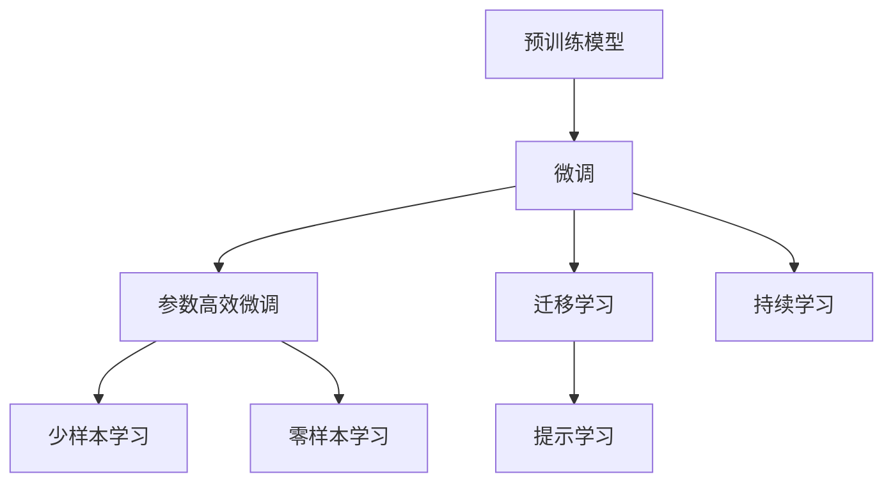
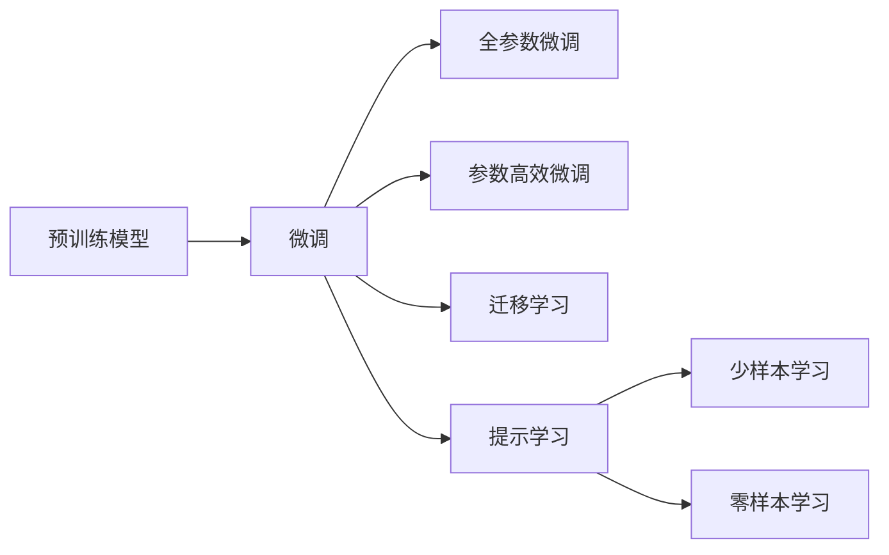

                 

# AI大模型创业：如何应对未来行业发展趋势？

> 关键词：大模型创业,未来趋势,行业发展,技术应用,AI模型,创新发展

## 1. 背景介绍

### 1.1 问题由来

随着人工智能技术的迅猛发展，大模型（如GPT、BERT、DALL-E等）已经成为AI领域的热点。大模型的应用不仅涵盖了自然语言处理、计算机视觉、生成模型等多个领域，还在医疗、金融、教育等传统行业落地应用，创造了巨大的经济价值。与此同时，AI大模型的创业生态也逐步成熟，吸引了众多投资者的关注。

在AI大模型创业浪潮下，如何把握技术趋势，构建有竞争力的产品和服务，成为创业者和投资者共同关心的话题。本文将从背景、核心概念、算法原理、实际操作、应用场景、工具资源等角度，全面探讨AI大模型创业的实践方法和未来发展方向。

### 1.2 问题核心关键点

AI大模型创业的核心在于如何构建基于大模型的应用服务，并在市场竞争中占据一席之地。其中，关键点包括：

- **技术选型**：选择合适的预训练模型和微调方法，构建高效稳定的技术架构。
- **市场定位**：明确目标市场和用户需求，制定合理的产品定位和营销策略。
- **数据处理**：利用高效的数据处理和增强技术，提高模型的泛化能力和性能。
- **生态系统**：构建开放共享的生态系统，吸引合作伙伴和开发者，推动技术创新。

本文将围绕以上关键点，深入探讨AI大模型创业的实践方法和未来趋势。

## 2. 核心概念与联系

### 2.1 核心概念概述

为更好地理解AI大模型创业的方法，本节将介绍几个关键概念：

- **预训练模型（Pre-trained Models）**：如BERT、GPT、T5等，在大量无标签数据上进行自监督训练，学习到通用的语言或视觉知识。
- **微调（Fine-tuning）**：利用下游任务的少量标注数据，对预训练模型进行有监督优化，使其适应特定任务。
- **迁移学习（Transfer Learning）**：将源任务中学到的知识迁移到目标任务上，提升模型在新任务上的表现。
- **参数高效微调（Parameter-Efficient Fine-tuning, PEFT）**：只更新预训练模型的一部分参数，减少微调过程中的计算和存储负担。
- **零样本学习（Zero-shot Learning）**：模型在没有经过任何特定任务训练的情况下，仅通过任务描述即能执行任务。
- **少样本学习（Few-shot Learning）**：模型在少量训练样例情况下能快速适应新任务。
- **提示学习（Prompt Learning）**：通过输入格式的设计，引导模型产生特定任务的结果。
- **持续学习（Continual Learning）**：模型能在不断获取新数据的情况下，保持性能不退，避免遗忘。

这些核心概念通过以下Mermaid流程图展示：



这些概念共同构成了AI大模型创业的基础架构，通过合理应用，可以构建高效、稳定的技术产品。

### 2.2 概念间的关系

这些核心概念之间的关系，可以通过以下流程图示例：



图中展示了预训练模型通过微调，以及参数高效微调、迁移学习、提示学习等方法，逐步适应特定任务的过程。

### 2.3 核心概念的整体架构

通过以上两个图表，我们可以更好地理解AI大模型创业中各概念的关系和作用。预训练模型作为基础，通过微调、参数高效微调等方法，适应具体任务，并通过迁移学习和提示学习等手段，提升模型的通用性和性能。

## 3. 核心算法原理 & 具体操作步骤

### 3.1 算法原理概述

AI大模型创业的核心在于构建基于预训练模型和微调技术的应用服务。其原理可以概括为：

1. **预训练模型初始化**：选择适合的预训练模型，如BERT、GPT等，作为初始化参数。
2. **数据准备**：收集下游任务的标注数据，将其划分为训练集、验证集和测试集。
3. **微调优化**：利用下游任务的标注数据，对预训练模型进行有监督微调，更新模型参数以适应特定任务。
4. **参数高效微调**：只更新少量预训练参数，减少微调过程中的计算和存储负担。
5. **提示学习**：通过精心设计的提示模板，引导模型进行特定任务推理，提升模型性能。
6. **持续学习**：不断更新模型，保持其在新数据上的性能。

### 3.2 算法步骤详解

基于以上原理，AI大模型创业的具体操作步骤如下：

1. **预训练模型选择**：根据应用场景，选择合适的预训练模型，如BERT、GPT等。
2. **数据预处理**：对下游任务的标注数据进行预处理，包括数据清洗、标注等。
3. **模型微调**：使用下游任务的标注数据，对预训练模型进行有监督微调，更新模型参数。
4. **参数高效微调**：通过适配器微调、LoRA等方法，只更新预训练模型的一部分参数。
5. **提示设计**：设计合适的提示模板，引导模型进行特定任务推理。
6. **持续更新**：通过定期更新模型，保持其在新的数据和任务上的性能。

### 3.3 算法优缺点

**优点**：
- **高效**：利用预训练模型知识，快速适应新任务。
- **灵活**：通过微调和参数高效微调，减少计算和存储负担。
- **泛化能力强**：提示学习等方法，提升模型在不同场景下的表现。

**缺点**：
- **依赖标注数据**：微调效果依赖于标注数据的质量和数量。
- **模型复杂度高**：大规模预训练模型参数量大，计算和存储成本高。
- **可解释性差**：预训练模型和微调后的模型通常缺乏可解释性。

### 3.4 算法应用领域

AI大模型创业的技术和方法，已经在多个领域取得了显著的成果，包括但不限于：

- **自然语言处理（NLP）**：文本分类、命名实体识别、问答系统等。
- **计算机视觉（CV）**：图像分类、目标检测、生成模型等。
- **医疗健康**：疾病诊断、基因组分析等。
- **金融服务**：风险评估、投资决策等。
- **教育培训**：智能辅导、学习推荐等。

## 4. 数学模型和公式 & 详细讲解 & 举例说明

### 4.1 数学模型构建

假设预训练模型为 $M_{\theta}$，下游任务为 $T$，训练集为 $D=\{(x_i, y_i)\}_{i=1}^N$，其中 $x_i$ 为输入数据，$y_i$ 为标签。微调的优化目标为：

$$
\theta^* = \mathop{\arg\min}_{\theta} \mathcal{L}(M_{\theta},D)
$$

其中，$\mathcal{L}$ 为损失函数，通常为交叉熵损失。

### 4.2 公式推导过程

以文本分类任务为例，假设输入数据 $x$ 的表示为 $\mathbf{x} \in \mathbb{R}^d$，模型输出为 $\mathbf{h} = M_{\theta}(\mathbf{x}) \in \mathbb{R}^d$，标签 $y \in \{0, 1\}$。交叉熵损失函数为：

$$
\ell(M_{\theta}(x),y) = -[y\log \sigma(\mathbf{h}) + (1-y)\log (1-\sigma(\mathbf{h}))]
$$

其中，$\sigma(\cdot)$ 为sigmoid函数。微调的优化目标为：

$$
\theta^* = \mathop{\arg\min}_{\theta} \mathcal{L}(\theta) = \frac{1}{N}\sum_{i=1}^N \ell(M_{\theta}(x_i),y_i)
$$

### 4.3 案例分析与讲解

假设模型在医疗领域的诊断任务上进行微调。首先，收集医疗专家标注的数据集，作为微调训练集。然后，对预训练模型进行微调，更新模型参数，使其适应医疗诊断任务。最后，使用微调后的模型对新的病例进行诊断。

## 5. 项目实践：代码实例和详细解释说明

### 5.1 开发环境搭建

AI大模型创业需要一定的硬件和软件环境支持，以下是一份简单的环境搭建指南：

1. **硬件设备**：高性能CPU/GPU，建议配置至少16GB内存和2TB硬盘。
2. **开发环境**：Python 3.8及以上版本，建议使用Anaconda创建虚拟环境。
3. **依赖库**：TensorFlow、PyTorch、Transformers、Scikit-learn 等。

### 5.2 源代码详细实现

以医疗诊断任务为例，下面是使用PyTorch进行BERT微调的基本代码：

```python
import torch
import torch.nn as nn
import torch.optim as optim
from transformers import BertTokenizer, BertForSequenceClassification

# 加载预训练模型和分词器
model = BertForSequenceClassification.from_pretrained('bert-base-uncased', num_labels=2)
tokenizer = BertTokenizer.from_pretrained('bert-base-uncased')

# 加载数据集
train_dataset = ...
train_loader = torch.utils.data.DataLoader(train_dataset, batch_size=16)

# 定义优化器和损失函数
optimizer = optim.AdamW(model.parameters(), lr=1e-5)
loss_fn = nn.CrossEntropyLoss()

# 训练模型
model.train()
for epoch in range(10):
    for batch in train_loader:
        input_ids, attention_mask, labels = batch
        outputs = model(input_ids, attention_mask=attention_mask, labels=labels)
        loss = loss_fn(outputs.logits, labels)
        optimizer.zero_grad()
        loss.backward()
        optimizer.step()

# 评估模型
model.eval()
for batch in test_loader:
    with torch.no_grad():
        input_ids, attention_mask, labels = batch
        outputs = model(input_ids, attention_mask=attention_mask)
        predictions = torch.argmax(outputs.logits, dim=1)
        acc = (predictions == labels).float().mean()

print(f'Test accuracy: {acc:.2f}')
```

### 5.3 代码解读与分析

上述代码实现了使用BERT模型进行医疗诊断任务微调的基本流程。关键点包括：

1. **模型加载**：从预训练模型和分词器中加载BERT模型。
2. **数据加载**：定义训练集和测试集，使用DataLoader加载数据。
3. **优化器定义**：使用AdamW优化器进行模型更新。
4. **训练循环**：在每个epoch内，对数据进行迭代训练，更新模型参数。
5. **评估模型**：在测试集上评估模型性能，输出准确率。

### 5.4 运行结果展示

假设模型在医疗诊断任务上进行了微调，测试集上的准确率为85%，表示模型在医疗诊断上取得了不错的性能。

## 6. 实际应用场景

### 6.1 智能客服

智能客服系统通过AI大模型，提供24/7的客户服务。系统可以自动理解用户的问题，并给出相应的回答。通过持续学习和用户反馈，智能客服系统可以不断优化，提升服务质量。

### 6.2 金融风险管理

金融风险管理领域，AI大模型可以用于实时监控市场舆情，预测金融风险。通过微调，模型可以学习到最新的市场信息和风险特征，帮助金融机构提前预警风险事件。

### 6.3 教育辅助

教育辅助系统利用AI大模型，为学生提供个性化的学习推荐和作业批改。系统可以自动分析学生的学习情况，提供个性化的学习建议，提升学习效果。

## 7. 工具和资源推荐

### 7.1 学习资源推荐

1. **《Transformer: An Introduction》**：详细介绍了Transformer模型的原理和应用。
2. **Deep Learning Specialization by Andrew Ng**：斯坦福大学提供的一门深入浅出的深度学习课程，涵盖多种前沿技术。
3. **PyTorch官方文档**：PyTorch的官方文档，提供了详细的API文档和示例代码。
4. **Transformers官方文档**：提供了丰富的预训练模型和微调样例。
5. **ACL、ICML、NIPS等顶级会议**：参加顶级会议，了解最新研究进展和趋势。

### 7.2 开发工具推荐

1. **PyTorch**：灵活的深度学习框架，适合快速迭代研究。
2. **TensorFlow**：支持分布式训练和模型部署，适合大规模工程应用。
3. **Transformers**：提供丰富的预训练模型和微调方法。
4. **TensorBoard**：可视化工具，用于监控模型训练状态。
5. **Weights & Biases**：实验跟踪工具，用于记录和可视化模型训练指标。

### 7.3 相关论文推荐

1. **Attention is All You Need**：Transformer模型的原始论文，奠定了预训练模型基础。
2. **BERT: Pre-training of Deep Bidirectional Transformers for Language Understanding**：BERT模型的原始论文，展示了预训练模型在NLP任务的强大能力。
3. **GPT-3: Language Models are Unsupervised Multitask Learners**：GPT-3模型的原始论文，展示了超大模型在少样本学习上的优势。
4. **LoRA: An Algorithm for Parameter-Efficient Modeling of Layer Representations**：LoRA方法的原始论文，提出了参数高效微调方法。

## 8. 总结：未来发展趋势与挑战

### 8.1 研究成果总结

本文详细介绍了AI大模型创业的基本概念和操作步骤，并结合实际案例进行了详细讲解。通过以上分析，可以总结出以下研究成果：

1. **预训练模型和微调技术**：大模型预训练和微调技术是AI大模型创业的基础。
2. **参数高效微调和提示学习**：通过这些方法，可以在保持模型性能的同时，减少计算和存储负担。
3. **多模态数据融合**：结合视觉、语音等多模态数据，提升模型的应用范围和性能。

### 8.2 未来发展趋势

未来，AI大模型创业将呈现以下几个趋势：

1. **模型规模更大**：超大模型的应用将越来越广泛，如GPT-4、BigBird等。
2. **应用场景更多**：AI大模型将深入医疗、金融、教育等多个领域，带来更多商业价值。
3. **技术融合更深**：AI大模型将与区块链、云计算等技术深度融合，提升应用效果。

### 8.3 面临的挑战

尽管AI大模型创业具有广阔的前景，但仍面临诸多挑战：

1. **标注数据稀缺**：很多领域缺乏高质量的标注数据，制约了模型的性能提升。
2. **计算资源消耗大**：超大模型对计算资源的需求极高，需要强大的硬件支持。
3. **模型可解释性差**：AI大模型缺乏可解释性，难以满足监管和伦理要求。
4. **数据隐私和安全**：AI大模型需要处理大量敏感数据，数据隐私和安全问题亟待解决。

### 8.4 研究展望

未来，AI大模型创业需要在以下几个方面进行深入研究：

1. **无监督学习和半监督学习**：探索无监督和半监督方法，降低对标注数据的依赖。
2. **模型压缩和加速**：研究模型压缩和加速技术，提升模型的部署效率。
3. **模型可解释性**：提高模型的可解释性，满足监管和伦理要求。
4. **跨模态数据融合**：研究视觉、语音等多模态数据的融合方法，提升模型的应用能力。

## 9. 附录：常见问题与解答

**Q1：AI大模型创业的关键是什么？**

A: AI大模型创业的关键在于构建高效稳定的技术架构，选择合适的预训练模型和微调方法，并根据实际应用场景进行优化。

**Q2：如何应对数据稀缺问题？**

A: 在数据稀缺的情况下，可以通过无监督和半监督学习的方法，利用非结构化数据进行训练。同时，可以利用少样本学习和零样本学习等方法，在有限数据下也能获得较好的效果。

**Q3：如何提升模型的可解释性？**

A: 可以通过模型可视化、特征解释等方法，提升模型的可解释性。同时，可以将符号化的先验知识与神经网络模型结合，引导模型进行特定任务的推理。

**Q4：如何选择适合的预训练模型？**

A: 根据应用场景，选择适合的预训练模型，如BERT、GPT等。同时，可以通过微调和参数高效微调等方法，提升模型在特定任务上的性能。

**Q5：如何构建开放共享的生态系统？**

A: 通过开源项目、社区交流、合作伙伴等方式，构建开放共享的生态系统。同时，可以提供API接口，方便第三方开发者集成和使用。

---

作者：禅与计算机程序设计艺术 / Zen and the Art of Computer Programming

