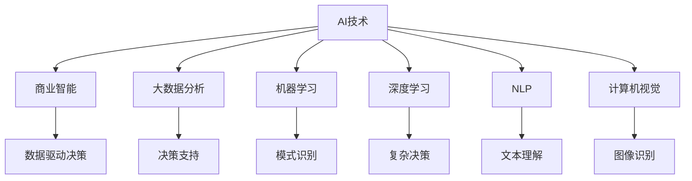
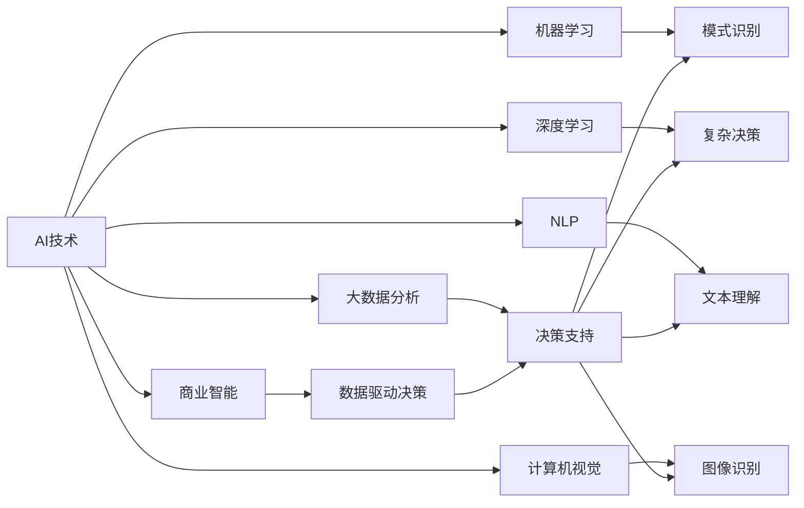

                 

## 1. 背景介绍

人工智能(AI)技术已经成为驱动商业创新和转型的关键力量。随着计算能力的提升和数据量的激增，AI技术在多个行业领域展现出巨大的应用潜力和商业价值。从智能客服到个性化推荐，从自动驾驶到医疗诊断，AI技术的广泛应用正在重塑传统行业的商业模式。然而，尽管AI技术带来了诸多创新机会，其在商业应用中的潜在价值尚未完全释放。本文旨在探索AI技术与商业模式的创新路径，帮助企业在数字时代中实现转型升级。

### 1.1 问题由来

在AI技术迅速发展的今天，众多企业正积极探索如何通过AI技术提升业务效率、降低成本、创造新的价值点。然而，将AI技术与现有业务流程和商业模式相结合，仍然面临不少挑战。其中，缺乏清晰的商业应用场景和创新路径，是许多企业无法有效落地AI技术的主要原因之一。此外，数据隐私、算法透明性、伦理问题等难题，也亟需行业共同解决。

### 1.2 问题核心关键点

要成功实现AI技术的商业化应用，需要回答以下核心问题：
1. **AI技术如何适配商业需求？**：将AI技术转化为实际业务场景，需要明确商业目标和需求。
2. **数据如何驱动AI模型？**：高质量的数据是AI技术高效运作的基础。
3. **算法如何提升业务价值？**：设计合理的算法和模型，才能实现AI技术的商业价值最大化。
4. **商业化路径如何选择？**：选择适合的商业模式和应用场景，确保AI技术的有效落地。
5. **如何保障数据隐私与算法透明性？**：确保AI技术的商业应用符合伦理和法律要求。

## 2. 核心概念与联系

### 2.1 核心概念概述

为更好地理解AI技术在商业模式创新中的应用，本节将介绍几个密切相关的核心概念：

- **AI技术**：指通过计算机算法和数据处理，实现自动感知、学习和决策的人工智能技术。
- **商业智能(Business Intelligence, BI)**：利用数据、算法和可视化工具，支持企业决策和运营优化的技术。
- **大数据分析**：利用大数据技术和算法，挖掘和分析海量数据，为企业决策提供支持。
- **机器学习(Machine Learning, ML)**：一种利用数据和算法，使计算机具备学习能力的AI分支。
- **深度学习(Deep Learning, DL)**：一种特殊类型的机器学习，通过多层次的神经网络结构，实现更复杂的模式识别和数据处理。
- **自然语言处理(Natural Language Processing, NLP)**：使计算机能够理解、生成和分析人类语言的技术。
- **计算机视觉(Computer Vision, CV)**：使计算机能够识别、分析图像和视频内容的技术。

这些核心概念之间的逻辑关系可以通过以下Mermaid流程图来展示：



这个流程图展示了AI技术在商业应用中的主要分支及其与商业智能和决策支持的关系。

### 2.2 概念间的关系

这些核心概念之间存在着紧密的联系，形成了AI技术在商业应用中的完整生态系统。下面是更详细的概念关系图：



这个关系图展示了AI技术在商业智能和决策支持中的具体应用，以及各分支技术如何相互配合，共同支撑企业决策和运营。

## 3. 核心算法原理 & 具体操作步骤
### 3.1 算法原理概述

AI技术在商业应用中的核心算法原理，主要涉及数据处理、模型训练和决策推理三个方面。

**数据处理**：通过清洗、筛选、归一化等技术，将原始数据转化为可用于模型训练和分析的格式。

**模型训练**：利用机器学习或深度学习算法，训练模型以识别数据中的模式和规律。

**决策推理**：根据训练好的模型，对新数据进行预测和决策，支持企业运营和决策。

### 3.2 算法步骤详解

AI技术在商业应用中通常遵循以下步骤：

**Step 1: 需求分析**
- 明确商业目标和需求，确定AI技术的应用场景。
- 分析业务流程，识别可以引入AI技术的关键环节。

**Step 2: 数据收集与预处理**
- 收集相关数据，包括客户数据、销售数据、运营数据等。
- 清洗数据，去除噪声和异常值，确保数据质量。

**Step 3: 模型选择与训练**
- 根据业务需求，选择合适的机器学习或深度学习模型。
- 利用训练数据集训练模型，调整模型参数，优化模型性能。

**Step 4: 模型评估与优化**
- 使用测试数据集评估模型性能，包括准确率、召回率、F1分数等指标。
- 根据评估结果，调整模型参数和训练策略，优化模型性能。

**Step 5: 应用部署与监控**
- 将训练好的模型部署到生产环境中，进行实时预测和决策。
- 持续监控模型性能，定期更新模型参数，保持模型活力。

### 3.3 算法优缺点

AI技术在商业应用中的优点包括：
1. **提升效率**：自动化处理复杂任务，提升工作效率。
2. **优化决策**：通过数据驱动决策，提高决策的科学性和精准性。
3. **降低成本**：减少人力成本和运营成本。
4. **增强竞争力**：通过技术创新，提升企业市场竞争力。

然而，AI技术在商业应用中也存在一些缺点：
1. **技术门槛高**：需要具备一定的技术能力和资源投入。
2. **数据隐私问题**：需要合理处理数据隐私和伦理问题。
3. **算法透明性**：模型的决策过程难以解释，可能导致信任问题。
4. **依赖高质量数据**：数据质量直接影响模型效果。
5. **成本高**：初期投入较大，包括数据收集、模型训练和部署成本。

### 3.4 算法应用领域

AI技术在商业应用中涉及多个领域，以下是几个典型应用场景：

- **智能客服**：通过NLP和语音识别技术，自动处理客户咨询和投诉，提升客户满意度。
- **个性化推荐**：利用深度学习模型，对用户行为进行分析和预测，提供个性化商品推荐。
- **风险管理**：通过大数据分析，识别潜在风险和欺诈行为，提升金融安全。
- **供应链优化**：利用机器学习模型，优化供应链管理和物流调度，降低运营成本。
- **医疗诊断**：通过计算机视觉和NLP技术，辅助医生进行疾病诊断和病历分析，提升诊疗效率。
- **智能制造**：利用机器视觉和自动化技术，实现生产线的智能化和自动化，提高生产效率和质量。

## 4. 数学模型和公式 & 详细讲解 & 举例说明
### 4.1 数学模型构建

本节将使用数学语言对AI技术在商业应用中的主要算法进行严格刻画。

**机器学习模型**：假设训练数据集为 $D=\{(x_i,y_i)\}_{i=1}^N$，其中 $x_i$ 为输入，$y_i$ 为标签。模型的目标是找到一个函数 $f$，使得 $f(x_i)$ 尽可能接近 $y_i$。常见机器学习模型包括线性回归、逻辑回归、决策树等。

**深度学习模型**：假设输入数据为 $x_i$，输出为 $y_i$，模型由多层次神经网络构成。深度学习模型的目标是最小化损失函数 $L=\frac{1}{N}\sum_{i=1}^N(y_i-f(x_i))^2$。常见深度学习模型包括卷积神经网络(CNN)、循环神经网络(RNN)、Transformer等。

**自然语言处理模型**：假设输入为一段文本，模型通过编码器将文本转换为向量表示 $v$，再通过解码器生成输出 $y$。常见NLP模型包括BERT、GPT等。

### 4.2 公式推导过程

以线性回归模型为例，推导其最小二乘法的损失函数及其梯度计算公式。

假设训练数据集为 $D=\{(x_i,y_i)\}_{i=1}^N$，线性回归模型的目标是最小化损失函数：

$$
L(w,b)=\frac{1}{2N}\sum_{i=1}^N(y_i-f(x_i))^2
$$

其中 $f(x_i)=wx_i+b$，$w$ 和 $b$ 为模型的参数。利用梯度下降法更新参数，梯度计算公式为：

$$
\frac{\partial L}{\partial w}=\frac{1}{N}\sum_{i=1}^N(x_i-1)y_i
$$

$$
\frac{\partial L}{\partial b}=\frac{1}{N}\sum_{i=1}^N(y_i-f(x_i))
$$

通过迭代更新参数 $w$ 和 $b$，使模型逐步逼近真实标签。

### 4.3 案例分析与讲解

以智能推荐系统为例，介绍基于深度学习模型的推荐算法。

**模型选择**：假设输入为用户的浏览记录 $x_i$，输出为推荐的商品 $y_i$。可以使用深度学习模型，如序列生成模型(Sequence-to-Sequence)或注意力机制(Attention Mechanism)，对用户行为进行建模。

**训练数据集**：收集用户的历史浏览记录和购买记录，作为训练数据集 $D$。

**损失函数**：设计交叉熵损失函数 $L=\frac{1}{N}\sum_{i=1}^N(y_i-logit(f(x_i)))$，其中 $logit(f(x_i))$ 为模型输出的概率分布。

**模型优化**：使用Adam优化算法，逐步调整模型参数，最小化损失函数。训练过程中，可以使用交叉验证方法评估模型性能，并根据评估结果调整超参数。

## 5. 项目实践：代码实例和详细解释说明
### 5.1 开发环境搭建

在进行AI技术商业应用开发前，需要先准备好开发环境。以下是使用Python进行TensorFlow开发的环境配置流程：

1. 安装Anaconda：从官网下载并安装Anaconda，用于创建独立的Python环境。

2. 创建并激活虚拟环境：
```bash
conda create -n tensorflow-env python=3.8 
conda activate tensorflow-env
```

3. 安装TensorFlow：根据CUDA版本，从官网获取对应的安装命令。例如：
```bash
conda install tensorflow -c tensorflow -c conda-forge
```

4. 安装各类工具包：
```bash
pip install numpy pandas scikit-learn matplotlib tqdm jupyter notebook ipython
```

完成上述步骤后，即可在`tensorflow-env`环境中开始商业应用开发。

### 5.2 源代码详细实现

下面我们以智能推荐系统为例，给出使用TensorFlow进行深度学习模型开发的PyTorch代码实现。

```python
import tensorflow as tf
from tensorflow.keras.layers import Input, Dense, Embedding, Dropout, LSTM, RepeatVector
from tensorflow.keras.models import Model
from tensorflow.keras.optimizers import Adam
from tensorflow.keras.callbacks import EarlyStopping

# 定义模型输入层和嵌入层
input_layer = Input(shape=(seq_length,))
embedding_layer = Embedding(input_dim=vocab_size, output_dim=embedding_dim)(input_layer)

# 定义LSTM层
lstm_layer = LSTM(units=128, return_sequences=True, dropout=0.2)(embedding_layer)

# 定义全连接层
fc_layer = Dense(units=64, activation='relu')(lstm_layer)

# 定义输出层
output_layer = Dense(units=num_classes, activation='softmax')(fc_layer)

# 定义模型
model = Model(inputs=input_layer, outputs=output_layer)

# 定义优化器
optimizer = Adam(learning_rate=0.001)

# 定义损失函数
loss_function = tf.keras.losses.CategoricalCrossentropy()

# 定义评估指标
metrics = [tf.keras.metrics.CategoricalAccuracy(name='accuracy')]

# 编译模型
model.compile(optimizer=optimizer, loss=loss_function, metrics=metrics)

# 定义训练数据集和验证数据集
train_dataset = ...
val_dataset = ...

# 定义训练轮数和批次大小
epochs = 10
batch_size = 32

# 定义早期停止策略
early_stopping = EarlyStopping(monitor='val_loss', patience=2, restore_best_weights=True)

# 训练模型
model.fit(train_dataset, epochs=epochs, batch_size=batch_size, validation_data=val_dataset, callbacks=[early_stopping])

# 评估模型
test_dataset = ...
model.evaluate(test_dataset)
```

以上是使用TensorFlow进行深度学习模型开发的完整代码实现。可以看到，TensorFlow提供了强大的API和丰富的工具支持，使得模型构建和训练过程变得简洁高效。

### 5.3 代码解读与分析

让我们再详细解读一下关键代码的实现细节：

**定义模型结构**：使用Keras API，逐层定义模型的输入、嵌入、LSTM、全连接和输出层，并编译模型，定义优化器和损失函数。

**数据集准备**：收集训练、验证和测试数据集，并定义数据集的批次大小和训练轮数。

**早期停止策略**：使用早期停止策略，当验证集上的损失不再下降时，停止训练，以避免过拟合。

**模型训练**：使用fit方法进行模型训练，并指定验证数据集和回调函数。

**模型评估**：使用evaluate方法在测试集上评估模型性能，包括损失和准确率。

## 6. 实际应用场景
### 6.1 智能客服

基于AI技术的智能客服系统，可以24小时不间断地处理客户咨询和投诉，大大提升了客户服务的响应速度和满意度。系统可以通过自然语言处理技术，自动识别客户意图，并匹配最合适的回答模板。

在技术实现上，可以收集企业的历史客服对话记录，训练NLP模型识别客户意图和提取回答。模型可以不断学习新的对话模式，并在新客户咨询时，自动匹配最佳回答模板，生成自然流畅的对话内容。

### 6.2 个性化推荐

AI技术在电商和内容平台中的应用，主要体现在个性化推荐系统上。通过对用户历史行为数据的分析，AI系统可以预测用户对新商品或内容的兴趣，提供个性化的推荐结果。

推荐系统通常基于协同过滤、内容推荐或混合推荐算法。协同过滤算法根据用户行为相似性，推荐相似用户喜欢的商品；内容推荐算法通过分析商品特征，推荐类似商品；混合推荐算法结合协同过滤和内容推荐，实现更加精准的推荐。

### 6.3 风险管理

AI技术在金融行业的应用，集中在风险管理和欺诈检测上。通过对客户行为和交易数据的分析，AI系统可以识别潜在的风险和欺诈行为，提前预警并采取措施。

风险管理系统通常基于异常检测和分类算法。异常检测算法通过分析交易数据的分布，识别异常交易行为；分类算法通过训练模型，预测交易是否为欺诈行为。

### 6.4 智能制造

AI技术在制造业中的应用，主要体现在智能制造和生产调度的优化上。通过对生产线和设备的实时监控和分析，AI系统可以实现智能调度和资源优化，提升生产效率和质量。

智能制造系统通常基于机器视觉和优化算法。机器视觉算法可以检测生产线上的缺陷和异常，优化生产流程；优化算法可以分析生产数据，优化生产调度，降低成本和资源浪费。

## 7. 工具和资源推荐
### 7.1 学习资源推荐

为了帮助开发者系统掌握AI技术在商业模式创新中的应用，这里推荐一些优质的学习资源：

1. **《深度学习》课程**：斯坦福大学Andrew Ng教授的深度学习课程，涵盖了深度学习的核心概念和算法，是入门深度学习的重要资源。

2. **TensorFlow官方文档**：TensorFlow的官方文档，提供了详尽的API参考和实际案例，是使用TensorFlow进行商业应用开发的最佳资料。

3. **Kaggle竞赛平台**：Kaggle提供的各类机器学习竞赛和数据集，可以帮助开发者实践和提升AI技术的应用能力。

4. **Github开源项目**：Github上热门的机器学习和商业应用开源项目，提供了丰富的代码和应用示例，值得学习和贡献。

5. **数据科学社区**：如Data Science Central、KDnuggets等社区，提供各类数据科学和AI技术的文章、讨论和资源，是交流和学习的重要平台。

通过对这些资源的学习实践，相信你一定能够快速掌握AI技术在商业模式创新中的应用，并用于解决实际的业务问题。

### 7.2 开发工具推荐

高效的开发离不开优秀的工具支持。以下是几款用于AI技术商业应用开发的常用工具：

1. **TensorFlow**：由Google主导开发的深度学习框架，支持分布式计算和生产部署，是AI技术商业应用的主要工具。

2. **PyTorch**：由Facebook开发的深度学习框架，灵活性高，适用于研究和原型开发。

3. **Keras**：高层深度学习API，提供简单易用的API接口，适合快速原型开发和模型训练。

4. **TensorBoard**：TensorFlow配套的可视化工具，实时监测模型训练状态，提供丰富的图表呈现方式。

5. **Jupyter Notebook**：轻量级的交互式开发环境，支持Python代码的快速编写和调试。

6. **Google Colab**：Google提供的免费在线Jupyter Notebook环境，支持GPU和TPU算力，方便快速实验最新模型。

合理利用这些工具，可以显著提升AI技术商业应用开发的效率，加速创新迭代的步伐。

### 7.3 相关论文推荐

AI技术在商业应用中的研究源于学界的持续探索。以下是几篇奠基性的相关论文，推荐阅读：

1. **《深度学习》**：Ian Goodfellow等著，系统介绍了深度学习的理论基础和应用实践，是深度学习领域的经典教材。

2. **《数据科学实战》**：Joel Grus著，详细讲解了数据科学和机器学习在商业应用中的实践方法。

3. **《机器学习实战》**：Peter Harrington著，提供了大量机器学习算法的代码实现和实际应用案例。

4. **《自然语言处理综述》**：Yoav Goldberg等著，全面介绍了NLP技术的发展历程和应用实践。

5. **《计算机视觉：模型、学习、和深度》**：Simon J. D. Prince著，深入讲解了计算机视觉技术的原理和应用。

这些论文代表了大规模AI技术商业应用的研究方向，为AI技术在实际业务中的落地提供了理论基础和实践指导。

除上述资源外，还有一些值得关注的前沿资源，帮助开发者紧跟AI技术商业应用的研究趋势，例如：

1. **arXiv论文预印本**：人工智能领域最新研究成果的发布平台，包括大量尚未发表的前沿工作，学习前沿技术的必读资源。

2. **顶级会议和期刊**：如NIPS、ICML、ICLR、JMLR等，提供人工智能领域的最新研究成果和论文发表平台。

3. **技术博客**：如Google AI Blog、DeepMind Blog等顶尖实验室的官方博客，第一时间分享他们的最新研究成果和洞见。

4. **技术报告**：各大公司如Google、Facebook、Microsoft等发布的AI技术报告，深入探讨AI技术在各个业务场景中的应用和前景。

5. **开源项目**：如TensorFlow、PyTorch、Keras等深度学习框架的开源项目，提供了丰富的代码和应用示例，值得学习和贡献。

总之，对于AI技术商业应用的研究，需要开发者保持开放的心态和持续学习的意愿。多关注前沿资讯，多动手实践，多思考总结，必将收获满满的成长收益。

## 8. 总结：未来发展趋势与挑战
### 8.1 研究成果总结

本文对AI技术在商业模式创新中的应用进行了全面系统的介绍。首先阐述了AI技术在商业应用中的核心概念和应用场景，明确了AI技术在提升业务效率、优化决策、降低成本等方面的重要价值。其次，从原理到实践，详细讲解了AI技术在商业应用中的主要算法和操作步骤，提供了完整的代码实现和详细解读。

通过本文的系统梳理，可以看到，AI技术在商业应用中已经展现出广泛的应用前景和巨大的商业价值。未来，随着AI技术的发展和应用场景的拓展，其在商业领域的影响力将进一步增强，成为推动数字化转型的重要引擎。

### 8.2 未来发展趋势

展望未来，AI技术在商业模式创新中将呈现以下几个发展趋势：

1. **智能化决策**：AI技术将更深入地融入企业决策过程，利用数据驱动的智能决策系统，提升决策的精准性和效率。

2. **个性化服务**：通过分析用户行为和需求，AI技术将实现更加个性化的产品和服务推荐，提升用户体验和满意度。

3. **自动化运营**：AI技术将广泛应用于生产制造、供应链管理、客户服务等环节，实现自动化和智能化运营。

4. **跨领域融合**：AI技术将与其他技术领域深度融合，如物联网、区块链、量子计算等，推动跨领域的创新应用。

5. **人机协同**：AI技术将与人类专家协同工作，共同完成复杂任务，提升系统的灵活性和适应性。

6. **伦理和法规**：随着AI技术的应用深入，伦理和法规问题将日益凸显。如何在技术应用中平衡创新与伦理，成为重要的研究课题。

### 8.3 面临的挑战

尽管AI技术在商业应用中取得了显著进展，但在实际落地过程中，仍面临诸多挑战：

1. **技术门槛高**：AI技术的应用需要具备一定的技术能力和资源投入，对中小企业来说是一大门槛。

2. **数据隐私问题**：AI技术的应用需要大量数据，如何保护数据隐私和用户权益，是重要的问题。

3. **算法透明性**：AI技术的决策过程难以解释，可能导致信任问题，影响用户接受度。

4. **模型性能**：AI技术的效果很大程度上依赖于数据质量和模型训练，数据偏差和模型过拟合等问题仍需解决。

5. **成本高**：AI技术的初期投入较大，包括数据收集、模型训练和部署成本，中小企业难以承受。

6. **法规和伦理**：AI技术的应用需要符合伦理和法规要求，如何在技术创新中平衡伦理和法规，是重要的研究方向。

### 8.4 研究展望

面对AI技术在商业模式创新中面临的挑战，未来的研究需要在以下几个方面寻求新的突破：

1. **降低技术门槛**：开发更易用、更高效的AI技术工具，降低企业应用AI技术的门槛。

2. **增强模型透明度**：引入可解释性技术，增强AI模型的透明度，提升用户信任度。

3. **提升数据质量**：开发数据清洗和增强技术，提高数据质量和数据可用性。

4. **优化模型性能**：通过模型压缩、优化算法等技术，提高模型性能和效率。

5. **推动跨领域融合**：加强AI技术与其他技术领域的融合，推动跨领域的创新应用。

6. **伦理和法规研究**：深入研究AI技术的伦理和法规问题，建立合理的技术应用规范。

这些研究方向的探索，必将引领AI技术在商业模式创新中迈向更高的台阶，为构建智能型企业和智能社会提供有力支持。

## 9. 附录：常见问题与解答

**Q1: AI技术在商业应用中的核心优势是什么？**

A: AI技术在商业应用中的核心优势包括：
1. **提升效率**：自动化处理复杂任务，提升工作效率。
2. **优化决策**：通过数据驱动决策，提高决策的科学性和精准性。
3. **降低成本**：减少人力成本和运营成本。
4. **增强竞争力**：通过技术创新，提升企业市场竞争力。

**Q2: 如何选择合适的AI技术工具？**

A: 选择合适的AI技术工具，需要考虑以下几个因素：
1. **功能需求**：根据具体业务需求，选择具备相应功能的工具。
2. **技术成熟度**：选择功能成熟、稳定性高的工具。
3. **易用性**：选择使用简单、易于上手的工具。
4. **社区支持**：选择有活跃社区支持的工具，方便获取帮助和资源。
5. **成本投入**：考虑工具的授权费用和硬件要求，确保经济可行。

**Q3: 如何提升AI技术的可解释性？**

A: 提升AI技术的可解释性，可以通过以下方法：
1. **选择可解释性强的模型**：如决策树、线性回归等，这些模型的决策过程相对透明。
2. **引入可解释性技术**：如LIME、SHAP等工具，帮助解释模型的决策过程。
3. **设计可解释性友好接口**：设计简单易懂的输出结果和可视化界面，方便用户理解。
4. **结合人类专家**：将AI技术与人类的专业知识和经验结合，提升系统的解释性。

**Q4: AI技术在商业应用中面临哪些风险？**

A: AI技术在商业应用中面临的风险包括：
1. **数据隐私风险**：不当使用数据可能导致隐私泄露和用户权益侵害。
2. **算法透明性风险**：复杂模型难以解释，可能导致决策不透明和信任问题。
3. **模型性能风险**：数据偏差和模型过拟合等问题可能导致模型效果不佳。
4. **法规和伦理风险**：AI技术的应用需要符合伦理和法规要求，否则可能面临法律风险。
5. **技术风险**：AI技术的初期投入较大，需要考虑技术实现的可行性和成本。

**Q5: AI技术在商业应用中如何实现跨领域融合？**

A

