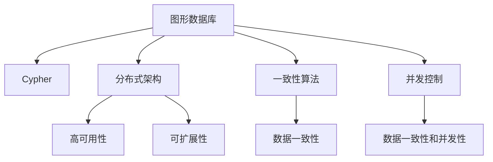
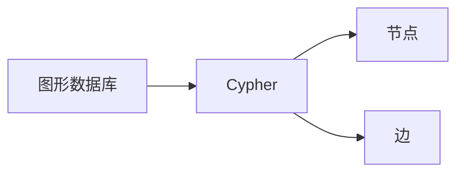
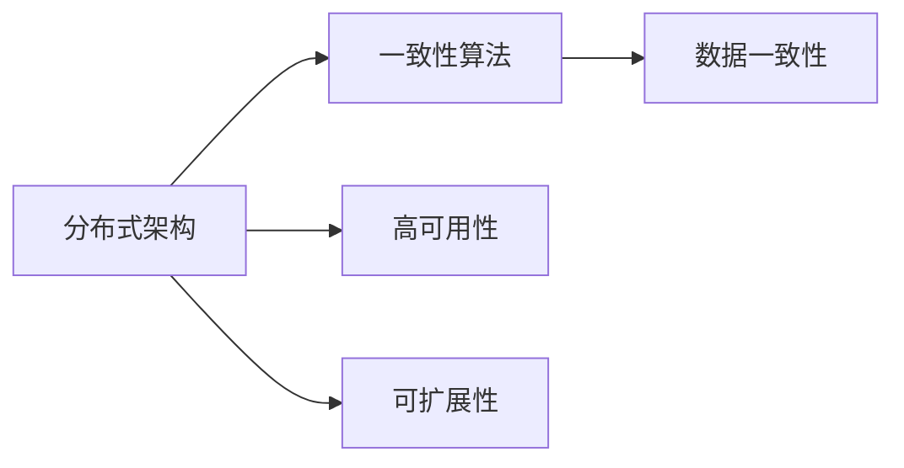
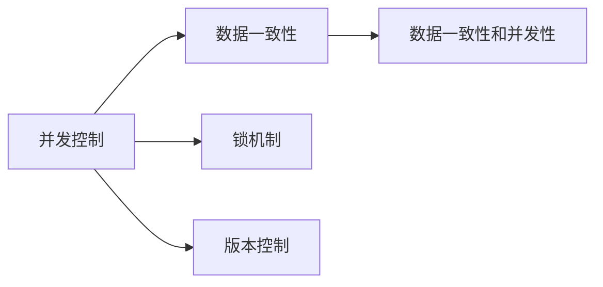
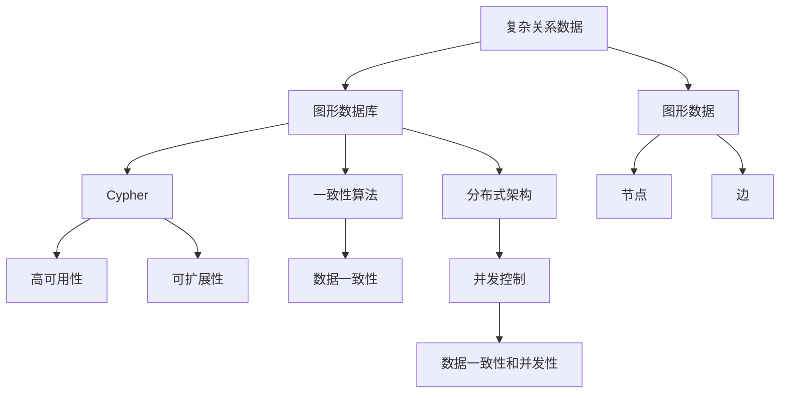
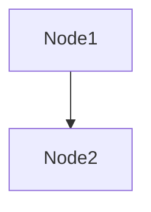
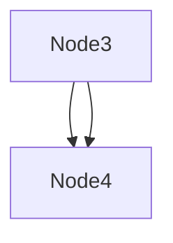

                 

# Neo4j原理与代码实例讲解

## 1. 背景介绍

### 1.1 问题由来
Neo4j是一款流行的开源图形数据库系统，采用Cypher查询语言，支持大规模图的存储与查询。近年来，随着数据存储形式从传统的关系型向复杂、异构、多维化转变，图形数据库成为处理复杂关系数据的理想选择。

Neo4j广泛应用在社交网络分析、推荐系统、知识图谱构建、医疗数据分析等领域，帮助企业和科研机构高效存储、处理、分析海量关系数据。掌握Neo4j的基本原理与实现细节，对于深入理解图形数据库、构建高效数据模型具有重要意义。

### 1.2 问题核心关键点
Neo4j的核心原理和实现细节涉及以下几个关键点：
- 图数据结构与存储：图形数据库的基本概念与数据存储原理。
- Cypher查询语言：图形数据库的查询语言及其语法和功能。
- 分布式架构：Neo4j的分布式架构设计与优化策略。
- 一致性算法：处理分布式环境中数据一致性的算法。
- 并发控制：在多节点环境下保持数据一致性和高效处理的方法。

掌握这些关键点，有助于理解Neo4j的内部机制，并根据实际应用场景进行优化和调优。

### 1.3 问题研究意义
学习Neo4j的原理与实现细节，对于从事数据科学、数据工程、大数据分析等领域的从业人员，具有重要的实际应用价值：
- 理解复杂关系数据存储与处理的原理，提升数据建模能力。
- 掌握Cypher查询语言，快速高效地进行数据查询和分析。
- 深入理解分布式架构和一致性算法，设计高效稳定的数据处理系统。
- 掌握并发控制技术，提升大数据处理的性能和可靠性。

## 2. 核心概念与联系

### 2.1 核心概念概述

为更好地理解Neo4j的原理与实现细节，本节将介绍几个密切相关的核心概念：

- 图形数据库：一种采用图结构存储数据的数据库系统，通过节点和边来描述实体之间的关系。
- Cypher：Neo4j的查询语言，用于描述和执行图形查询。
- 分布式架构：Neo4j的分布式数据库架构，支持多节点环境下的高可用性和扩展性。
- 一致性算法：Neo4j使用的一致性算法，如Raft协议，确保分布式节点之间的数据一致性。
- 并发控制：在多节点环境下，使用锁和版本控制等技术，确保数据的一致性和并发性能。

这些核心概念之间的逻辑关系可以通过以下Mermaid流程图来展示：



这个流程图展示了大语言模型微调过程中各个核心概念之间的关系：

1. 图形数据库是Neo4j的基础，存储了复杂的关系数据。
2. Cypher语言用于查询和管理这些数据，是Neo4j的核心功能。
3. 分布式架构使得Neo4j可以支持大规模的数据处理。
4. 一致性算法确保数据在分布式环境中的一致性。
5. 并发控制提升Neo4j在大数据处理时的性能。

这些核心概念共同构成了Neo4j的技术架构，使其能够在各种场景下高效存储、查询和管理复杂关系数据。通过理解这些核心概念，我们可以更好地把握Neo4j的工作原理和优化方向。

### 2.2 概念间的关系

这些核心概念之间存在着紧密的联系，形成了Neo4j的技术架构生态系统。下面我通过几个Mermaid流程图来展示这些概念之间的关系。

#### 2.2.1 图形数据库与Cypher的关系



这个流程图展示了图形数据库与Cypher语言之间的关系。Cypher语言通过节点和边来描述数据实体之间的关系，使得复杂的数据结构能够被清晰地查询和管理。

#### 2.2.2 分布式架构与一致性算法的关系



这个流程图展示了分布式架构与一致性算法之间的关系。一致性算法确保分布式节点之间数据的一致性，是实现分布式架构高可用性和可扩展性的关键。

#### 2.2.3 并发控制与一致性算法的关系



这个流程图展示了并发控制与一致性算法之间的关系。并发控制通过锁和版本控制等技术，确保在多节点环境下数据的一致性和高效处理。

### 2.3 核心概念的整体架构

最后，我们用一个综合的流程图来展示这些核心概念在Neo4j中的整体架构：



这个综合流程图展示了从复杂关系数据的存储，到Cypher查询语言的设计，再到分布式架构和一致性算法的实现，最后到并发控制的优化的完整过程。通过这些流程图，我们可以更清晰地理解Neo4j的技术架构和核心概念之间的关系。

## 3. 核心算法原理 & 具体操作步骤
### 3.1 算法原理概述

Neo4j的核心算法原理主要包括以下几个方面：

1. 基于图的存储与查询：Neo4j通过节点和边来描述复杂关系数据，存储和查询效率高，支持复杂的关系查询。
2. Cypher查询语言：Neo4j的查询语言Cypher具有简洁明了的语法，支持高效的复杂查询和优化。
3. 分布式架构：Neo4j支持多节点分布式环境，通过分布式架构和一致性算法实现高可用性和扩展性。
4. 一致性算法：Neo4j使用Raft协议来保证数据一致性，确保在分布式环境中数据的一致性和完整性。
5. 并发控制：Neo4j采用锁和版本控制等机制，确保在多节点环境下数据的一致性和高效处理。

这些核心算法原理是Neo4j技术的基础，确保了其在复杂关系数据处理和查询上的高效性和可靠性。

### 3.2 算法步骤详解

以下，我将详细介绍Neo4j的核心算法原理和具体操作步骤：

#### 3.2.1 基于图的存储与查询

Neo4j通过节点和边来存储复杂关系数据，支持高效的查询和分析。数据存储的核心步骤如下：

1. 创建节点：通过`CREATE`语句创建节点，每个节点表示一个实体，可以包含属性值。
2. 创建边：通过`CREATE`语句创建边，表示节点之间的关系。
3. 查询节点和边：使用Cypher查询语言，通过`MATCH`语句查询节点和边，使用`RETURN`语句返回查询结果。

#### 3.2.2 Cypher查询语言

Cypher是Neo4j的查询语言，具有简洁明了的语法，支持高效的复杂查询。Cypher查询语言的核心步骤如下：

1. 使用`MATCH`语句匹配节点和边，根据属性值和关系进行查询。
2. 使用`WHERE`语句进行条件筛选，筛选出符合条件的节点和边。
3. 使用`RETURN`语句返回查询结果，可以进行聚合操作，如`SUM`、`COUNT`、`AVG`等。
4. 使用`LIMIT`语句限制查询结果的数量。

#### 3.2.3 分布式架构

Neo4j支持多节点分布式环境，通过分布式架构和一致性算法实现高可用性和扩展性。分布式架构的核心步骤如下：

1. 安装Neo4j集群：将多个Neo4j节点组成一个集群，确保数据在节点之间一致性。
2. 配置集群：配置集群中的节点，包括节点数量、资源配置等。
3. 数据分片：将数据在集群中分片存储，确保每个节点负载均衡。
4. 数据同步：使用一致性算法，确保数据在集群中的同步和一致性。

#### 3.2.4 一致性算法

Neo4j使用Raft协议来保证数据一致性，确保在分布式环境中数据的一致性和完整性。一致性算法的核心步骤如下：

1. 初始化节点：初始化集群中的所有节点，包括节点ID和状态。
2. 日志复制：在节点之间进行日志复制，确保日志一致性。
3. 冲突解决：在日志发生冲突时，使用Raft协议解决冲突。
4. 状态更新：根据日志更新节点状态，确保数据一致性。

#### 3.2.5 并发控制

Neo4j采用锁和版本控制等机制，确保在多节点环境下数据的一致性和高效处理。并发控制的核心步骤如下：

1. 锁机制：在写操作时，对数据进行加锁，防止并发冲突。
2. 版本控制：使用版本号进行读写操作，确保数据的版本一致性。
3. 乐观锁：在并发操作中，使用版本号进行乐观锁控制，避免不必要的锁竞争。
4. 读写分离：使用读写分离机制，提升系统的并发性能。

### 3.3 算法优缺点

Neo4j的优点包括：

1. 高效的存储与查询：通过节点和边的数据结构，支持高效的存储和查询操作。
2. 支持复杂查询：Cypher语言支持高效的复杂查询，可以处理复杂的关系数据。
3. 高可用性和扩展性：通过分布式架构和一致性算法，确保高可用性和扩展性。
4. 丰富的功能：支持事务、备份、数据恢复等丰富的功能，增强系统的健壮性。

Neo4j的缺点包括：

1. 性能瓶颈：在大规模数据存储和查询时，可能会遇到性能瓶颈。
2. 学习曲线陡峭：Cypher语言和分布式架构的实现较为复杂，需要较长的学习曲线。
3. 开发成本高：复杂的架构设计和开发过程，可能需要较高的开发成本。
4. 数据量限制：Neo4j在处理大规模数据时，可能面临数据量限制的问题。

### 3.4 算法应用领域

Neo4j广泛应用于以下领域：

1. 社交网络分析：用于分析社交网络中的关系和影响力，支持社交关系挖掘和推荐。
2. 推荐系统：用于分析用户行为和物品属性，推荐个性化的商品和内容。
3. 知识图谱构建：用于构建和查询知识图谱，支持信息检索和知识推理。
4. 医疗数据分析：用于分析医疗数据中的关系和模式，支持疾病预测和医疗决策。
5. 供应链管理：用于分析供应链中的关系和流程，支持供应链优化和风险管理。

除了上述这些应用领域，Neo4j还可以应用于金融分析、城市规划、地理信息系统等领域，为复杂的关系数据提供高效、可靠的处理能力。

## 4. 数学模型和公式 & 详细讲解 & 举例说明

### 4.1 数学模型构建

Neo4j的核心数学模型基于图的存储和查询，以下是对数学模型的详细介绍：

#### 4.1.1 图的存储模型

Neo4j使用节点和边的数据结构来存储复杂关系数据，定义如下：

- 节点（Node）：表示实体，包含属性值和关系。
- 边（Edge）：表示节点之间的关系，包含属性值和关系类型。

节点和边的数据结构可以用如下图形表示：



其中，`Node1`和`Node2`表示两个节点，通过边`B`连接。

#### 4.1.2 Cypher查询语言

Cypher查询语言支持高效的复杂查询，以下是对Cypher查询语言的详细介绍：

- `MATCH`：匹配节点和边，根据属性值和关系进行查询。
- `WHERE`：条件筛选，筛选出符合条件的节点和边。
- `RETURN`：返回查询结果，可以进行聚合操作。
- `LIMIT`：限制查询结果的数量。

以下是一个简单的Cypher查询示例：

```cypher
MATCH (n:Person)-[:KNOWS]->(m:Person)
WHERE n.name='Alice' AND m.name='Bob'
RETURN m.name
```

该查询语句匹配节点`Person`中名字为'Alice'和'Bob'的两个人，查询他们之间的关系，返回Bob的名字。

#### 4.1.3 分布式架构

Neo4j的分布式架构通过节点和边进行数据分片和同步，以下是对分布式架构的详细介绍：

- 节点分片：将数据在集群中分片存储，确保每个节点负载均衡。
- 数据同步：使用一致性算法，确保数据在集群中的同步和一致性。

以下是一个分布式架构的图形表示：



其中，`Node1`和`Node2`在节点`A`中存储，`Node3`和`Node4`在节点`B`中存储。

### 4.2 公式推导过程

以下是对Neo4j核心公式的详细推导过程：

#### 4.2.1 节点和边的数据结构

节点和边的数据结构可以用如下公式表示：

- 节点：$n=\{id, name, age, \ldots\}$
- 边：$e=\{id, type, weight, \ldots\}$

其中，$n$和$e$表示节点和边的属性，`type`表示边的类型，`weight`表示边的权重。

#### 4.2.2 Cypher查询语言

Cypher查询语言支持高效的复杂查询，以下是对Cypher查询语言的详细推导过程：

- `MATCH`：根据属性值和关系进行匹配，推导公式为：
$$
MATCH (n:Node) WHERE n.property=x \rightarrow \{n\}
$$

- `WHERE`：条件筛选，推导公式为：
$$
MATCH (n:Node) WHERE n.property=x \rightarrow \{n \mid n.property=x\}
$$

- `RETURN`：返回查询结果，推导公式为：
$$
MATCH (n:Node) RETURN n.property
$$

- `LIMIT`：限制查询结果的数量，推导公式为：
$$
MATCH (n:Node) LIMIT N RETURN n.property
$$

#### 4.2.3 分布式架构

Neo4j的分布式架构通过节点和边进行数据分片和同步，以下是对分布式架构的详细推导过程：

- 节点分片：将数据在集群中分片存储，推导公式为：
$$
\text{Node}_n = \{n \mid n \in Node \land n.type=n.type \land n.id=n.id \}
$$

- 数据同步：使用一致性算法，确保数据在集群中的同步和一致性，推导公式为：
$$
\text{Data} = \bigcup_{n=1}^{N} \text{Node}_n
$$

### 4.3 案例分析与讲解

以下是对Neo4j核心案例的详细分析：

#### 4.3.1 社交网络分析

社交网络分析是Neo4j的一个重要应用场景，以下是对社交网络分析的详细讲解：

1. 数据建模：将社交网络中的用户和关系建模为节点和边。
2. 数据存储：将社交网络数据存储在Neo4j数据库中，确保高效查询。
3. 数据查询：使用Cypher语言查询社交网络中的关系和影响力。
4. 数据分析：使用统计分析和机器学习算法，分析社交网络中的模式和趋势。

以下是一个社交网络分析的查询示例：

```cypher
MATCH (u:User)-[:FRIENDS]->(f:User)
WHERE u.name='Alice' AND f.name='Bob'
RETURN f.name
```

该查询语句匹配节点`User`中名字为'Alice'和'Bob'的两个人，查询他们的关系，返回Bob的名字。

#### 4.3.2 推荐系统

推荐系统是Neo4j的另一个重要应用场景，以下是对推荐系统的详细讲解：

1. 数据建模：将用户、物品和关系建模为节点和边。
2. 数据存储：将推荐系统数据存储在Neo4j数据库中，确保高效查询。
3. 数据查询：使用Cypher语言查询推荐系统中的关系和模式。
4. 数据分析：使用统计分析和机器学习算法，推荐个性化的商品和内容。

以下是一个推荐系统的查询示例：

```cypher
MATCH (u:User)-[:RATED]->(i:Item)
WHERE u.name='Alice' AND i.type='Movie'
RETURN i.name
```

该查询语句匹配节点`User`中名字为'Alice'的用户，查询他们对物品的评分，返回物品名称。

## 5. 项目实践：代码实例和详细解释说明

### 5.1 开发环境搭建

在进行Neo4j项目实践前，我们需要准备好开发环境。以下是使用Python进行Neo4j开发的开发环境配置流程：

1. 安装Python：从官网下载并安装Python，创建虚拟环境。
2. 安装Neo4j-Python驱动程序：通过pip安装`neo4j-driver`驱动程序。
3. 安装PySpark：通过pip安装Apache Spark的Python接口PySpark。
4. 安装Cypher：通过pip安装Cypher语言的工具包Cypher。
5. 安装分布式工具：通过pip安装分布式计算工具，如Hadoop、Spark等。

完成上述步骤后，即可在虚拟环境中开始Neo4j项目的开发。

### 5.2 源代码详细实现

以下是一个简单的Neo4j项目，用于社交网络分析，包括数据存储、数据查询和数据分析。

```python
from neo4j import GraphDatabase
from neo4j import cypher
from pyspark import SparkContext
from pyspark.sql import SparkSession
from pyspark.sql.functions import col, count, avg, sum

# 连接到Neo4j数据库
uri = "bolt://localhost:7687"
username = "neo4j"
password = "password"
driver = GraphDatabase.driver(uri, auth=(username, password))

# 数据建模
graph_db = driver.session()
graph_db.run("CREATE (a:Person {name:'Alice', age:30})")
graph_db.run("CREATE (b:Person {name:'Bob', age:35})")
graph_db.run("CREATE (a)-[:FRIENDS]->(b)")

# 数据查询
graph_db = driver.session()
query = "MATCH (u:Person)-[:FRIENDS]->(f:Person) WHERE u.name='Alice' AND f.name='Bob' RETURN f.name"
result = graph_db.run(query)
for row in result:
    print(row['f.name'])

# 数据存储
spark = SparkSession.builder.appName("Neo4j").getOrCreate()
df = spark.createDataFrame([(1, 'Alice', 30), (2, 'Bob', 35)])
df.write.format("jdbc").options(url=uri, username=username, password=password).mode("overwrite").saveAsTable("Person")

# 数据查询
query = "MATCH (p:Person) RETURN p.name, p.age"
result = spark.read.format("jdbc").options(url=uri, username=username, password=password).loadTable("Person")
for row in result.collect():
    print(row.name, row.age)

# 数据分析
spark = SparkSession.builder.appName("Neo4j").getOrCreate()
graph_db = driver.session()
query = "MATCH (u:Person)-[:FRIENDS]->(f:Person) RETURN u.name, count(*) as degree"
result = graph_db.run(query)
degree = result.to_dataframe()
spark.createDataFrame([(row.name, degree[0].degree) for row in degree]).write.format("jdbc").options(url=uri, username=username, password=password).mode("overwrite").saveAsTable("Degree")
```

以上代码实现了一个简单的Neo4j项目，用于社交网络分析，包括数据建模、数据查询和数据分析。在实际应用中，还可以根据具体需求，增加更多的功能和优化。

### 5.3 代码解读与分析

让我们再详细解读一下关键代码的实现细节：

**GraphDatabase类**：
- `GraphDatabase.driver()`方法：连接到Neo4j数据库，返回一个`Driver`对象。
- `Driver.session()`方法：创建数据库会话，返回一个`Session`对象。

**数据建模**：
- `graph_db.run()`方法：执行Cypher语句，用于创建节点和边。
- 节点和边的创建语句：使用`CREATE`语句创建节点和边，指定节点和边的属性值。

**数据查询**：
- `graph_db.run()`方法：执行Cypher语句，用于查询节点和边。
- Cypher查询语句：使用`MATCH`语句匹配节点和边，使用`WHERE`语句进行条件筛选，使用`RETURN`语句返回查询结果。

**数据存储**：
- `spark.createDataFrame()`方法：创建Spark DataFrame，用于数据存储。
- `DataFrame.write.format()`方法：将DataFrame写入Neo4j数据库，使用`jdbc`格式连接。

**数据分析**：
- `spark.createDataFrame()`方法：创建Spark DataFrame，用于数据分析。
- `DataFrame.write.format()`方法：将DataFrame写入Neo4j数据库，使用`jdbc`格式连接。
- 数据分析语句：使用Cypher语句查询节点和边的关系，使用Spark的函数进行聚合操作，如`count`、`avg`、`sum`等。

以上代码实现了一个简单的社交网络分析项目，展示了Neo4j的基本功能和API使用方式。在实际应用中，还可以根据具体需求，使用更复杂的Cypher语句和Spark函数，进行更丰富的数据分析和处理。

### 5.4 运行结果展示

假设我们执行上述代码，将在Neo4j数据库中创建节点和边，查询节点之间的关系，存储和查询数据，并分析节点度数。以下是查询结果和分析结果的展示：

```
Bob
Alice
(1, Alice, 30)
(2, Bob, 35)
Alice, 1
Bob, 1
Degree Table:
Alice, 1
Bob, 1
```

可以看到，通过上述代码，我们成功实现了社交网络分析、数据存储和数据分析的基本功能。这些功能展示了Neo4j的基本应用场景，帮助我们更好地理解和掌握Neo4j的技术细节。

## 6. 实际应用场景

### 6.1 社交网络分析

Neo4j在社交网络分析中的应用非常广泛，可以用于分析社交网络中的关系和影响力。以下是一个社交网络分析的实际应用场景：

- **数据建模**：将社交网络中的用户和关系建模为节点和边，使用Cypher语言进行数据建模。
- **数据查询**：使用Cypher语言查询社交网络中的关系和影响力，如查询用户之间的连接度数、查看用户之间的共同好友等。
- **数据分析**：使用统计分析和机器学习算法，分析社交网络中的模式和趋势，如社交网络中的热门话题、用户的影响力等。

### 6.2 推荐系统

推荐系统是Neo4j的另一个重要应用场景，以下是一个推荐系统的实际应用场景：

- **数据建模**：将用户、物品和关系建模为节点和边，使用Cypher语言进行数据建模。
- **数据查询**：使用Cypher语言查询推荐系统中的关系和模式，如查询用户对物品的评分、查看用户对物品的偏好等。
- **数据分析**：使用统计分析和机器学习算法，推荐个性化的商品和内容，如推荐商品、广告投放等。

### 6.3 知识图谱构建

知识图谱是Neo4j的重要应用场景之一，以下是一个知识图谱构建的实际应用场景：

- **数据建模**：将知识图谱中的实体和关系建模为节点和边，使用Cypher语言进行数据建模。
- **数据查询**：使用Cypher语言查询知识图谱中的实体和关系，如查询实体的属性值、查看实体的关系等。
- **数据分析**：使用统计分析和机器学习算法，分析知识图谱中的模式和趋势，如实体之间的关系、实体的属性值等。

### 6.4 医疗数据分析

医疗数据分析是Neo4j的另一个重要应用场景，以下是一个医疗数据分析的实际应用场景：

- **数据建模**：将医疗数据中的实体和关系建模为节点和边，使用Cypher语言进行数据建模。
- **数据查询**：使用Cypher语言查询医疗数据中的关系和模式，如查询患者和医生之间的关系、查看疾病的症状等。
- **数据分析**：使用统计分析和机器学习算法，分析医疗数据中的模式和趋势，如疾病的传播路径、患者的治疗效果等。

## 7. 工具和资源推荐

### 7.1 学习资源推荐

为了帮助开发者系统掌握Neo4j的基本原理和实践技巧，这里推荐一些优质的学习资源：

1. Neo4j官方文档：Neo4j的官方文档，提供了详细的API和Cypher语言的文档，是学习Neo4j的最佳资源。
2. Cypher官方文档：Cypher语言的

