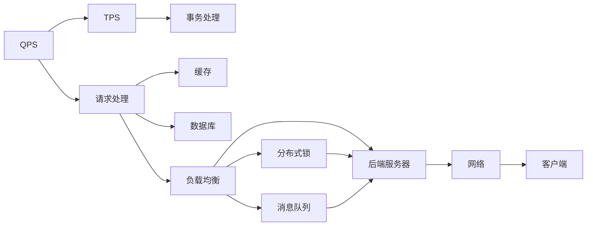

                 

# QPS与TPS在高吞吐量中的应用

> 关键词：QPS, TPS, 高吞吐量, 系统架构, 数据库, 缓存, 负载均衡, 云服务

## 1. 背景介绍

在互联网应用中，系统的性能指标之一是高吞吐量，即每秒处理请求数（QPS）和每秒处理事务数（TPS）。随着业务规模的不断扩大，用户数和请求数的快速增长，对于系统的处理能力提出了更高的要求。在高吞吐量的场景下，如何高效地管理QPS与TPS，成为一个复杂而重要的系统架构设计问题。

本文将探讨QPS与TPS在高吞吐量环境中的应用，从概念出发，介绍关键技术，深入分析其实现原理，并通过具体的项目实践进行讲解。

## 2. 核心概念与联系

### 2.1 核心概念概述

为了更好地理解QPS与TPS在高吞吐量中的应用，我们需要先了解几个关键概念：

1. **QPS**（Queries Per Second）：每秒处理的请求数，是衡量系统处理能力的一个指标。

2. **TPS**（Transactions Per Second）：每秒处理的事务数，也是衡量系统处理能力的一个重要指标。

3. **高吞吐量**（High Throughput）：指系统在短时间内能处理大量请求或事务的能力，通常用于描述Web应用、数据库系统等需要高并发处理能力的场景。

### 2.2 核心概念原理和架构的 Mermaid 流程图



这个图表展示了一个典型的系统架构，包含请求处理、事务处理、缓存、数据库、负载均衡、后端服务器、网络、分布式锁和消息队列等关键组件。在实现高吞吐量时，这些组件都扮演着重要的角色。

### 2.3 核心概念之间的联系

QPS和TPS的应用离不开以下几个关键组件的协同工作：

1. **请求处理**：负责处理客户端发送的请求，根据请求类型和内容，决定是否缓存、数据库查询或直接返回结果。
2. **事务处理**：在处理事务时，需要保证数据的一致性和完整性，通常通过数据库的事务机制来实现。
3. **缓存**：用于减少数据库的访问次数，提高请求处理的效率。
4. **数据库**：存储和处理事务数据，提供事务的持久性和可靠性。
5. **负载均衡**：通过分布式架构，将请求均衡分配到多个服务器上，避免单点故障和资源瓶颈。
6. **后端服务器**：负责实际的业务逻辑处理，处理请求和事务的具体业务逻辑。
7. **网络**：负责请求的传输和响应，是系统性能的瓶颈之一。
8. **分布式锁**：在高并发场景下，用于防止数据竞争和一致性问题。
9. **消息队列**：用于异步处理请求和事务，提高系统的吞吐量和稳定性。

这些组件之间相互协作，共同支持系统的高吞吐量需求。

## 3. 核心算法原理 & 具体操作步骤

### 3.1 算法原理概述

在高吞吐量应用中，QPS和TPS的优化是系统性能提升的关键。以下是基于缓存、负载均衡、分布式锁、消息队列等技术实现QPS与TPS优化的基本原理：

1. **缓存技术**：通过将热点数据缓存到内存中，减少数据库的访问次数，提高请求处理速度。
2. **负载均衡**：通过分布式架构，将请求均衡分配到多个服务器上，避免单点故障和资源瓶颈。
3. **分布式锁**：在高并发场景下，用于防止数据竞争和一致性问题。
4. **消息队列**：用于异步处理请求和事务，提高系统的吞吐量和稳定性。

### 3.2 算法步骤详解

以一个典型的电商系统为例，介绍实现QPS和TPS优化的详细步骤：

1. **缓存设置**：
   - 使用Redis等缓存系统，将热门商品、用户信息等数据缓存到内存中。
   - 设置缓存的过期时间和淘汰策略，确保缓存数据的时效性和准确性。
   - 使用分布式锁防止缓存一致性问题。

2. **负载均衡**：
   - 使用Nginx或HAProxy等负载均衡器，将请求均衡分配到多个Web服务器上。
   - 根据服务器的负载情况动态调整请求分配策略，保证负载均衡。

3. **分布式锁**：
   - 使用Redis等缓存系统实现分布式锁，避免多节点同时修改同一数据导致的一致性问题。
   - 实现乐观锁和悲观锁，根据具体业务场景选择适当的锁机制。

4. **消息队列**：
   - 使用RabbitMQ或Kafka等消息队列系统，实现异步处理请求和事务。
   - 将高耗时的业务逻辑放入消息队列中异步处理，减少Web服务器的负载。

### 3.3 算法优缺点

**缓存技术的优点**：
- 减少数据库访问，提高请求处理速度。
- 降低数据库负载，提高数据库系统的稳定性。

**缓存技术的缺点**：
- 缓存数据占用了内存资源，可能出现内存不足的情况。
- 缓存数据的更新和一致性需要额外保证。

**负载均衡的优点**：
- 分散服务器负载，提高系统的吞吐量和稳定性。
- 提高系统的可用性和容灾能力。

**负载均衡的缺点**：
- 配置和管理复杂，需要专业的运维人员。
- 可能出现负载不均衡的情况。

**分布式锁的优点**：
- 防止数据竞争，保证数据一致性。
- 支持分布式系统中的锁机制，提高系统的可靠性。

**分布式锁的缺点**：
- 实现和维护复杂，容易出现锁竞争和死锁问题。
- 可能会影响系统的并发处理能力。

**消息队列的优点**：
- 实现异步处理，提高系统的吞吐量。
- 支持高并发处理，提高系统的稳定性。

**消息队列的缺点**：
- 系统架构复杂，需要额外的消息队列系统。
- 消息队列的数据一致性需要额外保证。

### 3.4 算法应用领域

高吞吐量技术广泛应用于Web应用、电商系统、金融系统、实时数据处理等多个领域。以下列举几个典型应用场景：

1. **电商系统**：
   - 使用缓存技术减少数据库访问，提高页面渲染速度。
   - 使用负载均衡分散用户请求，提高系统的可用性和稳定性。
   - 使用分布式锁防止并发修改数据，保证数据一致性。
   - 使用消息队列异步处理订单和支付请求，提高系统的吞吐量和稳定性。

2. **金融系统**：
   - 使用缓存技术减少数据库访问，提高交易处理速度。
   - 使用负载均衡分散用户请求，提高系统的可用性和稳定性。
   - 使用分布式锁防止并发修改数据，保证数据一致性。
   - 使用消息队列异步处理交易和清算请求，提高系统的吞吐量和稳定性。

3. **实时数据处理**：
   - 使用缓存技术减少数据库访问，提高数据查询速度。
   - 使用负载均衡分散用户请求，提高系统的可用性和稳定性。
   - 使用分布式锁防止并发修改数据，保证数据一致性。
   - 使用消息队列异步处理数据处理请求，提高系统的吞吐量和稳定性。

## 4. 数学模型和公式 & 详细讲解 & 举例说明

### 4.1 数学模型构建

在高吞吐量应用中，QPS和TPS的优化涉及到多个组件的协同工作，需要构建一个综合的数学模型来描述整个系统的性能。

假设一个电商系统有$N$个Web服务器，每个服务器每秒处理的请求数为$q$，每秒处理的订单数为$t$，缓存系统的命中率为$c$，负载均衡的负载均衡因子为$l$，消息队列的队列长度为$q$，则系统的QPS和TPS可以表示为：

$$
QPS = \frac{N \times q \times c}{l \times q}
$$

$$
TPS = \frac{N \times t}{l \times q}
$$

### 4.2 公式推导过程

从上述公式可以看出，系统的QPS和TPS受多个因素的影响，包括Web服务器的处理能力、缓存系统的命中率、负载均衡的负载均衡因子、消息队列的队列长度等。

1. **Web服务器处理能力**：每个服务器每秒处理的请求数和订单数直接决定了系统的QPS和TPS。通过增加Web服务器的数量或提升服务器的性能，可以提高系统的处理能力。

2. **缓存系统的命中率**：缓存系统的命中率越高，请求的缓存命中率越高，数据库的访问次数越少，系统的QPS和TPS越高。

3. **负载均衡的负载均衡因子**：负载均衡因子越小，请求的负载均衡效果越好，系统的QPS和TPS越高。

4. **消息队列的队列长度**：消息队列的队列长度越短，异步处理的效果越好，系统的QPS和TPS越高。

### 4.3 案例分析与讲解

以一个电商系统的订单处理为例，分析QPS和TPS的优化过程：

假设系统有10个Web服务器，每个服务器每秒处理100个请求，每秒处理10个订单，缓存系统的命中率为90%，负载均衡的负载均衡因子为0.8，消息队列的队列长度为5，则系统的QPS和TPS分别为：

$$
QPS = \frac{10 \times 100 \times 0.9}{0.8 \times 100} = 11.25
$$

$$
TPS = \frac{10 \times 10}{0.8 \times 100} = 1.25
$$

通过增加Web服务器的数量，提升缓存系统的命中率，优化负载均衡因子，减少消息队列的队列长度，可以进一步提高系统的QPS和TPS。

## 5. 项目实践：代码实例和详细解释说明

### 5.1 开发环境搭建

为了实现高吞吐量的电商系统，我们需要搭建一个完整的开发环境，包括缓存系统、负载均衡、消息队列等组件。以下是一个典型的搭建流程：

1. **缓存系统**：
   - 使用Redis等缓存系统，搭建缓存集群，设置缓存过期时间和淘汰策略。
   - 使用分布式锁，防止缓存一致性问题。

2. **负载均衡**：
   - 使用Nginx或HAProxy等负载均衡器，搭建负载均衡集群，实现请求的均衡分配。
   - 根据服务器的负载情况，动态调整请求分配策略。

3. **消息队列**：
   - 使用RabbitMQ或Kafka等消息队列系统，搭建消息队列集群，实现异步处理请求和事务。
   - 配置消息队列的队列长度和消费策略。

### 5.2 源代码详细实现

以下是一个使用Redis、Nginx、RabbitMQ实现高吞吐量电商系统的示例代码：

```python
import redis
import time

# Redis连接池
redis_pool = redis.ConnectionPool(host='127.0.0.1', port=6379, db=0)
r = redis.Redis(connection_pool=redis_pool)

# Nginx负载均衡配置
def nginx_load_balance():
    # 从Redis中获取服务器列表
    servers = r.get('servers')
    # 随机选择一个服务器
    server = servers[0]
    return server

# RabbitMQ消息队列配置
def rabbitmq_publish(message):
    # 将消息发布到RabbitMQ队列中
    connection = pika.BlockingConnection(pika.ConnectionParameters('localhost'))
    channel = connection.channel()
    channel.queue_declare(queue='queue_name')
    channel.basic_publish(exchange='', routing_key='queue_name', body=message)
    connection.close()

# 使用缓存系统缓存数据
def cache_data(key, value):
    if r.exists(key):
        # 从缓存中获取数据
        data = r.get(key)
    else:
        # 从数据库中获取数据
        data = get_data_from_database()
        # 将数据缓存到Redis中
        r.set(key, value)
        r.expire(key, 3600)  # 缓存数据过期时间设置为1小时
    return data

# 使用负载均衡分配请求
def request_load_balance():
    server = nginx_load_balance()
    return server

# 使用分布式锁防止数据竞争
def distributed_lock(key):
    if r.setnx(key, 1):
        # 设置分布式锁
        return True
    else:
        # 获取锁
        while r.get(key) == 1:
            time.sleep(1)
        # 释放锁
        r.delete(key)
        return False

# 使用消息队列异步处理请求
def async_request(message):
    rabbitmq_publish(message)

# 使用缓存系统缓存数据
data = cache_data('key', 'value')
# 使用负载均衡分配请求
server = request_load_balance()
# 使用分布式锁防止数据竞争
lock = distributed_lock('lock_key')
# 使用消息队列异步处理请求
async_request('message')
```

### 5.3 代码解读与分析

通过上述代码，我们可以看到高吞吐量电商系统的实现主要涉及缓存系统、负载均衡、分布式锁和消息队列等关键组件。

1. **缓存系统**：使用Redis实现缓存功能，通过缓存系统的命中率提高请求处理速度。

2. **负载均衡**：使用Nginx实现负载均衡功能，通过负载均衡器将请求均衡分配到多个Web服务器上。

3. **分布式锁**：使用Redis实现分布式锁功能，通过分布式锁防止数据竞争和一致性问题。

4. **消息队列**：使用RabbitMQ实现消息队列功能，通过消息队列实现异步处理请求和事务，提高系统的吞吐量和稳定性。

## 6. 实际应用场景

### 6.1 高吞吐量电商系统

电商系统是高吞吐量应用的典型代表，通过合理配置缓存系统、负载均衡、分布式锁和消息队列等组件，可以实现高性能的请求处理和事务处理。

1. **缓存系统**：使用Redis等缓存系统，将热门商品、用户信息等数据缓存到内存中，减少数据库的访问次数，提高请求处理速度。

2. **负载均衡**：使用Nginx等负载均衡器，将请求均衡分配到多个Web服务器上，避免单点故障和资源瓶颈。

3. **分布式锁**：使用Redis等缓存系统实现分布式锁，防止并发修改数据，保证数据一致性。

4. **消息队列**：使用RabbitMQ等消息队列系统，异步处理订单和支付请求，提高系统的吞吐量和稳定性。

### 6.2 金融系统

金融系统是高吞吐量应用的另一个重要领域，通过合理配置缓存系统、负载均衡、分布式锁和消息队列等组件，可以实现高性能的请求处理和事务处理。

1. **缓存系统**：使用Redis等缓存系统，减少数据库访问，提高交易处理速度。

2. **负载均衡**：使用Nginx等负载均衡器，分散用户请求，提高系统的可用性和稳定性。

3. **分布式锁**：使用Redis等缓存系统实现分布式锁，防止并发修改数据，保证数据一致性。

4. **消息队列**：使用RabbitMQ等消息队列系统，异步处理交易和清算请求，提高系统的吞吐量和稳定性。

### 6.3 实时数据处理

实时数据处理是高吞吐量应用的另一个重要场景，通过合理配置缓存系统、负载均衡、分布式锁和消息队列等组件，可以实现高性能的数据处理。

1. **缓存系统**：使用Redis等缓存系统，减少数据库访问，提高数据查询速度。

2. **负载均衡**：使用Nginx等负载均衡器，分散用户请求，提高系统的可用性和稳定性。

3. **分布式锁**：使用Redis等缓存系统实现分布式锁，防止并发修改数据，保证数据一致性。

4. **消息队列**：使用RabbitMQ等消息队列系统，异步处理数据处理请求，提高系统的吞吐量和稳定性。

## 7. 工具和资源推荐

### 7.1 学习资源推荐

为了帮助开发者系统掌握QPS与TPS在高吞吐量中的应用，以下是一些优质的学习资源：

1. **《高性能Web应用架构》**：详细介绍了Web应用架构的设计和优化，包括缓存、负载均衡、分布式锁和消息队列等关键组件。

2. **《分布式系统设计》**：深入探讨了分布式系统的设计原理和优化方法，适合有经验的开发者阅读。

3. **《高并发编程实战》**：介绍了高并发编程的技巧和方法，适合对高并发场景感兴趣的开发者。

4. **《Redis官方文档》**：Redis的官方文档提供了详细的缓存系统实现方法，适合实战开发。

5. **《Nginx官方文档》**：Nginx的官方文档提供了详细的负载均衡器实现方法，适合实战开发。

6. **《RabbitMQ官方文档》**：RabbitMQ的官方文档提供了详细的消息队列实现方法，适合实战开发。

### 7.2 开发工具推荐

高效的工具是开发高吞吐量应用不可或缺的，以下是几款常用的开发工具：

1. **Redis**：高性能的缓存系统，适合实现缓存功能。

2. **Nginx**：高性能的负载均衡器，适合实现负载均衡功能。

3. **RabbitMQ**：高性能的消息队列系统，适合实现异步处理功能。

4. **Kafka**：高性能的消息队列系统，适合实现异步处理功能。

5. **JMeter**：性能测试工具，适合测试系统的QPS和TPS。

### 7.3 相关论文推荐

QPS与TPS的高吞吐量应用涉及多个领域的最新研究，以下是几篇奠基性的相关论文：

1. **《A Survey of High-Performance Web Application Architecture》**：综述了高性能Web应用架构的设计和优化方法，适合了解高吞吐量应用的原理。

2. **《Performance Optimization for High-Throughput Web Applications》**：介绍了高吞吐量Web应用的性能优化方法，适合实战开发。

3. **《Distributed Locking in Cloud Systems》**：探讨了分布式锁在高并发场景中的应用，适合了解分布式锁的实现原理。

4. **《Efficient High-Throughput Message Queue System》**：介绍了高效的消息队列系统，适合了解消息队列的实现方法。

## 8. 总结：未来发展趋势与挑战

### 8.1 研究成果总结

本文对QPS与TPS在高吞吐量中的应用进行了系统介绍，涵盖缓存、负载均衡、分布式锁和消息队列等关键组件的实现方法和优化策略。通过实际案例，展示了如何构建高吞吐量电商系统、金融系统和实时数据处理系统，实现了高性能的请求处理和事务处理。

### 8.2 未来发展趋势

展望未来，QPS与TPS在高吞吐量应用中将呈现以下几个发展趋势：

1. **云计算和大数据**：随着云计算和大数据技术的不断发展，高吞吐量应用的架构将更加灵活和可扩展。

2. **微服务架构**：微服务架构的高效协作，将进一步提升系统的吞吐量和稳定性。

3. **容器化与自动化**：容器化和自动化部署将进一步简化高吞吐量应用的开发和部署过程。

4. **智能运维**：通过智能运维技术，实时监控和优化系统性能，提高系统的可用性和稳定性。

### 8.3 面临的挑战

尽管高吞吐量应用在不断发展，但仍面临一些挑战：

1. **系统复杂性**：高吞吐量应用涉及多个组件的协同工作，系统设计和实现复杂度高。

2. **数据一致性**：在高并发场景下，数据一致性问题需要额外保证。

3. **性能瓶颈**：缓存系统、负载均衡和消息队列等组件的性能瓶颈可能影响系统的整体性能。

4. **成本控制**：高吞吐量应用的资源需求大，成本控制是系统设计和实现的重要考虑因素。

### 8.4 研究展望

未来，高吞吐量应用的研究将聚焦以下几个方向：

1. **无状态架构**：通过无状态架构，提高系统的可扩展性和容错能力。

2. **分布式计算**：通过分布式计算，实现高性能的数据处理和存储。

3. **智能算法**：通过智能算法，提高系统的优化能力和自动化程度。

4. **边缘计算**：通过边缘计算，实现数据本地化处理，降低网络延迟和带宽需求。

总之，高吞吐量应用的研究和实践需要不断突破技术瓶颈，探索新的解决方案。唯有在理论和实践相结合，才能实现高性能、高可用、高稳定的高吞吐量系统。

## 9. 附录：常见问题与解答

### Q1：什么是QPS和TPS？

A: QPS（Queries Per Second）指每秒处理的请求数，TPS（Transactions Per Second）指每秒处理的事务数，这两个指标都是衡量系统处理能力的重要指标。

### Q2：如何使用缓存系统提高请求处理速度？

A: 使用缓存系统将热点数据缓存到内存中，减少数据库的访问次数，提高请求处理速度。

### Q3：什么是负载均衡？

A: 负载均衡是指将请求均衡分配到多个服务器上，避免单点故障和资源瓶颈，提高系统的可用性和稳定性。

### Q4：如何使用分布式锁防止数据竞争？

A: 使用缓存系统实现分布式锁，防止并发修改数据，保证数据一致性。

### Q5：什么是消息队列？

A: 消息队列是一种异步处理机制，用于异步处理请求和事务，提高系统的吞吐量和稳定性。

通过本文的系统梳理，可以看到，QPS与TPS在高吞吐量中的应用涉及多个关键组件的协同工作，需要通过合理配置和优化，才能实现高性能的请求处理和事务处理。希望本文能为高吞吐量应用的开发者提供有价值的参考，助力系统性能的提升和优化。

---

作者：禅与计算机程序设计艺术 / Zen and the Art of Computer Programming

