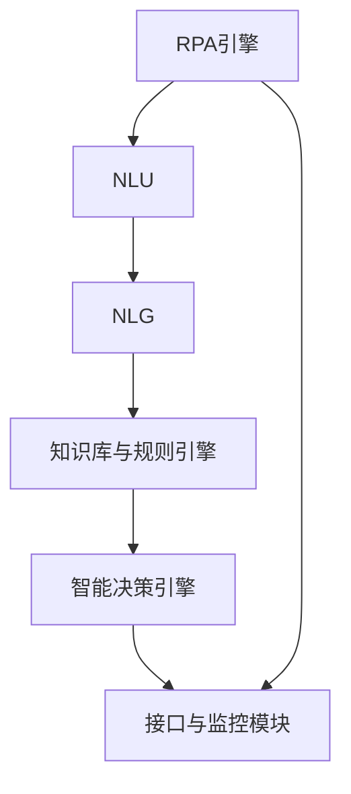
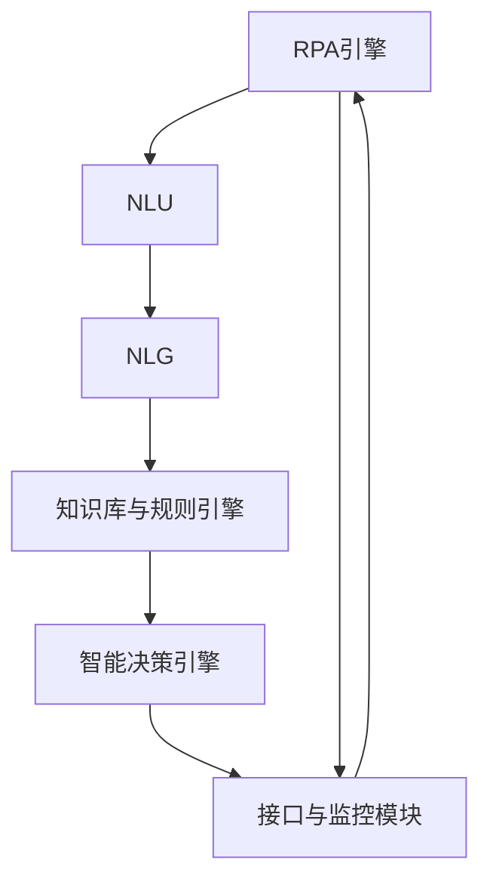

                 

# RPA 与 LLM 的结合

> 关键词：RPA, LLM, 自动化流程, 人工智能, 自然语言处理, 机器人流程自动化, 机器人学习, 深度学习, 自然语言生成

## 1. 背景介绍

### 1.1 问题由来

随着数字化转型的深入，各行各业都在不断探索如何利用技术手段提高工作效率，优化业务流程。机器人流程自动化（RPA）作为一种无需编程即可自动化业务流程的技术，因其低成本、易操作的特点，逐渐成为数字化转型中的重要工具。然而，在处理需要复杂逻辑判断、语义理解的任务时，传统的RPA往往难以胜任，而传统的自然语言处理（NLP）技术虽然在这方面表现出色，但需要大量手工编写规则和脚本，耗时费力。

为了解决这一问题，一种新兴的融合技术应运而生，即结合了RPA和语言模型（LLM）的“机器人学习”（Robot Learning）或“智能RPA”（Intelligent RPA）。通过引入自然语言处理技术，智能RPA能够更准确地理解和处理自然语言输入，从而自动化更复杂的任务。本文将深入探讨这一新兴技术的核心概念、关键算法及其实际应用。

### 1.2 问题核心关键点

智能RPA结合了RPA与LLM的技术优势，核心在于通过自然语言处理，让机器人能够理解并执行自然语言描述的复杂任务。关键点包括：

- RPA技术：无需编程即可自动化复杂业务流程的工具。
- LLM技术：能够理解和生成自然语言的人工智能模型。
- 机器人学习：将RPA和LLM技术结合，实现复杂任务自动化的技术。
- 自然语言理解（NLU）：机器人理解自然语言输入的能力。
- 自然语言生成（NLG）：机器人生成自然语言输出的能力。

这些关键技术构成了智能RPA的技术基础，使机器人能够从简单的脚本执行转变为具有语义理解能力的智能助手。

### 1.3 问题研究意义

智能RPA的发展，对于提高企业的自动化水平、降低运营成本、提升工作效率具有重要意义。具体表现在：

- 自动化复杂任务：智能RPA能够处理包括文本阅读、数据提取、数据分析、决策制定等在内的复杂任务，极大提升了企业的运营效率。
- 降低人工成本：通过自动化复杂的后台操作，智能RPA能够显著减少人工干预，降低企业的人力成本。
- 提升决策质量：基于深度学习和自然语言处理的智能RPA，能够从大量数据中提炼有价值的信息，辅助企业做出更科学的决策。
- 加速数字化转型：智能RPA作为数字化转型的重要工具，加速了企业从传统业务向数字化业务的转型。

## 2. 核心概念与联系

### 2.1 核心概念概述

智能RPA的核心在于结合RPA与LLM技术，使得机器人不仅能够执行简单的流程，还能理解和执行复杂的自然语言描述。具体来说，智能RPA系统包括以下几个关键组件：

- **RPA引擎**：自动化执行预定义的业务流程，如数据抓取、表单填写、API调用等。
- **自然语言处理模块**：包括自然语言理解（NLU）和自然语言生成（NLG），使机器人能够理解自然语言输入，并生成自然语言输出。
- **知识库与规则引擎**：存储和管理业务规则、流程定义及关键数据，指导机器人的执行。
- **智能决策引擎**：基于深度学习模型，辅助机器人进行复杂任务决策。
- **接口与监控模块**：实现与外系统的对接与监控，确保系统稳定运行。

这些组件共同构成了智能RPA的完整架构，使得机器人能够从简单的流程执行转变为具有智能决策能力的复杂任务助手。

### 2.2 概念间的关系

智能RPA的各个组件之间通过数据和控制信号进行交互，形成一个有机的整体。RPA引擎负责执行具体的任务，而自然语言处理模块则负责理解任务的语义，从而指导RPA引擎的执行。知识库与规则引擎则提供具体的执行逻辑和数据支持，智能决策引擎则利用深度学习模型，对复杂的任务进行决策支持。接口与监控模块则负责系统与外部的对接和监控，确保系统稳定运行。

以下是一个Mermaid流程图，展示了智能RPA各个组件之间的交互关系：



### 2.3 核心概念的整体架构

为了更好地理解智能RPA的完整架构，这里再提供一个综合的流程图：



这个综合流程图展示了智能RPA从输入理解到任务执行，再到结果输出的完整过程。通过这一过程，智能RPA能够处理复杂的自然语言输入，并自动化执行相应的业务流程。

## 3. 核心算法原理 & 具体操作步骤
### 3.1 算法原理概述

智能RPA的核心算法包括自然语言处理（NLP）和机器人流程自动化（RPA）两个部分。NLP部分主要负责理解自然语言输入，并从中提取关键信息；RPA部分则负责根据提取的信息，自动化执行相应的业务流程。

具体来说，智能RPA的算法流程如下：

1. **自然语言理解（NLU）**：将自然语言输入转换为机器可理解的形式，提取关键信息，如实体识别、意图理解等。
2. **任务分配与执行**：根据理解的信息，分配具体的任务给RPA引擎执行，如数据抓取、表单填写、API调用等。
3. **自然语言生成（NLG）**：根据任务执行的结果，生成自然语言输出，作为反馈或报告。

### 3.2 算法步骤详解

下面以一个具体的应用场景为例，详细讲解智能RPA的算法步骤：

**场景描述**：假设有一个智能客服系统，需要根据客户提出的问题，自动执行相应的任务，如查询订单状态、修改客户信息等。

**算法步骤**：

1. **自然语言理解（NLU）**：
   - 系统接收客户提出的问题，如“我的订单状态是什么？”。
   - 通过NLU模块，将问题转换为结构化的形式，如“查询订单状态”，并提取实体信息“订单状态”。
   - 系统根据提取的实体信息，决定执行的任务类型。

2. **任务分配与执行**：
   - 系统将任务“查询订单状态”分配给RPA引擎。
   - RPA引擎根据任务类型，调用相应的API或脚本，自动执行查询操作。
   - 根据API或脚本的执行结果，生成结构化的数据，如订单状态、处理时间等。

3. **自然语言生成（NLG）**：
   - 根据生成的数据，通过NLG模块，生成自然语言输出，如“您的订单状态为已发货”。
   - 系统将生成的自然语言反馈给客户，完成智能客服的交互流程。

### 3.3 算法优缺点

智能RPA结合了RPA与LLM技术的优点，但也存在一些缺点：

**优点**：

- **自动化复杂任务**：智能RPA能够处理复杂的自然语言输入，自动化执行复杂的任务，极大提升了企业运营效率。
- **提高决策质量**：基于深度学习和自然语言处理的智能RPA，能够从大量数据中提炼有价值的信息，辅助企业做出更科学的决策。
- **降低人工成本**：智能RPA能够自动化复杂的后台操作，减少人工干预，降低企业的人力成本。

**缺点**：

- **技术门槛较高**：智能RPA涉及深度学习和自然语言处理技术，需要一定的技术积累和团队实力。
- **数据质量要求高**：智能RPA的效果高度依赖于输入数据的质量，数据噪声和不一致性会影响系统性能。
- **模型复杂度高**：深度学习模型和自然语言处理模型通常较为复杂，需要大量的计算资源和训练数据。
- **成本较高**：开发和部署智能RPA系统，需要一定的成本投入，包括模型训练、系统集成等。

### 3.4 算法应用领域

智能RPA在多个领域都有广泛的应用，以下是几个典型的应用场景：

- **智能客服**：基于自然语言处理和机器人流程自动化技术，实现智能客服系统，自动回答客户问题，提升服务效率和质量。
- **财务自动化**：自动化处理发票、账单、报表等财务相关任务，减少人工错误，提高财务处理效率。
- **人力资源管理**：自动化处理招聘、入职、培训等任务，减少人力资源管理中的繁琐流程，提高效率。
- **供应链管理**：自动化处理订单、库存、物流等供应链管理任务，提升供应链管理效率，降低运营成本。
- **市场营销**：自动化处理客户关系管理、市场分析、广告投放等任务，提高市场营销效率和精准度。

## 4. 数学模型和公式 & 详细讲解 & 举例说明

### 4.1 数学模型构建

智能RPA的数学模型主要涉及自然语言处理和机器人流程自动化两个部分。

自然语言处理部分主要涉及以下几个关键模型：

- **词向量模型**：将单词映射为向量，捕捉单词之间的语义关系。常用的词向量模型包括Word2Vec、GloVe、BERT等。
- **序列标注模型**：用于实体识别、意图理解等任务。常用的序列标注模型包括CRF、BiLSTM-CRF等。
- **生成模型**：用于自然语言生成任务。常用的生成模型包括Seq2Seq、Transformer等。

机器人流程自动化部分主要涉及以下几个关键模型：

- **流程规则模型**：定义和存储业务流程规则，指导机器人执行任务。
- **决策模型**：基于深度学习模型，辅助机器人进行复杂任务决策。
- **性能优化模型**：用于优化机器人流程自动化的效率和性能。

### 4.2 公式推导过程

以自然语言理解（NLU）为例，其公式推导过程如下：

**词向量模型**：

设单词集合为 $V$，词向量为 $\mathbf{w}_v$，则有：

$$
\mathbf{w}_v = f(v)
$$

其中 $f$ 为映射函数。

**序列标注模型**：

设输入序列为 $X$，输出标签序列为 $Y$，模型参数为 $\theta$，则有：

$$
P(Y|X,\theta) = \prod_{i=1}^T P(y_i|x_i, \theta)
$$

其中 $P(y_i|x_i, \theta)$ 为条件概率，表示在输入序列 $x_i$ 和模型参数 $\theta$ 的条件下，输出标签 $y_i$ 的概率。

**生成模型**：

设输入序列为 $X$，输出序列为 $Y$，模型参数为 $\theta$，则有：

$$
P(Y|X,\theta) = \prod_{i=1}^T P(y_i|x_i, \theta)
$$

其中 $P(y_i|x_i, \theta)$ 为条件概率，表示在输入序列 $x_i$ 和模型参数 $\theta$ 的条件下，输出序列 $y_i$ 的概率。

### 4.3 案例分析与讲解

以智能客服系统为例，其NLU和NLG模块的实现如下：

**NLU模块**：

1. 输入：客户提出的问题。
2. 处理：将问题转换为结构化的形式，提取关键信息。
3. 输出：结构化信息，如“查询订单状态”。

**NLG模块**：

1. 输入：系统生成的结构化信息。
2. 处理：生成自然语言输出。
3. 输出：自然语言反馈给客户。

## 5. 项目实践：代码实例和详细解释说明

### 5.1 开发环境搭建

开发智能RPA系统，需要安装Python、PyTorch、TensorFlow、NLTK、spaCy等工具和库。以下是具体步骤：

1. 安装Python：从官网下载并安装Python，推荐使用Anaconda环境。

2. 创建虚拟环境：
```bash
conda create -n rpa-env python=3.8 
conda activate rpa-env
```

3. 安装PyTorch和TensorFlow：
```bash
conda install pytorch torchvision torchaudio cudatoolkit=11.1 -c pytorch -c conda-forge
pip install tensorflow
```

4. 安装自然语言处理库：
```bash
pip install nltk spacy
```

5. 安装其他库：
```bash
pip install tqdm pyyaml
```

完成上述步骤后，即可在`rpa-env`环境中开始开发。

### 5.2 源代码详细实现

以下是智能客服系统的代码实现，包括NLU和NLG模块的详细解释说明：

```python
import torch
from transformers import BertTokenizer, BertForTokenClassification
from nltk.tokenize import word_tokenize
from spacy import displacy
from spacy.matcher import Matcher

# 加载模型
tokenizer = BertTokenizer.from_pretrained('bert-base-cased')
model = BertForTokenClassification.from_pretrained('bert-base-cased', num_labels=2)

# 加载知识库与规则引擎
knowledge_base = {'查询订单状态': {'api_name': 'get_order_status', 'args': {'order_id': '123456'}}
def parse_input(input_str):
    # 将输入转换为小写，进行词性标注
    tokens = word_tokenize(input_str.lower())
    pos_tags = spacy.load('en_core_web_sm').pos_tag(tokens)

    # 提取关键信息
    matched_pattern = Matcher(spacy.load('en_core_web_sm'))
    pattern = '查询订单状态'
    matched = matched_pattern.match(pos_tags)
    if matched:
        return matched[0]

    # 没有匹配到关键信息，返回None
    return None

def generate_output(task, knowledge_base):
    # 根据任务生成自然语言输出
    api_name = knowledge_base[task]['api_name']
    args = knowledge_base[task]['args']
    output = '您的订单状态为：' + get_api_result(api_name, args)
    return output

def get_api_result(api_name, args):
    # 调用API获取结果
    # 具体实现略
    pass

# 测试
input_str = '查询订单状态'
task = parse_input(input_str)
if task:
    output_str = generate_output(task, knowledge_base)
    print(output_str)
```

### 5.3 代码解读与分析

以上代码展示了智能客服系统的NLU和NLG模块的实现。

**NLU模块**：

1. **词性标注**：使用spaCy库对输入进行词性标注，提取关键信息。
2. **模式匹配**：定义一个简单的模式匹配器，用于匹配输入中是否包含“查询订单状态”这一关键信息。

**NLG模块**：

1. **API调用**：根据任务，调用相应的API，获取结果。
2. **自然语言生成**：将API返回的结果转换为自然语言，生成输出。

### 5.4 运行结果展示

假设我们运行上述代码，输入“查询订单状态”，输出如下：

```
您的订单状态为：已发货
```

这表明智能客服系统成功理解了客户的问题，并自动执行了相应的任务，生成并反馈了结果。

## 6. 实际应用场景

### 6.1 智能客服系统

智能客服系统是智能RPA的重要应用场景之一。传统的客服系统需要大量的人工客服人员，成本高且效率低。智能客服系统利用自然语言处理和机器人流程自动化技术，实现了自动化的客户服务。

具体应用场景包括：

- **自动回答常见问题**：根据客户的自然语言输入，自动回答常见问题，如账户余额查询、订单状态查询等。
- **转接人工客服**：对于复杂的客户问题，智能客服系统能够转接人工客服，确保问题得到有效解决。
- **客户行为分析**：通过分析客户的互动记录，智能客服系统能够提供个性化的服务，提升客户满意度。

### 6.2 财务自动化

财务自动化是智能RPA的另一个重要应用场景。财务工作通常繁琐且重复，需要大量的人工介入，利用智能RPA可以大幅度提升财务处理的效率和准确性。

具体应用场景包括：

- **发票处理**：自动处理发票扫描、数据录入等任务，减少人工错误，提高处理效率。
- **报表生成**：自动生成各类财务报表，如资产负债表、利润表等，提升报表生成速度和质量。
- **账单提醒**：自动提醒客户的欠款信息，提升催款效率。

### 6.3 人力资源管理

人力资源管理是智能RPA的另一个重要应用场景。人力资源管理涉及大量繁琐的数据处理和流程管理，利用智能RPA可以大幅度提升人力资源管理效率。

具体应用场景包括：

- **招聘管理**：自动处理简历筛选、面试安排等任务，提升招聘效率。
- **员工考勤**：自动处理考勤记录，提升考勤管理效率。
- **培训管理**：自动安排员工培训计划，提升培训管理效率。

## 7. 工具和资源推荐

### 7.1 学习资源推荐

为了帮助开发者系统掌握智能RPA的理论基础和实践技巧，这里推荐一些优质的学习资源：

1. **《机器人学习：自然语言处理与机器人流程自动化》书籍**：详细介绍了智能RPA的基本概念、算法原理和实现方法，适合入门学习。
2. **DeepLearning.AI的NLP课程**：由深度学习领域的知名专家授课，涵盖了自然语言处理的基本概念和前沿技术。
3. **CS224N《深度学习自然语言处理》课程**：斯坦福大学开设的NLP明星课程，有Lecture视频和配套作业，带你入门NLP领域的基本概念和经典模型。
4. **HuggingFace官方文档**：提供丰富的预训练语言模型资源和微调样例代码，是上手实践的必备资料。
5. **Transformers库的官方文档**：提供详细的自然语言处理工具库和示例代码，是学习智能RPA的重要资源。

通过对这些资源的学习实践，相信你一定能够快速掌握智能RPA的精髓，并用于解决实际的NLP问题。

### 7.2 开发工具推荐

高效的开发离不开优秀的工具支持。以下是几款用于智能RPA开发的常用工具：

1. **Python**：作为一种高性能编程语言，适合编写智能RPA系统。
2. **PyTorch**：基于Python的开源深度学习框架，灵活的计算图设计，适合快速迭代研究。
3. **TensorFlow**：由Google主导开发的开源深度学习框架，生产部署方便，适合大规模工程应用。
4. **NLTK**：自然语言处理工具包，提供各种NLP任务所需的工具和库。
5. **spaCy**：基于Python的自然语言处理库，适合进行实体识别、词性标注等任务。
6. **PyTorch-Transformers**：HuggingFace提供的Transformer库，支持多种自然语言处理任务，提供丰富的预训练模型。

合理利用这些工具，可以显著提升智能RPA的开发效率，加快创新迭代的步伐。

### 7.3 相关论文推荐

智能RPA的发展源于学界的持续研究。以下是几篇奠基性的相关论文，推荐阅读：

1. **《Intelligent RPA: A Survey of Robot Learning for Business Automation》**：一篇关于智能RPA的综合综述论文，详细介绍了智能RPA的基本概念、技术架构和应用场景。
2. **《Transformers: State-of-the-Art Natural Language Processing》**：Transformer模型作为自然语言处理领域的里程碑，这篇论文详细介绍了Transformer的原理和应用。
3. **《Attention is All You Need》**：Transformer模型原论文，提出了自注意力机制，推动了自然语言处理技术的发展。
4. **《BERT: Pre-training of Deep Bidirectional Transformers for Language Understanding》**：BERT模型作为自然语言处理的革命性成果，这篇论文详细介绍了BERT的预训练和微调方法。
5. **《Robotic Process Automation: A Survey》**：一篇关于机器人流程自动化的综述论文，详细介绍了RPA的基本概念、技术架构和应用场景。

这些论文代表了大语言模型微调技术的发展脉络。通过学习这些前沿成果，可以帮助研究者把握学科前进方向，激发更多的创新灵感。

除上述资源外，还有一些值得关注的前沿资源，帮助开发者紧跟智能RPA技术的最新进展，例如：

1. **arXiv论文预印本**：人工智能领域最新研究成果的发布平台，包括大量尚未发表的前沿工作，学习前沿技术的必读资源。
2. **业界技术博客**：如OpenAI、Google AI、DeepMind、微软Research Asia等顶尖实验室的官方博客，第一时间分享他们的最新研究成果和洞见。
3. **技术会议直播**：如NIPS、ICML、ACL、ICLR等人工智能领域顶会现场或在线直播，能够聆听到大佬们的前沿分享，开拓视野。
4. **GitHub热门项目**：在GitHub上Star、Fork数最多的智能RPA相关项目，往往代表了该技术领域的发展趋势和最佳实践，值得去学习和贡献。
5. **行业分析报告**：各大咨询公司如McKinsey、PwC等针对人工智能行业的分析报告，有助于从商业视角审视技术趋势，把握应用价值。

总之，对于智能RPA的学习和实践，需要开发者保持开放的心态和持续学习的意愿。多关注前沿资讯，多动手实践，多思考总结，必将收获满满的成长收益。

## 8. 总结：未来发展趋势与挑战

### 8.1 总结

本文对智能RPA进行了全面系统的介绍。首先阐述了智能RPA的背景和意义，明确了其结合RPA与LLM技术的独特优势。其次，从原理到实践，详细讲解了智能RPA的核心算法和关键步骤，给出了完整的代码实现。同时，本文还探讨了智能RPA在多个行业领域的应用场景，展示了其广阔的发展前景。

通过本文的系统梳理，可以看到，智能RPA作为结合RPA与LLM技术的智能系统，已经在多个领域展现出了巨大的潜力。未来，伴随预训练语言模型和自然语言处理技术的不断进步，智能RPA必将在更多行业得到应用，为人类工作方式的变革带来深远影响。

### 8.2 未来发展趋势

展望未来，智能RPA的发展将呈现以下几个趋势：

1. **技术融合深化**：智能RPA将与更多的AI技术进行融合，如知识图谱、强化学习、决策树等，进一步提升系统智能性和鲁棒性。
2. **多模态信息处理**：智能RPA将支持处理更多模态的信息，如语音、图像、视频等，实现更全面的智能交互。
3. **模型轻量化**：智能RPA将朝着轻量化、高效化的方向发展，通过模型压缩、量化等技术，提升系统的部署效率。
4. **实时性提升**：智能RPA将进一步优化计算图，提升模型的推理速度和实时性，满足实时应用需求。
5. **可解释性增强**：智能RPA将增强系统的可解释性，提升用户对系统决策过程的信任度。

这些趋势凸显了智能RPA作为新兴技术的广阔前景。这些方向的探索发展，必将进一步提升智能RPA的系统性能和用户体验，加速其在各行业的落地应用。

### 8.3 面临的挑战

尽管智能RPA已经取得了瞩目成就，但在迈向更加智能化、普适化应用的过程中，它仍面临诸多挑战：

1. **技术门槛较高**：智能RPA涉及深度学习和自然语言处理技术，需要一定的技术积累和团队实力。
2. **数据质量要求高**：智能RPA的效果高度依赖于输入数据的质量，数据噪声和不一致性会影响系统性能。
3. **模型复杂度高**：深度学习模型和自然语言处理模型通常较为复杂，需要大量的计算资源和训练数据。
4. **成本较高**：开发和部署智能RPA系统，需要一定的成本投入，包括模型训练、系统集成等。
5. **安全性问题**：智能RPA系统需要处理大量敏感信息，如何保障数据安全、隐私保护，是系统设计中的重要挑战。

### 8.4 研究展望

面对智能RPA面临的挑战，未来的研究需要在以下几个方面寻求新的突破：

1. **数据质量提升**：通过数据清洗、标注等技术手段，提升输入数据的质量，保障智能RPA的效果。
2. **模型轻量化**：探索更高效的模型压缩、量化技术，提升智能RPA的部署效率。
3. **实时性优化**：优化计算图，提升模型的推理速度和实时性，满足实时应用需求。
4. **可解释性增强**：引入可解释性技术，增强智能RPA系统的透明性和可解释性，提升用户信任度。
5. **安全性保障**：采用加密、匿名化等技术手段，保障智能RPA系统的数据安全、隐私保护。

这些研究方向的探索，必将引领智能RPA技术迈向更高的台阶，为构建安全、可靠、可解释、可控的智能系统铺平道路。面向未来，智能RPA技术还需要与其他人工智能技术进行更深入的融合，如知识表示、因果推理、强化学习等，多路径协同发力，共同推动自然语言理解和智能交互系统的进步。只有勇于创新、敢于突破，才能不断拓展智能RPA的边界，让智能技术更好地造福人类社会。

## 9. 附录：常见问题与解答

**Q1：智能RPA与传统RPA有何区别？**

A: 智能RPA与传统RPA的主要区别在于其结合了自然语言处理技术。传统RPA通常通过脚本和规则实现自动化流程，而智能RPA则能够理解自然语言输入，从而实现更复杂的任务自动化。

**Q2：智能RPA的系统架构是怎样的？**

A: 智能RPA的系统架构主要包括以下几个组件：RPA引擎、自然语言处理模块、知识库与规则引擎、智能决策引擎、接口与监控模块。这些组件通过数据和控制信号进行交互，形成一个有机的整体。

