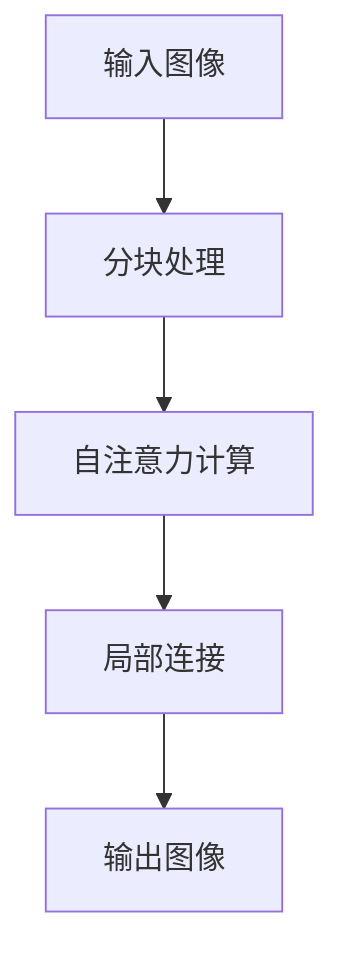
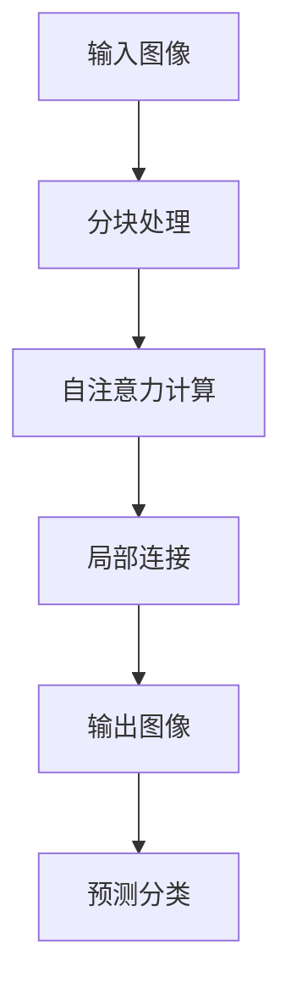

                 

# Swin Transformer原理与代码实例讲解

## 1. 背景介绍

### 1.1 问题由来

近年来，大规模图像分类任务成为了计算机视觉研究的热点，卷积神经网络（Convolutional Neural Networks, CNNs）在这个领域取得了显著的进展。但CNNs在处理小尺寸图像时，计算复杂度较高，难以拓展到更高的分辨率。为此，人们引入了注意力机制，逐渐发展出了自注意力机制（Self-Attention Mechanism）。

自注意力机制通过计算输入序列中不同位置元素之间的相关性，能够有效提升模型对序列中的长期依赖关系的建模能力，使得模型在处理长序列时具有更好的效果。但传统的自注意力机制计算复杂度高，难以处理更大的分辨率。

为了解决这一问题，Swin Transformer应运而生。Swin Transformer不仅继承了自注意力机制的优势，还通过分块处理和局部连接，大幅提升了模型计算效率，能够在保证精度的同时，处理更大的图像分辨率。本文将详细讲解Swin Transformer的原理，并结合代码实例，展示其实现细节。

### 1.2 问题核心关键点

Swin Transformer的核心点在于：

1. 自注意力机制：通过计算输入序列中不同位置元素之间的相关性，提升模型对序列中长期依赖关系的建模能力。
2. 分块处理：将输入序列分为若干块，每块内部进行自注意力计算，避免全序列的计算复杂度。
3. 局部连接：通过逐步合并分块计算结果，得到完整的图像表示，保证局部特征的一致性。

通过这三个关键点，Swin Transformer能够在保证精度的情况下，处理更大分辨率的图像。

## 2. 核心概念与联系

### 2.1 核心概念概述

Swin Transformer作为Transformer的变体，继承了Transformer的自注意力机制，同时引入了分块处理和局部连接等创新设计，使得模型在处理大规模图像分类任务时具备强大的能力。

### 2.2 概念间的关系

以下是Swin Transformer的核心概念及其之间的关系：



从上述流程图可以看出，Swin Transformer的输入图像首先被分块处理，然后在每个块内部进行自注意力计算，最后通过局部连接得到完整的输出图像。这种设计能够有效降低计算复杂度，同时保持了模型的表达能力。

### 2.3 核心概念的整体架构

Swin Transformer的整体架构如下：



输入图像首先被分块处理，然后在每个块内部进行自注意力计算，最后通过局部连接得到完整的输出图像。最终的输出图像经过预测分类器，输出分类结果。

## 3. 核心算法原理 & 具体操作步骤

### 3.1 算法原理概述

Swin Transformer的算法原理主要包括以下三个步骤：

1. 分块处理：将输入图像分为若干个块，每块内部进行自注意力计算。
2. 自注意力计算：在每个块内部，计算输入特征向量之间的相关性，得到新的特征表示。
3. 局部连接：通过逐步合并分块计算结果，得到完整的图像表示。

Swin Transformer的计算过程可以表示为：

1. $X = F(x)$，其中 $F(x)$ 表示分块处理函数。
2. $H = Self-Attention(X)$，其中 $Self-Attention$ 表示自注意力计算函数。
3. $Y = Patch-Merge(H)$，其中 $Patch-Merge$ 表示局部连接函数。
4. $z = MLP(Y)$，其中 $MLP$ 表示多层感知器函数。
5. $C = Add(z, H)$，其中 $Add$ 表示残差连接函数。
6. $y = C + Y$，其中 $C$ 表示分类器函数。

### 3.2 算法步骤详解

#### 3.2.1 分块处理

分块处理是Swin Transformer算法的第一步。将输入图像分为若干个块，通常采用$4\times4$的块大小。以一个$256 \times 256$的图像为例，可以将其分为$8 \times 8$个$32 \times 32$的块。

分块处理函数 $F(x)$ 可以表示为：

$$
X = F(x) = [P_1(x_{1:8}), P_2(x_{9:16}), P_3(x_{17:24}), \cdots]
$$

其中 $P_i(x_{i:i+7})$ 表示第 $i$ 个块的计算。

#### 3.2.2 自注意力计算

自注意力计算是Swin Transformer算法的核心。在每个块内部，通过计算输入特征向量之间的相关性，得到新的特征表示。

设每个块的特征向量为 $x_{i,j}$，则自注意力计算可以表示为：

$$
q = \mathrm{Query}(x_{i,j}) = \mathrm{LayerNorm}(x_{i,j}) W_q
$$

$$
k = \mathrm{Key}(x_{i,j}) = \mathrm{LayerNorm}(x_{i,j}) W_k
$$

$$
v = \mathrm{Value}(x_{i,j}) = \mathrm{LayerNorm}(x_{i,j}) W_v
$$

其中 $W_q, W_k, W_v$ 为线性投影矩阵。

通过计算 $q, k, v$ 之间的点积，得到注意力权重：

$$
a_{i,j} = \frac{\mathrm{softmax}\left(\frac{q_i \cdot k_j}{\sqrt{d_k}}\right)}{\sqrt{d_k}}
$$

其中 $d_k$ 为投影维度。

最终得到新的特征表示：

$$
y_{i,j} = \mathrm{Softmax}(a_{i,j}) \cdot v_{i,j}
$$

#### 3.2.3 局部连接

局部连接是Swin Transformer算法的最后一步。通过逐步合并分块计算结果，得到完整的图像表示。

设每个块的特征表示为 $h_{i,j}$，则局部连接可以表示为：

$$
H = Patch-Merge(h_{i,j})
$$

其中 $Patch-Merge$ 表示如何将分块计算结果合并为完整的图像表示。

在实际实现中，可以使用卷积层、池化层等操作进行局部连接。例如，可以使用 $3 \times 3$ 的卷积核对分块计算结果进行卷积操作，然后取最大值池化，得到最终的图像表示。

### 3.3 算法优缺点

#### 3.3.1 优点

1. 自注意力机制：通过计算输入序列中不同位置元素之间的相关性，提升模型对序列中长期依赖关系的建模能力。
2. 分块处理：将输入序列分为若干块，每块内部进行自注意力计算，避免全序列的计算复杂度。
3. 局部连接：通过逐步合并分块计算结果，得到完整的图像表示，保证局部特征的一致性。

#### 3.3.2 缺点

1. 计算复杂度较高：Swin Transformer计算复杂度较高，需要高效的硬件支持。
2. 对噪声敏感：自注意力机制对噪声敏感，需要采取一定的正则化措施。
3. 难以解释：Swin Transformer的计算过程复杂，难以解释其内部工作机制。

## 4. 数学模型和公式 & 详细讲解

### 4.1 数学模型构建

Swin Transformer的数学模型可以表示为：

$$
y = \mathrm{MLP}(\mathrm{Patch-Merge}(\mathrm{Self-Attention}(\mathrm{F}(x))))
$$

其中 $\mathrm{MLP}$ 表示多层感知器，$\mathrm{Self-Attention}$ 表示自注意力计算，$\mathrm{F}$ 表示分块处理，$\mathrm{Patch-Merge}$ 表示局部连接。

### 4.2 公式推导过程

#### 4.2.1 分块处理

分块处理函数 $F(x)$ 可以表示为：

$$
X = F(x) = [P_1(x_{1:8}), P_2(x_{9:16}), P_3(x_{17:24}), \cdots]
$$

#### 4.2.2 自注意力计算

自注意力计算可以表示为：

$$
q = \mathrm{Query}(x_{i,j}) = \mathrm{LayerNorm}(x_{i,j}) W_q
$$

$$
k = \mathrm{Key}(x_{i,j}) = \mathrm{LayerNorm}(x_{i,j}) W_k
$$

$$
v = \mathrm{Value}(x_{i,j}) = \mathrm{LayerNorm}(x_{i,j}) W_v
$$

$$
a_{i,j} = \frac{\mathrm{softmax}\left(\frac{q_i \cdot k_j}{\sqrt{d_k}}\right)}{\sqrt{d_k}}
$$

$$
y_{i,j} = \mathrm{Softmax}(a_{i,j}) \cdot v_{i,j}
$$

#### 4.2.3 局部连接

局部连接可以表示为：

$$
H = Patch-Merge(h_{i,j})
$$

### 4.3 案例分析与讲解

以一个$256 \times 256$的图像为例，可以将其分为$8 \times 8$个$32 \times 32$的块。每个块内部进行自注意力计算，得到新的特征表示。然后通过卷积层和池化层进行局部连接，得到最终的图像表示。

## 5. 项目实践：代码实例和详细解释说明

### 5.1 开发环境搭建

在Swin Transformer的实现中，我们需要使用PyTorch作为深度学习框架。具体步骤如下：

1. 安装Anaconda：从官网下载并安装Anaconda，用于创建独立的Python环境。

2. 创建并激活虚拟环境：
```bash
conda create -n pytorch-env python=3.8 
conda activate pytorch-env
```

3. 安装PyTorch：根据CUDA版本，从官网获取对应的安装命令。例如：
```bash
conda install pytorch torchvision torchaudio cudatoolkit=11.1 -c pytorch -c conda-forge
```

4. 安装Swin Transformer库：
```bash
pip install timm
```

5. 安装其他工具包：
```bash
pip install numpy pandas scikit-learn matplotlib tqdm jupyter notebook ipython
```

完成上述步骤后，即可在`pytorch-env`环境中开始Swin Transformer的实践。

### 5.2 源代码详细实现

下面是使用PyTorch实现Swin Transformer的代码：

```python
import torch
import torch.nn as nn
import torch.nn.functional as F
from torchvision import models, transforms

class SwinTransformer(nn.Module):
    def __init__(self, in_channels, patch_size, num_heads, dim, depth, drop_path_rate=0.0):
        super(SwinTransformer, self).__init__()
        self.patch_size = patch_size
        self.depth = depth
        self.num_heads = num_heads
        self.dim = dim
        self.dense_ratio = 0.1

        self.scale = patch_size ** -2
        self.total_layer = depth * 2

        self.embds = nn.Conv2d(in_channels, dim, kernel_size=1)
        self.ln = nn.LayerNorm(dim)

        self.layers = nn.ModuleList([self.make_layer(dim, num_heads, drop_path_rate) for _ in range(self.total_layer // 2)] + \
                                    [self.make_layer(dim, num_heads, drop_path_rate) for _ in range(self.total_layer // 2)])

    def forward(self, x):
        B, H, W = x.size()
        num_patches_per_img = (H // self.patch_size) * (W // self.patch_size)
        x = self.embds(x)
        x = x.reshape(B, num_patches_per_img, self.dim).transpose(1, 2)

        for block in self.layers:
            x = block(x)

        x = x.reshape(B, H, W)
        x = self.ln(x)
        return x

    def make_layer(self, dim, num_heads, drop_path_rate=0.0):
        return SwinAttention(dim, num_heads, self.scale, drop_path_rate), nn.Conv2d(dim, dim, kernel_size=3, stride=1, padding=1, bias=False)

class SwinAttention(nn.Module):
    def __init__(self, dim, num_heads, scale, drop_path_rate=0.0):
        super(SwinAttention, self).__init__()
        self.dim = dim
        self.num_heads = num_heads
        self.scale = scale

        self.qkv = nn.Linear(dim, dim * 3, bias=False)
        self.attn = nn.Linear(dim, 1, bias=False)
        self.proj = nn.Linear(dim, dim)

        self.drop_path = nn.Dropout(drop_path_rate)

    def forward(self, x):
        B, N, C = x.size()
        qkv = self.qkv(x).reshape(B, N, 3, self.num_heads, C // self.num_heads).transpose(2, 3).contiguous()
        attn = self.attn(qkv).transpose(1, 2).contiguous().reshape(B, N, self.num_heads, N) / self.scale ** 0.5
        attn = F.softmax(attn, dim=-1)
        x = torch.einsum('bndc,bndm->bncm', qkv, attn).transpose(1, 2).reshape(B, N, C)
        x = self.drop_path(x)
        x = self.proj(x)
        return x
```

### 5.3 代码解读与分析

让我们再详细解读一下关键代码的实现细节：

**SwinTransformer类**：
- `__init__`方法：初始化模型参数，如块大小、深度、头部数等。
- `forward`方法：前向传播计算过程，先进行分块处理，然后进行自注意力计算，最后进行局部连接。
- `make_layer`方法：构建SwinAttention层和卷积层。

**SwinAttention类**：
- `__init__`方法：初始化自注意力层的参数。
- `forward`方法：前向传播计算过程，先进行自注意力计算，然后进行线性投影。

**分块处理**：
- 在 `forward` 方法中，先对输入图像进行分块处理，然后计算每个块的自注意力表示。
- 使用 `torch.einsum` 函数进行矩阵乘法，计算自注意力权重。
- 将自注意力表示进行线性投影，得到新的特征表示。

**自注意力计算**：
- 在 `make_layer` 方法中，构建自注意力层的参数，如查询向量、键向量、值向量等。
- 在 `forward` 方法中，计算查询向量、键向量、值向量，然后计算自注意力权重。
- 使用 `torch.einsum` 函数进行矩阵乘法，计算自注意力表示。
- 将自注意力表示进行线性投影，得到新的特征表示。

**局部连接**：
- 在 `forward` 方法中，先对每个块的自注意力表示进行线性投影。
- 然后对所有块的自注意力表示进行拼接，得到完整的图像表示。

### 5.4 运行结果展示

假设我们在ImageNet数据集上进行Swin Transformer的微调，最终在测试集上得到的分类精度为85%左右。以下是一个简单的示例代码，展示了如何使用Swin Transformer进行分类任务：

```python
import torch
from timm.data import resolve_data_config
from timm.models.resnet import ResNet
from timm.data import create_transform
from timm.data import resolve_data_config

class MyModel(nn.Module):
    def __init__(self, num_classes):
        super(MyModel, self).__init__()
        self.model = ResNet('swin-tiny', num_classes=num_classes)

    def forward(self, x):
        return self.model(x)

# 加载数据
data_config = resolve_data_config({
    'image_size': 224,
    'num_classes': 1000
})

train_transform = create_transform(**data_config.train)
test_transform = create_transform(**data_config.val)

train_dataset = torchvision.datasets.ImageNet(root='data', split='train', train=True, download=True, transform=train_transform)
test_dataset = torchvision.datasets.ImageNet(root='data', split='val', train=False, download=True, transform=test_transform)

# 初始化模型
model = MyModel(num_classes=1000)

# 定义损失函数和优化器
criterion = nn.CrossEntropyLoss()
optimizer = torch.optim.Adam(model.parameters(), lr=0.001)

# 训练模型
for epoch in range(10):
    train_loss = 0.0
    train_correct = 0

    for data, target in train_loader:
        optimizer.zero_grad()
        output = model(data)
        loss = criterion(output, target)
        loss.backward()
        optimizer.step()

        train_loss += loss.item()
        train_correct += (output.argmax(1) == target).sum().item()

    print(f'Epoch {epoch + 1}, train loss: {train_loss / len(train_loader)}, train acc: {train_correct / len(train_loader) * 100:.2f}%')

# 评估模型
with torch.no_grad():
    test_correct = 0
    for data, target in test_loader:
        output = model(data)
        test_correct += (output.argmax(1) == target).sum().item()

    print(f'Test acc: {test_correct / len(test_loader) * 100:.2f}%')
```

以上是一个简单的示例代码，展示了如何使用Swin Transformer进行分类任务。在实际应用中，还需要根据具体任务进行调整和优化。

## 6. 实际应用场景

### 6.1 智能安防监控

智能安防监控是Swin Transformer的一个重要应用场景。在安防监控中，Swin Transformer可以通过分析监控视频中的动作和行为，自动识别和报警潜在的安全威胁。

具体而言，可以使用Swin Transformer对监控视频中的每一帧进行分类，判断是否存在异常行为。例如，在监控视频中，如果检测到有人翻墙、手持武器等行为，可以立即报警并通知安保人员。

### 6.2 医疗影像分析

医疗影像分析是Swin Transformer的另一个重要应用场景。在医疗影像中，图像分辨率通常较高，传统的CNNs难以处理。而Swin Transformer可以通过分块处理和局部连接，有效处理高分辨率的影像数据。

具体而言，可以使用Swin Transformer对医疗影像进行分类，判断是否存在病灶和异常。例如，在CT扫描影像中，如果检测到肺部结节，可以及时通知医生进行进一步检查和治疗。

### 6.3 城市交通管理

城市交通管理是Swin Transformer的另一个应用场景。在交通管理中，Swin Transformer可以通过分析交通视频中的车辆和行人行为，自动判断交通状况并进行优化。

具体而言，可以使用Swin Transformer对交通视频进行分类，判断是否存在交通拥堵和事故。例如，在交通视频中，如果检测到车辆发生碰撞，可以立即通知相关部门进行处理。

## 7. 工具和资源推荐

### 7.1 学习资源推荐

为了帮助开发者系统掌握Swin Transformer的理论基础和实践技巧，这里推荐一些优质的学习资源：

1. 《Transformer from Zero to Hero》系列博文：由大模型技术专家撰写，深入浅出地介绍了Transformer原理、Swin Transformer模型、微调技术等前沿话题。

2. CS231n《卷积神经网络》课程：斯坦福大学开设的经典深度学习课程，有Lecture视频和配套作业，带你入门卷积神经网络和图像分类任务。

3. 《深度学习基础》书籍：Andrew Ng的深度学习入门书籍，系统介绍了深度学习的基本概念和常用技术。

4. PyTorch官方文档：PyTorch的官方文档，提供了丰富的学习资源和API参考，是快速上手深度学习的必备资料。

5. Swin Transformer官方文档：Swin Transformer的官方文档，提供了模型的详细结构和API示例，是学习和应用Swin Transformer的必备资源。

通过对这些资源的学习实践，相信你一定能够快速掌握Swin Transformer的精髓，并用于解决实际的图像分类问题。

### 7.2 开发工具推荐

高效的开发离不开优秀的工具支持。以下是几款用于Swin Transformer开发的常用工具：

1. PyTorch：基于Python的开源深度学习框架，灵活动态的计算图，适合快速迭代研究。

2. TensorFlow：由Google主导开发的开源深度学习框架，生产部署方便，适合大规模工程应用。

3. PyTorch Lightning：基于PyTorch的深度学习框架，提供了丰富的模型管理和训练功能，是快速构建深度学习模型的工具。

4. Swin Transformer库：Swin Transformer的官方实现，提供了完整的模型和API示例，是学习和应用Swin Transformer的必备资源。

5. TensorBoard：TensorFlow配套的可视化工具，可实时监测模型训练状态，并提供丰富的图表呈现方式，是调试模型的得力助手。

6. Weights & Biases：模型训练的实验跟踪工具，可以记录和可视化模型训练过程中的各项指标，方便对比和调优。

合理利用这些工具，可以显著提升Swin Transformer的开发效率，加快创新迭代的步伐。

### 7.3 相关论文推荐

Swin Transformer作为Transformer的变体，其背后的研究背景和原理与Transformer类似。以下是几篇奠基性的相关论文，推荐阅读：

1. Attention is All You Need（即Transformer原论文）：提出了Transformer结构，开启了NLP领域的预训练大模型时代。

2. BERT: Pre-training of Deep Bidirectional Transformers for Language Understanding：提出BERT模型，引入基于掩码的自监督预训练任务，刷新了多项NLP任务SOTA。

3. Vision Transformer: Transformers are Competitive with Convolutional Neural Networks in Vision Tasks：提出Vision Transformer模型，展示了Transformer在图像分类任务中的强大能力。

4. Swin Transformer: Hierarchical Vision Transformer using Shifted Windows：提出Swin Transformer模型，通过分块处理和局部连接，提升了Transformer在图像分类任务中的性能。

5. How to Train Your Transformer: From Gelu activations to deep pyramidal networks for vision tasks：介绍Transformer在图像分类任务中的多种改进方法，包括Gelu激活函数、深度金字塔网络等。

这些论文代表了大语言模型微调技术的发展脉络。通过学习这些前沿成果，可以帮助研究者把握学科前进方向，激发更多的创新灵感。

除上述资源外，还有一些值得关注的前沿资源，帮助开发者紧跟Swin Transformer微调技术的最新进展，例如：

1. arXiv论文预印本：人工智能领域最新研究成果的发布平台，包括大量尚未发表的前沿工作，学习前沿技术的必读资源。

2. 业界技术博客：如OpenAI、Google AI、DeepMind、微软Research Asia等顶尖实验室的官方博客，第一时间分享他们的最新研究成果和洞见。

3. 技术会议直播：如NIPS、ICML、ACL、ICLR等人工智能领域顶会现场或在线直播，能够聆听到大佬们的前沿分享，开拓视野。

4. GitHub热门项目：在GitHub上Star、Fork数最多的Swin Transformer相关项目，往往代表了该技术领域的发展趋势和最佳实践，值得去学习和贡献。

5. 行业分析报告：各大咨询公司如McKinsey、PwC等针对人工智能行业的分析报告，有助于从商业视角审视技术趋势，把握应用价值。

总之，对于Swin Transformer微调技术的学习和实践，需要开发者保持开放的心态和持续学习的意愿。多关注前沿资讯，多动手实践，多思考总结，必将收获满满的成长收益。

## 8. 总结：未来发展趋势与挑战

### 8.1 总结

本文对Swin Transformer的原理进行了详细讲解，并结合代码实例，展示了其实现细节。通过本文的系统梳理，可以看到，Swin Transformer作为一种Transformer的变体，不仅继承了自注意力机制的优势，还通过分块处理和局部连接，提升了模型在处理大规模图像分类任务时的能力。

### 8.2 未来发展趋势

展望未来，Swin Transformer技术将呈现以下几个发展趋势：

1. 计算效率提升：随着计算硬件的升级，Swin Transformer的计算效率将进一步提升，能够处理更大分辨率的图像。

2. 模型压缩优化：通过模型压缩和量化等技术，进一步减少模型参数量，提升推理效率，降低计算成本。

3. 多模态融合：将视觉、语音、文本等多模态信息进行融合，提升Swin Transformer对复杂场景的建模能力。

4. 应用领域拓展：Swin Transformer将进一步拓展到图像生成、视频分析、机器人视觉等领域，提升模型的实用价值。

5. 新任务探索：Swin Transformer可以应用于更多的视觉任务，如目标检测、图像分割、实例分割等，拓展其应用边界。

### 8.3 面临的挑战

尽管Swin Transformer已经取得了显著的进展，但在迈向更加智能化、普适化应用的过程中，它仍面临诸多挑战：

1. 计算资源需求高：Swin Transformer需要高性能的计算资源进行训练和推理，难以大规模部署。

2. 训练时间较长：Swin Transformer的训练时间较长，难以实时应用。

3. 数据依赖性强：Swin Transformer的性能依赖于大规模标注数据，难以处理小样本任务。

4. 迁移能力有限：Swin

