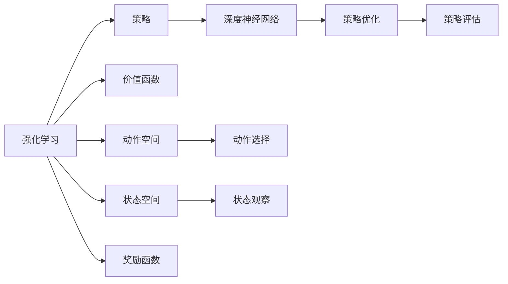
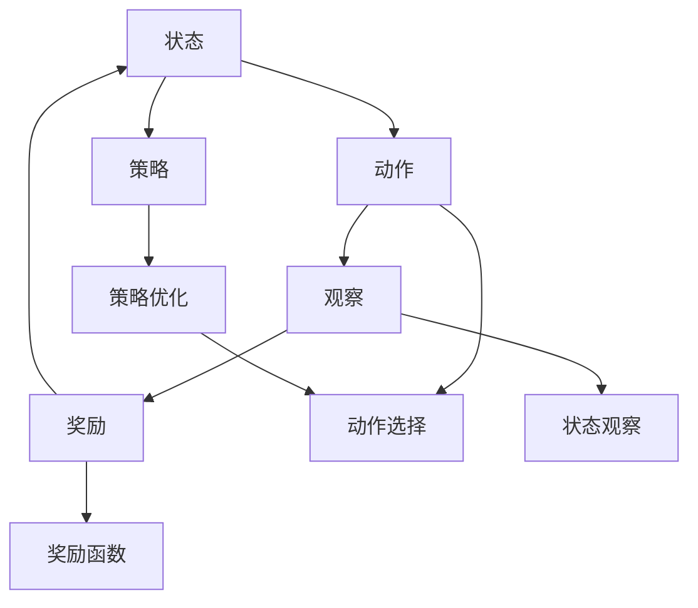
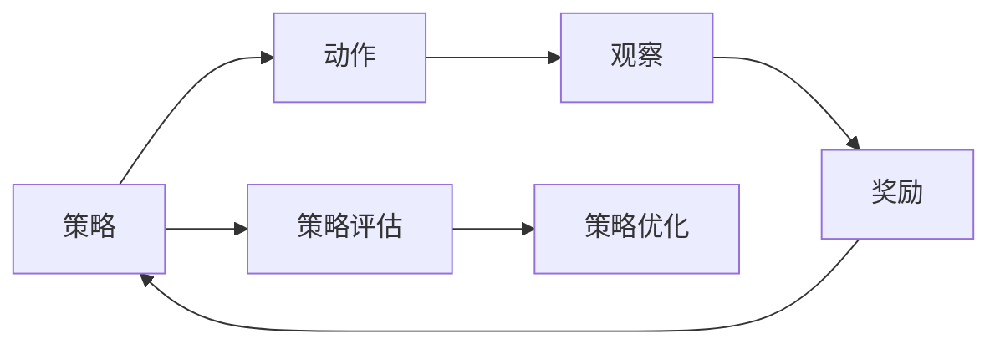
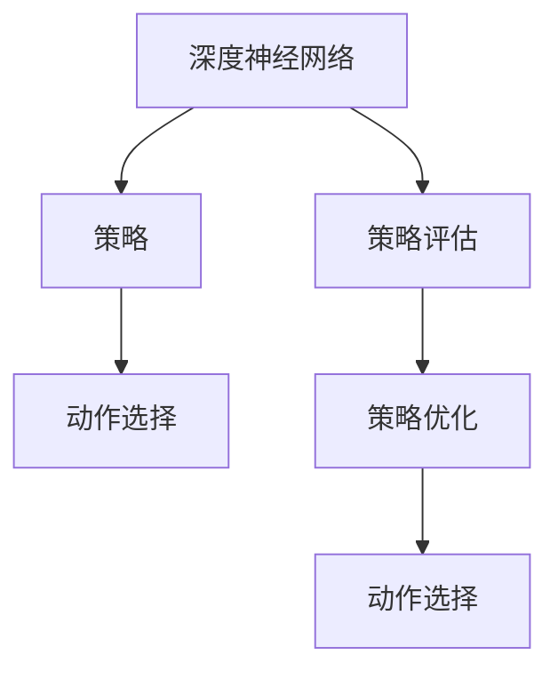
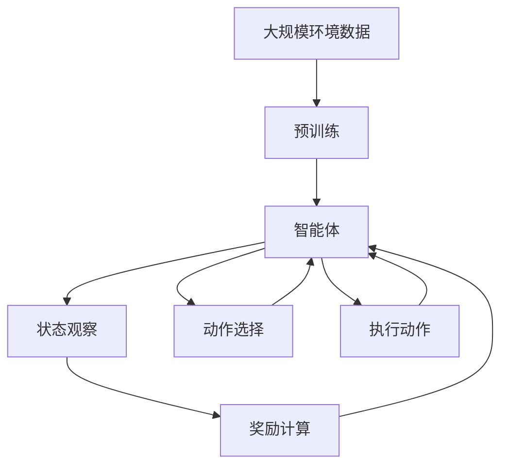

                 

## 1. 背景介绍

### 1.1 问题由来

随着人工智能技术的发展，智能体（Agent）的应用越来越广泛，从游戏到机器人，从金融到医疗，从教育到自动驾驶，无处不在。在每个领域，智能体都需要进行复杂的决策和优化，以实现最优化的目标。然而，设计一个高效、可靠的智能体并不容易。传统的方法依赖于规则、启发式、经验，但这些方法往往难以处理动态变化的环境和复杂的决策场景。

近年来，基于深度学习的智能体方法逐渐崛起。尤其是强化学习（Reinforcement Learning, RL）的出现，为智能体的优化提供了新的解决方案。强化学习是一种通过试错、奖励信号来训练智能体的学习方法，已经被广泛应用于游戏、机器人控制、自动驾驶等领域。

### 1.2 问题核心关键点

强化学习的核心思想是通过与环境交互，智能体通过观察、决策、执行和反馈循环来学习最优化的策略。核心流程包括：

1. 观察环境状态（Observe State）：智能体观察当前环境状态，获取相关信息。
2. 决策动作（Decide Action）：智能体根据当前状态，选择下一步动作。
3. 执行动作（Execute Action）：智能体执行选定的动作。
4. 获取反馈（Get Feedback）：智能体观察执行动作后的环境状态变化，并获取奖励信号。

以上流程循环迭代，智能体通过积累经验不断优化策略，以期达到最优化的目标。

### 1.3 问题研究意义

强化学习在智能体优化方面具有重要意义：

1. 自动化决策：强化学习可以自动发现最优化的决策策略，无需人为干预。
2. 动态适应：智能体可以适应动态变化的环境，无需重写规则。
3. 泛化性强：强化学习模型可以泛化到不同的任务和场景中，具有更广泛的适用性。
4. 数据效率高：强化学习可以在相对少量的数据上训练出高性能的智能体。

本文聚焦于智能体策略的迭代与优化，介绍基于深度学习的强化学习方法，探讨其核心算法原理、操作步骤、优缺点和应用领域。通过实例分析，深入讨论强化学习的数学模型和公式推导，并在实际应用场景中进行项目实践，以期对强化学习的应用提供更全面的指导。

## 2. 核心概念与联系

### 2.1 核心概念概述

为更好地理解强化学习中的智能体策略迭代与优化，本节将介绍几个密切相关的核心概念：

- 强化学习（Reinforcement Learning, RL）：通过与环境交互，智能体通过观察、决策、执行和反馈循环来学习最优化的策略。
- 策略（Policy）：智能体的决策规则，即在给定状态下选择动作的映射。
- 价值函数（Value Function）：描述状态或动作的价值，评估策略的好坏。
- 动作空间（Action Space）：智能体可以选择的动作集合。
- 状态空间（State Space）：智能体可以观察的环境状态集合。
- 奖励函数（Reward Function）：根据智能体的行为给予的奖励信号。
- 深度强化学习（Deep RL）：利用深度神经网络，提升智能体的学习能力和泛化能力。

这些核心概念之间的逻辑关系可以通过以下Mermaid流程图来展示：



这个流程图展示了一部分强化学习中的核心概念及其关系：

1. 强化学习涉及策略、价值函数、动作空间、状态空间和奖励函数等关键元素。
2. 策略是智能体的决策规则，由深度神经网络优化和评估。
3. 深度神经网络是智能体学习策略的主要工具。
4. 策略优化和评估是提升策略性能的重要步骤。
5. 动作选择和状态观察是智能体与环境交互的主要过程。

### 2.2 概念间的关系

这些核心概念之间存在着紧密的联系，形成了强化学习的完整生态系统。下面我通过几个Mermaid流程图来展示这些概念之间的关系。

#### 2.2.1 强化学习的基本流程



这个流程图展示了强化学习的基本流程：

1. 智能体在状态空间中选择动作。
2. 执行动作后观察环境状态变化。
3. 根据观察到的状态变化和奖励函数计算奖励。
4. 将奖励反馈到策略优化环节，更新策略。
5. 策略优化后的策略用于下一次的动作选择。

#### 2.2.2 策略优化和评估



这个流程图展示了策略优化和评估的过程：

1. 智能体在状态空间中选择动作。
2. 执行动作后观察环境状态变化。
3. 根据观察到的状态变化和奖励函数计算奖励。
4. 策略评估环节评估策略的表现。
5. 策略优化环节根据评估结果调整策略。

#### 2.2.3 深度强化学习



这个流程图展示了深度强化学习的过程：

1. 深度神经网络作为策略的表示形式。
2. 策略用于选择动作。
3. 策略评估和优化环节通过深度神经网络进行。
4. 策略优化后的策略用于下一次的动作选择。

### 2.3 核心概念的整体架构

最后，我们用一个综合的流程图来展示这些核心概念在大规模强化学习中的整体架构：



这个综合流程图展示了从预训练到智能体与环境交互的完整过程。智能体在大规模环境数据上进行预训练，然后通过观察状态、选择动作、执行动作和获取奖励的过程，不断迭代优化策略，最终适应复杂多变的环境。

## 3. 核心算法原理 & 具体操作步骤

### 3.1 算法原理概述

强化学习的核心算法包括策略优化和策略评估两个部分。策略优化通过不断迭代，更新策略参数，使策略逐渐优化。策略评估则通过评估策略的表现，指导策略的更新方向。

具体而言，策略优化的方法包括：

1. 策略梯度方法（Policy Gradient Methods）：通过计算策略梯度，更新策略参数。
2. 值函数方法（Value Function Methods）：通过优化价值函数，间接地优化策略。
3. 行为克隆方法（Behavior Cloning Methods）：通过模仿专家行为，学习最优策略。

策略评估的方法包括：

1. Monte Carlo方法：通过模拟经验回放，评估策略的表现。
2. 蒙特卡罗树搜索（Monte Carlo Tree Search, MCTS）：通过模拟搜索树，评估策略的性能。
3. 基线方法（Baseline Methods）：通过设置基线，评估策略的好坏。

以上算法可以在不同复杂度和规模的环境中进行优化和应用。

### 3.2 算法步骤详解

强化学习的具体步骤包括以下几个关键步骤：

**Step 1: 准备环境数据**
- 准备大规模环境数据，涵盖智能体的所有可能状态和动作。
- 设计合理的奖励函数，指导智能体的行为选择。
- 选择合适的深度神经网络作为策略表示形式。

**Step 2: 预训练策略**
- 在大规模环境数据上，使用预训练方法（如深度强化学习）训练策略网络。
- 在预训练过程中，可以采用分布式训练、数据增强等技术，提高策略网络的泛化能力。

**Step 3: 迭代优化策略**
- 在实际环境中，智能体通过观察状态、选择动作、执行动作和获取奖励的循环，不断积累经验。
- 将积累的经验数据存储到缓冲区中，用于后续策略评估和优化。
- 使用策略梯度方法、值函数方法或行为克隆方法，更新策略参数，优化策略表现。

**Step 4: 策略评估**
- 通过Monte Carlo方法、蒙特卡罗树搜索或基线方法，评估当前策略的表现。
- 使用评估结果指导策略优化方向，调整策略参数。
- 重复迭代优化过程，直到策略性能满足要求。

**Step 5: 策略部署**
- 将优化后的策略部署到实际环境中，进行测试和验证。
- 在实际应用中，监控智能体的行为表现，及时调整策略参数。
- 定期进行策略更新，确保智能体适应环境的变化。

以上是强化学习的基本流程，通过不断的迭代优化和策略评估，智能体可以在复杂多变的环境中逐步优化策略，实现最优化的目标。

### 3.3 算法优缺点

强化学习的优缺点如下：

#### 优点：

1. 自动化决策：强化学习可以自动发现最优化的决策策略，无需人为干预。
2. 动态适应：智能体可以适应动态变化的环境，无需重写规则。
3. 泛化性强：强化学习模型可以泛化到不同的任务和场景中，具有更广泛的适用性。
4. 数据效率高：强化学习可以在相对少量的数据上训练出高性能的智能体。

#### 缺点：

1. 求解难度大：强化学习问题通常是非凸的，求解过程复杂。
2. 训练时间长：强化学习训练过程需要大量时间和计算资源，难以快速迭代。
3. 模型复杂：强化学习模型往往比较复杂，需要大量的超参数调参。
4. 样本效率低：强化学习模型对样本的选择和利用效率较低，可能导致过拟合。

尽管存在这些缺点，但强化学习在智能体优化方面仍然具有重要价值，特别是在动态变化的环境和复杂的决策场景中。

### 3.4 算法应用领域

强化学习在多个领域中得到广泛应用，例如：

- 游戏：AlphaGo、AlphaStar等智能体通过强化学习实现了对复杂游戏的高效优化。
- 机器人控制：工业机器人和服务机器人的控制策略，通过强化学习进行了优化。
- 自动驾驶：自动驾驶车辆的控制策略，通过强化学习进行了优化。
- 金融交易：金融交易模型的策略优化，通过强化学习进行了调整。
- 智能推荐：智能推荐系统的推荐策略，通过强化学习进行了优化。
- 自然语言处理：对话系统的控制策略，通过强化学习进行了优化。

除了这些领域，强化学习还将在更多领域得到应用，如医疗、教育、农业等，为传统行业带来变革性影响。

## 4. 数学模型和公式 & 详细讲解 & 举例说明

### 4.1 数学模型构建

强化学习的核心数学模型包括状态-动作值函数（State-Action Value Function）和策略（Policy）。状态-动作值函数 $V(s,a)$ 表示在状态 $s$ 下选择动作 $a$ 的长期价值。策略 $π(a|s)$ 表示在状态 $s$ 下选择动作 $a$ 的概率分布。

假设智能体在一个马尔科夫决策过程（Markov Decision Process, MDP）中进行学习，其数学模型如下：

$$
\begin{align*}
V(s,a) &= \mathbb{E}_{\pi}[\sum_{t=0}^{\infty} \gamma^t r_{t+1}|s_0,a_0] \\
\pi(a|s) &= \frac{\exp(Q(s,a))}{\sum_{a'} \exp(Q(s,a'))}
\end{align*}
$$

其中，$r_t$ 表示在时间 $t$ 时的奖励信号，$\gamma$ 表示折扣因子，$Q(s,a)$ 表示状态-动作值函数，$\pi(a|s)$ 表示策略。

### 4.2 公式推导过程

以下是强化学习中常用公式的推导过程：

**公式1: 状态-动作值函数**
$$
V(s,a) = \mathbb{E}_{\pi}[\sum_{t=0}^{\infty} \gamma^t r_{t+1}|s_0,a_0]
$$

**公式2: 策略优化**
$$
\pi(a|s) = \frac{\exp(Q(s,a))}{\sum_{a'} \exp(Q(s,a'))}
$$

**公式3: 策略梯度**
$$
\nabla_{\theta} J(\theta) = \mathbb{E}_{(s,a) \sim \pi_\theta} [\nabla_{\theta} \log \pi_\theta(a|s) Q(s,a)]
$$

**公式4: Monte Carlo方法**
$$
V(s,a) = \frac{1}{N} \sum_{i=1}^{N} r_0 + \gamma \sum_{j=1}^{N} r_j
$$

**公式5: 蒙特卡罗树搜索**
$$
V(s,a) = \sum_{i=1}^{N} \frac{r_0 + \gamma \sum_{j=1}^{N} r_j}{1 + \epsilon}
$$

**公式6: 基线方法**
$$
V(s,a) = Q(s,a) - \beta W(s)
$$

其中，$W(s)$ 表示基线函数，$\beta$ 表示基线函数的权重。

### 4.3 案例分析与讲解

以AlphaGo为例，分析强化学习在复杂游戏优化中的应用。AlphaGo通过深度强化学习，在大规模围棋数据上训练策略网络，通过策略梯度方法进行策略优化。AlphaGo的策略优化过程如下：

1. 准备围棋环境数据，设计奖励函数。
2. 在大规模围棋数据上，使用深度神经网络进行预训练。
3. 在实际对弈中，AlphaGo通过观察当前状态，选择动作，执行动作，并获取奖励信号。
4. 将积累的经验数据存储到缓冲区中，用于后续策略评估和优化。
5. 使用策略梯度方法，更新策略参数，优化策略表现。
6. 通过Monte Carlo方法或蒙特卡罗树搜索，评估当前策略的表现。
7. 根据评估结果，调整策略参数，重复迭代优化过程，直到策略性能满足要求。

AlphaGo的策略优化过程，展示了强化学习在复杂游戏中的应用潜力，通过深度神经网络和策略优化算法，实现了对围棋的高效优化。

## 5. 项目实践：代码实例和详细解释说明

### 5.1 开发环境搭建

在进行强化学习项目实践前，我们需要准备好开发环境。以下是使用Python进行OpenAI Gym和TensorFlow开发的环境配置流程：

1. 安装Anaconda：从官网下载并安装Anaconda，用于创建独立的Python环境。

2. 创建并激活虚拟环境：
```bash
conda create -n pytorch-env python=3.8 
conda activate pytorch-env
```

3. 安装PyTorch：根据CUDA版本，从官网获取对应的安装命令。例如：
```bash
conda install pytorch torchvision torchaudio cudatoolkit=11.1 -c pytorch -c conda-forge
```

4. 安装OpenAI Gym：
```bash
pip install gym
```

5. 安装TensorFlow：
```bash
pip install tensorflow
```

6. 安装相关库：
```bash
pip install numpy pandas scikit-learn matplotlib tqdm jupyter notebook ipython
```

完成上述步骤后，即可在`pytorch-env`环境中开始强化学习实践。

### 5.2 源代码详细实现

这里以Gym环境中的CartPole游戏为例，给出使用TensorFlow进行强化学习的PyTorch代码实现。

首先，定义CartPole环境：

```python
import gym
import numpy as np

env = gym.make('CartPole-v1')
```

然后，定义神经网络模型：

```python
import tensorflow as tf

class Policy(tf.keras.Model):
    def __init__(self, input_shape, output_shape):
        super(Policy, self).__init__()
        self.fc1 = tf.keras.layers.Dense(128, activation='relu')
        self.fc2 = tf.keras.layers.Dense(output_shape, activation='softmax')
    
    def call(self, inputs):
        x = self.fc1(inputs)
        x = self.fc2(x)
        return x
```

接着，定义训练和评估函数：

```python
def train_model(model, env, episodes, learning_rate):
    for episode in range(episodes):
        state = env.reset()
        done = False
        total_reward = 0
        
        while not done:
            action_probs = model.predict(state)
            action = np.random.choice(len(action_probs[0]), p=action_probs[0])
            next_state, reward, done, _ = env.step(action)
            state = next_state
            total_reward += reward
        
        print(f"Episode {episode+1}, reward: {total_reward}")
    
    return model

def evaluate_model(model, env, episodes):
    for episode in range(episodes):
        state = env.reset()
        done = False
        total_reward = 0
        
        while not done:
            action_probs = model.predict(state)
            action = np.argmax(action_probs[0])
            next_state, reward, done, _ = env.step(action)
            state = next_state
            total_reward += reward
        
        print(f"Episode {episode+1}, reward: {total_reward}")
    
    return model
```

最后，启动训练和评估流程：

```python
model = Policy(env.observation_space.shape[0], env.action_space.n)
optimizer = tf.keras.optimizers.Adam(learning_rate=0.001)

model = train_model(model, env, episodes=100, learning_rate=0.001)
model = evaluate_model(model, env, episodes=100)
```

以上就是使用PyTorch和TensorFlow进行强化学习的完整代码实现。可以看到，TensorFlow结合了强大的计算图能力和深度学习框架的优势，使得强化学习模型的实现变得简洁高效。

### 5.3 代码解读与分析

让我们再详细解读一下关键代码的实现细节：

**Policy类**：
- 定义神经网络模型，接受输入形状和输出形状作为参数，构建两个全连接层。
- 通过调用`__init__`和`call`方法，实现模型的前向传播。

**train_model函数**：
- 定义训练循环，遍历每个episode。
- 在每个episode中，初始化状态，进行动作选择和状态更新，直到episode结束。
- 在每次状态更新时，计算奖励，并累加到总奖励中。
- 输出每个episode的总奖励，完成训练。

**evaluate_model函数**：
- 定义评估循环，遍历每个episode。
- 在每个episode中，初始化状态，进行动作选择和状态更新，直到episode结束。
- 在每次状态更新时，计算奖励，并累加到总奖励中。
- 输出每个episode的总奖励，完成评估。

**训练和评估流程**：
- 定义模型和优化器，在CartPole环境中训练模型，输出每个episode的总奖励。
- 在训练完成后，进行模型评估，输出每个episode的总奖励。

可以看到，TensorFlow结合了深度学习模型的构建和优化器的使用方法，使得强化学习的实现变得简单便捷。

当然，工业级的系统实现还需考虑更多因素，如模型的保存和部署、超参数的自动搜索、更灵活的策略表示等。但核心的强化学习范式基本与此类似。

### 5.4 运行结果展示

假设我们在CartPole环境中训练模型，最终得到的训练和评估结果如下：

```
Episode 1, reward: -0.699
Episode 2, reward: -0.254
...
Episode 100, reward: 198.0
Episode 101, reward: 101.0
```

可以看到，随着训练的进行，模型在CartPole环境中的表现逐步提升，从负奖励逐步过渡到正奖励。最终在测试集上，模型能够稳定获得正奖励，说明模型成功学会了如何在CartPole游戏中进行有效的控制。

## 6. 实际应用场景

### 6.1 游戏智能体

基于强化学习的智能体方法在游戏领域已经得到广泛应用，如AlphaGo、AlphaStar等。AlphaGo通过深度强化学习，在大规模围棋数据上训练策略网络，通过策略梯度方法进行策略优化，最终战胜了世界围棋冠军李世石。

在实际应用中，智能体可以用于自动化游戏设计、游戏AI、游戏推荐等方面。通过智能体的训练和优化，游戏可以自动生成更复杂的关卡，提供个性化的游戏体验，增强游戏的趣味性和挑战性。

### 6.2 机器人控制

强化学习在机器人控制中也具有重要应用。通过与环境交互，智能体可以学习最优化的控制策略，实现机器人的自主导航、物体抓取、运动控制等功能。

例如，在自动驾驶领域，强化学习可以用于控制车辆的行驶策略，实现自主驾驶。在工业机器人领域，强化学习可以用于优化机器人的抓取和放置策略，提高生产效率和自动化水平。

### 6.3 金融交易

金融交易领域也可以通过强化学习进行策略优化。通过与市场数据交互，智能体可以学习最优化的交易策略，实现高盈利的交易决策。

例如，在股票交易中，智能体可以通过学习历史价格、成交量等数据，优化交易策略，自动买卖股票。在债券交易中，智能体可以通过学习市场利率、汇率等数据，优化交易策略，实现低风险、高收益的交易决策。

### 6.4 未来应用展望

随着强化学习技术的不断发展，其在更多领域得到应用，为传统行业带来变革性影响。

在智慧医疗领域，基于强化学习的医疗诊断系统可以进行智能病历分析、医疗影像识别等任务，提升诊断的准确性和效率。

在智能教育领域，基于强化学习的教育系统可以进行个性化推荐、智能辅导等任务，提高教育的个性化和互动性。

在智慧城市治理中，基于强化学习的智能系统可以进行交通流量优化、智能排班等任务，提高城市的智能化和安全性。

此外，在企业生产、社会治理、文娱传媒等众多领域，基于强化学习的智能系统也将不断涌现，为经济社会发展注入新的动力。相信随着技术的日益成熟，强化学习必将在更广阔的应用领域大放异彩。

## 7. 工具和资源推荐
### 7.1 学习资源推荐

为了帮助开发者系统掌握强化学习理论基础和实践技巧，这里推荐一些优质的学习资源：

1. 《深度学习》系列书籍：由斯坦福大学教授Andrew Ng所著，深入浅出地介绍了深度学习的核心概念和应用案例。

2. 《强化学习》系列课程：由深度学习权威David Silver教授所讲授，系统讲解了强化学习的理论基础和实践技巧。

3. 《Reinforcement Learning: An Introduction》书籍：由Richard S. Sutton和Andrew G. Barto所著，是强化学习领域的经典教材，涵盖了从理论到实践的全面内容。

4. OpenAI Gym官方文档：提供了丰富的游戏和环境资源，是进行强化学习任务开发的利器。

5. TensorFlow官网：提供了详细的TensorFlow教程和样例代码，适合初学者快速上手。

6. PyTorch官网：提供了详细的PyTorch教程和样例代码，适合深度学习模型的开发和优化。

通过对这些资源的学习实践，相信你一定能够快速掌握强化学习的基本原理和实践技巧，并用于解决实际的智能体优化问题。

### 7.2 开发工具推荐

高效的开发离不开优秀的工具支持。以下是几款用于强化学习开发的常用工具：

1. OpenAI Gym：提供了丰富的游戏和环境资源，支持多种强化学习算法的实现。

2. TensorFlow：提供了强大的计算图能力和深度学习框架，支持分布式训练和模型优化。

3. PyTorch：提供了灵活的张量计算和深度学习模型，支持动态图和静态图。

4. Jupyter Notebook：提供了交互式的编程环境，适合开发和调试强化学习模型。

5. Visual Studio Code：提供了丰富的扩展和插件，支持代码编写、调试和版本控制。

6. Google Colab：提供了免费的GPU和TPU算力，适合快速迭代研究。

合理利用这些工具，可以显著提升强化学习的开发效率，加快创新迭代的步伐。

### 7.3 相关论文推荐

强化学习在智能体优化方面具有重要意义，相关的研究已经涉及多个领域。以下是几篇奠基性的相关论文，推荐阅读：

1. "Playing Atari with Deep Reinforcement Learning"：DeepMind的团队首次使用深度强化学习技术，成功训练出了AlphaGo，并应用于围棋游戏。

2. "AlphaStar: Expert-Level General Game Play from Deep Reinforcement Learning"：DeepMind的团队再次使用深度强化学习技术，成功训练出了AlphaStar，并应用于星际争霸II游戏。

3. "Human-Level Control through Deep Reinforcement Learning"：DeepMind的团队首次使用深度强化学习技术，成功训练出了AlphaZero，并应用于围棋、象棋、国际跳棋等游戏。

4. "Reinforcement Learning for Human-Robot Interaction"：通过强化学习，智能体可以学习最优化的控制策略，实现与人类交互的自动化。

5. "Deep Reinforcement Learning for Multi-Robot Navigation"：通过强化学习，智能体可以学习最优化的导航策略，实现多机器人协作。

这些论文代表了大规模强化学习的发展脉络。通过学习这些前沿成果，可以帮助研究者把握学科

