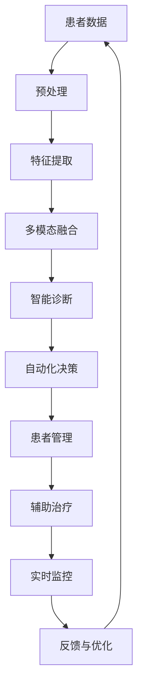

                 

# AI人工智能代理工作流 AI Agent WorkFlow：在医疗保健中的应用

> 关键词：人工智能代理工作流,医疗保健,自动化决策,智能诊断,患者管理

## 1. 背景介绍

随着人工智能技术的快速发展，AI在各行各业的应用越来越广泛。医疗保健作为关乎人类健康的关键领域，AI的应用也逐步深化，特别是AI人工智能代理工作流(AI Agent Workflow)，通过自动化决策、智能诊断和患者管理等手段，大大提升了医疗效率和服务质量，为患者提供了更精准、高效的医疗服务。

### 1.1 问题由来

在传统医疗保健体系中，由于信息处理和决策过程中的人为因素影响，医疗效率较低，误诊率较高，患者体验差。AI代理工作流通过将AI技术嵌入医疗流程中，可以实现自动化、智能化的决策和执行，极大地提高了医疗保健的效率和质量。

### 1.2 问题核心关键点

AI代理工作流通过模拟人类代理人在医疗环境中的工作流程，实现了医疗任务的自动化、智能化和高效化。其核心关键点包括：

- **自动化决策**：利用AI模型对患者的症状、检查结果等信息进行分析和推理，自动生成诊断建议。
- **智能诊断**：通过多模态融合、知识图谱嵌入等技术，提高诊断的准确性和全面性。
- **患者管理**：通过智能化手段管理患者的健康记录、预约、提醒等，提升患者管理效率。
- **辅助治疗**：结合AI模型和大数据分析，辅助医生制定个性化治疗方案，优化治疗效果。
- **实时监控**：通过实时监控患者健康数据，及时发现异常情况，提前预警，提升医疗安全性。

### 1.3 问题研究意义

AI代理工作流在医疗保健中的应用，对于提升医疗服务水平、降低医疗成本、提高患者满意度和医疗效率具有重要意义：

1. **提升医疗效率**：AI代理工作流能够自动化处理大部分医疗任务，减少人工操作，提升诊断和治疗的效率。
2. **降低医疗成本**：自动化流程减少了人力需求，降低了运营成本。
3. **提高诊断准确性**：通过智能化分析，减少误诊和漏诊，提升诊断的准确性和全面性。
4. **改善患者体验**：自动化管理和智能化服务提升了患者的满意度，减少了等待时间和操作复杂度。
5. **促进医疗创新**：AI代理工作流的应用为医疗领域带来新的思路和方法，推动医疗技术的创新和应用。

## 2. 核心概念与联系

### 2.1 核心概念概述

为更好地理解AI代理工作流在医疗保健中的应用，本节将介绍几个密切相关的核心概念：

- **AI代理工作流**：通过模拟人类代理人的工作流程，利用AI技术自动完成医疗任务，实现医疗流程的自动化和智能化。
- **自动化决策**：利用AI模型对患者数据进行分析，自动生成诊断和治疗建议。
- **智能诊断**：结合多模态数据、知识图谱等技术，提升诊断的准确性和全面性。
- **患者管理**：通过智能化手段管理患者信息，优化患者服务流程。
- **辅助治疗**：利用AI模型和大数据分析，辅助医生制定个性化治疗方案。
- **实时监控**：通过实时数据监控，提前预警，提高医疗安全性。

这些核心概念通过以下Mermaid流程图来展示它们之间的联系：



这个流程图展示了从患者数据输入到实时监控反馈的完整流程，突出了AI代理工作流各组件之间的相互关系和协作。

### 2.2 概念间的关系

这些核心概念之间存在着紧密的联系，形成了AI代理工作流在医疗保健中的完整生态系统。以下是这些概念间的联系：

- **患者数据与预处理**：患者数据需要通过预处理，转化为模型所需的格式，便于后续分析和推理。
- **特征提取与智能诊断**：特征提取是智能诊断的基础，通过提取有意义的特征，智能诊断可以更准确地识别患者情况。
- **多模态融合与智能诊断**：结合多模态数据，智能诊断可以更全面地理解患者状态，提升诊断精度。
- **自动化决策与患者管理**：自动化决策可以为患者提供准确的诊断和治疗建议，患者管理则可以更高效地执行这些建议。
- **辅助治疗与患者管理**：辅助治疗方案的制定需要基于患者的详细健康数据，患者管理可以确保这些数据准确无误。
- **实时监控与自动化决策**：实时监控可以及时发现异常情况，自动化决策可以根据实时数据调整策略。
- **反馈与优化与实时监控**：反馈与优化机制可以不断改进模型和流程，实时监控则保障系统在运行过程中始终可靠。

## 3. 核心算法原理 & 具体操作步骤
### 3.1 算法原理概述

AI代理工作流在医疗保健中的应用，主要基于以下算法原理：

1. **数据预处理**：对原始医疗数据进行清洗、归一化和标准化处理，生成模型所需格式。
2. **特征提取**：从处理后的数据中提取有用的特征，为模型提供输入。
3. **多模态融合**：将不同模态的数据（如文本、图像、基因数据等）融合在一起，提高模型的全面性和准确性。
4. **智能诊断**：利用深度学习、知识图谱等技术，进行疾病诊断和症状分析。
5. **自动化决策**：基于智能诊断结果，自动生成诊断和治疗建议。
6. **患者管理**：通过信息化手段，管理患者的健康记录、预约、提醒等。
7. **辅助治疗**：结合AI模型和大数据分析，辅助医生制定个性化治疗方案。
8. **实时监控**：实时监控患者健康数据，及时发现异常情况，提前预警。
9. **反馈与优化**：通过反馈机制，不断改进模型和流程，提升系统性能。

### 3.2 算法步骤详解

#### 3.2.1 数据预处理

数据预处理是AI代理工作流的第一步，主要包括数据清洗、归一化和标准化等步骤。具体步骤如下：

1. **数据清洗**：删除噪声数据、缺失值，保证数据的完整性和准确性。
2. **归一化**：将数据缩放到0-1之间，避免模型输入数据的分布差异影响训练效果。
3. **标准化**：将数据转换为标准正态分布，进一步减少模型输入的偏差。

#### 3.2.2 特征提取

特征提取是从原始数据中提取出对模型有用的特征，通常包括文本、图像、基因数据等。常用的特征提取方法有：

1. **文本特征提取**：使用词袋模型、TF-IDF等方法提取文本特征。
2. **图像特征提取**：使用卷积神经网络（CNN）提取图像特征。
3. **基因数据特征提取**：使用PCA等方法提取基因数据特征。

#### 3.2.3 多模态融合

多模态融合是将不同模态的数据融合在一起，提高模型的全面性和准确性。常用的多模态融合方法有：

1. **特征拼接**：将不同模态的特征拼接在一起，作为模型的输入。
2. **集成学习**：使用不同的模型对不同模态的数据进行处理，最后通过集成学习合并结果。
3. **协同学习**：不同模态的数据在不同模型上分别训练，最终进行联合优化。

#### 3.2.4 智能诊断

智能诊断是AI代理工作流的核心部分，主要利用深度学习和知识图谱等技术进行疾病诊断和症状分析。具体步骤如下：

1. **模型选择**：选择合适的深度学习模型（如CNN、RNN、Transformer等）进行训练。
2. **数据划分**：将数据划分为训练集、验证集和测试集。
3. **模型训练**：在训练集上训练模型，使用验证集进行调参。
4. **测试评估**：在测试集上评估模型性能，确保诊断准确性。

#### 3.2.5 自动化决策

基于智能诊断结果，自动生成诊断和治疗建议。具体步骤如下：

1. **规则引擎**：定义诊断和治疗规则，构建规则引擎。
2. **决策树**：使用决策树模型对诊断结果进行分类和判断。
3. **推荐系统**：结合患者历史数据，生成个性化的治疗建议。

#### 3.2.6 患者管理

患者管理通过信息化手段，管理患者的健康记录、预约、提醒等。具体步骤如下：

1. **数据存储**：将患者数据存储到数据库中，便于查询和管理。
2. **数据同步**：保证不同系统间的数据同步和一致性。
3. **预约提醒**：根据患者的预约信息，自动发送提醒通知。

#### 3.2.7 辅助治疗

辅助治疗结合AI模型和大数据分析，辅助医生制定个性化治疗方案。具体步骤如下：

1. **数据收集**：收集患者的健康数据，包括基因数据、生活习惯、病史等。
2. **分析计算**：使用数据分析工具进行数据处理和计算。
3. **方案生成**：基于分析结果，生成个性化的治疗方案。

#### 3.2.8 实时监控

实时监控通过实时数据监控，及时发现异常情况，提前预警。具体步骤如下：

1. **数据采集**：实时采集患者的健康数据，包括生命体征、血液指标等。
2. **异常检测**：使用异常检测算法（如时间序列分析、深度学习等）检测异常情况。
3. **预警通知**：根据异常情况，自动发送预警通知，提示医生和患者。

#### 3.2.9 反馈与优化

反馈与优化通过反馈机制，不断改进模型和流程，提升系统性能。具体步骤如下：

1. **用户反馈**：收集用户和医生的反馈意见，了解系统的优缺点。
2. **数据分析**：使用数据分析工具进行反馈数据分析，找出改进方向。
3. **模型优化**：根据数据分析结果，优化模型和算法。

### 3.3 算法优缺点

#### 3.3.1 优点

1. **高效性**：AI代理工作流可以自动化处理大部分医疗任务，提高医疗效率。
2. **准确性**：利用深度学习和知识图谱等技术，提高诊断和治疗的准确性。
3. **个性化**：结合患者历史数据和实时数据，生成个性化的治疗方案。
4. **实时性**：通过实时监控，及时发现异常情况，提前预警。
5. **稳定性**：利用反馈与优化机制，不断改进模型和流程，确保系统稳定。

#### 3.3.2 缺点

1. **数据质量依赖**：AI代理工作流的性能高度依赖数据质量，需要高质量的数据源。
2. **模型复杂性**：多模态融合和智能诊断等环节涉及复杂的模型和算法，需要较强的技术支持。
3. **隐私和安全问题**：患者数据隐私和安全性问题需要特别注意，避免数据泄露和滥用。
4. **人机交互问题**：AI代理工作流需要设计合理的人机交互界面，方便医生和患者使用。

### 3.4 算法应用领域

AI代理工作流在医疗保健中的应用领域非常广泛，以下是几个典型的应用场景：

1. **智能诊断**：利用AI技术进行疾病诊断和症状分析，提升诊断效率和准确性。
2. **自动化决策**：基于智能诊断结果，自动生成诊断和治疗建议，减少医生的工作负担。
3. **患者管理**：通过信息化手段管理患者的健康记录、预约、提醒等，提升患者管理效率。
4. **辅助治疗**：结合AI模型和大数据分析，辅助医生制定个性化治疗方案，优化治疗效果。
5. **实时监控**：通过实时数据监控，及时发现异常情况，提前预警，提升医疗安全性。

## 4. 数学模型和公式 & 详细讲解 & 举例说明

### 4.1 数学模型构建

AI代理工作流在医疗保健中的应用，主要基于以下数学模型：

1. **数据预处理模型**：对原始数据进行清洗、归一化和标准化处理。
2. **特征提取模型**：从数据中提取有用的特征，为模型提供输入。
3. **多模态融合模型**：将不同模态的数据融合在一起，提高模型的全面性和准确性。
4. **智能诊断模型**：利用深度学习、知识图谱等技术进行疾病诊断和症状分析。
5. **自动化决策模型**：基于智能诊断结果，自动生成诊断和治疗建议。
6. **患者管理模型**：通过信息化手段管理患者的健康记录、预约、提醒等。
7. **辅助治疗模型**：结合AI模型和大数据分析，辅助医生制定个性化治疗方案。
8. **实时监控模型**：通过实时数据监控，及时发现异常情况，提前预警。
9. **反馈与优化模型**：通过反馈机制，不断改进模型和流程，提升系统性能。

### 4.2 公式推导过程

#### 4.2.1 数据预处理模型

数据预处理模型主要包括以下步骤：

1. **数据清洗模型**：
$$
\text{cleaned\_data} = \text{clean}(\text{raw\_data})
$$
其中，$\text{clean}$表示清洗函数，可以删除噪声数据和缺失值。

2. **归一化模型**：
$$
\text{normalized\_data} = \frac{\text{cleaned\_data} - \mu}{\sigma}
$$
其中，$\mu$表示均值，$\sigma$表示标准差。

3. **标准化模型**：
$$
\text{standardized\_data} = \frac{\text{normalized\_data} - \mu'}{\sigma'}
$$
其中，$\mu'$和$\sigma'$分别表示标准正态分布的均值和标准差。

#### 4.2.2 特征提取模型

特征提取模型主要包括以下步骤：

1. **文本特征提取模型**：
$$
\text{text\_features} = \text{TF-IDF}(\text{text\_data})
$$
其中，$\text{TF-IDF}$表示词袋模型，用于提取文本特征。

2. **图像特征提取模型**：
$$
\text{image\_features} = \text{CNN}(\text{image\_data})
$$
其中，$\text{CNN}$表示卷积神经网络，用于提取图像特征。

3. **基因数据特征提取模型**：
$$
\text{gene\_features} = \text{PCA}(\text{gene\_data})
$$
其中，$\text{PCA}$表示主成分分析方法，用于提取基因数据特征。

#### 4.2.3 多模态融合模型

多模态融合模型主要包括以下步骤：

1. **特征拼接模型**：
$$
\text{fused\_features} = \text{concat}(\text{text\_features}, \text{image\_features}, \text{gene\_features})
$$
其中，$\text{concat}$表示特征拼接函数，将不同模态的特征拼接在一起。

2. **集成学习模型**：
$$
\text{fused\_features} = \text{aggregation}(\{\text{model}_i(\text{features}_i)\}_{i=1}^N)
$$
其中，$\{\text{model}_i\}$表示不同的模型，$\text{features}_i$表示不同模态的数据。

3. **协同学习模型**：
$$
\text{fused\_features} = \text{fusion}(\text{model}_1(\text{features}_1), \text{model}_2(\text{features}_2), \dots, \text{model}_N(\text{features}_N))
$$
其中，$\text{fusion}$表示协同学习函数，不同模态的数据在不同模型上分别训练，最终进行联合优化。

#### 4.2.4 智能诊断模型

智能诊断模型主要包括以下步骤：

1. **深度学习模型**：
$$
\text{diagnosis\_score} = \text{model}(\text{fused\_features})
$$
其中，$\text{model}$表示深度学习模型，如卷积神经网络（CNN）、循环神经网络（RNN）、Transformer等。

2. **知识图谱模型**：
$$
\text{diagnosis\_score} = \text{KG}(\text{fused\_features}, \text{entity\_embedding})
$$
其中，$\text{KG}$表示知识图谱模型，利用实体嵌入技术，提升诊断的准确性。

3. **症状分析模型**：
$$
\text{symptom\_analysis} = \text{classifier}(\text{diagnosis\_score})
$$
其中，$\text{classifier}$表示分类器，用于分析症状和疾病。

#### 4.2.5 自动化决策模型

自动化决策模型主要包括以下步骤：

1. **规则引擎模型**：
$$
\text{decision} = \text{rule\_engine}(\text{diagnosis\_score})
$$
其中，$\text{rule\_engine}$表示规则引擎，定义诊断和治疗规则。

2. **决策树模型**：
$$
\text{decision} = \text{decision\_tree}(\text{diagnosis\_score})
$$
其中，$\text{decision\_tree}$表示决策树模型，用于分类和判断。

3. **推荐系统模型**：
$$
\text{treatment\_recommendation} = \text{recommendation\_system}(\text{diagnosis\_score}, \text{patient\_history})
$$
其中，$\text{recommendation\_system}$表示推荐系统，结合患者历史数据，生成个性化的治疗建议。

#### 4.2.6 患者管理模型

患者管理模型主要包括以下步骤：

1. **数据存储模型**：
$$
\text{store\_data}(\text{patient\_data})
$$
其中，$\text{store\_data}$表示数据存储函数，将患者数据存储到数据库中。

2. **数据同步模型**：
$$
\text{sync\_data}()
$$
其中，$\text{sync\_data}$表示数据同步函数，保证不同系统间的数据同步和一致性。

3. **预约提醒模型**：
$$
\text{send\_reminder}(\text{appointment\_date})
$$
其中，$\text{send\_reminder}$表示提醒函数，根据患者的预约信息，自动发送提醒通知。

#### 4.2.7 辅助治疗模型

辅助治疗模型主要包括以下步骤：

1. **数据收集模型**：
$$
\text{collect\_data}()
$$
其中，$\text{collect\_data}$表示数据收集函数，收集患者的健康数据。

2. **分析计算模型**：
$$
\text{analysis\_data}()
$$
其中，$\text{analysis\_data}$表示数据分析函数，进行数据处理和计算。

3. **方案生成模型**：
$$
\text{generate\_treatment}(\text{data\_analysis\_result}, \text{patient\_data})
$$
其中，$\text{generate\_treatment}$表示方案生成函数，基于分析结果，生成个性化的治疗方案。

#### 4.2.8 实时监控模型

实时监控模型主要包括以下步骤：

1. **数据采集模型**：
$$
\text{acquire\_data}()
$$
其中，$\text{acquire\_data}$表示数据采集函数，实时采集患者的健康数据。

2. **异常检测模型**：
$$
\text{detect\_anomaly}()
$$
其中，$\text{detect\_anomaly}$表示异常检测函数，使用时间序列分析、深度学习等方法检测异常情况。

3. **预警通知模型**：
$$
\text{alert}(\text{anomaly\_detected})
$$
其中，$\text{alert}$表示预警函数，根据异常情况，自动发送预警通知，提示医生和患者。

#### 4.2.9 反馈与优化模型

反馈与优化模型主要包括以下步骤：

1. **用户反馈模型**：
$$
\text{gather\_feedback}()
$$
其中，$\text{gather\_feedback}$表示反馈收集函数，收集用户和医生的反馈意见。

2. **数据分析模型**：
$$
\text{analyze\_feedback}()
$$
其中，$\text{analyze\_feedback}$表示反馈分析函数，使用数据分析工具进行反馈数据分析，找出改进方向。

3. **模型优化模型**：
$$
\text{optimize\_model}(\text{feedback\_analysis\_result})
$$
其中，$\text{optimize\_model}$表示模型优化函数，根据数据分析结果，优化模型和算法。

### 4.3 案例分析与讲解

#### 4.3.1 智能诊断案例

某医院使用AI代理工作流进行智能诊断，具体步骤如下：

1. **数据预处理**：对患者的电子病历、影像数据、基因数据等进行清洗、归一化和标准化处理。
2. **特征提取**：使用卷积神经网络提取影像数据特征，使用PCA提取基因数据特征，使用TF-IDF提取文本数据特征。
3. **多模态融合**：将不同模态的数据融合在一起，生成综合特征向量。
4. **智能诊断**：使用深度学习模型进行疾病诊断和症状分析，使用知识图谱模型提升诊断准确性。
5. **自动化决策**：根据智能诊断结果，自动生成诊断和治疗建议，使用规则引擎进行决策，使用推荐系统生成个性化治疗方案。

#### 4.3.2 患者管理案例

某医疗机构使用AI代理工作流进行患者管理，具体步骤如下：

1. **数据存储**：将患者的健康数据存储到数据库中，方便查询和管理。
2. **数据同步**：保证不同系统间的数据同步和一致性，避免数据丢失和冗余。
3. **预约提醒**：根据患者的预约信息，自动发送提醒通知，方便医生和患者。

#### 4.3.3 辅助治疗案例

某医院使用AI代理工作流进行辅助治疗，具体步骤如下：

1. **数据收集**：收集患者的健康数据，包括基因数据、生活习惯、病史等。
2. **分析计算**：使用数据分析工具进行数据处理和计算，找出患者的健康问题。
3. **方案生成**：基于分析结果，生成个性化的治疗方案，辅助医生制定治疗计划。

#### 4.3.4 实时监控案例

某医院使用AI代理工作流进行实时监控，具体步骤如下：

1. **数据采集**：实时采集患者的健康数据，包括生命体征、血液指标等。
2. **异常检测**：使用时间序列分析方法检测异常情况，提前发现病情变化。
3. **预警通知**：根据异常情况，自动发送预警通知，提示医生和患者，及时采取措施。

#### 4.3.5 反馈与优化案例

某医院使用AI代理工作流进行反馈与优化，具体步骤如下：

1. **用户反馈**：收集医生和患者的反馈意见，了解系统的优缺点。
2. **数据分析**：使用数据分析工具进行反馈数据分析，找出改进方向。
3. **模型优化**：根据数据分析结果，优化模型和算法，提升系统性能。

## 5. 项目实践：代码实例和详细解释说明

### 5.1 开发环境搭建

在进行AI代理工作流项目实践前，我们需要准备好开发环境。以下是使用Python进行PyTorch开发的环境配置流程：

1. 安装Anaconda：从官网下载并安装Anaconda，用于创建独立的Python环境。

2. 创建并激活虚拟环境：
```bash
conda create -n pytorch-env python=3.8 
conda activate pytorch-env
```

3. 安装PyTorch：根据CUDA版本，从官网获取对应的安装命令。例如：
```bash
conda install pytorch torchvision torchaudio cudatoolkit=11.1 -c pytorch -c conda-forge
```

4. 安装TensorFlow：
```bash
pip install tensorflow
```

5. 安装相关库：
```bash
pip install pandas numpy scikit-learn matplotlib
```

完成上述步骤后，即可在`pytorch-env`环境中开始项目实践。

### 5.2 源代码详细实现

这里我们以智能诊断任务为例，给出使用TensorFlow和Keras进行AI代理工作流开发的PyTorch代码实现。

首先，定义智能诊断任务的输入输出格式：

```python
from tensorflow.keras import Input, Model
from tensorflow.keras.layers import Conv2D, MaxPooling2D, Flatten, Dense, Dropout

input_shape = (256, 256, 3)
num_classes = 10

input_layer = Input(shape=input_shape)
conv1 = Conv2D(32, kernel_size=(3, 3), activation='relu')(input_layer)
pool1 = MaxPooling2D(pool_size=(2, 2))(conv1)
conv2 = Conv2D(64, kernel_size=(3, 3), activation='relu')(pool1)
pool2 = MaxPooling2D(pool_size=(2, 2))(conv2)
flatten = Flatten()(pool2)
dense1 = Dense(128, activation='relu')(flatten)
dropout1 = Dropout(0.5)(dense1)
dense2 = Dense(num_classes, activation='softmax')(dropout1)

model = Model(input_layer, dense2)
model.compile(optimizer='adam', loss='categorical_crossentropy', metrics=['accuracy'])
```

然后，加载数据并进行预处理：

```python
from tensorflow.keras.preprocessing.image import ImageDataGenerator
from tensorflow.keras.utils import to_categorical

train_datagen = ImageDataGenerator(rescale=1./255, shear_range=0.2, zoom_range=0.2, horizontal_flip=True)
test

