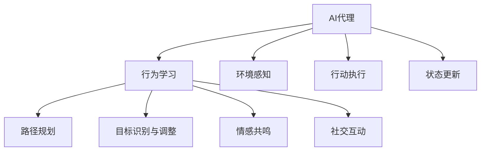
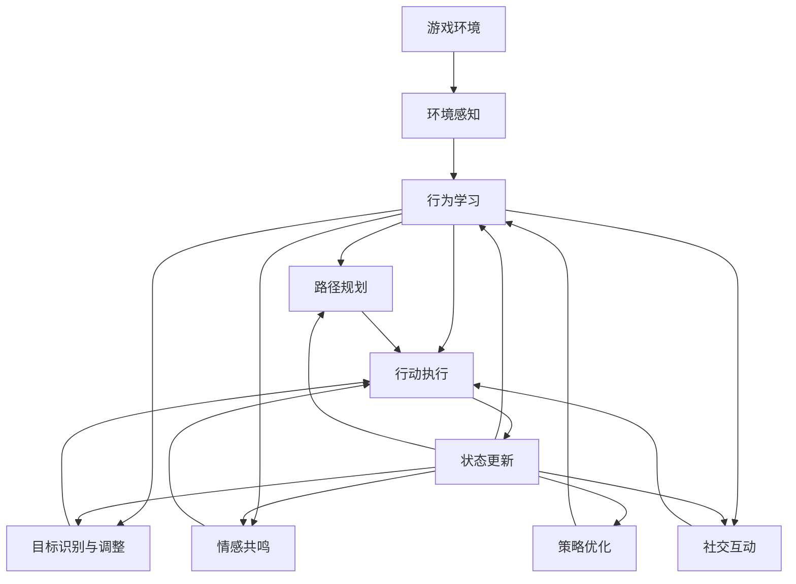

                 

# AI人工智能代理工作流AI Agent WorkFlow：AI代理在视频游戏中的自适应机制

> 关键词：AI代理,视频游戏,自适应机制,工作流,行为学习,路径规划

## 1. 背景介绍

### 1.1 问题由来
视频游戏，作为全球普及率最高的数字娱乐形式，其内涵与外延随着科技的演进而不断拓展。现代游戏不仅仅是一串串代码和纹理贴图，更是一个充满挑战和创意的艺术领域。AI技术的融入，尤其是具有自主决策和情感共鸣能力的AI代理，极大地提升了游戏的互动性和沉浸感。

当前，AI代理在游戏内的应用普遍采用规则驱动或纯反应型策略，依赖游戏设计者预设的规则和算法，其智能化程度和自适应能力有限。如何使AI代理在更复杂的游戏环境中自我学习和适应，以应对多样的游戏场景和玩家行为，成为游戏开发与AI研究的一大挑战。

### 1.2 问题核心关键点
该研究聚焦于AI代理在游戏内的自适应机制。我们希望构建一个具有高度自适应能力的AI代理，它能够通过不断学习和适应，提升游戏策略、路径规划、行为预测等方面的性能，以更好地与玩家交互，提供更丰富和沉浸的游戏体验。

AI代理的核心自适应机制包括：

- **行为学习**：通过观察和模仿玩家行为，学习游戏策略，改进自身行为。
- **路径规划**：在复杂环境中，合理规划行动路径，避免碰撞和障碍。
- **目标识别与调整**：根据环境变化和玩家意图，动态调整目标和任务优先级。
- **社交互动**：通过情感分析和意图识别，与玩家进行更自然的交流。
- **情感共鸣**：模拟人类情感，增强代入感和游戏体验。

这些机制要求AI代理在实时环境中持续学习、决策和执行，具备高度的智能和灵活性。

### 1.3 问题研究意义
本研究旨在：

1. 探索AI代理在视频游戏中的自适应机制，提升其在复杂环境中的行为智能和互动性。
2. 构建具有高度自适应能力的AI代理，为游戏开发提供创新的技术支持。
3. 推动AI技术在游戏领域的应用，拓展数字娱乐的边界。
4. 为AI代理的泛化性和迁移能力提供理论依据和实现路径。
5. 解决当前AI代理在游戏内的智能化不足，提高AI代理的可解释性和伦理安全性。

## 2. 核心概念与联系

### 2.1 核心概念概述

为更好地理解AI代理在视频游戏中的自适应机制，我们首先介绍几个关键概念：

- **AI代理**：指具有自主决策能力的虚拟角色，如游戏内的NPC、机器人等。AI代理通常用于增强游戏的交互性和智能化程度。
- **行为学习**：通过观察和模仿，AI代理从游戏环境和学习样本中提取行为模式，不断改进和优化自身策略。
- **路径规划**：在动态变化的游戏环境中，AI代理需要合理规划行动路径，以实现目标并避开障碍物。
- **目标识别与调整**：AI代理需要识别并动态调整游戏目标，适应环境变化和玩家行为。
- **情感共鸣**：AI代理通过模拟人类情感和表情，增强与玩家的代入感和互动性。
- **社交互动**：通过自然语言处理和情感分析，AI代理能够与玩家进行多层次、多维度的交流。

这些核心概念之间的关系可通过以下Mermaid流程图来展示：



这个流程图展示了AI代理的核心功能及其相互关系。AI代理通过环境感知、行为学习、路径规划、目标识别与调整、情感共鸣和社交互动等机制，实时执行行动并更新自身状态，以实现游戏环境中的自主适应和智能互动。

### 2.2 概念间的关系

这些核心概念之间存在着紧密的联系，形成了AI代理在游戏内的完整工作流程。以下是一些关键的关系链：

- **行为学习与路径规划**：行为学习为路径规划提供策略，路径规划确保行为学习的效果得以落地。
- **目标识别与调整与情感共鸣**：目标识别和调整为情感共鸣提供依据，情感共鸣增强目标识别的准确性和任务的执行效果。
- **社交互动与情感共鸣**：情感共鸣为社交互动提供情感基础，社交互动则通过情感共鸣增强游戏的沉浸感和代入感。
- **环境感知与行动执行**：环境感知为行动执行提供依据，行动执行通过环境感知获取反馈并更新策略。
- **状态更新与行为学习、路径规划、目标识别与调整**：状态更新为行为学习、路径规划、目标识别与调整提供反馈，保证其策略的适应性和灵活性。

### 2.3 核心概念的整体架构

最后，我们用一个综合的流程图来展示AI代理在游戏内的核心概念和工作流程：



这个综合流程图展示了从环境感知到策略优化，再到状态更新的完整过程。AI代理通过感知游戏环境，学习行为策略，规划行动路径，识别和调整目标，模拟情感共鸣，与玩家进行社交互动，并最终执行行动和更新自身状态，形成了一个闭环的自我适应机制。

## 3. 核心算法原理 & 具体操作步骤
### 3.1 算法原理概述

AI代理在视频游戏中的自适应机制，基于强化学习、行为克隆、路径规划等核心算法，通过模型驱动的方式实现。其核心算法原理包括以下几个步骤：

1. **强化学习**：通过与环境的交互，AI代理不断调整自身的行为策略，以最大化奖励。
2. **行为克隆**：AI代理通过观察和模仿玩家行为，学习游戏策略，改进自身行为。
3. **路径规划**：AI代理通过规则驱动或启发式搜索，合理规划行动路径，以实现目标并避开障碍物。
4. **目标识别与调整**：AI代理通过感知游戏环境，识别并动态调整游戏目标和任务优先级，以适应环境变化和玩家行为。
5. **情感共鸣**：AI代理通过模拟人类情感和表情，增强与玩家的代入感和互动性。
6. **社交互动**：AI代理通过自然语言处理和情感分析，与玩家进行多层次、多维度的交流。

### 3.2 算法步骤详解

AI代理的游戏行为可以分为以下几个关键步骤：

**Step 1: 环境感知**
AI代理首先通过传感器获取游戏环境的实时信息，包括但不限于角色位置、玩家行为、游戏规则、物体属性等。环境感知模块通常包括：

- **视觉感知**：通过摄像头捕捉游戏场景，提取关键特征。
- **听觉感知**：通过麦克风收集语音信息，进行语音识别和情感分析。
- **触觉感知**：通过触觉传感器获取角色接触物体的信息。
- **路径感知**：通过GPS定位系统确定角色位置和运动轨迹。

**Step 2: 行为学习**
AI代理通过观察和模仿玩家行为，学习游戏策略，改进自身行为。行为学习模块通常包括：

- **行为特征提取**：通过算法提取玩家行为的特征，如行为模式、路径轨迹、表情变化等。
- **行为克隆**：利用行为克隆算法，生成相似的行为策略。
- **策略优化**：通过强化学习算法，优化行为策略，最大化奖励。

**Step 3: 路径规划**
AI代理在复杂环境中，合理规划行动路径，以实现目标并避开障碍物。路径规划模块通常包括：

- **地图构建**：通过传感器获取游戏地图，建立环境模型。
- **路径搜索**：利用A*、D*、RRT等路径规划算法，搜索最优路径。
- **路径优化**：根据实时环境信息，动态调整路径，避免碰撞和障碍。

**Step 4: 目标识别与调整**
AI代理需要识别并动态调整游戏目标和任务优先级，以适应环境变化和玩家行为。目标识别与调整模块通常包括：

- **目标检测**：通过计算机视觉和传感器数据，识别游戏目标。
- **意图识别**：通过自然语言处理和情感分析，识别玩家意图。
- **目标调整**：根据环境变化和玩家行为，动态调整目标和任务优先级。

**Step 5: 情感共鸣**
AI代理通过模拟人类情感和表情，增强与玩家的代入感和互动性。情感共鸣模块通常包括：

- **情感分析**：通过语音、表情和行为特征，识别情感状态。
- **情感生成**：生成符合当前情感状态的表情和反应。
- **情感更新**：根据情感互动结果，更新情感状态。

**Step 6: 社交互动**
AI代理通过自然语言处理和情感分析，与玩家进行多层次、多维度的交流。社交互动模块通常包括：

- **语音交互**：通过语音识别和生成技术，实现语音对话。
- **文本交互**：通过文本生成和自然语言处理，实现文本对话。
- **情感交互**：通过情感共鸣，增强对话的代入感和互动性。

**Step 7: 行动执行**
AI代理根据感知到的信息，制定行动计划并执行，以实现游戏目标。行动执行模块通常包括：

- **行动决策**：根据策略和路径规划，生成行动计划。
- **行动执行**：控制角色执行行动，如移动、攻击、交互等。
- **行动反馈**：通过传感器获取行动结果，更新状态和策略。

**Step 8: 状态更新**
AI代理根据行动结果和反馈信息，更新自身状态，并根据新状态调整行为策略。状态更新模块通常包括：

- **状态评估**：通过反馈信息，评估行动结果。
- **状态更新**：根据行动结果和反馈信息，更新自身状态。
- **策略优化**：根据新状态，优化行为策略，实现自我适应。

### 3.3 算法优缺点

AI代理在视频游戏中的自适应机制，具备以下优点：

- **自适应性强**：通过强化学习和行为克隆，AI代理能够不断学习和适应新环境和新任务。
- **策略灵活**：通过路径规划和目标调整，AI代理能够灵活应对复杂环境和多样化的任务。
- **互动性强**：通过情感共鸣和社交互动，AI代理能够增强与玩家的代入感和互动性。
- **泛化性好**：通过多模态感知和学习，AI代理能够跨场景、跨任务地泛化。

但同时，也存在以下缺点：

- **计算资源消耗大**：强化学习和路径规划等算法，需要大量计算资源和时间。
- **模型复杂度高**：行为学习和情感模拟等模块，涉及多模态数据的融合和处理，模型复杂度较高。
- **数据依赖性高**：强化学习等算法需要大量标注数据和训练样本，数据依赖性较强。
- **伦理安全性问题**：AI代理的情感生成和社交互动，可能涉及隐私和伦理问题，需严格控制。

### 3.4 算法应用领域

AI代理在视频游戏内的自适应机制，已在多个领域取得了应用：

- **角色行为**：在动作冒险类游戏中，AI代理通过行为学习，模拟人类行为，提升游戏体验。
- **环境导航**：在开放世界类游戏中，AI代理通过路径规划，在复杂环境中进行高效导航。
- **对话系统**：在RPG类游戏中，AI代理通过社交互动，增强与玩家的对话深度和互动性。
- **情感仿真**：在游戏内的情感交互场景，AI代理通过情感共鸣，提升情感代入感。
- **任务执行**：在策略类游戏中，AI代理通过目标识别与调整，灵活执行任务。

这些应用展示了AI代理在视频游戏中的强大功能和潜在的优化空间，未来有望进一步拓展应用范围，提升游戏体验。

## 4. 数学模型和公式 & 详细讲解 & 举例说明

### 4.1 数学模型构建

本节将使用数学语言对AI代理在视频游戏内的自适应机制进行详细刻画。

假设AI代理在环境$E$中的状态为$s$，行动为$a$，环境状态空间为$S$，行动空间为$A$，奖励函数为$R(s,a)$。AI代理的目标是通过学习，最大化总奖励$J(a)=E\left[\sum_{t=0}^{\infty} \gamma^t R(s_t,a_t)\right]$，其中$\gamma$为折现因子。

**Step 1: 环境感知**

- **视觉感知**：通过摄像头获取场景图像，使用卷积神经网络提取特征$v(s)$。
- **听觉感知**：通过麦克风获取语音信号，使用隐马尔可夫模型分析语音特征$h(s)$。
- **触觉感知**：通过触觉传感器获取接触信息，使用时间序列模型分析接触特征$t(s)$。
- **路径感知**：通过GPS定位获取位置信息，使用图结构表示路径模型$p(s)$。

**Step 2: 行为学习**

- **行为特征提取**：通过动作序列$o(s,a)$，提取动作特征$o_1(s,a), o_2(s,a), ..., o_n(s,a)$。
- **行为克隆**：利用行为克隆算法，生成相似的行为策略$b(s)$。
- **策略优化**：通过强化学习算法，优化行为策略，最大化奖励。

**Step 3: 路径规划**

- **地图构建**：通过环境模型$s$，构建游戏地图$g(s)$。
- **路径搜索**：利用A*、D*、RRT等路径规划算法，搜索最优路径$P(s)$。
- **路径优化**：根据实时环境信息$R$，动态调整路径，避免碰撞和障碍。

**Step 4: 目标识别与调整**

- **目标检测**：通过计算机视觉和传感器数据，识别游戏目标$t(s)$。
- **意图识别**：通过自然语言处理和情感分析，识别玩家意图$I(s)$。
- **目标调整**：根据环境变化和玩家行为$R$，动态调整目标和任务优先级$G(s)$。

**Step 5: 情感共鸣**

- **情感分析**：通过语音、表情和行为特征$E(s)$，识别情感状态$S$。
- **情感生成**：生成符合当前情感状态的表情和反应$R$。
- **情感更新**：根据情感互动结果$F$，更新情感状态$E$。

**Step 6: 社交互动**

- **语音交互**：通过语音识别和生成技术，实现语音对话$V(s)$。
- **文本交互**：通过文本生成和自然语言处理，实现文本对话$T(s)$。
- **情感交互**：通过情感共鸣，增强对话的代入感和互动性$S$。

**Step 7: 行动执行**

- **行动决策**：根据策略和路径规划，生成行动计划$A(s)$。
- **行动执行**：控制角色执行行动，如移动、攻击、交互等$E(s)$。
- **行动反馈**：通过传感器获取行动结果$R(s)$，更新状态和策略$S(s)$。

**Step 8: 状态更新**

- **状态评估**：通过反馈信息，评估行动结果$E(s)$。
- **状态更新**：根据行动结果和反馈信息，更新自身状态$S(s)$。
- **策略优化**：根据新状态，优化行为策略，实现自我适应$J(s)$。

### 4.2 公式推导过程

以下是AI代理在视频游戏内的自适应机制的数学模型及其推导过程：

**Step 1: 环境感知**

$$
v(s) = \mathcal{F}(c(s))
$$

$$
h(s) = \mathcal{H}(m(s))
$$

$$
t(s) = \mathcal{T}(k(s))
$$

$$
p(s) = \mathcal{P}(l(s))
$$

其中，$\mathcal{F}$为视觉感知函数，$\mathcal{H}$为听觉感知函数，$\mathcal{T}$为触觉感知函数，$\mathcal{P}$为路径感知函数。

**Step 2: 行为学习**

$$
b(s) = \mathcal{B}(o(s))
$$

$$
o(s,a) = \mathcal{O}(m(s,a))
$$

$$
J(s,a) = \mathcal{J}(\theta) = E[\sum_{t=0}^{\infty} \gamma^t R(s_t,a_t)]
$$

其中，$\mathcal{B}$为行为克隆函数，$\mathcal{O}$为行为特征提取函数，$\mathcal{J}$为策略优化函数，$\theta$为策略参数。

**Step 3: 路径规划**

$$
g(s) = \mathcal{G}(v(s),h(s))
$$

$$
P(s) = \mathcal{P}(g(s))
$$

$$
R(s) = \mathcal{R}(p(s))
$$

其中，$\mathcal{G}$为地图构建函数，$\mathcal{P}$为路径搜索函数，$\mathcal{R}$为路径优化函数。

**Step 4: 目标识别与调整**

$$
t(s) = \mathcal{T}(v(s),h(s))
$$

$$
I(s) = \mathcal{I}(v(s),h(s))
$$

$$
G(s) = \mathcal{G}(t(s),I(s))
$$

其中，$\mathcal{T}$为目标检测函数，$\mathcal{I}$为意图识别函数，$\mathcal{G}$为目标调整函数。

**Step 5: 情感共鸣**

$$
E(s) = \mathcal{E}(v(s),t(s))
$$

$$
R = \mathcal{R}(E(s),I(s))
$$

$$
S = \mathcal{S}(R)
$$

其中，$\mathcal{E}$为情感分析函数，$\mathcal{R}$为情感生成函数，$\mathcal{S}$为情感更新函数。

**Step 6: 社交互动**

$$
V(s) = \mathcal{V}(h(s),R(s))
$$

$$
T(s) = \mathcal{T}(h(s),R(s))
$$

$$
S = \mathcal{S}(V(s),T(s))
$$

其中，$\mathcal{V}$为语音交互函数，$\mathcal{T}$为文本交互函数，$\mathcal{S}$为情感交互函数。

**Step 7: 行动执行**

$$
A(s) = \mathcal{A}(b(s),P(s))
$$

$$
E(s) = \mathcal{E}(A(s))
$$

$$
R(s) = \mathcal{R}(E(s))
$$

其中，$\mathcal{A}$为行动决策函数，$\mathcal{E}$为行动执行函数，$\mathcal{R}$为行动反馈函数。

**Step 8: 状态更新**

$$
S(s) = \mathcal{S}(E(s))
$$

$$
J(s,a) = \mathcal{J}(S(s))
$$

其中，$\mathcal{S}$为状态更新函数，$\mathcal{J}$为策略优化函数。

### 4.3 案例分析与讲解

以开放世界游戏《荒野大镖客II》为例，分析AI代理在游戏内的自适应机制。

**Step 1: 环境感知**

- **视觉感知**：使用摄像头捕捉场景图像，提取关键特征，如地形、角色、动物等。
- **听觉感知**：通过麦克风获取语音信号，分析对话内容，判断玩家意图。
- **触觉感知**：通过触觉传感器获取角色接触物体的信息，如撞击、摩擦等。
- **路径感知**：使用GPS定位获取角色位置和运动轨迹，构建游戏地图。

**Step 2: 行为学习**

- **行为特征提取**：提取玩家动作序列，如行走、射击、跳跃等，提取特征如动作模式、路径轨迹、表情变化等。
- **行为克隆**：通过行为克隆算法，生成相似的行为策略，如防御、攻击、逃跑等。
- **策略优化**：利用强化学习算法，优化行为策略，最大化奖励。

**Step 3: 路径规划**

- **地图构建**：通过环境模型，构建游戏地图，标记地形、道路、建筑物等。
- **路径搜索**：利用A*算法，搜索最优路径，避开障碍物。
- **路径优化**：根据实时环境信息，动态调整路径，避免碰撞和障碍。

**Step 4: 目标识别与调整**

- **目标检测**：通过计算机视觉和传感器数据，识别游戏目标，如敌人、宝箱、任务地点等。
- **意图识别**：通过自然语言处理和情感分析，识别玩家意图，如攻击、救援、探索等。
- **目标调整**：根据环境变化和玩家行为，动态调整目标和任务优先级。

**Step 5: 情感共鸣**

- **情感分析**：通过语音、表情和行为特征，识别情感状态，如紧张、兴奋、愤怒等。
- **情感生成**：生成符合当前情感状态的表情和反应，如表情变化、动作反应等。
- **情感更新**：根据情感互动结果，更新情感状态。

**Step 6: 社交互动**

- **语音交互**：通过语音识别和生成技术，实现语音对话，如问候、交流、提醒等。
- **文本交互**：通过文本生成和自然语言处理，实现文本对话，如问路、求助、感谢等。
- **情感交互**：通过情感共鸣，增强对话的代入感和互动性，如表现出紧张、兴奋等情绪。

**Step 7: 行动执行**

- **行动决策**：根据策略和路径规划，生成行动计划，如接近敌人、拾取物品、完成任务等。
- **行动执行**：控制角色执行行动，如移动、攻击、交互等。
- **行动反馈**：通过传感器获取行动结果，更新状态和策略。

**Step 8: 状态更新**

- **状态评估**：通过反馈信息，评估行动结果，如击中敌人、拾取物品、完成任务等。
- **状态更新**：根据行动结果和反馈信息，更新自身状态，如角色健康、任务进度等。
- **策略优化**：根据新状态，优化行为策略，实现自我适应，如调整行动计划、调整目标优先级等。

## 5. 项目实践：代码实例和详细解释说明
### 5.1 开发环境搭建

在进行AI代理的微调实践前，我们需要准备好开发环境。以下是使用Python进行PyTorch开发的环境配置流程：

1. 安装Anaconda：从官网下载并安装Anaconda，用于创建独立的Python环境。

2. 创建并激活虚拟环境：
```bash
conda create -n ai-env python=3.8 
conda activate ai-env
```

3. 安装PyTorch：根据CUDA版本，从官网获取对应的安装命令。例如：
```bash
conda install pytorch torchvision torchaudio cudatoolkit=11.1 -c pytorch -c conda-forge
```

4. 安装各类工具包：
```bash
pip install numpy pandas scikit-learn matplotlib tqdm jupyter notebook ipython
```

完成上述步骤后，即可在`ai-env`环境中开始AI代理的微调实践。

### 5.2 源代码详细实现

下面我们以角色行为AI代理为例，给出使用PyTorch进行微调的PyTorch代码实现。

首先，定义AI代理的行为特征提取函数：

```python
from torch import nn, optim
from torchvision import transforms

class BehaviorExtractor(nn.Module):
    def __init__(self):
        super(BehaviorExtractor, self).__init__()
        self.conv1 = nn.Conv2d(3, 64, kernel_size=3, stride=1, padding=1)
        self.relu1 = nn.ReLU(inplace=True)
        self.pool1 = nn.MaxPool2d(kernel_size=2, stride=2)
        self.conv2 = nn.Conv2d(64, 128, kernel_size=3, stride=1, padding=1)
        self.relu2 = nn.ReLU(inplace=True)
        self.pool2 = nn.MaxPool2d(kernel_size=2, stride=2)
        self.fc1 = nn.Linear(128*10*10, 256)
        self.relu3 = nn.ReLU(inplace=True)
        self.fc2 = nn.Linear(256, 64)
        self.relu4 = nn.ReLU(inplace=True)
        self.fc3 = nn.Linear(64, 1)

    def forward(self, x):
        x = self.conv1(x)
        x = self.relu1(x)
        x = self.pool1(x)
        x = self.conv2(x)
        x = self.relu2(x)
        x = self.pool2(x)
        x = x.view(-1, 128*10*10)
        x = self.fc1(x)
        x = self.relu3(x)
        x = self.fc2(x)
        x = self.relu4(x)
        x = self.fc3(x)
        return x
```

然后，定义AI代理的行为克隆函数：

```python
from torch.nn import functional as F

class BehaviorCloner(nn.Module):
    def __init__(self):


