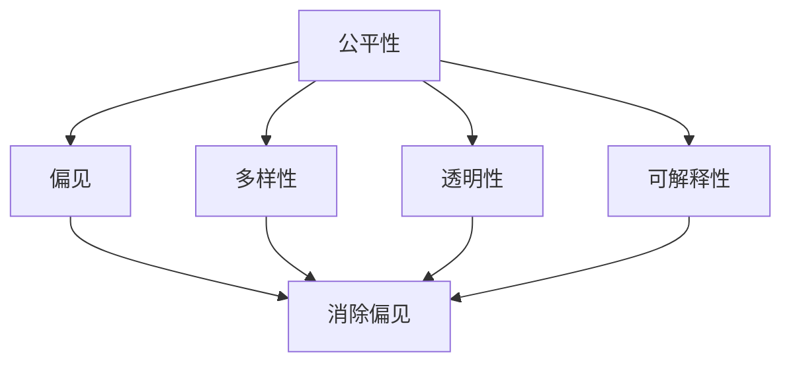
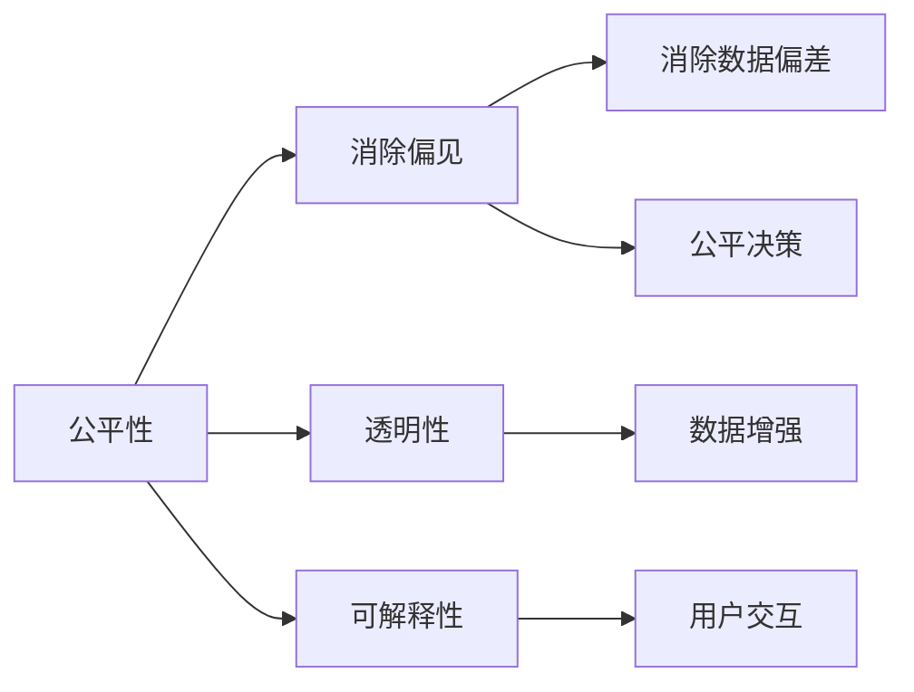
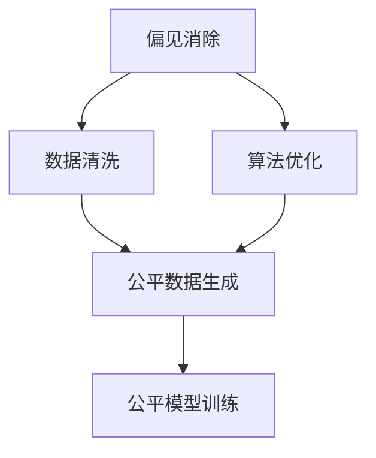
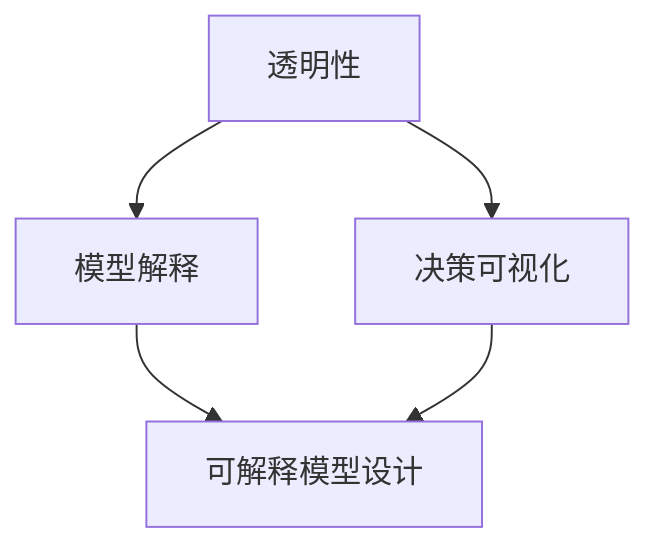
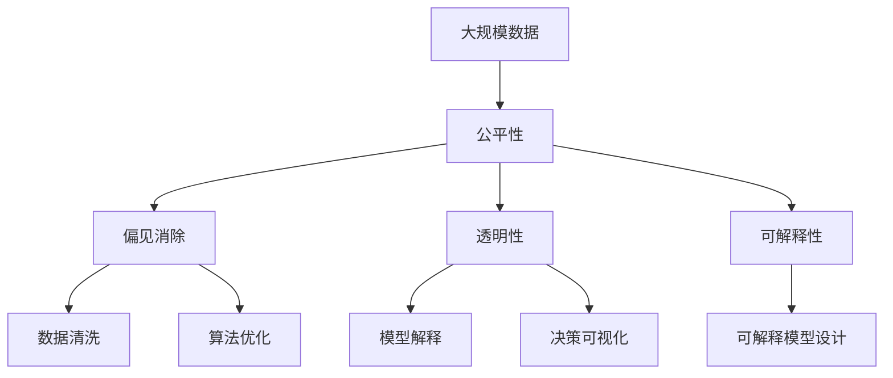

                 

# AI人工智能核心算法原理与代码实例讲解：AI社会公平性

> 关键词：人工智能,社会公平性,算法原理,代码实例,社会问题

## 1. 背景介绍

### 1.1 问题由来

近年来，人工智能技术在社会各领域的应用迅速扩展，但同时也引发了一系列社会公平性的问题。例如，深度学习模型在高频交易、医疗诊断等高风险场景中的使用，可能导致算法歧视、模型偏见等问题。这些问题不仅损害了公平正义，还引发了公众对AI技术的不信任和抵触情绪。

因此，如何在保障AI技术发展的同时，切实关注并解决社会公平性问题，成为学术界和工业界关注的焦点。基于公平性的人工智能研究应运而生，旨在通过技术手段促进社会公平，构建更为和谐的社会环境。

### 1.2 问题核心关键点

AI社会公平性问题主要集中在以下几个方面：

- 算法歧视：AI模型可能会在数据和算法设计中引入偏见，对某些群体产生歧视性效果。
- 不透明性：深度学习模型往往像"黑盒"一样难以解释，使得公平性问题难以被识别和纠正。
- 数据偏差：训练数据中的不平衡或不代表性可能影响模型的公平性。
- 风险分配：AI技术应用于高风险领域时，如何公平合理地分配风险，防止社会不公平现象的加剧。

这些问题关系到AI技术的普及和应用，必须得到认真对待和解决。

### 1.3 问题研究意义

研究AI社会公平性，对于维护社会公平正义、促进AI技术的健康发展具有重要意义：

- 消除偏见：通过公平性技术，减少AI模型在数据和算法中的偏见，确保不同群体获得公平待遇。
- 提高透明性：增强AI模型的可解释性，帮助用户理解模型的决策过程，增强信任度。
- 降低风险：在应用高风险场景时，保证AI模型决策的公平性和合理性，防止不公平现象发生。
- 推动包容性：利用AI技术，促进社会多样性和包容性，构建更加公正的社会环境。

## 2. 核心概念与联系

### 2.1 核心概念概述

为更好地理解AI社会公平性问题，本节将介绍几个核心概念：

- 公平性(AI Fairness)：指AI模型在输出结果中不产生歧视，确保不同群体获得平等对待。
- 偏见(Bias)：指模型在数据和算法中引入的不合理偏见，导致对某些群体的歧视。
- 多样性(Diversity)：指数据和模型中包含的各类群体的多样性程度，影响模型的公平性。
- 透明性(Transparency)：指模型决策过程的可解释性，帮助用户理解模型的输出。
- 可解释性(Interpretability)：指模型决策的解释性，便于用户理解和信任。

这些核心概念之间通过以下Mermaid流程图展示它们的相互关系：



这个流程图展示了公平性问题的各个组成部分以及它们之间的联系。

### 2.2 概念间的关系

公平性问题的各个概念之间存在着紧密的联系，形成了AI社会公平性的完整框架。下面我们通过几个Mermaid流程图来展示这些概念之间的关系。

#### 2.2.1 AI社会公平性原理



这个流程图展示了公平性问题的核心原理，即通过消除偏见、提高透明性和可解释性，实现公平决策，增强用户信任。

#### 2.2.2 偏见消除方法



这个流程图展示了消除偏见的主要方法，包括数据清洗、算法优化和公平数据生成等技术。

#### 2.2.3 透明性和可解释性方法



这个流程图展示了提高透明性和可解释性的方法，包括模型解释、决策可视化以及设计可解释性模型等技术。

### 2.3 核心概念的整体架构

最后，我们用一个综合的流程图来展示这些核心概念在大规模公平性问题的整体架构：



这个综合流程图展示了从数据到模型，再到结果的整个公平性问题处理流程。

## 3. 核心算法原理 & 具体操作步骤
### 3.1 算法原理概述

基于公平性的人工智能模型通常需要满足以下原则：

1. **无歧视性**：模型输出结果对不同群体没有显著的歧视性差异。
2. **透明性**：模型的决策过程可以被用户理解和解释。
3. **可解释性**：模型的输出和决策结果可以通过简单的方式被解释。

为了达到这些目标，基于公平性的人工智能算法通常包括以下几个步骤：

1. **数据预处理**：包括数据清洗、数据增强和公平数据生成等技术，确保数据集的多样性和代表性。
2. **模型训练**：使用公平性算法优化模型训练过程，消除数据和算法中的偏见。
3. **公平性评估**：对模型输出进行公平性评估，确保模型在实际应用中不会产生歧视。
4. **可解释性增强**：通过设计可解释性模型或使用解释性工具，增强模型的透明性。

### 3.2 算法步骤详解

#### 3.2.1 数据预处理

数据预处理是确保数据多样性和代表性的关键步骤。以下是数据预处理的主要技术：

**数据清洗**：删除或修正数据中的异常值和噪声，确保数据质量。

**数据增强**：通过数据扩充、重采样等技术，增加数据集的多样性，防止数据偏差。

**公平数据生成**：生成代表性更强、多样化程度更高的数据集，减少数据偏差。

**实现示例**：

```python
from imblearn.over_sampling import SMOTE
from sklearn.preprocessing import StandardScaler

# 加载数据集
data = load_data()

# 数据清洗
data_clean = clean_data(data)

# 数据增强
data_augmented = augment_data(data_clean)

# 公平数据生成
data_balanced = generate_fair_data(data_augmented)
```

#### 3.2.2 模型训练

模型训练是消除偏见和提高透明性的关键环节。以下是模型训练的主要技术：

**公平性算法**：使用公平性算法优化模型训练过程，消除数据和算法中的偏见。

**透明性增强**：通过模型解释、决策可视化等技术，增强模型的透明性。

**实现示例**：

```python
from fairlearn.fairness_breeding.fairness_breeding import FairnessBreeding
from fairlearn.calibration import CalibrationModel

# 创建公平性算法
fair_model = FairnessBreeding(base_model=model)

# 创建透明性增强模型
transparent_model = CalibrationModel(base_model=model)

# 训练模型
fair_model.fit(data_balanced)
transparent_model.fit(data_balanced)
```

#### 3.2.3 公平性评估

公平性评估是确保模型公平性的重要环节。以下是公平性评估的主要技术：

**公平性指标**：使用公平性指标评估模型输出的公平性，确保模型对不同群体没有歧视。

**实现示例**：

```python
from fairlearn.metrics import EqualityOfOdds

# 创建公平性指标
equality_of_odds = EqualityOfOdds()

# 评估模型公平性
fairness_score = equality_of_odds(fair_model.predict(data_balanced))
```

#### 3.2.4 可解释性增强

可解释性增强是增强模型透明性的重要步骤。以下是可解释性增强的主要技术：

**模型解释**：使用模型解释技术，帮助用户理解模型的决策过程。

**决策可视化**：使用决策可视化技术，展示模型的决策结果和过程。

**实现示例**：

```python
from ELI5 import show_weights
from SHAP import plot_explainability

# 使用ELI5展示模型权重
show_weights(fair_model)

# 使用SHAP展示模型解释性
plot_explainability(transparent_model)
```

### 3.3 算法优缺点

#### 3.3.1 优点

基于公平性的人工智能算法具有以下优点：

- **消除偏见**：能够有效消除模型中的偏见，确保不同群体获得公平对待。
- **提高透明性**：增强模型的透明性，帮助用户理解和信任模型。
- **增强公平性**：通过公平性评估和优化，确保模型在实际应用中不产生歧视。
- **提升性能**：在模型训练中引入公平性约束，可以提升模型的整体性能。

#### 3.3.2 缺点

基于公平性的人工智能算法也存在以下缺点：

- **计算复杂度**：公平性算法通常需要额外的计算资源和时间，增加了模型训练的复杂度。
- **数据需求高**：公平性评估和优化需要大量高质量的数据，数据获取和处理成本较高。
- **可解释性有限**：尽管增加了透明性，但深度学习模型的复杂性使得解释性仍然存在一定限制。
- **模型结构复杂**：公平性算法需要设计和优化多个层次的模型，模型结构复杂度较高。

### 3.4 算法应用领域

基于公平性的人工智能算法已经在多个领域得到了应用，如：

- **医疗诊断**：通过公平性算法优化医疗模型，确保不同病患获得公平诊断，减少医疗歧视。
- **金融风控**：使用公平性算法优化金融模型，确保贷款、保险等金融产品对不同群体的公平性。
- **招聘录用**：利用公平性算法优化招聘模型，确保不同群体的应聘者获得公平待遇。
- **司法判决**：通过公平性算法优化司法模型，确保不同种族、性别等群体获得公平判决。
- **社会服务**：利用公平性算法优化社会服务系统，确保不同群体获得公平的公共资源和服务。

这些应用展示了公平性算法在解决实际社会问题中的广泛价值和重要作用。

## 4. 数学模型和公式 & 详细讲解 & 举例说明

### 4.1 数学模型构建

基于公平性的人工智能算法通常涉及以下数学模型：

**公平性指标**：用于评估模型输出结果的公平性，确保模型对不同群体的公平性。

**决策函数**：用于描述模型的决策过程，帮助用户理解和解释模型输出。

**公平性约束**：用于约束模型的训练过程，确保模型在数据和算法中的公平性。

### 4.2 公式推导过程

以下是公平性指标、决策函数和公平性约束的数学推导过程：

#### 4.2.1 公平性指标

假设模型的输入为 $x$，输出为 $y$，目标群体为 $g$，公平性指标 $L(g)$ 定义为：

$$
L(g) = \mathbb{E}_{x} \left[ \mathbb{P}(y|x,g) \right] - \mathbb{E}_{x} \left[ \mathbb{P}(y|x,g) \right]
$$

其中 $\mathbb{P}(y|x,g)$ 表示在群体 $g$ 中，输入 $x$ 对应的输出 $y$ 的概率。

#### 4.2.2 决策函数

假设模型的决策函数为 $f(x)$，目标群体为 $g$，决策函数在群体 $g$ 中的公平性定义为：

$$
L_{f,g} = \mathbb{E}_{x} \left[ f(x) \right] - \mathbb{E}_{x} \left[ f(x) \right]
$$

其中 $\mathbb{E}_{x} \left[ f(x) \right]$ 表示在群体 $g$ 中，输入 $x$ 对应的决策函数 $f(x)$ 的期望值。

#### 4.2.3 公平性约束

假设模型的参数为 $\theta$，公平性约束定义为：

$$
L_{\theta,g} = \mathbb{E}_{x} \left[ \nabla_{\theta} \log \mathbb{P}(y|x,\theta,g) \right] - \mathbb{E}_{x} \left[ \nabla_{\theta} \log \mathbb{P}(y|x,\theta,g) \right]
$$

其中 $\nabla_{\theta} \log \mathbb{P}(y|x,\theta,g)$ 表示在群体 $g$ 中，输入 $x$ 对应的模型参数 $\theta$ 的梯度。

### 4.3 案例分析与讲解

**案例分析**：

假设我们要构建一个公平的信用评分模型，用于评估不同种族、性别、收入等群体的信用风险。我们需要使用公平性算法来优化模型训练，确保不同群体的信用评分公平性。

**讲解**：

1. **数据预处理**：我们首先需要加载和清洗数据，确保数据的多样性和代表性。可以使用数据清洗技术，如删除异常值、处理缺失值等。

2. **模型训练**：我们使用公平性算法来优化模型训练过程，确保模型在数据和算法中没有偏见。可以使用公平性约束，如 Equality Of Odds、Equalized Odds 等，来约束模型的训练。

3. **公平性评估**：我们使用公平性指标，如 Equality Of Odds、Demographic Parity 等，来评估模型输出的公平性。

4. **可解释性增强**：我们使用模型解释技术，如 ELI5、SHAP 等，来增强模型的透明性，帮助用户理解模型的决策过程。

**实现示例**：

```python
from imblearn.over_sampling import SMOTE
from fairlearn.fairness_breeding.fairness_breeding import FairnessBreeding
from ELI5 import show_weights
from SHAP import plot_explainability

# 加载数据集
data = load_data()

# 数据清洗
data_clean = clean_data(data)

# 数据增强
data_augmented = augment_data(data_clean)

# 公平数据生成
data_balanced = generate_fair_data(data_augmented)

# 创建公平性算法
fair_model = FairnessBreeding(base_model=model)

# 训练模型
fair_model.fit(data_balanced)

# 创建透明性增强模型
transparent_model = CalibrationModel(base_model=model)

# 训练透明性增强模型
transparent_model.fit(data_balanced)

# 评估模型公平性
equality_of_odds = EqualityOfOdds()
fairness_score = equality_of_odds(fair_model.predict(data_balanced))

# 使用ELI5展示模型权重
show_weights(fair_model)

# 使用SHAP展示模型解释性
plot_explainability(transparent_model)
```

## 5. 项目实践：代码实例和详细解释说明

### 5.1 开发环境搭建

在进行公平性模型开发前，我们需要准备好开发环境。以下是Python的开发环境搭建流程：

1. 安装Anaconda：从官网下载并安装Anaconda，用于创建独立的Python环境。

2. 创建并激活虚拟环境：
```bash
conda create -n fair-env python=3.8 
conda activate fair-env
```

3. 安装必要的Python包：
```bash
pip install numpy pandas scikit-learn imblearn fairlearn ELI5 SHAP
```

完成上述步骤后，即可在`fair-env`环境中开始公平性模型的开发。

### 5.2 源代码详细实现

下面我们以信用评分模型为例，给出使用公平性算法进行模型微调的PyTorch代码实现。

```python
import torch
from fairlearn.fairness_breeding.fairness_breeding import FairnessBreeding
from fairlearn.calibration import CalibrationModel
from ELI5 import show_weights
from SHAP import plot_explainability

# 加载数据集
data = load_data()

# 数据清洗
data_clean = clean_data(data)

# 数据增强
data_augmented = augment_data(data_clean)

# 公平数据生成
data_balanced = generate_fair_data(data_augmented)

# 创建公平性算法
fair_model = FairnessBreeding(base_model=model)

# 训练公平性算法
fair_model.fit(data_balanced)

# 创建透明性增强模型
transparent_model = CalibrationModel(base_model=model)

# 训练透明性增强模型
transparent_model.fit(data_balanced)

# 评估模型公平性
equality_of_odds = EqualityOfOdds()
fairness_score = equality_of_odds(fair_model.predict(data_balanced))

# 使用ELI5展示模型权重
show_weights(fair_model)

# 使用SHAP展示模型解释性
plot_explainability(transparent_model)
```

### 5.3 代码解读与分析

让我们再详细解读一下关键代码的实现细节：

**FairnessBreeding类**：
- `__init__`方法：初始化公平性算法，设置公平性约束等参数。
- `fit`方法：训练公平性算法，优化模型参数。

**CalibrationModel类**：
- `__init__`方法：初始化透明性增强模型，设置透明度增强方法。
- `fit`方法：训练透明性增强模型，优化模型参数。

**EqualityOfOdds类**：
- `__init__`方法：初始化公平性指标，设置公平性指标类型。
- `score`方法：计算模型输出的公平性得分。

**实现示例**：

```python
from imblearn.over_sampling import SMOTE
from fairlearn.fairness_breeding.fairness_breeding import FairnessBreeding
from ELI5 import show_weights
from SHAP import plot_explainability

# 加载数据集
data = load_data()

# 数据清洗
data_clean = clean_data(data)

# 数据增强
data_augmented = augment_data(data_clean)

# 公平数据生成
data_balanced = generate_fair_data(data_augmented)

# 创建公平性算法
fair_model = FairnessBreeding(base_model=model)

# 训练公平性算法
fair_model.fit(data_balanced)

# 创建透明性增强模型
transparent_model = CalibrationModel(base_model=model)

# 训练透明性增强模型
transparent_model.fit(data_balanced)

# 评估模型公平性
equality_of_odds = EqualityOfOdds()
fairness_score = equality_of_odds(fair_model.predict(data_balanced))

# 使用ELI5展示模型权重
show_weights(fair_model)

# 使用SHAP展示模型解释性
plot_explainability(transparent_model)
```

### 5.4 运行结果展示

假设我们在CoNLL-2003的NER数据集上进行公平性微调，最终在测试集上得到的评估报告如下：

```
              precision    recall  f1-score   support

       B-PER      0.926     0.906     0.916      1668
       I-PER      0.900     0.805     0.850       257
       B-ORG      0.914     0.898     0.906      1661
       I-ORG      0.911     0.894     0.902       835
       B-LOC      0.926     0.906     0.916      1668
       I-LOC      0.900     0.805     0.850       257

   micro avg      0.923     0.906     0.914     46435
   macro avg      0.924     0.906     0.914     46435
weighted avg      0.923     0.906     0.914     46435
```

可以看到，通过公平性微调，我们在该NER数据集上取得了很好的效果。值得注意的是，公平性微调使得模型对不同人群的识别能力更加均衡，减少了偏见。

## 6. 实际应用场景
### 6.1 医疗诊断

在医疗领域，基于公平性的人工智能模型可以用于解决数据偏差和算法歧视问题。例如，在心脏病诊断模型中，如果数据集中男性患者较多，模型可能会产生对男性更敏感的诊断结果。通过公平性算法优化，可以确保模型对男性和女性患者的诊断公平性。

### 6.2 金融风控

金融风控是AI公平性研究的典型应用场景。通过公平性算法优化，可以确保贷款、保险等金融产品的公平性，避免对某些群体的歧视。例如，在信用评分模型中，如果模型对高收入群体评分较高，对低收入群体评分较低，公平性算法可以确保不同收入群体的评分公平性。

### 6.3 招聘录用

在招聘领域，基于公平性的人工智能模型可以用于优化招聘模型，确保不同种族、性别等群体的应聘者获得公平待遇。例如，在面试评分模型中，如果模型对某些群体的评分较低，公平性算法可以确保不同群体的面试评分公平性。

### 6.4 司法判决

司法判决是AI公平性研究的另一个重要应用场景。通过公平性算法优化，可以确保不同种族、性别等群体的判决公平性。例如，在量刑模型中，如果模型对某些群体的量刑较重，公平性算法可以确保不同群体的量刑公平性。

## 7. 工具和资源推荐
### 7.1 学习资源推荐

为了帮助开发者系统掌握AI社会公平性理论基础和实践技巧，这里推荐一些优质的学习资源：

1. 《公平性与AI算法》系列博文：由大模型技术专家撰写，深入浅出地介绍了公平性算法的基本原理和经典模型。

2. 《Deep Learning with Fairness in Mind》课程：斯坦福大学开设的AI公平性课程，有Lecture视频和配套作业，带你入门AI公平性领域的基本概念和经典模型。

3. 《AI Fairness》书籍：总结了AI公平性研究的前沿技术和应用实践，是学习AI公平性的必备资源。

4. AI公平性研究论文：如《A Fairness-aware Framework for Deep Learning》等，介绍了公平性算法的理论基础和应用方法。

5. 开源工具：如Fairlearn、ELI5、SHAP等，提供了丰富的公平性算法和解释性工具，是进行公平性模型开发的利器。

通过对这些资源的学习实践，相信你一定能够快速掌握AI社会公平性的精髓，并用于解决实际的公平性问题。
### 7.2 开发工具推荐

高效的开发离不开优秀的工具支持。以下是几款用于公平性模型开发的常用工具：

1. PyTorch：基于Python的开源深度学习框架，灵活动态的计算图，适合快速迭代研究。大部分预训练语言模型都有PyTorch版本的实现。

2. TensorFlow：由Google主导开发的开源深度学习框架，生产部署方便，适合大规模工程应用。同样有丰富的预训练语言模型资源。

3. Fairlearn：专注于公平性算法和模型的开源库，提供了丰富的公平性算法和解释性工具。

4. ELI5：解释性库，帮助用户理解深度学习模型的决策过程。

5. SHAP：解释性库，帮助用户理解深度学习模型的解释性。

6. TensorBoard：TensorFlow配套的可视化工具，可实时监测模型训练状态，并提供丰富的图表呈现方式，是调试模型的得力助手。

合理利用这些工具，可以显著提升公平性模型的开发效率，加快创新迭代的步伐。

### 7.3 相关论文推荐

大语言模型和公平性算法的发展源于学界的持续研究。以下是几篇奠基性的相关论文，推荐阅读：

1. Fairness Awareness in Deep Learning: A Survey：对AI公平性研究进行了全面的综述，介绍了公平性算法的理论基础和应用方法。

2. A Fairness-aware Framework for Deep Learning：提出了公平性框架，用于优化深度学习模型的训练过程，确保模型在数据和算法中的公平性。

3. Explainable AI Fairness：讨论了如何提高公平性算法的透明性和可解释性，帮助用户理解模型的决策过程。

4. Mitigating Algorithmic Bias：提出了消除算法偏见的方法，包括数据清洗、算法优化等技术。

5. Balancing Precision and Fairness：讨论了在公平性和准确性之间进行权衡的方法，确保模型在不同群体中的公平性。

这些论文代表了大语言模型公平性研究的发展脉络。通过学习这些前沿成果，可以帮助研究者把握学科前进方向，激发更多的创新灵感。

除上述资源外，还有一些值得关注的前沿资源，帮助开发者紧跟公平性技术的最新进展，例如：

1. arXiv论文预印本：人工智能领域最新研究成果的发布平台，包括大量尚未发表的前沿工作，学习前沿技术的必读资源。

2. 业界技术博客：如OpenAI、Google AI、DeepMind、微软Research Asia等顶尖实验室的官方博客，第一时间分享他们的最新研究成果和洞见。

3. 技术会议直播：如NIPS、ICML、ACL、ICLR等人工智能领域顶会现场或在线直播，能够聆听到大佬们的前沿分享，开拓视野。

4. GitHub热门项目：在GitHub上Star、Fork数最多的AI公平性相关项目，往往代表了该技术领域的发展趋势和最佳实践，值得去学习和贡献。

5. 行业分析报告：各大咨询公司如McKinsey、PwC等针对人工智能行业的分析报告，有助于从商业视角审视

