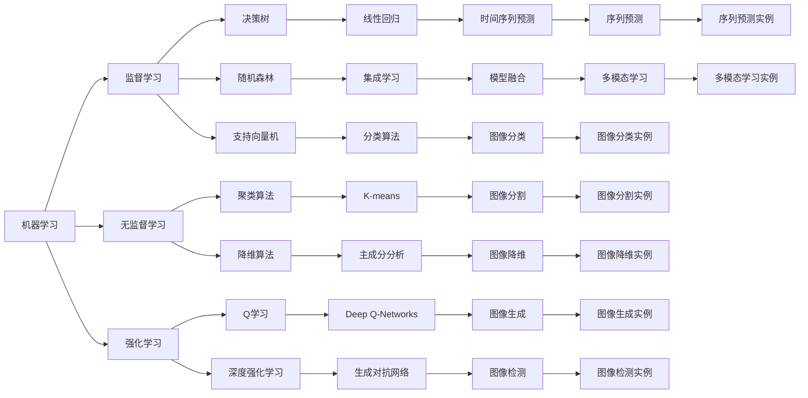

                 

# AI人工智能核心算法原理与代码实例讲解：机器思维

> 关键词：AI算法, 机器学习, 深度学习, 自然语言处理(NLP), 计算机视觉(CV), 强化学习, 优化算法

## 1. 背景介绍

### 1.1 问题由来
随着人工智能技术的迅猛发展，机器思维成为了当前研究的热点。机器思维是指利用计算机模拟和实现人类思维过程的能力，其核心在于构建能够理解、推理、决策的智能模型。本文将深入探讨机器思维的核心理论与实践，详细介绍机器学习、深度学习等核心算法，并通过代码实例进行详细讲解。

### 1.2 问题核心关键点
机器思维的核心在于通过算法构建能够自主学习和推理的模型。主要关注点包括：
- 机器学习算法的设计和实现
- 深度学习模型的构建与应用
- 自然语言处理和计算机视觉等任务中的算法应用
- 强化学习在智能决策中的应用
- 优化算法的优化与加速

### 1.3 问题研究意义
研究机器思维的算法原理与代码实现，对于推动人工智能技术的进步、解决实际问题具有重要意义：
- 加速科学研究：通过自动化算法，实现对大规模数据的高效处理和分析。
- 提升生产力：在工业自动化、智能制造等领域，机器思维可以提升生产效率和质量。
- 改善医疗健康：通过智能诊断、个性化治疗，提高医疗服务水平。
- 丰富教育体验：基于个性化推荐和自适应学习，提升教学效果和用户体验。
- 优化社会治理：在交通管理、公共安全等领域，实现更高效、智能的决策支持。

## 2. 核心概念与联系

### 2.1 核心概念概述

要理解机器思维的核心算法，首先需要了解几个关键概念：

- **机器学习(Machine Learning, ML)**：指利用数据训练模型，使其能够自动学习并做出预测或决策的过程。
- **深度学习(Deep Learning, DL)**：基于神经网络构建的机器学习范式，能够处理大规模非线性数据。
- **自然语言处理(Natural Language Processing, NLP)**：使计算机能够理解、处理和生成自然语言的技术。
- **计算机视觉(Computer Vision, CV)**：使计算机能够从图像和视频中提取和理解信息的技术。
- **强化学习(Reinforcement Learning, RL)**：通过试错学习，使智能体在环境中做出最优决策的过程。
- **优化算法(Optimization Algorithms)**：用于最小化或最大化目标函数的技术，常用于机器学习模型的训练和推理。

这些概念相互关联，共同构成了机器思维的核心框架。

### 2.2 概念间的关系

下面通过几个Mermaid流程图展示这些核心概念之间的联系：



这些概念之间的关系可以用图表直观地展示出来，帮助我们更好地理解机器思维的架构。

### 2.3 核心概念的整体架构

最后，用以下综合流程图展示核心概念在大规模机器思维项目中的整体架构：

```mermaid
graph LR
    A[数据采集] --> B[数据预处理]
    B --> C[特征提取]
    C --> D[模型训练]
    D --> E[模型评估]
    E --> F[模型部署]
    F --> G[模型维护]
    G --> H[数据增强]
    A --> I[标注数据]
    B --> J[数据清洗]
    C --> K[特征选择]
    D --> L[模型选择]
    E --> M[性能监控]
    F --> N[系统集成]
    G --> O[模型更新]
    I --> P[标注工具]
    J --> Q[清洗工具]
    K --> R[特征工程]
    L --> S[模型架构]
    M --> T[监控工具]
    N --> U[集成平台]
    O --> V[更新机制]
    P --> W[标注平台]
    Q --> X[清洗平台]
    R --> Y[特征工程工具]
    S --> Z[模型工具]
    T --> $[监控平台]
    U --> [][集成框架]
    V --> [][更新策略]
    W --> [][标注系统]
    X --> [][清洗系统]
    Y --> [][特征工程系统]
    Z --> [][模型工具]
    $ --> [][监控系统]
```

这个架构图展示了从数据采集到模型维护的完整流程，各个环节相互配合，共同支撑起机器思维的应用实践。

## 3. 核心算法原理 & 具体操作步骤

### 3.1 算法原理概述

机器思维的核心算法主要包括机器学习、深度学习、自然语言处理、计算机视觉和强化学习等。下面简要介绍这些算法的基本原理。

#### 3.1.1 机器学习算法

机器学习算法主要分为监督学习、无监督学习和强化学习三大类：

- **监督学习(Supervised Learning)**：通过标注数据训练模型，使其能够预测新数据。常见的算法包括线性回归、决策树、支持向量机、随机森林等。
- **无监督学习(Unsupervised Learning)**：不依赖标注数据，通过数据本身的特征进行学习。常见的算法包括聚类算法、降维算法、关联规则学习等。
- **强化学习(Reinforcement Learning)**：通过试错学习，使智能体在环境中做出最优决策。常见的算法包括Q学习、策略梯度算法、深度强化学习等。

#### 3.1.2 深度学习算法

深度学习算法是基于神经网络构建的机器学习范式，能够处理大规模非线性数据。主要包括卷积神经网络(CNN)、循环神经网络(RNN)、长短期记忆网络(LSTM)、自编码器(Autoencoder)、生成对抗网络(GAN)等。

#### 3.1.3 自然语言处理算法

自然语言处理算法包括词袋模型(Bag-of-Words)、n-gram模型、递归神经网络(RNN)、长短时记忆网络(LSTM)、卷积神经网络(CNN)、注意力机制(Attention)、Transformer模型等。

#### 3.1.4 计算机视觉算法

计算机视觉算法包括卷积神经网络(CNN)、生成对抗网络(GAN)、单/多任务学习、迁移学习等。

#### 3.1.5 优化算法

优化算法主要用于最小化或最大化目标函数，常用于机器学习模型的训练和推理。常见的算法包括梯度下降(Gradient Descent)、随机梯度下降(Stochastic Gradient Descent, SGD)、动量(Momentum)、Adam、Adagrad、RMSprop等。

### 3.2 算法步骤详解

#### 3.2.1 机器学习算法步骤

机器学习算法主要包括以下步骤：

1. **数据采集**：获取标注数据集。
2. **数据预处理**：清洗、归一化、特征选择等。
3. **模型选择**：选择合适的模型。
4. **模型训练**：通过训练数据集训练模型。
5. **模型评估**：在验证集上评估模型性能。
6. **模型部署**：将模型部署到生产环境。

#### 3.2.2 深度学习算法步骤

深度学习算法主要包括以下步骤：

1. **数据采集**：获取数据集。
2. **数据预处理**：清洗、归一化、特征选择等。
3. **模型选择**：选择合适的深度学习架构。
4. **模型训练**：通过训练数据集训练模型。
5. **模型评估**：在验证集上评估模型性能。
6. **模型部署**：将模型部署到生产环境。

#### 3.2.3 自然语言处理算法步骤

自然语言处理算法主要包括以下步骤：

1. **数据采集**：获取文本数据集。
2. **数据预处理**：清洗、分词、词性标注、命名实体识别等。
3. **模型选择**：选择合适的模型。
4. **模型训练**：通过训练数据集训练模型。
5. **模型评估**：在验证集上评估模型性能。
6. **模型部署**：将模型部署到生产环境。

#### 3.2.4 计算机视觉算法步骤

计算机视觉算法主要包括以下步骤：

1. **数据采集**：获取图像数据集。
2. **数据预处理**：清洗、归一化、数据增强等。
3. **模型选择**：选择合适的深度学习架构。
4. **模型训练**：通过训练数据集训练模型。
5. **模型评估**：在验证集上评估模型性能。
6. **模型部署**：将模型部署到生产环境。

#### 3.2.5 强化学习算法步骤

强化学习算法主要包括以下步骤：

1. **环境构建**：构建模拟环境。
2. **智能体设计**：设计智能体。
3. **策略选择**：选择策略。
4. **模型训练**：通过训练数据集训练模型。
5. **模型评估**：在测试集上评估模型性能。
6. **模型部署**：将模型部署到生产环境。

### 3.3 算法优缺点

#### 3.3.1 机器学习算法优缺点

- **优点**：
  - 能够处理大规模数据。
  - 可以处理高维数据。
  - 对于特征工程要求不高。

- **缺点**：
  - 需要大量标注数据。
  - 模型复杂度高，容易过拟合。

#### 3.3.2 深度学习算法优缺点

- **优点**：
  - 能够处理非线性数据。
  - 可以通过堆叠层数提高模型复杂度。
  - 端到端模型设计。

- **缺点**：
  - 需要大量计算资源。
  - 模型训练时间长。
  - 难以解释。

#### 3.3.3 自然语言处理算法优缺点

- **优点**：
  - 能够处理文本数据。
  - 可以学习上下文关系。
  - 结合深度学习效果显著。

- **缺点**：
  - 对标注数据要求高。
  - 模型复杂度高。

#### 3.3.4 计算机视觉算法优缺点

- **优点**：
  - 能够处理图像数据。
  - 可以学习图像特征。
  - 结合深度学习效果显著。

- **缺点**：
  - 需要大量计算资源。
  - 数据标注成本高。

#### 3.3.5 强化学习算法优缺点

- **优点**：
  - 能够处理动态环境。
  - 可以学习最优策略。
  - 适应性强。

- **缺点**：
  - 需要大量试错。
  - 模型训练时间长。
  - 难以解释。

#### 3.3.6 优化算法优缺点

- **优点**：
  - 能够高效训练模型。
  - 对模型复杂度要求不高。
  - 可以处理大规模数据。

- **缺点**：
  - 需要选择合适的超参数。
  - 对梯度更新策略要求高。

### 3.4 算法应用领域

机器思维的核心算法广泛应用于各个领域：

- **金融**：风险评估、欺诈检测、算法交易等。
- **医疗**：疾病诊断、药物研发、基因组分析等。
- **零售**：客户分析、推荐系统、供应链优化等。
- **制造业**：质量控制、预测维护、智能制造等。
- **交通**：交通流量预测、智能驾驶、物流优化等。
- **安全**：网络入侵检测、恶意行为分析、安全监控等。

## 4. 数学模型和公式 & 详细讲解  
### 4.1 数学模型构建

在本节中，我们将通过几个具体的数学模型，展示机器学习、深度学习和强化学习等算法的基本原理和公式推导。

#### 4.1.1 线性回归模型

线性回归模型是监督学习中常用的模型，用于预测连续型变量。公式为：

$$ y = \theta_0 + \theta_1 x_1 + \theta_2 x_2 + \cdots + \theta_n x_n $$

其中，$y$ 为预测值，$x_i$ 为输入变量，$\theta_i$ 为模型参数。

#### 4.1.2 神经网络模型

神经网络模型是深度学习中常用的模型，由多个神经元组成。公式为：

$$ y = \sum_{i=1}^{n} w_i a_i(x) $$

其中，$y$ 为输出，$w_i$ 为权重，$a_i(x)$ 为激活函数，$x$ 为输入。

#### 4.1.3 Q学习算法

Q学习算法是强化学习中常用的算法，用于学习最优策略。公式为：

$$ Q(s_t, a_t) = Q(s_t, a_t) + \alpha \left[ r_t + \gamma \max Q(s_{t+1}, a') - Q(s_t, a_t) \right] $$

其中，$s_t$ 为状态，$a_t$ 为动作，$r_t$ 为奖励，$\alpha$ 为学习率，$\gamma$ 为折扣因子，$Q(s_{t+1}, a')$ 为下一个状态的最优策略。

#### 4.1.4 优化算法

优化算法用于最小化或最大化目标函数，常见的算法包括梯度下降(Gradient Descent)、随机梯度下降(Stochastic Gradient Descent, SGD)、动量(Momentum)、Adam等。以梯度下降为例，公式为：

$$ \theta = \theta - \eta \nabla_{\theta} L(\theta) $$

其中，$\theta$ 为模型参数，$\eta$ 为学习率，$\nabla_{\theta} L(\theta)$ 为损失函数对模型参数的梯度。

### 4.2 公式推导过程

下面对几个核心算法的公式推导过程进行详细讲解。

#### 4.2.1 线性回归模型的公式推导

线性回归模型的最小二乘法公式推导如下：

$$ \min_{\theta} \sum_{i=1}^{n} (y_i - \theta_0 - \theta_1 x_{i1} - \theta_2 x_{i2} - \cdots - \theta_n x_{in})^2 $$

通过对损失函数求导，可得：

$$ \frac{\partial L(\theta)}{\partial \theta_j} = -2\sum_{i=1}^{n} (y_i - \theta_0 - \theta_1 x_{i1} - \theta_2 x_{i2} - \cdots - \theta_n x_{in})x_{ij} $$

解得：

$$ \theta_j = \frac{\sum_{i=1}^{n} (y_i - \bar{y})x_{ij}}{\sum_{i=1}^{n} x_{ij}^2} $$

其中，$\bar{y} = \frac{1}{n}\sum_{i=1}^{n} y_i$。

#### 4.2.2 神经网络模型的公式推导

以三层前馈神经网络为例，公式推导如下：

$$ y = \sum_{i=1}^{n} w_i a_i(x) $$

其中，$a_i(x)$ 为激活函数，$w_i$ 为权重，$x$ 为输入。

以Sigmoid函数为例，公式为：

$$ a_i(x) = \frac{1}{1+e^{-w_i x}} $$

通过链式法则，求得权重$w_i$的梯度为：

$$ \frac{\partial L(\theta)}{\partial w_i} = \frac{\partial L(\theta)}{\partial y} \frac{\partial y}{\partial a_i} \frac{\partial a_i}{\partial w_i} $$

其中，$\frac{\partial y}{\partial a_i} = a_i(1-a_i)$，$\frac{\partial a_i}{\partial w_i} = x$。

#### 4.2.3 Q学习算法的公式推导

Q学习算法公式推导如下：

$$ Q(s_t, a_t) = Q(s_t, a_t) + \alpha \left[ r_t + \gamma \max Q(s_{t+1}, a') - Q(s_t, a_t) \right] $$

其中，$s_t$ 为状态，$a_t$ 为动作，$r_t$ 为奖励，$\alpha$ 为学习率，$\gamma$ 为折扣因子，$Q(s_{t+1}, a')$ 为下一个状态的最优策略。

通过对目标函数求导，可得：

$$ \frac{\partial Q(s_t, a_t)}{\partial Q(s_t, a_t)} = 1 $$
$$ \frac{\partial Q(s_t, a_t)}{\partial r_t} = 1 $$
$$ \frac{\partial Q(s_t, a_t)}{\partial \max Q(s_{t+1}, a')} = \gamma $$

根据最优策略，可得：

$$ \frac{\partial Q(s_t, a_t)}{\partial a'} = \frac{\partial \max Q(s_{t+1}, a')}{\partial a'} = \frac{\partial Q(s_{t+1}, a')}{\partial Q(s_{t+1}, a')} \frac{\partial Q(s_{t+1}, a')}{\partial a'} = \frac{\partial Q(s_{t+1}, a')}{\partial a'} $$

最终，可得：

$$ \frac{\partial Q(s_t, a_t)}{\partial a'} = \gamma \frac{\partial Q(s_{t+1}, a')}{\partial a'} $$

解得：

$$ \frac{\partial Q(s_t, a_t)}{\partial Q(s_t, a_t)} = 1 $$
$$ \frac{\partial Q(s_t, a_t)}{\partial r_t} = 1 $$
$$ \frac{\partial Q(s_t, a_t)}{\partial \max Q(s_{t+1}, a')} = \gamma $$

#### 4.2.4 优化算法的公式推导

以梯度下降为例，公式推导如下：

$$ \theta = \theta - \eta \nabla_{\theta} L(\theta) $$

其中，$\theta$ 为模型参数，$\eta$ 为学习率，$\nabla_{\theta} L(\theta)$ 为损失函数对模型参数的梯度。

通过对目标函数求导，可得：

$$ \frac{\partial L(\theta)}{\partial \theta_j} = -2\sum_{i=1}^{n} (y_i - \theta_0 - \theta_1 x_{i1} - \theta_2 x_{i2} - \cdots - \theta_n x_{in})x_{ij} $$

解得：

$$ \theta_j = \theta_j - \eta \frac{\partial L(\theta)}{\partial \theta_j} $$

### 4.3 案例分析与讲解

#### 4.3.1 线性回归模型案例

假设有一个房价预测问题，已知房屋面积$x$和价格$y$的关系，使用线性回归模型进行预测。

给定训练集$(x_1, y_1), (x_2, y_2), \cdots, (x_n, y_n)$，其中$x_i$为房屋面积，$y_i$为房价。

使用最小二乘法求解模型参数$\theta$：

$$ \theta = \frac{\sum_{i=1}^{n} (y_i - \bar{y})x_{ij}}{\sum_{i=1}^{n} x_{ij}^2} $$

#### 4.3.2 神经网络模型案例

以手写数字识别为例，已知训练集$(x_i, y_i), i=1,2,\cdots,n$，其中$x_i$为手写数字图像，$y_i$为对应的数字标签。

使用神经网络模型进行预测，模型架构为3层全连接神经网络，输出层为10个神经元，使用softmax函数作为激活函数。

定义损失函数为交叉熵损失，公式为：

$$ L(\theta) = -\sum_{i=1}^{n} y_i \log \hat{y}_i $$

使用梯度下降算法求解模型参数$\theta$：

$$ \theta = \theta - \eta \nabla_{\theta} L(\theta) $$

#### 4.3.3 Q学习算法案例

以迷宫问题为例，假设有一个迷宫，智能体从起点开始，通过动作$s=1$（向上）、$s=2$（向下）、$s=3$（向左）、$s=4$（向右）移动，目标是到达终点。

定义状态$s_t$和动作$a_t$，使用Q学习算法学习最优策略。

设$Q(s_t, a_t)$为在状态$s_t$下采取动作$a_t$的Q值，目标是最小化如下损失函数：

$$ L(Q) = \sum_{i=1}^{n} (Q(s_i, a_i) - (r_i + \gamma \max_{a'} Q(s_{i+1}, a'))^2 $$

使用梯度下降算法求解Q值：

$$ Q(s_t, a_t) = Q(s_t, a_t) + \alpha \left[ r_t + \gamma \max Q(s_{t+1}, a') - Q(s_t, a_t) \right] $$

#### 4.3.4 优化算法案例

以最小化损失函数$L(\theta)$为例，假设$L(\theta)$为二次函数：

$$ L(\theta) = \theta_1^2 + \theta_2^2 + \theta_3^2 $$

使用梯度下降算法求解模型参数$\theta$：

$$ \theta = \theta - \eta \nabla_{\theta} L(\theta) $$

其中，$\nabla_{\theta} L(\theta) = 2\theta_1 + 2\theta_2 + 2\theta_3$。

## 5. 项目实践：代码实例和详细解释说明

### 5.1 开发环境搭建

在进行机器思维的实践之前，需要准备好开发环境。以下是使用Python进行TensorFlow和Keras开发的环境配置流程：

1. 安装Anaconda：从官网下载并安装Anaconda，用于创建独立的Python环境。

2. 创建并激活虚拟环境：
```bash
conda create -n pytorch-env python=3.8 
conda activate pytorch-env
```

3. 安装TensorFlow和Keras：
```bash
pip install tensorflow==2.3.0
pip install keras==2.4.3
```

4. 安装各类工具包：
```bash
pip install numpy pandas scikit-learn matplotlib tqdm jupyter notebook ipython
```

完成上述步骤后，即可在`pytorch-env`环境中开始机器思维的实践。

### 5.2 源代码详细实现

下面我以线性回归模型为例，给出使用TensorFlow进行线性回归的代码实现。

首先，定义数据集：

```python
import numpy as np

# 生成训练数据
x = np.random.randn(100, 2)
y = 3 * x[:, 0] + 2 * x[:, 1] + np.random.randn(100) * 0.1

# 创建TensorFlow数据集
train_dataset = tf.data.Dataset.from_tensor_slices((x, y))
train_dataset = train_dataset.shuffle(buffer_size=1000).batch(batch_size=32)
```

然后，定义模型和损失函数：

```python
import tensorflow as tf
from tensorflow.keras import layers

# 定义线性回归模型
model = tf.keras.Sequential([
    layers.Dense(units=1, input_shape=[2])
])

# 定义损失函数
loss_fn = tf.keras.losses.MeanSquaredError()

# 定义优化器
optimizer = tf.keras.optimizers.SGD(learning_rate=0.1)
```

接着，定义训练和评估函数：

```python
# 训练函数
def train_step(x, y):
    with tf.GradientTape() as tape:
        y_pred = model(x)
        loss = loss_fn(y_pred, y)
    gradients = tape.gradient(loss, model.trainable_variables)
    optimizer.apply_gradients(zip(gradients, model.trainable_variables))

# 评估函数
def evaluate(x, y):
    y_pred = model(x)
    loss = loss_fn(y_pred, y)
    return loss.numpy().mean()
```

最后，启动训练流程并在测试集上评估：

```python
# 设置训练轮数和批次大小
epochs = 

