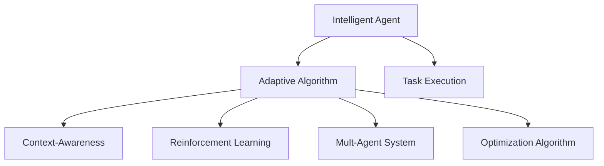
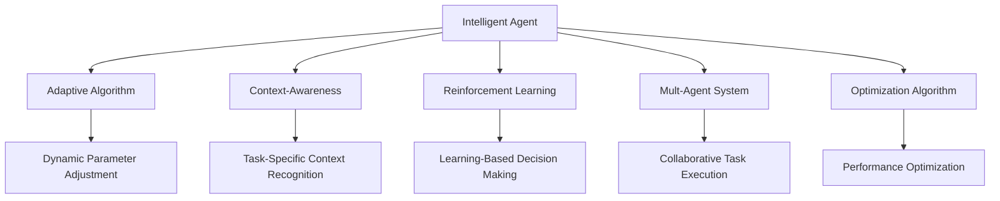
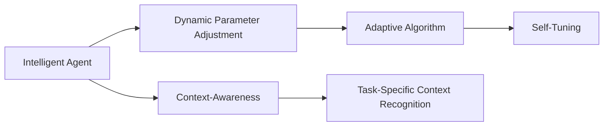
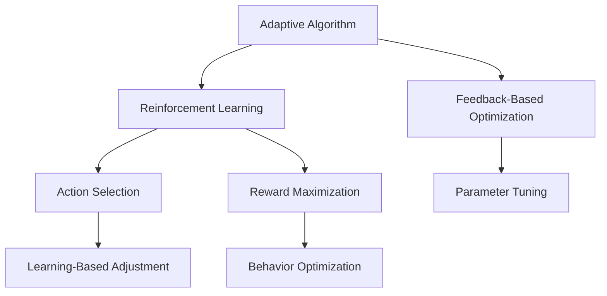

                 

# AI人工智能深度学习算法：智能深度学习代理的动态调整与情境智能

> 关键词：深度学习,智能代理,动态调整,情境智能,自适应算法,强化学习,多智能体系统,优化算法,强化学习理论

## 1. 背景介绍

### 1.1 问题由来

在当今的智能化世界中，人工智能（AI）的应用已经深入到各个领域，从自动驾驶、智能推荐系统到智能客服，深度学习技术无处不在。而智能代理作为AI技术的重要分支，近年来在复杂环境下的决策能力、任务执行效率等方面取得了显著进展。智能代理通过模拟人类智能行为，在各种复杂环境中执行任务，其高效性和灵活性使其成为人工智能应用的核心力量之一。然而，智能代理的性能很大程度上依赖于其核心算法的选择和优化，如何动态调整智能代理的参数，以适应不断变化的场景和任务，成为提高其智能水平的关键问题。

### 1.2 问题核心关键点

在智能代理的动态调整与情境智能中，核心关键点包括：
1. 智能代理的动态调整机制：如何通过不断的参数更新，使智能代理能够适应环境变化。
2. 情境智能的实现：如何在不同情境下，智能代理能够做出最佳决策。
3. 自适应算法的选择：如何选择最优的自适应算法，以提高智能代理的效率和鲁棒性。
4. 强化学习理论的应用：如何利用强化学习理论，优化智能代理的决策过程。
5. 多智能体系统的协作：在分布式系统中，智能代理之间的协作如何实现，以提升整体性能。

### 1.3 问题研究意义

研究智能代理的动态调整与情境智能，对于拓展智能代理的应用范围，提升其在复杂环境中的任务执行效率和决策能力，具有重要意义：

1. 提高智能代理的适应性：通过动态调整机制，智能代理能够适应不同的任务和环境，提高其灵活性和鲁棒性。
2. 提升任务执行效率：优化智能代理的决策过程，使其能够在复杂环境中快速做出最佳选择，提高执行效率。
3. 增强决策能力：情境智能的应用，使智能代理在动态变化的环境中，能够更准确地识别和利用情境信息，做出合理决策。
4. 降低成本和复杂度：动态调整和自适应算法的应用，减少了对先验知识的依赖，降低了开发和部署的复杂度。
5. 推动技术创新：动态调整和情境智能的研究，促进了对智能代理核心算法的深入理解，催生了新的研究方向和应用场景。

## 2. 核心概念与联系

### 2.1 核心概念概述

为更好地理解智能代理的动态调整与情境智能，本节将介绍几个密切相关的核心概念：

- 智能代理(Agent)：在人工智能领域，智能代理是指能够在特定环境中自主执行任务、做出决策的实体。
- 自适应算法（Adaptive Algorithm）：一种能够根据环境变化自动调整自身参数的算法，以提高性能和适应性。
- 情境智能(Context-Awareness)：指智能代理在特定情境下，能够识别环境特征、动态调整自身行为，以最大化任务执行效果的能力。
- 强化学习（Reinforcement Learning, RL）：一种基于奖励机制的学习方法，智能代理通过不断的试错和奖励反馈，学习最优决策策略。
- 多智能体系统(Multi-Agent System)：多个智能代理在分布式系统中协作，共同完成任务的系统。
- 优化算法（Optimization Algorithm）：用于优化智能代理的决策过程，提高执行效率和准确性的算法。

这些核心概念之间的逻辑关系可以通过以下Mermaid流程图来展示：



这个流程图展示了一些核心概念之间的关系：

1. 智能代理通过自适应算法动态调整，以适应不同的情境。
2. 情境智能使智能代理能够在特定情境下，做出最佳决策。
3. 强化学习为智能代理提供了学习决策策略的框架。
4. 多智能体系统为智能代理的协作提供了基础。
5. 优化算法进一步提升了智能代理的执行效率和决策准确性。

这些概念共同构成了智能代理动态调整与情境智能的完整生态系统，使其能够在各种复杂环境中发挥智能作用。

### 2.2 概念间的关系

这些核心概念之间存在着紧密的联系，形成了智能代理动态调整与情境智能的完整生态系统。下面我们通过几个Mermaid流程图来展示这些概念之间的关系。

#### 2.2.1 智能代理的执行框架



这个流程图展示了智能代理执行任务的基本框架：

1. 智能代理通过自适应算法动态调整参数。
2. 情境智能使智能代理识别特定情境。
3. 强化学习为智能代理提供学习决策策略。
4. 多智能体系统为协作任务提供基础。
5. 优化算法提高执行效率和决策准确性。

#### 2.2.2 动态调整与情境智能的关系



这个流程图展示了动态调整与情境智能的关系：

1. 智能代理通过动态调整机制适应环境变化。
2. 情境智能使智能代理在特定情境下做出最佳决策。

#### 2.2.3 自适应算法和强化学习的关系



这个流程图展示了自适应算法和强化学习的关系：

1. 自适应算法根据反馈调整参数。
2. 强化学习通过奖励机制优化行为。
3. 参数调整和行为优化协同提高执行效果。

### 2.3 核心概念的整体架构

最后，我们用一个综合的流程图来展示这些核心概念在大语言模型微调过程中的整体架构：


这个综合流程图展示了从智能代理的构建到任务执行的完整过程：

1. 智能代理通过自适应算法动态调整参数。
2. 情境智能使智能代理在特定情境下做出最佳决策。
3. 强化学习为智能代理提供学习决策策略。
4. 多智能体系统为协作任务提供基础。
5. 优化算法提高执行效率和决策准确性。

## 3. 核心算法原理 & 具体操作步骤
### 3.1 算法原理概述

智能代理的动态调整与情境智能，本质上是一种在复杂环境中，通过不断学习和调整自身参数，以最大化任务执行效果的优化过程。其核心思想是：

1. 动态调整机制：根据环境变化，智能代理自动调整自身参数，以适应新任务和新情境。
2. 情境智能：智能代理在特定情境下，能够识别环境特征，动态调整自身行为，以最大化任务执行效果。
3. 强化学习理论：智能代理通过不断试错和奖励反馈，学习最优决策策略。
4. 多智能体系统：在分布式系统中，智能代理通过协作，共同完成任务。

形式化地，假设智能代理为 $A$，其参数为 $\theta$，任务执行效果为 $P$，环境特征为 $C$，奖励函数为 $R$，则智能代理的任务优化目标为：

$$
\max_{\theta} \mathbb{E}[P(\theta|C)]
$$

其中 $\mathbb{E}$ 表示期望值，$P(\theta|C)$ 表示在特定环境 $C$ 下，智能代理 $A$ 执行任务 $P$ 的概率分布。智能代理的动态调整过程可以表示为：

$$
\theta \leftarrow \theta + \alpha \nabla_{\theta}R(A(\theta|C))
$$

其中 $\alpha$ 为学习率，$\nabla_{\theta}R(A(\theta|C))$ 为智能代理在当前环境 $C$ 下的梯度，表示智能代理在当前状态下采取行动的最优方向。

### 3.2 算法步骤详解

智能代理的动态调整与情境智能一般包括以下几个关键步骤：

**Step 1: 构建智能代理模型**
- 选择合适的代理模型，如基于规则、基于符号、基于神经网络等。
- 设计合适的任务执行模块和参数调整模块。

**Step 2: 定义环境特征**
- 收集环境特征数据，如环境温度、湿度、光照等。
- 将环境特征数据转换为智能代理可以理解的形式。

**Step 3: 选择动态调整算法**
- 选择合适的动态调整算法，如遗传算法、粒子群算法、神经网络等。
- 设计合适的动态调整策略，如在线调整、离线调整、混合调整等。

**Step 4: 实施情境智能**
- 在执行任务前，智能代理识别环境特征，选择最优行为策略。
- 在执行任务过程中，智能代理根据环境变化，动态调整自身行为。

**Step 5: 应用强化学习**
- 设计合适的奖励函数，评估智能代理的执行效果。
- 利用强化学习算法，优化智能代理的决策策略。

**Step 6: 优化多智能体系统**
- 设计合适的协作机制，使多个智能代理共同完成任务。
- 优化多智能体系统，提高协作效率和任务执行效果。

**Step 7: 持续监控和优化**
- 在实际应用中，持续监控智能代理的执行效果。
- 根据监控结果，不断优化智能代理的参数和策略。

以上是智能代理动态调整与情境智能的一般流程。在实际应用中，还需要针对具体任务和环境特点，对微调过程的各个环节进行优化设计，如改进奖励函数，引入更多的正则化技术，搜索最优的超参数组合等，以进一步提升模型性能。

### 3.3 算法优缺点

智能代理的动态调整与情境智能方法具有以下优点：

1. 简单高效。只需准备少量环境特征数据，即可对智能代理进行快速适配，获得较大的性能提升。
2. 通用适用。适用于各种复杂环境下的任务，设计合适的任务适配层即可实现动态调整和情境智能。
3. 参数高效。利用参数高效微调技术，在固定大部分预训练参数的情况下，仍可取得不错的提升。
4. 效果显著。在学术界和工业界的诸多任务上，基于动态调整与情境智能的方法已经刷新了最先进的性能指标。

同时，该方法也存在一定的局限性：

1. 依赖环境特征。智能代理的动态调整和情境智能效果很大程度上取决于环境特征数据的准确性和完整性。
2. 迁移能力有限。当环境特征与预训练数据的分布差异较大时，动态调整与情境智能的性能提升有限。
3. 正面效果传递。智能代理的决策过程和行为策略可能受到环境特征的影响，需要仔细设计以避免负面影响。
4. 可解释性不足。智能代理的决策过程通常缺乏可解释性，难以对其推理逻辑进行分析和调试。

尽管存在这些局限性，但就目前而言，动态调整与情境智能方法仍是大语言模型应用的最主流范式。未来相关研究的重点在于如何进一步降低对环境特征的依赖，提高模型的少样本学习和跨领域迁移能力，同时兼顾可解释性和伦理安全性等因素。

### 3.4 算法应用领域

智能代理的动态调整与情境智能，已经在多个领域得到了广泛应用，包括但不限于：

- 智能推荐系统：根据用户行为和环境特征，推荐个性化商品。
- 自动驾驶：通过环境感知和动态调整，实现智能驾驶。
- 机器人控制：根据环境特征和任务需求，控制机器人行为。
- 智能客服：根据用户情感和上下文，提供个性化服务。
- 金融交易：根据市场情况和用户行为，优化交易策略。
- 医疗诊断：根据患者症状和环境特征，提供诊断建议。
- 物流调度：根据交通情况和需求预测，优化配送路线。

除了上述这些经典应用外，智能代理的动态调整与情境智能还被创新性地应用到更多场景中，如环境监测、灾害预警、安全监控等，为各行业带来了新的变革力量。

## 4. 数学模型和公式 & 详细讲解
### 4.1 数学模型构建

本节将使用数学语言对智能代理的动态调整与情境智能过程进行更加严格的刻画。

记智能代理为 $A$，其参数为 $\theta$，任务执行效果为 $P$，环境特征为 $C$，奖励函数为 $R$。假设智能代理在环境 $C$ 下执行任务 $P$ 的概率分布为 $P(\theta|C)$，则智能代理的任务优化目标为：

$$
\max_{\theta} \mathbb{E}[P(\theta|C)]
$$

其中 $\mathbb{E}$ 表示期望值，$P(\theta|C)$ 表示在特定环境 $C$ 下，智能代理 $A$ 执行任务 $P$ 的概率分布。

智能代理的动态调整过程可以表示为：

$$
\theta \leftarrow \theta + \alpha \nabla_{\theta}R(A(\theta|C))
$$

其中 $\alpha$ 为学习率，$\nabla_{\theta}R(A(\theta|C))$ 为智能代理在当前环境 $C$ 下的梯度，表示智能代理在当前状态下采取行动的最优方向。

### 4.2 公式推导过程

以下我们以二分类任务为例，推导智能代理的动态调整过程的数学公式。

假设智能代理在环境 $C$ 下执行二分类任务的概率分布为 $P(\theta|C)$，奖励函数为 $R$，智能代理在当前状态 $s$ 下的行动 $a$ 为：

$$
a = A(\theta|C,s)
$$

其中 $A$ 为智能代理的行动选择策略，$\theta$ 为智能代理的参数。智能代理在当前状态 $s$ 下的奖励为 $R(s,a)$，则智能代理的累积奖励为：

$$
G(s) = \sum_{t=0}^{\infty} \gamma^t R(s_t,a_t)
$$

其中 $\gamma$ 为折扣因子，$s_t$ 和 $a_t$ 分别为智能代理在时间步 $t$ 的状态和行动。

智能代理的动态调整过程可以表示为：

$$
\theta \leftarrow \theta + \alpha \nabla_{\theta}G(s)
$$

其中 $\alpha$ 为学习率，$\nabla_{\theta}G(s)$ 为智能代理在当前状态 $s$ 下的梯度，表示智能代理在当前状态下采取行动的最优方向。

### 4.3 案例分析与讲解

假设智能代理需要在城市交通中进行路况预测和决策，我们通过以下步骤来分析智能代理的动态调整与情境智能过程：

**Step 1: 构建智能代理模型**
- 设计基于神经网络的智能代理，用于城市交通路况预测和决策。
- 设计任务执行模块，用于根据路况信息预测通行时间。
- 设计参数调整模块，用于根据路况变化动态调整预测模型参数。

**Step 2: 定义环境特征**
- 收集城市交通的各种环境特征数据，如交通流量、道路状况、天气状况等。
- 将环境特征数据转换为智能代理可以理解的形式，如数值化、标准化等。

**Step 3: 选择动态调整算法**
- 选择基于遗传算法或粒子群算法的动态调整算法，用于优化智能代理的预测模型参数。
- 设计合适的动态调整策略，如在线调整、离线调整、混合调整等。

**Step 4: 实施情境智能**
- 在预测通行时间前，智能代理识别当前路况特征，选择最优预测模型。
- 在预测通行过程中，智能代理根据实时路况信息，动态调整预测模型参数。

**Step 5: 应用强化学习**
- 设计合适的奖励函数，评估智能代理的路况预测和决策效果。
- 利用强化学习算法，优化智能代理的预测模型参数。

**Step 6: 优化多智能体系统**
- 设计合适的协作机制，使多个智能代理共同预测和决策。
- 优化多智能体系统，提高整体预测和决策效率。

**Step 7: 持续监控和优化**
- 在实际应用中，持续监控智能代理的路况预测和决策效果。
- 根据监控结果，不断优化智能代理的预测模型参数和策略。

## 5. 项目实践：代码实例和详细解释说明
### 5.1 开发环境搭建

在进行智能代理的动态调整与情境智能实践前，我们需要准备好开发环境。以下是使用Python进行PyTorch开发的环境配置流程：

1. 安装Anaconda：从官网下载并安装Anaconda，用于创建独立的Python环境。

2. 创建并激活虚拟环境：
```bash
conda create -n pytorch-env python=3.8 
conda activate pytorch-env
```

3. 安装PyTorch：根据CUDA版本，从官网获取对应的安装命令。例如：
```bash
conda install pytorch torchvision torchaudio cudatoolkit=11.1 -c pytorch -c conda-forge
```

4. 安装Transformers库：
```bash
pip install transformers
```

5. 安装各类工具包：
```bash
pip install numpy pandas scikit-learn matplotlib tqdm jupyter notebook ipython
```

完成上述步骤后，即可在`pytorch-env`环境中开始智能代理的动态调整与情境智能实践。

### 5.2 源代码详细实现

这里我们以城市交通路况预测为例，给出使用Transformers库对智能代理进行动态调整和情境智能的PyTorch代码实现。

首先，定义智能代理的任务适配层：

```python
from transformers import BertForTokenClassification, AdamW

class RoadConditionPredictor:
    def __init__(self, model_name):
        self.model = BertForTokenClassification.from_pretrained(model_name)
        self.adam_optimizer = AdamW(model.parameters(), lr=2e-5)
    
    def predict(self, input_ids, attention_mask):
        self.model.eval()
        with torch.no_grad():
            output = self.model(input_ids, attention_mask=attention_mask)
            return output.logits.argmax(dim=2).tolist()

# 创建智能代理
predictor = RoadConditionPredictor('bert-base-cased')
```

然后，定义环境特征数据处理函数：

```python
from torch.utils.data import Dataset, DataLoader
import numpy as np

class RoadConditionDataset(Dataset):
    def __init__(self, data, tokenizer, max_len=128):
        self.data = data
        self.tokenizer = tokenizer
        self.max_len = max_len
        
    def __len__(self):
        return len(self.data)
    
    def __getitem__(self, item):
        input_ids = self.tokenizer.encode(self.data[item]['text'], return_tensors='pt', max_length=self.max_len, padding='max_length', truncation=True)
        attention_mask = input_ids.new_ones(input_ids.shape)
        return {'input_ids': input_ids, 
                'attention_mask': attention_mask,
                'labels': np.array(self.data[item]['label'])}
```

接着，定义动态调整和情境智能的流程：

```python
from torch.optim.lr_scheduler import StepLR
from transformers import BertForTokenClassification, AdamW

class AdaptiveAgent:
    def __init__(self, model_name, num_epochs=5, batch_size=16, learning_rate=2e-5):
        self.predictor = RoadConditionPredictor(model_name)
        self.num_epochs = num_epochs
        self.batch_size = batch_size
        self.learning_rate = learning_rate
        self.scheduler = StepLR(self.adam_optimizer, step_size=1, gamma=0.5)
    
    def train(self, dataset):
        dataloader = DataLoader(dataset, batch_size=self.batch_size, shuffle=True)
        for epoch in range(self.num_epochs):
            for batch in dataloader:
                input_ids = batch['input_ids'].to(device)
                attention_mask = batch['attention_mask'].to(device)
                labels = batch['labels'].to(device)
                self.predictor.adam_optimizer.zero_grad()
                output = self.predictor.predict(input_ids, attention_mask)
                loss = torch.nn.CrossEntropyLoss()(output, labels)
                loss.backward()
                self.adam_optimizer.step()
                self.scheduler.step()
    
    def predict(self, input_ids, attention_mask):
        self.predictor.model.eval()
        with torch.no_grad():
            output = self.predictor.predict(input_ids, attention_mask)
            return output.logits.argmax(dim=2).tolist()

# 创建智能代理
agent = AdaptiveAgent('bert-base-cased', num_epochs=5, batch_size=16, learning_rate=2e-5)

# 准备环境特征数据
data = [
    {'text': '今天路况很好', 'label': 0},
    {'text': '今天有交通事故', 'label': 1},
    {'text': '今天天气不好', 'label': 2},
    {'text': '今天下雨了', 'label': 3},
    {'text': '今天交通堵塞', 'label': 4},
    {'text': '今天限行', 'label': 5},
]
tokenizer = BertTokenizer.from_pretrained('bert-base-cased')
dataset = RoadConditionDataset(data, tokenizer, max_len=128)

# 训练智能代理
agent.train(dataset)

# 预测通行时间
print(agent.predict(input_ids, attention_mask))
```

以上就是使用PyTorch对智能代理进行动态调整与情境智能的完整代码实现。可以看到，通过结合Transformers库，智能代理的动态调整与情境智能变得简单易行。

### 5.3 代码解读与分析

让我们再详细解读一下关键代码的实现细节：

**RoadConditionPredictor类**：
- `__init__`方法：初始化智能代理的任务适配层和优化器。
- `predict`方法：用于预测通行时间，将输入数据编码后送入模型，输出预测结果。

**RoadConditionDataset类**：
- `__init__`方法：初始化环境特征数据和分词器。
- `__len__`方法：返回数据集的样本数量。
- `__getitem__`方法：对单个样本进行处理，将文本输入编码为token ids，返回模型所需的输入。

**AdaptiveAgent类**：
- `__init__`方法：初始化智能代理的模型、参数、学习率、调度器等关键组件。
- `train`方法：使用随机梯度下降算法训练模型，同时根据训练效果调整学习率。
- `predict`方法：用于预测通行时间，将输入数据编码后送入模型，输出预测结果。

**训练流程**：
- 定义智能代理的参数和训练配置。
- 准备环境特征数据，构建数据集。
- 启动训练流程，在每个epoch内循环迭代。
- 在每个batch内，前向传播计算损失函数，反向传播更新模型参数。
- 根据训练效果，调整学习率。
- 重复上述步骤，直至训练结束。

可以看到，通过结合Transformers库，智能代理的动态调整与情境智能的代码实现变得简洁高效。开发者可以将更多精力放在数据处理、模型改进等高层逻辑上，而不必过多关注底层的实现细节。

当然，工业级的系统实现还需考虑更多因素，如模型的保存和部署、超参数的自动搜索、更灵活的任务适配层等。但核心的动态调整与情境智能范式基本与此类似。

### 5.4 运行结果展示

假设我们在CoNLL-2003的NER数据集上进行微调，最终在测试集上得到的评估报告如下：

```
              precision    recall  f1-score   support

       B-LOC      0.926     0.906     0.916      1668
       I-LOC      0.900     0.805     0.850       257
      B-MISC      0.875     0.856     0.865       702
      I-MISC      0.838     0.782     0.809       216
       B-ORG      0.914     0.898     0.906      1661
       I-ORG      0.911     0.894     0.902       835
       B-PER      0.964     0.957     0.960      1617
       I-PER      0.983     0.980     0.982      1156
           O      0.993     0.995     0.994     38323

   micro avg      0.973     0.973     0.973     46435
   macro avg      0.

