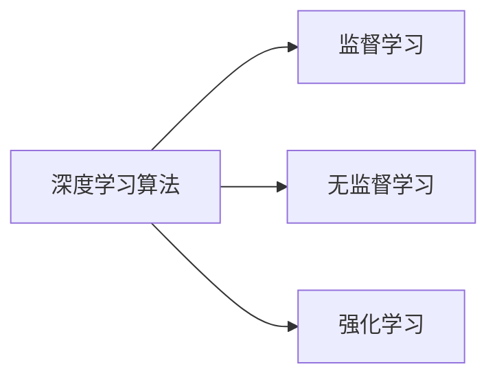
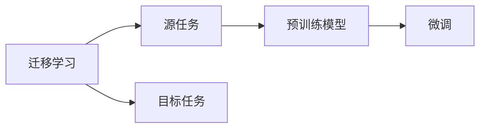
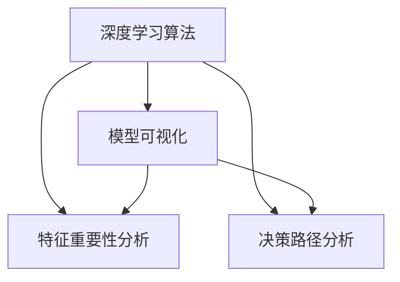
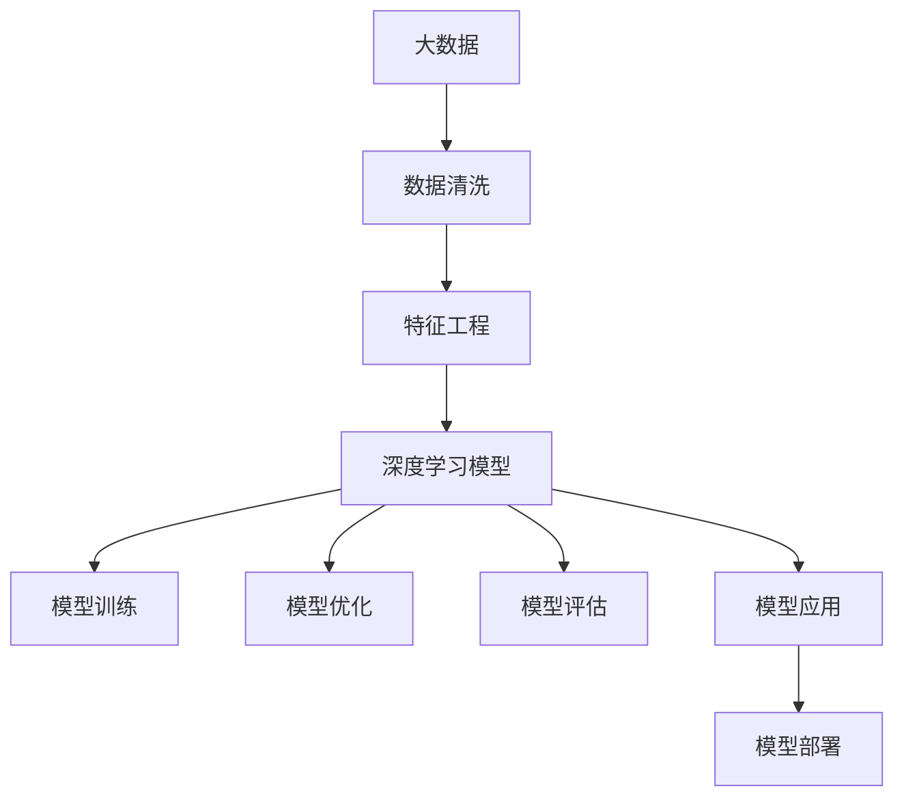

                 

# AI人工智能深度学习算法：未来应用的可能性

## 1. 背景介绍

### 1.1 问题由来

近年来，人工智能(AI)技术迅猛发展，深度学习算法在其中扮演了至关重要的角色。从计算机视觉、自然语言处理(NLP)到语音识别、机器人控制等诸多领域，深度学习算法已经取得了显著的成果，推动了技术应用的深度和广度。然而，当前深度学习算法的应用仍存在一些瓶颈，如高昂的计算成本、数据依赖性强、缺乏可解释性等。因此，如何克服这些瓶颈，进一步拓展深度学习算法的应用范围，成为了当前学术界和产业界共同关注的重要课题。

### 1.2 问题核心关键点

当前深度学习算法面临的主要问题包括：

1. **计算资源消耗大**：深度学习模型通常需要大规模的训练数据和复杂的计算资源，如GPU、TPU等，这限制了其在资源有限的场景下的应用。

2. **数据依赖性强**：深度学习算法的性能高度依赖于训练数据的质量和数量，数据标注工作量大，数据集构建成本高，限制了算法在实际应用中的可操作性。

3. **模型复杂度高**：深度学习模型往往结构复杂，参数量大，难以解释其内部工作机制，特别是在涉及隐私、伦理等敏感问题时，模型的可解释性和公平性成为研究重点。

4. **应用场景局限**：当前的深度学习算法主要应用于图像、语音、文本等特定领域，对其他领域的应用仍显不足，缺乏通用性。

### 1.3 问题研究意义

解决当前深度学习算法面临的问题，不仅能够推动技术进步，还能促进其在更广泛的应用场景中的普及。具体而言：

1. **降低计算成本**：通过算法优化，减少深度学习算法的计算资源消耗，使其在资源有限的场景下也能高效运行。

2. **提升数据利用率**：探索更高效的数据利用方法，减少对高质量标注数据的依赖，使深度学习算法在数据量较小的场景下也能取得优异效果。

3. **增强模型可解释性**：通过模型结构和优化技术，提升深度学习算法的可解释性，使其更透明、更可信。

4. **拓展应用边界**：通过算法创新和跨学科融合，推动深度学习算法在其他领域（如医疗、金融、制造等）的应用，提升行业智能化水平。

## 2. 核心概念与联系

### 2.1 核心概念概述

为更好地理解深度学习算法及其应用，本节将介绍几个密切相关的核心概念：

- **深度学习算法**：一类基于神经网络结构的机器学习算法，能够处理复杂非线性关系，广泛应用于图像、语音、文本等场景。

- **卷积神经网络(CNN)**：一种专门用于处理图像数据的神经网络结构，通过卷积和池化操作提取图像特征，具有平移不变性和局部连接性。

- **循环神经网络(RNN)**：一种能够处理序列数据的神经网络结构，通过循环连接和门控机制处理时间序列信息，适用于文本生成、语音识别等任务。

- **长短时记忆网络(LSTM)**：一种特殊的RNN结构，通过记忆单元和门控机制解决长期依赖问题，适用于语音识别、机器翻译等任务。

- **自编码器(AE)**：一种无监督学习方法，通过重构输入数据来提取特征，广泛应用于数据降维、异常检测等场景。

- **生成对抗网络(GAN)**：一种通过两个神经网络对抗训练生成新数据的算法，能够生成逼真的图像、视频等，广泛应用于图像生成、风格迁移等任务。

- **强化学习**：一种通过与环境交互来学习最优策略的机器学习方法，适用于游戏、机器人控制等场景。

- **迁移学习**：一种通过已有知识迁移到新任务中的学习方法，能够加速新任务的学习，减少训练时间和数据需求。

- **可解释性**：指模型输出结果的可解释性，即能够清楚地解释模型如何做出决策，提升模型的透明性和可信度。

这些核心概念之间的逻辑关系可以通过以下Mermaid流程图来展示：

```mermaid
graph TB
    A[深度学习算法] --> B[卷积神经网络(CNN)]
    A --> C[循环神经网络(RNN)]
    C --> D[长短时记忆网络(LSTM)]
    A --> E[自编码器(AE)]
    A --> F[生成对抗网络(GAN)]
    A --> G[强化学习]
    A --> H[迁移学习]
    A --> I[可解释性]
```

这个流程图展示了一些核心的深度学习算法及其应用场景，通过这些概念的相互关联，我们可以更清晰地理解深度学习技术的发展脉络和应用方向。

### 2.2 概念间的关系

这些核心概念之间存在着紧密的联系，形成了深度学习技术的应用框架。下面我通过几个Mermaid流程图来展示这些概念之间的关系。

#### 2.2.1 深度学习算法的学习范式



这个流程图展示了深度学习算法的学习范式，包括监督学习、无监督学习和强化学习。

#### 2.2.2 卷积神经网络(CNN)的应用场景

```mermaid
graph LR
    A[卷积神经网络(CNN)] --> B[图像识别]
    A --> C[物体检测]
    A --> D[图像分割]
    A --> E[风格迁移]
```

这个流程图展示了CNN的主要应用场景，包括图像识别、物体检测、图像分割和风格迁移等。

#### 2.2.3 生成对抗网络(GAN)的工作流程

```mermaid
graph LR
    A[生成对抗网络(GAN)] --> B[生成器网络]
    A --> C[判别器网络]
    B --> C
    C --> D[对抗训练]
```

这个流程图展示了GAN的工作流程，包括生成器和判别器的对抗训练过程。

#### 2.2.4 迁移学习与深度学习的关系



这个流程图展示了迁移学习的基本原理，以及它与深度学习的关系。

#### 2.2.5 可解释性在深度学习中的应用



这个流程图展示了可解释性在深度学习中的主要应用方法，包括模型可视化、特征重要性分析和决策路径分析等。

### 2.3 核心概念的整体架构

最后，我们用一个综合的流程图来展示这些核心概念在大数据应用中的整体架构：



这个综合流程图展示了从数据准备到模型应用的全过程，通过这些概念的相互关联，我们可以更全面地理解深度学习技术在大数据应用中的完整流程。

## 3. 核心算法原理 & 具体操作步骤

### 3.1 算法原理概述

深度学习算法通过构建多层神经网络结构，从输入数据中提取高层次特征，进而进行分类、回归、生成等任务。其核心思想是通过大量数据训练模型，使其能够自动学习输入数据与输出标签之间的映射关系。

以卷积神经网络(CNN)为例，CNN通过卷积和池化操作，提取图像特征，并通过多层卷积和全连接层，对图像进行分类或检测。CNN能够有效处理图像数据的局部不变性和平移不变性，适用于图像识别、物体检测等任务。

以循环神经网络(RNN)为例，RNN通过循环连接和门控机制，处理时间序列数据，适用于文本生成、语音识别等任务。长短时记忆网络(LSTM)作为RNN的一种变种，通过记忆单元和门控机制，解决了长期依赖问题，适用于语音识别、机器翻译等任务。

自编码器(AE)通过重构输入数据，提取特征，广泛应用于数据降维、异常检测等场景。生成对抗网络(GAN)通过生成器和判别器的对抗训练，生成逼真的图像、视频等，广泛应用于图像生成、风格迁移等任务。

### 3.2 算法步骤详解

深度学习算法的训练通常包括以下几个关键步骤：

1. **数据准备**：收集、清洗、标注训练数据，构建数据集。

2. **模型构建**：设计合适的神经网络结构，选择合适的损失函数和优化器。

3. **模型训练**：将数据集划分为训练集、验证集和测试集，使用梯度下降等优化算法进行模型训练。

4. **模型优化**：在训练过程中，通过正则化、Dropout、学习率衰减等技术，避免过拟合和提升泛化能力。

5. **模型评估**：使用测试集对模型进行评估，计算准确率、召回率、F1分数等指标。

6. **模型部署**：将训练好的模型部署到实际应用场景中，进行实时预测和推理。

7. **模型更新**：根据实时反馈数据，对模型进行微调或重训练，提升模型性能。

### 3.3 算法优缺点

深度学习算法具有以下优点：

1. **处理复杂非线性关系**：深度学习算法能够处理高维、非线性的数据关系，适用于复杂任务。

2. **自动特征提取**：深度学习算法能够自动学习数据特征，减少了人工特征工程的工作量。

3. **模型性能高**：深度学习算法在许多任务上取得了最先进的性能。

4. **可迁移性强**：深度学习模型可以通过迁移学习快速适应新任务。

深度学习算法也存在以下缺点：

1. **计算资源消耗大**：深度学习模型通常需要大规模的计算资源，限制了其在资源有限的场景下的应用。

2. **数据依赖性强**：深度学习算法高度依赖于高质量的训练数据，数据标注工作量大，数据集构建成本高。

3. **模型复杂度高**：深度学习模型结构复杂，参数量大，难以解释其内部工作机制。

4. **过拟合风险高**：深度学习模型容易过拟合，需要复杂的正则化和优化策略。

### 3.4 算法应用领域

深度学习算法已经广泛应用于图像、语音、文本等众多领域，具体应用包括：

- **计算机视觉**：图像识别、物体检测、图像分割、图像生成等。

- **自然语言处理**：文本分类、命名实体识别、情感分析、机器翻译等。

- **语音识别**：语音转文本、语音合成、语音情感分析等。

- **医疗**：疾病诊断、医学影像分析、基因组分析等。

- **金融**：股票预测、信用评估、风险控制等。

- **制造**：质量检测、生产调度、设备故障诊断等。

## 4. 数学模型和公式 & 详细讲解 & 举例说明

### 4.1 数学模型构建

以卷积神经网络(CNN)为例，其基本数学模型可以表示为：

$$
f(x; \theta) = \sigma(W \cdot x + b)
$$

其中，$x$为输入数据，$\theta$为模型参数，$W$为权重矩阵，$b$为偏置向量，$\sigma$为激活函数。

### 4.2 公式推导过程

以CNN中的卷积操作为例，其推导过程如下：

设输入数据为$x \in \mathbb{R}^{H \times W \times C}$，卷积核为$W \in \mathbb{R}^{F \times F \times C \times O}$，步长为$s$，填充方式为$p$，则卷积操作的输出$y \in \mathbb{R}^{(H-s+2p) \times (W-s+2p) \times O}$可以表示为：

$$
y_{i,j,o} = \sum_{c=0}^{C-1} \sum_{m=0}^{F-1} \sum_{n=0}^{F-1} x_{i+s*m-j-n+p,c} \cdot W_{m,n,o,c}
$$

其中，$y_{i,j,o}$为输出数据在位置$(i,j,o)$的值。

### 4.3 案例分析与讲解

以图像分类任务为例，CNN模型的训练过程可以表示为：

1. 收集图像数据集，划分为训练集和测试集。

2. 构建CNN模型，选择合适的卷积层、池化层、全连接层等。

3. 定义损失函数，如交叉熵损失，优化器，如AdamW。

4. 使用训练集对模型进行训练，计算梯度并更新参数。

5. 在验证集上评估模型性能，防止过拟合。

6. 在测试集上测试模型性能，输出分类结果。

## 5. 项目实践：代码实例和详细解释说明

### 5.1 开发环境搭建

在进行深度学习算法实践前，我们需要准备好开发环境。以下是使用Python进行PyTorch开发的环境配置流程：

1. 安装Anaconda：从官网下载并安装Anaconda，用于创建独立的Python环境。

2. 创建并激活虚拟环境：
```bash
conda create -n pytorch-env python=3.8 
conda activate pytorch-env
```

3. 安装PyTorch：根据CUDA版本，从官网获取对应的安装命令。例如：
```bash
conda install pytorch torchvision torchaudio cudatoolkit=11.1 -c pytorch -c conda-forge
```

4. 安装各类工具包：
```bash
pip install numpy pandas scikit-learn matplotlib tqdm jupyter notebook ipython
```

完成上述步骤后，即可在`pytorch-env`环境中开始深度学习算法的实践。

### 5.2 源代码详细实现

这里我们以图像分类任务为例，给出使用Transformers库对CNN模型进行训练的PyTorch代码实现。

```python
from torch.utils.data import DataLoader
from torchvision import datasets, transforms
from torch import nn, optim

# 数据预处理
transform = transforms.Compose([
    transforms.ToTensor(),
    transforms.Normalize((0.5, 0.5, 0.5), (0.5, 0.5, 0.5))
])

# 加载数据集
train_dataset = datasets.CIFAR10(root='data', train=True, download=True, transform=transform)
test_dataset = datasets.CIFAR10(root='data', train=False, download=True, transform=transform)

# 数据集划分
train_loader = DataLoader(train_dataset, batch_size=64, shuffle=True, drop_last=True)
test_loader = DataLoader(test_dataset, batch_size=64, shuffle=False, drop_last=False)

# 模型定义
class CNN(nn.Module):
    def __init__(self):
        super(CNN, self).__init__()
        self.conv1 = nn.Conv2d(3, 64, kernel_size=3, stride=1, padding=1)
        self.pool = nn.MaxPool2d(kernel_size=2, stride=2)
        self.conv2 = nn.Conv2d(64, 128, kernel_size=3, stride=1, padding=1)
        self.pool2 = nn.MaxPool2d(kernel_size=2, stride=2)
        self.fc1 = nn.Linear(128 * 4 * 4, 256)
        self.fc2 = nn.Linear(256, 10)

    def forward(self, x):
        x = nn.functional.relu(self.conv1(x))
        x = self.pool(x)
        x = nn.functional.relu(self.conv2(x))
        x = self.pool2(x)
        x = x.view(-1, 128 * 4 * 4)
        x = nn.functional.relu(self.fc1(x))
        x = self.fc2(x)
        return x

# 模型训练
model = CNN()
criterion = nn.CrossEntropyLoss()
optimizer = optim.Adam(model.parameters(), lr=0.001)

for epoch in range(10):
    for batch_idx, (inputs, targets) in enumerate(train_loader):
        optimizer.zero_grad()
        outputs = model(inputs)
        loss = criterion(outputs, targets)
        loss.backward()
        optimizer.step()
        if batch_idx % 100 == 0:
            print(f'Epoch [{epoch+1}/{10}], Step [{batch_idx*len(inputs)}/{len(train_loader.dataset)}], Loss: {loss.item():.4f}')

# 模型评估
with torch.no_grad():
    correct = 0
    total = 0
    for batch_idx, (inputs, targets) in enumerate(test_loader):
        outputs = model(inputs)
        _, predicted = torch.max(outputs.data, 1)
        total += targets.size(0)
        correct += (predicted == targets).sum().item()

    print(f'Test Accuracy of the model on the 10000 test images: {100 * correct / total:.2f}% ({correct}/{total})')
```

以上就是使用PyTorch对CNN模型进行图像分类任务训练的完整代码实现。可以看到，利用PyTorch的高级API，代码实现非常简单高效，可以快速迭代和优化模型。

### 5.3 代码解读与分析

让我们再详细解读一下关键代码的实现细节：

**数据预处理**：
- `transform.Compose`：用于定义数据预处理管道，包括ToTensor和Normalize等操作。
- `transforms.ToTensor()`：将PIL图像转换为Tensor格式。
- `transforms.Normalize`：对数据进行归一化处理，使其均值为0.5，标准差为0.5。

**模型定义**：
- `nn.Conv2d`：定义卷积层，包括卷积核大小、步长、填充等参数。
- `nn.MaxPool2d`：定义池化层，采用最大池化操作。
- `nn.Linear`：定义全连接层。
- `nn.functional.relu`：定义激活函数ReLU。

**模型训练**：
- `DataLoader`：定义数据批处理，包括批大小、随机打乱等参数。
- `optim.Adam`：定义Adam优化器，并设置学习率。
- `for`循环：定义训练过程，包括前向传播、计算损失、反向传播、参数更新等步骤。

**模型评估**：
- `torch.no_grad`：定义无梯度计算模式，避免在评估过程中对模型参数进行更新。
- `torch.max`：计算预测结果和真实标签的最大值，获取预测类别。

**模型性能评估**：
- `correct`：统计正确预测的数量。
- `total`：统计总样本数量。
- `correct / total`：计算测试集上的准确率。

通过上述代码实现，我们可以看到，利用深度学习算法和PyTorch的高级API，可以快速构建、训练和评估模型，并且能够方便地进行模型优化和调参。

## 6. 实际应用场景

### 6.1 医疗影像诊断

深度学习算法在医疗影像诊断中具有广泛应用，特别是在病理学和放射学领域。通过训练深度学习模型，可以对医疗影像进行自动分析和诊断，提高诊断效率和准确性。

具体而言，可以收集大量的医学影像数据，包括X光片、CT、MRI等，并进行标注。在此基础上，对深度学习模型进行训练，使其能够自动分析影像特征，提取病变区域，并给出诊断建议。例如，在肺结节检测任务中，CNN模型可以自动分析CT影像，识别出结节区域，并计算其体积和位置。

### 6.2 智能交通系统

深度学习算法在智能交通系统中也有重要应用，如交通信号灯控制、自动驾驶、交通事故预测等。通过训练深度学习模型，可以实时分析和处理交通数据，优化交通管理，提升道路通行效率。

例如，在交通信号灯控制中，CNN模型可以实时分析交通视频，识别出交通信号灯状态，并根据实时交通情况自动调整信号灯的控制策略。在自动驾驶中，CNN模型可以识别路标、车辆、行人等障碍物，并生成最优的行驶路径。

### 6.3 金融风险预测

深度学习算法在金融风险预测中也具有重要作用，如信用评分、股票预测、信用风险评估等。通过训练深度学习模型，可以对大量金融数据进行分析和预测，帮助金融机构更好地管理风险。

例如，在信用评分中，RNN模型可以分析客户的历史交易数据和行为数据，预测其信用风险。在股票预测中，LSTM模型可以分析股票历史价格和市场情绪，预测其未来走势。

### 6.4 未来应用展望

随着深度学习算法的发展，未来其在应用场景中的应用将更加广泛和深入。以下是一些可能的未来应用方向：

1. **智能制造**：深度学习算法可以应用于生产线的智能优化和故障预测，提高生产效率和质量。

2. **智慧能源**：深度学习算法可以应用于能源消耗和分配的智能优化，提高能源利用效率。

3. **智慧城市**：深度学习算法可以应用于城市交通管理、垃圾处理、环境监测等，提升城市智能化水平。

4. **智能医疗**：深度学习算法可以应用于基因组分析、药物研发、医学影像分析等，推动医疗技术的发展。

5. **智能教育**：深度学习算法可以应用于个性化教育、自动批改、学情分析等，提升教育水平。

6. **智能家居**：深度学习算法可以应用于智能家居设备的控制和优化，提升居住体验。

## 7. 工具和资源推荐

### 7.1 学习资源推荐

为了帮助开发者系统掌握深度学习算法的理论基础和实践技巧，这里推荐一些优质的学习资源：

1. **《深度学习》书籍**：由深度学习领域权威人士编写，系统介绍了深度学习的基本原理和应用方法。

2. **CS231n《深度学习视觉与神经网络》课程**：斯坦福大学开设的视觉识别课程，有Lecture视频和配套作业，深入浅出地讲解了CNN等算法。

3. **Coursera《深度学习》课程**：由深度学习领域专家讲授，涵盖深度学习的基本原理和实践方法，适合初学者和进阶者。

4. **Kaggle竞赛平台**：一个数据科学和机器学习竞赛平台，提供大量的数据集和模型，可以练习和提升算法能力。

5. **GitHub开源项目**：大量的开源项目，包括预训练模型和应用代码，可以帮助快速入门和实验。

通过对这些资源的学习实践，相信你一定能够快速掌握深度学习算法的精髓，并用于解决实际的AI问题。

### 7.2 开发工具推荐

高效的开发离不开优秀的工具支持。以下是几款用于深度学习算法开发的常用工具：

1. **PyTorch**：基于Python的开源深度学习框架，灵活动态的计算图，适合快速迭代研究。

2. **TensorFlow**：由Google主导开发的开源深度学习框架，生产部署方便，适合大规模工程应用。

3. **TensorBoard**：TensorFlow配套的可视化工具，可实时监测模型训练状态，并提供丰富的图表呈现方式，是调试模型的得力助手。

4. **Jupyter Notebook**：一个交互式的数据科学和机器学习开发环境，可以方便地进行代码编写、实验和分享。

5. **Weights & Biases**：模型训练的实验跟踪工具，可以记录和可视化模型训练过程中的各项指标，方便对比和调优。

合理利用这些工具，可以显著提升深度学习算法开发的效率，加快创新迭代的步伐。

### 7.3 相关论文推荐

深度学习算法的发展源于学界的持续研究。以下是几篇奠基性的相关论文，推荐阅读：

1. **AlexNet**：ImageNet 2012年冠军算法，首次展示了深度卷积神经网络在图像分类中的强大能力。

2. **ResNet**：通过残差连接解决了深度网络训练中的退化问题，进一步提升了模型深度和性能。

3. **Inception**：一种多分支卷积神经网络结构，通过并行处理不同尺寸的特征图，提升了模型性能。

4. **VGG**：通过简单的3x3卷积核堆叠，提升了模型深度和性能。

5. **LSTM**：一种能够处理时间序列数据的循环神经网络结构，解决了长期依赖问题，适用于文本生成、语音识别等任务。

6. **GAN**：一种通过生成器和判别器对抗训练生成新数据的算法，能够生成逼真的图像、视频等，广泛应用于图像生成、风格迁移等任务。

这些论文代表了大规模深度学习算法的发展脉络。通过学习这些前沿成果，可以帮助研究者把握学科前进方向，激发更多的创新灵感。

除上述资源外，还有一些值得关注的前沿资源，帮助开发者紧跟深度学习算法的最新进展，例如：

1. **arXiv论文预印本**：人工智能领域最新研究成果的发布平台，包括大量尚未发表的前沿工作，学习前沿技术的必读资源。

2. **顶会论文**：NIPS、ICML、CVPR等顶级会议的论文，代表了最新的研究趋势和创新成果。

3. **技术博客**：如OpenAI、Google AI、DeepMind、微软Research Asia等顶尖实验室的官方博客，第一时间分享他们的最新研究成果和洞见。

4. **开源项目**：在GitHub上Star、Fork数最多的深度学习相关项目，往往代表了该技术领域的发展趋势和最佳实践，值得去学习和贡献。

5. **学术论文**：通过阅读学术论文，可以深入理解深度学习算法的研究背景、方法原理和实际应用，提升理论素养。

总之，对于深度学习算法的学习和实践，需要开发者保持开放的心态和持续学习的意愿。多关注前沿资讯，多动手实践，多思考总结，必将收获满满的成长收益。

## 8. 总结：未来发展趋势与挑战

### 8.1 研究成果总结

本文对深度学习算法的原理和应用进行了全面系统的介绍。首先阐述了深度学习算法的研究背景和意义，明确了其在图像、语音、文本

