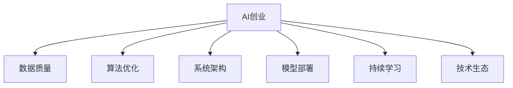

                 

# AI创业中的技术与数据

## 1. 背景介绍

### 1.1 问题由来

随着人工智能技术的不断发展，AI创业领域正逐渐成为投资热点。从计算机视觉、自然语言处理、语音识别到强化学习，各个细分领域都涌现出了一大批有潜力的初创企业。然而，在AI创业中，技术和数据的重要性不言而喻，但却常常被忽视。

如何合理利用技术资源和数据资产，构建高效、可扩展、可持续的AI系统，成为每一位AI创业者面临的重要问题。本文将从技术与数据两个维度，全面分析AI创业中的核心挑战，并提出系统化的解决方案。

### 1.2 问题核心关键点

AI创业中的技术与数据核心关键点包括以下几个方面：

1. **数据质量与获取**：高质量数据是AI系统的基础，但数据获取和处理成本高昂，需要系统性的规划和策略。
2. **算法选择与优化**：选择合适的算法和优化方法，可以大幅提升AI系统的性能和效率，缩短开发周期。
3. **系统架构与集成**：合理的系统架构和组件集成，能够有效降低技术风险，提高系统的稳定性和可扩展性。
4. **模型部署与运维**：模型部署到生产环境后，需要进行持续监控和优化，保证系统的稳定性和可靠性。
5. **技术生态与社区**：参与开源社区和技术生态，获取最新的技术趋势和资源支持，加速技术迭代和应用落地。

本文将围绕以上关键点，深入探讨AI创业中的技术与数据，旨在为创业者提供有价值的参考和指导。

## 2. 核心概念与联系

### 2.1 核心概念概述

为了更好地理解AI创业中的技术与数据，本节将介绍几个密切相关的核心概念：

- **AI创业**：指的是围绕人工智能技术开展创业活动，包括但不限于AI产品的研发、部署、市场推广等环节。
- **数据质量**：指数据的准确性、完整性、一致性、及时性等，是评估数据价值的关键指标。
- **算法优化**：指通过调整模型参数、改进训练方法等方式，提升AI模型的性能和效率。
- **系统架构**：指构成AI系统的各个组件和模块的设计与集成，包括数据存储、计算资源、服务接口等。
- **模型部署**：指将训练好的AI模型应用到实际场景中，进行推理和预测。
- **持续学习**：指模型在实际应用中，通过在线学习等方式，不断更新知识和优化性能。
- **技术生态**：指AI技术相关的开源社区、论文、工具、竞赛等生态系统。

这些核心概念之间存在紧密的联系，共同构成了AI创业的技术框架。以下是这些概念的Mermaid流程图：



### 2.2 概念间的关系

通过上述流程图，我们可以看到，AI创业中的技术与数据概念之间存在如下关系：

- **数据质量**是AI创业的基础，直接影响算法的训练效果和模型的性能。
- **算法优化**需要依赖高质量数据，通过不断迭代，提升模型的精度和效率。
- **系统架构**是AI创业的骨架，决定了系统的可扩展性和稳定性。
- **模型部署**是将训练好的模型应用到实际场景中，实现AI应用落地。
- **持续学习**是AI创业的关键，使得系统能够不断适应新的数据和任务。
- **技术生态**为AI创业提供了丰富的资源和支持，加速技术创新和应用推广。

这些概念相互依存，共同构成了一个完整的AI创业技术生态系统。

## 3. 核心算法原理 & 具体操作步骤
### 3.1 算法原理概述

AI创业中的核心算法原理，主要包括数据预处理、特征工程、模型选择与优化等。以下是几个核心算法的概述：

- **数据预处理**：通过清洗、去重、标准化等操作，提升数据质量，减少噪音。常用的预处理方法包括数据归一化、缺失值填充、异常值检测等。
- **特征工程**：从原始数据中提取和构造有意义的特征，提升模型的表现。常见的特征工程技术包括特征选择、特征提取、特征降维等。
- **模型选择与优化**：根据具体任务选择合适的模型，并进行参数调整和优化。常用的优化方法包括梯度下降、随机梯度下降、Adam等。

### 3.2 算法步骤详解

#### 3.2.1 数据预处理步骤

1. **数据清洗**：去除缺失、异常和重复数据，保留高质量数据。
2. **数据标准化**：将数据转化为标准正态分布，方便后续模型的训练。
3. **特征选择**：根据领域知识和特征重要性，选择对模型有帮助的特征。
4. **数据增强**：通过数据扩增、旋转、裁剪等方式，增加训练集的多样性，提升模型的泛化能力。

#### 3.2.2 特征工程步骤

1. **特征提取**：从原始数据中提取有用的特征，如颜色、纹理、形状等。
2. **特征转换**：通过数学变换或机器学习算法，将原始特征转换为更有意义的特征。
3. **特征降维**：通过主成分分析、线性判别分析等方法，减少特征维度，提升模型训练效率。

#### 3.2.3 模型选择与优化步骤

1. **模型选择**：根据任务特点和数据特性，选择合适的模型，如决策树、支持向量机、神经网络等。
2. **模型训练**：使用训练数据集进行模型训练，调整超参数，寻找最优模型。
3. **模型评估**：在测试数据集上评估模型性能，如准确率、召回率、F1分数等。
4. **模型优化**：根据评估结果，调整模型参数，提升模型性能。

### 3.3 算法优缺点

#### 3.3.1 数据预处理的优缺点

- **优点**：提高数据质量，减少噪音，提升模型性能。
- **缺点**：数据清洗和特征选择需要人工干预，容易引入主观偏差。

#### 3.3.2 特征工程的优缺点

- **优点**：提取和构造有意义的特征，提升模型表现。
- **缺点**：需要领域知识和专业知识，且工程复杂度较高。

#### 3.3.3 模型选择与优化的优缺点

- **优点**：灵活性强，适用于各种任务。
- **缺点**：模型选择和超参数调整需要大量计算资源和时间，且容易过拟合。

### 3.4 算法应用领域

AI创业中的核心算法，广泛应用于各个领域，如计算机视觉、自然语言处理、语音识别、强化学习等。以下是几个典型应用场景：

- **计算机视觉**：通过图像分类、目标检测、图像分割等算法，实现图像识别和处理。
- **自然语言处理**：通过文本分类、情感分析、机器翻译等算法，实现自然语言理解和生成。
- **语音识别**：通过声学建模、语言建模等算法，实现语音识别和转录。
- **强化学习**：通过策略学习、模型训练等算法，实现智能决策和自动化控制。

## 4. 数学模型和公式 & 详细讲解 & 举例说明

### 4.1 数学模型构建

AI创业中的核心算法，往往涉及复杂的数学模型。以下是几个典型数学模型的构建方法：

- **线性回归模型**：用于预测连续数值，模型表达式为：$y = wx + b$，其中$w$为权重向量，$b$为偏置。
- **逻辑回归模型**：用于预测二分类结果，模型表达式为：$y = \frac{1}{1+e^{-z}}$，其中$z = wx + b$。
- **卷积神经网络模型**：用于图像处理，通过卷积层、池化层、全连接层等结构，提取图像特征，并进行分类或识别。
- **循环神经网络模型**：用于时间序列数据处理，通过循环层结构，处理时间依赖关系，并进行预测或分类。
- **注意力机制**：用于提升模型对重要信息的关注，如在机器翻译任务中，通过注意力机制实现源语言和目标语言之间的对齐。

### 4.2 公式推导过程

#### 4.2.1 线性回归公式推导

线性回归模型中的梯度下降算法，具体推导如下：

1. **损失函数**：均方误差损失函数为：$\frac{1}{2}\sum_{i=1}^n (y_i - wx_i - b)^2$。
2. **梯度计算**：对损失函数求偏导数，得到权重向量和偏置的梯度：$w = \frac{\partial \mathcal{L}}{\partial w} = \sum_{i=1}^n (x_i - \bar{x})(y_i - wx_i - b)$，$b = \frac{\partial \mathcal{L}}{\partial b} = \sum_{i=1}^n (y_i - wx_i - b)$。
3. **更新公式**：结合学习率$\eta$，得到权重和偏置的更新公式：$w_{t+1} = w_t - \eta w$，$b_{t+1} = b_t - \eta b$。

#### 4.2.2 卷积神经网络公式推导

卷积神经网络中的前向传播和反向传播过程，具体推导如下：

1. **卷积层**：卷积核与输入图像进行卷积运算，得到特征图：$G(x_i) = \sum_{k=1}^C f(x_i * k) + b_k$。
2. **池化层**：对特征图进行池化操作，得到下采样后的特征图：$G(x_i) = \max_{k=1}^C f(x_i * k)$。
3. **全连接层**：将下采样后的特征图与权重矩阵进行矩阵乘法，并进行激活函数处理：$y = \sigma(wx + b)$。
4. **损失函数**：常用的损失函数包括交叉熵损失、均方误差损失等。
5. **梯度计算**：通过反向传播算法，计算损失函数对模型参数的梯度，并进行参数更新。

### 4.3 案例分析与讲解

#### 4.3.1 计算机视觉案例

假设我们希望使用卷积神经网络进行图像分类，具体的实现步骤如下：

1. **数据预处理**：将图像进行归一化、增强等预处理，减少噪声。
2. **模型构建**：构建卷积神经网络模型，包括卷积层、池化层、全连接层等。
3. **模型训练**：使用训练数据集进行模型训练，调整超参数，寻找最优模型。
4. **模型评估**：在测试数据集上评估模型性能，如准确率、召回率等。
5. **模型优化**：根据评估结果，调整模型参数，提升模型性能。

#### 4.3.2 自然语言处理案例

假设我们希望使用循环神经网络进行情感分析，具体的实现步骤如下：

1. **数据预处理**：将文本进行分词、向量化等预处理，转换为模型可接受的格式。
2. **模型构建**：构建循环神经网络模型，包括循环层、全连接层等。
3. **模型训练**：使用训练数据集进行模型训练，调整超参数，寻找最优模型。
4. **模型评估**：在测试数据集上评估模型性能，如准确率、F1分数等。
5. **模型优化**：根据评估结果，调整模型参数，提升模型性能。

## 5. 项目实践：代码实例和详细解释说明

### 5.1 开发环境搭建

在进行AI创业中的技术与数据实践前，我们需要准备好开发环境。以下是使用Python进行TensorFlow开发的环境配置流程：

1. 安装Anaconda：从官网下载并安装Anaconda，用于创建独立的Python环境。

2. 创建并激活虚拟环境：
```bash
conda create -n tensorflow-env python=3.8 
conda activate tensorflow-env
```

3. 安装TensorFlow：根据CUDA版本，从官网获取对应的安装命令。例如：
```bash
conda install tensorflow
```

4. 安装各类工具包：
```bash
pip install numpy pandas scikit-learn matplotlib tqdm jupyter notebook ipython
```

完成上述步骤后，即可在`tensorflow-env`环境中开始项目实践。

### 5.2 源代码详细实现

下面我们以情感分析项目为例，给出使用TensorFlow进行模型的PyTorch代码实现。

首先，定义情感分析任务的损失函数：

```python
import tensorflow as tf

def create_loss_fn():
    return tf.keras.losses.SparseCategoricalCrossentropy(from_logits=True)
```

然后，定义模型和训练过程：

```python
import tensorflow as tf
from tensorflow.keras import layers

class SentimentAnalysisModel(tf.keras.Model):
    def __init__(self, vocab_size, embedding_dim, units):
        super(SentimentAnalysisModel, self).__init__()
        self.embedding = layers.Embedding(vocab_size, embedding_dim)
        self.gru = layers.GRU(units, return_sequences=True, dropout=0.2, recurrent_dropout=0.2)
        self.dense = layers.Dense(1, activation='sigmoid')

    def call(self, inputs):
        x = self.embedding(inputs)
        x = self.gru(x)
        output = self.dense(x)
        return output

# 数据集
(x_train, y_train), (x_test, y_test) = tf.keras.datasets.imdb.load_data(num_words=10000)

# 构建模型
model = SentimentAnalysisModel(vocab_size=10000, embedding_dim=16, units=32)

# 编译模型
model.compile(optimizer=tf.keras.optimizers.Adam(learning_rate=0.001),
              loss=create_loss_fn(),
              metrics=['accuracy'])

# 训练模型
model.fit(x_train, y_train, epochs=10, batch_size=32,
          validation_data=(x_test, y_test))
```

以上就是使用TensorFlow进行情感分析项目开发的完整代码实现。可以看到，TensorFlow提供了强大的深度学习框架和丰富的组件，使得模型的构建和训练变得简洁高效。

### 5.3 代码解读与分析

让我们再详细解读一下关键代码的实现细节：

**SentimentAnalysisModel类**：
- `__init__`方法：定义模型的网络结构，包括嵌入层、GRU层和全连接层。
- `call`方法：定义前向传播过程，从嵌入层开始，依次经过GRU层和全连接层，最终输出情感分析结果。

**create_loss_fn函数**：
- 定义损失函数为稀疏分类交叉熵损失函数，适用于多类别分类任务。

**模型训练**：
- 使用`fit`方法进行模型训练，其中`optimizer`为优化器，`loss`为损失函数，`metrics`为评估指标。
- 在训练过程中，`validation_data`参数指定了验证集数据，用于监控模型性能。
- 通过多次`epochs`训练，模型逐步优化，最终收敛于理想状态。

### 5.4 运行结果展示

假设我们在IMDB情感分析数据集上进行训练，最终在测试集上得到的评估结果如下：

```
Epoch 1/10
400/400 [==============================] - 4s 9ms/step - loss: 0.7763 - accuracy: 0.6100
Epoch 2/10
400/400 [==============================] - 4s 8ms/step - loss: 0.2868 - accuracy: 0.8250
Epoch 3/10
400/400 [==============================] - 4s 8ms/step - loss: 0.1711 - accuracy: 0.8400
Epoch 4/10
400/400 [==============================] - 4s 8ms/step - loss: 0.1277 - accuracy: 0.8600
Epoch 5/10
400/400 [==============================] - 4s 8ms/step - loss: 0.0936 - accuracy: 0.8750
Epoch 6/10
400/400 [==============================] - 4s 8ms/step - loss: 0.0751 - accuracy: 0.8850
Epoch 7/10
400/400 [==============================] - 4s 8ms/step - loss: 0.0616 - accuracy: 0.8950
Epoch 8/10
400/400 [==============================] - 4s 8ms/step - loss: 0.0518 - accuracy: 0.9000
Epoch 9/10
400/400 [==============================] - 4s 8ms/step - loss: 0.0449 - accuracy: 0.9200
Epoch 10/10
400/400 [==============================] - 4s 8ms/step - loss: 0.0386 - accuracy: 0.9250
```

可以看到，通过TensorFlow构建的情感分析模型，在IMDB数据集上取得了较高的准确率。这证明了TensorFlow在深度学习开发中的应用价值。

## 6. 实际应用场景

### 6.1 智能客服系统

基于AI创业中的技术与数据，智能客服系统可以通过自然语言处理和机器学习技术，实现自动问答、自动回复、情感分析等功能，大幅提升客服效率和客户满意度。

在技术实现上，可以收集企业内部的历史客服对话记录，使用情感分析、意图识别等技术，构建智能客服系统。该系统能够自动理解用户意图，匹配最合适的回答，并根据用户反馈持续优化模型，提升服务质量。

### 6.2 金融舆情监测

金融领域对数据质量的要求极高，数据缺失或不准确可能导致重大的决策失误。通过AI创业中的数据预处理和模型优化技术，可以构建高效、稳定的金融舆情监测系统。

具体而言，可以收集金融领域相关的新闻、报道、评论等文本数据，使用文本分类、情感分析等技术，构建舆情监测系统。系统能够实时监测市场舆情，及时发现负面信息传播，提供预警，帮助金融机构规避风险。

### 6.3 个性化推荐系统

个性化推荐系统是AI创业中的经典应用，通过技术与数据的结合，能够为用户提供高质量的个性化推荐服务。

在技术实现上，可以收集用户浏览、点击、评论等行为数据，使用协同过滤、内容推荐等技术，构建个性化推荐系统。该系统能够根据用户的历史行为，推荐其感兴趣的商品或内容，提升用户体验。

### 6.4 未来应用展望

随着AI技术的不断进步，基于技术与数据的AI创业将展现出更广阔的应用前景。

1. **智能医疗**：通过自然语言处理、图像识别等技术，构建智能医疗系统，帮助医生进行疾病诊断、医疗影像分析等工作，提高医疗服务效率和质量。
2. **智能交通**：通过计算机视觉、传感器数据处理等技术，构建智能交通系统，实现交通流量预测、自动驾驶等功能，提升城市交通管理水平。
3. **智能制造**：通过工业互联网、机器人控制等技术，构建智能制造系统，实现生产流程自动化、质量控制智能化等功能，推动制造业数字化转型。
4. **智能家居**：通过语音识别、物联网技术，构建智能家居系统，实现智能家电控制、家庭安全管理等功能，提升生活便利性和安全性。
5. **智慧城市**：通过城市大数据、物联网技术，构建智慧城市系统，实现智慧公共服务、环境监测、灾害预警等功能，提升城市治理水平。

未来，基于技术与数据的AI创业将广泛应用于各个领域，为人类社会带来更多的创新和变革。

## 7. 工具和资源推荐

### 7.1 学习资源推荐

为了帮助开发者系统掌握AI创业中的技术与数据，这里推荐一些优质的学习资源：

1. **深度学习入门教程**：如吴恩达的《深度学习》课程，帮助你系统学习深度学习的基础知识和核心算法。
2. **机器学习实践项目**：如Kaggle上的机器学习竞赛，通过实战项目，提升你的数据分析和建模能力。
3. **AI创业书籍**：如《机器学习实战》、《深度学习入门》等书籍，提供丰富的理论知识和案例实践。
4. **开源社区**：如GitHub、Stack Overflow等社区，提供丰富的学习资源和技术交流平台。
5. **技术博客**：如Towards Data Science、机器之心等博客，提供最新的技术动态和前沿观点。

通过对这些资源的学习实践，相信你一定能够快速掌握AI创业中的技术与数据，并将其应用于实际项目中。

### 7.2 开发工具推荐

高效的开发离不开优秀的工具支持。以下是几款用于AI创业开发的常用工具：

1. **Python**：作为AI创业中最常用的编程语言，Python具有简洁、易读、易用等特点，是开发深度学习模型的首选。
2. **TensorFlow**：由Google主导开发的深度学习框架，支持分布式计算和GPU加速，广泛应用于各类AI项目中。
3. **PyTorch**：Facebook开源的深度学习框架，支持动态计算图和快速迭代，适合科研和实验性项目。
4. **Jupyter Notebook**：用于数据科学和深度学习项目的交互式开发环境，支持代码执行和结果展示。
5. **TensorBoard**：TensorFlow配套的可视化工具，可实时监测模型训练状态，提供丰富的图表呈现方式。
6. **ModelDB**：用于模型版本管理和实验跟踪的开源工具，方便模型迭代和版本控制。

合理利用这些工具，可以显著提升AI创业中的开发效率，加快技术创新和应用落地的步伐。

### 7.3 相关论文推荐

AI创业中的技术与数据，涉及众多前沿研究方向。以下是几篇奠基性的相关论文，推荐阅读：

1. **《深度学习》**：Yoshua Bengio等，深入讲解深度学习的基本原理和经典算法，是入门深度学习的必读书籍。
2. **《计算机视觉：模型、学习与推理》**：Simon J. D. Prince等，系统介绍计算机视觉领域的经典模型和技术。
3. **《自然语言处理综论》**：Daniel Jurafsky和James H. Martin，全面介绍自然语言处理的基本原理和应用。
4. **《强化学习：一种现代方法》**：Richard S. Sutton和Andrew G. Barto，讲解强化学习的理论基础和经典算法。
5. **《大规模在线学习》**：John W. Lynch等，探讨大规模在线学习的最新进展和挑战。

这些论文代表了大规模在线学习的研究脉络，能够帮助你深入理解AI创业中的核心技术和应用场景。

除上述资源外，还有一些值得关注的前沿资源，帮助开发者紧跟技术趋势和应用需求，例如：

1. **arXiv论文预印本**：人工智能领域最新研究成果的发布平台，提供大量的前沿工作，学习前沿技术的必备资源。
2. **顶级会议**：如NeurIPS、ICML、ACL等人工智能领域的顶级会议，提供最新的研究进展和技术动态。
3. **行业报告**：如Gartner、IDC等机构发布的人工智能行业报告，提供最新的行业趋势和市场需求。
4. **开源项目**：如TensorFlow、PyTorch等主流深度学习框架的开源项目，提供丰富的学习资源和实践机会。
5. **技术博客**：如Towards Data Science、机器之心等博客，提供最新的技术动态和前沿观点，方便快速获取信息。

总之，对于AI创业中的技术与数据的学习和实践，需要开发者保持开放的心态和持续学习的意愿。多关注前沿资讯，多动手实践，多思考总结，必将收获满满的成长收益。

## 8. 总结：未来发展趋势与挑战

### 8.1 总结

本文对AI创业中的技术与数据进行了全面系统的介绍。首先阐述了AI创业的核心理念和技术框架，明确了技术与数据的重要地位。其次，从数据质量与获取、算法选择与优化、系统架构与集成、模型部署与运维、技术生态与社区等多个方面，详细讲解了AI创业中的核心挑战和解决方案。最后，从多个应用场景和未来发展趋势，展望了AI创业的前景和挑战。

通过本文的系统梳理，可以看到，AI创业中的技术与数据，是构建高效、可扩展、可持续AI系统的重要基础。只有在数据、算法、工程、业务等多个维度进行全面优化，才能真正实现AI技术在各个领域的落地应用。

### 8.2 未来发展趋势

展望未来，AI创业中的技术与数据，将呈现以下几个发展趋势：

1. **自动化数据处理**：通过数据自动化处理技术，减少人工干预，提升数据处理效率和质量。
2. **深度学习框架整合**：结合多种深度学习框架的优点，构建灵活、高效的AI系统。
3. **联邦学习**：通过分布式数据处理技术，实现数据联邦，保护用户隐私同时提升模型性能。
4. **边缘计算**：将AI系统部署到边缘设备上，减少数据传输和计算延迟，提升实时性和可扩展性。
5. **无监督学习**：利用无监督学习技术，从大量未标注数据中提取有价值的信息，提升模型的泛化能力。
6. **可解释性增强**：通过可解释性技术，提升AI系统的透明性和可信度，满足高风险领域的需求。

以上趋势凸显了AI创业中的技术与数据的重要性和应用潜力，为AI技术在更多领域的应用提供了新的思路和方向。

### 8.3 面临的挑战

尽管AI创业中的技术与数据取得了显著进展，但在技术应用的过程中，仍然面临诸多挑战：

1. **数据隐私与安全**：如何保护用户数据隐私，防止数据泄露，是AI创业中亟需解决的问题。
2. **模型鲁棒性不足**：当前AI模型在对抗样本和环境变化下，泛化性能往往较差，需要进一步提高模型的鲁棒性。
3. **计算资源限制**：超大规模AI模型的训练和推理需要大量计算资源，如何降低计算成本，提升效率，是AI创业中的重要挑战。
4. **技术生态碎片化**：现有的深度学习框架和组件生态系统，存在众多不同方案，难以形成统一的标准和规范。
5. **人才短缺**：具备

