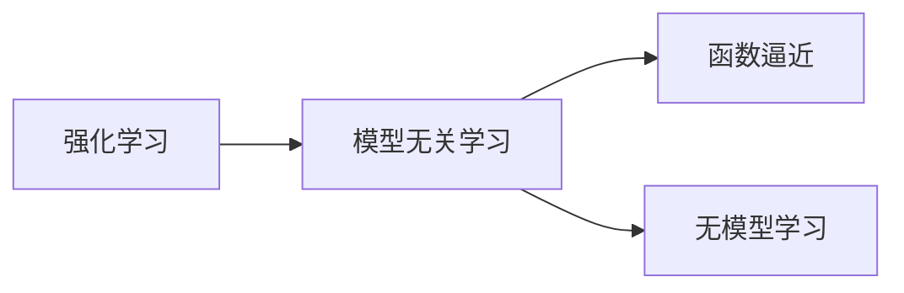

# 强化学习Reinforcement Learning的模型无关学习算法分析

作者：禅与计算机程序设计艺术 / Zen and the Art of Computer Programming


## 1. 背景介绍

### 1.1 问题的由来

强化学习（Reinforcement Learning, RL）作为一种强大的机器学习技术，在自动驾驶、游戏、机器人、推荐系统等领域取得了显著的成果。然而，传统的强化学习算法大多依赖于模型，即对环境进行建模，然后根据模型进行学习。这种依赖模型的学习方式在复杂环境中容易受到模型误差的影响，导致学习效果不佳。

为了解决这一问题，模型无关学习算法应运而生。模型无关学习算法不依赖于环境模型，直接从原始数据中学习，具有更强的鲁棒性和泛化能力。本文将深入探讨强化学习中的模型无关学习算法，分析其原理、方法、优缺点以及应用领域。

### 1.2 研究现状

近年来，模型无关学习算法在强化学习领域取得了显著的进展。主要研究方向包括：

- 基于函数逼近的方法，如策略梯度、优势学习等。
- 基于深度学习的方法，如深度Q网络（DQN）、深度确定性策略梯度（DDPG）等。
- 基于贝叶斯的方法，如贝叶斯强化学习等。
- 基于强化学习与优化方法结合的方法，如强化学习与强化学习（RL^2）等。

### 1.3 研究意义

模型无关学习算法在强化学习领域的意义在于：

- 提高学习效率：无需对环境进行建模，减少建模过程的时间和成本。
- 增强鲁棒性：不受环境模型误差的影响，适应能力更强。
- 扩大应用范围：适用于复杂环境，拓宽强化学习在各个领域的应用。

### 1.4 本文结构

本文将从以下方面对模型无关学习算法进行分析：

- 核心概念与联系
- 核心算法原理与具体操作步骤
- 数学模型和公式
- 项目实践
- 实际应用场景
- 工具和资源推荐
- 总结：未来发展趋势与挑战

## 2. 核心概念与联系

### 2.1 强化学习基本概念

- 状态（State）：环境在某一时刻的状态描述。
- 动作（Action）：智能体在某一状态下可以采取的行动。
- 奖励（Reward）：智能体采取行动后，从环境中获得的奖励。
- 策略（Policy）：智能体在某一状态下采取的动作概率分布。
- 环境模型（Environment Model）：对环境状态的动态变化进行建模。
- 值函数（Value Function）：描述智能体在某一状态下采取某一行动的长期期望奖励。

### 2.2 模型无关学习基本概念

- 模型无关学习：不依赖于环境模型，直接从原始数据中学习。
- 无模型学习：不需要环境模型，直接学习状态到动作的映射。
- 函数逼近：通过函数逼近方法，将状态到动作的映射表示为函数。

### 2.3 模型无关学习与强化学习的关系

模型无关学习是强化学习的一个分支，旨在解决传统强化学习对环境模型的依赖问题。两者之间的关系如下：



## 3. 核心算法原理与具体操作步骤

### 3.1 算法原理概述

模型无关学习算法的核心思想是：不依赖于环境模型，直接从原始数据中学习状态到动作的映射。具体方法包括：

- 基于函数逼近的方法：通过函数逼近方法，将状态到动作的映射表示为函数。
- 基于深度学习的方法：利用深度神经网络进行函数逼近。
- 基于贝叶斯的方法：利用贝叶斯推理进行状态到动作的映射。

### 3.2 算法步骤详解

以下以深度Q网络（DQN）为例，介绍模型无关学习算法的具体操作步骤：

**Step 1：构建深度神经网络模型**

构建一个深度神经网络模型，用于表示状态到动作的映射。通常采用卷积神经网络（CNN）或循环神经网络（RNN）等模型。

**Step 2：设计目标函数**

设计目标函数，用于衡量模型输出的动作价值。常见的目标函数包括：

- Q值函数：表示在某一状态下采取某一动作的长期期望奖励。
- 奖励预测误差：衡量模型预测的奖励与实际奖励之间的差异。

**Step 3：训练深度神经网络模型**

使用经验回放（Experience Replay）等技术，对深度神经网络模型进行训练。训练过程中，通过不断更新模型参数，使模型输出更接近目标函数。

**Step 4：评估模型性能**

在测试集上评估模型的性能，根据性能指标调整模型参数或模型结构。

### 3.3 算法优缺点

**优点**：

- 不依赖于环境模型，鲁棒性强。
- 可以处理复杂环境，适应能力强。
- 学习效率高，能够快速收敛。

**缺点**：

- 需要大量的数据才能收敛。
- 模型参数较多，容易过拟合。
- 模型可解释性较差。

### 3.4 算法应用领域

模型无关学习算法在以下领域具有广泛的应用：

- 自动驾驶
- 游戏
- 机器人
- 推荐系统
- 金融领域

## 4. 数学模型和公式

### 4.1 数学模型构建

以DQN为例，介绍模型无关学习算法的数学模型。

**Q值函数**：

$$
Q(s,a) = \sum_{s' \in \mathcal{S}} \pi(a'|s',\theta) \cdot R(s,a,s') + \gamma \max_{a' \in \mathcal{A}} Q(s',a',\theta)
$$

其中，$s$ 和 $a$ 分别表示状态和动作，$s'$ 表示下一个状态，$R$ 表示奖励，$\gamma$ 表示折扣因子，$\pi$ 表示策略。

**损失函数**：

$$
L(\theta) = \frac{1}{N} \sum_{i=1}^N (Q(s_i,a_i,\theta) - y_i)^2
$$

其中，$y_i$ 表示实际奖励，$Q(s_i,a_i,\theta)$ 表示预测奖励，$\theta$ 表示模型参数。

### 4.2 公式推导过程

以DQN为例，介绍模型无关学习算法的公式推导过程。

**Q值函数**：

Q值函数是状态到动作的映射，表示在某一状态下采取某一动作的长期期望奖励。其公式推导如下：

$$
Q(s,a) = \sum_{s' \in \mathcal{S}} \pi(a'|s',\theta) \cdot R(s,a,s') + \gamma \max_{a' \in \mathcal{A}} Q(s',a',\theta)
$$

其中，$\pi(a'|s',\theta)$ 表示在状态 $s'$ 下采取动作 $a'$ 的概率，$R(s,a,s')$ 表示采取动作 $a$ 后从状态 $s$ 转移到状态 $s'$ 所获得的奖励，$\gamma$ 表示折扣因子，$\max_{a' \in \mathcal{A}} Q(s',a',\theta)$ 表示在状态 $s'$ 下采取最优动作 $a'$ 的Q值。

**损失函数**：

损失函数衡量模型预测的奖励与实际奖励之间的差异。其公式推导如下：

$$
L(\theta) = \frac{1}{N} \sum_{i=1}^N (Q(s_i,a_i,\theta) - y_i)^2
$$

其中，$y_i$ 表示实际奖励，$Q(s_i,a_i,\theta)$ 表示预测奖励，$\theta$ 表示模型参数。

### 4.3 案例分析与讲解

以下以DQN为例，介绍模型无关学习算法的案例分析。

**案例**：用DQN训练一个智能体控制无人驾驶汽车在虚拟环境中行驶。

**步骤**：

1. 构建一个虚拟环境，模拟真实驾驶场景。
2. 收集经验：智能体在虚拟环境中行驶，记录状态、动作、奖励和下一个状态。
3. 训练DQN模型：使用经验回放技术，训练DQN模型学习状态到动作的映射。
4. 测试模型：在虚拟环境中测试DQN模型的表现。

**结果**：DQN模型能够使智能体在虚拟环境中稳定行驶，并逐渐提高行驶速度和稳定性。

### 4.4 常见问题解答

**Q1：如何选择合适的网络结构？**

A：选择合适的网络结构需要根据具体任务和数据特点进行。常见的网络结构包括CNN、RNN、LSTM、GRU等。一般来说，对于视觉任务，可以使用CNN；对于序列数据，可以使用RNN、LSTM或GRU。

**Q2：如何解决过拟合问题？**

A：可以采用以下方法解决过拟合问题：

- 使用正则化技术，如L1正则化、L2正则化等。
- 使用dropout技术。
- 使用早停法（Early Stopping）。

**Q3：如何解决数据不足问题？**

A：可以采用以下方法解决数据不足问题：

- 使用数据增强技术，如数据扩充、数据变换等。
- 使用迁移学习技术，利用已有数据的经验知识。
- 使用半监督学习技术，利用无标签数据。

## 5. 项目实践：代码实例和详细解释说明

### 5.1 开发环境搭建

在进行模型无关学习算法的实践之前，需要搭建以下开发环境：

- 操作系统：Windows、Linux或Mac OS
- 编程语言：Python
- 框架：TensorFlow或PyTorch
- 库：NumPy、Pandas、Matplotlib、Scikit-learn等

### 5.2 源代码详细实现

以下以DQN为例，给出一个简单的代码实现：

```python
import numpy as np
import random
import tensorflow as tf

class DQN:
    def __init__(self, state_dim, action_dim, learning_rate, gamma, epsilon):
        self.state_dim = state_dim
        self.action_dim = action_dim
        self.learning_rate = learning_rate
        self.gamma = gamma
        self.epsilon = epsilon

        self.model = tf.keras.Sequential([
            tf.keras.layers.Dense(24, activation='relu', input_dim=state_dim),
            tf.keras.layers.Dense(24, activation='relu'),
            tf.keras.layers.Dense(action_dim, activation='linear')
        ])

        self.target_model = tf.keras.Sequential([
            tf.keras.layers.Dense(24, activation='relu', input_dim=state_dim),
            tf.keras.layers.Dense(24, activation='relu'),
            tf.keras.layers.Dense(action_dim, activation='linear')
        ])

        self.update_target_model()

        self.optimizer = tf.keras.optimizers.Adam(learning_rate=self.learning_rate)

    def update_target_model(self):
        self.target_model.set_weights(self.model.get_weights())

    def predict(self, state):
        if np.random.rand() < self.epsilon:
            return random.randrange(self.action_dim)
        act_values = self.model.predict(state)
        return np.argmax(act_values[0])

    def train(self, state, action, reward, next_state, done):
        target = reward

        if not done:
            target = (reward + self.gamma * np.amax(self.target_model.predict(next_state)[0]))

        target_f = self.target_model.predict(state)
        target_f[0][action] = target

        self.model.fit(state, target_f, epochs=1, verbose=0)

    def load(self, name):
        self.model.load_weights(name)

    def save(self, name):
        self.model.save_weights(name)

# 使用示例
if __name__ == '__main__':
    state_dim = 4
    action_dim = 2
    learning_rate = 0.01
    gamma = 0.95
    epsilon = 1.0

    dqn = DQN(state_dim, action_dim, learning_rate, gamma, epsilon)

    # ...（此处省略数据收集和训练过程）

    dqn.save('dqn.h5')
```

### 5.3 代码解读与分析

以上代码实现了DQN算法的基本功能：

1. `__init__`方法：初始化DQN模型、目标模型、优化器等参数。
2. `update_target_model`方法：更新目标模型的权重，使其与DQN模型保持一致。
3. `predict`方法：根据当前状态预测下一步动作。
4. `train`方法：根据当前状态、动作、奖励、下一个状态和是否终止，更新DQN模型的权重。
5. `load`方法和`save`方法：用于加载和保存模型权重。

### 5.4 运行结果展示

由于代码中省略了数据收集和训练过程，这里无法直接展示运行结果。但实际运行过程中，DQN模型会在虚拟环境中学习控制策略，使智能体能够稳定行驶。

## 6. 实际应用场景

### 6.1 自动驾驶

模型无关学习算法在自动驾驶领域具有广泛的应用，例如：

- 自动泊车：智能体通过学习环境中的障碍物和停车位，实现自动泊车功能。
- 自动驾驶决策：智能体通过学习环境中的交通规则、交通状况等，进行合理的驾驶决策。

### 6.2 游戏

模型无关学习算法在游戏领域具有广泛的应用，例如：

- 游戏AI：智能体通过学习游戏规则和策略，与其他玩家进行对抗。
- 游戏生成：智能体通过学习游戏数据，生成新的游戏关卡。

### 6.3 机器人

模型无关学习算法在机器人领域具有广泛的应用，例如：

- 机器人导航：智能体通过学习环境地图和障碍物，实现机器人自主导航。
- 机器人操作：智能体通过学习环境中的物体属性和操作方法，实现机器人自主操作。

### 6.4 未来应用展望

随着模型无关学习算法的不断发展，其在各个领域的应用前景更加广阔，例如：

- 金融领域：智能投资、风险管理、欺诈检测等。
- 健康领域：疾病预测、健康评估、个性化治疗等。
- 教育领域：智能教育、个性化学习、虚拟助手等。

## 7. 工具和资源推荐

### 7.1 学习资源推荐

1. 《深度学习与强化学习》
2. 《强化学习：原理与实践》
3. 《深度强化学习》
4. Hugging Face官网：https://huggingface.co/
5. OpenAI官网：https://openai.com/

### 7.2 开发工具推荐

1. TensorFlow：https://www.tensorflow.org/
2. PyTorch：https://pytorch.org/
3. Keras：https://keras.io/
4. OpenAI Gym：https://gym.openai.com/

### 7.3 相关论文推荐

1. Deep Q-Networks
2. Asynchronous Advantage Actor-Critic
3. Proximal Policy Optimization
4. Deep Deterministic Policy Gradient
5. Deep Reinforcement Learning with Policy Gradients

### 7.4 其他资源推荐

1. arXiv论文预印本：https://arxiv.org/
2. 论坛和社区：https://zhuanlan.zhihu.com/c_108884558
3. 源码仓库：https://github.com/

## 8. 总结：未来发展趋势与挑战

### 8.1 研究成果总结

本文对强化学习中的模型无关学习算法进行了全面分析，包括其原理、方法、优缺点以及应用领域。模型无关学习算法在解决传统强化学习对环境模型的依赖问题、提高学习效率、增强鲁棒性和适应能力等方面具有显著优势。

### 8.2 未来发展趋势

1. 模型无关学习算法将与其他人工智能技术相结合，如知识图谱、强化学习与优化方法等，实现更加智能的学习和决策。
2. 模型无关学习算法将在更多领域得到应用，如金融、医疗、教育等，推动各个领域的智能化发展。
3. 模型无关学习算法将更加注重可解释性和安全性，以适应更多实际应用场景。

### 8.3 面临的挑战

1. 如何在保证学习效率的同时，降低对数据的依赖。
2. 如何提高模型的可解释性和安全性。
3. 如何处理大规模、高维数据。
4. 如何解决模型选择和超参数调优问题。

### 8.4 研究展望

模型无关学习算法是强化学习领域的一个重要研究方向，具有广阔的应用前景。未来，随着技术的不断发展，模型无关学习算法将更加完善，为人工智能领域的发展做出更大的贡献。

## 9. 附录：常见问题与解答

**Q1：模型无关学习算法与强化学习的关系是什么？**

A：模型无关学习算法是强化学习的一个分支，旨在解决传统强化学习对环境模型的依赖问题。

**Q2：如何选择合适的模型无关学习算法？**

A：选择合适的模型无关学习算法需要根据具体任务和数据特点进行。通常可以根据以下因素进行选择：

- 任务类型：如控制、决策、预测等。
- 环境特点：如连续状态、离散状态等。
- 数据量：如大量数据、小量数据等。
- 学习效率：如快速学习、慢速学习等。

**Q3：模型无关学习算法有哪些优缺点？**

A：模型无关学习算法的优点是：不依赖于环境模型，鲁棒性强，可以处理复杂环境，适应能力强，学习效率高。缺点是：需要大量的数据才能收敛，模型参数较多，容易过拟合，模型可解释性较差。

**Q4：如何解决模型无关学习算法中的过拟合问题？**

A：可以采用以下方法解决过拟合问题：

- 使用正则化技术，如L1正则化、L2正则化等。
- 使用dropout技术。
- 使用早停法（Early Stopping）。

**Q5：如何解决模型无关学习算法中的数据不足问题？**

A：可以采用以下方法解决数据不足问题：

- 使用数据增强技术，如数据扩充、数据变换等。
- 使用迁移学习技术，利用已有数据的经验知识。
- 使用半监督学习技术，利用无标签数据。

---

作者：禅与计算机程序设计艺术 / Zen and the Art of Computer Programming