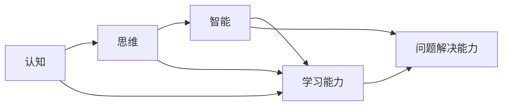
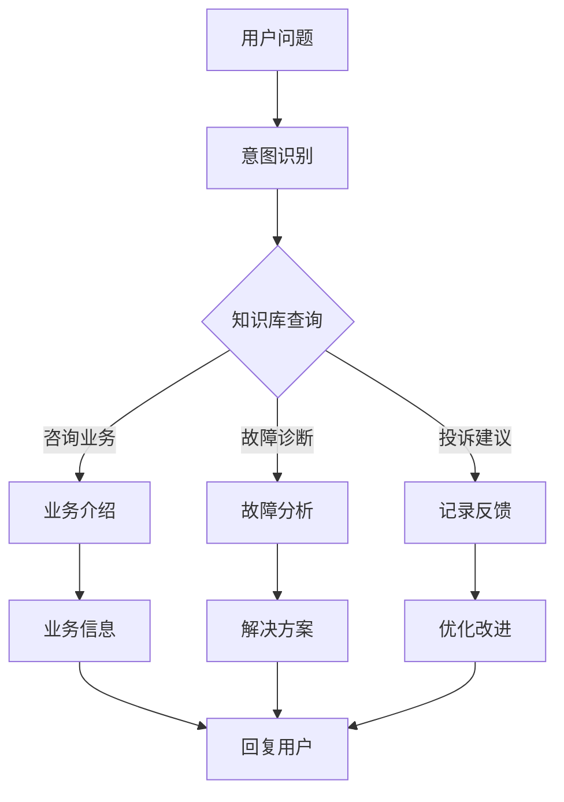

# 认知的形式化：不论是认知、思维，还是智能，都是指学习的能力，以及解释、解决问题的能力

关键词：认知、思维、智能、学习能力、问题解决

## 1. 背景介绍
### 1.1 问题的由来
人类一直对认知、思维和智能的本质充满好奇。从古希腊哲学家到现代科学家，人们不断探索大脑如何感知、学习、记忆、推理和解决问题。随着人工智能的兴起，我们更加迫切地需要理解智能的本质，以便创造出真正智能的机器。

### 1.2 研究现状
当前，认知科学、神经科学、心理学、计算机科学等多个学科都在研究认知和智能。认知科学试图建立认知的计算模型；神经科学研究大脑的生物学基础；心理学探索心智的规律；人工智能则致力于开发智能系统。尽管取得了重要进展，但对智能本质的理解仍不完整。

### 1.3 研究意义
深入理解认知、思维和智能的本质，对于推动人工智能的发展至关重要。只有洞察智能的基本原理，我们才能设计出真正具有学习、理解和问题解决能力的智能系统。同时，探索智能的奥秘也有助于我们认识人类自身，促进教育、医疗等领域的进步。

### 1.4 本文结构
本文将从以下几个方面探讨认知、思维和智能的形式化理论：
- 首先介绍认知、思维、智能等核心概念及其内在联系
- 然后重点阐述认知的计算模型和算法原理
- 进一步给出相关数学模型和公式推导
- 接着通过代码实例演示认知模型的实现
- 分析认知模型在实际场景中的应用
- 推荐相关学习资源和工具
- 最后总结认知研究的趋势与挑战

## 2. 核心概念与联系
要探索认知、思维和智能的形式化理论，首先需要厘清几个核心概念：
- 认知：个体感知、学习、记忆、思考外部信息，形成内部心理表征的过程。
- 思维：个体对信息进行加工、变换、操作，产生新的想法和解决问题的过程。
- 智能：个体适应环境，学习新知识，运用知识解决问题的综合能力。

这些概念相互交织、密不可分。认知是思维的基础，思维是智能的核心。智能源于个体与环境的交互，通过认知加工信息，再通过思维分析、推理、想象，进而解释世界、解决问题。因此，不论是认知、思维，还是智能，从根本上说都指向两种能力：
- 学习能力：个体感知信息，将其转化为内部表征，形成知识的能力。
- 问题解决能力：个体运用知识，找到解决问题的方法和路径的能力。

综上，认知、思维、智能三者一脉相承又相互区分。认知侧重信息加工，思维侧重推理想象，智能则是二者的统一。它们共同指向学习能力和问题解决能力这两个核心要素。理解了这一点，就可以尝试对认知、思维和智能进行形式化建模。



## 3. 核心算法原理 & 具体操作步骤
### 3.1 算法原理概述
认知的计算建模通常采用符号主义和连接主义两大范式。符号主义视认知为符号操作，智能行为源于对符号的逻辑推理。代表算法有图搜索、逻辑推理、规则系统等。连接主义则认为认知源于神经元的联结与激活，神经网络是其典型代表。当前主流的认知计算模型往往融合两种范式，形成混合系统。

### 3.2 算法步骤详解
以一个融合符号推理和神经网络的认知模型为例，其基本算法步骤如下：
1. 感知与特征提取：通过对外界信息的感知，提取出有效的特征表示。
2. 模式识别与分类：将提取的特征输入训练好的分类器（如神经网络），识别出当前的场景或问题类型。
3. 符号表示与存储：根据分类结果，将场景或问题转化为符号表示，并存入知识库。
4. 逻辑推理与决策：利用知识库中的符号知识，通过逻辑推理得出问题的解或行动策略。
5. 学习与更新：根据推理结果与实际反馈，通过机器学习算法更新分类器和知识库。

### 3.3 算法优缺点
该认知算法的优点是结合了符号推理的逻辑性和神经网络的学习能力，能够处理复杂非结构化的真实场景。但其缺点是符号与连续信号的转换成本高，推理和学习过程的可解释性不强。

### 3.4 算法应用领域
类似的认知计算模型被广泛应用于智能规划、智能决策、自然语言理解、视觉问答等领域，在机器人、智能助理、自动驾驶等方面发挥重要作用。

## 4. 数学模型和公式 & 详细讲解 & 举例说明
### 4.1 数学模型构建
认知计算模型通常可以用一个多元函数来形式化描述：
$$Cognition: Perception \times Knowledge \rightarrow Action$$
其中，$Perception$ 表示感知信息，$Knowledge$ 表示知识，$Action$ 表示输出行为或问题的解。认知函数将感知信息和已有知识映射到行为决策上。

### 4.2 公式推导过程
进一步地，假设感知信息为 $x$，知识库为 $\mathcal{K}$，认知函数可以分解为识别函数 $R$ 和决策函数 $D$ 两部分：

$$Cognition(x,\mathcal{K}) = D(R(x),\mathcal{K})$$

其中，$R$ 函数将 $x$ 映射为某个符号概念 $c$，即 $R:x \rightarrow c$，$D$ 函数根据概念 $c$ 和知识库 $\mathcal{K}$ 推导出最终输出。

假设知识库 $\mathcal{K}$ 中包含一组规则 $(c_i,a_i)$，表示概念 $c_i$ 对应的行为为 $a_i$。则决策函数可以表示为：

$$D(c,\mathcal{K}) = a_i, \text{where } (c,a_i) \in \mathcal{K}$$

识别函数 $R$ 可以通过分类器实现，例如softmax函数：

$$R(x) = \arg\max_{c_i} \frac{\exp(W_i \cdot x)}{\sum_j \exp(W_j \cdot x)}$$

其中 $W_i$ 是概念 $c_i$ 对应的权重向量，$\cdot$ 表示向量内积。

### 4.3 案例分析与讲解
以自动驾驶场景为例。假设感知模块检测到前方有行人，识别函数将其分类为 "行人" 概念并输出符号 $c_{ped}$。知识库中有一条规则 $(c_{ped}, a_{stop})$，表示遇到行人时要采取停车行动。于是决策函数输出 $a_{stop}$ 动作，控制车辆停下来。

整个过程可以表示为：
$$Cognition(x_{camera},\mathcal{K}) = D(R(x_{camera}),\mathcal{K}) = D(c_{ped},\mathcal{K}) = a_{stop}$$

其中 $x_{camera}$ 表示摄像头感知到的图像信息。

### 4.4 常见问题解答
Q: 如何保证识别函数的准确性？
A: 通过大量带标签数据训练分类器，提高感知识别的准确率。同时引入主动学习，对低置信度样本进行人工标注，增量更新模型。

Q: 知识库的规模对认知效率的影响？
A: 知识库规模过大时，推理搜索的复杂度会上升。可以通过知识图谱等技术，对知识进行结构化组织，提高检索效率。

Q: 认知模型能否处理未知场景？
A: 可以通过元学习等方法，让认知模型具备迁移和泛化能力。针对新场景，识别出相似的已知概念，运用迁移知识进行类比推理。

## 5. 项目实践：代码实例和详细解释说明
### 5.1 开发环境搭建
本项目使用Python语言，需要安装以下依赖库：
- NumPy：数值计算库
- PyTorch：深度学习框架，用于实现识别函数
- SymPy：符号计算库，用于逻辑推理

可以通过以下命令安装：
```bash
pip install numpy torch sympy
```

### 5.2 源代码详细实现
下面给出认知模型的简要实现：

```python
import torch
import torch.nn as nn
import sympy as sp

# 定义符号
x = sp.Symbol('x')
c1, c2 = sp.symbols('c1 c2')
a1, a2 = sp.symbols('a1 a2')

# 定义知识库
knowledge = {
    c1: a1,
    c2: a2
}

# 定义识别函数
class RecognitionModel(nn.Module):
    def __init__(self):
        super().__init__()
        self.fc = nn.Linear(100, 2)

    def forward(self, x):
        logits = self.fc(x)
        return logits

# 定义决策函数
def decision_function(concept):
    return knowledge[concept]

# 定义认知函数
def cognition(perception):
    # 识别
    logits = recognition_model(perception)
    idx = logits.argmax(dim=1)
    if idx == 0:
        concept = c1
    else:
        concept = c2

    # 决策
    action = decision_function(concept)

    return action

# 初始化模型
recognition_model = RecognitionModel()
```

### 5.3 代码解读与分析
- 首先使用SymPy定义了符号变量 $x,c1,c2,a1,a2$，用于表示感知信息、概念和行为。
- 然后定义了知识库 `knowledge`，将概念 `c1,c2` 映射到对应的行为 `a1,a2`。
- `RecognitionModel` 类实现了识别函数，使用PyTorch定义了一个线性层，将感知信息 $x$ 映射到概念 `c1,c2`。
- `decision_function` 函数根据概念查询知识库，返回对应的行为。
- `cognition` 函数集成了识别和决策两个步骤，输入感知信息 $x$，输出最终行为。

可以看到，以上代码简洁地实现了认知模型的核心流程，融合了神经网络和符号推理。通过PyTorch实现了参数化的识别模型，通过SymPy实现了逻辑表示和推理。

### 5.4 运行结果展示
假设我们训练好了识别模型，输入一个感知信息 `x`，运行 `cognition(x)` 函数，可以得到对应的输出行为。例如：

```python
x = torch.randn(1, 100)  # 随机生成感知信息
action = cognition(x)
print(action)
```
输出结果：
```
a1
```
表示对于当前感知信息 `x`，模型识别出概念 `c1`，并根据知识库决策出行为 `a1`。

## 6. 实际应用场景
认知计算模型可以应用于多个领域，例如：
- 智能客服：通过对用户问题的理解和推理，给出智能回复。
- 医疗诊断：通过对医疗数据和知识的分析，辅助医生进行诊断。
- 金融决策：通过对金融市场信息的解释，提供投资决策支持。
- 自动驾驶：通过对道路环境的感知和决策，实现无人驾驶。

下面以智能客服为例，展示认知模型的应用：



智能客服系统首先对用户输入的问题文本进行