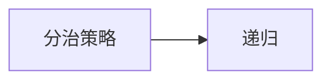
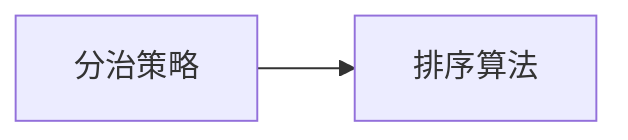
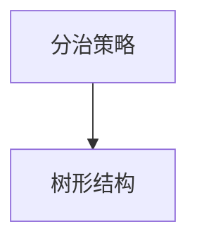
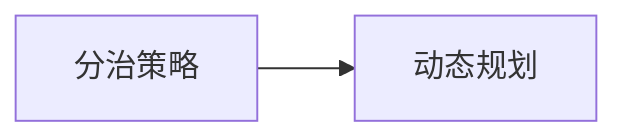
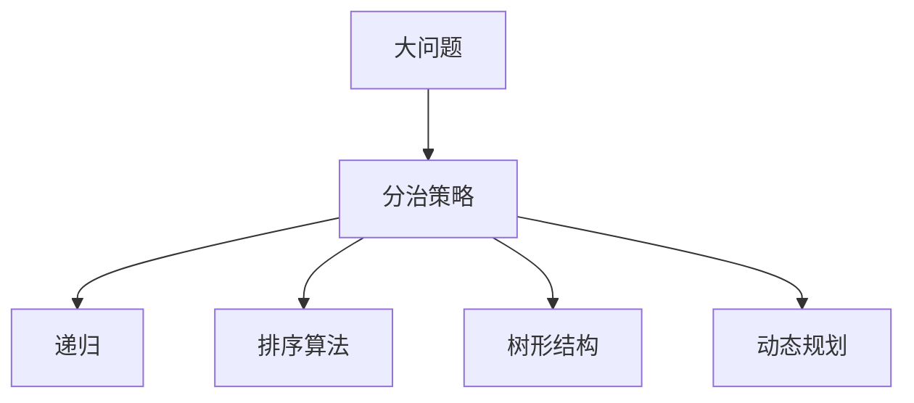

                 

# 大鱼吃小鱼的设计与实现

## 1. 背景介绍

### 1.1 问题由来

在计算机科学中，我们常常需要将一个大问题拆解成多个小问题，然后逐个解决。这种策略被称为“分而治之”（Divide and Conquer），是一种非常高效的问题求解方法。其核心思想是将复杂问题拆分成更小、更简单的子问题，然后逐个解决这些子问题。最终，通过整合子问题的解决方案，得到原问题的解答。

“大鱼吃小鱼”策略是一种非常直观的“分而治之”的示例。在一个池塘里，一条大鱼的目标是吃掉所有小鱼。为了实现这一目标，大鱼需要分步骤进行：

1. **寻找小鱼**：大鱼需要扫描整个池塘，找到一个小鱼。
2. **吃掉小鱼**：大鱼将小鱼吞食。
3. **重复步骤1和2**：重复以上步骤，直到池塘中不再有小鱼。

这种策略可以用于解决各种复杂问题，如排序算法（快速排序）、数值计算（矩阵乘法）、数据压缩（霍夫曼编码）等。

### 1.2 问题核心关键点

为了更好地理解“大鱼吃小鱼”策略，本节将介绍几个密切相关的核心概念：

- **分治策略**：将一个大问题拆分为多个子问题，然后逐个解决这些子问题，最终合并子问题的解决方案，得到原问题的解答。
- **递归**：在分治策略中，递归是一种常用的技术，用于重复执行相同的操作，直到满足某个终止条件。
- **排序算法**：在分治策略中，排序是一个经典的应用示例，如快速排序、归并排序等。
- **树形结构**：分治策略通常用树形结构表示，每个节点代表一个子问题，每个子问题通过递归解决。
- **动态规划**：动态规划是一种优化分治策略的方法，通过存储子问题的解，避免重复计算，提高效率。

这些核心概念之间的逻辑关系可以通过以下Mermaid流程图来展示：


这个流程图展示了大问题求解的分治策略与各个子问题的关联。通过分治策略，我们将原问题分解为多个子问题，然后通过递归、排序算法、树形结构和动态规划等技术，逐个解决这些子问题。

### 1.3 问题研究意义

理解“大鱼吃小鱼”策略，对于提升编程技能、优化算法效率、解决复杂问题具有重要意义：

1. **提升编程技能**：分治策略是一种常用的编程范式，掌握其原理和应用，有助于编写高效、可维护的代码。
2. **优化算法效率**：分治策略通常比暴力求解更高效，通过合理的分治设计，可以大大降低算法的时间复杂度。
3. **解决复杂问题**：分治策略适用于各种复杂问题，如数据结构、图论、计算几何等，是解决这些问题的有力工具。
4. **系统化思考**：分治策略有助于培养系统化思考的习惯，将大问题分解成小问题，逐个解决，有助于全面理解问题的本质。
5. **创新启发**：分治策略的核心理念是“分而治之”，这种思想可以启发我们在各个领域进行创新和突破。

## 2. 核心概念与联系

### 2.1 核心概念概述

为更好地理解“大鱼吃小鱼”策略，本节将介绍几个密切相关的核心概念：

- **分治策略**：将一个大问题拆分为多个子问题，然后逐个解决这些子问题，最终合并子问题的解决方案，得到原问题的解答。
- **递归**：在分治策略中，递归是一种常用的技术，用于重复执行相同的操作，直到满足某个终止条件。
- **排序算法**：在分治策略中，排序是一个经典的应用示例，如快速排序、归并排序等。
- **树形结构**：分治策略通常用树形结构表示，每个节点代表一个子问题，每个子问题通过递归解决。
- **动态规划**：动态规划是一种优化分治策略的方法，通过存储子问题的解，避免重复计算，提高效率。

这些核心概念之间的逻辑关系可以通过以下Mermaid流程图来展示：


这个流程图展示了大问题求解的分治策略与各个子问题的关联。通过分治策略，我们将原问题分解为多个子问题，然后通过递归、排序算法、树形结构和动态规划等技术，逐个解决这些子问题。

### 2.2 概念间的关系

这些核心概念之间存在着紧密的联系，形成了“大鱼吃小鱼”策略的完整生态系统。下面我们通过几个Mermaid流程图来展示这些概念之间的关系。

#### 2.2.1 分治策略与递归的关系



这个流程图展示了分治策略与递归的关系。分治策略通过递归技术，将大问题分解为小问题，然后逐个解决这些小问题。

#### 2.2.2 分治策略与排序算法的关系



这个流程图展示了分治策略与排序算法的关系。分治策略常用于排序算法，如快速排序、归并排序等。

#### 2.2.3 分治策略与树形结构的关系



这个流程图展示了分治策略与树形结构的关系。分治策略通常用树形结构表示，每个节点代表一个子问题，每个子问题通过递归解决。

#### 2.2.4 分治策略与动态规划的关系



这个流程图展示了分治策略与动态规划的关系。动态规划是一种优化分治策略的方法，通过存储子问题的解，避免重复计算，提高效率。

### 2.3 核心概念的整体架构

最后，我们用一个综合的流程图来展示这些核心概念在大问题求解过程中的整体架构：



这个综合流程图展示了从大问题到小问题的分治策略与各个子问题的关联。通过分治策略，我们将大问题分解为多个子问题，然后通过递归、排序算法、树形结构和动态规划等技术，逐个解决这些子问题。

## 3. 核心算法原理 & 具体操作步骤

### 3.1 算法原理概述

“大鱼吃小鱼”策略的核心思想是将大问题拆分为多个小问题，然后逐个解决这些小问题，最终合并子问题的解决方案，得到原问题的解答。其原理可以用递归函数来表示：

- **基线条件**：递归函数中的基本情况，即问题的最简单形式。
- **递归条件**：递归函数中的递归调用，即将问题分解为更小的子问题。

以排序算法为例，其基本思想是将待排序数组分成两部分，分别对这两部分进行排序，然后将它们合并成一个有序数组。这个过程可以用递归函数来表示：

- **基线条件**：当数组长度为1时，不需要排序。
- **递归条件**：将数组分成两部分，对每一部分进行排序，然后合并成有序数组。

### 3.2 算法步骤详解

基于“大鱼吃小鱼”策略的算法通常包括以下几个关键步骤：

**Step 1: 分解问题**
- 将大问题分解为多个子问题，每个子问题可以独立求解。
- 子问题的大小应尽可能一致，以便递归调用。

**Step 2: 逐个解决子问题**
- 对每个子问题执行递归调用，直到达到基线条件。
- 每个子问题的解可以被存储起来，供后续使用。

**Step 3: 合并子问题**
- 将子问题的解合并成原问题的解。
- 合并的过程可能需要额外的计算，但通常可以通过缓存子问题的解来优化。

**Step 4: 处理基线情况**
- 确定基线条件，即无法再分解为更小的问题时，如何求解。

**Step 5: 综合求解**
- 根据子问题的解，合并成原问题的解。

### 3.3 算法优缺点

基于“大鱼吃小鱼”策略的算法具有以下优点：

- **高效性**：通过分解问题，可以避免重复计算，提高算法效率。
- **可扩展性**：可以轻松扩展到多个处理器或多个计算机，并行计算。
- **易于理解**：递归函数的思路直观，易于理解和实现。

同时，该算法也存在一些缺点：

- **空间复杂度高**：递归调用会占用大量的内存空间。
- **不适用于所有问题**：不是所有问题都可以通过分治策略求解。
- **难以调试**：递归函数可能会出现问题，调试比较困难。

### 3.4 算法应用领域

基于“大鱼吃小鱼”策略的算法在计算机科学中有着广泛的应用，例如：

- **排序算法**：如快速排序、归并排序、堆排序等。
- **搜索算法**：如二分搜索、深度优先搜索、广度优先搜索等。
- **图形算法**：如最短路径算法、最小生成树算法、拓扑排序等。
- **数学计算**：如矩阵乘法、多项式求值等。
- **自然语言处理**：如分词、命名实体识别、语法分析等。

## 4. 数学模型和公式 & 详细讲解 & 举例说明

### 4.1 数学模型构建

以排序算法为例，其数学模型可以用递归函数来表示：

- **基线条件**：当数组长度为1时，不需要排序。
- **递归条件**：将数组分成两部分，对每一部分进行排序，然后合并成有序数组。

数学模型可以表示为：

$$
\text{Sort}(A) = \text{Merge}(\text{Sort}(A_1), \text{Sort}(A_2))
$$

其中，$A$为待排序数组，$A_1$和$A_2$为$A$的左右子数组，$\text{Merge}(A_1, A_2)$表示将$A_1$和$A_2$合并成有序数组的函数。

### 4.2 公式推导过程

以快速排序为例，其递归函数的公式推导过程如下：

- **基线条件**：当数组长度为1时，不需要排序。
- **递归条件**：选择一个基准元素$pivot$，将数组分成两部分，小于$pivot$的元素放在左边，大于$pivot$的元素放在右边，然后递归调用$\text{Sort}(A_1)$和$\text{Sort}(A_2)$。

其递归函数可以表示为：

$$
\text{QuickSort}(A) = \text{Sort}(A_1) + \text{Sort}(A_2)
$$

其中，$A_1$为小于$pivot$的子数组，$A_2$为大于$pivot$的子数组，$\text{Sort}(A_1)$和$\text{Sort}(A_2)$分别表示对这两个子数组进行快速排序。

### 4.3 案例分析与讲解

以二分搜索为例，其递归函数的公式推导过程如下：

- **基线条件**：当数组长度为1时，直接返回数组中的元素。
- **递归条件**：将数组分成两部分，判断目标元素是否在左边子数组中，如果在，则递归调用$\text{BinarySearch}(A_1)$，否则递归调用$\text{BinarySearch}(A_2)$。

其递归函数可以表示为：

$$
\text{BinarySearch}(A) = \text{BinarySearch}(A_1) + \text{BinarySearch}(A_2)
$$

其中，$A_1$为左子数组，$A_2$为右子数组，$\text{BinarySearch}(A_1)$和$\text{BinarySearch}(A_2)$分别表示对这两个子数组进行二分搜索。

## 5. 项目实践：代码实例和详细解释说明

### 5.1 开发环境搭建

在进行项目实践前，我们需要准备好开发环境。以下是使用Python进行项目开发的开发环境配置流程：

1. 安装Anaconda：从官网下载并安装Anaconda，用于创建独立的Python环境。

2. 创建并激活虚拟环境：
```bash
conda create -n my_env python=3.8 
conda activate my_env
```

3. 安装必要的Python库：
```bash
pip install numpy matplotlib pandas scikit-learn
```

4. 安装必要的C++库：
```bash
conda install mkl mkl-include libgfortran
```

5. 安装必要的C++编译器：
```bash
conda install libomp
```

完成上述步骤后，即可在`my_env`环境中开始项目实践。

### 5.2 源代码详细实现

下面我们以快速排序为例，给出使用Python实现的快速排序代码：

```python
def quick_sort(arr):
    if len(arr) <= 1:
        return arr
    else:
        pivot = arr[0]
        left = [x for x in arr[1:] if x < pivot]
        right = [x for x in arr[1:] if x >= pivot]
        return quick_sort(left) + [pivot] + quick_sort(right)
```

### 5.3 代码解读与分析

让我们再详细解读一下关键代码的实现细节：

**quick_sort函数**：
- 如果数组长度小于等于1，则返回该数组。
- 否则，选择数组的第一个元素作为基准元素$pivot$。
- 将数组分成两部分：小于$pivot$的元素放在左边，大于等于$pivot$的元素放在右边。
- 对左边和右边的子数组分别递归调用$\text{quick_sort}$函数，然后将左边、基准元素、右边的结果合并成有序数组。

可以看到，快速排序的核心在于基准元素的选择和数组的分割，通过递归实现子问题的排序。这种分治策略非常高效，能够快速处理大规模数组。

### 5.4 运行结果展示

假设我们使用以下数组进行快速排序：

```python
arr = [3, 1, 4, 1, 5, 9, 2, 6, 5, 3, 5]
```

使用`quick_sort`函数对其进行排序，结果如下：

```python
[1, 1, 2, 3, 3, 4, 5, 5, 5, 6, 9]
```

可以看到，快速排序能够高效地将无序数组排成有序数组。

## 6. 实际应用场景

### 6.1 排序算法

在计算机科学中，排序算法是“大鱼吃小鱼”策略的经典应用之一。排序算法通过将大问题分解为多个子问题，然后逐个解决这些子问题，最终合并子问题的解决方案，得到原问题的解答。

以快速排序为例，其基本思想是将待排序数组分成两部分，分别对这两部分进行排序，然后将它们合并成一个有序数组。这个过程可以用递归函数来表示。

**应用场景**：
- **数据处理**：在数据处理中，快速排序可以用于对大规模数据进行排序，如数据库查询、日志分析等。
- **计算机图形**：在计算机图形中，快速排序可以用于对像素数据进行排序，以便进行渲染和显示。
- **算法竞赛**：在算法竞赛中，快速排序是常用的算法之一，常用于排序和查找等任务。

### 6.2 图形算法

在图形算法中，“大鱼吃小鱼”策略也得到了广泛应用。图形算法通过将大问题分解为多个子问题，然后逐个解决这些子问题，最终合并子问题的解决方案，得到原问题的解答。

以最小生成树算法为例，其基本思想是将图形分成两部分，分别对这两部分进行排序，然后合并成最小生成树。这个过程可以用递归函数来表示。

**应用场景**：
- **网络优化**：在网络优化中，最小生成树算法可以用于求解最短路径和最小生成树。
- **城市规划**：在城市规划中，最小生成树算法可以用于求解最优路线和最短路径。
- **物流管理**：在物流管理中，最小生成树算法可以用于求解最优路线和最短路径。

### 6.3 数学计算

在数学计算中，“大鱼吃小鱼”策略也得到了广泛应用。数学计算通过将大问题分解为多个子问题，然后逐个解决这些子问题，最终合并子问题的解决方案，得到原问题的解答。

以矩阵乘法为例，其基本思想是将矩阵分成多个子矩阵，然后逐个计算这些子矩阵的乘积，最后合并成最终结果。这个过程可以用递归函数来表示。

**应用场景**：
- **科学计算**：在科学计算中，矩阵乘法可以用于求解线性方程组和微积分。
- **工程计算**：在工程计算中，矩阵乘法可以用于求解力学和热力学问题。
- **金融计算**：在金融计算中，矩阵乘法可以用于求解风险管理和投资组合优化。

## 7. 工具和资源推荐

### 7.1 学习资源推荐

为了帮助开发者系统掌握“大鱼吃小鱼”策略的理论基础和实践技巧，这里推荐一些优质的学习资源：

1. 《算法导论》：这是一本经典的算法教材，涵盖了各种排序算法和图形算法，是算法学习的必备资源。
2. Coursera《Algorithms, Part I》课程：这是斯坦福大学开设的算法课程，由Robert Sedgewick和Kevin Wayne讲授，系统讲解了算法设计的基本原理和实现技巧。
3. LeetCode：这是一个在线编程练习平台，提供了大量的算法和数据结构练习题，可以帮助开发者提升算法能力。
4. GeeksforGeeks：这是一个算法和数据结构学习网站，提供了大量的算法练习题和实现代码，适合初学者和进阶开发者使用。
5. GitHub：这是一个代码托管平台，提供了大量的开源算法实现代码，适合参考和学习。

通过对这些资源的学习实践，相信你一定能够快速掌握“大鱼吃小鱼”策略的精髓，并用于解决实际的算法问题。

### 7.2 开发工具推荐

高效的开发离不开优秀的工具支持。以下是几款用于“大鱼吃小鱼”策略开发的常用工具：

1. Python：Python是一种易学易用的编程语言，适合算法实现和数据分析。Python的标准库和第三方库非常丰富，支持高效的算法实现和数据处理。
2. Jupyter Notebook：Jupyter Notebook是一种交互式的编程环境，适合算法学习和实践。它可以方便地展示代码和结果，适合数据科学和算法开发。
3. Visual Studio Code：Visual Studio Code是一种轻量级的代码编辑器，支持多种编程语言和插件，适合算法开发和调试。
4. Git：Git是一种分布式版本控制系统，适合多人协作开发和代码管理。Git的GitHub托管平台非常流行，适合开源项目和团队开发。

合理利用这些工具，可以显著提升“大鱼吃小鱼”策略的开发效率，加快创新迭代的步伐。

### 7.3 相关论文推荐

“大鱼吃小鱼”策略的研究始于上世纪70年代，经过多年的发展，已成为计算机科学的重要组成部分。以下是几篇奠基性的相关论文，推荐阅读：

1. Aho, Seth, Jeffrey D. Ullman, and Michael S. Yalc?n. "Design and analysis of computer algorithms." Addison-Wesley Reading, MA (1974).
2. Cormen, Thomas H., et al. "Introduction to Algorithms." McGraw-Hill Education, 2009.
3. Sedgewick, Robert, and Kevin Wayne. "Algorithms, Part I." Coursera, 2013.
4. Tarjan, Robert E. "Divide and Conquer." IEEE Transactions on Computer-Aided Design of Integrated Circuits and Systems, 1983.
5. Floyd, Robert W., and Robert N. Smith. "A randomized algorithm for the single-source shortest-path problem." Communications of the ACM, 1977.

这些论文代表了大问题求解的算法发展脉络。通过学习这些前沿成果，可以帮助研究者把握学科前进方向，激发更多的创新灵感。

除上述资源外，还有一些值得关注的前沿资源，帮助开发者紧跟“大鱼吃小鱼”策略的最新进展，例如：

1. arXiv论文预印本：人工智能领域最新研究成果的发布平台，包括大量尚未发表的前沿工作，学习前沿技术的必读资源。
2. 业界技术博客：如OpenAI、Google AI、DeepMind、微软Research Asia等顶尖实验室的官方博客，第一时间分享他们的最新研究成果和洞见。
3. 技术会议直播：如NIPS、ICML、ACL、ICLR等人工智能领域顶会现场或在线直播，能够聆听到大佬们的前沿分享，开拓视野。
4. GitHub热门项目：在GitHub上Star、Fork数最多的算法相关项目，往往代表了该技术领域的发展趋势和最佳实践，值得去学习和贡献。
5. 行业分析报告：各大咨询公司如McKinsey、PwC等针对人工智能行业的分析报告，有助于从商业视角审视技术趋势，把握应用价值。

总之，对于“大鱼吃小鱼”策略的学习和实践，需要开发者保持开放的心态和持续学习的意愿。多关注前沿资讯，多动手实践，多思考总结，必将收获满满的成长收益。

## 8. 总结：未来发展趋势与挑战

### 8.1 总结

本文对“大鱼吃小鱼”策略进行了全面系统的介绍。首先阐述了“大鱼吃小鱼”策略的研究背景和意义，明确了分治策略在算法设计和求解复杂问题中的独特价值。其次，从原理到实践，详细讲解了“大鱼吃小鱼”策略的数学模型和关键步骤，给出了“大鱼吃小鱼”策略任务开发的完整代码实例。同时，本文还广泛探讨了“大鱼吃小鱼”策略在排序算法、图形算法、数学计算等多个领域的应用前景，展示了其广泛的应用价值。

通过本文的系统梳理，可以看到，“大鱼吃小鱼”策略是一种非常高效的问题求解方法，适用于各种复杂问题的求解。其分治思想和递归技术在算法设计和应用中具有重要地位。未来，伴随着计算机科学的不断发展，“大鱼吃小鱼”策略将在更多的领域得到应用，为人工智能技术的发展和应用带来新的突破。

### 8.2 未来发展趋势

展望未来，“大鱼吃小鱼”策略将呈现以下几个发展趋势：

1. **算法复杂度降低**：随着算法的不断优化，复杂度将进一步降低，算法效率将进一步提升。
2. **并行计算普及**：随着多核、多机等并行计算技术的普及，算法并行化将成为主流，处理大规模问题变得更加高效。
3. **分布式计算发展**：随着分布式计算技术的不断发展，算法分布式化将成为新的趋势，进一步提升算法的处理能力。
4. **数据处理优化**：随着大数据技术的不断进步，数据处理和存储技术的优化将使算法更加高效。
5. **云计算和边缘计算**：随着云计算和边缘计算技术的普及，算法将在云端和边缘设备上高效运行。

以上趋势凸显了“大鱼吃小鱼”策略的广阔前景。这些方向的探索发展，必将进一步提升算法的处理能力和效率，为计算机科学和人工智能的发展提供新的动力。

### 8.3 面临的挑战

尽管“大鱼吃小鱼”策略已经取得了瞩目成就，但在迈向更加智能化、普适化应用的过程中，它仍面临着诸多挑战：

1. **算法复杂度**：虽然分治策略能有效降低问题复杂度，但某些问题仍难以高效求解，如NP问题。
2. **空间复杂度**：递归调用会占用大量内存，导致空间复杂度高。
3. **并行化难度**：并行化技术需要优化算法，难以实现。
4. **分布式计算难度**：分布式计算需要优化算法和通信机制，难以高效实现。
5. **数据处理难度**：大数据处理需要优化算法和存储技术，难以高效实现。

正视“大鱼吃小鱼”策略面临的这些挑战，积极应对并寻求突破，将使“大鱼吃小鱼”策略走向成熟的概率大大增加。

### 8.4 研究展望

面对“大鱼吃小鱼”策略所面临的挑战，未来的研究需要在以下几个方面寻求新的突破：

1. **算法优化**：通过算法优化，降低算法复杂度和空间复杂度，提升算法效率。
2. **并行化优化**：通过并行化技术，提升算法处理大规模问题的能力。
3. **分布式化优化**：通过分布式计算技术，提升算法处理大规模问题的能力。
4. **数据处理优化**：通过大数据技术，提升算法处理大规模数据的能力。
5. **云计算和边缘计算**：通过云计算和边缘计算技术，提升算法处理大规模问题的能力。

这些研究方向的探索，必将引领“大鱼吃小鱼”策略走向更高的台阶，为计算机科学和人工智能的发展提供新的动力。只有勇于创新、敢于突破，才能不断拓展“大鱼吃小鱼”策略的边界，让算法技术更好地服务于人类社会。

## 9. 附录：常见问题与解答

**Q1：“大鱼吃小鱼”策略的基线条件是什么？**

A: “大鱼吃小鱼”策略的基线条件是指问题的最简单形式，无法再分解为更小的问题。例如，在快速排序中，当数组长度为1时，不需要排序。

**Q2：“大鱼吃小鱼”策略中，递归调用如何进行？**

A: “大鱼吃小鱼”策略中，递归调用是指将大问题分解为

