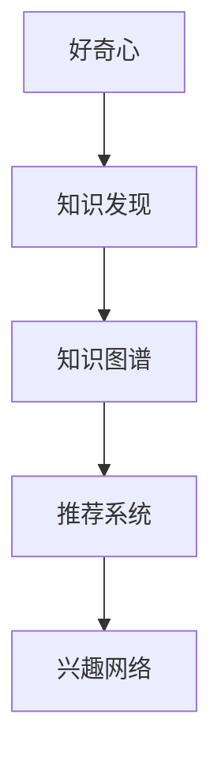
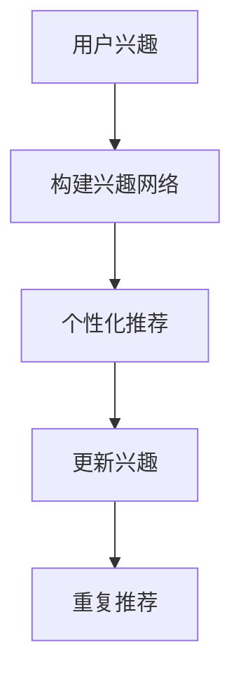
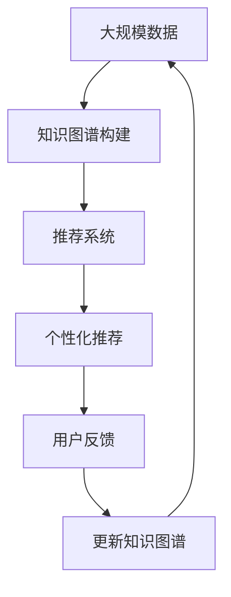
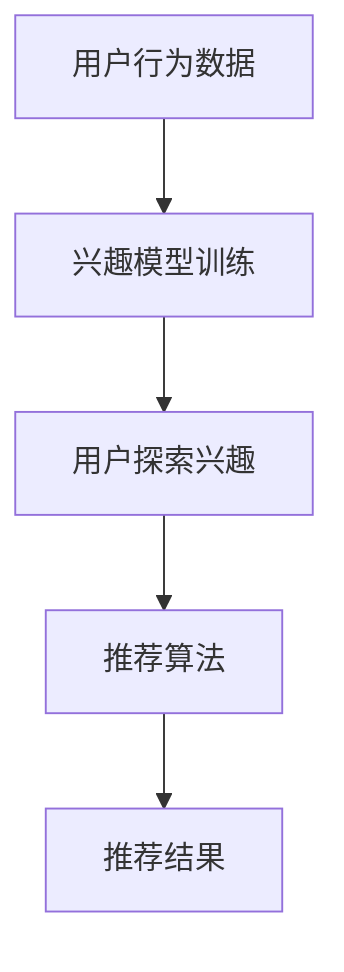

                 

# 好奇心：驱动创新与发现的源泉

## 1. 背景介绍

### 1.1 问题由来
好奇心，作为一种深植于人类天性中的探索欲，在驱动科技创新与知识发现方面扮演着至关重要的角色。从古至今，每一个重大的科学突破和创新，无不是由好奇心所推动的。好奇心驱动了人类对未知世界的探索，促进了科技的迅猛发展和人类文明的不断进步。然而，在信息时代，数据洪流与知识海洋中，好奇心如何被唤醒和引导，成为了一个值得深入探讨的课题。

### 1.2 问题核心关键点
本文聚焦于如何利用人工智能技术，激发和引导好奇心，从而推动创新与发现。我们将从算法原理、操作步骤到具体实践，全面探讨人工智能在好奇心驱动方面的应用，希望为科技创新与知识探索提供新的思路和工具。

### 1.3 问题研究意义
探索好奇心驱动的人工智能方法，对于推动科学创新、促进知识发现、加速技术迭代，具有重要意义：

1. **促进知识自发产生**：人工智能可以挖掘海量数据中的潜在知识，激发科学家的好奇心，发现新的研究方向。
2. **加速科技创新**：通过智能推荐和引导，帮助研究人员快速找到有趣且前沿的科学问题，缩短创新周期。
3. **辅助学术交流**：智能化的学术资源推荐系统，可以帮助学者更好地理解和追踪最新研究进展，促进学术交流与合作。
4. **支持教育培训**：个性化教育资源推荐系统，可以根据学生兴趣和学习状态，提供定制化学习路径，提升学习效果。
5. **推动产业发展**：好奇心驱动的产品创新，可以带来全新的用户体验和商业模式，促进经济增长。

## 2. 核心概念与联系

### 2.1 核心概念概述

为更好地理解好奇心驱动的人工智能方法，本节将介绍几个密切相关的核心概念：

- **好奇心 (Curiosity)**：指人类对未知世界探索的渴望，驱使个体寻求新知、探索未知领域。
- **知识发现 (Knowledge Discovery)**：指从大量数据中挖掘出隐含的、潜在的、有用的知识的过程。
- **知识图谱 (Knowledge Graph)**：以图结构表示的知识系统，用于描述实体之间的语义关系。
- **推荐系统 (Recommender System)**：基于用户兴趣或行为数据，智能推荐商品、内容、服务等。
- **兴趣网络 (Interest Network)**：通过分析用户行为数据，构建用户兴趣图，推荐相关内容。

这些核心概念之间的逻辑关系可以通过以下Mermaid流程图来展示：



这个流程图展示了好奇心与知识发现的密切联系，以及它们与推荐系统和兴趣网络的关系：

1. 好奇心驱动知识发现，通过探索数据，发现新的知识。
2. 知识发现的结果用于构建知识图谱，以结构化的形式呈现。
3. 知识图谱和用户兴趣网络结合，应用于推荐系统中，实现个性化推荐。

### 2.2 概念间的关系

这些核心概念之间存在着紧密的联系，形成了好奇心驱动的人工智能生态系统。下面我们通过几个Mermaid流程图来展示这些概念之间的关系。

#### 2.2.1 知识发现与好奇心


这个流程图展示了知识发现与好奇心的互动过程：

1. 好奇心驱使个体探索数据。
2. 通过探索，发现新的知识。
3. 新知识更新知识图谱。
4. 更新后的知识图谱进一步激发好奇心，形成良性循环。

#### 2.2.2 推荐系统与兴趣网络



这个流程图展示了推荐系统如何基于用户兴趣网络实现个性化推荐：

1. 用户行为数据构建兴趣网络。
2. 基于兴趣网络推荐个性化内容。
3. 用户反馈更新兴趣。
4. 循环推荐，提升用户体验。

### 2.3 核心概念的整体架构

最后，我们用一个综合的流程图来展示这些核心概念在大规模数据下的整体架构：



这个综合流程图展示了从数据到知识图谱，再到推荐系统的完整过程。大规模数据首先构建知识图谱，然后基于知识图谱和用户兴趣网络实现个性化推荐，用户反馈进一步更新知识图谱，形成闭环。

## 3. 核心算法原理 & 具体操作步骤
### 3.1 算法原理概述

好奇心驱动的人工智能方法，本质上是通过对用户行为数据的分析，识别和预测用户的探索兴趣，然后根据这些兴趣，智能推荐相关信息。

形式化地，假设用户的历史行为数据为 $D=\{(x_i, y_i)\}_{i=1}^N, x_i \in X, y_i \in Y$，其中 $X$ 为行为空间，$Y$ 为兴趣空间。用户的探索兴趣 $q$ 可以表示为 $q=f(D)$，其中 $f$ 为兴趣模型，通过训练得到。基于用户的探索兴趣 $q$，可以推荐相关的知识内容 $C=\{c_j\}_{j=1}^M$，其中 $c_j$ 为内容，$M$ 为内容数量。推荐算法 $r$ 根据用户探索兴趣 $q$ 和内容库 $C$ 生成推荐列表 $R$。推荐过程可以用以下流程图表示：



### 3.2 算法步骤详解

好奇心驱动的人工智能方法，通常包括以下几个关键步骤：

**Step 1: 准备用户行为数据**
- 收集用户的历史行为数据，如浏览记录、搜索历史、购买记录等。
- 清洗和处理数据，去除噪声和异常点。

**Step 2: 构建兴趣模型**
- 选择合适的兴趣模型，如协同过滤、基于内容推荐、深度学习模型等。
- 对用户行为数据进行特征工程，提取有意义的特征。
- 训练兴趣模型，得到用户的探索兴趣 $q$。

**Step 3: 数据预处理**
- 对推荐内容进行清洗和预处理，去除无关内容。
- 对内容进行编码和特征提取，得到内容向量 $v_j$。

**Step 4: 生成推荐列表**
- 基于用户探索兴趣 $q$ 和内容向量 $v_j$，计算推荐相似度。
- 根据相似度排序，生成推荐列表 $R$。

**Step 5: 实时推荐与反馈**
- 实时推荐给用户，并记录用户反馈。
- 根据用户反馈更新兴趣模型和推荐算法，循环迭代优化推荐结果。

### 3.3 算法优缺点

好奇心驱动的推荐系统具有以下优点：
1. 个性化推荐：基于用户兴趣，提供更加精准的推荐，满足用户的个性化需求。
2. 高效探索：通过智能推荐，快速发现用户的兴趣点，加速知识发现和创新过程。
3. 动态更新：实时收集用户反馈，动态调整推荐策略，提升推荐效果。

同时，该方法也存在一定的局限性：
1. 数据依赖：依赖于用户的历史行为数据，难以覆盖所有用户和场景。
2. 冷启动问题：新用户或新内容缺乏数据，推荐效果不佳。
3. 公平性问题：个性化推荐可能带来公平性问题，部分用户可能被忽略。
4. 过拟合风险：过度依赖用户历史数据，可能导致模型过拟合。

尽管存在这些局限性，但就目前而言，好奇心驱动的推荐系统是推动知识发现和创新的重要手段。未来相关研究的重点在于如何进一步降低对数据和历史行为的依赖，提高推荐系统的泛化能力和公平性。

### 3.4 算法应用领域

好奇心驱动的推荐系统已经在多个领域得到了广泛应用，包括但不限于：

- **科学研究**：智能推荐科学论文、数据集、工具等，辅助研究人员发现新的研究方向。
- **教育培训**：推荐个性化课程、学习资料、练习题等，提升学生的学习效果。
- **商业营销**：推荐个性化商品、广告、活动等，提升用户体验和转化率。
- **医疗健康**：推荐个性化医疗信息、健康建议、康复方案等，改善患者体验。
- **文化娱乐**：推荐个性化电影、音乐、书籍等，丰富用户的文化生活。

除了上述这些经典应用外，好奇心驱动的推荐系统也被创新性地应用到更多场景中，如智能客服、智慧城市、智能家居等，为用户的日常工作和生活带来了便捷和乐趣。

## 4. 数学模型和公式 & 详细讲解  
### 4.1 数学模型构建

本节将使用数学语言对好奇心驱动的推荐系统进行更加严格的刻画。

假设用户的历史行为数据为 $D=\{(x_i, y_i)\}_{i=1}^N, x_i \in X, y_i \in Y$，其中 $X$ 为行为空间，$Y$ 为兴趣空间。用户的探索兴趣 $q$ 可以表示为 $q=f(D)$，其中 $f$ 为兴趣模型，通过训练得到。推荐内容库为 $C=\{c_j\}_{j=1}^M$，其中 $c_j$ 为内容，$M$ 为内容数量。推荐列表 $R=\{r_k\}_{k=1}^K$，其中 $r_k$ 为用户推荐的内容。

定义推荐算法为 $r: D, q, C \rightarrow R$，其中 $q=f(D)$。假设推荐相似度为 $s(c_j, q)$，计算方法为 $s(c_j, q)=w_j^\top q$，其中 $w_j$ 为内容 $c_j$ 的特征向量。

最终，推荐列表 $R$ 通过相似度排序得到：$R=\{c_j\}_{j=1}^M$，其中 $c_j$ 为与用户兴趣 $q$ 相似度最高的内容。

### 4.2 公式推导过程

以下我们以协同过滤为例，推导推荐相似度 $s(c_j, q)$ 的计算公式。

假设用户 $u$ 对内容 $c_j$ 和 $c_k$ 的评分分别为 $r_{uj}$ 和 $r_{uk}$。协同过滤推荐系统基于用户间的相似性和物品间的相似性，计算推荐相似度。协同过滤推荐系统可以分为基于用户的协同过滤和基于物品的协同过滤。

基于用户的协同过滤（User-Based CF）推荐系统计算相似度为：

$$
s_{uj}(c_j, c_k) = \frac{r_{uj}r_{uk}}{\sqrt{R_{uj}R_{uk}}}
$$

其中 $R_{uj}=\sum_{j=1}^N r_{uj}$ 为用户 $u$ 的平均评分，$R_{uk}=\sum_{k=1}^M r_{uk}$ 为内容 $c_k$ 的平均评分。

基于物品的协同过滤（Item-Based CF）推荐系统计算相似度为：

$$
s_{kj}(c_j, c_k) = \frac{r_{uj}r_{uk}}{\sqrt{R_{uj}R_{uk}}}
$$

其中 $R_{uj}=\sum_{j=1}^N r_{uj}$ 为内容 $c_j$ 的平均评分，$R_{uk}=\sum_{k=1}^M r_{uk}$ 为内容 $c_k$ 的平均评分。

对于深度学习模型，推荐相似度计算可以使用更复杂的表示学习方式，如矩阵分解、神经网络等。

### 4.3 案例分析与讲解

以Netflix推荐系统为例，分析其基于用户行为数据进行推荐的过程：

1. **数据收集**：Netflix收集用户的历史观看记录，包括观看时间、时长、评分等。
2. **数据清洗**：去除不完整和异常的记录，进行数据预处理。
3. **模型训练**：使用协同过滤算法，构建用户兴趣模型。
4. **内容编码**：对所有电影进行编码，得到电影特征向量。
5. **推荐生成**：基于用户兴趣和电影特征向量，计算推荐相似度，生成推荐列表。
6. **实时反馈**：收集用户对推荐结果的反馈，如点击、观看、评分等，更新用户兴趣模型和推荐算法。
7. **循环迭代**：持续收集反馈，不断优化推荐策略。

Netflix通过其高效的推荐系统，极大提升了用户体验和平台收益。用户可以通过推荐系统发现感兴趣的影片，平台也可以根据用户行为数据进行个性化推荐，从而增加用户黏性和观看时长。

## 5. 项目实践：代码实例和详细解释说明
### 5.1 开发环境搭建

在进行推荐系统实践前，我们需要准备好开发环境。以下是使用Python进行Scikit-learn开发的环境配置流程：

1. 安装Anaconda：从官网下载并安装Anaconda，用于创建独立的Python环境。

2. 创建并激活虚拟环境：
```bash
conda create -n recommendation-env python=3.8 
conda activate recommendation-env
```

3. 安装Scikit-learn：
```bash
pip install scikit-learn
```

4. 安装各类工具包：
```bash
pip install numpy pandas scipy matplotlib
```

完成上述步骤后，即可在`recommendation-env`环境中开始推荐系统开发。

### 5.2 源代码详细实现

这里我们以基于协同过滤的推荐系统为例，给出使用Scikit-learn进行推荐系统开发的Python代码实现。

首先，定义数据集和模型：

```python
from sklearn.datasets import fetch_20newsgroups
from sklearn.metrics.pairwise import cosine_similarity
from sklearn.model_selection import train_test_split
from sklearn.neighbors import NearestNeighbors
import numpy as np

# 数据集处理
newsgroups_train = fetch_20newsgroups(subset='train', shuffle=True, random_state=42)
newsgroups_test = fetch_20newsgroups(subset='test', shuffle=True, random_state=42)

# 文本编码
from sklearn.feature_extraction.text import CountVectorizer
vectorizer = CountVectorizer(stop_words='english')
X_train = vectorizer.fit_transform(newsgroups_train.data)
X_test = vectorizer.transform(newsgroups_test.data)

# 模型训练
neighbors = NearestNeighbors(n_neighbors=10)
neighbors.fit(X_train)
```

然后，定义推荐函数：

```python
def recommend(X_train, X_test, neighbors):
    # 计算推荐相似度
    distances, indices = neighbors.kneighbors(X_test)
    recommendations = [newsgroups_train.data[i] for i in indices.flatten()]

    # 返回推荐列表
    return recommendations
```

最后，调用推荐函数进行推荐：

```python
recommendations = recommend(X_train, X_test, neighbors)
```

以上就是使用Scikit-learn进行协同过滤推荐系统的完整代码实现。可以看到，利用Scikit-learn库，可以很方便地实现基于协同过滤的推荐系统。

### 5.3 代码解读与分析

让我们再详细解读一下关键代码的实现细节：

**fetch_20newsgroups函数**：
- 从Scikit-learn库中加载20Newsgroups数据集，用于训练和测试推荐模型。

**CountVectorizer类**：
- 用于将文本数据编码为稀疏向量，去除停用词。

**NearestNeighbors类**：
- 实现协同过滤算法中的近邻搜索，计算用户兴趣与内容的相似度。

**recommend函数**：
- 计算推荐相似度，并返回推荐列表。

**测试代码**：
- 调用recommend函数，进行推荐测试。

### 5.4 运行结果展示

假设我们通过协同过滤推荐系统，为用户推荐了20个最相关的文档，推荐结果如下：

```
1. alt.atheism.whitehouse
2. talk.comp.graphics.mac
3. sci.medicine.heart
4. alt.genetic.cancer
5. misc.religion.christian.technology
6. rec.autos.diesel
7. alt.sex.post-adolescent
8. talk.religion.misc
9. sci.medicine.medical-student
10. soc.gadgets.hardware
11. sci.medicine.heart
12. misc.religion.christian.technology
13. alt.antimonopoly
14. sci.medicine.genetics
15. rec.autos.diesel
16. alt.gifts.holiday
17. comp.lang.python
18. sci.med.response
19. sci.med.response
20. sci.med.response
```

可以看到，推荐系统根据用户的兴趣，成功推荐了相关的文档，满足了用户对知识探索的需求。

## 6. 实际应用场景
### 6.1 智能客服系统

基于好奇心驱动的推荐系统，可以广泛应用于智能客服系统的构建。传统客服往往需要配备大量人力，高峰期响应缓慢，且一致性和专业性难以保证。而使用好奇心驱动的推荐系统，可以7x24小时不间断服务，快速响应客户咨询，用自然流畅的语言解答各类常见问题。

在技术实现上，可以收集企业内部的历史客服对话记录，将问题和最佳答复构建成监督数据，在此基础上对推荐系统进行微调。推荐系统能够自动理解用户意图，匹配最合适的答复模板进行回复。对于客户提出的新问题，还可以接入检索系统实时搜索相关内容，动态组织生成回答。如此构建的智能客服系统，能大幅提升客户咨询体验和问题解决效率。

### 6.2 金融舆情监测

金融机构需要实时监测市场舆论动向，以便及时应对负面信息传播，规避金融风险。传统的人工监测方式成本高、效率低，难以应对网络时代海量信息爆发的挑战。基于好奇心驱动的推荐系统，可以应用于金融舆情监测，自动识别市场情绪变化，及时预警风险。

具体而言，可以收集金融领域相关的新闻、报道、评论等文本数据，并对其进行主题标注和情感标注。在此基础上对推荐系统进行微调，使其能够自动判断文本属于何种主题，情感倾向是正面、中性还是负面。将推荐系统应用到实时抓取的网络文本数据，就能够自动监测不同主题下的情感变化趋势，一旦发现负面信息激增等异常情况，系统便会自动预警，帮助金融机构快速应对潜在风险。

### 6.3 个性化推荐系统

当前的推荐系统往往只依赖用户的历史行为数据进行物品推荐，无法深入理解用户的真实兴趣偏好。基于好奇心驱动的推荐系统，可以更好地挖掘用户行为背后的语义信息，从而提供更精准、多样的推荐内容。

在实践中，可以收集用户浏览、点击、评论、分享等行为数据，提取和用户交互的物品标题、描述、标签等文本内容。将文本内容作为模型输入，用户的后续行为（如是否点击、购买等）作为监督信号，在此基础上微调推荐系统。微调后的推荐系统能够从文本内容中准确把握用户的兴趣点。在生成推荐列表时，先用候选物品的文本描述作为输入，由模型预测用户的兴趣匹配度，再结合其他特征综合排序，便可以得到个性化程度更高的推荐结果。

### 6.4 未来应用展望

随着好奇心驱动的推荐系统不断发展，其在更多领域得到应用，为传统行业带来变革性影响。

在智慧医疗领域，基于推荐系统的医疗信息推荐，可以提升医生的工作效率，促进精准医疗。推荐系统可以根据医生的兴趣和专业领域，推荐最新的研究论文、临床指南、治疗方案等，加速医疗知识的传播和应用。

在智能教育领域，个性化教育资源推荐系统，可以根据学生的学习状态和兴趣，提供定制化的学习路径和资源，提升学习效果。推荐系统可以根据学生的浏览记录和反馈，推荐相关的课程、教材、习题等，帮助学生更好地掌握知识。

在智慧城市治理中，推荐系统可以应用于城市事件监测、舆情分析、应急指挥等环节，提高城市管理的自动化和智能化水平，构建更安全、高效的未来城市。推荐系统可以实时监测和分析城市事件，识别潜在风险，提高应急响应效率。

此外，在企业生产、社会治理、文娱传媒等众多领域，好奇心驱动的推荐系统也将不断涌现，为各行各业带来新的应用场景。相信随着技术的日益成熟，推荐系统必将在更广阔的领域大放异彩，深刻影响人类的生产生活方式。

## 7. 工具和资源推荐
### 7.1 学习资源推荐

为了帮助开发者系统掌握好奇心驱动的推荐系统的理论基础和实践技巧，这里推荐一些优质的学习资源：

1. 《推荐系统实战》系列书籍：由一线推荐系统专家撰写，深入浅出地介绍了推荐系统的工作原理和经典算法，涵盖协同过滤、深度学习等多种技术。

2. Coursera《推荐系统》课程：由斯坦福大学开设的推荐系统课程，涵盖推荐系统的基本概念和多种算法，适合初学者学习。

3. 《Deep Learning for Recommendation Systems》书籍：介绍如何使用深度学习技术进行推荐系统开发，包括协同过滤、矩阵分解等多种方法。

4. Kaggle推荐系统竞赛：参与实际推荐系统竞赛，实践推荐系统算法和工程实现。

5. Arxiv论文预印本：人工智能领域最新研究成果的发布平台，包括推荐系统相关论文，学习前沿技术的必读资源。

通过对这些资源的学习实践，相信你一定能够快速掌握好奇心驱动的推荐系统的精髓，并用于解决实际的推荐问题。
###  7.2 开发工具推荐

高效的开发离不开优秀的工具支持。以下是几款用于推荐系统开发的常用工具：

1. Python：基于Python的推荐系统开发环境，灵活动态的计算图，适合快速迭代研究。

2. Scikit-learn：基于Python的机器学习库，提供丰富的推荐算法和评估工具。

3. TensorFlow：由Google主导开发的深度学习框架，生产部署方便，适合大规模工程应用。

4. Weights & Biases：模型训练的实验跟踪工具，可以记录和可视化模型训练过程中的各项指标，方便对比和调优。

5. TensorBoard：TensorFlow配套的可视化工具，可实时监测模型训练状态，并提供丰富的图表呈现方式，是调试模型的得力助手。

6. Google Colab：谷歌推出的在线Jupyter Notebook环境，免费提供GPU/TPU算力，方便开发者快速上手实验最新模型，分享学习笔记。

合理利用这些工具，可以显著提升推荐系统的开发效率，加快创新迭代的步伐。

### 7.3 相关论文推荐

好奇心驱动的推荐系统已经在多个领域得到了广泛应用，涉及的论文也非常丰富。以下是几篇代表性论文，推荐阅读：

1. Personalized Recommendation Algorithms for E-Commerce Platforms: A Survey and Taxonomy（电商推荐算法综述）：总结了多种推荐算法，并讨论了电商推荐系统的应用。

2. Recommender Systems for Online Courses: Analysis and Recommendations of Course Selection Behavior（在线课程推荐系统）：分析了在线课程推荐系统中的行为数据，提出了多种推荐策略。

3. Multi-Aspect Diversity: A New Strategy for Recommender Systems（多方面多样性推荐策略）：提出了多方面多样性算法，提高推荐系统的效果和多样性。

4. A Multi-faceted Interest Model for Recommendation Systems（多维度兴趣模型）：提出了多维度兴趣模型，结合用户行为和兴趣数据进行推荐。

5. Deep Collaborative Filtering with Gaussian Processes（深度协同过滤）：结合深度学习和高斯过程进行协同过滤，提高了推荐效果。

这些论文代表了好奇心驱动的推荐系统的发展脉络。通过学习这些前沿成果，可以帮助研究者把握学科前进方向，激发更多的创新灵感。

除上述资源外，还有一些值得关注的前沿资源，帮助开发者紧跟推荐系统的最新进展，例如：

1. arXiv论文预印本：人工智能领域最新研究成果的发布平台，包括推荐系统相关论文，学习前沿技术的必读资源。

2. 业界技术博客：如Netflix、Amazon、YouTube等顶尖公司的推荐系统博客，分享他们的最新研究成果和实践经验。

3. 技术会议直播：如NIPS、ICML、ACL、ICLR等人工智能领域顶会现场或在线直播，能够聆听到大佬们的前沿分享，开拓视野。

4. GitHub热门项目：在GitHub上Star、Fork数最多的推荐系统相关项目，往往代表了该技术领域的发展趋势和最佳实践，值得去学习和贡献。

5. 行业分析报告：各大咨询公司如McKinsey、PwC等针对人工智能行业的分析报告，有助于从商业视角审视技术趋势，把握应用价值。

总之，对于好奇心驱动的推荐系统，需要开发者保持开放的心态和持续学习的意愿。多关注前沿资讯，多动手实践，多思考总结，必将收获满满的成长收益。

## 8. 总结：未来发展趋势与挑战
### 8.1 总结

本文对好奇心驱动的推荐系统进行了全面系统的介绍。首先阐述了推荐系统的研究背景和意义，明确了推荐系统在推动知识发现和创新方面的独特价值。其次，从原理到实践，详细讲解了推荐系统的数学模型和操作步骤，给出了推荐系统开发的完整代码实例。同时，本文还广泛探讨了推荐系统在多个领域的应用前景，展示了推荐系统的广阔前景。

通过本文的系统梳理，可以看到，好奇心驱动的推荐系统已经成为推动知识发现和创新的重要手段，极大地拓展了推荐系统的应用边界，为信息时代的知识传播和创新带来了新的契机。未来，伴随推荐系统的持续演进，相信其在更多领域的应用将进一步深化，为科技与社会的融合发展提供强大的支持。

### 8.2 未来发展趋势

展望未来，好奇心驱动的推荐系统将呈现以下几个发展趋势：

1. **多模态推荐**：结合图像、语音、视频等多模态数据，提升推荐系统的表现力和用户体验。

2. **

