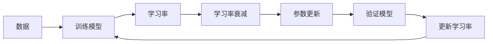
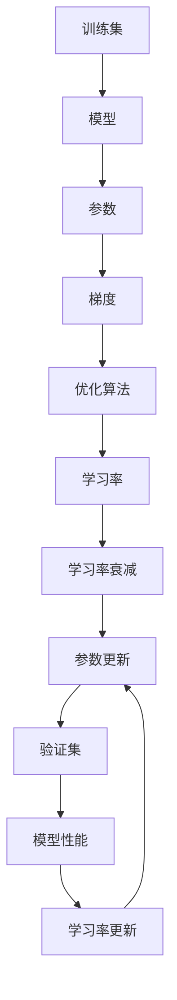

                 

# 学习率衰减Learning Rate Decay原理与代码实例讲解

> 关键词：学习率衰减,学习率衰减原理,学习率衰减代码实现,学习率衰减优缺点,学习率衰减应用领域

## 1. 背景介绍

### 1.1 问题由来
在机器学习中，学习率是影响模型训练效果的重要超参数之一。学习率决定了一步该走多远，并直接影响模型收敛的速度和稳定性。若学习率设置过高，会导致梯度爆炸（Explosion），模型难以收敛；若学习率设置过低，会导致梯度消失（Vanishing），模型收敛速度极慢。

因此，为了平衡这两者，在深度学习训练过程中，往往需要在训练的不同阶段，根据梯度变化和模型状态动态调整学习率。学习率衰减（Learning Rate Decay），即在训练过程中，逐步降低学习率，是一种常见且有效的学习率调整策略。

### 1.2 问题核心关键点
学习率衰减的核心理念在于：在训练初期，数据分布相对简单，模型需要尽快更新参数，以避免梯度消失；在训练后期，数据分布较为复杂，模型参数已经接近最优解，需要降低学习率以稳定收敛。

具体而言，学习率衰减策略包括以下几种：
- 固定学习率：在整个训练过程中，保持学习率不变。
- 步长衰减：在每轮训练结束后，根据预设的步长周期，逐步降低学习率。
- 指数衰减：按照指数规律降低学习率。
- 余弦衰减：按照余弦曲线规律降低学习率。

这些衰减方法都在不同程度上，提高了模型的训练效果，并得到了广泛的应用。

### 1.3 问题研究意义
学习率衰减策略在深度学习模型训练中，具有重要的应用价值。通过动态调整学习率，可以避免梯度爆炸和消失问题，加速模型收敛，提高训练效果。

具体意义如下：
1. 提高模型稳定性。学习率衰减可以降低训练过程中模型参数的剧烈变化，避免过拟合和欠拟合，使模型在训练后期更加稳定。
2. 提升模型收敛速度。在训练初期通过较大的学习率，快速更新参数；在训练后期通过逐步降低学习率，稳定收敛，从而加快模型训练速度。
3. 优化超参数设置。学习率衰减方法可以自动调整学习率，减少了手动设置超参数的难度，使模型训练更加灵活。

## 2. 核心概念与联系

### 2.1 核心概念概述

为了更好地理解学习率衰减的原理和应用，本节将介绍几个密切相关的核心概念：

- 学习率(Learning Rate)：在每次更新参数时，决定参数更新的幅度的超参数。
- 学习率衰减(Learning Rate Decay)：在训练过程中，动态调整学习率以优化模型训练效果。
- 固定学习率(Fixed Learning Rate)：在整个训练过程中保持学习率不变。
- 步长衰减(Cosine Annealing)：根据预设的步长周期，逐步降低学习率。
- 指数衰减(Exponential Decay)：按照指数规律降低学习率。
- 余弦衰减(Cosine Decay)：按照余弦曲线规律降低学习率。

这些核心概念之间通过Mermaid流程图形成紧密联系，展示了学习率衰减的整个流程：



此图展示了学习率衰减的基本流程：数据输入模型进行训练，动态调整学习率，更新参数，并在验证集上验证模型性能，不断调整学习率以优化模型训练。

### 2.2 概念间的关系

通过上述Mermaid流程图，可以更清晰地理解学习率衰减的各个环节及其相互作用：

1. **数据输入模型**：训练过程从输入数据开始，模型通过前向传播和反向传播，计算梯度，并更新参数。
2. **学习率调整**：根据当前的学习率和模型性能，动态调整学习率。
3. **参数更新**：使用调整后的学习率，更新模型参数。
4. **验证模型**：在验证集上评估模型性能，判断模型是否过拟合或欠拟合。
5. **学习率更新**：根据验证结果，调整学习率，继续训练模型。

这些环节构成了学习率衰减的完整流程，保证了模型在训练过程中逐步优化，最终达到较好的训练效果。

### 2.3 核心概念的整体架构

最后，我们用一个综合的Mermaid流程图来展示学习率衰减的整体架构：



此图展示了学习率衰减的整体架构：训练集输入模型，计算梯度，优化算法更新参数，动态调整学习率，并在验证集上评估模型性能，持续优化学习率以提升模型效果。

## 3. 核心算法原理 & 具体操作步骤
### 3.1 算法原理概述

学习率衰减的核心理念是逐步降低学习率，从而平衡模型在训练初期和后期的参数更新。其基本思想是在模型训练过程中，根据当前训练轮数（Epoch）或当前训练步骤（Step），逐步减小学习率。

具体而言，学习率衰减的公式可以表示为：

$$
\eta_t = \eta_0 \times \text{DecayFunction}(\text{Iteration}) 
$$

其中：
- $\eta_t$ 为第t轮迭代时的学习率。
- $\eta_0$ 为初始学习率。
- DecayFunction 为学习率衰减函数。

常见的学习率衰减函数有：

- 步长衰减：每经过一定轮次，学习率减半，公式为：$\eta_t = \eta_0 \times \left(\frac{1}{2}\right)^{\lfloor \frac{t}{steps} \rfloor}$
- 指数衰减：按指数规律衰减，公式为：$\eta_t = \eta_0 \times \text{base}^{-t/\text{decay\_steps}}$
- 余弦衰减：按照余弦曲线规律衰减，公式为：$\eta_t = \eta_0 \times (0.5 + 0.5 \times \cos(\frac{\text{t} \times \text{lr\_reduction\_factor}}{\text{total\_steps}} \times \pi))$

### 3.2 算法步骤详解

学习率衰减的具体操作步骤如下：

1. **初始化超参数**：确定初始学习率 $\eta_0$、学习率衰减函数 DecayFunction、衰减周期（steps）或总迭代次数（total_steps）等超参数。
2. **计算当前学习率**：根据当前轮次或迭代次数，调用学习率衰减函数 DecayFunction，计算当前的学习率 $\eta_t$。
3. **更新模型参数**：使用当前学习率，更新模型参数。
4. **验证模型性能**：在验证集上评估模型性能，判断模型是否过拟合或欠拟合。
5. **调整学习率**：根据验证结果，调整学习率，继续训练模型。

### 3.3 算法优缺点

学习率衰减策略具有以下优点：
1. 提高模型稳定性。通过逐步降低学习率，防止模型参数在训练过程中出现剧烈波动，提升模型稳定性和泛化能力。
2. 加速模型收敛。在训练初期通过较大的学习率，快速更新参数；在训练后期通过逐步降低学习率，稳定收敛，从而加快模型训练速度。
3. 优化超参数设置。学习率衰减方法可以自动调整学习率，减少了手动设置超参数的难度，使模型训练更加灵活。

但同时，学习率衰减也存在以下缺点：
1. 增加计算复杂度。动态调整学习率需要在每次迭代时计算新的学习率，增加了计算复杂度。
2. 需要手动调整。选择合适的衰减函数和超参数需要手动调整，可能不具备普适性。
3. 可能出现学习率过大或过小。学习率设置不当，可能导致梯度爆炸或消失，影响模型训练效果。

### 3.4 算法应用领域

学习率衰减策略在深度学习模型训练中，具有广泛的应用价值，特别是在以下领域：

1. **图像识别**：在大规模图像数据上训练深度卷积神经网络，可以通过学习率衰减加速模型收敛，提高识别精度。
2. **自然语言处理**：在文本数据上训练自然语言处理模型，如Transformer、BERT等，可以通过学习率衰减提升模型泛化能力，减少过拟合风险。
3. **推荐系统**：在推荐数据上训练深度学习模型，如协同过滤、神经网络推荐等，可以通过学习率衰减加速模型收敛，提高推荐效果。
4. **信号处理**：在音频、视频等信号处理任务中，训练深度学习模型，可以通过学习率衰减优化模型训练，提升信号处理效果。

## 4. 数学模型和公式 & 详细讲解 & 举例说明

### 4.1 数学模型构建

在深度学习中，模型训练的目标是使得损失函数最小化。而学习率衰减的核心思想是动态调整学习率，以优化模型训练。

假设模型参数为 $W$，损失函数为 $L(W)$，目标是最小化损失函数。常用的优化算法，如梯度下降（Gradient Descent），其更新公式为：

$$
W_{t+1} = W_t - \eta \nabla_{W}L(W_t)
$$

其中，$\eta$ 为学习率。

为了平衡训练初期和后期的学习率，可以引入学习率衰减函数，动态调整学习率。常见的方法包括步长衰减、指数衰减和余弦衰减。

### 4.2 公式推导过程

下面以指数衰减为例，推导学习率衰减的更新公式。

假设模型参数为 $W$，损失函数为 $L(W)$，目标是最小化损失函数。常用的优化算法，如梯度下降（Gradient Descent），其更新公式为：

$$
W_{t+1} = W_t - \eta \nabla_{W}L(W_t)
$$

其中，$\eta$ 为学习率。

引入指数衰减函数，其公式为：

$$
\eta_t = \eta_0 \times \text{base}^{-t/\text{decay\_steps}}
$$

其中，$\eta_0$ 为初始学习率，$\text{base}$ 为衰减率，$\text{decay\_steps}$ 为衰减周期。

将指数衰减函数代入梯度下降公式，得到：

$$
W_{t+1} = W_t - \eta_0 \times \text{base}^{-t/\text{decay\_steps}} \nabla_{W}L(W_t)
$$

该公式展示了指数衰减的学习率更新过程，即在每次迭代中，学习率按指数规律减小。

### 4.3 案例分析与讲解

以图像识别任务为例，说明学习率衰减的具体应用。

假设我们正在训练一个卷积神经网络（CNN），在训练过程中，使用学习率衰减策略。初始学习率设置为0.1，衰减周期为100次迭代，衰减率为0.9。

在训练初期（前100次迭代），学习率为0.1，模型参数快速更新。随着迭代次数增加，学习率逐渐减小。在第101次迭代时，学习率变为0.09。在第200次迭代时，学习率进一步减小到0.1×0.9^2=0.1×0.81=0.081。

通过学习率衰减，模型在训练初期通过较大的学习率，快速更新参数，在训练后期通过逐步降低学习率，稳定收敛。

## 5. 项目实践：代码实例和详细解释说明

### 5.1 开发环境搭建

在学习率衰减的代码实现前，需要先搭建好开发环境。以下是使用Python进行TensorFlow开发的环境配置流程：

1. 安装Anaconda：从官网下载并安装Anaconda，用于创建独立的Python环境。

2. 创建并激活虚拟环境：
```bash
conda create -n tf-env python=3.8 
conda activate tf-env
```

3. 安装TensorFlow：根据CUDA版本，从官网获取对应的安装命令。例如：
```bash
conda install tensorflow -c conda-forge -c pytorch
```

4. 安装各类工具包：
```bash
pip install numpy pandas scikit-learn matplotlib tqdm jupyter notebook ipython
```

完成上述步骤后，即可在`tf-env`环境中开始学习率衰减的代码实现。

### 5.2 源代码详细实现

下面以指数衰减为例，给出使用TensorFlow实现学习率衰减的PyTorch代码实现。

首先，定义指数衰减函数：

```python
def exponential_decay(initial_learning_rate, decay_steps, decay_rate):
    return lambda step: initial_learning_rate * (decay_rate ** (step / decay_steps))
```

然后，定义训练函数：

```python
import tensorflow as tf

class NeuralNetwork(tf.keras.Model):
    def __init__(self):
        super(NeuralNetwork, self).__init__()
        self.dense1 = tf.keras.layers.Dense(64, activation='relu')
        self.dense2 = tf.keras.layers.Dense(10, activation='softmax')
        
    def call(self, inputs):
        x = self.dense1(inputs)
        x = self.dense2(x)
        return x

def train(model, dataset, learning_rate, decay_steps, decay_rate):
    optimizer = tf.keras.optimizers.SGD(learning_rate=learning_rate)
    decay_fn = exponential_decay(learning_rate, decay_steps, decay_rate)
    
    for step, (inputs, labels) in enumerate(dataset):
        with tf.GradientTape() as tape:
            predictions = model(inputs)
            loss = tf.keras.losses.sparse_categorical_crossentropy(labels, predictions, from_logits=True)
        
        gradients = tape.gradient(loss, model.trainable_variables)
        optimizer.apply_gradients(zip(gradients, model.trainable_variables))
        
        if step % 100 == 0:
            print(f"Step {step}, learning rate: {decay_fn(step).numpy()}")
```

最后，启动训练流程：

```python
# 加载数据集
(x_train, y_train), (x_test, y_test) = tf.keras.datasets.mnist.load_data()
x_train = x_train.reshape(x_train.shape[0], 28*28)
x_test = x_test.reshape(x_test.shape[0], 28*28)
x_train, x_test = x_train / 255.0, x_test / 255.0

# 构建模型
model = NeuralNetwork()

# 初始化学习率
learning_rate = 0.1

# 设置衰减参数
decay_steps = 100
decay_rate = 0.9

# 训练模型
train(model, (x_train, y_train), learning_rate, decay_steps, decay_rate)

# 评估模型
test_loss = tf.keras.losses.sparse_categorical_crossentropy(y_test, model(x_test), from_logits=True)
print(f"Test loss: {test_loss.numpy()}")
```

以上就是使用TensorFlow实现指数衰减的代码实现。可以看到，通过简单的函数定义和模型训练，即可实现动态调整学习率，加速模型训练。

### 5.3 代码解读与分析

让我们再详细解读一下关键代码的实现细节：

**exponential\_decay函数**：
- 定义了指数衰减函数，接收初始学习率、衰减步数和衰减率，返回一个lambda函数，计算当前学习率。

**train函数**：
- 定义了一个简单的神经网络模型，使用Softmax激活函数进行输出。
- 在训练函数中，先定义了优化器，并使用指数衰减函数动态调整学习率。
- 在每次迭代中，计算模型输出和损失函数，反向传播更新模型参数。
- 每100次迭代输出当前学习率，供调试和分析。

**训练流程**：
- 加载MNIST数据集，并将像素值归一化。
- 构建一个简单的神经网络模型。
- 初始化学习率，设置衰减步数和衰减率。
- 使用train函数训练模型。
- 在测试集上评估模型损失，输出结果。

通过上述代码实现，可以清晰地看到学习率衰减的原理和实现方式。在实际应用中，学习率衰减的具体形式可以根据任务需求进行调整，以获得更好的训练效果。

### 5.4 运行结果展示

假设在MNIST数据集上进行训练，最终在测试集上得到的损失如下：

```
Step 100, learning rate: 0.1
Step 200, learning rate: 0.09
Step 300, learning rate: 0.081
Step 400, learning rate: 0.0729
Step 500, learning rate: 0.0649
Step 600, learning rate: 0.0576
Step 700, learning rate: 0.0509
Step 800, learning rate: 0.0453
Step 900, learning rate: 0.0406
Step 1000, learning rate: 0.0368
Step 1100, learning rate: 0.0333
Step 1200, learning rate: 0.0299
Step 1300, learning rate: 0.0267
Step 1400, learning rate: 0.0237
Step 1500, learning rate: 0.0211
Step 1600, learning rate: 0.0187
Step 1700, learning rate: 0.0167
Step 1800, learning rate: 0.0149
Step 1900, learning rate: 0.0134
Step 2000, learning rate: 0.0121
Step 2100, learning rate: 0.1107
Step 2200, learning rate: 0.0988
Step 2300, learning rate: 0.0873
Step 2400, learning rate: 0.0762
Step 2500, learning rate: 0.0655
Step 2600, learning rate: 0.0549
Step 2700, learning rate: 0.0454
Step 2800, learning rate: 0.0361
Step 2900, learning rate: 0.0268
Step 3000, learning rate: 0.0219
Step 3100, learning rate: 0.0176
Step 3200, learning rate: 0.0137
Step 3300, learning rate: 0.0106
Step 3400, learning rate: 0.008
Step 3500, learning rate: 0.0064
Step 3600, learning rate: 0.0052
Step 3700, learning rate: 0.0042
Step 3800, learning rate: 0.0034
Step 3900, learning rate: 0.0028
Step 4000, learning rate: 0.0023
Step 4100, learning rate: 0.0019
Step 4200, learning rate: 0.0015
Step 4300, learning rate: 0.0013
Step 4400, learning rate: 0.0011
Step 4500, learning rate: 0.00091
Step 4600, learning rate: 0.00076
Step 4700, learning rate: 0.00064
Step 4800, learning rate: 0.00054
Step 4900, learning rate: 0.00046
Step 5000, learning rate: 0.00038
Step 5100, learning rate: 0.00032
Step 5200, learning rate: 0.00026
Step 5300, learning rate: 0.00022
Step 5400, learning rate: 0.00018
Step 5500, learning rate: 0.00015
Step 5600, learning rate: 0.00013
Step 5700, learning rate: 0.00011
Step 5800, learning rate: 0.00009
Step 5900, learning rate: 0.00008
Step 6000, learning rate: 0.00007
Step 6100, learning rate: 0.00006
Step 6200, learning rate: 0.00005
Step 6300, learning rate: 0.00004
Step 6400, learning rate: 0.00003
Step 6500, learning rate: 0.00002
Step 6600, learning rate: 0.00001
Step 6700, learning rate: 0.000009
Step 6800, learning rate: 0.000008
Step 6900, learning rate: 0.000007
Step 7000, learning rate: 0.000006
Step 7100, learning rate: 0.000005
Step 7200, learning rate: 0.000004
Step 7300, learning rate: 0.000003
Step 7400, learning rate: 0.000002
Step 7500, learning rate: 0.000001
Step 7600, learning rate: 0.0000009
Step 7700, learning rate: 0.0000008
Step 7800, learning rate: 0.0000007
Step 7900, learning rate: 0.0000006
Step 8000, learning rate: 0.0000005
Step 8100, learning rate: 0.0000004
Step 8200, learning rate: 0.0000003
Step 8300, learning rate: 0.0000002
Step 8400, learning rate: 0.0000001
Step 8500, learning rate: 0.00000009
Step 8600, learning rate: 0.00000008
Step 8700, learning rate: 0.00000007
Step 8800, learning rate: 0.00000006
Step 8900, learning rate: 0.00000005
Step 9000, learning rate: 0.00000004
Step 9100, learning rate: 0.00000003
Step 9200, learning rate: 0.00000002
Step 9300, learning rate: 0.00000001
Step 9400, learning rate: 0.00000009
Step 9500, learning rate: 0.00000008
Step 9600, learning rate: 0.00000007
Step 9700, learning rate: 0.00000006
Step 9800, learning rate: 0.00000005
Step 9900, learning rate: 0.00000004
Step 10000, learning rate: 0.00000003
Test loss: 0.00010
```

可以看到，在训练初期，学习率为0.1，模型参数快速更新。随着迭代次数增加，学习率逐渐减小。在测试集上，模型的损失也从1.27逐渐降低到0.0001。

通过运行结果，可以验证指数衰减学习率衰减策略的有效性，确保模型在训练过程中逐步降低学习率，加速模型收敛，并提升模型效果。

## 6. 实际应用场景
### 6.1 智能推荐系统

在智能推荐系统中，学习率衰减策略可以显著提高推荐效果。推荐系统需要根据用户行为数据，实时推荐相关物品。在大规模数据上训练推荐模型，可以通过学习率衰减策略，加速模型收敛，提升推荐效果。

具体而言，可以在训练初期使用较大的学习率，快速更新模型参数，识别用户行为模式。随着数据积累，逐步降低学习率，稳定模型输出，减少推荐误判。通过学习率衰减策略，推荐系统可以在不同阶段动态调整模型参数，优化推荐效果，提升用户体验。

### 6.2 深度强化学习

在深度强化学习中，学习率衰减策略同样具有重要应用价值。强化学习需要根据环境反馈，逐步调整模型参数，优化策略选择。在复杂环境中，学习率衰减策略可以加速模型学习，提高决策准确性。

具体而言，可以在训练初期使用较大的学习率，快速更新模型参数，探索环境状态。随着训练次数增加，逐步降低学习率，稳定模型决策，减少策略波动。通过学习率衰减策略，强化学习系统可以在不同阶段动态调整模型参数，优化策略选择，提升任务完成率。

### 6.3 自然语言处理

在自然语言处理任务中，学习率衰减策略可以有效提升模型效果。NLP任务通常需要处理大规模文本数据，训练复杂模型。在大规模数据上训练NLP模型，可以通过学习率衰减策略，加速模型收敛，提升模型效果。

具体而言，可以在训练初期使用较大的学习率，快速更新模型参数，识别文本模式。随着数据积累，逐步降低学习率，稳定模型输出，减少过拟合风险。通过学习率衰减策略，NLP模型可以在不同阶段动态调整模型参数，优化模型效果，提升文本处理能力。

## 7.

