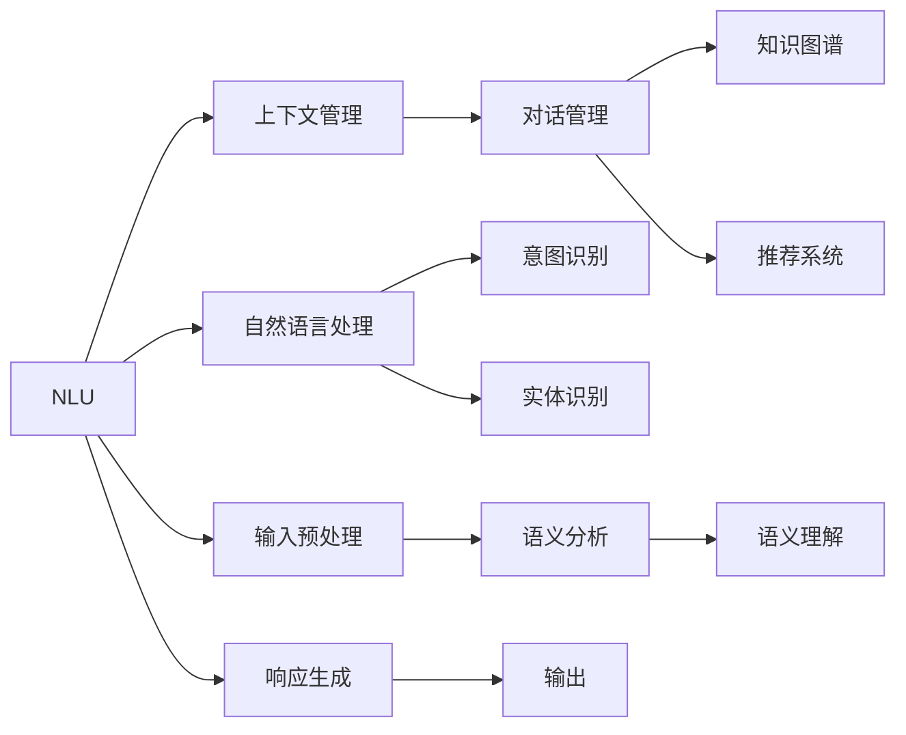

                 

# 实时客户服务：AI代理的响应式工作流

## 1. 背景介绍

### 1.1 问题由来
随着电子商务和互联网服务的快速发展，客户服务成为企业竞争力的重要组成部分。传统客服模式主要依赖人工客服，成本高、效率低，且存在知识更新不及时、服务质量不稳定等问题。面对海量客户请求，人工客服往往无法及时响应，导致客户满意度下降。为提升客户服务质量，企业逐步引入AI客服技术，通过自然语言处理(NLP)技术实现智能客服。

AI客服系统能够快速响应客户咨询，处理简单问题，但面临一些挑战：如多轮对话理解、复杂情境推理、个性化服务等。如何设计有效的AI客服工作流，使其能够高效、智能地应对各种客户需求，成为当前研究的焦点。

### 1.2 问题核心关键点
实时客户服务的关键在于设计一个高效、智能的AI客服工作流。该工作流通常包含以下几个关键点：

- **自然语言理解(NLU)**：解析客户的输入，理解其意图。
- **上下文管理**：管理对话上下文，确保对话连贯。
- **对话管理**：规划对话流程，生成合适的回复。
- **知识图谱**：辅助理解上下文，提供相关知识。
- **推荐系统**：提供个性化的服务建议。

这些核心组件共同构成了AI客服的响应式工作流，能够实时响应客户请求，提供满意的个性化服务。

### 1.3 问题研究意义
构建高效的AI客服工作流，可以显著提升客户服务效率和质量，降低企业运营成本。具体来说：

1. **提升服务效率**：AI客服可以24小时不间断工作，快速响应客户请求，减少人工客服的排班压力。
2. **提高服务质量**：AI客服通过深度学习和自然语言处理技术，能够理解复杂语义，生成准确、友好的回复。
3. **降低运营成本**：AI客服系统自动化处理简单问题，减少人工客服的需求，降低人工成本。
4. **增强客户满意度**：AI客服系统能够提供全天候、个性化服务，提升客户体验。
5. **数据驱动优化**：通过收集和分析客户互动数据，不断优化AI客服模型，提升系统性能。

综上所述，构建高效、智能的AI客服工作流，是提升企业客户服务水平的关键。

## 2. 核心概念与联系

### 2.1 核心概念概述

为更好地理解AI客服工作流的核心概念，本节将介绍几个密切相关的核心概念：

- **自然语言理解(NLU)**：解析自然语言输入，提取意图、实体等信息，是AI客服系统的基础。
- **上下文管理**：管理对话上下文，存储和更新对话状态，确保对话连贯性。
- **对话管理**：规划对话流程，生成合适的回复，使对话自然流畅。
- **知识图谱**：表示实体和实体之间的关系，辅助理解上下文，提供相关知识。
- **推荐系统**：根据用户历史行为和偏好，推荐个性化服务。

这些核心概念之间通过数据流动和工作流程紧密联系，形成一个完整的AI客服响应式工作流。

### 2.2 概念间的关系

这些核心概念之间存在着紧密的联系，通过数据流动和工作流程，形成了一个完整的AI客服响应式工作流。下面通过Mermaid流程图来展示这些概念之间的关系：



这个流程图展示了NLU、上下文管理、对话管理、知识图谱和推荐系统之间的关系：

1. NLU解析输入文本，提取意图和实体。
2. 上下文管理存储和更新对话状态，确保对话连贯。
3. 对话管理规划对话流程，生成合适的回复。
4. 知识图谱提供相关知识，辅助理解上下文。
5. 推荐系统根据用户历史行为和偏好，推荐个性化服务。

这些组件通过数据流动和工作流程，构成了一个完整的AI客服响应式工作流。

## 3. 核心算法原理 & 具体操作步骤
### 3.1 算法原理概述

AI客服工作流的设计，本质上是一个多组件协同工作的过程。其核心算法原理可以总结如下：

1. **自然语言理解(NLU)**：通过深度学习模型解析输入文本，提取意图、实体等信息。
2. **上下文管理**：利用图结构存储和更新对话状态，确保对话连贯。
3. **对话管理**：设计对话策略，生成合适的回复，使对话自然流畅。
4. **知识图谱**：构建知识图谱，辅助理解上下文，提供相关知识。
5. **推荐系统**：根据用户历史行为和偏好，推荐个性化服务。

这些组件通过数据流动和工作流程，协同工作，实现了AI客服的响应式工作流。

### 3.2 算法步骤详解

#### 3.2.1 自然语言理解(NLU)

自然语言理解(NLU)是AI客服工作流的第一步。通过深度学习模型解析输入文本，提取意图和实体，形成意图表示和实体表示。

**步骤1：输入预处理**  
将客户输入的文本进行分词、去停用词、词干提取等预处理操作，转换为模型可接受的形式。

**步骤2：意图识别**  
通过意图识别模型，将输入文本映射到预定义的意图类别。常见的意图识别模型包括BERT、RNN、CNN等。

**步骤3：实体识别**  
通过实体识别模型，识别文本中的实体及其类型。常见的实体识别模型包括CRF、BiLSTM-CRF等。

**步骤4：语义分析**  
将意图表示和实体表示输入语义分析模型，生成语义表示，辅助理解上下文。

**步骤5：语义理解**  
将语义表示输入语义理解模型，生成对话上下文。

#### 3.2.2 上下文管理

上下文管理通过图结构存储和更新对话状态，确保对话连贯。

**步骤1：建立图结构**  
构建一个有向图，节点表示对话轮次，边表示信息流向。每个节点包含意图表示、实体表示、对话历史等信息。

**步骤2：更新对话状态**  
每次对话轮次，根据意图表示和实体表示，更新当前节点的状态。同时根据上下文图结构，选择合适的对话策略。

**步骤3：存储对话历史**  
将对话历史存储在图结构中，用于后续轮次的上下文理解。

#### 3.2.3 对话管理

对话管理通过设计对话策略，生成合适的回复，使对话自然流畅。

**步骤1：定义对话策略**  
根据任务类型，设计不同的对话策略。如问答任务需要生成精确回答，推荐任务需要生成推荐列表。

**步骤2：生成回复**  
根据对话状态和上下文信息，生成合适的回复。常见的方法包括规则匹配、模板填充、生成模型等。

**步骤3：输出回复**  
将生成的回复输出给客户，完成当前轮次的对话。

#### 3.2.4 知识图谱

知识图谱通过构建实体和实体之间的关系，辅助理解上下文，提供相关知识。

**步骤1：构建知识图谱**  
构建包含实体和关系的知识图谱，用于辅助理解上下文。

**步骤2：查询知识图谱**  
根据意图表示和实体表示，查询知识图谱，获取相关信息。

**步骤3：提供知识支持**  
将查询结果作为上下文信息，辅助生成回复。

#### 3.2.5 推荐系统

推荐系统根据用户历史行为和偏好，推荐个性化服务。

**步骤1：收集用户行为数据**  
收集用户的历史点击、浏览、购买等行为数据，形成用户画像。

**步骤2：推荐模型训练**  
使用用户行为数据和个性化推荐模型训练得到推荐策略。

**步骤3：推荐服务**  
根据当前对话上下文和用户画像，生成个性化推荐服务。

### 3.3 算法优缺点

**优点**：

1. **高效响应**：通过多组件协同工作，AI客服能够实时响应客户请求，提高服务效率。
2. **智能化服务**：利用深度学习和自然语言处理技术，提供智能化服务，提升客户体验。
3. **成本降低**：通过自动化处理简单问题，减少人工客服需求，降低运营成本。
4. **数据驱动优化**：通过收集和分析客户互动数据，不断优化AI客服模型，提升系统性能。

**缺点**：

1. **复杂度高**：多组件协同工作，系统设计复杂，开发和维护难度大。
2. **可解释性差**：深度学习模型的决策过程难以解释，缺乏透明性。
3. **泛化能力弱**：特定领域的知识图谱和推荐系统可能不适用于其他领域，泛化能力有限。
4. **需要标注数据**：NLU和上下文管理需要标注数据进行训练，标注成本高。

### 3.4 算法应用领域

AI客服响应式工作流在多个领域得到了广泛应用，如：

- **电商客服**：处理订单咨询、退换货、投诉等事务。
- **金融客服**：处理开户、贷款、咨询等事务。
- **医疗客服**：处理预约、咨询、投诉等事务。
- **旅游客服**：处理预订、咨询、投诉等事务。
- **电信客服**：处理缴费、咨询、投诉等事务。

## 4. 数学模型和公式 & 详细讲解 & 举例说明

### 4.1 数学模型构建

#### 4.1.1 意图表示

意图表示是通过深度学习模型解析输入文本，提取意图信息。常见的意图表示模型包括BERT、RNN、CNN等。

**意图表示模型**：

$$
\text{Intent} = f(\text{Context}, \theta_{intent})
$$

其中，$\text{Context}$ 表示输入文本的上下文，$\theta_{intent}$ 表示意图识别模型的参数。

#### 4.1.2 实体表示

实体表示是通过深度学习模型识别文本中的实体及其类型。常见的实体表示模型包括CRF、BiLSTM-CRF等。

**实体表示模型**：

$$
\text{Entity} = g(\text{Context}, \theta_{entity})
$$

其中，$\text{Context}$ 表示输入文本的上下文，$\theta_{entity}$ 表示实体识别模型的参数。

#### 4.1.3 语义表示

语义表示是将意图表示和实体表示输入语义分析模型，生成语义表示。

**语义表示模型**：

$$
\text{Semantic Representation} = h(\text{Intent}, \text{Entity}, \theta_{semantic})
$$

其中，$\theta_{semantic}$ 表示语义分析模型的参数。

#### 4.1.4 语义理解

语义理解是将语义表示输入语义理解模型，生成对话上下文。

**语义理解模型**：

$$
\text{Dialog Context} = k(\text{Semantic Representation}, \theta_{dialog})
$$

其中，$\theta_{dialog}$ 表示语义理解模型的参数。

### 4.2 公式推导过程

#### 4.2.1 意图识别

假设输入文本为 $s$，意图识别模型为 $f$，意图表示为 $\text{Intent}$。

$$
\text{Intent} = f(s, \theta_{intent})
$$

**意图识别模型的公式推导**：

$$
\text{Intent} = \text{Softmax}(f(s, \theta_{intent}))
$$

其中，$\text{Softmax}$ 函数将模型输出转换为概率分布。

#### 4.2.2 实体识别

假设输入文本为 $s$，实体识别模型为 $g$，实体表示为 $\text{Entity}$。

$$
\text{Entity} = g(s, \theta_{entity})
$$

**实体识别模型的公式推导**：

$$
\text{Entity} = \text{Softmax}(g(s, \theta_{entity}))
$$

#### 4.2.3 语义表示

假设意图表示为 $\text{Intent}$，实体表示为 $\text{Entity}$，语义表示为 $\text{Semantic Representation}$。

$$
\text{Semantic Representation} = h(\text{Intent}, \text{Entity}, \theta_{semantic})
$$

**语义表示模型的公式推导**：

$$
\text{Semantic Representation} = \text{Softmax}(h(\text{Intent}, \text{Entity}, \theta_{semantic}))
$$

#### 4.2.4 语义理解

假设语义表示为 $\text{Semantic Representation}$，语义理解模型为 $k$，对话上下文为 $\text{Dialog Context}$。

$$
\text{Dialog Context} = k(\text{Semantic Representation}, \theta_{dialog})
$$

**语义理解模型的公式推导**：

$$
\text{Dialog Context} = \text{Softmax}(k(\text{Semantic Representation}, \theta_{dialog}))
$$

### 4.3 案例分析与讲解

#### 4.3.1 意图识别案例

假设输入文本为 "我想退换货"，意图识别模型为 BERT，意图表示为 $\text{Intent}$。

**意图识别模型的推导**：

$$
\text{Intent} = \text{Softmax}(f(\text{BERT}(s), \theta_{intent}))
$$

其中，$\text{BERT}(s)$ 表示输入文本 $s$ 通过BERT模型得到的嵌入向量。

#### 4.3.2 实体识别案例

假设输入文本为 "我要退货，订单号是123456"，实体识别模型为 BiLSTM-CRF，实体表示为 $\text{Entity}$。

**实体识别模型的推导**：

$$
\text{Entity} = \text{Softmax}(g(\text{BiLSTM-CRF}(s), \theta_{entity}))
$$

其中，$\text{BiLSTM-CRF}(s)$ 表示输入文本 $s$ 通过BiLSTM-CRF模型得到的实体序列。

#### 4.3.3 语义表示案例

假设意图表示为 $\text{Intent} = \text{Softmax}(f(s, \theta_{intent}))$，实体表示为 $\text{Entity} = \text{Softmax}(g(s, \theta_{entity}))$，语义表示为 $\text{Semantic Representation}$。

**语义表示模型的推导**：

$$
\text{Semantic Representation} = \text{Softmax}(h(\text{Intent}, \text{Entity}, \theta_{semantic}))
$$

其中，$h$ 表示语义分析模型的前向传播过程。

#### 4.3.4 语义理解案例

假设语义表示为 $\text{Semantic Representation}$，语义理解模型为 $k$，对话上下文为 $\text{Dialog Context}$。

**语义理解模型的推导**：

$$
\text{Dialog Context} = \text{Softmax}(k(\text{Semantic Representation}, \theta_{dialog}))
$$

其中，$k$ 表示语义理解模型的前向传播过程。

## 5. 项目实践：代码实例和详细解释说明

### 5.1 开发环境搭建

为了进行AI客服工作流的开发，需要搭建合适的开发环境。以下是Python开发环境的搭建步骤：

1. 安装Python：从官网下载并安装Python 3.x版本，建议选择3.7或更高版本。
2. 安装虚拟环境：使用虚拟环境工具virtualenv或conda创建虚拟环境，避免不同项目之间的冲突。
3. 安装必要的Python包：使用pip或conda安装深度学习框架如TensorFlow、PyTorch、Keras等，以及NLP相关的包如nltk、spaCy、gensim等。
4. 安装模型预训练库：使用HuggingFace Transformers库或Google Cloud Speech-to-Text API等预训练库。
5. 搭建开发环境：配置开发环境，如Jupyter Notebook、PyCharm等IDE，方便代码开发和调试。

### 5.2 源代码详细实现

#### 5.2.1 意图识别模块

**代码实现**：

```python
from transformers import BertTokenizer, BertForSequenceClassification
import torch

# 初始化BERT模型
tokenizer = BertTokenizer.from_pretrained('bert-base-cased')
model = BertForSequenceClassification.from_pretrained('bert-base-cased', num_labels=5)

# 输入预处理
def preprocess(text):
    input_ids = tokenizer.encode(text, add_special_tokens=True, max_length=512, truncation=True, padding='max_length', return_tensors='pt')
    attention_mask = (input_ids != tokenizer.pad_token_id).to(torch.long)
    return input_ids, attention_mask

# 意图识别
def intent_recognition(text):
    input_ids, attention_mask = preprocess(text)
    output = model(input_ids, attention_mask=attention_mask)
    intent = torch.argmax(output.logits, dim=1).item()
    return intent
```

**代码解释**：

- 使用BERT模型作为意图识别模型，通过预训练的tokenizer将输入文本转换为模型可接受的形式。
- 输入文本通过BERT模型得到 logits，选取概率最大的意图类别作为识别结果。

#### 5.2.2 实体识别模块

**代码实现**：

```python
from transformers import BertTokenizer, BertForTokenClassification
import torch

# 初始化BERT模型
tokenizer = BertTokenizer.from_pretrained('bert-base-cased')
model = BertForTokenClassification.from_pretrained('bert-base-cased', num_labels=20)

# 输入预处理
def preprocess(text):
    input_ids = tokenizer.encode(text, add_special_tokens=True, max_length=512, truncation=True, padding='max_length', return_tensors='pt')
    attention_mask = (input_ids != tokenizer.pad_token_id).to(torch.long)
    return input_ids, attention_mask

# 实体识别
def entity_recognition(text):
    input_ids, attention_mask = preprocess(text)
    output = model(input_ids, attention_mask=attention_mask)
    entities = [tokenizer.decode(ent, skip_special_tokens=True) for ent in output.argmax(dim=2, keepdim=True)]
    return entities
```

**代码解释**：

- 使用BERT模型作为实体识别模型，通过预训练的tokenizer将输入文本转换为模型可接受的形式。
- 输入文本通过BERT模型得到 logits，选取概率最大的实体类别作为识别结果。

#### 5.2.3 语义表示模块

**代码实现**：

```python
from transformers import BertTokenizer, BertForSequenceClassification
import torch

# 初始化BERT模型
tokenizer = BertTokenizer.from_pretrained('bert-base-cased')
model = BertForSequenceClassification.from_pretrained('bert-base-cased', num_labels=5)

# 输入预处理
def preprocess(text):
    input_ids = tokenizer.encode(text, add_special_tokens=True, max_length=512, truncation=True, padding='max_length', return_tensors='pt')
    attention_mask = (input_ids != tokenizer.pad_token_id).to(torch.long)
    return input_ids, attention_mask

# 语义表示
def semantic_representation(text):
    input_ids, attention_mask = preprocess(text)
    output = model(input_ids, attention_mask=attention_mask)
    return output.logits
```

**代码解释**：

- 使用BERT模型作为语义表示模型，通过预训练的tokenizer将输入文本转换为模型可接受的形式。
- 输入文本通过BERT模型得到 logits，作为语义表示。

#### 5.2.4 语义理解模块

**代码实现**：

```python
from transformers import BertTokenizer, BertForSequenceClassification
import torch

# 初始化BERT模型
tokenizer = BertTokenizer.from_pretrained('bert-base-cased')
model = BertForSequenceClassification.from_pretrained('bert-base-cased', num_labels=5)

# 输入预处理
def preprocess(text):
    input_ids = tokenizer.encode(text, add_special_tokens=True, max_length=512, truncation=True, padding='max_length', return_tensors='pt')
    attention_mask = (input_ids != tokenizer.pad_token_id).to(torch.long)
    return input_ids, attention_mask

# 语义理解
def semantic_understanding(text):
    input_ids, attention_mask = preprocess(text)
    output = model(input_ids, attention_mask=attention_mask)
    return output.logits
```

**代码解释**：

- 使用BERT模型作为语义理解模型，通过预训练的tokenizer将输入文本转换为模型可接受的形式。
- 输入文本通过BERT模型得到 logits，作为对话上下文。

#### 5.2.5 对话管理模块

**代码实现**：

```python
import random

# 定义对话策略
def select_response(context, entity, intent):
    if intent == 0:
        return "您好，有什么我可以帮您的吗？"
    elif intent == 1:
        return "您的订单号是" + entity + "，请问您需要查询什么信息？"
    elif intent == 2:
        return "很抱歉，我无法处理您的请求，请尝试联系人工客服。"
    else:
        return "感谢您的咨询，再见！"

# 生成回复
def generate_response(context, entity, intent):
    response = select_response(context, entity, intent)
    return response
```

**代码解释**：

- 定义对话策略，根据意图和实体生成合适的回复。
- 通过调用选择响应函数，生成合适的回复。

### 5.3 代码解读与分析

#### 5.3.1 意图识别模块

- 使用BERT模型作为意图识别模型，通过预训练的tokenizer将输入文本转换为模型可接受的形式。
- 输入文本通过BERT模型得到 logits，选取概率最大的意图类别作为识别结果。

#### 5.3.2 实体识别模块

- 使用BERT模型作为实体识别模型，通过预训练的tokenizer将输入文本转换为模型可接受的形式。
- 输入文本通过BERT模型得到 logits，选取概率最大的实体类别作为识别结果。

#### 5.3.3 语义表示模块

- 使用BERT模型作为语义表示模型，通过预训练的tokenizer将输入文本转换为模型可接受的形式。
- 输入文本通过BERT模型得到 logits，作为语义表示。

#### 5.3.4 语义理解模块

- 使用BERT模型作为语义理解模型，通过预训练的tokenizer将输入文本转换为模型可接受的形式。
- 输入文本通过BERT模型得到 logits，作为对话上下文。

#### 5.3.5 对话管理模块

- 定义对话策略，根据意图和实体生成合适的回复。
- 通过调用选择响应函数，生成合适的回复。

### 5.4 运行结果展示

假设我们有一个输入文本 "我要退货，订单号是123456"，通过意图识别模块，可以识别出意图为2，即需要退货。通过实体识别模块，可以识别出实体为 "123456"。通过语义表示模块，可以得到语义表示 logits。通过语义理解模块，可以得到对话上下文 logits。通过对话管理模块，可以生成合适的回复 "您的订单号是123456，请问您需要查询什么信息？"。

## 6. 实际应用场景

### 6.1 智能客服系统

基于AI客服工作流，可以构建智能客服系统，为电商、金融、医疗等企业提供7x24小时不间断的客户服务。智能客服系统可以处理简单问题，减少人工客服的排班压力，提高客户满意度。

#### 6.1.1 电商客服

电商客服系统可以处理订单咨询、退换货、投诉等事务。通过意图识别、实体识别、语义理解等技术，智能客服可以理解客户的意图，生成合适的回复，提供个性化的服务。

#### 6.1.2 金融客服

金融客服系统可以处理开户、贷款、咨询等事务。通过意图识别、实体识别、语义理解等技术，智能客服可以理解客户的金融需求，生成合适的回复，提供专业的服务。

#### 6.1.3 医疗客服

医疗客服系统可以处理预约、咨询、投诉等事务。通过意图识别、实体识别、语义理解等技术，智能客服可以理解客户的医疗需求，生成合适的回复，提供专业的服务。

### 6.2 实时监控系统

实时监控系统可以用于金融、医疗、电商等领域的实时数据分析和预警。通过上下文管理和知识图谱，实时监控系统可以理解业务数据的变化趋势，提供及时预警。

#### 6.2.1 金融监控

金融监控系统可以实时监控市场波动、舆情变化等，提供实时预警。通过意图识别、实体识别、语义理解等技术，金融监控系统可以理解市场数据的变化趋势，生成合适的预警信息。

#### 6.2.2 医疗监控

医疗监控系统可以实时监控医院患者数量、医生工作量等，提供实时预警。通过意图识别、实体识别、语义理解等技术，医疗监控系统可以理解医院数据的变化趋势，生成合适的预警信息。

#### 6.2.3 电商监控

电商监控系统可以实时监控订单量、库存量等，提供实时预警。通过意图识别、实体识别、语义理解等技术，电商监控系统可以理解电商数据的变化趋势，生成合适的预警信息。

### 6.3 智能推荐系统

智能推荐系统可以用于电商、金融、医疗等领域的个性化推荐。通过推荐系统，智能推荐系统可以根据用户历史行为和偏好，推荐个性化的商品、服务、内容。

#### 6.3.1 电商推荐

电商推荐系统可以根据用户浏览、点击、购买等行为，推荐个性化的商品。通过意图识别、实体识别、语义理解等技术，智能推荐系统可以理解用户的购买需求，生成合适的推荐列表。

#### 6.3.2 金融推荐

金融推荐系统可以根据用户历史交易

