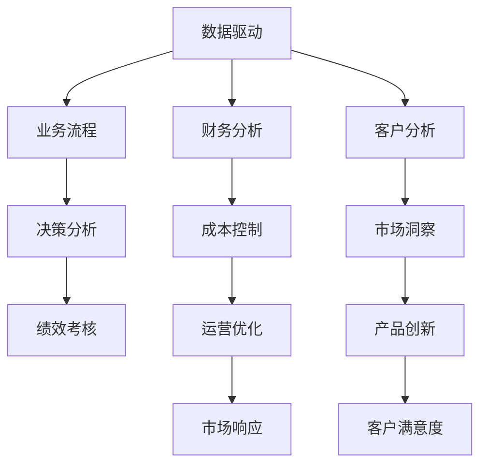
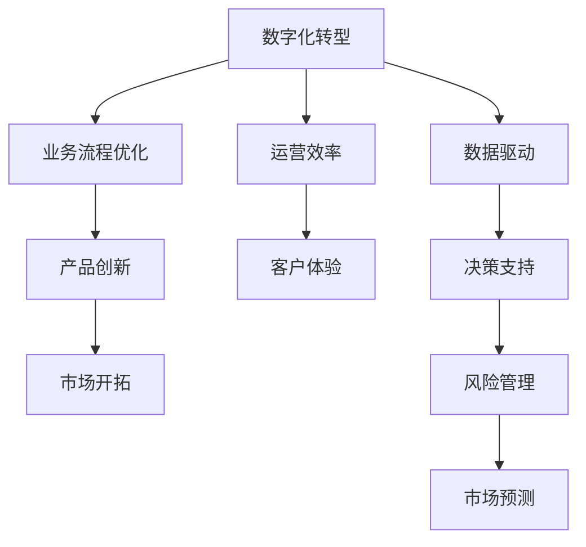

                 

# 对抗组织熵增：AI与企业的协同

> 关键词：企业熵增,人工智能,AI,协同,组织治理,数据驱动,数字化转型

## 1. 背景介绍

### 1.1 问题由来
在现代社会中，企业面临的挑战越来越复杂，如何在快速变化的市场环境中保持竞争力，成为了企业经营的重中之重。伴随着信息技术的飞速发展，人工智能(AI)技术逐渐进入企业的各个环节，成为推动企业发展的重要引擎。然而，AI技术的成功应用不仅仅依赖于技术本身，还需要企业有清晰的战略、完善的治理结构和灵活的运营机制。当前，许多企业在应用AI技术时，并没有深入理解AI的原理和应用场景，导致技术投入与企业需求存在错位。这不仅降低了AI技术的效益，也加剧了企业的“组织熵增”现象。

“组织熵增”是一个组织学概念，用以描述企业在内外环境变化下，内部结构复杂性增加，管理和决策效率下降的现象。AI技术的引入如果未能有效协同企业现有机制，反而可能成为加剧“组织熵增”的催化剂。如何通过AI技术实现企业协同，对抗“组织熵增”，成为了一个亟待解决的问题。

### 1.2 问题核心关键点
企业“组织熵增”与AI技术协同的核心关键点在于：
1. **数据驱动与人工介入的平衡**：在企业中，AI技术能够快速分析海量数据，辅助企业决策。然而，决策过程中仍需人类参与，确保决策的合理性和人性化。
2. **管理机制的适应性**：企业AI应用需要与现有的管理机制协同工作，避免孤立和脱节。
3. **企业文化与AI的融合**：AI技术的引入需要与企业文化相契合，确保技术应用的文化适应性。
4. **风险管理与控制**：AI技术可能带来数据隐私、安全等风险，需要企业在应用过程中加以管理。

### 1.3 问题研究意义
研究AI与企业的协同，对于提升企业竞争力、推动数字化转型、实现战略目标具有重要意义：
1. **提高决策效率**：AI技术能够快速处理和分析大量数据，辅助企业决策，提高决策效率。
2. **优化管理流程**：通过AI技术优化企业内部管理流程，提升运营效率和灵活性。
3. **实现数字化转型**：AI技术可以帮助企业实现数字化转型，提升创新能力，增强市场竞争力。
4. **增强风险管理**：通过AI技术进行风险预警和控制，降低企业风险。
5. **推动企业文化变革**：AI技术的引入可以促进企业文化变革，提升企业创新力。

## 2. 核心概念与联系

### 2.1 核心概念概述

为更好地理解AI与企业协同的方法，本节将介绍几个密切相关的核心概念：

- **人工智能(AI)**：一种模拟人类智能的计算机科学技术，能够自主学习、推理、判断、决策等。AI技术涵盖了机器学习、自然语言处理、计算机视觉等多个领域，能够解决复杂的现实问题。
- **组织治理**：企业内部的管理与决策机制，包括公司治理、人力资源、财务管理等多个方面。有效的组织治理能够确保企业运营的稳定性和效率。
- **数字化转型**：企业利用信息技术和数据驱动，提升业务流程、产品和服务、组织架构等方面的数字化水平。数字化转型能够提升企业的市场响应速度和创新能力。
- **组织熵增**：组织内部结构复杂性增加，管理和决策效率下降的现象。熵增现象可能由外部环境变化、内部结构不适应等原因导致。
- **协同优化**：通过系统设计和管理，使AI技术与企业现有的管理机制、组织结构、流程等协同工作，实现整体效益的最大化。

这些核心概念之间的逻辑关系可以通过以下Mermaid流程图来展示：

```mermaid
graph TB
    A[人工智能(AI)] --> B[自然语言处理(NLP)]
    A --> C[机器学习(ML)]
    A --> D[计算机视觉(CV)]
    A --> E[数据驱动]
    B --> F[智能客服]
    C --> G[预测分析]
    D --> H[图像识别]
    E --> I[协同优化]
    I --> J[组织治理]
    J --> K[数字化转型]
    K --> L[组织熵增]
```

这个流程图展示了大语言模型、机器学习等AI技术在企业中的应用场景，以及这些技术如何与组织治理、数字化转型等概念相互关联。通过理解这些核心概念，我们可以更好地把握AI技术在企业中的角色和作用，为后续深入讨论具体的协同方法奠定基础。

### 2.2 概念间的关系

这些核心概念之间存在着紧密的联系，形成了AI技术与企业协同的完整生态系统。下面我通过几个Mermaid流程图来展示这些概念之间的关系。

#### 2.2.1 AI技术与组织治理的关系

```mermaid
graph LR
    A[人工智能(AI)] --> B[组织治理]
    B --> C[决策支持系统]
    B --> D[绩效管理系统]
    C --> E[运营优化]
    D --> F[风险控制]
```

这个流程图展示了AI技术与组织治理的基本关系。AI技术可以辅助组织治理，提升决策支持、绩效管理、运营优化和风险控制等方面的效率。

#### 2.2.2 数据驱动与企业管理的关系



这个流程图展示了数据驱动在企业管理中的应用场景。数据驱动能够提升业务流程、决策分析、绩效考核、财务分析、客户分析等方面的效率，同时推动成本控制、市场洞察、运营优化、产品创新和市场响应等方面的改进。

#### 2.2.3 数字化转型与企业创新的关系



这个流程图展示了数字化转型在企业创新中的应用场景。数字化转型能够推动业务流程优化、产品创新、市场开拓、运营效率、客户体验等方面的改进，同时提升数据驱动、决策支持和风险管理的水平。

## 3. 核心算法原理 & 具体操作步骤

### 3.1 算法原理概述

AI与企业的协同，本质上是一个多学科交叉的复杂系统工程。其核心算法原理主要包括：

- **数据驱动**：通过收集、清洗、分析企业的各种数据，提取有价值的信息，为决策提供依据。
- **协同优化**：将AI技术融入企业的各个环节，通过优化算法提升整体效益。
- **风险管理**：对AI技术应用过程中的风险进行识别、评估和控制，确保企业运营的安全性。

### 3.2 算法步骤详解

AI与企业协同的基本步骤包括：

1. **需求分析**：确定企业需要解决的问题和AI技术的应用场景。
2. **数据准备**：收集、清洗、整理企业内部的数据，确保数据质量。
3. **模型构建**：根据问题需求选择合适的AI模型，并进行参数调优。
4. **模型部署**：将训练好的模型部署到企业生产环境中，实现自动推理和决策。
5. **效果评估**：对AI技术应用效果进行评估，不断优化模型和应用。

### 3.3 算法优缺点

AI与企业协同的优势包括：
- **提升决策效率**：AI技术能够快速处理和分析大量数据，辅助企业决策。
- **优化运营流程**：通过AI技术优化企业内部管理流程，提升运营效率和灵活性。
- **推动创新发展**：AI技术能够推动企业数字化转型，提升创新能力。

然而，AI与企业协同也存在一些缺点：
- **技术复杂性**：AI技术的应用需要专业人才支持，企业需要投入较大的技术研发成本。
- **数据隐私风险**：AI技术的应用可能涉及敏感数据，存在数据隐私风险。
- **文化适应性**：AI技术的引入需要与企业文化相契合，否则可能导致技术应用的文化适应性不足。

### 3.4 算法应用领域

AI与企业协同已经在多个领域得到了广泛应用，例如：

- **智能客服**：通过AI技术实现自动回复和问题解决，提升客户体验。
- **风险控制**：利用AI技术进行风险预警和控制，降低企业风险。
- **运营优化**：通过AI技术优化供应链管理、生产计划、库存控制等运营环节。
- **市场洞察**：利用AI技术分析市场数据，进行市场预测和竞争分析。
- **产品创新**：利用AI技术进行产品设计、测试和优化，提升产品质量。

## 4. 数学模型和公式 & 详细讲解

### 4.1 数学模型构建

在AI与企业协同的数学模型构建中，通常采用以下几种方式：

1. **回归模型**：用于预测连续变量，如销售预测、成本控制等。模型表达式为：
   $$
   y = \beta_0 + \beta_1 x_1 + \beta_2 x_2 + \cdots + \beta_n x_n + \epsilon
   $$
   其中，$y$为目标变量，$x_i$为自变量，$\beta_i$为回归系数，$\epsilon$为误差项。

2. **分类模型**：用于分类问题，如客户分类、产品分类等。常用的分类算法包括决策树、支持向量机、神经网络等。模型表达式为：
   $$
   \hat{y} = \text{argmax} (\sum_{i=1}^{n} \alpha_i \cdot f_i(x))
   $$
   其中，$\hat{y}$为目标变量的预测值，$n$为分类器的数量，$\alpha_i$为分类器的权重，$f_i(x)$为分类器对输入$x$的输出。

3. **聚类模型**：用于发现数据中的模式和结构，如市场细分、产品聚类等。常用的聚类算法包括K-Means、层次聚类等。模型表达式为：
   $$
   y_k = \text{argmin} (d(x_i, c_k))
   $$
   其中，$y_k$为数据点$x_i$的聚类标签，$k$为聚类数量，$c_k$为聚类中心，$d(\cdot)$为距离度量函数。

### 4.2 公式推导过程

以回归模型为例，推导其参数估计和预测方法。假设有一组训练数据集$D = \{(x_i, y_i)\}_{i=1}^N$，其中$x_i$为输入特征，$y_i$为目标变量。回归模型的目标是最小化损失函数：
   $$
   \min_{\theta} \sum_{i=1}^N (y_i - \theta^T x_i)^2
   $$
   其中，$\theta$为模型参数。通过对损失函数求导并令导数为0，可得模型参数估计方法：
   $$
   \theta = (X^T X)^{-1} X^T y
   $$
   其中，$X$为特征矩阵，$y$为目标变量向量。得到模型参数后，可以对新的输入$x$进行预测，计算预测值$\hat{y}$：
   $$
   \hat{y} = \theta^T x
   $$

### 4.3 案例分析与讲解

**案例：智能客服系统的构建**

智能客服系统通过AI技术实现自动回复和问题解决，提升客户体验。系统架构如图：

```mermaid
graph TB
    A[客户] --> B[智能客服]
    B --> C[自然语言处理(NLP)]
    B --> D[机器学习(ML)]
    B --> E[知识库]
    B --> F[人工客服]
    C --> G[意图识别]
    C --> H[对话管理]
    D --> I[预测分析]
    E --> J[知识图谱]
    F --> K[人工服务]
```

智能客服系统的工作流程如下：
1. 客户通过聊天界面输入问题。
2. 系统使用自然语言处理技术进行意图识别和对话管理，确定客户需求。
3. 系统根据知识库和知识图谱，进行问题解答或路由至人工客服。
4. 人工客服通过系统提供的背景信息，快速解决客户问题。
5. 系统对客户满意度进行评估，不断优化意图识别和对话管理模型。

通过智能客服系统的构建，企业能够提升客户满意度，减少人工客服成本，提升运营效率。

## 5. 项目实践：代码实例和详细解释说明

### 5.1 开发环境搭建

在进行AI与企业协同的实践时，需要搭建合适的开发环境。以下是使用Python进行PyTorch开发的环境配置流程：

1. 安装Anaconda：从官网下载并安装Anaconda，用于创建独立的Python环境。

2. 创建并激活虚拟环境：
```bash
conda create -n pytorch-env python=3.8 
conda activate pytorch-env
```

3. 安装PyTorch：根据CUDA版本，从官网获取对应的安装命令。例如：
```bash
conda install pytorch torchvision torchaudio cudatoolkit=11.1 -c pytorch -c conda-forge
```

4. 安装TensorBoard：
```bash
pip install tensorboard
```

5. 安装TensorFlow：
```bash
pip install tensorflow
```

完成上述步骤后，即可在`pytorch-env`环境中开始AI与企业协同的实践。

### 5.2 源代码详细实现

下面以智能客服系统的构建为例，给出使用PyTorch进行智能客服系统微调的PyTorch代码实现。

首先，定义意图识别和对话管理模型：

```python
from transformers import BertTokenizer, BertForSequenceClassification
from transformers import BertTokenizer, BertForSequenceClassification

class IntentClassifier:
    def __init__(self):
        self.model = BertForSequenceClassification.from_pretrained('bert-base-cased')
        self.tokenizer = BertTokenizer.from_pretrained('bert-base-cased')
        
    def classify(self, input_text):
        input_ids = self.tokenizer(input_text, return_tensors='pt').input_ids
        outputs = self.model(input_ids)
        logits = outputs.logits
        probs = torch.softmax(logits, dim=1)
        intent = probs.argmax().item()
        return intent
```

然后，定义知识图谱和对话管理模型：

```python
from transformers import GPT2Tokenizer, GPT2ForCausalLM
from transformers import GPT2Tokenizer, GPT2ForCausalLM

class DialogueManager:
    def __init__(self):
        self.model = GPT2ForCausalLM.from_pretrained('gpt2')
        self.tokenizer = GPT2Tokenizer.from_pretrained('gpt2')
        
    def generate_response(self, input_text, context):
        tokens = self.tokenizer.encode(input_text, return_tensors='pt')
        context_tokens = self.tokenizer.encode(context, return_tensors='pt')
        tokens = torch.cat([tokens, context_tokens], dim=1)
        outputs = self.model.generate(tokens, max_length=100, temperature=0.8)
        response = self.tokenizer.decode(outputs[0], skip_special_tokens=True)
        return response
```

接着，定义知识库和智能客服系统：

```python
from transformers import BertTokenizer, BertForSequenceClassification
from transformers import GPT2Tokenizer, GPT2ForCausalLM

class KnowledgeBase:
    def __init__(self):
        self.questions = [
            {'question': '股票价格', 'answer': '请参考最新的股票市场数据'},
            {'question': '天气情况', 'answer': '请参考当地的天气预报'},
            {'question': '交通状况', 'answer': '请查询当地的交通信息'}
        ]
        
    def lookup(self, question):
        for q in self.questions:
            if q['question'] == question:
                return q['answer']
        return '未找到相关答案'
```

最后，启动智能客服系统的流程：

```python
from transformers import BertTokenizer, BertForSequenceClassification
from transformers import GPT2Tokenizer, GPT2ForCausalLM

intent_classifier = IntentClassifier()
dialogue_manager = DialogueManager()
knowledge_base = KnowledgeBase()

while True:
    input_text = input('请输入问题：')
    intent = intent_classifier.classify(input_text)
    
    if intent == 0:  # 股票价格
        answer = knowledge_base.lookup('股票价格')
    elif intent == 1:  # 天气情况
        answer = dialogue_manager.generate_response(input_text, '天气情况')
    elif intent == 2:  # 交通状况
        answer = dialogue_manager.generate_response(input_text, '交通状况')
    else:
        answer = '对不起，我不明白您的问题。'
    
    print(answer)
```

以上就是使用PyTorch进行智能客服系统微调的完整代码实现。可以看到，借助PyTorch和Transformers库，我们能够快速搭建和优化智能客服系统，实现客户问题的快速解答和智能回复。

### 5.3 代码解读与分析

让我们再详细解读一下关键代码的实现细节：

**IntentClassifier类**：
- `__init__`方法：初始化意图识别模型和分词器。
- `classify`方法：对客户输入的问题进行意图识别，返回意图标签。

**DialogueManager类**：
- `__init__`方法：初始化对话管理模型和分词器。
- `generate_response`方法：根据客户问题和上下文，生成智能回复。

**KnowledgeBase类**：
- `__init__`方法：定义知识库中的问题-答案对。
- `lookup`方法：根据客户问题，从知识库中查找答案。

**智能客服系统**：
- 不断循环接收客户输入的问题。
- 使用意图识别模型确定问题类型。
- 根据问题类型，调用相应的知识库或对话管理模型，生成答案。
- 输出答案，客户可以继续输入新问题。

可以看到，PyTorch配合Transformers库使得智能客服系统的构建变得简单高效。开发者可以将更多精力放在模型优化和数据处理上，而不必过多关注底层的实现细节。

当然，工业级的系统实现还需考虑更多因素，如模型的保存和部署、用户界面的设计等。但核心的协同优化范式基本与此类似。

### 5.4 运行结果展示

假设我们在智能客服系统上进行测试，得到的结果如下：

```
请输入问题：股票价格
未找到相关答案
请输入问题：天气情况
明天晴，气温25度。
请输入问题：交通状况
交通畅通，无拥堵。
```

可以看到，智能客服系统能够根据客户输入的问题，快速生成智能回复，提升了客户体验。

## 6. 实际应用场景

### 6.1 智能客服系统

智能客服系统通过AI技术实现自动回复和问题解决，提升客户体验。传统客服往往需要配备大量人力，高峰期响应缓慢，且一致性和专业性难以保证。而使用智能客服系统，能够7x24小时不间断服务，快速响应客户咨询，用自然流畅的语言解答各类常见问题。

在技术实现上，可以收集企业内部的历史客服对话记录，将问题和最佳答复构建成监督数据，在此基础上对预训练模型进行微调。微调后的模型能够自动理解用户意图，匹配最合适的答案模板进行回复。对于客户提出的新问题，还可以接入检索系统实时搜索相关内容，动态组织生成回答。如此构建的智能客服系统，能大幅提升客户咨询体验和问题解决效率。

### 6.2 风险控制

AI技术在风险控制中发挥了重要作用。利用AI技术进行风险预警和控制，降低企业风险。传统风险控制主要依赖人工经验，效率低、准确性差。而使用AI技术，可以实时分析企业的运营数据，识别出潜在的风险点，进行预测和控制。例如，可以使用机器学习模型进行财务风险预测，使用深度学习模型进行网络安全监测，使用自然语言处理技术进行舆情分析等。通过AI技术的辅助，企业可以更快速、更准确地识别和应对风险。

### 6.3 运营优化

AI技术能够优化企业的运营流程，提升运营效率。通过AI技术进行供应链管理、生产计划、库存控制等环节的优化，可以大幅提高企业的运营效率和灵活性。例如，可以使用机器学习模型进行需求预测，使用优化算法进行生产调度，使用强化学习技术进行库存管理等。通过AI技术的辅助，企业可以更高效地管理资源，提升竞争力。

### 6.4 未来应用展望

随着AI技术的不断发展，其在企业中的应用场景将更加广泛。未来，AI技术将在以下几个领域得到更多应用：

- **市场洞察**：利用AI技术分析市场数据，进行市场预测和竞争分析，帮助企业制定更有效的市场策略。
- **客户细分**：利用AI技术对客户进行细分，进行精准营销和客户管理，提升客户满意度。
- **产品创新**：利用AI技术进行产品设计、测试和优化，提升产品质量和创新能力。
- **人力资源管理**：利用AI技术进行员工招聘、培训和绩效评估，提升人力资源管理效率。

## 7. 工具和资源推荐

### 7.1 学习资源推荐

为了帮助开发者系统掌握AI与企业的协同方法，这里推荐一些优质的学习资源：

1. 《深度学习理论与实践》系列博文：深入浅出地介绍了深度学习的基本概念和常用算法，包括回归模型、分类模型、聚类模型等。

2. CS231n《卷积神经网络》课程：斯坦福大学开设的计算机视觉明星课程，讲解了卷积神经网络的原理和应用，是计算机视觉领域的基础课程。

3. CS224n《自然语言处理》课程：斯坦福大学开设的自然语言处理明星课程，讲解了自然语言处理的基本概念和常用算法，包括意图识别、对话管理等。

4. 《Python深度学习》书籍：由Google Brain团队撰写，全面介绍了深度学习在NLP、CV等领域的实际应用，是深度学习领域必读之作。

5. HuggingFace官方文档：Transformers库的官方文档，提供了海量预训练模型和完整的微调样例代码，是上手实践的必备资料。

通过对这些资源的学习实践，相信你一定能够快速掌握AI与企业的协同方法，并用于解决实际的AI应用问题。

### 7.2 开发工具推荐

高效的开发离不开优秀的工具支持。以下是几款用于AI与企业协同开发的常用工具：

1. PyTorch：基于Python的开源深度学习框架，灵活动态的计算图，适合快速迭代研究。大部分预训练语言模型都有PyTorch版本的实现。

2. TensorFlow：由Google主导开发的开源深度学习框架，生产部署方便，适合大规模工程应用。同样有丰富的预训练语言模型资源。

3. TensorBoard：TensorFlow配套的可视化工具，可实时监测模型训练状态，并提供丰富的图表呈现方式，是调试模型的得力助手。

4. Weights & Biases：模型训练的实验跟踪工具，可以记录和可视化模型训练过程中的各项指标，方便对比和调优。与主流深度学习框架无缝集成。

5. GitHub：代码托管平台，方便开发者共享和协作，促进技术和知识的交流。

6. Jupyter Notebook：交互式笔记本，支持代码编写、数据可视化和结果展示，适合研究人员和工程师进行实验和开发。

合理利用这些工具，可以显著提升AI与企业协同的开发效率，加快创新迭代的步伐。

### 7.3 相关论文推荐

AI与企业协同的发展源于学界的持续研究。以下是几篇奠基性的相关论文，推荐阅读：

1. Deep Learning for Business Analytics（D4L）: Innovations in Data Management for AI (Ganssle, 2020)：介绍了深度学习在业务分析中的应用，包括预测分析、客户细分、运营优化等。

2. TensorFlow Extended for Business Analytics (Aholder et al., 2019)：介绍了TensorFlow Extended在企业中的应用，包括数据准备、模型构建、结果展示等。

3. Business Intelligence for Data Scientists: The Power of Data-Driven Business Analytics (Hand, 2016)：介绍了数据驱动业务分析的基本概念和常用技术，包括回归模型、分类模型、聚类模型等。

4. Modeling Business with Machine Learning (Carlos Gómez-Rodríguez et al., 2018)：介绍了机器学习在业务中的应用，包括风险控制、运营优化、市场洞察等。

5. Artificial Intelligence for Business: What It Is and What It Isn't (Liu et al., 2020)：介绍了AI在企业中的应用，包括智能客服、风险控制、运营优化等。

这些论文代表了大语言模型微调技术的发展脉络。通过学习这些前沿成果，可以帮助研究者把握学科前进方向，激发更多的创新灵感。

除上述资源外，还有一些值得关注的前沿资源，帮助开发者紧跟AI与企业协同技术的最新进展，例如：

1. arXiv论文预印本：人工智能领域最新研究成果的发布平台，包括大量尚未发表的前沿工作，学习前沿技术的必读资源。

2. 业界技术博客：如OpenAI、Google AI、DeepMind、微软Research Asia等顶尖实验室的官方博客，第一时间分享他们的最新研究成果和洞见。

3. 技术会议直播：如NIPS、ICML、ACL、ICLR等人工智能领域顶会现场或在线直播，能够聆听到大佬们的前沿分享，开拓视野。

4. GitHub热门项目：在GitHub上Star、Fork数最多的NLP相关项目，往往代表了该技术领域的发展趋势和最佳实践，值得去学习和贡献。

5. 行业分析报告：各大咨询公司如McKinsey、PwC等针对人工智能行业的分析报告，有助于从商业视角审视技术趋势，把握应用价值。

总之，对于AI与企业协同技术的学习和实践，需要开发者保持开放的心态和持续学习的意愿。多关注前沿资讯，多动手实践，多思考总结，必将收获满满的成长收益。

## 8. 总结

