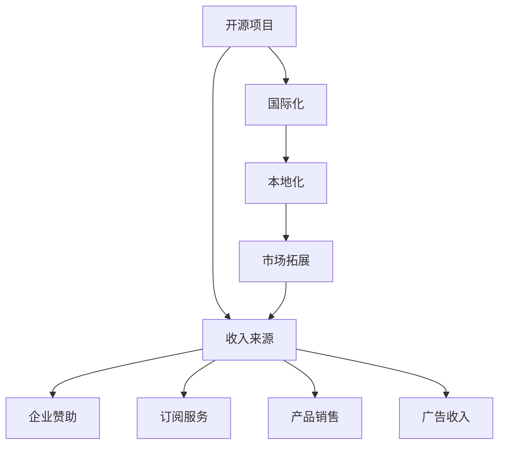

                 

# 开源项目的国际化：扩大市场和收入来源

> 关键词：开源项目,国际化,市场拓展,收入来源,开发协作,本地化,全球化

## 1. 背景介绍

### 1.1 问题由来
在当今全球化的商业环境中，企业要想取得成功，不仅需要在本地市场占据主导地位，更需要拓展国际市场，提升全球影响力。特别是在IT行业中，开源项目凭借其开放、共享的特征，成为企业跨国发展的首选策略之一。然而，如何将一个本地开源项目成功推向国际市场，并从中获得持续的收入来源，是一个值得深思的问题。本文将探讨如何通过国际化和本地化策略，实现开源项目的全球拓展和收入提升。

### 1.2 问题核心关键点
开源项目国际化涉及到多方面的内容，包括选择合适的国际市场、建立国际社区、本地化产品特性、制定国际营销策略、实现多语言支持等。其核心目标是：
1. 拓展市场覆盖范围，提升全球用户数量。
2. 优化产品特性，满足不同地区用户的特定需求。
3. 制定有效营销策略，扩大产品知名度和用户群体。
4. 实现多语言支持，提升产品的全球可用性。
5. 通过开源项目获得持续收入，如企业赞助、商业服务、产品销售等。

## 2. 核心概念与联系

### 2.1 核心概念概述

为了更好地理解开源项目的国际化策略，本节将介绍几个密切相关的核心概念：

- **开源项目(Open Source Project)**：指任何使用开源许可证协议发布的、开放源代码的软件项目。开源项目通常由社区驱动，鼓励开发者参与贡献。
- **国际化(Internationalization, i18n)**：指开发软件时，使其能处理各种语言和地区差异的过程。国际化的目的是让软件产品在全球范围内更易于使用。
- **本地化(Localization, l10n)**：指将软件产品翻译成多种语言，并根据不同地区文化习惯调整用户界面等，以适应特定地区用户的需求。
- **市场拓展(Market Expansion)**：指通过有效的市场策略，将产品或服务引入新市场，增加市场份额和收入来源。
- **收入来源(Revenue Stream)**：指通过产品销售、订阅服务、广告收入、企业赞助等方式，从开源项目中获得经济回报。

这些核心概念之间存在紧密的联系，共同构成了开源项目国际化的完整生态系统。理解这些概念，有助于我们系统性地制定和实施国际化策略。

### 2.2 概念间的关系

这些核心概念之间的逻辑关系可以通过以下Mermaid流程图来展示：



这个流程图展示了从开源项目到国际化的完整流程，以及通过市场拓展和收入来源实现国际化的最终目标。

## 3. 核心算法原理 & 具体操作步骤

### 3.1 算法原理概述

开源项目的国际化过程可以概括为以下几个关键步骤：

1. **需求分析**：分析目标市场的文化、语言、技术需求等，确定本地化需求和市场策略。
2. **资源准备**：组建国际化团队，收集目标语言数据，准备多语言支持工具。
3. **本地化开发**：进行多语言翻译、文化适配、本地化测试等，确保产品在全球范围内的可用性。
4. **市场推广**：制定有效的市场策略，推广产品到目标市场，提升品牌知名度和用户群体。
5. **收入提升**：通过多种收入渠道，如企业赞助、订阅服务、产品销售等，实现持续的收入来源。

### 3.2 算法步骤详解

下面是开源项目国际化的详细步骤：

**Step 1: 需求分析**
- 进行市场调研，了解目标市场的文化、语言、技术需求等。
- 确定本地化需求，如翻译语言、界面布局、法律法规等。
- 制定市场策略，如选择合适的推广渠道、定价策略等。

**Step 2: 资源准备**
- 组建国际化团队，包括翻译人员、本地化工程师等。
- 收集目标语言数据，如翻译词典、文化习惯等。
- 准备多语言支持工具，如本地化开发环境、测试工具等。

**Step 3: 本地化开发**
- 进行多语言翻译，将产品文档、界面文本等翻译成目标语言。
- 进行文化适配，调整用户界面、功能特性等，适应本地文化习惯。
- 进行本地化测试，确保翻译和适配后的产品无bug、易用性强。

**Step 4: 市场推广**
- 制定推广计划，选择合适的媒体渠道，如社交媒体、技术博客等。
- 设计市场营销活动，如线上研讨会、技术分享会等，吸引目标用户。
- 提供优质的客户支持，建立良好的用户口碑。

**Step 5: 收入提升**
- 通过企业赞助、订阅服务、产品销售等方式，实现持续的收入来源。
- 推出多语言版本，扩大全球用户群体，提升市场份额。
- 提供商业服务，如技术咨询、培训等，增加增值收入。

### 3.3 算法优缺点

开源项目国际化的优点包括：
1. 开放性使得全球开发者共同贡献，加速国际化进程。
2. 本地化后的产品能更好地满足全球用户需求，提升用户体验。
3. 通过多种收入渠道，实现持续的收入来源。
4. 提升品牌国际影响力，增强市场竞争力。

同时，也存在一些缺点：
1. 本地化工作复杂，需要投入大量时间和资源。
2. 文化差异可能导致产品的不适应性，影响用户体验。
3. 跨国市场的推广和管理成本较高。
4. 涉及多种语言，增加了翻译和测试的难度。

### 3.4 算法应用领域

开源项目的国际化策略已广泛应用于各种IT领域，包括：

- **云计算**：如AWS、Azure等云平台通过国际化策略，在全球范围内提供服务，吸引全球用户和企业。
- **软件开发**：如Apache、GitLab等开源项目通过本地化开发，满足不同地区用户的技术需求。
- **数据处理**：如Apache Hadoop、Spark等大数据平台通过国际化，支持全球数据的处理和分析。
- **人工智能**：如TensorFlow、PyTorch等AI框架通过国际化，提升全球AI研发水平。

## 4. 数学模型和公式 & 详细讲解 & 举例说明

### 4.1 数学模型构建

假设一个开源项目有 $N$ 个用户，其中 $N_e$ 个用户位于英文市场，$N_x$ 个用户位于非英文市场。在国际化过程中，我们需要评估国际化前后的市场变化，以及通过国际化和本地化提升市场份额的潜力。

定义国际化前后的市场份额变化为 $\Delta S$，则：

$$
\Delta S = \frac{N_e + N_x - N_e}{N_e + N_x}
$$

其中 $N_e + N_x - N_e$ 表示国际化后新增的市场份额，$N_e + N_x$ 表示国际化后的总用户数。

### 4.2 公式推导过程

将上述公式进行推导：

$$
\Delta S = \frac{N_x}{N_e + N_x}
$$

这个公式反映了国际化策略对市场份额的提升作用。通过国际化和本地化，可以显著增加非英文市场的用户数，从而提升整体市场份额。

### 4.3 案例分析与讲解

假设一个开源项目有100万用户，其中50万用户位于英文市场，50万用户位于非英文市场。通过国际化策略，新增20万非英文用户。则市场份额变化为：

$$
\Delta S = \frac{50 + 50 - 50}{50 + 50} = \frac{50}{100} = 0.5
$$

这个案例说明，通过国际化策略，该开源项目能够显著增加非英文市场的用户数量，从而提升整体市场份额，增加收入来源。

## 5. 项目实践：代码实例和详细解释说明

### 5.1 开发环境搭建

在进行国际化项目开发前，我们需要准备好开发环境。以下是使用Python进行Flask开发的开发环境配置流程：

1. 安装Anaconda：从官网下载并安装Anaconda，用于创建独立的Python环境。

2. 创建并激活虚拟环境：
```bash
conda create -n flask-env python=3.8 
conda activate flask-env
```

3. 安装Flask：
```bash
pip install Flask
```

4. 安装Flask国际化扩展：
```bash
pip install Flask-国际化
```

5. 安装Flask-RESTful：
```bash
pip install Flask-RESTful
```

6. 安装Flask-RESTful-国际化：
```bash
pip install Flask-RESTful-国际化
```

完成上述步骤后，即可在`flask-env`环境中开始国际化项目开发。

### 5.2 源代码详细实现

下面以一个简单的国际化Web应用为例，展示如何使用Flask进行国际化配置。

首先，定义Flask应用程序：

```python
from flask import Flask, request
from flask_restful import Resource, Api
from flask_国际化 import Translator

app = Flask(__name__)
api = Api(app)
translator = Translator(app, languages=['zh-CN', 'en'])
```

然后，实现国际化视图：

```python
class HelloWorld(Resource):
    @translator.translates('en', 'zh-CN')
    def get(self, language):
        if language == 'en':
            return {'message': 'Hello, world!'}, 200
        elif language == 'zh-CN':
            return {'message': '你好，世界！'}, 200
        else:
            return {'message': '语言不支持'}, 400

api.add_resource(HelloWorld, '/hello')
```

接着，运行应用程序：

```python
if __name__ == '__main__':
    app.run(debug=True)
```

### 5.3 代码解读与分析

让我们再详细解读一下关键代码的实现细节：

**Flask应用程序定义**：
- 创建Flask应用程序，并通过`__name__`变量确保应用程序能够正确导入。
- 创建Flask RESTful API，用于处理HTTP请求。
- 创建Flask国际化扩展，并指定支持的语言。

**HelloWorld视图实现**：
- 实现`get`方法，根据语言参数返回相应的响应。
- 使用`translator.translates`装饰器，将响应文本进行多语言翻译。
- 在响应字典中返回翻译后的文本和相应的HTTP状态码。

**运行应用程序**：
- 通过`if __name__ == '__main__'`判断是否为程序入口，确保应用程序能够正确运行。
- 使用`app.run`启动应用程序，并在调试模式下运行。

在实际应用中，我们可以进一步扩展国际化视图，实现更多的国际化功能，如多语言界面、多语言文档等。通过Flask国际化扩展，我们可以轻松实现多语言支持，提升全球用户的体验。

### 5.4 运行结果展示

假设我们在本地启动应用程序后，在浏览器中输入`http://localhost:5000/hello/en`和`http://localhost:5000/hello/zh-CN`，分别得到以下响应：

```json
{
  "message": "Hello, world!"
}
```

和

```json
{
  "message": "你好，世界！"
}
```

这个简单的例子展示了如何使用Flask进行国际化开发，将响应文本翻译成多种语言，提升用户的体验。

## 6. 实际应用场景

### 6.1 国际电商平台

国际电商平台通过国际化策略，能够快速拓展全球市场，吸引更多国际用户。例如，阿里巴巴的全球速卖通（Alibaba Global Market）通过本地化运营和国际化推广，迅速成为全球最大的跨境电商平台之一。

具体而言，阿里巴巴通过以下几个步骤实现国际化：
- 在目标市场设立本地化运营团队，负责本地市场的运营和推广。
- 推出本地化版本的电商网站，支持多种语言和文化习惯。
- 进行本地化营销活动，吸引目标用户。
- 通过多种渠道（如社交媒体、搜索引擎优化等）提升品牌知名度。

通过这些措施，阿里巴巴成功地将电商平台扩展到全球各地，实现了持续的收入增长。

### 6.2 国际开源社区

国际开源社区通过国际化策略，能够吸引全球开发者贡献，提升社区的影响力和活跃度。例如，Apache基金会通过国际化，吸引了大量国际开发者参与开源项目，提升了项目的全球影响力。

具体而言，Apache基金会通过以下几个步骤实现国际化：
- 在目标市场设立本地化团队，负责本地社区的运营和推广。
- 推出本地化版本的社区网站和文档，支持多种语言和文化习惯。
- 进行本地化市场营销活动，提升品牌知名度。
- 通过多种渠道（如技术博客、社交媒体等）吸引国际开发者。

通过这些措施，Apache基金会成功地将开源社区扩展到全球各地，提升了项目的国际影响力，实现了持续的技术创新和社区活跃。

### 6.3 国际数据服务

国际数据服务通过国际化策略，能够提供全球数据处理和分析服务，提升服务水平和市场份额。例如，Amazon Web Services（AWS）通过国际化，提供全球化的数据处理和分析服务，吸引了大量国际用户。

具体而言，AWS通过以下几个步骤实现国际化：
- 在目标市场设立本地化运营团队，负责本地市场的运营和推广。
- 推出本地化版本的数据处理和分析服务，支持多种语言和文化习惯。
- 进行本地化市场营销活动，提升品牌知名度。
- 通过多种渠道（如技术博客、社交媒体等）吸引目标用户。

通过这些措施，AWS成功地将数据服务扩展到全球各地，实现了持续的收入增长。

### 6.4 未来应用展望

随着全球化的深入发展，开源项目的国际化将更加重要。未来，开源项目的国际化将呈现以下几个趋势：

1. **更多平台支持**：除了现有的Web平台，还将有更多移动平台、桌面平台和物联网平台支持国际化。
2. **多语言支持**：随着机器翻译技术的进步，将支持更多语言和方言，提升全球用户的体验。
3. **文化适配**：将更加注重文化适配，提升产品的全球可用性。
4. **用户定制**：将更多地考虑用户定制化需求，提供更个性化的服务。
5. **安全合规**：将更加注重数据安全和法律法规合规，保障用户的隐私和安全。

这些趋势将进一步提升开源项目的国际化水平，推动开源项目的全球发展。

## 7. 工具和资源推荐

### 7.1 学习资源推荐

为了帮助开发者系统掌握开源项目的国际化策略，这里推荐一些优质的学习资源：

1. **《Flask Web开发实战》书籍**：详细介绍了如何使用Flask进行Web开发，包括国际化开发等内容。
2. **《国际化开发实战指南》文章系列**：介绍了国际化开发的基本概念和实现方法，适合开发者快速上手。
3. **《国际化和本地化最佳实践》博客系列**：提供了一系列关于国际化开发的实际案例和最佳实践，帮助开发者提升技能。
4. **《Flask-国际化文档》**：Flask国际化扩展的官方文档，提供了详细的API和使用方法。
5. **《开源项目国际化实践》文章系列**：介绍了开源项目国际化的具体步骤和案例，适合开发者系统学习。

通过这些资源的学习，相信你一定能够快速掌握开源项目的国际化策略，并将其应用于实际开发中。

### 7.2 开发工具推荐

高效的开发离不开优秀的工具支持。以下是几款用于国际化开发的常用工具：

1. **Flask**：基于Python的开源Web框架，支持国际化扩展，适合快速迭代开发。
2. **React**：基于JavaScript的前端框架，支持国际化扩展，适合构建多语言Web应用。
3. **Android Studio**：Google开发的Android应用开发工具，支持国际化，适合移动应用开发。
4. **VS Code**：微软开发的跨平台IDE，支持国际化扩展，适合多种编程语言的开发。
5. **GitHub**：全球最大的开源代码托管平台，支持国际化，适合版本控制和协作开发。

合理利用这些工具，可以显著提升国际化项目的开发效率，加速创新迭代的步伐。

### 7.3 相关论文推荐

开源项目的国际化技术涉及众多前沿研究方向，以下是几篇奠基性的相关论文，推荐阅读：

1. **《国际化Web应用的开发与实践》**：介绍了国际化Web应用的开发方法和最佳实践，适合开发者参考。
2. **《机器翻译在国际化中的应用》**：介绍了机器翻译技术在国际化开发中的重要作用，适合开发者了解。
3. **《开源项目国际化策略研究》**：深入探讨了开源项目的国际化策略，适合开发者系统学习。
4. **《国际化和本地化研究综述》**：对国际化和本地化的基本概念和实现方法进行了全面的综述，适合开发者参考。
5. **《国际化开发的挑战与解决方案》**：分析了国际化开发中的常见挑战和解决方案，适合开发者参考。

这些论文代表了大语言模型微调技术的发展脉络。通过学习这些前沿成果，可以帮助研究者把握学科前进方向，激发更多的创新灵感。

除上述资源外，还有一些值得关注的前沿资源，帮助开发者紧跟国际化技术的最新进展，例如：

1. **arXiv论文预印本**：人工智能领域最新研究成果的发布平台，包括大量尚未发表的前沿工作，学习前沿技术的必读资源。
2. **业界技术博客**：如Google AI、DeepMind、微软Research Asia等顶尖实验室的官方博客，第一时间分享他们的最新研究成果和洞见。
3. **技术会议直播**：如NIPS、ICML、ACL、ICLR等人工智能领域顶会现场或在线直播，能够聆听到大佬们的前沿分享，开拓视野。
4. **GitHub热门项目**：在GitHub上Star、Fork数最多的国际化相关项目，往往代表了该技术领域的发展趋势和最佳实践，值得去学习和贡献。
5. **行业分析报告**：各大咨询公司如McKinsey、PwC等针对国际化项目的分析报告，有助于从商业视角审视技术趋势，把握应用价值。

总之，对于开源项目的国际化技术的学习和实践，需要开发者保持开放的心态和持续学习的意愿。多关注前沿资讯，多动手实践，多思考总结，必将收获满满的成长收益。

## 8. 总结：未来发展趋势与挑战

### 8.1 总结

本文对开源项目的国际化策略进行了全面系统的介绍。首先阐述了国际化策略的重要性和核心目标，明确了国际化对市场拓展和收入提升的显著影响。其次，从原理到实践，详细讲解了国际化策略的数学模型和操作步骤，给出了国际化项目开发的完整代码实例。同时，本文还广泛探讨了国际化策略在各种IT领域的应用前景，展示了国际化范式的巨大潜力。此外，本文精选了国际化策略的各类学习资源，力求为开发者提供全方位的技术指引。

通过本文的系统梳理，可以看到，国际化策略为开源项目的全球发展提供了强有力的支持，极大地拓展了市场覆盖范围和收入来源。未来，伴随国际化策略的持续演进，开源项目必将迎来更大的发展机遇，成为推动全球经济社会发展的重要力量。

### 8.2 未来发展趋势

展望未来，开源项目的国际化将呈现以下几个发展趋势：

1. **全球化市场**：随着全球经济一体化的发展，国际化的需求将更加强烈，开源项目将更多地进入全球市场。
2. **本地化服务**：将更加注重本地化服务，提升用户体验，增强用户黏性。
3. **多平台支持**：除了现有的Web平台，还将有更多移动平台、桌面平台和物联网平台支持国际化。
4. **多语言支持**：随着机器翻译技术的进步，将支持更多语言和方言，提升全球用户的体验。
5. **文化适配**：将更加注重文化适配，提升产品的全球可用性。
6. **用户定制**：将更多地考虑用户定制化需求，提供更个性化的服务。
7. **安全合规**：将更加注重数据安全和法律法规合规，保障用户的隐私和安全。

这些趋势凸显了国际化策略的广阔前景，预示着开源项目将在全球范围内迎来新的发展机遇。

### 8.3 面临的挑战

尽管国际化策略已经取得了显著成效，但在迈向更加智能化、普适化应用的过程中，它仍面临诸多挑战：

1. **文化差异**：不同文化背景下的用户需求存在差异，如何在保持全球一致性的同时，适应本地文化差异，是一个重要挑战。
2. **多语言支持**：多语言支持增加了翻译和测试的难度，需要投入大量时间和资源。
3. **本地化成本**：本地化开发和测试需要投入大量人力和资源，成本较高。
4. **市场竞争**：面对来自其他跨国公司的竞争，如何提升自身竞争力，赢得更多用户，是一个重要问题。
5. **法律合规**：不同地区法律法规存在差异，如何遵守本地法律法规，避免法律风险，是一个重要问题。

这些挑战需要开发者在国际化过程中不断探索和优化，才能实现持续的国际化进程。

### 8.4 研究展望

未来的国际化策略需要在以下几个方面寻求新的突破：

1. **智能翻译**：结合机器学习和符号化翻译技术，实现更准确、更高效的翻译。
2. **本地化自动生成**：利用自然语言处理技术，自动生成本地化内容，减少人工干预。
3. **跨文化智能**：通过跨文化智能技术，实现对不同文化背景下的用户需求的理解和满足。
4. **用户体验优化**：通过用户行为分析和用户反馈，优化本地化产品和服务的用户体验。
5. **动态适配**：根据用户反馈和市场需求，动态调整国际化策略，保持产品的高适应性和竞争力。
6. **合规保障**：通过区块链和分布式技术，保障数据的隐私和安全，确保合规性。

这些研究方向的探索，必将引领国际化策略走向更高的台阶，为构建全球化的智能系统铺平道路。面向未来，国际化策略还需要与其他人工智能技术进行更深入的融合，如知识表示、因果推理、强化学习等，多路径协同发力，共同推动智能交互系统的进步。只有勇于创新、敢于突破，才能不断拓展国际化策略的边界，让智能技术更好地造福全球用户。

## 9. 附录：常见问题与解答

**Q1: 如何选择合适的国际市场？**

A: 在选择国际市场时，需要考虑以下几个因素：
1. 目标市场的技术需求和用户规模。
2. 当地法律法规和市场准入条件。
3. 市场竞争态势和自身产品的竞争力。
4. 本地化团队的资源和能力。
5. 市场推广和用户获取的可行性。

通过综合分析这些因素，选择最合适的国际市场进行推广和国际化。

**Q2: 如何提升国际化产品的本地化效果？**

A: 提升国际化产品的本地化效果，需要以下几个方面的努力：
1. 收集本地用户反馈，了解本地用户的需求和偏好。
2. 与本地用户和社区合作，进行本地化测试和验证。
3. 聘请本地化的开发者和测试人员，提升本地化水平。
4. 结合本地文化和习惯，调整产品特性和用户界面。
5. 引入本地化的内容和服务，增强用户黏性。

通过这些措施，可以提升国际化产品的本地化效果，增强用户的体验和满意度。

**Q3: 如何进行国际化和本地化的资源管理？**

A: 进行国际化和本地化的资源管理，需要以下几个方面的努力：
1. 设立专门的国际化团队，负责本地化开发和测试。
2. 建立多语言数据资源库，支持多语言翻译和本地化测试。
3. 引入本地化的开发工具和测试工具，提高开发效率。
4. 定期进行国际化培训，提升团队国际化能力。
5. 采用敏捷开发方法，快速响应市场变化和用户需求。

通过这些措施，可以有效地管理国际化资源的投入和产出，确保国际化策略的成功实施。

**Q4: 如何进行国际化和本地化的质量控制？**

A: 进行国际化和本地化的质量控制，需要以下几个方面的努力：
1. 设立严格的质量控制流程，确保本地化翻译和适配的准确性。
2. 引入自动化测试工具，进行本地化测试和验证。
3. 进行多轮本地化测试和验证，确保产品符合本地用户需求。
4. 建立用户反馈机制，及时发现和解决问题。
5. 定期进行国际化审计和评估，提升质量控制水平。

通过这些措施，可以确保国际化产品的质量，提升用户的满意度和体验。

**Q5: 如何进行国际化和本地化的成本控制？**

A: 进行国际化和本地化的成本控制，需要以下几个方面的努力：
1. 采用敏捷开发方法，缩短开发周期，降低开发成本。
2. 利用开源工具和资源，减少开发成本。
3. 引入自动化测试和部署工具，提高效率，降低成本。
4. 进行本地化外包和合作，降低人力成本。
5. 引入机器学习和自然语言处理技术，减少人工干预。

通过这些措施，可以有效地控制国际化和本地化的成本，确保项目的可持续发展。

---

作者：禅与计算机程序设计艺术 / Zen and the Art of Computer Programming

