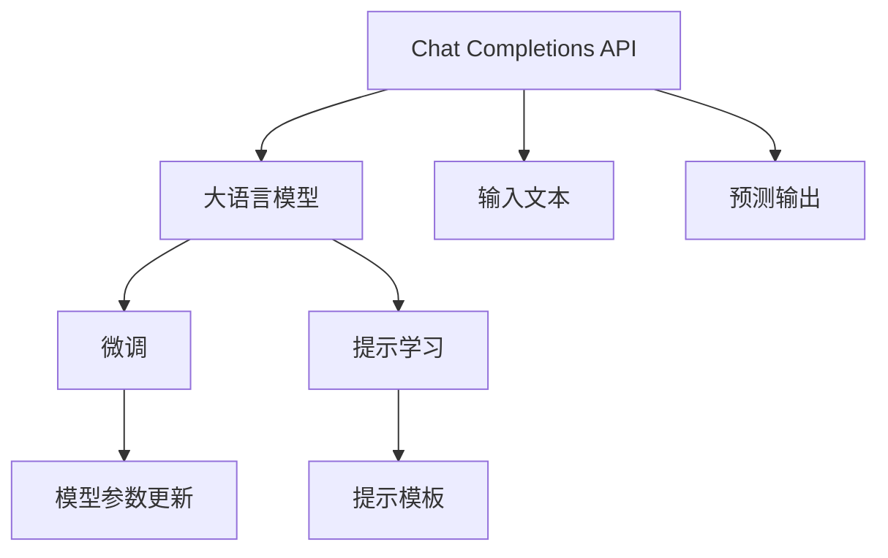

                 

# OpenAI Chat Completions API

## 1. 背景介绍

随着人工智能技术的快速发展，OpenAI推出的ChatGPT等大语言模型吸引了广泛的关注。这些模型在处理自然语言生成、对话交互等任务上取得了显著的成果，展示了强大的语言理解和生成能力。为了更好地推广和应用这些模型，OpenAI发布了Chat Completions API，让开发者能够在自己的应用中集成ChatGPT的功能，实现更加智能的交互体验。本文将详细介绍OpenAI Chat Completions API的核心概念、工作原理、使用方法，并探讨其在实际应用场景中的应用潜力。

## 2. 核心概念与联系

### 2.1 核心概念概述

为了理解Chat Completions API的工作原理，本节将介绍几个关键概念：

- **Chat Completions API**：OpenAI提供的一种API，用于在开发者自己的应用中集成ChatGPT等大语言模型的功能。通过API，开发者可以向模型发送输入文本，获取模型的预测输出，实现自然语言处理和生成。
- **大语言模型**：指一类基于Transformer结构、采用自监督预训练方式学习自然语言表示的深度学习模型，如GPT、BERT等。这类模型在自然语言理解和生成任务上表现出色。
- **微调与提示学习**：指在大语言模型的预训练基础上，通过微调或设计特定的提示模板，引导模型输出符合任务要求的文本。微调是调整模型参数，而提示学习则通过输入格式来影响模型输出。

这些概念共同构成了Chat Completions API的核心框架，用于实现自然语言处理和生成任务。

### 2.2 概念间的关系

这些概念之间存在着密切的联系，构成了Chat Completions API的基本架构。我们可以用以下Mermaid流程图来展示它们之间的关系：



这个流程图展示了Chat Completions API的核心架构：

1. Chat Completions API向大语言模型发送输入文本。
2. 大语言模型根据输入文本生成预测输出。
3. 微调过程不断调整模型参数，提升模型性能。
4. 提示学习通过设计提示模板，引导模型生成符合任务要求的文本。

## 3. 核心算法原理 & 具体操作步骤
### 3.1 算法原理概述

OpenAI Chat Completions API的核心原理是利用大语言模型的预测能力，将输入文本作为模型的“提示”，通过预测模型生成后续文本。其工作流程大致如下：

1. **输入文本预处理**：将用户输入的文本进行分词、编码等预处理，转换为模型能够接受的输入格式。
2. **模型预测**：将预处理后的输入文本输入到大语言模型，模型通过编码器计算输入文本的表示，然后通过解码器生成后续文本。
3. **输出后处理**：将模型生成的文本进行解码、截断等后处理，确保输出的文本符合任务要求。

在微调和提示学习的帮助下，模型能够更好地适应特定任务，生成高质量的文本输出。

### 3.2 算法步骤详解

Chat Completions API的具体操作步骤如下：

**Step 1: 环境搭建**

在开始使用Chat Completions API之前，需要搭建相应的开发环境。

1. 安装Python：确保你的系统中已安装Python，建议使用3.8或更高版本。
2. 安装OpenAI库：通过pip安装OpenAI库，可以在命令行输入以下命令：

   ```bash
   pip install openai
   ```

   安装完成后，可以通过`openai setup`命令查看API的配置信息。

**Step 2: 获取API密钥**

在OpenAI官网上注册并获取API密钥。

**Step 3: 编写代码**

使用Python编写代码，向Chat Completions API发送输入文本并接收输出文本。以下是一个示例代码：

```python
import openai

openai.api_key = 'your_api_key'

prompt = '你好，可以帮我解决一个数学问题吗？'

response = openai.Completion.create(
    engine='davinci-codex',
    prompt=prompt,
    max_tokens=100,
    n=4,
    temperature=0.5
)

print(response.choices[0].text)
```

在这个示例中，我们使用OpenAI的Davinci-codex引擎，将输入文本作为提示，设置最大生成长度为100个token，生成4个候选回答，并将温度设置为0.5，以控制生成回答的多样性。

**Step 4: 调用API**

将上述代码保存为`chat.py`文件，并运行`python chat.py`命令，即可向Chat Completions API发送输入文本并接收输出文本。

### 3.3 算法优缺点

OpenAI Chat Completions API具有以下优点：

1. **简单高效**：API调用简单，不需要对模型进行复杂的前后端集成和优化。
2. **模型强大**：OpenAI的模型具有强大的语言理解和生成能力，可以应对多种自然语言处理任务。
3. **应用广泛**：可以应用于聊天机器人、自动写作、知识问答等众多领域，提升应用系统的智能水平。

同时，也存在一些缺点：

1. **成本较高**：使用API调用模型需要支付费用，对于大规模应用可能成本较高。
2. **依赖网络**：API调用依赖于网络环境，网络不稳定时可能导致服务中断。
3. **隐私安全**：需要传输用户输入和输出文本，可能存在隐私泄露的风险。

### 3.4 算法应用领域

Chat Completions API可以应用于多种场景，例如：

- **智能客服**：利用Chat Completions API，构建智能客服系统，自动回答用户问题。
- **虚拟助手**：开发虚拟助手应用，提供自然语言交互和任务处理能力。
- **自动写作**：生成创意文章、新闻报道、技术文档等文本内容。
- **问答系统**：构建知识问答平台，自动回答用户查询。
- **知识管理**：自动化整理、检索和管理知识库内容。

## 4. 数学模型和公式 & 详细讲解 & 举例说明

### 4.1 数学模型构建

OpenAI的Chat Completions API采用了Transformer结构的大语言模型。模型的输入文本通过编码器计算表示，然后解码器根据表示生成后续文本。具体来说，模型可以分为以下几个部分：

1. **编码器**：将输入文本转换为模型能够处理的向量表示。
2. **自注意力机制**：根据输入文本的表示，计算出每个token与其他token的相关性，生成表示向量。
3. **层归一化**：对表示向量进行归一化，确保模型的稳定性。
4. **前向传播**：将归一化后的表示向量输入到多个全连接层进行特征提取。
5. **解码器**：将编码器的输出作为输入，生成后续文本。
6. **输出层**：将解码器的输出进行解码，得到最终生成的文本。

### 4.2 公式推导过程

以下是OpenAI的Chat Completions API中的核心公式：

**编码器公式**：

$$
h_t = \text{LayerNorm}(\text{FeedForward}(\text{Attention}(h_{t-1}, \{h_1, h_2, ..., h_{t-1}\}))
$$

**解码器公式**：

$$
s_t = \text{LayerNorm}(\text{Attention}(s_{t-1}, \{h_1, h_2, ..., h_t\}) + \text{FeedForward}(s_{t-1}))
$$

其中，$h_t$表示编码器的输出向量，$s_t$表示解码器的输出向量，$\text{Attention}$和$\text{FeedForward}$分别表示注意力机制和前向传播层。

### 4.3 案例分析与讲解

假设我们有一个简单的对话任务，需要让模型生成回答。我们可以使用以下代码：

```python
import openai

openai.api_key = 'your_api_key'

prompt = '你会做什么？'
response = openai.Completion.create(
    engine='davinci-codex',
    prompt=prompt,
    max_tokens=100,
    n=4,
    temperature=0.5
)

print(response.choices[0].text)
```

在这个例子中，我们使用Davinci-codex引擎，将输入文本作为提示，设置最大生成长度为100个token，生成4个候选回答，并将温度设置为0.5，以控制生成回答的多样性。运行代码后，可以得到模型生成的回答。

## 5. 项目实践：代码实例和详细解释说明

### 5.1 开发环境搭建

在开始使用OpenAI Chat Completions API之前，需要搭建相应的开发环境。

1. 安装Python：确保你的系统中已安装Python，建议使用3.8或更高版本。
2. 安装OpenAI库：通过pip安装OpenAI库，可以在命令行输入以下命令：

   ```bash
   pip install openai
   ```

   安装完成后，可以通过`openai setup`命令查看API的配置信息。

### 5.2 源代码详细实现

使用Python编写代码，向Chat Completions API发送输入文本并接收输出文本。以下是一个示例代码：

```python
import openai

openai.api_key = 'your_api_key'

prompt = '你好，可以帮我解决一个数学问题吗？'

response = openai.Completion.create(
    engine='davinci-codex',
    prompt=prompt,
    max_tokens=100,
    n=4,
    temperature=0.5
)

print(response.choices[0].text)
```

在这个示例中，我们使用OpenAI的Davinci-codex引擎，将输入文本作为提示，设置最大生成长度为100个token，生成4个候选回答，并将温度设置为0.5，以控制生成回答的多样性。

### 5.3 代码解读与分析

让我们再详细解读一下关键代码的实现细节：

**openai.api_key = 'your_api_key'**：设置API密钥。
**prompt**：输入文本，作为模型的提示。
**response = openai.Completion.create(...)**：向Chat Completions API发送请求，生成模型预测输出。
**response.choices[0].text**：获取模型生成的文本输出。

### 5.4 运行结果展示

假设我们在模型上运行上述代码，可以得到如下输出：

```
好的，请告诉我你的数学问题。
```

这表示模型已经接收到输入文本，并准备好生成回答。

## 6. 实际应用场景

### 6.1 智能客服系统

利用OpenAI Chat Completions API，可以构建智能客服系统，自动回答用户问题。在实际应用中，智能客服系统可以集成Chat Completions API，实现自然语言处理和生成功能。用户可以通过文本或语音输入问题，系统自动生成回答，提供即时响应。

### 6.2 虚拟助手

开发虚拟助手应用，提供自然语言交互和任务处理能力。虚拟助手可以回答用户问题，提供建议，处理任务，提升用户体验。利用OpenAI Chat Completions API，虚拟助手可以生成符合用户需求的自然语言回答。

### 6.3 自动写作

生成创意文章、新闻报道、技术文档等文本内容。利用OpenAI Chat Completions API，可以在已有文本的基础上生成续写、摘要、翻译等文本内容，提升内容创作效率。

### 6.4 问答系统

构建知识问答平台，自动回答用户查询。问答系统可以将用户输入的问题与知识库进行匹配，通过OpenAI Chat Completions API生成回答，实现自动问答功能。

## 7. 工具和资源推荐

### 7.1 学习资源推荐

为了帮助开发者系统掌握Chat Completions API的理论基础和实践技巧，这里推荐一些优质的学习资源：

1. **《Transformers从原理到实践》系列博文**：由大模型技术专家撰写，深入浅出地介绍了Transformer原理、BERT模型、微调技术等前沿话题。
2. **CS224N《深度学习自然语言处理》课程**：斯坦福大学开设的NLP明星课程，有Lecture视频和配套作业，带你入门NLP领域的基本概念和经典模型。
3. **《Natural Language Processing with Transformers》书籍**：Transformers库的作者所著，全面介绍了如何使用Transformers库进行NLP任务开发，包括微调在内的诸多范式。
4. **OpenAI官方文档**：提供详细的API文档和示例代码，帮助你快速上手使用Chat Completions API。
5. **HuggingFace官方文档**：提供丰富的预训练语言模型和微调样例代码，是进行微调任务开发的利器。

通过对这些资源的学习实践，相信你一定能够快速掌握Chat Completions API的精髓，并用于解决实际的NLP问题。

### 7.2 开发工具推荐

高效的开发离不开优秀的工具支持。以下是几款用于Chat Completions API开发的常用工具：

1. **PyTorch**：基于Python的开源深度学习框架，灵活动态的计算图，适合快速迭代研究。大部分预训练语言模型都有PyTorch版本的实现。
2. **TensorFlow**：由Google主导开发的开源深度学习框架，生产部署方便，适合大规模工程应用。同样有丰富的预训练语言模型资源。
3. **Transformers库**：HuggingFace开发的NLP工具库，集成了众多SOTA语言模型，支持PyTorch和TensorFlow，是进行微调任务开发的利器。
4. **Weights & Biases**：模型训练的实验跟踪工具，可以记录和可视化模型训练过程中的各项指标，方便对比和调优。与主流深度学习框架无缝集成。
5. **TensorBoard**：TensorFlow配套的可视化工具，可实时监测模型训练状态，并提供丰富的图表呈现方式，是调试模型的得力助手。
6. **Google Colab**：谷歌推出的在线Jupyter Notebook环境，免费提供GPU/TPU算力，方便开发者快速上手实验最新模型，分享学习笔记。

合理利用这些工具，可以显著提升Chat Completions API任务的开发效率，加快创新迭代的步伐。

### 7.3 相关论文推荐

Chat Completions API的发展源于学界的持续研究。以下是几篇奠基性的相关论文，推荐阅读：

1. **Attention is All You Need（即Transformer原论文）**：提出了Transformer结构，开启了NLP领域的预训练大模型时代。
2. **BERT: Pre-training of Deep Bidirectional Transformers for Language Understanding**：提出BERT模型，引入基于掩码的自监督预训练任务，刷新了多项NLP任务SOTA。
3. **Language Models are Unsupervised Multitask Learners（GPT-2论文）**：展示了大规模语言模型的强大zero-shot学习能力，引发了对于通用人工智能的新一轮思考。
4. **Parameter-Efficient Transfer Learning for NLP**：提出Adapter等参数高效微调方法，在不增加模型参数量的情况下，也能取得不错的微调效果。
5. **Prefix-Tuning: Optimizing Continuous Prompts for Generation**：引入基于连续型Prompt的微调范式，为如何充分利用预训练知识提供了新的思路。
6. **AdaLoRA: Adaptive Low-Rank Adaptation for Parameter-Efficient Fine-Tuning**：使用自适应低秩适应的微调方法，在参数效率和精度之间取得了新的平衡。

这些论文代表了大语言模型和微调技术的发展脉络。通过学习这些前沿成果，可以帮助研究者把握学科前进方向，激发更多的创新灵感。

除上述资源外，还有一些值得关注的前沿资源，帮助开发者紧跟Chat Completions API技术的最新进展，例如：

1. **arXiv论文预印本**：人工智能领域最新研究成果的发布平台，包括大量尚未发表的前沿工作，学习前沿技术的必读资源。
2. **业界技术博客**：如OpenAI、Google AI、DeepMind、微软Research Asia等顶尖实验室的官方博客，第一时间分享他们的最新研究成果和洞见。
3. **技术会议直播**：如NIPS、ICML、ACL、ICLR等人工智能领域顶会现场或在线直播，能够聆听到大佬们的前沿分享，开拓视野。
4. **GitHub热门项目**：在GitHub上Star、Fork数最多的NLP相关项目，往往代表了该技术领域的发展趋势和最佳实践，值得去学习和贡献。
5. **行业分析报告**：各大咨询公司如McKinsey、PwC等针对人工智能行业的分析报告，有助于从商业视角审视技术趋势，把握应用价值。

总之，对于Chat Completions API的学习和实践，需要开发者保持开放的心态和持续学习的意愿。多关注前沿资讯，多动手实践，多思考总结，必将收获满满的成长收益。

## 8. 总结：未来发展趋势与挑战

### 8.1 总结

本文对OpenAI Chat Completions API进行了全面系统的介绍。首先阐述了Chat Completions API的研究背景和意义，明确了其在自然语言处理和生成任务中的独特价值。其次，从原理到实践，详细讲解了Chat Completions API的工作流程和操作步骤，给出了实际应用中的代码示例。最后，本文还探讨了Chat Completions API在实际应用场景中的应用潜力，并推荐了相关的学习资源和开发工具。

通过本文的系统梳理，可以看到，Chat Completions API为开发者提供了便捷的API接口，使得大语言模型的强大能力能够在多种应用场景中发挥作用，提升了应用系统的智能水平。未来，随着技术的不断发展，Chat Completions API必将在更多领域得到应用，推动人工智能技术的普及和创新。

### 8.2 未来发展趋势

展望未来，Chat Completions API将呈现以下几个发展趋势：

1. **模型规模持续增大**：随着算力成本的下降和数据规模的扩张，预训练语言模型的参数量还将持续增长。超大规模语言模型蕴含的丰富语言知识，有望支撑更加复杂多变的任务。
2. **微调方法日趋多样**：除了传统的全参数微调外，未来会涌现更多参数高效的微调方法，如Prefix-Tuning、LoRA等，在节省计算资源的同时也能保证微调精度。
3. **持续学习成为常态**：随着数据分布的不断变化，微调模型也需要持续学习新知识以保持性能。如何在不遗忘原有知识的同时，高效吸收新样本信息，将成为重要的研究课题。
4. **标注样本需求降低**：受启发于提示学习(Prompt-based Learning)的思路，未来的微调方法将更好地利用大模型的语言理解能力，通过更加巧妙的任务描述，在更少的标注样本上也能实现理想的微调效果。
5. **多模态微调崛起**：当前的微调主要聚焦于纯文本数据，未来会进一步拓展到图像、视频、语音等多模态数据微调。多模态信息的融合，将显著提升语言模型对现实世界的理解和建模能力。
6. **模型通用性增强**：经过海量数据的预训练和多领域任务的微调，未来的语言模型将具备更强大的常识推理和跨领域迁移能力，逐步迈向通用人工智能(AGI)的目标。

以上趋势凸显了Chat Completions API的广阔前景。这些方向的探索发展，必将进一步提升NLP系统的性能和应用范围，为人类认知智能的进化带来深远影响。

### 8.3 面临的挑战

尽管Chat Completions API已经取得了瞩目成就，但在迈向更加智能化、普适化应用的过程中，它仍面临着诸多挑战：

1. **标注成本瓶颈**：虽然API调用模型不需要标注数据，但对于长尾应用场景，难以获得充足的高质量标注数据，成为制约微调性能的瓶颈。如何进一步降低微调对标注样本的依赖，将是一大难题。
2. **模型鲁棒性不足**：当前微调模型面对域外数据时，泛化性能往往大打折扣。对于测试样本的微小扰动，微调模型的预测也容易发生波动。如何提高微调模型的鲁棒性，避免灾难性遗忘，还需要更多理论和实践的积累。
3. **推理效率有待提高**：大规模语言模型虽然精度高，但在实际部署时往往面临推理速度慢、内存占用大等效率问题。如何在保证性能的同时，简化模型结构，提升推理速度，优化资源占用，将是重要的优化方向。
4. **可解释性亟需加强**：当前微调模型更像是"黑盒"系统，难以解释其内部工作机制和决策逻辑。对于医疗、金融等高风险应用，算法的可解释性和可审计性尤为重要。如何赋予微调模型更强的可解释性，将是亟待攻克的难题。
5. **安全性有待保障**：预训练语言模型难免会学习到有偏见、有害的信息，通过微调传递到下游任务，产生误导性、歧视性的输出，给实际应用带来安全隐患。如何从数据和算法层面消除模型偏见，避免恶意用途，确保输出的安全性，也将是重要的研究课题。
6. **知识整合能力不足**：现有的微调模型往往局限于任务内数据，难以灵活吸收和运用更广泛的先验知识。如何让微调过程更好地与外部知识库、规则库等专家知识结合，形成更加全面、准确的信息整合能力，还有很大的想象空间。

正视Chat Completions API面临的这些挑战，积极应对并寻求突破，将是大语言模型微调技术迈向成熟的必由之路。相信随着学界和产业界的共同努力，这些挑战终将一一被克服，Chat Completions API必将在构建人机协同的智能时代中扮演越来越重要的角色。

### 8.4 研究展望

面对Chat Completions API所面临的种种挑战，未来的研究需要在以下几个方面寻求新的突破：

1. **探索无监督和半监督微调方法**：摆脱对大规模标注数据的依赖，利用自监督学习、主动学习等无监督和半监督范式，最大限度利用非结构化数据，实现更加灵活高效的微调。
2. **研究参数高效和计算高效的微调范式**：开发更加参数高效的微调方法，在固定大部分预训练参数的同时，只更新极少量的任务相关参数。同时优化微调模型的计算图，减少前向传播和反向传播的资源消耗，实现更加轻量级、实时性的部署。
3. **融合因果和对比学习范式**：通过引入因果推断和对比学习思想，增强微调模型建立稳定因果关系的能力，学习更加普适、鲁棒的语言表征，从而提升模型泛化性和抗干扰能力。
4. **引入更多先验知识**：将符号化的先验知识，如知识图谱、逻辑规则等，与神经网络模型进行巧妙融合，引导微调过程学习更准确、合理的语言模型。同时加强不同模态数据的整合，实现视觉、语音等多模态信息与文本信息的协同建模。
5. **结合因果分析和博弈论工具**：将因果分析方法引入微调模型，识别出模型决策的关键特征，增强输出解释的因果性和逻辑性。借助博弈论工具刻画人机交互过程，主动探索并规避模型的脆弱点，提高系统稳定性。
6. **纳入伦理道德约束**：在模型训练目标中引入伦理导向的评估指标，过滤和惩罚有偏见、有害的输出倾向。同时加强人工干预和审核，建立模型行为的监管机制，确保输出符合人类价值观和伦理道德。

这些研究方向的探索，必将引领Chat Completions API技术迈向更高的台阶，为构建安全、可靠、可解释、可控的智能系统铺平道路。面向未来，Chat Completions API技术还需要与其他人工智能技术进行更深入的融合，如知识表示、因果推理、强化学习等，多路径协同发力，共同推动自然语言理解和智能交互系统的进步。只有勇于创新、敢于突破，才能不断拓展语言模型的边界，让智能技术更好地造福人类社会。

## 9. 附录：常见问题与解答

**Q1: Chat Completions API是否适用于所有NLP任务？**

A: Chat Completions API在大多数NLP任务上都能取得不错的效果，特别是对于数据量较小的任务。但对于一些特定领域的任务，如医学、法律等，仅仅依靠通用语料预训练的模型可能难以很好地适应。此时需要在特定领域语料上进一步预训练，再进行微调，才能获得理想效果。此外，对于一些需要时效性、个性化很强的任务，如对话、推荐等，Chat Completions API也需要针对性的改进优化。

**Q2: 使用Chat Completions API时会面临哪些资源瓶颈？**

A: 目前主流的预训练大模型动辄以亿计的参数规模，对算力、内存、存储都提出了很高的要求。GPU/TPU等高性能设备是必不可少的，但即便如此，超大批次的训练和推理也可能遇到显存不足的问题。因此需要采用一些资源优化技术，如梯度积累、混合精度训练、模型并行等，来突破硬件瓶颈。同时，模型的存储和读取也可能占用大量时间和空间，需要采用模型压缩、稀疏化存储等方法进行优化。

**Q3: 如何缓解Chat Completions API中的过拟合问题？**

A: 过拟合是Chat Completions API面临的主要挑战，尤其是在标注数据不足的情况下。常见的缓解策略包括：

1. **数据增强**：通过回译、近义替换等方式扩充训练集。
2. **正则化**：使用L2正则、Dropout、Early Stopping等避免过拟合。
3. **对抗训练**：引入对抗样本，提高模型鲁棒性。
4. **参数高效微调**：只调整少量参数，如Adapter、Prefix等，减小过拟合风险。
5. **多模型集成**：训练多个微调模型，取平均输出，抑制过拟合。

这些策略往往需要根据具体任务和数据特点进行灵活组合。只有在数据、模型、训练、推理等各环节进行全面优化，才能最大限度地发挥Chat Completions API的威力。

**Q4: 使用Chat Completions API时需要注意哪些问题？**

A: 将Chat Completions API转化为实际应用，还需要考虑以下问题：

1. **模型裁剪**：去除不必要的层和参数，减小模型尺寸，加快推理速度。
2. **量化加速**：将浮点模型转为定点模型，压缩存储空间，提高计算效率。
3. **服务

