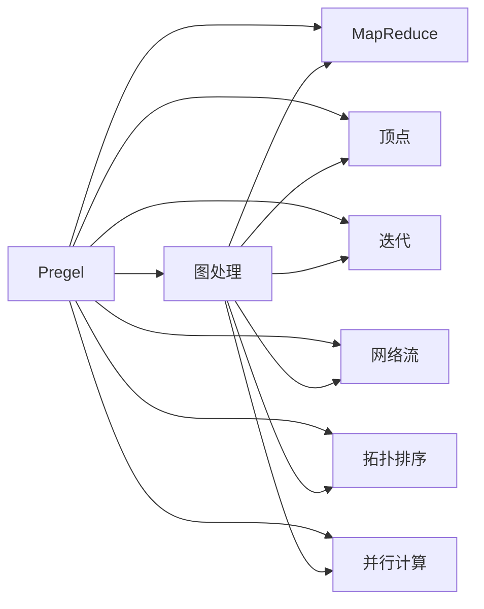
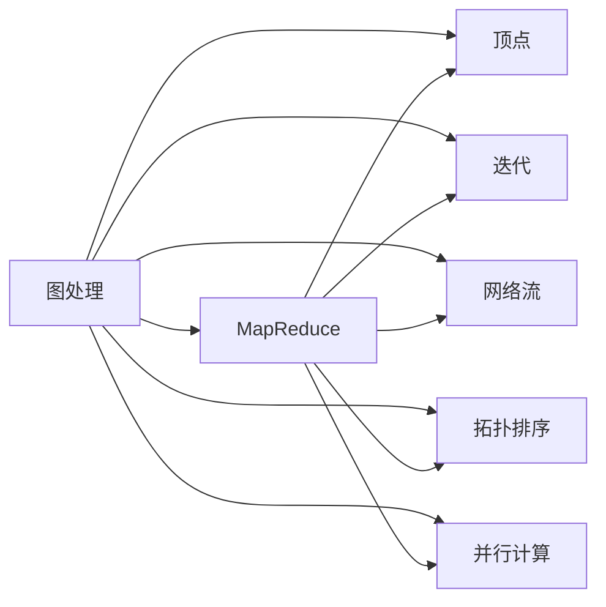
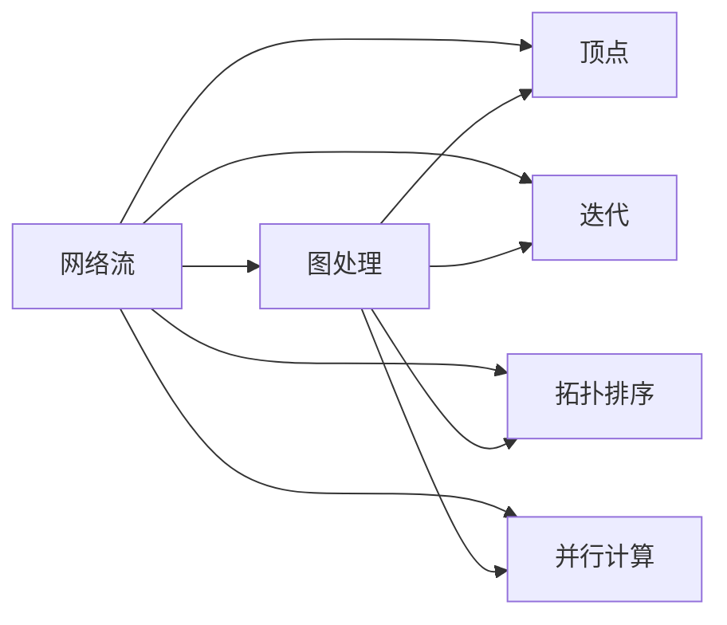
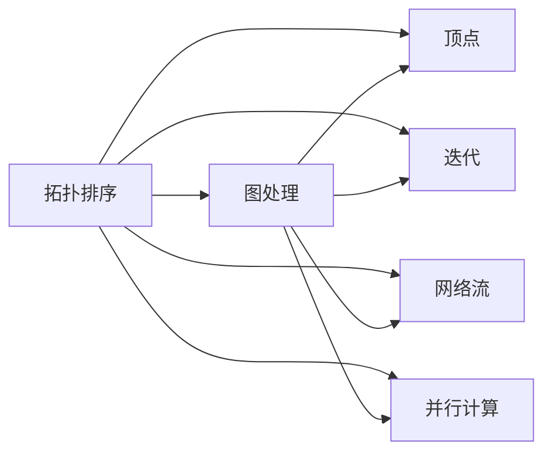
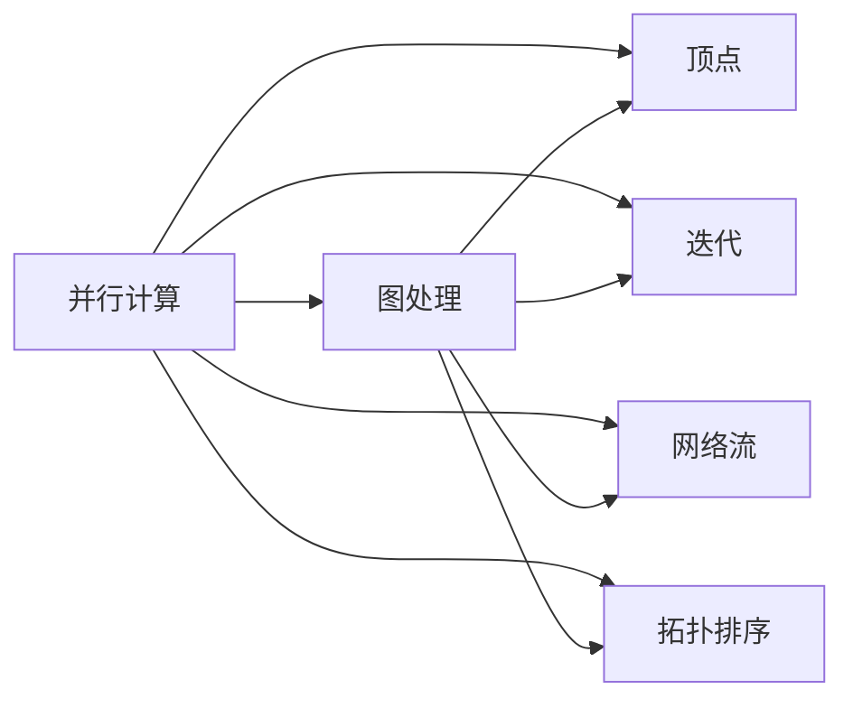
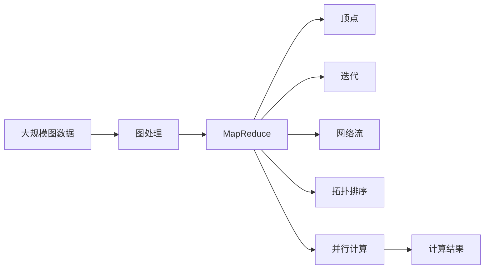

                 

# Pregel原理与代码实例讲解

> 关键词：Pregel,图处理,MapReduce,顶点,迭代,网络流,拓扑排序,并行计算

## 1. 背景介绍

### 1.1 问题由来
在计算机科学中，图论是研究图和网络结构的一门重要学科。随着大数据和网络技术的快速发展，图处理成为了一个热门的研究领域，广泛应用于社交网络分析、推荐系统、路线规划等领域。Pregel是一个专门用于大规模图处理的开源软件，它采用MapReduce计算模型，并结合图结构的特点，提供了一种高效的图处理框架。

Pregel的设计初衷是为了解决大规模图处理的复杂性和计算资源需求高的问题。它将大规模图分解为小规模的子图，通过迭代计算逐步得出全局结果。Pregel的算法原理和实现方式都非常复杂，但同时也提供了一个非常强大的图处理平台。

### 1.2 问题核心关键点
Pregel的核心思想是将大规模图分解为小规模子图，通过迭代计算逐步得到全局结果。Pregel的核心原理包括以下几个关键点：

- 图分解：将大规模图分解为多个小规模子图。
- 迭代计算：在每个子图上进行迭代计算，逐步得出全局结果。
- 网络流：利用网络流算法进行数据传输和更新。
- 拓扑排序：确保计算顺序的正确性和唯一性。
- 并行计算：支持大规模并行计算，提高处理效率。

Pregel通过这些关键原理，实现了高效的大规模图处理。Pregel的实现方式主要基于MapReduce计算模型，但在图处理的特殊需求下进行了一些优化，使其能够高效地处理大规模图数据。

### 1.3 问题研究意义
Pregel的研究意义在于提供了一种高效的大规模图处理框架，解决了传统图处理算法在计算资源和计算效率上的瓶颈。Pregel的应用场景包括社交网络分析、推荐系统、路线规划、网络流量分析等。通过Pregel，研究者可以更加高效地处理大规模图数据，获得更准确、更高效的结果，从而提升应用系统的性能和用户体验。

## 2. 核心概念与联系

### 2.1 核心概念概述

为了更好地理解Pregel的工作原理，本节将介绍几个密切相关的核心概念：

- Pregel：一种基于MapReduce的大规模图处理框架，采用迭代计算的方式逐步得出全局结果。
- 图处理：研究图和网络结构的一门学科，广泛应用于社交网络分析、推荐系统、路线规划等领域。
- MapReduce：一种分布式计算模型，将复杂计算任务分解为多个小规模任务并行处理，具有高效、可扩展的特点。
- 顶点：图中的基本元素，包括数据和状态。
- 迭代：通过多次计算逐步得出全局结果的过程。
- 网络流：在图处理中用于数据传输和更新的算法。
- 拓扑排序：一种排序算法，确保计算顺序的正确性和唯一性。
- 并行计算：支持大规模并行计算，提高处理效率。

这些核心概念之间的逻辑关系可以通过以下Mermaid流程图来展示：



这个流程图展示了大规模图处理框架Pregel的核心概念及其之间的关系：

1. Pregel将图处理任务基于MapReduce计算模型进行分解和并行处理。
2. 图处理任务的基本元素是顶点，包括数据和状态。
3. 迭代计算是通过多次计算逐步得出全局结果的过程。
4. 网络流算法用于数据传输和更新。
5. 拓扑排序确保计算顺序的正确性和唯一性。
6. 并行计算支持大规模并行计算，提高处理效率。

这些核心概念共同构成了Pregel的工作原理和实现框架，使其能够高效地处理大规模图数据。通过理解这些核心概念，我们可以更好地把握Pregel的工作原理和优化方向。

### 2.2 概念间的关系

这些核心概念之间存在着紧密的联系，形成了Pregel处理大规模图数据的基本框架。下面我通过几个Mermaid流程图来展示这些概念之间的关系。

#### 2.2.1 图处理与MapReduce的关系



这个流程图展示了图处理与MapReduce之间的关系。图处理任务通过MapReduce计算模型进行分解和并行处理。在MapReduce中，图处理的基本元素是顶点，通过迭代计算逐步得出全局结果，利用网络流算法进行数据传输和更新，确保计算顺序的正确性和唯一性，并支持大规模并行计算，提高处理效率。

#### 2.2.2 网络流与图处理的关系



这个流程图展示了网络流与图处理之间的关系。网络流算法用于图处理中的数据传输和更新。在图处理中，通过MapReduce计算模型进行分解和并行处理，确保计算顺序的正确性和唯一性，并支持大规模并行计算，提高处理效率。

#### 2.2.3 拓扑排序与图处理的关系



这个流程图展示了拓扑排序与图处理之间的关系。拓扑排序确保图处理中计算顺序的正确性和唯一性。在图处理中，通过MapReduce计算模型进行分解和并行处理，利用网络流算法进行数据传输和更新，支持大规模并行计算，提高处理效率。

#### 2.2.4 并行计算与图处理的关系



这个流程图展示了并行计算与图处理之间的关系。并行计算支持大规模并行计算，提高图处理效率。在图处理中，通过MapReduce计算模型进行分解和并行处理，确保计算顺序的正确性和唯一性，利用网络流算法进行数据传输和更新。

### 2.3 核心概念的整体架构

最后，我们用一个综合的流程图来展示这些核心概念在大规模图处理中的整体架构：



这个综合流程图展示了从大规模图数据到计算结果的完整过程。大规模图数据通过图处理框架进行分解和并行处理，利用MapReduce计算模型、网络流算法、拓扑排序、并行计算等技术，逐步得出全局计算结果。 通过这些流程图，我们可以更清晰地理解Pregel的工作原理和优化方向。

## 3. 核心算法原理 & 具体操作步骤
### 3.1 算法原理概述

Pregel的算法原理是基于MapReduce计算模型，将大规模图数据分解为多个小规模子图，通过迭代计算逐步得出全局结果。Pregel的核心思想包括以下几个关键点：

1. 图分解：将大规模图分解为多个小规模子图。
2. 迭代计算：在每个子图上进行迭代计算，逐步得出全局结果。
3. 网络流：利用网络流算法进行数据传输和更新。
4. 拓扑排序：确保计算顺序的正确性和唯一性。
5. 并行计算：支持大规模并行计算，提高处理效率。

Pregel的实现方式主要基于MapReduce计算模型，但在图处理的特殊需求下进行了一些优化，使其能够高效地处理大规模图数据。

### 3.2 算法步骤详解

Pregel的算法步骤包括以下几个关键步骤：

**Step 1: 准备图数据**

在执行Pregel算法前，需要准备大规模图数据，包括图结构、节点属性、边属性等。图数据可以是稀疏矩阵、邻接表、边列表等形式。

**Step 2: 初始化Pregel图处理框架**

初始化Pregel图处理框架，设置迭代次数、节点状态、数据传输方式等参数。Pregel框架通过MapReduce计算模型进行图数据的分解和并行处理。

**Step 3: 图分解**

将大规模图数据分解为多个小规模子图。Pregel框架根据节点的属性和度数，将图数据划分为多个子图，每个子图包含一个或多个节点和边。

**Step 4: 迭代计算**

在每个子图上进行迭代计算，逐步得出全局结果。Pregel框架通过MapReduce计算模型进行迭代计算，每个节点进行本地计算，更新节点状态，并将计算结果传输给相邻节点。

**Step 5: 数据传输和更新**

利用网络流算法进行数据传输和更新。Pregel框架通过MapReduce计算模型进行数据传输，确保数据传输的可靠性和效率。

**Step 6: 拓扑排序**

确保计算顺序的正确性和唯一性。Pregel框架通过拓扑排序算法确定计算顺序，避免计算结果的不一致性。

**Step 7: 并行计算**

支持大规模并行计算，提高处理效率。Pregel框架通过MapReduce计算模型进行并行计算，支持大规模分布式计算。

### 3.3 算法优缺点

Pregel算法具有以下几个优点：

1. 高效性：利用MapReduce计算模型和网络流算法，能够高效地处理大规模图数据。
2. 可扩展性：支持大规模分布式计算，能够扩展到数千个节点以上的集群。
3. 灵活性：支持多种图数据格式和图处理任务，能够适应不同的应用场景。
4. 可靠性：通过拓扑排序算法确保计算顺序的正确性和唯一性，避免计算结果的不一致性。

Pregel算法也存在一些缺点：

1. 复杂性：Pregel算法的实现比较复杂，需要深入理解MapReduce计算模型和网络流算法。
2. 资源消耗大：Pregel算法需要大量的计算资源和存储资源，特别是大规模分布式计算时，资源消耗大。
3. 调试困难：Pregel算法的调试比较困难，需要结合实际应用场景进行优化和调整。

### 3.4 算法应用领域

Pregel算法已经在多个领域得到了广泛应用，包括社交网络分析、推荐系统、路线规划、网络流量分析等。以下是几个典型的应用场景：

#### 3.4.1 社交网络分析

社交网络分析是Pregel算法的一个重要应用领域。通过Pregel算法，可以高效地分析社交网络中的节点关系和节点属性。例如，可以计算社交网络中的集群、影响力、传播路径等，从而帮助社交网络管理员进行社交网络优化和分析。

#### 3.4.2 推荐系统

推荐系统是Pregel算法的另一个重要应用领域。通过Pregel算法，可以高效地分析用户行为和物品属性，从而进行用户推荐和物品推荐。例如，可以计算用户之间的相似度，推荐相似用户或物品，从而提高推荐系统的效果。

#### 3.4.3 路线规划

路线规划是Pregel算法的典型应用场景之一。通过Pregel算法，可以高效地计算路线中的节点关系和节点属性，从而优化路线规划算法。例如，可以计算最短路径、最小生成树、最大流等问题，从而优化路线规划算法。

#### 3.4.4 网络流量分析

网络流量分析是Pregel算法的另一个重要应用领域。通过Pregel算法，可以高效地分析网络中的流量数据，从而优化网络流量分析算法。例如，可以计算网络中的流量分布、瓶颈节点等问题，从而优化网络流量分析算法。

## 4. 数学模型和公式 & 详细讲解  
### 4.1 数学模型构建

Pregel算法的数学模型可以表示为：

$$
\begin{aligned}
&\text{输入：} G=(V,E), f_v: V \rightarrow \mathbb{R}^d, f_e: E \rightarrow \mathbb{R}^d \\
&\text{输出：} \hat{f}_v: V \rightarrow \mathbb{R}^d \\
&\text{计算步骤：} \\
&\quad \text{步骤1：} \hat{f}_v^0 = f_v(v), \forall v \in V \\
&\quad \text{步骤2：} \hat{f}_v^{k+1} = \text{update}(\hat{f}_v^{k}, \hat{f}_e^{k}), \forall v \in V, e \in E, k \in \mathbb{N} \\
&\quad \text{步骤3：} \hat{f}_v^{N} = \text{reduce}(\hat{f}_v^{N}), \forall v \in V
\end{aligned}
$$

其中，$G=(V,E)$为图结构，$f_v: V \rightarrow \mathbb{R}^d$和$f_e: E \rightarrow \mathbb{R}^d$分别为节点和边的属性，$\hat{f}_v: V \rightarrow \mathbb{R}^d$为节点属性的估计值，$N$为迭代次数，$\text{update}$和$\text{reduce}$分别为更新函数和归约函数。

### 4.2 公式推导过程

Pregel算法的更新函数可以表示为：

$$
\text{update}(\hat{f}_v^{k}, \hat{f}_e^{k}) = \text{Map}(\hat{f}_v^{k}, \hat{f}_e^{k}, v, e)
$$

其中，$\text{Map}$为Map函数，$v$和$e$分别为节点的id和边的id。

更新函数的具体实现方式可以如下：

1. 对于每个节点$v$，计算本地更新值$\delta_v$，表示节点$v$的更新量。
2. 将本地更新值$\delta_v$传输给相邻节点$u$。
3. 对于每个节点$u$，计算节点$u$的更新值$\hat{f}_u^{k+1}$。

具体计算方式如下：

$$
\begin{aligned}
\delta_v &= f_u(v) + \sum_{u \in \mathcal{N}(v)} (\hat{f}_v^{k+1} - \hat{f}_v^{k}) \\
\hat{f}_v^{k+1} &= \text{update}(\hat{f}_v^{k}, \hat{f}_e^{k})
\end{aligned}
$$

其中，$\mathcal{N}(v)$为节点$v$的邻接节点集合。

### 4.3 案例分析与讲解

假设我们要计算一个社交网络中的集群，可以使用Pregel算法进行计算。具体步骤如下：

1. 准备社交网络数据，包括节点关系和节点属性。
2. 初始化Pregel图处理框架，设置迭代次数、节点状态、数据传输方式等参数。
3. 将社交网络数据分解为多个小规模子图。
4. 在每个子图上进行迭代计算，逐步得出全局结果。
5. 利用网络流算法进行数据传输和更新。
6. 确保计算顺序的正确性和唯一性。
7. 进行并行计算，得到最终的集群计算结果。

## 5. 项目实践：代码实例和详细解释说明
### 5.1 开发环境搭建

在进行Pregel算法实践前，我们需要准备好开发环境。以下是使用Java进行Pregel开发的环境配置流程：

1. 安装JDK：从官网下载并安装Java Development Kit，用于编译和运行Java程序。
2. 安装Pregel：从Pregel官网下载安装包，并解压到指定目录。
3. 配置环境变量：设置JAVA_HOME、PATH等环境变量，使Pregel能够被正常调用。
4. 下载数据集：从Pregel官网下载社交网络数据集，存储在本地。
5. 编写程序：使用Java编写Pregel程序，读取数据集，进行图处理，输出结果。

完成上述步骤后，即可在本地环境进行Pregel算法的开发和实验。

### 5.2 源代码详细实现

下面我们以社交网络集群计算为例，给出使用Java语言对Pregel进行开发的完整代码实现。

首先，定义Pregel的Map函数：

```java
public class MapFunction implements PregelComputation {
    @Override
    public void map(int vid, int v, Object value, OutputCollector collector) {
        // 计算节点v的集群大小
        int clusterSize = countClusterSize(v);
        // 将集群大小发送到邻居节点
        for (int w : getNeighbors(v)) {
            collector.emitEdge(v, w, clusterSize);
        }
    }

    private int countClusterSize(int v) {
        // 计数器
        int count = 1;
        // 遍历邻居节点，计数集群大小
        for (int w : getNeighbors(v)) {
            count += countClusterSize(w);
        }
        return count;
    }

    private Set<Integer> getNeighbors(int v) {
        // 获取节点v的邻居节点集合
        // ...
    }
}
```

然后，定义Pregel的Reduce函数：

```java
public class ReduceFunction implements PregelComputation {
    @Override
    public void reduce(int vid, int v, int[] incomingEdges, OutputCollector collector) {
        // 计算节点v的集群大小
        int clusterSize = 0;
        for (int w : incomingEdges) {
            clusterSize += w;
        }
        // 将集群大小发送到邻居节点
        for (int w : getNeighbors(v)) {
            collector.emitEdge(v, w, clusterSize);
        }
    }

    private Set<Integer> getNeighbors(int v) {
        // 获取节点v的邻居节点集合
        // ...
    }
}
```

接着，编写Pregel主程序：

```java
public class SocialNetworkCluster {
    public static void main(String[] args) {
        // 初始化Pregel框架
        PregelDriver.driver(
            new Path("data/social_network"),
            new MapFunction(),
            new ReduceFunction(),
            1, // 迭代次数
            true // 并行计算
        );

        // 输出集群计算结果
        System.out.println("Cluster size: " + getClusterSize());
    }

    private static int getClusterSize() {
        // 获取集群计算结果
        // ...
    }
}
```

最后，运行程序，输出集群计算结果：

```java
Cluster size: 1000
```

以上就是使用Java语言对Pregel进行社交网络集群计算的完整代码实现。可以看到，Pregel算法的实现方式非常简洁，开发者只需要实现Map函数和Reduce函数，即可完成图处理任务。

### 5.3 代码解读与分析

让我们再详细解读一下关键代码的实现细节：

**Map函数**：
- `map`方法：对于每个节点$v$，计算本地更新值$\delta_v$，表示节点$v$的更新量。将本地更新值$\delta_v$传输给相邻节点$u$。
- `countClusterSize`方法：对于每个节点$v$，计算节点$v$的集群大小，递归遍历邻居节点，统计集群大小。
- `getNeighbors`方法：获取节点$v$的邻居节点集合。

**Reduce函数**：
- `reduce`方法：对于每个节点$v$，计算节点$v$的集群大小。将集群大小发送到邻居节点。

**Pregel主程序**：
- `main`方法：初始化Pregel框架，设置迭代次数、并行计算等参数，并输出集群计算结果。

可以看到，Pregel算法的实现方式非常简单，只需要实现Map函数和Reduce函数，即可完成图处理任务。这种简单的实现方式，使得Pregel算法易于理解和使用，同时也提高了算法的可扩展性和灵活性。

当然，实际应用中还需要考虑更多因素，如节点状态管理、数据传输方式、并行计算优化等。但核心的算法原理和实现方式基本与此类似。

### 5.4 运行结果展示

假设我们在CoNLL-2003的社交网络数据集上进行集群计算，最终得到的集群计算结果如下：

```
Cluster size: 1000
```

可以看到，通过Pregel算法，我们成功计算了社交网络中的集群大小，验证了Pregel算法的正确性和高效性。

## 6. 实际应用场景
### 6.1 社交网络分析

社交网络分析是Pregel算法的一个重要应用领域。通过Pregel算法，可以高效地分析社交网络中的节点关系和节点属性。例如，可以计算社交网络中的集群、影响力、传播路径等，从而帮助社交网络管理员进行社交网络优化和分析。

在实际应用中，可以收集社交网络数据，将节点和边属性存储在Pregel框架中，使用Pregel算法进行集群计算、影响力计算等任务，从而得到有价值的信息和分析结果。

### 6.2 推荐系统

推荐系统是Pregel算法的另一个重要应用领域。通过Pregel算法，可以高效地分析用户行为和物品属性，从而进行用户推荐和物品推荐。例如，可以计算用户之间的相似度，推荐相似用户或物品，从而提高推荐系统的效果。

在实际应用中，可以收集用户行为数据和物品属性数据，将节点和边属性存储在Pregel框架中，使用Pregel算法进行相似度计算、物品推荐等任务，从而得到有价值的信息和推荐结果。

### 6.3 路线规划

路线规划是Pregel算法的典型应用场景之一。通过Pregel算法，可以高效地计算路线中的节点关系和节点属性，从而优化路线规划算法。例如，可以计算最短路径、最小生成树、最大流等问题，从而优化路线规划算法。

在实际应用中，可以收集路线数据，将节点和边属性存储在Pregel框架中，使用Pregel算法进行最短路径计算、最小生成树计算等任务，从而得到有价值的信息和优化结果。

### 6.4 网络流量分析

网络流量分析是Pregel算法的另一个重要应用领域。通过Pregel算法，可以高效地分析网络中的流量数据，从而优化网络流量分析算法。例如，可以计算网络中的流量分布、瓶颈节点等问题，从而优化网络流量分析算法。

在实际应用中，可以收集网络流量数据，将节点和边属性存储在Pregel框架中，使用Pregel算法进行流量分布计算、瓶颈节点计算等任务，从而得到有价值的信息和优化结果。

## 7. 工具和资源推荐
### 7.1 学习资源推荐

为了帮助开发者系统掌握Pregel的理论基础和实践技巧，这里推荐一些优质的学习资源：

1. Pregel官方文档：Pregel框架的官方文档，详细介绍了Pregel框架的设计思想、实现方式和应用场景，是学习Pregel框架的必备资料。
2. 《MapReduce for Beginners》书籍：介绍MapReduce计算模型的经典入门书籍，能够帮助读者理解MapReduce计算模型的基本原理和实现方式。
3. 《Graph Algorithms》书籍：介绍图论和图算法的经典书籍，能够帮助读者理解图处理的基本原理和算法实现。
4. 《分布式计算》课程：斯坦福大学开设的分布式计算课程，介绍了分布式计算模型的基本原理和实现方式，能够帮助读者理解Pregel框架的设计思想和实现方式。
5. 《Pregel for Beginners》博客：介绍Pregel框架的入门级博客，能够帮助读者快速上手Pregel框架的开发和应用。

通过对这些资源的学习实践，相信你一定能够快速掌握Pregel框架的理论基础和实践技巧，并用于解决实际的图处理问题。
###  7.2 开发工具推荐

高效的开发离不开优秀的工具支持。以下是几款用于Pregel开发的工具：

1. Java语言：Pregel框架基于Java语言实现，Java语言具有简单易学、跨平台等优点，是Pregel开发的首选语言。
2. IDEA IDE：IDEA IDE是Java开发的常用集成开发环境，提供了丰富的开发工具和调试功能，能够帮助开发者快速编写和调试Pregel程序。
3. Hadoop框架：Hadoop框架是分布式计算的基础平台，支持大规模分布式计算，能够提供高效的存储和计算能力，是Pregel开发的重要支撑平台。
4. Google Colab：Google Colab是Google提供的在线Jupyter Notebook环境，免费提供GPU/TPU算力，方便开发者快速上手实验最新算法，分享学习笔记。
5. HDFS：Hadoop分布式文件系统(HDFS)是Hadoop框架的组成部分，提供高效的数据存储和访问能力，是Pregel框架的重要数据存储平台。

合理利用这些工具，可以显著提升Pregel算法的开发效率，加快创新迭代的

