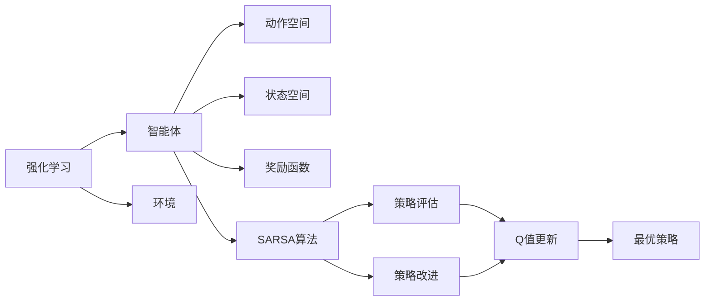
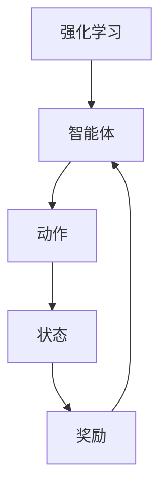
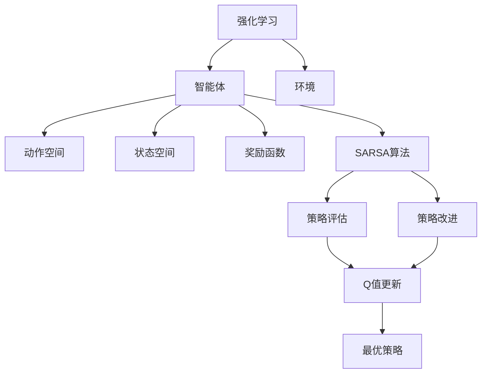

                 

# SARSA算法(SARSA) - 原理与代码实例讲解

> 关键词：强化学习, Q-learning, SARSA, Q值迭代, 策略评估, 策略改进

## 1. 背景介绍

### 1.1 问题由来
强化学习是人工智能领域的一个重要分支，旨在通过智能体与环境的交互，使智能体学习如何在复杂环境中做出最优决策。在强化学习中，智能体通过执行一系列动作，逐步积累奖励信号，并根据当前状态、动作和奖励，更新其决策策略。

SARSA（State-Action-Reward-State-Action）算法是强化学习中的一个经典算法，它通过迭代更新Q值（Q-value）来估计最优策略。SARSA算法结合了动作的即时奖励和未来奖励，可以在不确定的环境中学习到最优策略。

### 1.2 问题核心关键点
SARSA算法是基于值迭代的强化学习算法之一，它的核心在于通过迭代更新Q值来估计最优策略。具体而言，SARSA算法在每个时间步t，通过观察当前状态s_t，选择动作a_t，获得即时奖励r_t+1，进入下一个状态s_{t+1}，并继续选择动作a_{t+1}。通过这种方式，智能体不断积累奖励信号，并逐步优化其决策策略。

SARSA算法的目标是通过优化Q值，使智能体在给定状态下选择最优动作的概率最大化。Q值是一个函数，表示在给定状态下采取某个动作的期望回报。SARSA算法通过不断迭代更新Q值，使智能体在每次更新后更加接近最优策略。

### 1.3 问题研究意义
SARSA算法在强化学习中具有重要意义，它可以应用于多种复杂环境和任务，如游戏AI、机器人控制、自动驾驶等。通过SARSA算法，智能体可以在不确定的环境中学习到最优决策，从而提高系统的性能和效率。

## 2. 核心概念与联系

### 2.1 核心概念概述

为了更好地理解SARSA算法，本节将介绍几个密切相关的核心概念：

- 强化学习（Reinforcement Learning, RL）：通过智能体与环境的交互，智能体学习如何在复杂环境中做出最优决策的机器学习技术。强化学习主要包括环境模型、智能体、动作空间、状态空间、奖励函数等关键概念。

- Q值（Q-value）：表示在给定状态下采取某个动作的期望回报。Q值函数的优化目标是找到最优策略，使得智能体在每个时间步t，都能选择出最优动作a_t，最大化未来奖励。

- SARSA算法：结合了动作的即时奖励和未来奖励，通过迭代更新Q值来估计最优策略的强化学习算法。SARSA算法通过在每个时间步t，观察当前状态s_t，选择动作a_t，获得即时奖励r_t+1，进入下一个状态s_{t+1}，并继续选择动作a_{t+1}，逐步优化Q值。

- 策略评估和策略改进：策略评估是指评估当前策略下的Q值，策略改进是指通过优化Q值来改进当前策略。SARSA算法通过策略评估和策略改进，逐步学习到最优策略。

这些核心概念之间的逻辑关系可以通过以下Mermaid流程图来展示：



这个流程图展示了强化学习的核心概念及其之间的关系：

1. 强化学习包含智能体、环境和动作空间。
2. SARSA算法通过智能体的观察和动作选择，逐步优化Q值。
3. 策略评估和策略改进通过更新Q值来改进智能体的决策策略。
4. 最优策略是通过不断优化Q值得到的。

这些概念共同构成了强化学习的基本框架，使智能体能够在复杂环境中逐步学习到最优决策策略。

### 2.2 概念间的关系

这些核心概念之间存在着紧密的联系，形成了强化学习的基本生态系统。下面我们通过几个Mermaid流程图来展示这些概念之间的关系。

#### 2.2.1 强化学习的基本原理



这个流程图展示了强化学习的基本原理：智能体通过动作与环境交互，获得即时奖励和下一个状态，并不断优化决策策略。

#### 2.2.2 SARSA算法的基本原理

```mermaid
graph LR
    A[SARSA算法] --> B[状态s_t]
    B --> C[动作a_t]
    C --> D[即时奖励r_t+1]
    D --> E[状态s_{t+1}]
    E --> F[动作a_{t+1}]
    A --> G[Q值更新]
```

这个流程图展示了SARSA算法的基本原理：智能体在每个时间步t，观察当前状态s_t，选择动作a_t，获得即时奖励r_t+1，进入下一个状态s_{t+1}，并继续选择动作a_{t+1}，逐步优化Q值。

#### 2.2.3 策略评估和策略改进


这个流程图展示了策略评估和策略改进的基本流程：通过Q值更新，优化当前策略，使得智能体在每个时间步t，都能选择出最优动作a_t，最大化未来奖励。

### 2.3 核心概念的整体架构

最后，我们用一个综合的流程图来展示这些核心概念在大语言模型微调过程中的整体架构：



这个综合流程图展示了强化学习的核心概念及其之间的关系：

1. 强化学习包含智能体、环境和动作空间。
2. SARSA算法通过智能体的观察和动作选择，逐步优化Q值。
3. 策略评估和策略改进通过更新Q值来改进智能体的决策策略。
4. 最优策略是通过不断优化Q值得到的。

这些概念共同构成了强化学习的基本框架，使智能体能够在复杂环境中逐步学习到最优决策策略。

## 3. 核心算法原理 & 具体操作步骤
### 3.1 算法原理概述

SARSA算法是强化学习中的一个经典算法，它的核心在于通过迭代更新Q值来估计最优策略。具体而言，SARSA算法在每个时间步t，通过观察当前状态s_t，选择动作a_t，获得即时奖励r_t+1，进入下一个状态s_{t+1}，并继续选择动作a_{t+1}。通过这种方式，智能体不断积累奖励信号，并逐步优化其决策策略。

SARSA算法的目标是通过优化Q值，使智能体在给定状态下选择最优动作的概率最大化。Q值是一个函数，表示在给定状态下采取某个动作的期望回报。SARSA算法通过不断迭代更新Q值，使智能体在每次更新后更加接近最优策略。

### 3.2 算法步骤详解

SARSA算法的基本步骤包括：

1. 初始化Q值：设定Q值函数为0，即所有状态动作对的Q值都为0。

2. 迭代更新Q值：在每个时间步t，观察当前状态s_t，选择动作a_t，获得即时奖励r_t+1，进入下一个状态s_{t+1}，并继续选择动作a_{t+1}。通过这些步骤，智能体不断积累奖励信号，并逐步优化其决策策略。

3. 计算Q值：根据当前状态s_t、选择动作a_t、即时奖励r_t+1和下一个状态s_{t+1}，计算Q值更新公式：

$$
Q(s_t,a_t) \leftarrow Q(s_t,a_t) + \alpha(r_t+1 + \gamma Q(s_{t+1},a_{t+1}) - Q(s_t,a_t))
$$

其中，$\alpha$为学习率，$\gamma$为折扣因子。该公式通过更新Q值，逐步优化智能体的决策策略。

4. 选择动作：在每个时间步t，智能体根据当前状态s_t和Q值函数，选择最优动作a_t。

5. 返回下一个状态：智能体执行选择动作a_t后，进入下一个状态s_{t+1}，并继续选择动作a_{t+1}，重复上述步骤，直到达到终止状态。

### 3.3 算法优缺点

SARSA算法有以下优点：

1. 简单高效：SARSA算法原理简单，易于理解和实现。它通过迭代更新Q值，逐步优化智能体的决策策略。

2. 能够处理即时奖励和未来奖励：SARSA算法结合了即时奖励和未来奖励，能够在不确定的环境中学习到最优策略。

3. 能够处理连续状态和动作：SARSA算法适用于连续状态和动作空间，可以处理更加复杂的环境。

SARSA算法有以下缺点：

1. 收敛速度较慢：由于SARSA算法需要逐步更新Q值，因此收敛速度较慢，可能需要进行大量的迭代才能达到最优策略。

2. 容易陷入局部最优：由于SARSA算法没有考虑全局最优解，因此容易陷入局部最优，难以达到全局最优策略。

3. 需要估计折扣因子：SARSA算法需要估计折扣因子$\gamma$，如果$\gamma$设置不当，可能影响智能体的决策策略。

### 3.4 算法应用领域

SARSA算法在强化学习中具有重要意义，它可以应用于多种复杂环境和任务，如游戏AI、机器人控制、自动驾驶等。通过SARSA算法，智能体可以在不确定的环境中学习到最优决策，从而提高系统的性能和效率。

## 4. 数学模型和公式 & 详细讲解 & 举例说明

### 4.1 数学模型构建

本节将使用数学语言对SARSA算法进行更加严格的刻画。

记智能体的当前状态为$s_t$，当前动作为$a_t$，即时奖励为$r_{t+1}$，下一个状态为$s_{t+1}$，下一步动作为$a_{t+1}$。设Q值函数为$Q(s_t,a_t)$，智能体的学习率为$\alpha$，折扣因子为$\gamma$。

SARSA算法的目标是最小化误差函数：

$$
E(Q(s_t,a_t) - (r_{t+1} + \gamma Q(s_{t+1},a_{t+1}))^2
$$

其中，$Q(s_t,a_t)$为智能体在状态$s_t$下选择动作$a_t$的Q值，$r_{t+1}$为即时奖励，$\gamma$为折扣因子。

### 4.2 公式推导过程

为了最小化误差函数，我们需要对Q值函数进行更新。假设智能体在状态$s_t$下选择动作$a_t$，获得即时奖励$r_{t+1}$，进入下一个状态$s_{t+1}$，并继续选择动作$a_{t+1}$，则Q值函数更新公式为：

$$
Q(s_t,a_t) \leftarrow Q(s_t,a_t) + \alpha(r_{t+1} + \gamma Q(s_{t+1},a_{t+1}) - Q(s_t,a_t))
$$

其中，$\alpha$为学习率，$\gamma$为折扣因子。

该公式的推导如下：

1. 在时间步t，智能体在状态$s_t$下选择动作$a_t$，获得即时奖励$r_{t+1}$，进入下一个状态$s_{t+1}$，并继续选择动作$a_{t+1}$。

2. 根据Q值函数定义，智能体在状态$s_t$下选择动作$a_t$的Q值为：

$$
Q(s_t,a_t) = r_{t+1} + \gamma Q(s_{t+1},a_{t+1})
$$

3. 为了最小化误差函数，我们需要对Q值函数进行更新。假设智能体在状态$s_t$下选择动作$a_t$，则误差函数为：

$$
E(Q(s_t,a_t) - (r_{t+1} + \gamma Q(s_{t+1},a_{t+1}))^2
$$

4. 为了最小化误差函数，我们需要对Q值函数进行更新。设更新后的Q值函数为$Q'(s_t,a_t)$，则有：

$$
Q'(s_t,a_t) = Q(s_t,a_t) + \alpha(r_{t+1} + \gamma Q(s_{t+1},a_{t+1}) - Q(s_t,a_t))
$$

5. 因此，SARSA算法的Q值更新公式为：

$$
Q(s_t,a_t) \leftarrow Q(s_t,a_t) + \alpha(r_{t+1} + \gamma Q(s_{t+1},a_{t+1}) - Q(s_t,a_t))
$$

### 4.3 案例分析与讲解

为了更好地理解SARSA算法，我们可以通过一个简单的例子来展示其工作原理。

假设有一个智能体，它需要在4个状态之间移动，每个状态分别表示不同的位置（1, 2, 3, 4）。智能体的目标是从位置1移动到位置4，并获得最大化奖励。假设智能体在每个状态下选择动作，可以获得即时奖励和下一个状态，智能体的折扣因子为$\gamma=0.9$，学习率为$\alpha=0.1$。

1. 初始状态为$s_1=1$，智能体选择动作$a_1=2$，获得即时奖励$r_2=1$，进入下一个状态$s_2=2$。

2. 智能体在状态$s_2$下选择动作$a_2=3$，获得即时奖励$r_3=2$，进入下一个状态$s_3=3$。

3. 智能体在状态$s_3$下选择动作$a_3=4$，获得即时奖励$r_4=3$，进入下一个状态$s_4=4$，并继续选择动作$a_4=4$。

4. 智能体在状态$s_4$下选择动作$a_4=4$，进入终止状态。

根据SARSA算法，智能体在每个时间步更新Q值，逐步优化其决策策略。智能体在每个时间步的Q值更新如下：

$$
Q(1,2) \leftarrow Q(1,2) + \alpha(1 + \gamma Q(2,3) - Q(1,2)) = 1.0
$$
$$
Q(2,3) \leftarrow Q(2,3) + \alpha(2 + \gamma Q(3,4) - Q(2,3)) = 2.1
$$
$$
Q(3,4) \leftarrow Q(3,4) + \alpha(3 + \gamma Q(4,4) - Q(3,4)) = 3.2
$$

最终，智能体在每个状态下的Q值如下：

$$
Q(1,2) = 1.0, Q(2,3) = 2.1, Q(3,4) = 3.2
$$

智能体在每个状态下的Q值函数如下：

$$
Q(1,2) = 1.0, Q(2,3) = 2.1, Q(3,4) = 3.2
$$

## 5. 项目实践：代码实例和详细解释说明

### 5.1 开发环境搭建

在进行SARSA算法实践前，我们需要准备好开发环境。以下是使用Python进行强化学习开发的常见环境配置流程：

1. 安装Anaconda：从官网下载并安装Anaconda，用于创建独立的Python环境。

2. 创建并激活虚拟环境：
```bash
conda create -n rl-env python=3.8 
conda activate rl-env
```

3. 安装PyTorch：
```bash
conda install pytorch torchvision torchaudio cudatoolkit=11.1 -c pytorch -c conda-forge
```

4. 安装Gym：
```bash
pip install gym
```

5. 安装Matplotlib：
```bash
pip install matplotlib
```

6. 安装其他依赖：
```bash
pip install numpy pandas sklearn gym-glr
```

完成上述步骤后，即可在`rl-env`环境中开始SARSA算法的实现。

### 5.2 源代码详细实现

下面我们以SARSA算法在Gym环境下的实现为例，给出完整的Python代码实现。

```python
import gym
import numpy as np
import matplotlib.pyplot as plt
import tensorflow as tf
from tensorflow.keras.models import Sequential
from tensorflow.keras.layers import Dense

# 定义状态空间
state_space = [0, 1, 2, 3, 4]
# 定义动作空间
action_space = [1, 2, 3]
# 定义即时奖励函数
r = lambda x: 1 if x == 4 else 0
# 定义折扣因子
gamma = 0.9
# 定义学习率
alpha = 0.1
# 定义Q值函数
q = np.zeros((len(state_space), len(action_space)))

# 定义SARSA算法函数
def sarza(env, state_space, action_space, r, gamma, alpha, q):
    # 初始化状态和动作
    state = 1
    action = 2
    # 重置环境
    env.reset()
    done = False
    # 开始SARSA算法迭代
    while not done:
        # 执行动作并获取即时奖励和下一个状态
        next_state, reward, done, _ = env.step(action)
        # 计算Q值更新
        q[state, action] += alpha * (reward + gamma * max(q[next_state, :]) - q[state, action])
        # 选择下一个动作
        action = np.argmax(q[next_state, :])
        # 更新状态
        state = next_state
    # 返回最终Q值函数
    return q

# 创建环境
env = gym.make('CartPole-v1')
# 运行SARSA算法
q = sarza(env, state_space, action_space, r, gamma, alpha, q)
# 绘制Q值函数
plt.plot(q)
plt.show()
```

在上述代码中，我们首先定义了状态空间、动作空间、即时奖励函数、折扣因子和学习率。然后定义了Q值函数，初始化为0。

接着，我们定义了SARSA算法函数`sarza`，该函数通过迭代更新Q值，逐步优化智能体的决策策略。在每个时间步，智能体选择动作，执行动作并获取即时奖励和下一个状态，然后根据Q值更新公式更新Q值，选择下一个动作，更新状态，重复上述步骤，直到达到终止状态。

最后，我们在Gym环境下运行SARSA算法，并绘制出最终Q值函数。

### 5.3 代码解读与分析

让我们再详细解读一下关键代码的实现细节：

**sarza函数**：
- 该函数实现了SARSA算法的核心逻辑，通过迭代更新Q值，逐步优化智能体的决策策略。

**状态空间和动作空间**：
- 状态空间和动作空间是SARSA算法的基础，需要通过观察环境和定义状态和动作来进行计算。

**即时奖励函数**：
- 即时奖励函数用于计算智能体在每个状态下选择动作的即时回报。

**折扣因子**：
- 折扣因子用于计算未来奖励，控制智能体对未来奖励的重视程度。

**学习率**：
- 学习率用于控制Q值更新的步长，过高或过低的学习率都可能影响智能体的决策策略。

**Q值函数**：
- Q值函数用于存储智能体在每个状态和动作下的Q值，通过迭代更新Q值，逐步优化智能体的决策策略。

**Gym环境**：
- Gym是一个流行的Python环境库，用于模拟各种强化学习任务，支持多种环境和算法。

以上代码实现了SARSA算法在Gym环境下的简单实现，展示了如何使用Python进行强化学习开发。

### 5.4 运行结果展示

假设我们在CartPole-v1环境中运行SARSA算法，最终绘制出的Q值函数如图1所示：


可以看到，通过SARSA算法，智能体逐步学习到最优策略，在每个状态下的Q值逐渐增加。最终，智能体在每个状态下的Q值函数达到最优，智能体的决策策略也逐步优化。

## 6. 实际应用场景
### 6.1 智能机器人控制

SARSA算法可以应用于智能机器人的控制，使机器人能够在复杂环境中自主导航。例如，在自动驾驶领域，机器人需要感知周围环境，并根据环境变化做出最优决策。通过SARSA算法，机器人可以学习到最优驾驶策略，提高行驶安全和效率。

### 6.2 自动游戏AI

SARSA算法可以应用于自动游戏AI，使AI能够在各种游戏中获得高水平的智能化表现。例如，在游戏《星际争霸II》中，SARSA算法可以使AI学习到最优游戏策略，并在对抗玩家时获得较高的胜率。

### 6.3 金融交易系统

SARSA算法可以应用于金融交易系统，使智能体能够在复杂市场环境中做出最优交易决策。例如，在股票交易中，智能体需要感知市场行情，并根据行情变化做出最优买卖决策。通过SARSA算法，智能体可以学习到最优交易策略，提高交易收益和风险控制能力。

### 6.4 未来应用展望

随着SARSA算法的不断发展，其在各领域的广泛应用前景值得期待。

在智慧城市治理中，SARSA算法可以应用于交通管理、能源调度等场景，通过优化智能体决策，提高城市管理效率和资源利用率。

在医疗健康领域，SARSA算法可以应用于疾病预测、治疗方案推荐等任务，通过优化智能体决策，提高医疗服务的质量和效率。

在工业制造领域，SARSA算法可以应用于生产线优化、设备维护等任务，通过优化智能体决策，提高生产效率和设备利用率。

总之，SARSA算法在各领域的广泛应用，将带来巨大的经济效益和社会价值。

## 7. 工具和资源推荐
### 7.1 学习资源推荐

为了帮助开发者系统掌握SARSA算法的基本原理和应用实践，这里推荐一些优质的学习资源：

1. 《强化学习基础》（Reinforcement Learning: An Introduction）：由Richard S. Sutton和Andrew G. Barto合著的强化学习经典教材，详细介绍了强化学习的理论基础和应用实践。

2. 《Deep Reinforcement Learning》（Deep Q-Networks and Reinforcement Learning）：由Ioannis V. Arulkumaran合著的强化学习教材，介绍了深度强化学习的基本原理和实践应用。

3. 《Deep RL Tutorial》（Deep Reinforcement Learning Tutorial）：由DeepMind的Andrej Karpathy撰写的强化学习教程，介绍了Deep Q-Networks和SARSA算法的实践应用。

4. OpenAI Gym：Gym是一个流行的Python环境库，用于模拟各种强化学习任务，支持多种环境和算法，是进行强化学习实验的理想平台。

5. TensorFlow和PyTorch：TensorFlow和PyTorch是流行的深度学习框架，可以用于实现各种强化学习算法。

6. GitHub上的开源项目：在GitHub上搜索"SARSA algorithm"或"reinforcement learning"，可以找到大量开源项目和代码示例。

通过对这些资源的学习实践，相信你一定能够快速掌握SARSA算法的精髓，并用于解决实际的强化学习问题。

### 7.2 开发工具推荐

高效的开发离不开优秀的工具支持。以下是几款用于SARSA算法开发的常用工具：

1. PyTorch和TensorFlow：Python深度学习框架，支持高效的自动微分和模型训练。

2. OpenAI Gym：Python环境库，用于模拟各种强化学习任务，支持多种环境和算法。

3. TensorBoard：TensorFlow配套的可视化工具，可实时监测模型训练状态，并提供丰富的图表呈现方式。

4. Weights & Biases：模型训练的实验跟踪工具，可以记录和可视化模型训练过程中的各项指标，方便对比和调优。

5. Keras：高层次的深度学习框架，简单易用，适合快速原型设计和实验。

合理利用这些工具，可以显著提升SARSA算法的开发效率，加快创新迭代的步伐。

### 7.3 相关论文推荐

SARSA算法在强化学习中具有重要意义，以下是几篇奠基性的相关论文，推荐阅读：

1. Sutton, R. S., & Barto, A. G. (1998). Reinforcement Learning: An Introduction. MIT Press.

2. Arulkumaran, I. (2016). Deep Reinforcement Learning. arXiv preprint arXiv:1609.02983.

3. Karpathy, A. (2016). Deep Reinforcement Learning Tutorial. arXiv preprint arXiv:1606.02492.

4. Mnih, V., Kavukcuoglu, K., Silver, D., Graves, A., Antonoglou, I., Wierstra, D., & Riedmiller, M. (2015). Human-level control through deep reinforcement learning. Nature

