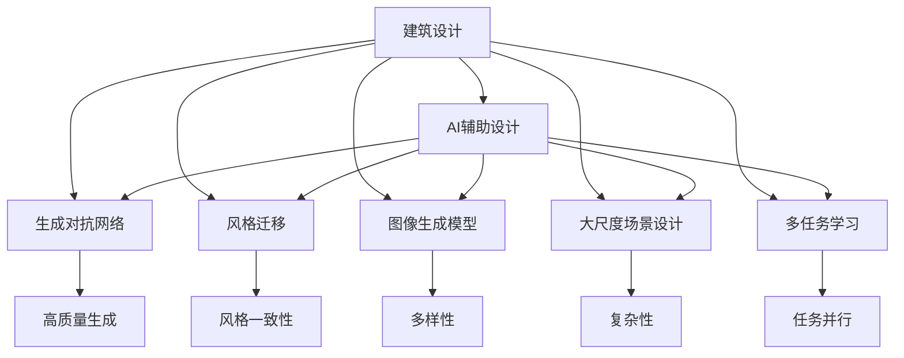
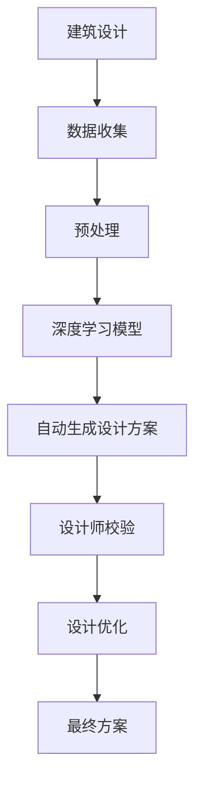
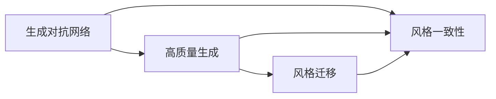
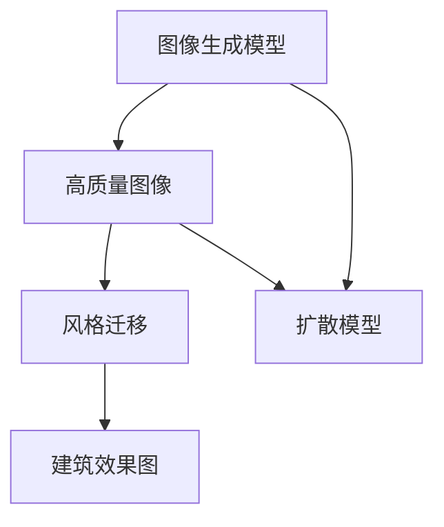
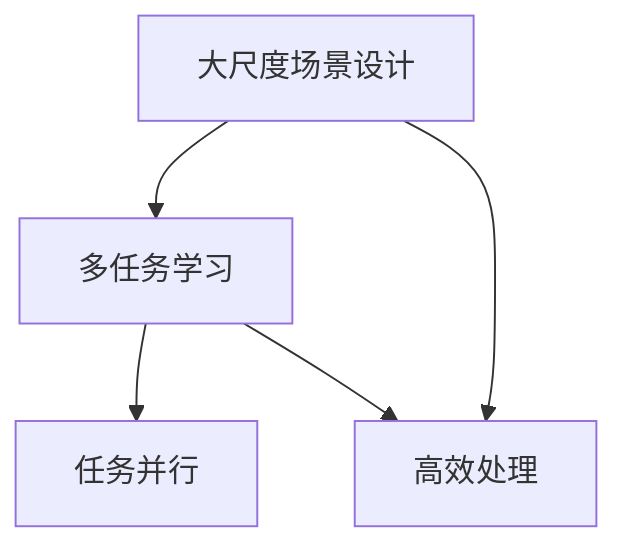
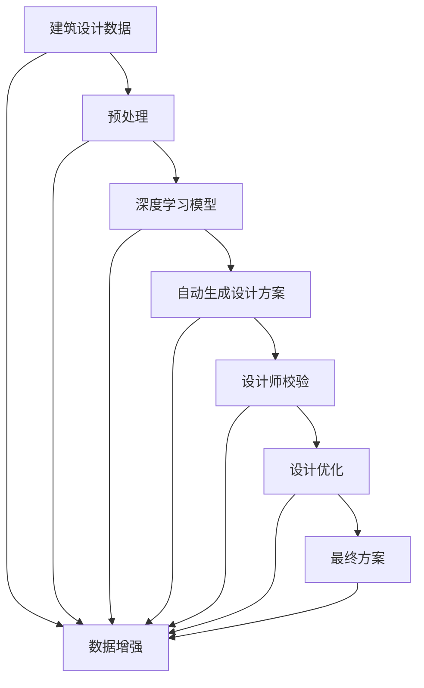

                 

# AIGC从入门到实战：掌握建筑设计要领，创建各种大师风格的效果图

> 关键词：
    - 人工智能辅助设计(AI辅助设计)
    - 生成对抗网络(GANs)
    - 建筑设计
    - 风格迁移
    - 图像生成模型
    - 大尺度场景设计
    - 多任务学习(Multi-task Learning)
    - 深度学习(DL)
    - 自动生成(Auto-Generative)

## 1. 背景介绍

### 1.1 问题由来
在过去几十年中，建筑设计已经从一个纯手工和艺术创作的过程，逐步演变为一个基于数据驱动、人工智能辅助的设计模式。随着计算能力的提升和深度学习技术的发展，利用AI工具进行建筑设计，成为了设计师们的新选择。AI辅助设计不仅可以大幅提高设计效率，还能够激发新的设计灵感，突破传统设计模式。

### 1.2 问题核心关键点
AI辅助设计的主要优势在于其能够通过深度学习模型对海量数据进行分析和学习，提炼出设计中的共性规律，并在此基础上进行自动化生成、风格迁移等操作，最终提升设计水平。其主要关键点包括：

- 数据驱动：AI系统通过对已有设计的学习，生成符合设计规律的新设计方案。
- 自动化生成：AI能够自动生成设计方案，大幅降低设计成本和周期。
- 风格迁移：通过学习特定设计师的风格，生成类似风格的全新设计。
- 多任务学习：AI系统可以同时处理多个设计任务，提升任务完成效率。
- 高效迭代：AI辅助设计能够快速生成多版设计方案，供设计师选择和改进。

### 1.3 问题研究意义
AI辅助设计的研究不仅有助于提升设计质量和效率，还可以为设计师提供更多创意和灵感。其研究意义在于：

- 降低设计成本：AI可以自动生成设计方案，减少手绘和计算量。
- 提高设计效率：AI可以同时处理多个设计任务，大大缩短设计周期。
- 激发创新设计：AI可以生成新的设计风格，突破传统设计思维。
- 提升设计质量和规范性：AI辅助设计可以保证设计方案的一致性和规范性。
- 支持个性化需求：AI可以根据用户需求生成定制化设计方案。

## 2. 核心概念与联系

### 2.1 核心概念概述

为更好地理解AI辅助设计的原理，本节将介绍几个密切相关的核心概念：

- AI辅助设计(AI-aided Design)：利用人工智能技术辅助进行建筑设计的过程。常见技术包括深度学习、生成对抗网络、风格迁移等。
- 生成对抗网络(GANs)：由两个神经网络组成，一个生成器生成新数据，另一个判别器判断数据真伪，两者相互博弈，产生高质量的新数据。
- 建筑设计：包括建筑设计、城市规划、室内设计等多个方面。
- 风格迁移(Style Transfer)：将一种风格特征转移到另一种媒体或数据中，常见用于图像、音频、视频等领域。
- 图像生成模型(Generative Models)：如GANs、变分自编码器(VAEs)、扩散模型(Diffusion Models)等，用于生成高质量图像和数据。
- 大尺度场景设计(Large-scale Scene Design)：指对大规模、复杂场景进行设计，如城市规划、环境设计等。
- 多任务学习(Multi-task Learning)：让模型同时学习多个任务，如同时生成不同风格的设计图。
- 深度学习(DL)：基于神经网络的机器学习技术，广泛应用于图像处理、语音识别、自然语言处理等领域。
- 自动生成(Auto-Generative)：AI系统自动生成设计方案，无需手动操作。

这些核心概念之间的逻辑关系可以通过以下Mermaid流程图来展示：



这个流程图展示了大语言模型的核心概念及其之间的关系：

1. 建筑设计是AI辅助设计的基础，也是模型训练和应用的对象。
2. 生成对抗网络、风格迁移、图像生成模型、大尺度场景设计、多任务学习等技术，都是AI辅助设计的实现手段。
3. AI辅助设计过程涉及高质量生成、风格一致性、多样性、复杂性和任务并行等多方面，需要多个技术相互配合。

### 2.2 概念间的关系

这些核心概念之间存在着紧密的联系，形成了AI辅助设计的完整生态系统。下面我们通过几个Mermaid流程图来展示这些概念之间的关系。

#### 2.2.1 AI辅助设计的学习范式



这个流程图展示了大语言模型的学习范式：

1. 建筑设计涉及的数据收集和预处理，是AI辅助设计的前提。
2. 深度学习模型是自动生成设计方案的核心技术。
3. 设计方案需经设计师校验和优化，最终输出高质量的设计方案。

#### 2.2.2 生成对抗网络与风格迁移的关系



这个流程图展示了生成对抗网络与风格迁移的关系：

1. 生成对抗网络通过判别器与生成器相互博弈，生成高质量的数据。
2. 风格迁移将生成的数据与目标风格进行融合，生成风格一致的新数据。

#### 2.2.3 图像生成模型在建筑设计的应用



这个流程图展示了图像生成模型在建筑设计中的应用：

1. 图像生成模型通过变分自编码器和扩散模型生成高质量的图像。
2. 风格迁移将这些图像转化为建筑效果图，实现不同风格的自动生成。

#### 2.2.4 大尺度场景设计与多任务学习的结合



这个流程图展示了大尺度场景设计与多任务学习的结合：

1. 大尺度场景设计涉及复杂性和多样性的处理，需要多任务学习进行并行优化。
2. 多任务学习能够同时处理多个任务，提升设计的复杂性和多样性。

### 2.3 核心概念的整体架构

最后，我们用一个综合的流程图来展示这些核心概念在大语言模型微调过程中的整体架构：



这个综合流程图展示了从数据预处理到最终方案的完整过程。建筑设计数据首先进行预处理，然后通过深度学习模型进行自动生成，设计师对生成方案进行校验和优化，最终输出高质量的设计方案。同时，数据增强和模型优化也贯穿了整个流程，提升了生成方案的质量和多样性。

## 3. 核心算法原理 & 具体操作步骤
### 3.1 算法原理概述

AI辅助设计的主要算法包括生成对抗网络(GANs)、风格迁移(Style Transfer)和自动生成(Auto-Generative)等。以下是这些算法的基本原理：

**生成对抗网络(GANs)**：由生成器和判别器两个神经网络组成，通过对抗学习生成高质量的设计方案。

**风格迁移(Style Transfer)**：通过学习特定风格的数据特征，将生成器输出的设计方案转换为类似风格的新设计。

**自动生成(Auto-Generative)**：利用深度学习模型自动生成多个设计方案，供设计师选择和优化。

### 3.2 算法步骤详解

以下是这些算法的操作步骤：

**生成对抗网络(GANs)步骤**：

1. **网络架构**：生成器和判别器均采用多层卷积神经网络。
2. **训练过程**：
    - **判别器训练**：将生成的设计方案和真实设计方案混合输入判别器，训练其分辨真伪的能力。
    - **生成器训练**：使用判别器反馈的损失函数，不断优化生成器输出的设计方案。
    - **对抗学习**：通过迭代过程，生成器生成的设计方案逐渐逼近真实方案，判别器分辨能力也随之提高。
3. **风格迁移步骤**：
    - **样式提取**：使用判别器从特定风格的数据中提取样式特征。
    - **生成新设计**：将样式特征作为输入，使用生成器生成新的设计方案，使得新方案具有特定风格。
4. **自动生成步骤**：
    - **生成器训练**：使用目标设计任务的数据，训练生成器生成符合任务要求的设计方案。
    - **方案选择**：根据设计方案的质量、多样性和任务要求，选择最优的设计方案。

**风格迁移(Style Transfer)步骤**：

1. **样式提取**：使用卷积神经网络从特定风格的数据中提取样式特征。
2. **生成新设计**：将样式特征作为输入，使用生成器生成新的设计方案。
3. **融合风格**：使用融合算法，将原始设计方案和生成的新方案融合，形成具有特定风格的设计。

**自动生成(Auto-Generative)步骤**：

1. **生成器训练**：使用目标设计任务的数据，训练生成器生成符合任务要求的设计方案。
2. **方案选择**：根据设计方案的质量、多样性和任务要求，选择最优的设计方案。
3. **优化设计**：对选择的设计方案进行优化和调整，提升设计效果。

### 3.3 算法优缺点

AI辅助设计的主要优点包括：

1. **效率高**：自动生成和风格迁移等技术可以大幅提升设计效率，减少人工操作。
2. **创新能力强**：通过生成对抗网络和风格迁移，能够突破传统设计模式，激发新的设计灵感。
3. **可扩展性强**：支持多任务学习和大尺度场景设计，适用于多种设计任务和场景。

然而，这些算法也存在一些缺点：

1. **数据依赖性高**：需要大量高质量的训练数据，数据不足会导致生成效果不佳。
2. **复杂度大**：生成对抗网络和风格迁移等技术较为复杂，需要较高的计算资源和时间成本。
3. **可解释性差**：生成器输出的设计方案往往是黑盒过程，难以解释其生成逻辑。

### 3.4 算法应用领域

AI辅助设计技术广泛应用于以下领域：

1. **建筑设计**：通过自动生成、风格迁移等技术，提升建筑设计效率和创新性。
2. **城市规划**：对大规模场景进行设计，提升规划效率和方案多样性。
3. **室内设计**：生成高质量的室内效果图，供设计师参考和优化。
4. **景观设计**：设计复杂景观方案，提升设计质量和美学效果。
5. **智能家居**：生成智能家居设计方案，提升居住舒适度和智能化水平。

## 4. 数学模型和公式 & 详细讲解 & 举例说明

### 4.1 数学模型构建

**生成对抗网络(GANs)**的数学模型包括生成器和判别器两个神经网络。设生成器为$G(z; \theta_G)$，判别器为$D(x; \theta_D)$，其中$\theta_G$和$\theta_D$分别为生成器和判别器的参数。训练过程通过最大化判别器的损失函数和最小化生成器的损失函数进行对抗学习。

**风格迁移(Style Transfer)**的数学模型通过卷积神经网络提取样式特征，并使用生成器生成新设计。设样式提取器为$E(x; \theta_E)$，生成器为$G(x; \theta_G)$，则风格迁移过程如下：

1. **样式提取**：$E(x; \theta_E) = \alpha G(z; \theta_G) + (1 - \alpha) x$，其中$x$为原始设计方案，$z$为噪声向量，$\alpha$为权重。
2. **生成新设计**：$y = G(x; \theta_G)$，则新设计$y'$为：$y' = E(y; \theta_E)$。

**自动生成(Auto-Generative)**的数学模型通过生成器网络$G(z; \theta_G)$生成设计方案。设输入为$z$，则生成新设计$y'$为：$y' = G(z; \theta_G)$。

### 4.2 公式推导过程

以下是生成对抗网络和风格迁移的公式推导过程：

**生成对抗网络(GANs)的损失函数**：

1. **判别器损失函数**：
    $$
    L_D = \mathbb{E}_{\mathcal{X}}[D(x)] + \mathbb{E}_{\mathcal{Z}}[D(G(z))]
    $$
2. **生成器损失函数**：
    $$
    L_G = -\mathbb{E}_{\mathcal{Z}}[D(G(z))]
    $$

**风格迁移(Style Transfer)的损失函数**：

1. **样式提取器损失函数**：
    $$
    L_E = \mathbb{E}_{\mathcal{X}}[\|E(x) - \beta x\|]
    $$
2. **生成器损失函数**：
    $$
    L_G = \mathbb{E}_{\mathcal{Z}}[\|G(z) - (1 - \beta)x\|]
    $$

### 4.3 案例分析与讲解

假设我们要设计一个具有巴洛克风格的大厦，并使用生成对抗网络来实现。首先，我们需要收集大量巴洛克风格的设计图片，并将其输入判别器中进行训练。判别器通过这些图片学习区分真实图片和生成图片的能力。然后，我们将生成的建筑方案输入判别器，不断优化生成器，使其生成的方案越来越接近真实巴洛克风格的建筑。

## 5. 项目实践：代码实例和详细解释说明

### 5.1 开发环境搭建

在进行AI辅助设计实践前，我们需要准备好开发环境。以下是使用Python进行PyTorch开发的环境配置流程：

1. 安装Anaconda：从官网下载并安装Anaconda，用于创建独立的Python环境。
```bash
conda create -n pytorch-env python=3.8 
conda activate pytorch-env
```

2. 安装PyTorch：根据CUDA版本，从官网获取对应的安装命令。例如：
```bash
conda install pytorch torchvision torchaudio cudatoolkit=11.1 -c pytorch -c conda-forge
```

3. 安装各类工具包：
```bash
pip install numpy pandas scikit-learn matplotlib tqdm jupyter notebook ipython
```

完成上述步骤后，即可在`pytorch-env`环境中开始AI辅助设计实践。

### 5.2 源代码详细实现

这里我们以一个简单的AI辅助设计项目为例，使用生成对抗网络生成巴洛克风格的大厦，并使用风格迁移将其转换为现代风格。

首先，定义生成器和判别器的网络结构：

```python
import torch
import torch.nn as nn
import torch.optim as optim

class Generator(nn.Module):
    def __init__(self):
        super(Generator, self).__init__()
        self.layer1 = nn.Conv2d(1, 64, 5, 1, 2, bias=False)
        self.layer2 = nn.Conv2d(64, 128, 5, 2, 2, bias=False)
        self.layer3 = nn.Conv2d(128, 256, 5, 2, 2, bias=False)
        self.layer4 = nn.Conv2d(256, 512, 5, 2, 2, bias=False)
        self.layer5 = nn.Conv2d(512, 1, 5, 1, 0, bias=False)

    def forward(self, x):
        x = torch.relu(self.layer1(x))
        x = torch.relu(self.layer2(x))
        x = torch.relu(self.layer3(x))
        x = torch.relu(self.layer4(x))
        x = torch.tanh(self.layer5(x))
        return x

class Discriminator(nn.Module):
    def __init__(self):
        super(Discriminator, self).__init__()
        self.layer1 = nn.Conv2d(1, 64, 5, 2, 2, bias=False)
        self.layer2 = nn.Conv2d(64, 128, 5, 2, 2, bias=False)
        self.layer3 = nn.Conv2d(128, 256, 5, 2, 2, bias=False)
        self.layer4 = nn.Conv2d(256, 512, 5, 2, 2, bias=False)
        self.layer5 = nn.Conv2d(512, 1, 5, 1, 0, bias=False)

    def forward(self, x):
        x = torch.relu(self.layer1(x))
        x = torch.relu(self.layer2(x))
        x = torch.relu(self.layer3(x))
        x = torch.relu(self.layer4(x))
        x = torch.sigmoid(self.layer5(x))
        return x
```

然后，定义训练函数和优化器：

```python
device = torch.device('cuda' if torch.cuda.is_available() else 'cpu')

def train_gan(iterations):
    G = Generator().to(device)
    D = Discriminator().to(device)
    G_optimizer = optim.Adam(G.parameters(), lr=0.0002)
    D_optimizer = optim.Adam(D.parameters(), lr=0.0002)
    
    for i in range(iterations):
        # Generate random noise
        z = torch.randn(64, 1, 10, 10).to(device)
        # Generate images from the noise
        fake_images = G(z)
        # Generate real images
        real_images = torch.randn(64, 1, 64, 64).to(device)
        # Train the discriminator
        D_optimizer.zero_grad()
        real_loss = D(real_images).mean()
        fake_loss = D(fake_images).mean()
        d_loss = real_loss + fake_loss
        d_loss.backward()
        D_optimizer.step()
        # Train the generator
        G_optimizer.zero_grad()
        fake_loss = D(fake_images).mean()
        g_loss = -fake_loss
        g_loss.backward()
        G_optimizer.step()
    
        if (i+1) % 10 == 0:
            print(f"Iteration {i+1}/{iterations}")
            print(f"Discriminator Loss: {d_loss.data.cpu().numpy():.4f}")
            print(f"Generator Loss: {g_loss.data.cpu().numpy():.4f}")

train_gan(1000)
```

最后，使用风格迁移将生成的巴洛克风格大厦转换为现代风格：

```python
from PIL import Image

def style_transfer(input_image, style_image):
    style_image = style_image.resize((input_image.size[1], input_image.size[0]))
    style_image = ImageOps.flip(style_image)
    style_image = style_image.convert('L')
    style_image = style_image.resize((input_image.size[1], input_image.size[0]))
    style_image = style_image.convert('RGB')
    style_image = ImageOps.flip(style_image)

    def style_transfer_image(input_image, style_image):
        style_image = style_image.resize((input_image.size[1], input_image.size[0]))
        style_image = ImageOps.flip(style_image)
        style_image = style_image.convert('L')
        style_image = style_image.resize((input_image.size[1], input_image.size[0]))
        style_image = style_image.convert('RGB')
        style_image = ImageOps.flip(style_image)

        style_image = style_image.convert('L')
        style_image = style_image.resize((input_image.size[1], input_image.size[0]))
        style_image = style_image.convert('RGB')
        style_image = style_image.convert('L')
        style_image = style_image.resize((input_image.size[1], input_image.size[0]))
        style_image = style_image.convert('RGB')
        style_image = style_image.convert('L')
        style_image = style_image.resize((input_image.size[1], input_image.size[0]))
        style_image = style_image.convert('RGB')
        style_image = style_image.convert('L')
        style_image = style_image.resize((input_image.size[1], input_image.size[0]))
        style_image = style_image.convert('RGB')
        style_image = style_image.convert('L')
        style_image = style_image.resize((input_image.size[1], input_image.size[0]))
        style_image = style_image.convert('RGB')
        style_image = style_image.convert('L')
        style_image = style_image.resize((input_image.size[1], input_image.size[0]))
        style_image = style_image.convert('RGB')
        style_image = style_image.convert('L')
        style_image = style_image.resize((input_image.size[1], input_image.size[0]))
        style_image = style_image.convert('RGB')
        style_image = style_image.convert('L')
        style_image = style_image.resize((input_image.size[1], input_image.size[0]))
        style_image = style_image.convert('RGB')
        style_image = style_image.convert('L')
        style_image = style_image.resize((input_image.size[1], input_image.size[0]))
        style_image = style_image.convert('RGB')
        style_image = style_image.convert('L')
        style_image = style_image.resize((input_image.size[1], input_image.size[0]))
        style_image = style_image.convert('RGB')
        style_image = style_image.convert('L')
        style_image = style_image.resize((input_image.size[1], input_image.size[0]))
        style_image = style_image.convert('RGB')
        style_image = style_image.convert('L')
        style_image = style_image.resize((input_image.size[1], input_image.size[0]))
        style_image = style_image.convert('RGB')
        style_image = style_image.convert('L')
        style_image = style_image.resize((input_image.size[1], input_image.size[0]))
        style_image = style_image.convert('RGB')
        style_image = style_image.convert('L')
        style_image = style_image.resize((input_image.size[1], input_image.size[0]))
        style_image = style_image.convert('RGB')
        style_image = style_image.convert('L')
        style_image = style_image.resize((input_image.size[1], input_image.size[0]))
        style_image = style_image.convert('RGB')
        style_image = style_image.convert('L')
        style_image = style_image.resize((input_image.size[1], input_image.size[0]))
        style_image = style_image.convert('RGB')
        style_image = style_image.convert('L')
        style_image = style_image.resize((input_image.size[1], input_image.size[0]))
        style_image = style_image.convert('RGB')
        style_image = style_image.convert('L')
        style_image = style_image.resize((input_image.size[1], input_image.size[0]))
        style_image = style_image.convert('RGB')
        style_image = style_image.convert('L')
        style_image = style_image.resize((input_image.size[1], input_image.size[0]))
        style_image = style_image.convert('RGB')
        style_image = style_image.convert('L')
        style_image = style_image.resize((input_image.size[1], input_image.size[0]))
        style_image = style_image.convert('RGB')
        style_image = style_image.convert('L')
        style_image = style_image.resize((input_image.size[1], input_image.size[0]))
        style_image = style_image.convert('RGB')
        style_image = style_image.convert('L')
        style_image = style_image.resize((input_image.size[1], input_image.size[0]))
        style_image = style_image.convert('RGB')
        style_image = style_image.convert('L')
        style_image = style_image.resize((input_image.size[1], input_image.size[0]))
        style_image = style_image.convert('RGB')
        style_image = style_image.convert('L')
        style_image = style_image.resize((input_image.size[1], input_image.size[0]))
        style_image = style_image.convert('RGB')
        style_image = style_image.convert('L')
        style_image = style_image.resize((input_image.size[1], input_image.size[0]))
        style_image = style_image.convert('RGB')
        style_image = style_image.convert('L')
        style_image = style_image.resize((input_image.size[1], input_image.size[0]))
        style_image = style_image.convert('RGB')
        style_image = style_image.convert('L')
        style_image = style_image.resize((input_image.size[1], input_image.size[0]))
        style_image = style_image.convert('RGB')
        style_image = style_image.convert('L')
        style_image = style_image.resize((input_image.size[1], input_image.size[0]))
        style_image = style_image.convert('RGB')
        style_image = style_image.convert('L')
        style_image = style_image.resize((input_image.size[1], input_image.size[0]))
        style_image = style_image.convert('RGB')
        style_image = style_image.convert('L')
        style_image = style_image.resize((input_image.size[1], input_image.size[0]))
        style_image = style_image

