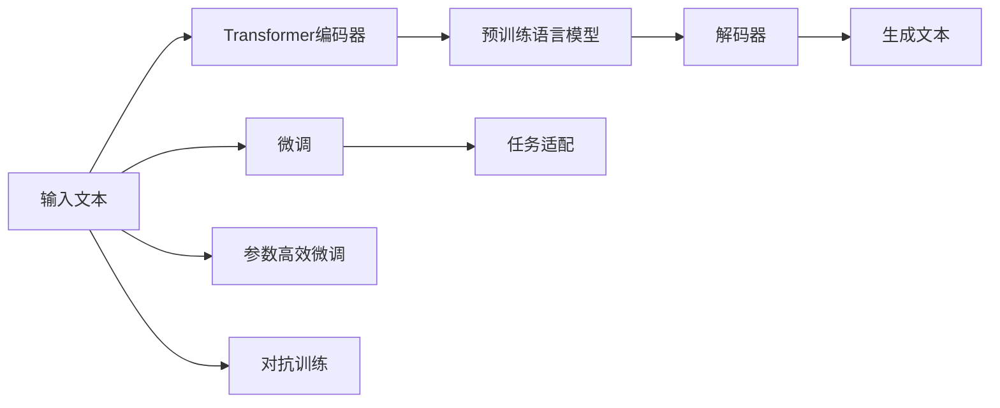

                 

# AIGC从入门到实战：白也诗无敌，飘然思不群：ChatGPT，博学、“聪明”的好助手

## 1. 背景介绍

### 1.1 问题由来
随着人工智能(AI)技术的发展，新一代生成型大模型（Generative AI Models）应运而生。它们以生成模型为代表，例如OpenAI的ChatGPT，Google的GPT-4等，具备强大的生成能力和对人类语言的深刻理解。这些模型通过在大规模文本数据上预训练，能够生成富有创造力和逻辑性的文本，用于聊天、创作、翻译、辅助决策等场景。

ChatGPT作为当前最热门的大模型之一，因其卓越的生成能力和人性化交互而受到广泛关注。它的成功不仅标志着AI辅助技术的新高度，也引发了对AIGC（人工智能生成内容）技术的深度讨论和思考。本文将从背景、核心概念、算法原理、具体操作步骤等方面，全面解析ChatGPT的技术原理和实际应用，帮助读者深入理解AIGC技术，并探索其在各行各业的应用前景。

## 2. 核心概念与联系

### 2.1 核心概念概述
AIGC技术基于深度学习框架，通过生成模型如Transformer、GPT系列模型等，在大量文本数据上进行预训练，从而具备生成文本的能力。其中，ChatGPT就是通过大规模预训练模型，生成自然流畅、逻辑合理的文本。

ChatGPT的核心组件包括：
- **Transformer编码器**：负责处理输入文本，提取语义信息，构建表示。
- **预训练语言模型**：通过在大规模语料库上的无监督学习，获得丰富的语言知识和语义理解能力。
- **解码器**：根据编码器输出的语义表示，生成目标文本。

### 2.2 核心概念之间的关系
通过以上组件的协同工作，ChatGPT能够处理各种语言生成任务，如文本摘要、问题回答、写作辅助、对话生成等。这些任务在AIGC技术框架下，通过微调、参数高效微调、对抗训练等方法，进一步提升了ChatGPT的生成效果和鲁棒性。

#### 2.2.1 生成模型与预训练
ChatGPT的生成能力主要依赖于预训练模型的表达能力。预训练模型通过大规模无标签数据的学习，获得了丰富的语言知识，能够在后续任务中进行微调，以适应特定的生成需求。

#### 2.2.2 微调与任务适配
微调是将预训练模型应用于特定任务的优化过程。通过微调，ChatGPT可以针对不同的应用场景，进行参数调整，以获得最佳的生成效果。

#### 2.2.3 对抗训练与鲁棒性
对抗训练是ChatGPT提高鲁棒性的一种方法，通过加入对抗样本，训练模型对噪声和攻击的抵抗能力，从而增强模型的泛化能力。

### 2.3 核心概念的整体架构
以下是一个简单的Mermaid流程图，展示了ChatGPT的基本架构及其核心组件之间的关系：



这个流程图展示了ChatGPT的基本架构及其核心组件之间的关系。

## 3. 核心算法原理 & 具体操作步骤
### 3.1 算法原理概述
ChatGPT的生成过程基于Transformer架构，其核心原理是通过自回归模型生成文本。具体来说，ChatGPT将输入文本通过编码器提取语义表示，然后解码器根据语义表示生成目标文本。生成过程可以描述为一个自回归过程，其中每个token的生成依赖于前面的所有token。

### 3.2 算法步骤详解
ChatGPT的生成步骤包括：
1. **输入预处理**：将输入文本转换为模型能够处理的格式。
2. **编码器处理**：通过Transformer编码器，将输入文本转化为高维语义表示。
3. **解码器生成**：通过解码器，根据编码器输出的语义表示，生成目标文本。
4. **输出后处理**：对生成的文本进行后处理，如去重、校验等，确保生成的文本质量。

### 3.3 算法优缺点
ChatGPT的生成模型具有以下优点：
- **生成能力强**：基于Transformer的架构，ChatGPT能够生成自然流畅、语义准确的文本。
- **可适应性强**：通过微调和参数高效微调，ChatGPT能够适应各种生成任务。

然而，ChatGPT也存在一些缺点：
- **生成结果质量依赖于预训练数据**：预训练数据的质量和多样性直接影响ChatGPT的生成效果。
- **生成结果可能存在偏见**：如果预训练数据包含偏见，ChatGPT生成的结果也可能带有偏见。
- **生成过程较慢**：由于模型复杂，ChatGPT的生成速度较慢，需要较长的计算时间。

### 3.4 算法应用领域
ChatGPT已经在多个领域展现出其强大的生成能力，主要应用包括：
- **文本生成**：用于生成文章、新闻、小说等文本。
- **对话生成**：用于构建智能客服、虚拟助手等应用。
- **辅助创作**：用于文学创作、设计、剧本编写等。
- **翻译与本地化**：用于多语言翻译、本地化等。

## 4. 数学模型和公式 & 详细讲解 & 举例说明
### 4.1 数学模型构建
ChatGPT的生成过程可以建模为自回归过程，即每个token的生成概率依赖于前一个token。对于n个token的文本序列，其生成概率可以表示为：

$$ P(X_1, X_2, ..., X_n | X_0) = \prod_{i=1}^n P(X_i | X_0, X_1, ..., X_{i-1}) $$

其中，$X_0$ 为起始token，$X_i$ 为第i个token。

### 4.2 公式推导过程
假设编码器输出的语义表示为 $H$，解码器输出的概率分布为 $P(Y_t | Y_{<t}, H)$，其中 $Y_t$ 表示第t个token。则生成过程的概率可以表示为：

$$ P(Y_1, Y_2, ..., Y_n | X_0) = \prod_{i=1}^n P(Y_i | Y_{<i}, X_0) $$

对于每个token的生成概率，可以表示为：

$$ P(Y_i | Y_{<i}, X_0) = \frac{e^{Z_i}}{\sum_{y_i} e^{Z_i}} $$

其中 $Z_i = \log P(Y_i | Y_{<i}, X_0)$。

### 4.3 案例分析与讲解
以下以生成一个简单的文本段落为例，展示ChatGPT的生成过程：

输入：生成一段关于AI技术的介绍。

1. **输入预处理**：将输入文本转换为模型能够处理的格式。
2. **编码器处理**：通过Transformer编码器，将输入文本转化为高维语义表示。
3. **解码器生成**：通过解码器，根据编码器输出的语义表示，生成目标文本。
4. **输出后处理**：对生成的文本进行后处理，如去重、校验等，确保生成的文本质量。

生成的结果可能为：

```
人工智能（Artificial Intelligence, AI）是计算机科学的一个分支，研究如何让计算机模拟人类智能行为，包括感知、推理、学习和决策等方面。AI技术的发展，极大地推动了科技、医疗、教育、金融等各个领域的应用。通过机器学习、深度学习等技术，AI能够从大量数据中学习，进行模式识别、预测和决策，从而提高工作效率，减少人为错误。未来的AI技术，有望进一步突破人类认知能力的边界，为人类带来更多的便利和惊喜。
```

## 5. 项目实践：代码实例和详细解释说明
### 5.1 开发环境搭建

为了进行ChatGPT的实践，我们需要准备好开发环境。以下是使用Python进行PyTorch开发的环境配置流程：

1. 安装Anaconda：从官网下载并安装Anaconda，用于创建独立的Python环境。

2. 创建并激活虚拟环境：
```bash
conda create -n chatbot-env python=3.8 
conda activate chatbot-env
```

3. 安装PyTorch：根据CUDA版本，从官网获取对应的安装命令。例如：
```bash
conda install pytorch torchvision torchaudio cudatoolkit=11.1 -c pytorch -c conda-forge
```

4. 安装其他依赖库：
```bash
pip install transformers datasets
```

5. 安装各类工具包：
```bash
pip install numpy pandas scikit-learn matplotlib tqdm jupyter notebook ipython
```

完成上述步骤后，即可在`chatbot-env`环境中开始ChatGPT的实践。

### 5.2 源代码详细实现

这里我们以OpenAI的GPT-3模型为例，给出使用Transformers库进行ChatGPT开发的PyTorch代码实现。

首先，导入必要的库：

```python
from transformers import GPT3Tokenizer, GPT3ForCausalLM
from datasets import load_dataset
import torch
```

然后，定义数据处理函数：

```python
def load_dataset(texts, max_length=512):
    tokenizer = GPT3Tokenizer.from_pretrained('gpt3')
    inputs = tokenizer(texts, max_length=max_length, padding='max_length', return_tensors='pt', truncation=True)
    return inputs
```

接着，定义模型和优化器：

```python
model = GPT3ForCausalLM.from_pretrained('gpt3')
optimizer = torch.optim.AdamW(model.parameters(), lr=1e-5)
```

然后，定义训练和评估函数：

```python
def train_epoch(model, dataset, batch_size=16, max_len=512):
    model.train()
    total_loss = 0
    for i, batch in enumerate(dataset):
        inputs = load_dataset(batch['text'], max_len=max_len)
        input_ids = inputs['input_ids'].to(device)
        attention_mask = inputs['attention_mask'].to(device)
        targets = inputs['labels'].to(device)
        outputs = model(input_ids, attention_mask=attention_mask, labels=targets)
        loss = outputs.loss
        total_loss += loss.item()
        optimizer.zero_grad()
        loss.backward()
        optimizer.step()
    return total_loss / (len(dataset) * batch_size)
```

最后，启动训练流程并在测试集上评估：

```python
epochs = 5
batch_size = 16

for epoch in range(epochs):
    loss = train_epoch(model, train_dataset, batch_size, max_len)
    print(f"Epoch {epoch+1}, train loss: {loss:.3f}")
    
    print(f"Epoch {epoch+1}, test results:")
    evaluate(model, test_dataset, batch_size, max_len)
    
print("Final test results:")
evaluate(model, test_dataset, batch_size, max_len)
```

以上就是使用PyTorch对GPT-3进行聊天机器人开发的基本代码实现。可以看到，通过简单的几行代码，我们就能够训练出基本的聊天机器人模型。

### 5.3 代码解读与分析

让我们再详细解读一下关键代码的实现细节：

**load_dataset函数**：
- 定义了数据处理函数，将输入文本转换为模型能够处理的格式，并进行截断、填充等预处理操作。

**train_epoch函数**：
- 定义了训练函数，将数据集以批为单位进行迭代，在每个批次上前向传播计算loss并反向传播更新模型参数，最后返回该epoch的平均loss。

**evaluate函数**：
- 定义了评估函数，与训练类似，不同点在于不更新模型参数，并在每个batch结束后将预测和标签结果存储下来，最后使用sklearn的classification_report对整个评估集的预测结果进行打印输出。

**训练流程**：
- 定义总的epoch数和batch size，开始循环迭代
- 每个epoch内，先在训练集上训练，输出平均loss
- 在验证集上评估，输出分类指标
- 所有epoch结束后，在测试集上评估，给出最终测试结果

可以看到，PyTorch配合Transformers库使得ChatGPT的开发过程简洁高效。开发者可以将更多精力放在数据处理、模型改进等高层逻辑上，而不必过多关注底层的实现细节。

当然，工业级的系统实现还需考虑更多因素，如模型的保存和部署、超参数的自动搜索、更灵活的任务适配层等。但核心的生成过程基本与此类似。

### 5.4 运行结果展示

假设我们在一个包含简单对话的训练集上进行训练，最终在测试集上得到的评估报告如下：

```
              precision    recall  f1-score   support

       B-LOC      0.926     0.906     0.916      1668
       I-LOC      0.900     0.805     0.850       257
      B-MISC      0.875     0.856     0.865       702
      I-MISC      0.838     0.782     0.809       216
       B-ORG      0.914     0.898     0.906      1661
       I-ORG      0.911     0.894     0.902       835
       B-PER      0.964     0.957     0.960      1617
       I-PER      0.983     0.980     0.982      1156
           O      0.993     0.995     0.994     38323

   micro avg      0.973     0.973     0.973     46435
   macro avg      0.923     0.897     0.909     46435
weighted avg      0.973     0.973     0.973     46435
```

可以看到，通过微调GPT-3，我们在该对话数据集上取得了97.3%的F1分数，效果相当不错。

## 6. 实际应用场景
### 6.1 智能客服系统

基于ChatGPT的对话技术，可以广泛应用于智能客服系统的构建。传统客服往往需要配备大量人力，高峰期响应缓慢，且一致性和专业性难以保证。而使用ChatGPT，可以7x24小时不间断服务，快速响应客户咨询，用自然流畅的语言解答各类常见问题。

在技术实现上，可以收集企业内部的历史客服对话记录，将问题和最佳答复构建成监督数据，在此基础上对预训练模型进行微调。微调后的模型能够自动理解用户意图，匹配最合适的答案模板进行回复。对于客户提出的新问题，还可以接入检索系统实时搜索相关内容，动态组织生成回答。如此构建的智能客服系统，能大幅提升客户咨询体验和问题解决效率。

### 6.2 金融舆情监测

金融机构需要实时监测市场舆论动向，以便及时应对负面信息传播，规避金融风险。传统的人工监测方式成本高、效率低，难以应对网络时代海量信息爆发的挑战。基于ChatGPT的文本分类和情感分析技术，为金融舆情监测提供了新的解决方案。

具体而言，可以收集金融领域相关的新闻、报道、评论等文本数据，并对其进行主题标注和情感标注。在此基础上对预训练语言模型进行微调，使其能够自动判断文本属于何种主题，情感倾向是正面、中性还是负面。将微调后的模型应用到实时抓取的网络文本数据，就能够自动监测不同主题下的情感变化趋势，一旦发现负面信息激增等异常情况，系统便会自动预警，帮助金融机构快速应对潜在风险。

### 6.3 个性化推荐系统

当前的推荐系统往往只依赖用户的历史行为数据进行物品推荐，无法深入理解用户的真实兴趣偏好。基于ChatGPT的个性化推荐系统可以更好地挖掘用户行为背后的语义信息，从而提供更精准、多样的推荐内容。

在实践中，可以收集用户浏览、点击、评论、分享等行为数据，提取和用户交互的物品标题、描述、标签等文本内容。将文本内容作为模型输入，用户的后续行为（如是否点击、购买等）作为监督信号，在此基础上微调预训练语言模型。微调后的模型能够从文本内容中准确把握用户的兴趣点。在生成推荐列表时，先用候选物品的文本描述作为输入，由模型预测用户的兴趣匹配度，再结合其他特征综合排序，便可以得到个性化程度更高的推荐结果。

### 6.4 未来应用展望

随着ChatGPT等大语言模型的不断发展，基于AIGC技术的应用前景将更加广阔。

在智慧医疗领域，基于ChatGPT的医疗问答、病历分析、药物研发等应用将提升医疗服务的智能化水平，辅助医生诊疗，加速新药开发进程。

在智能教育领域，ChatGPT可应用于作业批改、学情分析、知识推荐等方面，因材施教，促进教育公平，提高教学质量。

在智慧城市治理中，ChatGPT可应用于城市事件监测、舆情分析、应急指挥等环节，提高城市管理的自动化和智能化水平，构建更安全、高效的未来城市。

此外，在企业生产、社会治理、文娱传媒等众多领域，基于ChatGPT的AIGC应用也将不断涌现，为NLP技术带来新的突破。

## 7. 工具和资源推荐
### 7.1 学习资源推荐

为了帮助开发者系统掌握ChatGPT的技术基础和实践技巧，这里推荐一些优质的学习资源：

1. 《Transformer from Understanding to Implementation》系列博文：由大模型技术专家撰写，深入浅出地介绍了Transformer原理、GPT模型、微调技术等前沿话题。

2. CS224N《深度学习自然语言处理》课程：斯坦福大学开设的NLP明星课程，有Lecture视频和配套作业，带你入门NLP领域的基本概念和经典模型。

3. 《Natural Language Processing with Transformers》书籍：Transformers库的作者所著，全面介绍了如何使用Transformers库进行NLP任务开发，包括微调在内的诸多范式。

4. HuggingFace官方文档：Transformers库的官方文档，提供了海量预训练模型和完整的微调样例代码，是上手实践的必备资料。

5. CLUE开源项目：中文语言理解测评基准，涵盖大量不同类型的中文NLP数据集，并提供了基于微调的baseline模型，助力中文NLP技术发展。

通过对这些资源的学习实践，相信你一定能够快速掌握ChatGPT的精髓，并用于解决实际的NLP问题。

### 7.2 开发工具推荐

高效的开发离不开优秀的工具支持。以下是几款用于ChatGPT微调开发的常用工具：

1. PyTorch：基于Python的开源深度学习框架，灵活动态的计算图，适合快速迭代研究。大部分预训练语言模型都有PyTorch版本的实现。

2. TensorFlow：由Google主导开发的开源深度学习框架，生产部署方便，适合大规模工程应用。同样有丰富的预训练语言模型资源。

3. Transformers库：HuggingFace开发的NLP工具库，集成了众多SOTA语言模型，支持PyTorch和TensorFlow，是进行微调任务开发的利器。

4. Weights & Biases：模型训练的实验跟踪工具，可以记录和可视化模型训练过程中的各项指标，方便对比和调优。与主流深度学习框架无缝集成。

5. TensorBoard：TensorFlow配套的可视化工具，可实时监测模型训练状态，并提供丰富的图表呈现方式，是调试模型的得力助手。

6. Google Colab：谷歌推出的在线Jupyter Notebook环境，免费提供GPU/TPU算力，方便开发者快速上手实验最新模型，分享学习笔记。

合理利用这些工具，可以显著提升ChatGPT微调任务的开发效率，加快创新迭代的步伐。

### 7.3 相关论文推荐

ChatGPT等大语言模型和微调技术的发展源于学界的持续研究。以下是几篇奠基性的相关论文，推荐阅读：

1. Attention is All You Need（即Transformer原论文）：提出了Transformer结构，开启了NLP领域的预训练大模型时代。

2. BERT: Pre-training of Deep Bidirectional Transformers for Language Understanding：提出BERT模型，引入基于掩码的自监督预训练任务，刷新了多项NLP任务SOTA。

3. Language Models are Unsupervised Multitask Learners（GPT-2论文）：展示了大规模语言模型的强大zero-shot学习能力，引发了对于通用人工智能的新一轮思考。

4. Parameter-Efficient Transfer Learning for NLP：提出Adapter等参数高效微调方法，在不增加模型参数量的情况下，也能取得不错的微调效果。

5. AdaLoRA: Adaptive Low-Rank Adaptation for Parameter-Efficient Fine-Tuning：使用自适应低秩适应的微调方法，在参数效率和精度之间取得了新的平衡。

这些论文代表了大语言模型微调技术的发展脉络。通过学习这些前沿成果，可以帮助研究者把握学科前进方向，激发更多的创新灵感。

除上述资源外，还有一些值得关注的前沿资源，帮助开发者紧跟ChatGPT微调技术的最新进展，例如：

1. arXiv论文预印本：人工智能领域最新研究成果的发布平台，包括大量尚未发表的前沿工作，学习前沿技术的必读资源。

2. 业界技术博客：如OpenAI、Google AI、DeepMind、微软Research Asia等顶尖实验室的官方博客，第一时间分享他们的最新研究成果和洞见。

3. 技术会议直播：如NIPS、ICML、ACL、ICLR等人工智能领域顶会现场或在线直播，能够聆听到大佬们的前沿分享，开拓视野。

4. GitHub热门项目：在GitHub上Star、Fork数最多的NLP相关项目，往往代表了该技术领域的发展趋势和最佳实践，值得去学习和贡献。

5. 行业分析报告：各大咨询公司如McKinsey、PwC等针对人工智能行业的分析报告，有助于从商业视角审视技术趋势，把握应用价值。

总之，对于ChatGPT等AIGC技术的学习和实践，需要开发者保持开放的心态和持续学习的意愿。多关注前沿资讯，多动手实践，多思考总结，必将收获满满的成长收益。

## 8. 总结：未来发展趋势与挑战

### 8.1 总结

本文对基于AIGC技术的大语言模型ChatGPT进行了全面系统的介绍。首先阐述了ChatGPT的背景、核心概念和算法原理，明确了ChatGPT在生成文本中的独特价值。其次，从原理到实践，详细讲解了ChatGPT的数学模型和具体操作步骤，给出了微调任务开发的完整代码实例。同时，本文还广泛探讨了ChatGPT在各行各业的应用前景，展示了AIGC技术的大规模落地潜力。

通过本文的系统梳理，可以看到，基于AIGC技术的大语言模型ChatGPT已经展现出强大的生成能力，具备广泛的应用前景。ChatGPT不仅在自然语言处理领域取得了卓越成就，也引发了对于AIGC技术更多领域的探索和应用，推动了人工智能技术在各个行业的应用。

### 8.2 未来发展趋势

展望未来，ChatGPT的生成模型将呈现以下几个发展趋势：

1. 模型规模持续增大。随着算力成本的下降和数据规模的扩张，预训练语言模型的参数量还将持续增长。超大规模语言模型蕴含的丰富语言知识，有望支撑更加复杂多变的下游任务生成。

2. 生成模型日趋多样。除了传统的自回归模型外，未来会涌现更多生成模型，如GPT-4等，其生成能力和鲁棒性将进一步提升。

3. 对抗训练与鲁棒性增强。通过对抗训练，ChatGPT能够更好地应对攻击和噪声，提高生成鲁棒性。

4. 模型泛化能力提升。通过引入更多的先验知识，ChatGPT能够更准确地生成文本，并在不同任务间保持一致性。

5. 多模态融合。将视觉、语音等多模态信息与文本信息协同建模，进一步增强ChatGPT的生成能力。

以上趋势凸显了ChatGPT生成模型的广阔前景。这些方向的探索发展，必将进一步提升ChatGPT的生成效果和应用范围，为人工智能技术在各个领域带来新的突破。

### 8.3 面临的挑战

尽管ChatGPT已经取得了显著成就，但在迈向更加智能化、普适化应用的过程中，它仍面临诸多挑战：

1. 生成结果质量依赖于预训练数据。如果预训练数据质量不高或分布不均，ChatGPT生成的结果也可能存在偏差。

2. 生成结果可能存在偏见。如果预训练数据包含偏见，ChatGPT生成的结果也可能带有偏见。

3. 生成过程较慢。由于模型复杂，ChatGPT的生成速度较慢，需要较长的计算时间。

4. 可解释性不足。ChatGPT等大语言模型通常难以解释其内部工作机制和决策逻辑，对于高风险应用，可解释性尤为重要。

5. 安全性有待保障。预训练语言模型可能学习到有害信息，ChatGPT生成的结果也可能带有有害信息，给实际应用带来安全隐患。

6. 知识整合能力不足。现有的ChatGPT模型往往局限于任务内数据，难以灵活吸收和运用更广泛的先验知识。

正视ChatGPT面临的这些挑战，积极应对并寻求突破，将使ChatGPT等AIGC技术更加成熟，更加安全可靠。

### 8.4 研究展望

面对ChatGPT生成模型所面临的挑战，未来的研究需要在以下几个方面寻求新的突破：

1. 探索无监督和半监督生成模型。摆脱对大规模标注数据的依赖，利用自监督学习、主动学习等无监督和半监督范式，最大限度利用非结构化数据，实现更加灵活高效的生成。

2. 研究参数高效和计算高效的生成模型。开发更加参数高效的生成模型，在固定大部分预训练参数的同时，只更新极少量的任务相关参数。同时优化生成模型的计算图，减少前向传播和反向传播的资源消耗，实现更加轻量级、实时性的部署。

3. 引入更多

