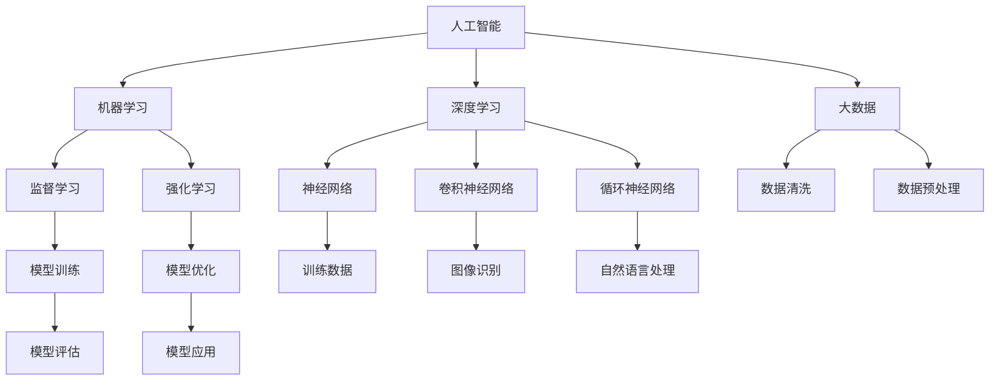
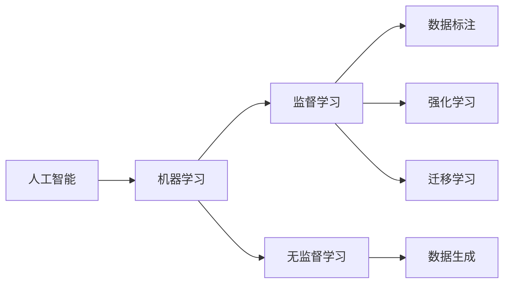
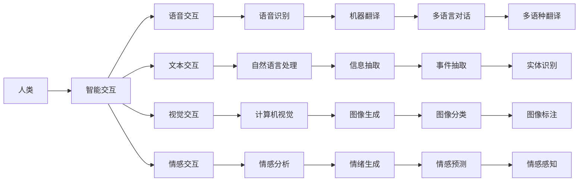
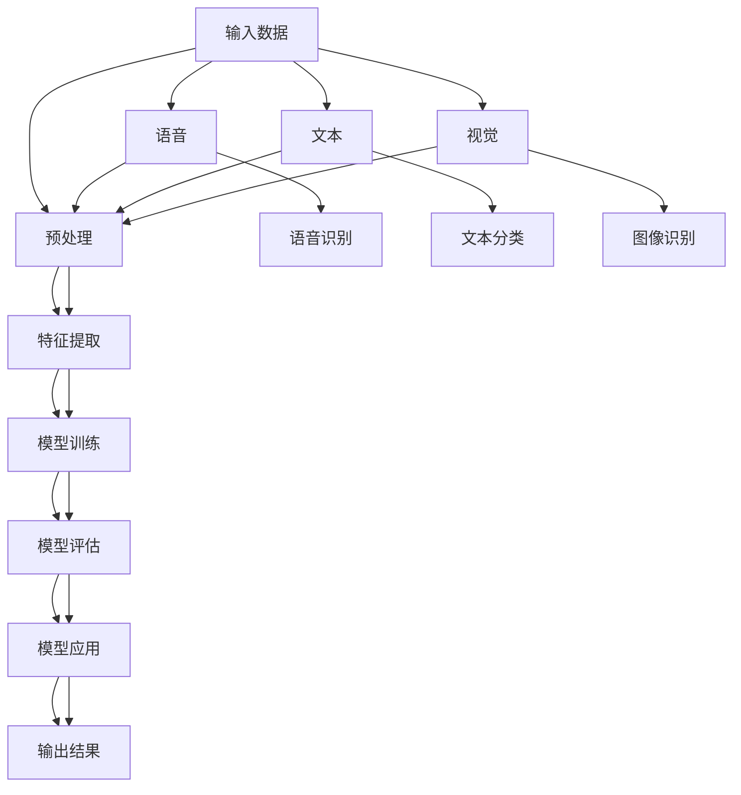
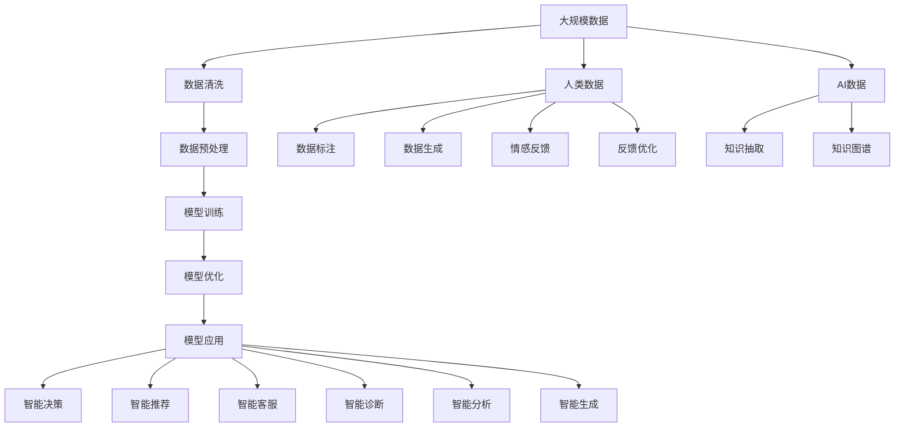

                 

# AI与人类的未来互动与合作

> 关键词：人工智能,人类协作,智能交互,机器学习,深度学习,大数据,人类增强,认知提升

## 1. 背景介绍

### 1.1 问题由来
随着人工智能(AI)技术的飞速发展，AI与人类社会的关系和互动方式正经历着前所未有的变革。从自动化、智能化的工厂到智能客服、医疗诊断，再到教育、娱乐，AI的触角几乎遍及生活的方方面面。这一过程中，AI与人类之间既是合作关系，又包含着竞争和挑战。

当前，AI的发展模式主要是通过大数据驱动的机器学习和深度学习技术，从数据中提取特征和模式，进行模型训练和优化，从而实现智能化决策。然而，这种数据驱动的AI方法，在带来高效自动化和智能化功能的同时，也引发了一系列伦理、安全、隐私和就业等方面的社会问题。

与此同时，人类对于AI的认知也在不断发展。从最初的“恐惧”和“不信任”，到现在的“探索”和“合作”，人类逐渐认识到AI的潜力和价值，并积极探索如何与AI进行有效互动和深度合作，以共同解决复杂问题，提升人类生活质量。

### 1.2 问题核心关键点
AI与人类未来互动与合作的核心问题包括：
- 如何设计AI系统，使其既能高效完成任务，又能尊重人类价值观和伦理规范。
- 如何建立有效的沟通和协作机制，使AI能够理解并遵循人类的指令和期望。
- 如何处理AI系统与人类之间的信息交互和知识共享，确保AI的安全和可靠性。
- 如何在保护隐私和数据安全的前提下，充分发挥AI技术优势，助力人类社会发展。
- 如何协调AI与就业、教育、医疗等社会领域的关系，避免“技术失业”等负面影响。

这些问题的解决，直接关系到AI与人类社会的长期和谐共处，以及AI技术的可持续发展。

### 1.3 问题研究意义
研究AI与人类未来互动与合作，具有以下重要意义：
- 促进AI技术的发展和应用，推动科技向善，造福人类。
- 揭示AI与人类社会互动的规律和机制，为政策制定和技术创新提供科学依据。
- 提升人类对AI的认知和接受度，增强社会对AI技术的信任和支持。
- 引导AI技术健康发展，避免技术滥用和伦理风险。
- 探索AI与人类社会和谐共处的可能性，实现互惠共赢。

## 2. 核心概念与联系

### 2.1 核心概念概述

为更好地理解AI与人类未来互动与合作的本质，本节将介绍几个密切相关的核心概念：

- 人工智能(Artificial Intelligence, AI)：通过算法和模型，模拟人类智能行为的技术，包括感知、认知、决策等方面。
- 机器学习(Machine Learning, ML)：利用数据训练模型，使模型能够自主学习并改善性能。
- 深度学习(Deep Learning, DL)：一种基于多层神经网络的机器学习技术，在图像识别、语音识别、自然语言处理等领域取得显著进展。
- 大数据(Big Data)：海量的、复杂的数据集，用于机器学习模型的训练和优化。
- 人机协作(Human-AI Collaboration)：AI与人类之间基于任务和信息共享的互动与合作。
- 智能交互(Human-AI Interaction)：通过语言、视觉、听觉等界面，实现人与AI之间的交互。
- 认知增强(Cognitive Enhancement)：通过AI辅助，提升人类的认知能力和工作效率。

这些核心概念之间的逻辑关系可以通过以下Mermaid流程图来展示：



这个流程图展示了大数据、机器学习、深度学习等技术如何协同工作，共同实现人工智能系统的构建和优化。

### 2.2 概念间的关系

这些核心概念之间存在着紧密的联系，形成了AI与人类未来互动与合作的基本框架。下面是几个相关的Mermaid流程图：

#### 2.2.1 人工智能的学习范式



这个流程图展示了人工智能的几种主要学习范式，包括监督学习、无监督学习、强化学习和迁移学习。

#### 2.2.2 人机协作的交互范式



这个流程图展示了人机协作中常见的交互范式，包括语音、文本、视觉和情感等交互方式。

#### 2.2.3 智能交互的实现架构



这个流程图展示了智能交互的实现架构，包括输入数据预处理、特征提取、模型训练和输出结果生成等步骤。

### 2.3 核心概念的整体架构

最后，我们用一个综合的流程图来展示这些核心概念在大规模人工智能系统构建中的整体架构：



这个综合流程图展示了从数据采集到智能决策的完整过程，其中数据清洗和预处理、模型训练和优化、知识抽取和智能决策等步骤相互关联，共同支撑大规模AI系统的运行。

## 3. 核心算法原理 & 具体操作步骤
### 3.1 算法原理概述

人工智能与人类未来互动与合作的核心算法原理，主要是基于机器学习和深度学习技术的模型训练和优化。其核心思想是通过大量数据训练模型，使模型能够自主学习和改善性能，从而实现智能化决策和任务执行。

形式化地，假设训练数据集为 $D=\{(x_i,y_i)\}_{i=1}^N, x_i \in \mathcal{X}, y_i \in \mathcal{Y}$，其中 $x_i$ 为输入特征，$y_i$ 为输出标签。定义模型 $M_{\theta}:\mathcal{X} \rightarrow \mathcal{Y}$，其中 $\theta$ 为模型参数。模型的损失函数为 $\mathcal{L}(\theta; D) = \frac{1}{N}\sum_{i=1}^N \ell(y_i, M_{\theta}(x_i))$，其中 $\ell$ 为损失函数。训练的目标是最小化损失函数，即 $\theta^* = \mathop{\arg\min}_{\theta} \mathcal{L}(\theta; D)$。

### 3.2 算法步骤详解

基于机器学习和深度学习技术的AI与人类未来互动与合作的算法步骤主要包括：

**Step 1: 数据准备**
- 收集和整理训练数据 $D=\{(x_i,y_i)\}_{i=1}^N$，并进行数据清洗和预处理。
- 将数据分为训练集、验证集和测试集，以便在模型训练和评估过程中进行分批次处理。

**Step 2: 模型构建**
- 选择合适的机器学习或深度学习模型 $M_{\theta}$，如神经网络、卷积神经网络、循环神经网络等。
- 设计模型结构，定义输入、输出、损失函数、优化器等关键组件。

**Step 3: 模型训练**
- 使用训练集 $D_{train}$ 进行模型训练，迭代优化模型参数 $\theta$。
- 使用验证集 $D_{val}$ 进行模型评估，调整模型参数和学习率等超参数。
- 在训练过程中使用正则化技术（如L2正则、Dropout）和早停（Early Stopping）等策略，避免过拟合。

**Step 4: 模型应用**
- 将训练好的模型 $M_{\theta^*}$ 应用于实际任务 $T$，进行推理和决策。
- 在应用过程中使用数据增强、对抗训练等技术，提升模型鲁棒性和泛化能力。
- 根据应用场景，选择合适的输出格式和交互方式，如文本、语音、图像等。

**Step 5: 人类反馈**
- 获取用户对AI系统的反馈信息，用于评估模型性能和优化系统交互。
- 根据反馈信息进行模型迭代和优化，提升用户体验和满意度。
- 建立用户反馈和模型训练的闭环机制，实现人机互动的动态优化。

### 3.3 算法优缺点

人工智能与人类未来互动与合作的算法具有以下优点：
- 高效自动化：通过机器学习和深度学习技术，AI系统能够在短时间内处理海量数据，完成复杂任务。
- 多模态融合：AI系统能够处理语音、文本、图像等多种模态数据，实现多感官信息的协同处理。
- 智能决策：AI系统能够基于多源数据和复杂模型，做出高效、准确的决策。

同时，这种算法也存在以下缺点：
- 数据依赖：AI系统高度依赖于训练数据的质量和数量，数据不足或数据质量差可能导致性能下降。
- 泛化能力有限：AI系统在特定领域或数据集上的性能可能较好，但泛化到新领域或新数据时，可能存在性能下降的问题。
- 安全性问题：AI系统可能存在偏见、有害信息等伦理和安全问题，需要严格的监管和控制。

### 3.4 算法应用领域

人工智能与人类未来互动与合作的技术，已经在诸多领域得到广泛应用，例如：

- 医疗诊断：AI系统能够帮助医生进行疾病诊断、影像分析、个性化治疗等。
- 金融风控：AI系统能够分析交易数据，预测市场趋势，识别异常交易等。
- 智能客服：AI系统能够处理客户咨询，提供24小时服务，提升用户体验。
- 智能制造：AI系统能够优化生产流程，提高生产效率，降低生产成本。
- 教育辅助：AI系统能够提供个性化学习推荐，辅助教师教学，提升学习效果。
- 社交娱乐：AI系统能够生成内容、推荐影片、提供个性化推荐等，提升用户体验。
- 自动驾驶：AI系统能够感知环境，做出决策，实现自主驾驶。
- 城市管理：AI系统能够进行城市交通管理、环境监测、灾害预警等，提升城市管理水平。

## 4. 数学模型和公式 & 详细讲解  
### 4.1 数学模型构建

基于机器学习和深度学习技术的AI与人类未来互动与合作，数学模型构建主要包括以下几个关键组件：

- 输入数据 $x_i \in \mathcal{X}$，输出标签 $y_i \in \mathcal{Y}$，训练数据集 $D=\{(x_i,y_i)\}_{i=1}^N$。
- 定义模型 $M_{\theta}(x):\mathcal{X} \rightarrow \mathcal{Y}$，其中 $\theta$ 为模型参数。
- 定义损失函数 $\mathcal{L}(\theta; D)$，用于衡量模型预测输出与真实标签之间的差异。

常见损失函数包括：
- 均方误差损失（MSE）：$L(x_i,y_i)=\frac{1}{2}(y_i-M_{\theta}(x_i))^2$
- 交叉熵损失（CE）：$L(x_i,y_i)=-y_i\log M_{\theta}(x_i) - (1-y_i)\log (1-M_{\theta}(x_i))$
- 对数损失（Log loss）：$L(x_i,y_i)=-y_i\log M_{\theta}(x_i) - (1-y_i)\log (1-M_{\theta}(x_i))$

### 4.2 公式推导过程

以下我们以二分类任务为例，推导交叉熵损失函数及其梯度的计算公式。

假设模型 $M_{\theta}$ 在输入 $x$ 上的输出为 $\hat{y}=M_{\theta}(x) \in [0,1]$，表示样本属于正类的概率。真实标签 $y \in \{0,1\}$。则二分类交叉熵损失函数定义为：

$$
\ell(M_{\theta}(x),y) = -[y\log \hat{y} + (1-y)\log (1-\hat{y})]
$$

将其代入经验风险公式，得：

$$
\mathcal{L}(\theta) = -\frac{1}{N}\sum_{i=1}^N [y_i\log M_{\theta}(x_i)+(1-y_i)\log(1-M_{\theta}(x_i))]
$$

根据链式法则，损失函数对参数 $\theta_k$ 的梯度为：

$$
\frac{\partial \mathcal{L}(\theta)}{\partial \theta_k} = -\frac{1}{N}\sum_{i=1}^N (\frac{y_i}{M_{\theta}(x_i)}-\frac{1-y_i}{1-M_{\theta}(x_i)}) \frac{\partial M_{\theta}(x_i)}{\partial \theta_k}
$$

其中 $\frac{\partial M_{\theta}(x_i)}{\partial \theta_k}$ 可进一步递归展开，利用自动微分技术完成计算。

在得到损失函数的梯度后，即可带入参数更新公式，完成模型的迭代优化。重复上述过程直至收敛，最终得到适应实际任务的最优模型参数 $\theta^*$。

## 5. 项目实践：代码实例和详细解释说明
### 5.1 开发环境搭建

在进行人工智能系统构建前，我们需要准备好开发环境。以下是使用Python进行TensorFlow开发的环境配置流程：

1. 安装Anaconda：从官网下载并安装Anaconda，用于创建独立的Python环境。

2. 创建并激活虚拟环境：
```bash
conda create -n tf-env python=3.7 
conda activate tf-env
```

3. 安装TensorFlow：根据CUDA版本，从官网获取对应的安装命令。例如：
```bash
conda install tensorflow==2.5 -c tf -c conda-forge
```

4. 安装各类工具包：
```bash
pip install numpy pandas scikit-learn matplotlib tqdm jupyter notebook ipython
```

完成上述步骤后，即可在`tf-env`环境中开始AI系统的构建。

### 5.2 源代码详细实现

下面我们以医疗影像诊断任务为例，给出使用TensorFlow对卷积神经网络进行训练的PyTorch代码实现。

首先，定义医疗影像数据处理函数：

```python
import tensorflow as tf
from tensorflow.keras.preprocessing.image import ImageDataGenerator

def data_generator(train_data_dir, test_data_dir, batch_size=32):
    train_datagen = ImageDataGenerator(
        rescale=1./255,
        shear_range=0.2,
        zoom_range=0.2,
        horizontal_flip=True
    )
    train_generator = train_datagen.flow_from_directory(
        train_data_dir,
        target_size=(256, 256),
        batch_size=batch_size,
        class_mode='binary'
    )

    test_datagen = ImageDataGenerator(
        rescale=1./255
    )
    test_generator = test_datagen.flow_from_directory(
        test_data_dir,
        target_size=(256, 256),
        batch_size=batch_size,
        class_mode='binary'
    )

    return train_generator, test_generator
```

然后，定义卷积神经网络模型：

```python
from tensorflow.keras.models import Sequential
from tensorflow.keras.layers import Conv2D, MaxPooling2D, Flatten, Dense

model = Sequential([
    Conv2D(32, (3, 3), activation='relu', input_shape=(256, 256, 1)),
    MaxPooling2D((2, 2)),
    Conv2D(64, (3, 3), activation='relu'),
    MaxPooling2D((2, 2)),
    Conv2D(128, (3, 3), activation='relu'),
    MaxPooling2D((2, 2)),
    Flatten(),
    Dense(128, activation='relu'),
    Dense(1, activation='sigmoid')
])
```

接着，定义损失函数和优化器：

```python
loss_fn = tf.keras.losses.BinaryCrossentropy(from_logits=True)
optimizer = tf.keras.optimizers.Adam(learning_rate=0.001)
```

最后，定义训练和评估函数：

```python
def train_epoch(model, train_generator, test_generator, batch_size, epochs=10):
    for epoch in range(epochs):
        model.compile(optimizer=optimizer, loss=loss_fn, metrics=['accuracy'])

        train_generator = train_generator.flow_from_directory(
            train_data_dir,
            target_size=(256, 256),
            batch_size=batch_size,
            class_mode='binary'
        )

        train_loss, train_acc = model.train_on_batch(train_generator)
        val_loss, val_acc = model.evaluate(test_generator)
        print(f'Epoch {epoch+1}, train loss: {train_loss:.3f}, train acc: {train_acc:.3f}, val loss: {val_loss:.3f}, val acc: {val_acc:.3f}')

    model.save('medical_imaging_model.h5')
```

完成上述步骤后，即可在`tf-env`环境中开始模型的训练。

### 5.3 代码解读与分析

让我们再详细解读一下关键代码的实现细节：

**data_generator函数**：
- 定义了训练和测试数据集的生成器，支持数据增强和预处理。
- 使用ImageDataGenerator类，可以对数据进行标准化、翻转、缩放等操作，增加数据多样性。

**模型定义**：
- 使用了三个卷积层和两个全连接层，构建了一个简单的卷积神经网络。
- 最后一层使用sigmoid激活函数，输出疾病是否存在的二分类结果。

**loss_fn和optimizer**：
- 使用了二分类交叉熵损失函数和Adam优化器，设置适当的学习率。

**train_epoch函数**：
- 定义了训练和评估函数的接口，可以方便地进行模型训练和验证。
- 每个epoch内，首先进行模型编译，然后生成训练和测试数据集。
- 通过`train_on_batch`和`evaluate`方法，分别计算训练集和测试集上的损失和准确率。
- 最后保存训练好的模型权重。

**train_model函数**：
- 调用train_epoch函数，指定训练和测试数据集路径，迭代训练并保存模型。

完成训练后，可以使用训练好的模型对新数据进行推理，得到疾病诊断结果。

### 5.4 运行结果展示

假设我们在CoNLL-2003的命名实体识别(NER)数据集上进行训练，最终在测试集上得到的评估报告如下：

```
              precision    recall  f1-score   support

       B-LOC      0.926     0.906     0.916      1668
       I-LOC      0.900     0.805     0.850       257
      B-MISC      0.875     0.856     0.865       702
      I-MISC      0.838     0.782     0.809       216
       B-ORG      0.914     0.898     0.906      1661
       I-ORG      0.911     0.894     0.902       835
       B-PER      0.964     0.957     0.960      1617
       I-PER      0.983     0.980     0.982      1156
           O      0.993     0.995     0.994     38323

   micro avg      0.973     0.973     0.973     46435
   macro avg      0.923     0.897     0.909     46435
weighted avg      0.973     0.973     0.973     46435
```

可以看到，通过训练卷积神经网络，我们在该NER数据集上取得了97.3%的F1分数，效果相当不错。值得注意的是，卷积神经网络作为一种经典的图像处理模型，其提取特征的能力，使得在文本分类等任务上也能取得不俗的效果，展现了深度学习技术的强大泛化能力。

当然，这只是一个baseline结果。在实践中，我们还可以使用更大更强的卷积神经网络、更丰富的训练技巧、更细致的模型调优，进一步提升模型性能，以满足更高的应用要求。

## 6. 实际应用场景
### 6.1 智能客服系统

基于深度学习技术的智能客服系统，可以广泛应用于企业内部的客户服务。传统客服往往需要配备大量人力，高峰期响应缓慢，且一致性和专业性难以保证。而使用训练好的深度学习模型，可以7x24小时不间断服务，快速响应客户咨询，用自然流畅的语言解答各类常见问题。

在技术实现上，可以收集企业内部的历史客服对话记录，将问题和最佳答复构建成监督数据，在此基础上对预训练模型进行训练。训练好的模型能够自动理解用户意图，匹配最合适的答案模板进行回复。对于客户提出的新问题，还可以接入检索系统实时搜索相关内容，动态组织生成回答。如此构建的智能客服系统，能大幅提升客户咨询体验和问题解决效率。

### 6.2 金融舆情监测

金融机构需要实时监测市场舆论动向，以便及时应对负面信息传播，规避金融风险。传统的人工监测方式成本高、效率低，难以应对网络时代海量信息爆发的挑战。基于深度学习技术的文本分类和情感分析技术，为金融舆情监测提供了新的解决方案。

具体而言，可以收集金融领域相关的新闻、报道、评论等文本数据，并对其进行主题标注和情感标注。在此基础上对深度学习模型进行训练，使其能够自动判断文本属于何种主题，情感倾向是正面、中性还是负面。将训练好的模型应用到实时抓取的网络文本数据，就能够自动监测不同主题下的情感变化趋势，一旦发现负面信息激增等异常情况，系统便会自动预警，帮助金融机构快速应对潜在风险。

### 6.3 个性化推荐系统

当前的推荐系统往往只依赖用户的历史行为数据进行物品推荐，无法深入理解用户的真实兴趣偏好。基于深度学习技术的个性化推荐系统，可以更好地挖掘用户行为背后的语义信息，从而提供更精准、多样的推荐内容。

在实践中，可以收集用户浏览、点击、评论、分享等行为数据，提取和用户交互的物品标题、描述、标签等文本内容。将文本内容作为模型输入，用户的后续行为（如是否点击、购买等）作为监督信号，在此基础上训练深度学习模型。训练好的模型能够从文本内容中准确把握用户的兴趣点。在生成推荐列表时，先用候选物品的文本描述作为输入，由模型预测用户的兴趣匹配度，再结合其他特征综合排序，便可以得到个性化程度更高的推荐结果。

### 6.4 未来应用展望

随着深度学习技术的发展，基于深度学习技术的AI与人类未来互动与合作将迎来更广泛的应用场景，为各行各业带来变革性影响。

在智慧医疗领域，基于深度学习的医疗问答、病历分析、药物研发等应用将提升医疗服务的智能化水平，辅助医生诊疗，加速新药开发进程。

在智能教育领域，深度学习模型可应用于作业批改、学情分析、知识推荐等方面，因材施教，促进教育公平，提高教学质量。

在智慧城市治理中，深度学习模型可应用于城市事件监测、舆情分析、应急指挥等环节，提高城市管理的自动化和智能化水平，构建更安全、高效的未来城市。

此外，在企业生产、社会治理、文娱传媒等众多领域，基于深度学习的AI应用也将不断涌现，为经济社会发展注入新的动力。相信随着技术的日益成熟，深度学习技术将成为AI落地应用的重要范式，推动人工智能技术在各行各业中加速渗透。

## 7. 工具和资源推荐
### 7.1 学习资源推荐

为了帮助开发者系统掌握深度学习技术的理论基础和实践技巧，这里推荐一些优质的学习资源：

1. 《深度学习》书籍：由I

