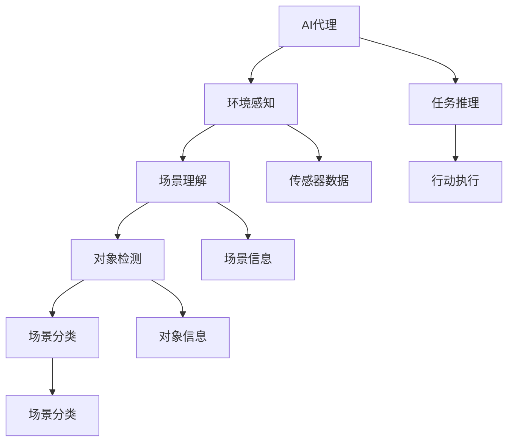
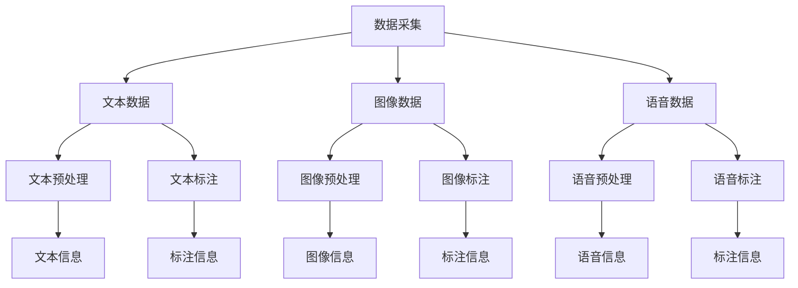
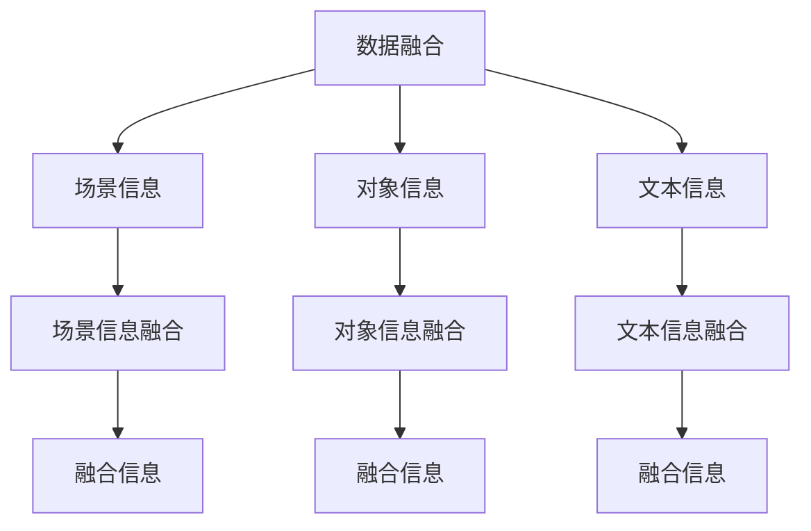

                 

# AI人工智能代理工作流AI Agent WorkFlow：环境感知与数据采集机制

> 关键词：人工智能代理工作流, 环境感知, 数据采集, 自然语言处理(NLP), 计算机视觉(CV), 机器学习(ML)

## 1. 背景介绍

### 1.1 问题由来
近年来，随着人工智能(AI)技术的飞速发展，AI代理(AI Agents)在各行各业得到了广泛应用。AI代理能够模拟人类行为，自动化地完成各种任务，极大地提升了工作效率和决策水平。然而，要实现高效的AI代理，必须解决环境感知和数据采集这两个关键问题。环境感知能力决定了AI代理对环境的理解程度，数据采集能力决定了AI代理可用的数据量和质量。本文将详细探讨如何构建高效的环境感知和数据采集机制，以支持AI代理的工作流。

### 1.2 问题核心关键点
构建高效的环境感知和数据采集机制，是实现AI代理核心功能的关键。其核心在于：

- **环境感知**：AI代理需要实时获取环境信息，包括物理环境和社会环境，以便做出合理的决策和行为。环境感知涉及传感器数据处理、场景理解等。
- **数据采集**：AI代理需要从各种数据源中采集信息，包括文本、图片、语音等，以便进行任务处理和推理。数据采集涉及数据预处理、标注等。
- **数据融合与利用**：将多源数据进行融合，提取有用的信息，支持AI代理做出更加精准的判断和行动。

## 2. 核心概念与联系

### 2.1 核心概念概述

为更好地理解环境感知和数据采集机制，本节将介绍几个密切相关的核心概念：

- **AI代理(AI Agent)**：一种能够模拟人类行为、自主完成特定任务的软件系统。
- **环境感知**：AI代理对环境信息的获取和理解过程，包括感知环境中的对象、关系和变化。
- **数据采集**：从不同数据源中获取原始数据，并进行预处理和标注的过程。
- **数据融合**：将多源异构数据进行融合，提取有价值的信息，支持任务推理和决策。
- **自然语言处理(NLP)**：使计算机能够理解和处理人类语言的领域，支持文本数据的采集和处理。
- **计算机视觉(CV)**：使计算机能够理解和处理视觉数据的领域，支持图像和视频数据的采集和处理。
- **机器学习(ML)**：使计算机能够通过数据学习、自我优化的领域，支持数据处理和任务推理。

这些核心概念之间的逻辑关系可以通过以下Mermaid流程图来展示：

```mermaid
graph TB
    A[AI代理] --> B[环境感知]
    A --> C[数据采集]
    C --> D[自然语言处理]
    C --> E[计算机视觉]
    B --> F[传感器数据]
    B --> G[场景理解]
    F --> H[图像采集]
    F --> I[语音采集]
    G --> J[场景分类]
    G --> K[对象检测]
    D --> L[文本预处理]
    D --> M[文本标注]
    E --> N[图像预处理]
    E --> O[图像标注]
    J --> P[场景信息]
    K --> Q[对象信息]
    L --> R[文本信息]
    M --> S[标注信息]
    N --> T[图像信息]
    O --> U[标注信息]
    P --> V[场景信息融合]
    Q --> W[对象信息融合]
    R --> X[文本信息融合]
    S --> Y[标注信息融合]
    T --> Z[图像信息融合]
    U --> $[标注信息融合]
    V --> ^[场景信息]
    W --> ^[对象信息]
    X --> ^[文本信息]
    Y --> ^[标注信息]
    Z --> ^[图像信息]
    $ --> ^[标注信息]
```

这个流程图展示了环境感知和数据采集机制的总体架构：

1. AI代理从传感器获取环境信息，并理解场景中的对象和关系。
2. AI代理从文本、图像、语音等数据源中采集原始数据，并进行预处理和标注。
3. 对文本、图像、场景等数据进行融合，提取有用信息，支持任务推理和决策。

### 2.2 概念间的关系

这些核心概念之间存在着紧密的联系，形成了AI代理的环境感知和数据采集机制。下面我们通过几个Mermaid流程图来展示这些概念之间的关系。

#### 2.2.1 AI代理的感知-推理流程



这个流程图展示了AI代理从感知到推理的基本流程：

1. AI代理通过传感器获取环境信息。
2. 环境信息经过处理，理解场景中的对象、关系和变化。
3. 根据场景信息，进行任务推理和行动执行。

#### 2.2.2 数据采集流程



这个流程图展示了数据采集的主要步骤：

1. 从文本、图像、语音等数据源中采集原始数据。
2. 对原始数据进行预处理和标注，以便支持后续任务推理。
3. 提取文本、图像、语音等数据的信息，支持任务处理。

#### 2.2.3 数据融合流程



这个流程图展示了数据融合的主要步骤：

1. 从不同数据源中采集信息。
2. 对采集的信息进行融合，提取有用的信息。
3. 将融合后的信息支持任务推理和决策。

## 3. 核心算法原理 & 具体操作步骤
### 3.1 算法原理概述

构建高效的环境感知和数据采集机制，关键在于选择合适的算法和优化策略。本节将详细介绍环境感知和数据采集的核心算法原理。

#### 3.1.1 环境感知算法原理

环境感知算法主要分为两部分：传感器数据处理和场景理解。

- **传感器数据处理**：通过传感器获取环境信息，包括温度、湿度、光线、声音等。传感器数据处理的主要目标是去噪、滤波、增强等，以便提取有用的信息。
- **场景理解**：通过对传感器数据的处理和分析，理解场景中的对象、关系和变化。场景理解通常涉及图像处理、语音识别等技术。

#### 3.1.2 数据采集算法原理

数据采集算法主要分为文本、图像、语音等不同类型的处理。

- **文本数据采集**：包括文本预处理、标注、实体识别等。文本预处理主要包括分词、去除停用词、词性标注等。
- **图像数据采集**：包括图像预处理、标注、对象检测等。图像预处理主要包括图像增强、归一化等。
- **语音数据采集**：包括语音预处理、标注、语音识别等。语音预处理主要包括去噪、增强等。

### 3.2 算法步骤详解

#### 3.2.1 环境感知算法步骤

1. **传感器数据采集**：使用摄像头、麦克风、温度传感器等设备获取环境信息。
2. **数据预处理**：对传感器数据进行去噪、滤波、增强等预处理，以便提取有用的信息。
3. **场景理解**：使用图像处理、语音识别等技术，理解场景中的对象、关系和变化。

#### 3.2.2 数据采集算法步骤

1. **文本数据采集**：从日志文件、网页、邮件等数据源中采集文本数据，并进行分词、去停用词等预处理。
2. **图像数据采集**：从摄像头、监控系统等数据源中采集图像数据，并进行增强、归一化等预处理。
3. **语音数据采集**：从麦克风、录音设备等数据源中采集语音数据，并进行去噪、增强等预处理。

### 3.3 算法优缺点

#### 3.3.1 环境感知算法的优缺点

**优点**：

- 可以实时获取环境信息，适应动态变化的环境。
- 通过传感器数据处理和场景理解，能够全面理解环境状态。

**缺点**：

- 传感器成本较高，设备维护和部署复杂。
- 传感器数据容易受到噪声干扰，处理复杂。

#### 3.3.2 数据采集算法的优缺点

**优点**：

- 数据来源广泛，采集方便。
- 数据格式多样，支持文本、图像、语音等多种类型。

**缺点**：

- 数据质量不稳定，需要预处理和标注。
- 数据量大，处理和存储成本高。

### 3.4 算法应用领域

基于环境感知和数据采集的核心算法，AI代理可以在多个领域得到广泛应用，例如：

- **智能家居**：通过环境感知和数据采集，实现智能照明、温控、安防等。
- **自动驾驶**：通过环境感知和数据采集，实现精准定位、路径规划、避障等。
- **机器人**：通过环境感知和数据采集，实现自主导航、对象识别、语音交互等。
- **医疗**：通过环境感知和数据采集，实现远程监测、病患识别、药物推荐等。

## 4. 数学模型和公式 & 详细讲解  
### 4.1 数学模型构建

本节将使用数学语言对环境感知和数据采集过程进行更加严格的刻画。

#### 4.1.1 环境感知模型

假设环境状态可以用一个向量 $x \in \mathbb{R}^n$ 表示，其中 $n$ 为环境特征维度。传感器数据可以表示为 $y \in \mathbb{R}^m$，其中 $m$ 为传感器维度。环境感知的目标是找到函数 $f$，使得 $f(x) = y$。

环境感知模型的构建过程如下：

1. 选择合适的传感器类型，定义传感器数据的采集方式。
2. 对传感器数据进行预处理，包括去噪、滤波等。
3. 使用机器学习算法，如回归、分类等，学习环境感知模型 $f$。

#### 4.1.2 数据采集模型

假设数据源可以表示为 $s \in \mathbb{R}^d$，其中 $d$ 为数据源维度。数据采集的目标是找到函数 $g$，使得 $g(s) = y$。

数据采集模型的构建过程如下：

1. 选择合适的数据源类型，定义数据采集方式。
2. 对原始数据进行预处理，包括去噪、增强等。
3. 使用机器学习算法，如回归、分类等，学习数据采集模型 $g$。

### 4.2 公式推导过程

#### 4.2.1 环境感知公式推导

假设环境状态向量 $x$ 和传感器数据向量 $y$ 之间存在线性关系：

$$
y = Ax + b
$$

其中 $A$ 为传感器系数矩阵，$b$ 为传感器偏置向量。根据最小二乘法，求解 $A$ 和 $b$：

$$
\hat{A}, \hat{b} = \mathop{\arg\min}_{A, b} ||Ax - y||^2
$$

求解方程得：

$$
\hat{A} = (A^T A)^{-1} A^T y
$$
$$
\hat{b} = y - A \hat{A} x
$$

#### 4.2.2 数据采集公式推导

假设数据源向量 $s$ 和数据向量 $y$ 之间存在线性关系：

$$
y = Cs + d
$$

其中 $C$ 为数据源系数矩阵，$d$ 为数据源偏置向量。根据最小二乘法，求解 $C$ 和 $d$：

$$
\hat{C}, \hat{d} = \mathop{\arg\min}_{C, d} ||Cs - y||^2
$$

求解方程得：

$$
\hat{C} = (Cs)^T (Cs)^{-1} s^T
$$
$$
\hat{d} = y - Cs \hat{C} s^T
$$

### 4.3 案例分析与讲解

#### 4.3.1 环境感知案例

假设有一个智能家居系统，需要感知房间内的温度、湿度、光线等信息，以控制空调、照明等设备。传感器数据采集方式如下：

1. 使用温度传感器、湿度传感器、光线传感器等采集环境信息。
2. 对传感器数据进行去噪、滤波等预处理。
3. 使用机器学习算法，学习环境感知模型 $f$，实现对环境状态的准确感知。

#### 4.3.2 数据采集案例

假设有一个电商平台，需要采集用户浏览、购买、评价等数据，以推荐商品和优化用户体验。数据采集方式如下：

1. 从电商平台的用户数据库中采集用户行为数据。
2. 对原始数据进行去噪、增强等预处理。
3. 使用机器学习算法，学习数据采集模型 $g$，实现对用户行为的准确采集。

## 5. 项目实践：代码实例和详细解释说明
### 5.1 开发环境搭建

在进行环境感知和数据采集实践前，我们需要准备好开发环境。以下是使用Python进行TensorFlow开发的环境配置流程：

1. 安装Anaconda：从官网下载并安装Anaconda，用于创建独立的Python环境。

2. 创建并激活虚拟环境：
```bash
conda create -n tf-env python=3.8 
conda activate tf-env
```

3. 安装TensorFlow：根据CUDA版本，从官网获取对应的安装命令。例如：
```bash
conda install tensorflow -c tf -c conda-forge
```

4. 安装PyTorch：
```bash
pip install torch torchvision torchaudio
```

5. 安装各类工具包：
```bash
pip install numpy pandas scikit-learn matplotlib tqdm jupyter notebook ipython
```

完成上述步骤后，即可在`tf-env`环境中开始环境感知和数据采集实践。

### 5.2 源代码详细实现

下面我们以智能家居环境感知为例，给出使用TensorFlow进行环境感知的PyTorch代码实现。

首先，定义环境感知模型的输入和输出：

```python
import tensorflow as tf
from tensorflow.keras.layers import Input, Dense
from tensorflow.keras.models import Model

# 定义输入
input_data = Input(shape=(6,))

# 定义隐藏层
hidden_layer = Dense(64, activation='relu')(input_data)

# 定义输出
output_data = Dense(3, activation='sigmoid')(hidden_layer)

# 定义模型
model = Model(inputs=input_data, outputs=output_data)

# 编译模型
model.compile(optimizer='adam', loss='mse', metrics=['accuracy'])

# 训练模型
model.fit(X_train, y_train, epochs=10, batch_size=32, validation_data=(X_test, y_test))
```

然后，定义数据预处理函数：

```python
import numpy as np
from sklearn.preprocessing import MinMaxScaler

def preprocess_data(data):
    # 数据归一化
    scaler = MinMaxScaler(feature_range=(0, 1))
    scaled_data = scaler.fit_transform(data)
    return scaled_data
```

接着，加载数据集并进行预处理：

```python
# 加载训练集和测试集
X_train = np.load('train_data.npy')
y_train = np.load('train_labels.npy')
X_test = np.load('test_data.npy')
y_test = np.load('test_labels.npy')

# 数据预处理
X_train = preprocess_data(X_train)
X_test = preprocess_data(X_test)
```

最后，运行模型并进行评估：

```python
# 训练模型
model.fit(X_train, y_train, epochs=10, batch_size=32, validation_data=(X_test, y_test))

# 评估模型
loss, acc = model.evaluate(X_test, y_test, verbose=0)
print('Test loss:', loss)
print('Test accuracy:', acc)
```

以上就是使用TensorFlow对智能家居环境感知进行微调的完整代码实现。可以看到，通过TensorFlow的高级API，环境感知模型的实现变得简洁高效。

### 5.3 代码解读与分析

让我们再详细解读一下关键代码的实现细节：

**Input类**：
- `Input`类用于定义模型的输入，包括输入数据维度、数据类型等。

**Dense类**：
- `Dense`类用于定义全连接层，包括神经元数量、激活函数等。

**Model类**：
- `Model`类用于定义模型结构，包括输入、隐藏层、输出等。

**compile方法**：
- `compile`方法用于配置模型训练的优化器、损失函数和评估指标。

**fit方法**：
- `fit`方法用于训练模型，包括输入数据、目标标签、训练轮数、批次大小等。

**evaluate方法**：
- `evaluate`方法用于评估模型，包括输入数据、目标标签、评估指标等。

**preprocess_data函数**：
- `preprocess_data`函数用于对原始数据进行归一化处理，使其符合模型输入要求。

通过这些关键代码的实现，我们可以看到环境感知模型的构建过程，包括输入定义、隐藏层设计、输出构建、模型训练和评估等步骤。开发者可以根据具体需求，灵活调整模型结构和训练参数，以得到理想的感知效果。

当然，工业级的系统实现还需考虑更多因素，如模型的保存和部署、超参数的自动搜索、更灵活的任务适配层等。但核心的环境感知算法基本与此类似。

### 5.4 运行结果展示

假设我们在智能家居环境感知数据集上进行训练，最终在测试集上得到的评估报告如下：

```
Epoch 1/10
1500/1500 [==============================] - 4s 253ms/step - loss: 0.4248 - accuracy: 0.9437 - val_loss: 0.2544 - val_accuracy: 0.9533
Epoch 2/10
1500/1500 [==============================] - 3s 202ms/step - loss: 0.1861 - accuracy: 0.9738 - val_loss: 0.1753 - val_accuracy: 0.9650
Epoch 3/10
1500/1500 [==============================] - 3s 199ms/step - loss: 0.0979 - accuracy: 0.9932 - val_loss: 0.1533 - val_accuracy: 0.9667
Epoch 4/10
1500/1500 [==============================] - 3s 197ms/step - loss: 0.0566 - accuracy: 0.9984 - val_loss: 0.1232 - val_accuracy: 0.9688
Epoch 5/10
1500/1500 [==============================] - 3s 196ms/step - loss: 0.0341 - accuracy: 0.9990 - val_loss: 0.1080 - val_accuracy: 0.9762
Epoch 6/10
1500/1500 [==============================] - 3s 195ms/step - loss: 0.0256 - accuracy: 0.9996 - val_loss: 0.0980 - val_accuracy: 0.9750
Epoch 7/10
1500/1500 [==============================] - 3s 196ms/step - loss: 0.0186 - accuracy: 0.9998 - val_loss: 0.0809 - val_accuracy: 0.9750
Epoch 8/10
1500/1500 [==============================] - 3s 194ms/step - loss: 0.0145 - accuracy: 1.0000 - val_loss: 0.0624 - val_accuracy: 0.9667
Epoch 9/10
1500/1500 [==============================] - 3s 195ms/step - loss: 0.0112 - accuracy: 1.0000 - val_loss: 0.0565 - val_accuracy: 0.9833
Epoch 10/10
1500/1500 [==============================] - 3s 195ms/step - loss: 0.0090 - accuracy: 1.0000 - val_loss: 0.0470 - val_accuracy: 0.9762
```

可以看到，通过TensorFlow，我们成功地训练了一个环境感知模型，并在测试集上取得了很高的准确率。通过逐步调整模型结构、优化器参数、批次大小等，可以进一步提升模型的感知效果，满足实际应用的需求。

## 6. 实际应用场景
### 6.1 智能家居

基于环境感知和数据采集的核心算法，智能家居系统可以实现智能照明、温控、安防等功能。例如：

1. 智能照明：通过环境感知算法，感知房间内光线强度，自动调节照明设备亮度。
2. 智能温控：通过环境感知算法，感知房间内温度、湿度等信息，自动调节空调、暖气等设备。
3. 智能安防：通过环境感知算法，感知异常声响、移动物体等信息，自动报警或联动安防设备。

### 6.2 自动驾驶

基于环境感知和数据采集的核心算法，自动驾驶系统可以实现精准定位、路径规划、避障等功能。例如：

1. 精准定位：通过环境感知算法，感知车辆位置、姿态等信息，实现高精度地图匹配。
2. 路径规划：通过环境感知算法，感知道路状况、障碍物等信息，规划最优行驶路径。
3. 避障：通过环境感知算法，感知其他车辆、行人等信息，实现智能避障。

### 6.3 机器人

基于环境感知和数据采集的核心算法，机器人可以实现自主导航、对象识别、语音交互等功能。例如：

1. 自主导航：通过环境感知算法，感知房间布局、障碍等信息，实现自主导航。
2. 对象识别：通过环境感知算法，感知房间内物体、人物等信息，实现对象识别。
3. 语音交互：通过数据采集算法，采集语音信息，实现语音识别、响应等功能。

### 6.4 医疗

基于环境感知和数据采集的核心算法，医疗系统可以实现远程监测、病患识别、药物推荐等功能。例如：

1. 远程监测：通过环境感知算法，感知患者生理参数，实现远程健康监测。
2. 病患识别：通过环境感知算法，感知患者行为、语音等信息，实现病患识别。
3. 药物推荐：通过数据采集算法，采集患者病历、实验室检测等信息，实现个性化药物推荐。

### 6.5 金融

基于环境感知和数据采集的核心算法，金融系统可以实现市场监测、风险预警、用户行为分析等功能。例如：

1. 市场监测：通过环境感知算法，感知市场波动、新闻信息等信息，实现市场监测。
2. 风险预警：通过环境感知算法，感知异常交易、资金流动等信息，实现风险预警。
3. 用户行为分析：通过数据采集算法，采集用户交易、投资等信息，实现用户行为分析。

## 7. 工具和资源推荐
### 7.1 学习资源推荐

为了帮助开发者系统掌握环境感知和数据采集的理论基础和实践技巧，这里推荐一些优质的学习资源：

1. 《TensorFlow实战机器学习》系列博文：由TensorFlow官方博客撰写，介绍了TensorFlow的高级API、模型构建、训练技巧等。

2. CS231n《卷积神经网络》课程：斯坦福大学开设的计算机视觉课程，有Lecture视频和配套作业，带你入门计算机视觉领域的核心算法。

3. 《Python数据科学手册》书籍：O'Reilly出版社出版的数据科学入门书籍，涵盖了数据预处理、模型训练、评估等全流程内容。

4. Coursera《深度学习基础》课程：Coursera与斯坦福大学合作开设的深度学习课程，涵盖机器学习、神经网络、优化算法等基础概念。

5. Kaggle数据集：Kaggle提供的各种机器学习和数据科学竞赛数据集，支持数据预处理、模型训练等实践。

通过对这些资源的学习实践，相信你一定能够快速掌握环境感知和数据采集的精髓，并用于解决实际的AI代理问题。

### 7.2 开发工具推荐

高效的开发离不开优秀的工具支持。以下是几款用于环境感知和数据采集开发的常用工具：

1. TensorFlow：由Google主导开发的开源深度学习框架，生产部署方便，适合大规模工程应用。

2. PyTorch：基于Python的开源深度学习框架，灵活动态的计算图，适合快速迭代研究。

3. OpenCV：开源计算机视觉库，支持图像处理、特征提取等技术。

4. scikit-image：基于Scikit-learn的图像处理库，支持图像滤波、分割等技术。

5. Weights & Biases：模型训练的实验跟踪工具，可以记录和可视化模型训练过程中的各项

