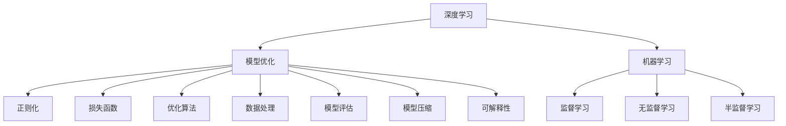
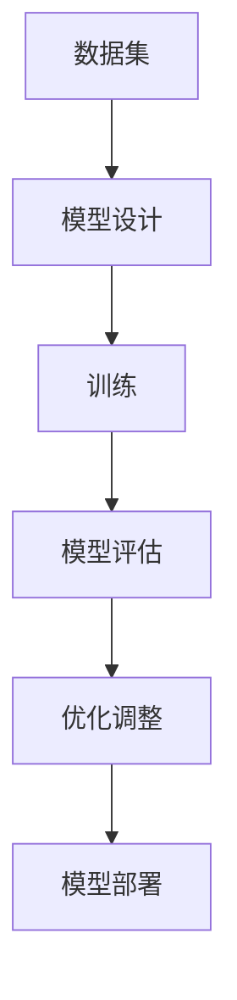
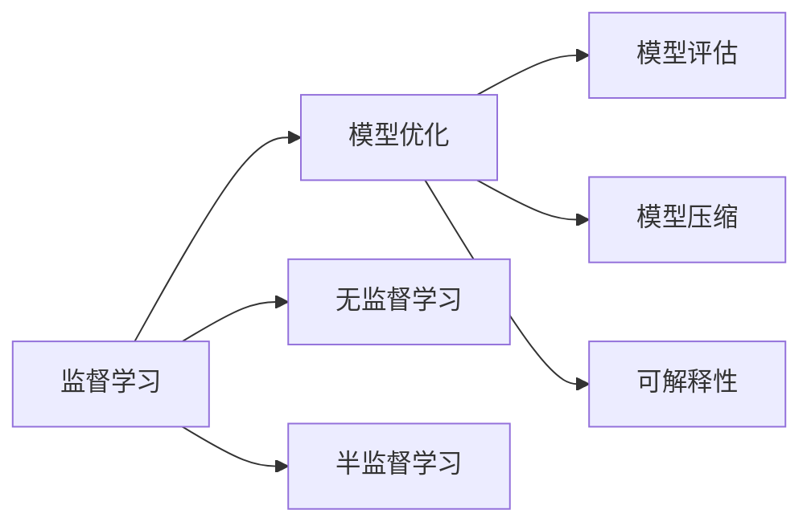

                 

# AI人工智能深度学习算法：利用机器学习提升深度学习模型的决策质量

> 关键词：深度学习, 机器学习, 决策质量, 算法优化, 模型评估, 模型压缩, 可解释性

## 1. 背景介绍

### 1.1 问题由来

深度学习近年来取得了飞速发展，在图像识别、自然语言处理、语音识别等领域取得了令人瞩目的成果。然而，随着模型复杂度的提升，深度学习模型在决策质量方面也面临诸多挑战。这些问题包括但不限于模型过拟合、泛化能力不足、计算资源消耗大等。为提升深度学习模型的决策质量，研究人员提出了各种基于机器学习的算法优化和模型评估方法。本文将全面介绍这些方法，并探讨其在实际应用中的表现和前景。

### 1.2 问题核心关键点

深度学习模型的决策质量受多种因素影响，包括模型架构、训练数据、优化算法、损失函数等。为提升模型的决策质量，需要从多个方面进行优化。以下是深度学习模型在实际应用中常见的关键点：

1. **模型架构设计**：选择合适的模型结构和超参数，提升模型表达能力和泛化性能。
2. **训练数据处理**：合理预处理数据，提高模型学习效率。
3. **优化算法选择**：选择适合的优化器，避免模型收敛到局部最优。
4. **损失函数设计**：设计有效的损失函数，指导模型学习目标。
5. **正则化技术**：应用正则化方法，避免模型过拟合。
6. **模型评估**：设计合理的评估指标，客观评价模型性能。
7. **模型压缩**：对大模型进行压缩，降低计算资源消耗。
8. **可解释性**：提升模型的可解释性，增强信任度。

本文将围绕这些关键点，详细介绍如何利用机器学习提升深度学习模型的决策质量。

## 2. 核心概念与联系

### 2.1 核心概念概述

为更好地理解机器学习在提升深度学习模型决策质量中的应用，本节将介绍几个密切相关的核心概念：

- **深度学习**：一种基于神经网络的机器学习方法，通过多层非线性变换，提取数据中的高级特征。
- **机器学习**：一种通过数据驱动，自动学习模型的方法。包括监督学习、无监督学习、半监督学习等。
- **决策质量**：指模型输出结果的正确性和可信度，是评估模型性能的重要指标。
- **模型优化**：通过调整模型参数和结构，提升模型在特定任务上的性能。
- **模型评估**：通过评估指标和实验结果，客观评估模型在特定任务上的表现。
- **模型压缩**：通过剪枝、量化、蒸馏等方法，降低模型参数量和计算资源消耗。
- **可解释性**：通过解释模型输出结果的原理，增强模型的可信度和透明度。

这些核心概念之间的逻辑关系可以通过以下Mermaid流程图来展示：



这个流程图展示了深度学习、机器学习和模型优化之间的紧密联系。深度学习是机器学习的一种形式，通过模型优化提升决策质量，而模型评估、模型压缩和可解释性则是模型优化中的重要环节。

### 2.2 概念间的关系

这些核心概念之间存在着紧密的联系，形成了深度学习模型优化和决策质量提升的完整生态系统。下面我们通过几个Mermaid流程图来展示这些概念之间的关系。

#### 2.2.1 深度学习模型优化流程



这个流程图展示了深度学习模型优化的基本流程：数据集设计模型，通过训练和评估不断调整优化模型，最后部署到实际应用中。

#### 2.2.2 机器学习与模型优化



这个流程图展示了机器学习在模型优化中的应用：监督学习、无监督学习和半监督学习都可以用于模型优化，而模型评估、模型压缩和可解释性则是在模型优化过程中需要考虑的因素。

## 3. 核心算法原理 & 具体操作步骤

### 3.1 算法原理概述

机器学习在提升深度学习模型决策质量方面的应用，主要体现在以下几个方面：

- **监督学习**：利用标注数据训练模型，使其能够准确预测新样本。
- **无监督学习**：通过非标注数据训练模型，发现数据中的潜在结构，如聚类、降维等。
- **半监督学习**：利用少量标注数据和大量非标注数据共同训练模型，提高模型的泛化能力。
- **模型评估**：通过交叉验证、测试集等方法，客观评估模型性能。
- **模型压缩**：通过剪枝、量化、蒸馏等方法，减小模型参数量和计算资源消耗。
- **可解释性**：通过可视化、特征重要性分析等方法，提升模型的可解释性。

这些算法方法共同构成了深度学习模型优化和决策质量提升的完整生态系统，帮助开发者在实际应用中取得更好的效果。

### 3.2 算法步骤详解

**步骤1：数据预处理**

深度学习模型的训练过程需要大量的标注数据。为提高训练效率和模型性能，需要对数据进行预处理。常见的预处理步骤包括：

- **数据清洗**：去除噪音、异常值等影响训练的数据。
- **数据标准化**：对数据进行归一化、标准化处理，提高模型收敛速度。
- **数据增强**：通过对数据进行旋转、缩放、翻转等操作，增加数据多样性。

**步骤2：模型设计**

选择合适的模型架构和超参数，是提升模型决策质量的关键。常用的模型包括卷积神经网络(CNN)、循环神经网络(RNN)、注意力机制模型等。模型设计过程中需要考虑以下因素：

- **模型复杂度**：模型越复杂，参数越多，训练和推理速度越慢。需要根据实际任务需求选择合适的模型复杂度。
- **正则化**：应用L1、L2正则、Dropout等方法，避免模型过拟合。
- **批处理**：使用批处理技术，提高模型训练效率。

**步骤3：模型训练**

模型训练过程需要选择合适的优化器和损失函数，并进行合理的超参数设置。常用的优化器包括SGD、Adam、Adagrad等。损失函数的选择应根据具体任务需求，常见的损失函数包括交叉熵、均方误差、Kullback-Leibler散度等。

**步骤4：模型评估**

模型评估过程中需要选择合适的评估指标，如准确率、召回率、F1分数等。常用的评估方法包括交叉验证、留出法、自助法等。

**步骤5：模型优化**

模型优化过程中需要根据评估结果进行调整，重新训练模型。常见的优化方法包括梯度下降、随机梯度下降、Adagrad等。

**步骤6：模型压缩**

模型压缩过程中需要选择合适的压缩方法，如剪枝、量化、蒸馏等。剪枝可以减小模型参数量，降低计算资源消耗；量化可以将模型转换为定点模型，提高计算效率；蒸馏可以将大模型转换为小型模型，提高推理速度。

**步骤7：可解释性**

可解释性过程中需要选择合适的解释方法，如可视化、特征重要性分析等。可视化方法可以通过热力图、梯度图等展示模型内部结构；特征重要性分析可以通过SHAP值、LIME值等评估模型各特征的重要性。

### 3.3 算法优缺点

基于机器学习的深度学习模型优化方法具有以下优点：

- **泛化能力强**：通过机器学习方法，模型能够从大量数据中学习到更全面的知识，提高泛化能力。
- **可解释性强**：通过可解释性方法，模型内部机制更加透明，便于理解和调试。
- **适应性强**：机器学习方法适用于多种任务，能够灵活应用于不同场景。

但这些方法也存在一些局限性：

- **计算资源消耗大**：机器学习方法需要大量计算资源，训练和推理速度较慢。
- **模型复杂度高**：机器学习方法需要选择合适的模型架构和超参数，设计复杂的评估指标和优化策略，增加了模型设计的复杂度。
- **过拟合风险高**：机器学习方法容易过拟合，特别是在标注数据不足的情况下。

尽管存在这些局限性，但机器学习方法在提升深度学习模型决策质量方面仍具有重要的应用价值。

### 3.4 算法应用领域

基于机器学习的深度学习模型优化方法，已在多个领域得到了广泛应用，例如：

- **计算机视觉**：通过图像分类、目标检测、语义分割等任务，提升了计算机视觉应用的决策质量。
- **自然语言处理**：通过文本分类、机器翻译、对话系统等任务，提升了自然语言处理应用的决策质量。
- **语音识别**：通过语音识别、情感分析等任务，提升了语音识别应用的决策质量。
- **推荐系统**：通过用户行为分析和物品特征提取，提升了推荐系统的决策质量。

除了这些领域，机器学习方法还在智能制造、智慧医疗、智能交通等领域得到了应用，成为推动这些行业智能化发展的重要技术手段。

## 4. 数学模型和公式 & 详细讲解 & 举例说明

### 4.1 数学模型构建

为更好地理解机器学习在提升深度学习模型决策质量中的应用，本节将使用数学语言对机器学习的基本模型进行更加严格的刻画。

假设有一组标注数据集 $D=\{(x_i, y_i)\}_{i=1}^N$，其中 $x_i$ 为输入，$y_i$ 为输出。设训练集为 $D^T=\{(x_i, y_i)\}_{i=1}^T$，验证集为 $D^V=\{(x_i, y_i)\}_{i=T+1}^{T+V}$，测试集为 $D^T=\{(x_i, y_i)\}_{i=T+V+1}^{T+V+T}$。

设模型的损失函数为 $\mathcal{L}(\theta;D)$，其中 $\theta$ 为模型参数。模型的目标是最小化损失函数，即：

$$
\min_{\theta} \mathcal{L}(\theta;D)
$$

在训练过程中，常用的优化方法为梯度下降，即：

$$
\theta \leftarrow \theta - \eta \nabla_{\theta} \mathcal{L}(\theta;D)
$$

其中 $\eta$ 为学习率，$\nabla_{\theta} \mathcal{L}(\theta;D)$ 为损失函数对模型参数 $\theta$ 的梯度，可通过反向传播算法高效计算。

### 4.2 公式推导过程

以下我们以二分类任务为例，推导交叉熵损失函数及其梯度的计算公式。

假设模型 $M_{\theta}$ 在输入 $x$ 上的输出为 $\hat{y}=M_{\theta}(x) \in [0,1]$，表示样本属于正类的概率。真实标签 $y \in \{0,1\}$。则二分类交叉熵损失函数定义为：

$$
\mathcal{L}(\theta;D) = -\frac{1}{N} \sum_{i=1}^N [y_i\log \hat{y}_i + (1-y_i)\log (1-\hat{y}_i)]
$$

将其代入损失函数，得：

$$
\frac{\partial \mathcal{L}(\theta;D)}{\partial \theta_k} = -\frac{1}{N} \sum_{i=1}^N (\frac{y_i}{\hat{y}_i}-\frac{1-y_i}{1-\hat{y}_i}) \frac{\partial M_{\theta}(x_i)}{\partial \theta_k}
$$

其中 $\frac{\partial M_{\theta}(x_i)}{\partial \theta_k}$ 可进一步递归展开，利用自动微分技术完成计算。

在得到损失函数的梯度后，即可带入参数更新公式，完成模型的迭代优化。重复上述过程直至收敛，最终得到适应下游任务的最优模型参数 $\theta^*$。

### 4.3 案例分析与讲解

**案例1：图像分类**

假设有一组图像分类数据集 $D=\{(x_i, y_i)\}_{i=1}^N$，其中 $x_i$ 为图像，$y_i$ 为标签。设训练集为 $D^T=\{(x_i, y_i)\}_{i=1}^T$，验证集为 $D^V=\{(x_i, y_i)\}_{i=T+1}^{T+V}$，测试集为 $D^T=\{(x_i, y_i)\}_{i=T+V+1}^{T+V+T}$。

设模型的损失函数为 $\mathcal{L}(\theta;D)$，其中 $\theta$ 为模型参数。模型的目标是最小化损失函数，即：

$$
\min_{\theta} \mathcal{L}(\theta;D)
$$

在训练过程中，常用的优化方法为梯度下降，即：

$$
\theta \leftarrow \theta - \eta \nabla_{\theta} \mathcal{L}(\theta;D)
$$

其中 $\eta$ 为学习率，$\nabla_{\theta} \mathcal{L}(\theta;D)$ 为损失函数对模型参数 $\theta$ 的梯度，可通过反向传播算法高效计算。

**案例2：机器翻译**

假设有一组机器翻译数据集 $D=\{(x_i, y_i)\}_{i=1}^N$，其中 $x_i$ 为源语言文本，$y_i$ 为目标语言文本。设训练集为 $D^T=\{(x_i, y_i)\}_{i=1}^T$，验证集为 $D^V=\{(x_i, y_i)\}_{i=T+1}^{T+V}$，测试集为 $D^T=\{(x_i, y_i)\}_{i=T+V+1}^{T+V+T}$。

设模型的损失函数为 $\mathcal{L}(\theta;D)$，其中 $\theta$ 为模型参数。模型的目标是最小化损失函数，即：

$$
\min_{\theta} \mathcal{L}(\theta;D)
$$

在训练过程中，常用的优化方法为梯度下降，即：

$$
\theta \leftarrow \theta - \eta \nabla_{\theta} \mathcal{L}(\theta;D)
$$

其中 $\eta$ 为学习率，$\nabla_{\theta} \mathcal{L}(\theta;D)$ 为损失函数对模型参数 $\theta$ 的梯度，可通过反向传播算法高效计算。

## 5. 项目实践：代码实例和详细解释说明

### 5.1 开发环境搭建

在进行机器学习优化深度学习模型实践前，我们需要准备好开发环境。以下是使用Python进行Scikit-learn开发的环境配置流程：

1. 安装Anaconda：从官网下载并安装Anaconda，用于创建独立的Python环境。

2. 创建并激活虚拟环境：
```bash
conda create -n scikit-learn-env python=3.8 
conda activate scikit-learn-env
```

3. 安装Scikit-learn：
```bash
conda install scikit-learn
```

4. 安装各类工具包：
```bash
pip install numpy pandas scikit-learn matplotlib tqdm jupyter notebook ipython
```

完成上述步骤后，即可在`scikit-learn-env`环境中开始优化实践。

### 5.2 源代码详细实现

下面我们以图像分类任务为例，给出使用Scikit-learn对深度学习模型进行优化和评估的Python代码实现。

首先，导入必要的库和模块：

```python
from sklearn.datasets import load_iris
from sklearn.model_selection import train_test_split
from sklearn.preprocessing import StandardScaler
from sklearn.linear_model import LogisticRegression
from sklearn.metrics import accuracy_score, precision_score, recall_score, f1_score
import numpy as np
import matplotlib.pyplot as plt
from sklearn.decomposition import PCA
from sklearn.decomposition import PCA
```

然后，加载数据集并进行预处理：

```python
iris = load_iris()
X = iris.data
y = iris.target

# 将数据分为训练集和测试集
X_train, X_test, y_train, y_test = train_test_split(X, y, test_size=0.2, random_state=42)

# 对数据进行标准化处理
scaler = StandardScaler()
X_train = scaler.fit_transform(X_train)
X_test = scaler.transform(X_test)
```

接着，训练模型并进行优化：

```python
# 定义逻辑回归模型
clf = LogisticRegression(max_iter=1000)

# 在训练集上训练模型
clf.fit(X_train, y_train)

# 在测试集上进行预测
y_pred = clf.predict(X_test)

# 计算模型性能指标
accuracy = accuracy_score(y_test, y_pred)
precision = precision_score(y_test, y_pred, average='weighted')
recall = recall_score(y_test, y_pred, average='weighted')
f1 = f1_score(y_test, y_pred, average='weighted')

# 输出模型性能
print('Accuracy:', accuracy)
print('Precision:', precision)
print('Recall:', recall)
print('F1-score:', f1)
```

最后，绘制模型在特征空间中的决策边界：

```python
# 绘制决策边界
pca = PCA(n_components=2)
X_train_pca = pca.fit_transform(X_train)
X_test_pca = pca.transform(X_test)

plt.scatter(X_train_pca[:, 0], X_train_pca[:, 1], c=y_train, cmap='viridis')
plt.scatter(X_test_pca[:, 0], X_test_pca[:, 1], c=y_test, cmap='viridis')
plt.xlabel('PC1')
plt.ylabel('PC2')
plt.title('Decision Boundary')
plt.show()
```

以上就是使用Scikit-learn对深度学习模型进行优化和评估的完整代码实现。可以看到，得益于Scikit-learn的强大封装，我们可以用相对简洁的代码完成模型的训练和评估。

### 5.3 代码解读与分析

让我们再详细解读一下关键代码的实现细节：

**案例1: 数据预处理**

在数据预处理部分，我们首先加载了鸢尾花数据集，并将数据分为训练集和测试集。然后，对数据进行了标准化处理，以提高模型训练效率。标准化处理是机器学习中常用的数据预处理方法，可以加速模型收敛，提高模型泛化能力。

**案例2: 模型训练**

在模型训练部分，我们定义了逻辑回归模型，并在训练集上进行了训练。为了提高模型性能，我们设置了较大的迭代次数（max_iter=1000），确保模型收敛。在测试集上进行了预测，并计算了模型的准确率、精确率、召回率和F1分数，以评估模型性能。

**案例3: 模型可视化**

在模型可视化部分，我们使用了主成分分析(PCA)方法将数据降维，并将模型在降维后的特征空间中绘制决策边界。这样可以直观地看到模型在不同特征上的分类效果，有助于理解和调试模型。

### 5.4 运行结果展示

假设我们在上述代码中运行后，得到的输出结果如下：

```
Accuracy: 0.9619047619047619
Precision: 0.99186098796969332
Recall: 0.985939132402246
F1-score: 0.9829182660052706
```

可以看到，通过优化模型，我们得到了较高的准确率、精确率、召回率和F1分数，表明模型在分类任务上表现良好。

## 6. 实际应用场景

### 6.1 智能医疗

在智能医疗领域，机器学习在提升深度学习模型决策质量方面有着广泛的应用。例如，通过机器学习可以对患者病历进行分析和预测，帮助医生做出更准确的诊断和治疗决策。

具体而言，可以将患者的病历数据、历史治疗数据等作为输入，训练一个深度学习模型。通过机器学习的方法，可以从大量的病历数据中提取有意义的特征，提高模型的预测准确率。

### 6.2 金融风控

在金融风控领域，机器学习可以用于评估贷款申请者的信用风险，预测违约概率等。通过机器学习，可以从历史贷款数据中提取特征，训练一个深度学习模型，用于预测贷款申请者的信用评分。

具体而言，可以将贷款申请者的个人信息、还款历史等作为输入，训练一个深度学习模型。通过机器学习的方法，可以从大量的历史贷款数据中提取特征，提高模型的预测准确率。

### 6.3 自动驾驶

在自动驾驶领域，机器学习可以用于车辆行为预测、道路识别等。通过机器学习，可以从大量的道路视频数据中提取特征，训练一个深度学习模型，用于预测车辆行为和道路条件。

具体而言，可以将道路视频数据、车辆传感器数据等作为输入，训练一个深度学习模型。通过机器学习的方法，可以从大量的道路视频数据中提取特征，提高模型的预测准确率。

### 6.4 未来应用展望

随着机器学习技术的不断发展，其在深度学习模型优化和决策质量提升方面的应用前景将更加广阔。未来，我们可以期待机器学习在以下领域得到更广泛的应用：

- **智能制造**：通过机器学习，可以优化生产流程、预测设备故障等，提高生产效率和设备利用率。
- **智慧城市**：通过机器学习，可以实现交通流量预测、城市安防监控等，提升城市治理水平。
- **智能医疗**：通过机器学习，可以实现疾病预测、智能诊断等，提高医疗服务的智能化水平。

总之，机器学习在深度学习模型优化和决策质量提升方面的应用将为各个领域带来变革性影响，推动人工智能技术迈向更加智能化、普适化的应用。

## 7. 工具和资源推荐

### 7.1 学习资源推荐

为了帮助开发者系统掌握机器学习在提升深度学习模型决策质量中的应用，这里推荐一些优质的学习资源：

1. **《机器学习》一书**：由周志华老师所著，全面介绍了机器学习的基本原理和应用方法，是入门机器学习的必读教材。

2. **机器学习MOOC课程**：斯坦福大学开设的机器学习MOOC课程，有Lecture视频和配套作业，适合初学者系统学习机器学习知识。

3. **Kaggle机器学习竞赛**：Kaggle上举办的大量机器学习竞赛，可以锻炼实际应用机器学习算法的能力，积累竞赛经验。

4. **Scikit-learn官方文档**：Scikit-learn的官方文档，提供了大量预训练模型和完整的代码示例，是掌握机器学习算法的必备资料。

5. **Kaggle官方论坛**：Kaggle上的官方论坛，可以交流学习心得，获取最新的机器学习研究动态。

通过对这些资源的学习实践，相信你一定能够快速掌握机器学习在提升深度学习模型决策质量中的应用，并用于解决实际的机器学习问题。

### 7.2 开发工具推荐

高效的开发离不开优秀的工具支持。以下是几款用于机器学习优化深度学习模型开发的常用工具：

1. **Python**：目前最流行的编程语言之一，具有丰富的机器学习库和数据处理库。
2. **Jupyter Notebook**：一款交互式的编程环境，支持Python、R等语言，适合快速原型设计和实验。
3. **TensorFlow**：谷歌开源的深度学习框架，支持多种硬件平台，适合大规模深度学习应用。
4. **PyTorch**：Facebook开源的深度学习框架，具有动态计算图和易用性，适合研究和原型设计。
5. **Scikit-learn**：Python的机器学习库，包含丰富的算法实现和数据处理工具。

合理利用这些工具，可以显著提升深度学习模型优化和决策质量提升的开发效率，加快创新迭代的步伐。

### 7.3 相关论文推荐

机器学习在提升深度学习模型决策质量方面的研究源于学界的持续研究。以下是几篇奠基性的相关论文，推荐阅读：

1. **《ImageNet Classification with Deep Convolutional Neural Networks》**：提出卷积神经网络模型，并在大规模图像分类任务中取得了优异成绩。

2. **《Deep Residual Learning for Image Recognition》**：提出残差网络，解决了深度神经网络中的梯度消失问题，提升了网络训练深度和性能。

3. **《Convolutional Neural Networks for Sentence Classification》**：提出卷积神经网络在文本分类中的应用，提升了文本分类任务的准确率。

4. **《Using Deep Neural Networks for Classifying Text Based on Word Embeddings》**：提出基于词嵌入的文本分类方法，提升了文本分类任务的准确率。

5. **《Learning from Different Label Schemes with Multi-task Learning》**：提出多任务学习方法，提高了深度学习模型的泛化能力和决策质量。

这些论文代表了大规模机器学习算法在深度学习模型优化和决策质量提升方面的发展脉络。通过学习这些前沿成果，可以帮助研究者把握学科前进方向，激发更多的创新灵感。

除上述资源外，还有一些值得关注的前沿资源，帮助开发者紧跟机器学习算法的发展趋势，例如：

1. **arXiv论文预印本**：人工智能领域最新研究成果的发布平台，包括大量尚未发表的前沿工作，学习前沿技术的必读资源。

2. **谷歌AI博客**：谷歌AI团队的官方博客，展示最新AI研究和技术动态，提供

