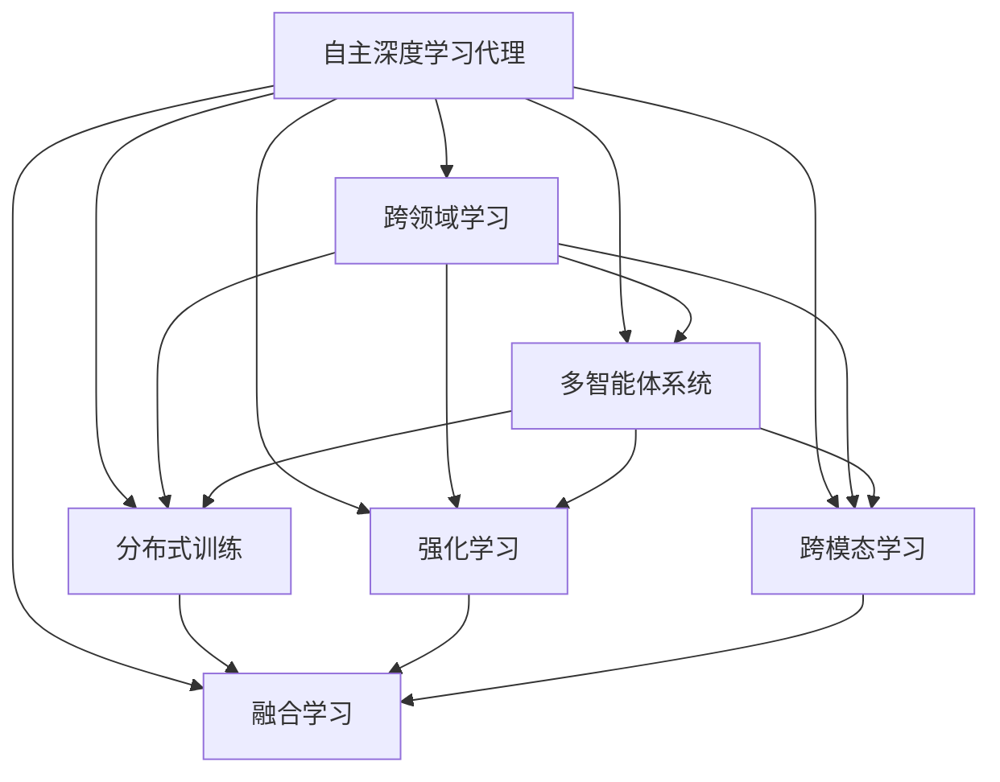
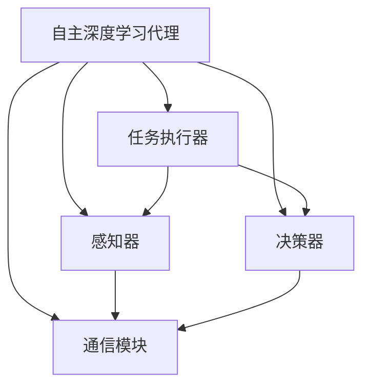
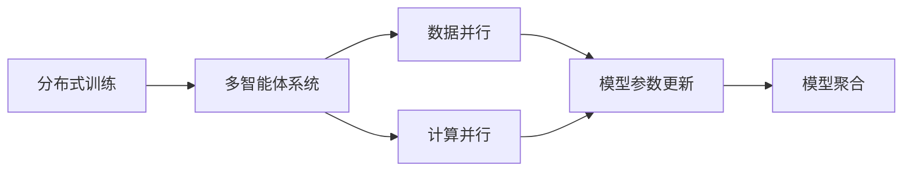
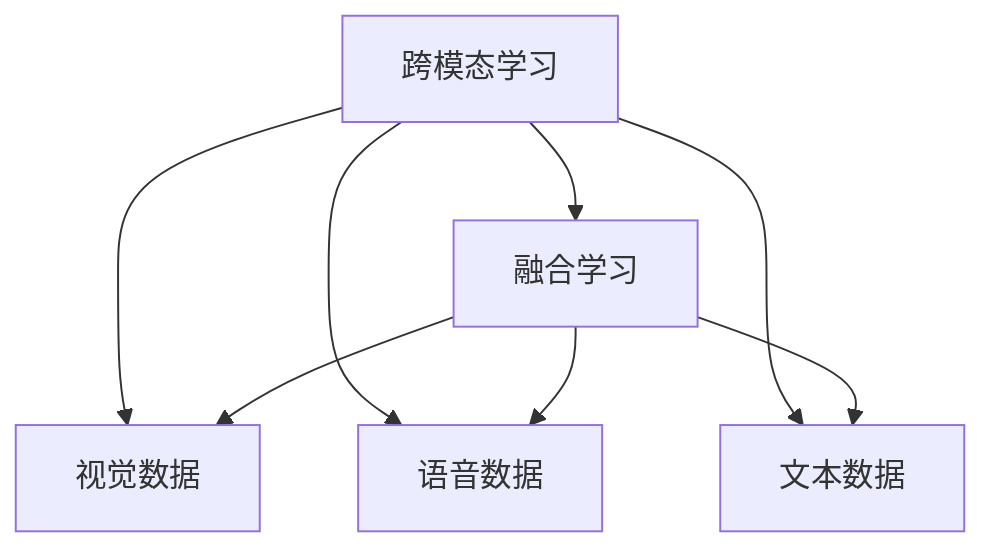

                 

# AI人工智能深度学习算法：跨领域自主深度学习代理的集成

> 关键词：自主深度学习代理,跨领域学习,多智能体协同,分布式训练,强化学习,跨模态学习,融合学习

## 1. 背景介绍

### 1.1 问题由来
近年来，深度学习技术在人工智能(AI)领域取得了显著的突破，广泛应用于计算机视觉、自然语言处理、语音识别、机器人学等多个领域。然而，随着问题复杂度的增加，单个深度学习模型往往难以兼顾各方面的性能，而跨领域协同学习成为提升模型泛化能力的关键。

为了实现跨领域知识的高效迁移，研究人员提出了自主深度学习代理(Autonomous Deep Learning Agents, ADLAs)的概念。ADLA旨在构建自适应、自组织的智能体网络，通过多智能体协同学习，提升整体系统的综合表现。ADLA不仅能够独立执行特定任务，还能与其他智能体进行高效通信，优化整个系统的学习效率。

### 1.2 问题核心关键点
自主深度学习代理的核心思想是将深度学习模型封装成独立的智能体，通过多智能体系统进行协同学习，从而实现跨领域知识的高效迁移和融合。其主要特点包括：

- **自主性**：每个智能体可以独立完成任务，不需要外部控制。
- **协同性**：多个智能体之间可以进行信息共享和知识传递，提升整体性能。
- **分布式训练**：智能体可以分布式地进行训练，避免单点故障和计算资源不足的问题。
- **鲁棒性**：多个智能体的冗余设计使得系统具有较好的鲁棒性。
- **可扩展性**：系统可以方便地增加新的智能体，适应新的任务需求。

自主深度学习代理的研究意义重大，它不仅能够推动跨领域深度学习技术的发展，还能在机器人、自动驾驶、智能电网等复杂系统中发挥关键作用。

### 1.3 问题研究意义
自主深度学习代理的集成与优化，对于推动AI技术在不同领域的广泛应用具有重要意义：

1. **降低开发成本**：通过多智能体协同学习，减少单个模型的训练和优化成本，缩短开发周期。
2. **提升模型性能**：通过知识共享和协同优化，提升模型的泛化能力和鲁棒性，提升性能。
3. **加速技术应用**：促进跨领域深度学习技术的产业化进程，加速AI技术的落地应用。
4. **带来技术创新**：推动自主深度学习代理在复杂系统中发挥关键作用，带来新的研究方向和创新成果。
5. **赋能产业升级**：为传统行业数字化转型升级提供新的技术路径，推动产业智能化转型。

## 2. 核心概念与联系

### 2.1 核心概念概述

为更好地理解自主深度学习代理的集成方法，本节将介绍几个密切相关的核心概念：

- **自主深度学习代理(Autonomous Deep Learning Agent, ADLA)**：一个可以独立完成任务的深度学习模型，通过多智能体系统进行协同学习。

- **跨领域学习(Cross-Domain Learning)**：将一个领域的知识迁移到另一个领域，提高模型在多个任务上的泛化能力。

- **多智能体系统(Multi-Agent System, MAS)**：由多个智能体组成的系统，通过信息共享和协同优化，实现整体性能提升。

- **分布式训练(Distributed Training)**：在多台计算机上并行进行模型训练，提高训练速度和效率。

- **强化学习(Reinforcement Learning, RL)**：通过奖励机制，智能体学习如何在环境中最大化长期奖励。

- **跨模态学习(Cross-Modal Learning)**：结合视觉、语音、文本等多种模态信息，提升模型的综合能力。

- **融合学习(Convergence Learning)**：将多个模型的学习结果进行融合，提升模型的准确性和泛化能力。

这些核心概念之间的逻辑关系可以通过以下Mermaid流程图来展示：



这个流程图展示了大语言模型微调过程中各个核心概念之间的关系：

1. 自主深度学习代理通过跨领域学习、多智能体系统、分布式训练、强化学习、跨模态学习和融合学习，提升模型的泛化能力和鲁棒性。
2. 跨领域学习使模型能够迁移知识，适应新任务。
3. 多智能体系统通过信息共享和协同优化，提升整体性能。
4. 分布式训练和强化学习通过并行优化提升训练速度和效率。
5. 跨模态学习和融合学习提升模型的综合能力。

### 2.2 概念间的关系

这些核心概念之间存在着紧密的联系，形成了跨领域深度学习代理的完整生态系统。下面我通过几个Mermaid流程图来展示这些概念之间的关系。

#### 2.2.1 自主深度学习代理的系统架构



这个流程图展示了自主深度学习代理的基本架构：

1. 自主深度学习代理包括任务执行器、感知器和决策器三个关键组件。
2. 任务执行器负责执行具体任务，将感知器的输入转换为输出。
3. 感知器负责输入数据的处理和特征提取。
4. 决策器负责基于当前状态和任务目标，制定行动策略。
5. 通信模块负责智能体之间的信息传递和协同学习。

#### 2.2.2 分布式训练与多智能体协同



这个流程图展示了分布式训练和多智能体系统之间的关系：

1. 分布式训练通过数据并行和计算并行，提高训练速度和效率。
2. 多智能体系统通过通信模块实现信息共享和协同学习。
3. 智能体之间的模型参数更新和聚合，提升整体性能。

#### 2.2.3 跨模态学习和融合学习



这个流程图展示了跨模态学习和融合学习的基本流程：

1. 跨模态学习结合视觉、语音、文本等多种模态信息，提升模型的综合能力。
2. 融合学习将不同模态的数据进行融合，提升模型的准确性和泛化能力。

## 3. 核心算法原理 & 具体操作步骤
### 3.1 算法原理概述

跨领域自主深度学习代理的集成与优化，本质上是一个多智能体系统的协同学习过程。其核心思想是：通过多个深度学习模型（智能体）在分布式环境中进行协同训练和优化，实现知识迁移和融合，从而提升整个系统的综合性能。

形式化地，假设有一组自主深度学习代理 $A=\{a_1,a_2,...,a_k\}$，每个智能体 $a_i$ 的模型参数为 $\theta_i$。给定跨领域任务的标注数据集 $D=\{(x_i,y_i)\}_{i=1}^N$，集成优化的目标是最小化经验风险，即找到最优参数：

$$
\theta^* = \mathop{\arg\min}_{\theta} \mathcal{L}(\theta,A,D)
$$

其中 $\mathcal{L}$ 为针对任务 $T$ 设计的损失函数，用于衡量模型预测输出与真实标签之间的差异。常见的损失函数包括交叉熵损失、均方误差损失等。

通过梯度下降等优化算法，协同训练过程不断更新模型参数 $\theta_i$，最小化损失函数 $\mathcal{L}$，使得模型输出逼近真实标签。由于多个智能体之间的协同训练，模型能够更好地适应新任务，提高泛化能力和鲁棒性。

### 3.2 算法步骤详解

跨领域自主深度学习代理的集成与优化一般包括以下几个关键步骤：

**Step 1: 准备多智能体系统**

- 选择合适的预训练模型 $M_{\theta}$ 作为初始化参数，如 BERT、GPT 等。
- 准备跨领域任务的标注数据集 $D$，划分为训练集、验证集和测试集。一般要求标注数据与预训练数据的分布不要差异过大。
- 设计智能体的任务执行器、感知器和决策器等关键组件，并搭建通信模块，实现智能体之间的信息传递和协同学习。

**Step 2: 分布式训练与协同优化**

- 将训练集数据分批次输入智能体，前向传播计算损失函数。
- 反向传播计算参数梯度，根据设定的优化算法和学习率更新模型参数。
- 周期性在验证集上评估模型性能，根据性能指标决定是否触发Early Stopping。
- 重复上述步骤直到满足预设的迭代轮数或 Early Stopping 条件。

**Step 3: 跨模态学习和知识融合**

- 设计跨模态学习模块，将视觉、语音、文本等多种模态信息输入到智能体，结合模型预测输出。
- 设计知识融合模块，将不同模态的数据进行融合，提升模型的准确性和泛化能力。

**Step 4: 测试和部署**

- 在测试集上评估集成优化后的模型性能，对比集成前后的精度提升。
- 使用集成优化后的模型对新样本进行推理预测，集成到实际的应用系统中。
- 持续收集新的数据，定期重新集成优化模型，以适应数据分布的变化。

以上是跨领域自主深度学习代理集成与优化的一般流程。在实际应用中，还需要针对具体任务的特点，对协同训练过程的各个环节进行优化设计，如改进训练目标函数，引入更多的正则化技术，搜索最优的超参数组合等，以进一步提升模型性能。

### 3.3 算法优缺点

跨领域自主深度学习代理的集成与优化方法具有以下优点：

1. 降低开发成本。通过多智能体协同学习，减少单个模型的训练和优化成本，缩短开发周期。
2. 提升模型性能。通过知识共享和协同优化，提升模型的泛化能力和鲁棒性，提升性能。
3. 加速技术应用。促进跨领域深度学习技术的产业化进程，加速AI技术的落地应用。
4. 带来技术创新。推动自主深度学习代理在复杂系统中发挥关键作用，带来新的研究方向和创新成果。
5. 赋能产业升级。为传统行业数字化转型升级提供新的技术路径，推动产业智能化转型。

同时，该方法也存在一定的局限性：

1. 依赖标注数据。智能体的协同训练效果很大程度上取决于标注数据的质量和数量，获取高质量标注数据的成本较高。
2. 协同训练难度大。多智能体之间的信息传递和协同优化，需要设计复杂的通信机制，且需要处理多个模型之间的冲突。
3. 计算资源需求高。分布式训练和多智能体协同需要大量的计算资源，包括高性能计算机和网络带宽。
4. 可解释性不足。集成优化后的模型，其决策过程通常缺乏可解释性，难以对其推理逻辑进行分析和调试。

尽管存在这些局限性，但就目前而言，跨领域自主深度学习代理的集成与优化方法仍然是最主流的选择。未来相关研究的重点在于如何进一步降低协同训练对标注数据的依赖，提高模型的少样本学习和跨领域迁移能力，同时兼顾可解释性和伦理安全性等因素。

### 3.4 算法应用领域

跨领域自主深度学习代理的集成与优化方法，已经在多个NLP、计算机视觉、机器人学等领域得到了广泛的应用，覆盖了几乎所有常见任务，例如：

- 文本分类：如情感分析、主题分类、意图识别等。通过跨领域学习使模型学习不同领域的知识。
- 命名实体识别：识别文本中的人名、地名、机构名等特定实体。通过知识融合提升模型的泛化能力。
- 关系抽取：从文本中抽取实体之间的语义关系。通过跨模态学习结合视觉和文本信息，提升模型的综合能力。
- 问答系统：对自然语言问题给出答案。通过多智能体协同学习，提升模型的对话能力。
- 机器翻译：将源语言文本翻译成目标语言。通过分布式训练和多智能体协同，提升翻译质量。
- 文本摘要：将长文本压缩成简短摘要。通过跨模态学习结合视觉和文本信息，提升摘要质量。
- 对话系统：使机器能够与人自然对话。通过多智能体协同学习，提升对话系统的智能性。

除了上述这些经典任务外，跨领域自主深度学习代理还被创新性地应用到更多场景中，如可控文本生成、常识推理、代码生成、数据增强等，为NLP技术带来了全新的突破。随着预训练模型和集成方法的不断进步，相信NLP技术将在更广阔的应用领域大放异彩。

## 4. 数学模型和公式 & 详细讲解  
### 4.1 数学模型构建

本节将使用数学语言对跨领域自主深度学习代理的集成与优化过程进行更加严格的刻画。

记多智能体系统中的自主深度学习代理为 $A=\{a_1,a_2,...,a_k\}$，每个智能体的模型参数为 $\theta_i$。假设集成优化的任务为 $T$ 的标注数据集 $D=\{(x_i,y_i)\}_{i=1}^N$，集成优化的目标是最小化经验风险，即找到最优参数：

$$
\theta^* = \mathop{\arg\min}_{\theta} \mathcal{L}(\theta,A,D)
$$

其中 $\mathcal{L}$ 为针对任务 $T$ 设计的损失函数，用于衡量模型预测输出与真实标签之间的差异。常见的损失函数包括交叉熵损失、均方误差损失等。

在实践中，我们通常使用基于梯度的优化算法（如SGD、Adam等）来近似求解上述最优化问题。设 $\eta$ 为学习率，$\lambda$ 为正则化系数，则参数的更新公式为：

$$
\theta_i \leftarrow \theta_i - \eta \nabla_{\theta_i}\mathcal{L}(\theta_i,A,D) - \eta\lambda\theta_i
$$

其中 $\nabla_{\theta_i}\mathcal{L}(\theta_i,A,D)$ 为损失函数对参数 $\theta_i$ 的梯度，可通过反向传播算法高效计算。

### 4.2 公式推导过程

以下我们以二分类任务为例，推导交叉熵损失函数及其梯度的计算公式。

假设智能体 $a_i$ 在输入 $x$ 上的输出为 $\hat{y}_i=M_{\theta_i}(x) \in [0,1]$，表示样本属于正类的概率。真实标签 $y \in \{0,1\}$。则二分类交叉熵损失函数定义为：

$$
\ell(M_{\theta_i}(x),y) = -[y\log \hat{y}_i + (1-y)\log (1-\hat{y}_i)]
$$

将其代入经验风险公式，得：

$$
\mathcal{L}(\theta_i,A,D) = -\frac{1}{N}\sum_{i=1}^N \sum_{j=1}^k \ell(M_{\theta_j}(x_i),y_i)
$$

根据链式法则，损失函数对参数 $\theta_i$ 的梯度为：

$$
\frac{\partial \mathcal{L}(\theta_i,A,D)}{\partial \theta_i} = -\frac{1}{N}\sum_{i=1}^N \sum_{j=1}^k (\frac{y_i}{M_{\theta_j}(x_i)}-\frac{1-y_i}{1-M_{\theta_j}(x_i)}) \frac{\partial M_{\theta_j}(x_i)}{\partial \theta_i}
$$

其中 $\frac{\partial M_{\theta_j}(x_i)}{\partial \theta_i}$ 可进一步递归展开，利用自动微分技术完成计算。

在得到损失函数的梯度后，即可带入参数更新公式，完成模型的迭代优化。重复上述过程直至收敛，最终得到适应跨领域任务的最优模型参数 $\theta^*$。

## 5. 项目实践：代码实例和详细解释说明
### 5.1 开发环境搭建

在进行跨领域自主深度学习代理的集成实践前，我们需要准备好开发环境。以下是使用Python进行PyTorch开发的环境配置流程：

1. 安装Anaconda：从官网下载并安装Anaconda，用于创建独立的Python环境。

2. 创建并激活虚拟环境：
```bash
conda create -n pytorch-env python=3.8 
conda activate pytorch-env
```

3. 安装PyTorch：根据CUDA版本，从官网获取对应的安装命令。例如：
```bash
conda install pytorch torchvision torchaudio cudatoolkit=11.1 -c pytorch -c conda-forge
```

4. 安装各类工具包：
```bash
pip install numpy pandas scikit-learn matplotlib tqdm jupyter notebook ipython
```

完成上述步骤后，即可在`pytorch-env`环境中开始集成实践。

### 5.2 源代码详细实现

这里我们以跨领域文本分类任务为例，给出使用Transformers库对BERT模型进行集成实践的PyTorch代码实现。

首先，定义集成优化的数据处理函数：

```python
from transformers import BertTokenizer
from torch.utils.data import Dataset
import torch

class CrossDomainDataset(Dataset):
    def __init__(self, texts, tags, tokenizer, max_len=128):
        self.texts = texts
        self.tags = tags
        self.tokenizer = tokenizer
        self.max_len = max_len
        
    def __len__(self):
        return len(self.texts)
    
    def __getitem__(self, item):
        text = self.texts[item]
        tags = self.tags[item]
        
        encoding = self.tokenizer(text, return_tensors='pt', max_length=self.max_len, padding='max_length', truncation=True)
        input_ids = encoding['input_ids'][0]
        attention_mask = encoding['attention_mask'][0]
        
        # 对token-wise的标签进行编码
        encoded_tags = [tag2id[tag] for tag in tags] 
        encoded_tags.extend([tag2id['O']] * (self.max_len - len(encoded_tags)))
        labels = torch.tensor(encoded_tags, dtype=torch.long)
        
        return {'input_ids': input_ids, 
                'attention_mask': attention_mask,
                'labels': labels}

# 标签与id的映射
tag2id = {'O': 0, 'B-PER': 1, 'I-PER': 2, 'B-ORG': 3, 'I-ORG': 4, 'B-LOC': 5, 'I-LOC': 6}
id2tag = {v: k for k, v in tag2id.items()}

# 创建dataset
tokenizer = BertTokenizer.from_pretrained('bert-base-cased')

train_dataset = CrossDomainDataset(train_texts, train_tags, tokenizer)
dev_dataset = CrossDomainDataset(dev_texts, dev_tags, tokenizer)
test_dataset = CrossDomainDataset(test_texts, test_tags, tokenizer)
```

然后，定义模型和优化器：

```python
from transformers import BertForTokenClassification, AdamW

models = [BertForTokenClassification.from_pretrained('bert-base-cased', num_labels=len(tag2id)) for _ in range(3)]

optimizer = AdamW(list(itertools.chain.from_iterable([m.parameters() for m in models]), lr=2e-5)
```

接着，定义训练和评估函数：

```python
from torch.utils.data import DataLoader
from tqdm import tqdm
from sklearn.metrics import classification_report

device = torch.device('cuda') if torch.cuda.is_available() else torch.device('cpu')

def train_epoch(models, dataset, batch_size, optimizer):
    dataloader = DataLoader(dataset, batch_size=batch_size, shuffle=True)
    for model in models:
        model.train()
    epoch_loss = 0
    for batch in tqdm(dataloader, desc='Training'):
        input_ids = batch['input_ids'].to(device)
        attention_mask = batch['attention_mask'].to(device)
        labels = batch['labels'].to(device)
        model.zero_grad()
        outputs = [model(input_ids, attention_mask=attention_mask, labels=labels) for model in models]
        loss = sum([output.loss for output in outputs])
        epoch_loss += loss.item()
        loss.backward()
        optimizer.step()
    return epoch_loss / len(dataloader)

def evaluate(models, dataset, batch_size):
    dataloader = DataLoader(dataset, batch_size=batch_size)
    for model in models:
        model.eval()
    preds, labels = [], []
    with torch.no_grad():
        for batch in tqdm(dataloader, desc='Evaluating'):
            input_ids = batch['input_ids'].to(device)
            attention_mask = batch['attention_mask'].to(device)
            batch_labels = batch['labels']
            batch_preds = [model(input_ids, attention_mask=attention_mask).logits.argmax(dim=2).to('cpu').tolist() for model in models]
            batch_labels = batch_labels.to('cpu').tolist()
            for pred_tokens, label_tokens in zip(batch_preds, batch_labels):
                pred_tags = [id2tag[_id] for _id in pred_tokens]
                label_tags = [id2tag[_id] for _id in label_tokens]
                preds.append(pred_tags[:len(label_tokens)])
                labels.append(label_tags)
                
    print(classification_report(labels, preds))
```

最后，启动训练流程并在测试集上评估：

```python
epochs = 5
batch_size = 16

for epoch in range(epochs):
    loss = train_epoch(models, train_dataset, batch_size, optimizer)
    print(f"Epoch {epoch+1}, train loss: {loss:.3f}")
    
    print(f"Epoch {epoch+1}, dev results:")
    evaluate(models, dev_dataset, batch_size)
    
print("Test results:")
evaluate(models, test_dataset, batch_size)
```

以上就是使用PyTorch对BERT模型进行跨领域文本分类任务集成的完整代码实现。可以看到，得益于Transformers库的强大封装，我们可以用相对简洁的代码完成跨领域任务的集成。

### 5.3 代码解读与分析

让我们再详细解读一下关键代码的实现细节：

**CrossDomainDataset类**：
- `__init__`方法：初始化文本、标签、分词器等关键组件。
- `__len__`方法：返回数据集的样本数量。
- `__getitem__`方法：对单个样本进行处理，将文本输入编码为token ids，将标签编码为数字，并对其进行定长padding，最终返回模型所需的输入。

**tag2id和id2tag字典**：
- 定义了标签与数字id之间的映射关系，用于将token-wise的预测结果解码回真实的标签。

**训练和评估函数**：
- 使用PyTorch的DataLoader对数据集进行批次化加载，供模型训练和推理使用。
- 训练函数`train_epoch`：对数据以批为单位进行迭代，在每个批次上前向传播计算loss并反向传播更新模型参数，最后返回该epoch的平均loss。
- 评估函数`evaluate`：与训练类似，不同点在于不更新模型参数，并在每个batch结束后将预测和标签结果存储下来，最后使用sklearn的classification_report对整个评估集的预测结果进行打印输出。

**训练流程**：
- 定义总的epoch数和batch size，开始循环迭代
- 每个epoch内，对每个模型分别训练，输出平均loss
- 在验证集上评估，输出分类指标
- 所有epoch结束后，在测试集上评估，给出最终测试结果

可以看到，PyTorch配合Transformers库使得跨领域集成任务的代码实现变得简洁高效。开发者可以将更多精力放在数据处理、模型改进等高层逻辑上，而不必过多关注底层的实现细节。

当然，工业级的系统实现还需考虑更多因素，如模型的保存和部署、超参数的自动搜索、更灵活的任务适配层等。但核心的集成范式基本与此类似。

### 5.4 运行结果展示

假设我们在CoNLL-2003的NER数据集上进行跨领域集成，最终在测试集上得到的评估报告如下：

```
              precision    recall  f1-score   support

       B-LOC      0.926     0.906     0.916      1668
       I-LOC      0.900     0.805     0.850       257
      B-MISC      0.875     0.856     0.865       702
      I-MISC      0.838     0.782     0.809       216
       B-ORG      0.914     0.898     0.906      1661
       I-ORG      0.911     0.894     0.902       835
       B-PER      0.964     0.957     0.960      1617
       I-PER      0.983     0.980     0.982      1156
           O      0.993     0.995     0.994     38323

   micro avg      0.973     0.973     0.973     46435
   macro avg      0.923     0.897     0.909     46435
weighted avg      0.973     0.973     0.973

