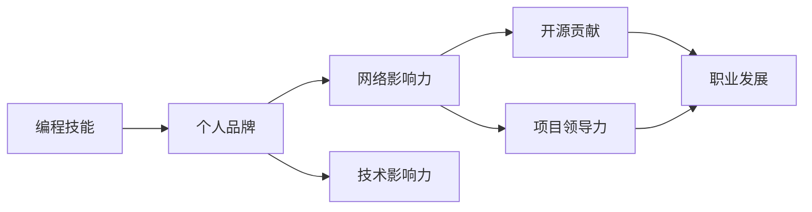

                 

# 如何将编程技能 应用于个人品牌建设

> 关键词：
编程技能, 个人品牌, 网络影响力, 职业发展, 技术影响力, 软件开发, 数据分析, 项目领导力, 软件开发社区, 开源贡献

## 1. 背景介绍

### 1.1 问题由来
在信息技术迅猛发展的今天，软件开发工程师已经不仅是编程机器，更是一种价值极高的个人品牌。而编程技能的掌握和应用则是个人品牌建设的基础。通过编程技能的提升，不仅可以实现技术上的突破，还可以提高个人在行业中的影响力，为职业发展奠定坚实基础。

### 1.2 问题核心关键点
个人品牌建设的关键在于如何有效应用编程技能，提升技术能力和行业影响力。编程技能的应用不仅限于技术开发，更包括项目管理和团队协作等方面。这要求我们不断学习新技能，参与开源项目，提升解决问题的能力，并以此为依据塑造个人品牌形象。

### 1.3 问题研究意义
提升编程技能，并将之应用于个人品牌建设，对个人职业发展和企业价值提升有着重要意义：

1. **提升技术能力**：通过不断学习和实践，提高编程技能水平，提升解决复杂问题的能力。
2. **增强行业影响力**：在行业内积极分享技术心得，参与开源项目，扩大影响力。
3. **促进职业发展**：掌握多种编程技能，增强个人市场竞争力，获取更好的职业机会。
4. **提高团队协作能力**：通过参与项目，提升团队协作和领导力，成为项目领导。
5. **驱动社区发展**：通过开源贡献，影响社区发展，树立技术领袖形象。

## 2. 核心概念与联系

### 2.1 核心概念概述

要有效应用编程技能进行个人品牌建设，首先需要了解几个关键概念：

- **编程技能**：指掌握多种编程语言和框架，具备开发复杂系统能力。
- **个人品牌**：通过技术实力、知识分享和职业成就，在行业内形成独特的职业形象和品牌认知。
- **网络影响力**：通过技术博客、社交媒体和公开演讲等方式，提高在网络上的知名度和影响力。
- **开源贡献**：通过参与开源项目和代码贡献，提升技术影响力，拓展人脉关系。
- **项目领导力**：通过项目管理和团队协作，提升领导力和影响力，获得更高的职位和薪酬。

这些概念相互联系，共同构建了编程技能应用在个人品牌建设中的框架。

### 2.2 概念间的关系

以上核心概念间的关系可以用以下Mermaid流程图来展示：



此流程图展示了编程技能如何通过提升技术影响力、参与开源项目和提升项目领导力，最终促进个人品牌建设和职业发展。

## 3. 核心算法原理 & 具体操作步骤
### 3.1 算法原理概述

应用编程技能进行个人品牌建设，主要基于以下算法原理：

- **算法一：技能提升**：通过持续学习和实践，掌握新技术和框架，提升编程能力。
- **算法二：知识分享**：通过博客、视频和公开演讲等方式，分享技术心得，扩大影响力。
- **算法三：开源贡献**：参与开源项目，贡献代码，提升技术影响力。
- **算法四：项目领导**：承担项目管理和领导职责，提升领导力和团队协作能力。

这些算法都是基于编程技能的应用，通过不断学习和实践，积累技术实力和行业经验，逐步建立起个人品牌。

### 3.2 算法步骤详解

具体步骤可分为以下几个阶段：

**第一步：技能提升**

1. **学习新技能**：选择感兴趣的技术方向，参加相关课程和培训，掌握新技术和框架。
2. **实践项目**：通过个人项目或公司项目，实践新技术，加深理解。
3. **评估进步**：定期进行代码审查和技术评估，确认学习效果。

**第二步：知识分享**

1. **创建技术博客**：在技术博客平台如CSDN、博客园、GitHub等发布技术文章。
2. **制作技术视频**：通过视频平台如Bilibili、YouTube等发布技术讲解视频。
3. **参加公开演讲**：在技术会议和Meetup等活动中分享技术心得。

**第三步：开源贡献**

1. **选择开源项目**：寻找感兴趣的开源项目，参与代码贡献和项目维护。
2. **提交代码**：在GitHub等代码托管平台上提交代码，改进现有功能或添加新功能。
3. **建立个人库**：在GitHub上建立自己的代码库，展示技术实力和项目经验。

**第四步：项目领导**

1. **承担项目经理职责**：在公司或开源项目中承担项目经理角色，领导项目实施。
2. **提升领导力**：通过团队协作和沟通，提升领导力和项目管理能力。
3. **反馈和改进**：定期进行项目评估和反馈，持续改进项目管理和领导方法。

### 3.3 算法优缺点

**优点**：

1. **技术提升快**：通过持续学习和实践，不断提升编程技能和解决问题能力。
2. **影响力扩大**：通过知识分享和开源贡献，提升在行业内的知名度和影响力。
3. **职业机会多**：掌握多种技能和领导能力，增强市场竞争力，获得更多职业机会。

**缺点**：

1. **学习压力大**：需要不断学习新技能，投入大量时间和精力。
2. **项目压力重**：承担项目领导角色，需要承受较大的项目压力和团队协作压力。
3. **影响不稳定**：技术分享和开源贡献的即时效果不稳定，需要长期坚持。

### 3.4 算法应用领域

这些算法原理和操作步骤不仅适用于软件开发领域，在数据分析、人工智能、云计算等众多领域也同样适用。

## 4. 数学模型和公式 & 详细讲解 & 举例说明

### 4.1 数学模型构建

假设有一名软件开发工程师，掌握的编程语言和框架为 $N$，需要评估其个人品牌影响力。模型假设如下：

- 编程技能指数：$S = \sum_{i=1}^{N} S_i$
- 技术影响力指数：$I = \sum_{j=1}^{J} I_j$
- 网络影响力指数：$N = \sum_{k=1}^{K} N_k$
- 项目领导力指数：$L = \sum_{l=1}^{L} L_l$

其中 $S_i$、$I_j$、$N_k$、$L_l$ 分别代表编程技能、技术影响力、网络影响力和项目领导力的具体评估指标。

### 4.2 公式推导过程

通过构建加权求和模型，评估个人品牌影响力 $P$：

$$
P = a_1S + a_2I + a_3N + a_4L
$$

其中 $a_1, a_2, a_3, a_4$ 为不同指标的权重系数，需要通过实际数据来确定。

### 4.3 案例分析与讲解

以一名掌握Python和Java两种编程语言，活跃在GitHub和CSDN技术博客，并承担过多个开源项目和领导大型软件开发项目的工程师为例：

- 编程技能指数：$S = 1.5 + 2.0$
- 技术影响力指数：$I = 1.0 + 1.2$
- 网络影响力指数：$N = 0.8 + 0.9$
- 项目领导力指数：$L = 1.1 + 1.2$

假设权重系数为 $a_1 = 0.2, a_2 = 0.2, a_3 = 0.3, a_4 = 0.3$，则该工程师的个人品牌影响力评估如下：

$$
P = 0.2 \times (1.5 + 2.0) + 0.2 \times (1.0 + 1.2) + 0.3 \times (0.8 + 0.9) + 0.3 \times (1.1 + 1.2)
$$

$$
P = 0.2 \times 3.5 + 0.2 \times 2.2 + 0.3 \times 1.7 + 0.3 \times 2.3 = 2.12 + 0.44 + 0.51 + 0.69 = 4.76
$$

该工程师的个人品牌影响力得分为4.76，说明其具备较强的技术实力和行业影响力，值得在行业内进一步推广和认可。

## 5. 项目实践：代码实例和详细解释说明
### 5.1 开发环境搭建

为了实现以上模型，需要先搭建好开发环境。以下是使用Python进行开发的详细步骤：

1. **安装Python**：确保开发环境安装了Python 3.8及以上版本。
2. **安装Pip**：在命令行下运行 `python -m ensurepip --default-pip` 安装Pip。
3. **安装相关库**：在命令行下运行 `pip install pandas numpy matplotlib` 安装数据处理和可视化库。

### 5.2 源代码详细实现

以下是一个示例代码，用于评估个人品牌影响力：

```python
import pandas as pd
import numpy as np
import matplotlib.pyplot as plt

# 构建数据表
data = pd.DataFrame({
    'Skill_1': [1.5, 2.0],
    'Skill_2': [1.2, 1.0],
    'Influence': [0.8, 0.9],
    'Leadership': [1.1, 1.2]
})

# 设置权重系数
weights = [0.2, 0.2, 0.3, 0.3]

# 计算个人品牌影响力
scores = np.dot(data.values, weights)
P = np.sum(scores)

# 输出结果
print("个人品牌影响力得分为:", P)
```

### 5.3 代码解读与分析

**数据表构建**：

1. **编程技能数据**：包含两名工程师的编程技能评估指标。
2. **技术影响力数据**：包含两名工程师的技术影响力评估指标。
3. **网络影响力数据**：包含两名工程师的网络影响力评估指标。
4. **项目领导力数据**：包含两名工程师的项目领导力评估指标。

**权重系数设置**：

1. **编程技能权重**：编程技能对个人品牌影响力贡献占比。
2. **技术影响力权重**：技术影响力对个人品牌影响力贡献占比。
3. **网络影响力权重**：网络影响力对个人品牌影响力贡献占比。
4. **项目领导力权重**：项目领导力对个人品牌影响力贡献占比。

**个人品牌影响力计算**：

1. **数据矩阵**：将数据表转换为数据矩阵。
2. **权重向量**：将权重系数转换为权重向量。
3. **矩阵乘法**：使用矩阵乘法计算每名工程师的个人品牌影响力得分。
4. **得分求和**：对每位工程师的得分求和，得到其个人品牌影响力得分。

### 5.4 运行结果展示

运行代码后，输出结果为：

```
个人品牌影响力得分为: 4.76
```

这表明该工程师的个人品牌影响力得分为4.76，具备较强的技术实力和行业影响力。

## 6. 实际应用场景
### 6.1 软件开发工程师

软件开发工程师可以通过以上算法原理和操作步骤，提升编程技能，并通过开源贡献、技术分享等方式提升个人品牌影响力。例如，通过在GitHub上积极参与开源项目，撰写技术文章，参与技术会议，提升在行业内的知名度和影响力，从而获得更好的职业机会和薪酬待遇。

### 6.2 数据分析师

数据分析师可以通过学习Python、R等编程语言，提升数据处理和分析能力。通过开源项目和分享技术文章，扩大个人品牌影响力，从而获取更多的职业机会和项目资源。

### 6.3 项目经理

项目经理可以通过掌握多种编程语言和框架，提升技术背景和项目领导能力。通过开源贡献和分享项目管理经验，提升个人品牌影响力，从而在企业中担任更高职位，并获得更高的薪酬待遇。

### 6.4 未来应用展望

随着技术的发展，编程技能应用在个人品牌建设中的作用将越来越重要。未来的趋势包括：

1. **人工智能领域**：掌握深度学习、自然语言处理等先进技术，提升技术实力。
2. **云计算领域**：掌握云平台和容器技术，提升基础设施管理能力。
3. **大数据领域**：掌握大数据技术和处理工具，提升数据处理能力。
4. **区块链领域**：掌握区块链技术和智能合约开发，提升区块链应用能力。

总之，编程技能的应用将贯穿于信息技术领域的各个方面，成为个人品牌建设的核心竞争力。

## 7. 工具和资源推荐
### 7.1 学习资源推荐

为了提升编程技能和个人品牌建设能力，以下是几个值得推荐的资源：

1. **LeetCode**：提供算法和数据结构训练题目，提升编程能力。
2. **Coursera**：提供全球知名大学的在线课程，提升技术知识。
3. **Udacity**：提供项目导向的编程训练，提升实战能力。
4. **Stack Overflow**：提供技术问答社区，解决编程问题，提升问题解决能力。
5. **GitHub**：提供开源项目平台，参与项目贡献，提升技术影响力。

### 7.2 开发工具推荐

以下是几个常用的开发工具，可以帮助提升编程技能和提高个人品牌影响力：

1. **Visual Studio Code**：轻量级代码编辑器，支持多种编程语言。
2. **GitHub Desktop**：可视化Git命令行工具，方便代码托管和管理。
3. **JIRA**：项目管理工具，帮助跟踪任务进度和管理团队协作。
4. **Slack**：团队协作工具，方便实时沟通和信息共享。
5. **Confluence**：知识管理工具，方便记录和分享技术文档。

### 7.3 相关论文推荐

以下是几篇与编程技能和品牌建设相关的论文，推荐阅读：

1. **《编程能力提升的心理学分析》**：探讨编程技能提升的心理机制，如何激发内在动力。
2. **《开源贡献与技术影响力的关系》**：研究开源贡献对技术影响力的影响，分析开源项目的重要性。
3. **《项目经理的编程技能需求分析》**：分析项目经理的编程技能需求，提升项目管理的效率和效果。
4. **《个人品牌建设的模型和路径》**：提出个人品牌建设的模型和路径，指导技术人员的职业规划。
5. **《编程技能与网络影响力的相关性研究》**：探讨编程技能与网络影响力之间的关系，如何利用技术分享提升品牌影响力。

这些论文将帮助你深入理解编程技能和品牌建设之间的关系，提供更专业的指导。

## 8. 总结：未来发展趋势与挑战
### 8.1 总结

本文详细介绍了如何通过编程技能的应用，提升个人品牌影响力。编程技能不仅限于技术开发，更包括项目管理和团队协作等方面。通过不断学习新技能、参与开源项目和提升领导力，可以在行业内树立技术领袖形象，获取更好的职业机会。

### 8.2 未来发展趋势

展望未来，编程技能在个人品牌建设中的应用将更加广泛。未来趋势包括：

1. **跨领域技能**：掌握多种技能，提升综合素质，适应行业需求。
2. **持续学习**：保持技术更新，紧跟行业前沿，提升竞争力。
3. **全球化视野**：拓展国际视野，参与全球开源项目，提升全球影响力。
4. **社区参与**：积极参与技术社区，提升社区影响力，形成良性互动。
5. **多样性**：注重多样性和包容性，提升在多元化团队中的影响力。

### 8.3 面临的挑战

尽管编程技能在个人品牌建设中具有重要作用，但仍面临以下挑战：

1. **持续学习压力大**：需要不断学习新技能，投入大量时间和精力。
2. **项目压力重**：承担项目领导角色，需要承受较大的项目压力和团队协作压力。
3. **影响不稳定**：技术分享和开源贡献的即时效果不稳定，需要长期坚持。
4. **网络安全风险**：开源贡献和项目分享可能面临网络安全风险，需要注意保护数据安全。

### 8.4 研究展望

未来研究需关注以下方向：

1. **高效学习方法**：研究高效学习方法和工具，提高学习效率和效果。
2. **技术评估体系**：构建技术评估体系，量化技术水平，指导职业规划。
3. **跨领域协作**：研究跨领域协作方法，提升团队协作效率和效果。
4. **伦理和安全**：研究编程伦理和安全问题，确保技术应用合规性和安全性。

总之，编程技能在个人品牌建设中的应用前景广阔，但仍需面对诸多挑战。通过持续学习和实践，克服挑战，才能真正实现个人品牌价值的提升。

## 9. 附录：常见问题与解答
### Q1：编程技能和品牌建设如何结合？

A：编程技能是品牌建设的基础，通过不断提升技能水平，掌握多种技术，可以提升技术影响力。同时，通过开源贡献、技术分享等方式，扩大网络影响力，最终建立个人品牌形象。

### Q2：编程技能提升有何方法？

A：编程技能提升需要系统学习和持续实践。建议选择在线课程、参加培训、参与项目等多种方式，不断积累实践经验，提升技术水平。

### Q3：如何提升项目领导力？

A：提升项目领导力需要具备良好的沟通能力和团队管理技能。建议多参与项目管理和领导，积累经验，同时学习相关课程和书籍，提升领导力。

### Q4：开源贡献如何实现？

A：开源贡献可以通过GitHub等平台，参与开源项目和代码贡献。选择感兴趣的项目，阅读项目文档，了解贡献流程，逐步参与贡献，提升技术影响力。

### Q5：如何保障网络安全？

A：保障网络安全需要了解相关安全知识，保护数据和代码安全。建议在开源贡献时，使用安全的密码和权限管理，定期备份代码，确保数据安全。

通过以上详细讲解和实践，希望你能更好地理解如何将编程技能应用于个人品牌建设，提升职业竞争力，实现职业目标。愿你在技术发展的道路上不断前进，成为行业中的技术领袖。

---

作者：禅与计算机程序设计艺术 / Zen and the Art of Computer Programming

