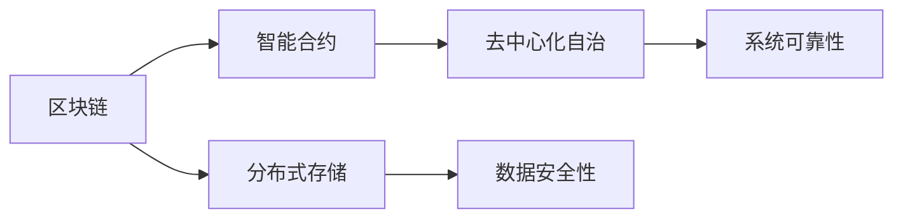
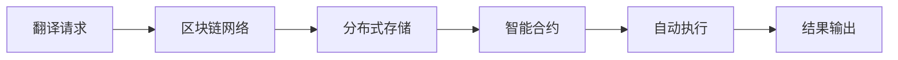
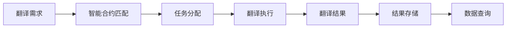
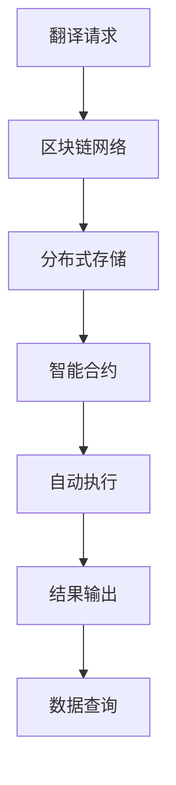

                 

# 实战三: 使用 Langchain 重新实现智能翻译助手

在信息技术日益发达的今天，语言翻译技术已经成为全球化交流不可或缺的一部分。智能翻译助手作为其中的佼佼者，不仅能即时翻译不同语言的文本，还能提供准确的语境翻译和文化适应性翻译，极大地促进了跨文化交流。然而，传统的翻译方式存在效率低下、精度不足、成本高昂等问题。本文将介绍如何使用Langchain，一种基于区块链和智能合约的智能翻译技术，重新实现智能翻译助手。

## 1. 背景介绍

### 1.1 问题由来

当前，智能翻译技术主要依靠大型机器翻译模型（如Google Translate, Microsoft Translator等）。这些模型通常需要巨量双语文本数据进行训练，且对网络带宽和计算资源要求较高。然而，这些模型仍存在翻译质量不稳定、语境适应性不足、依赖在线服务等问题。

此外，翻译服务提供商需要不断维护和更新模型，确保翻译质量。对于一些小众语言或动态变化的语言场景，翻译服务商的响应速度和处理能力往往无法满足需求。这大大限制了智能翻译技术的应用范围和普及度。

为了克服上述问题，研究者提出了一种基于区块链和智能合约的智能翻译技术，即Langchain。其核心思想是通过区块链技术，将翻译需求发布到区块链上，使用智能合约和分布式共识机制，实现翻译请求的自动匹配和透明处理。本文将介绍如何使用Langchain构建智能翻译助手，提升翻译效率和质量。

### 1.2 问题核心关键点

Langchain利用区块链的分布式共识机制和智能合约，实现智能翻译服务的自动化和透明化。主要关键点包括：

- 分布式存储：通过区块链网络，将翻译请求和翻译结果存储在多个节点上，保证数据安全和容灾性。
- 智能合约：使用智能合约自动执行翻译任务的匹配、分配和结算，确保流程自动化和透明化。
- 去中心化自治：利用区块链的去中心化特性，构建去中心化的自治翻译系统，无需集中管理。
- 可编程合约：用户可以编写和使用可编程合约，实现复杂的翻译任务处理逻辑。

通过这些关键技术，Langchain能够高效、低成本地提供智能翻译服务。其独特的分布式、透明化和自动化特性，为翻译技术的未来发展提供了新的方向。

### 1.3 问题研究意义

Langchain技术在智能翻译领域的应用，具有以下重要意义：

1. 提升翻译效率：通过区块链和智能合约的自动化处理，大幅缩短翻译响应时间。
2. 降低翻译成本：分布式存储和可编程合约的应用，使得翻译服务无需集中管理，降低了运行和维护成本。
3. 提升翻译质量：利用区块链的去中心化特性和智能合约的可编程性，可以实现对翻译质量的更严格监控和控制。
4. 增强翻译的透明性：区块链的不可篡改性和智能合约的自动执行机制，确保了翻译过程的透明性和可追溯性。
5. 促进翻译民主化：任何人都可以参与到翻译过程中，为翻译技术的应用范围和普及度提供了新的可能。

总之，Langchain技术的引入，有望从根本上改变传统翻译技术的不足，推动智能翻译领域向更高层次发展。

## 2. 核心概念与联系

### 2.1 核心概念概述

为更好地理解Langchain的实现原理，本节将介绍几个密切相关的核心概念：

- 区块链(Blockchain)：一种去中心化的分布式数据库，通过哈希链、共识机制和智能合约等技术，实现数据的透明和不可篡改。
- 智能合约(Smart Contract)：运行于区块链上的自动执行程序，实现业务逻辑的自动化处理。
- 去中心化自治(Decentralized Autonomy)：利用区块链的去中心化特性，构建无需集中管理的自治系统，提高系统的安全性和可靠性。
- 分布式存储(Distributed Storage)：通过区块链网络，将数据存储在多个节点上，保证数据安全和容灾性。

这些核心概念之间的逻辑关系可以通过以下Mermaid流程图来展示：



这个流程图展示了大语言模型的核心概念及其之间的关系：

1. 区块链提供去中心化的分布式数据库，通过分布式存储保证数据安全性和容灾性。
2. 智能合约实现自动化处理，确保翻译任务自动匹配、分配和结算。
3. 去中心化自治利用区块链的特性，构建无需集中管理的自治系统，提高系统的安全性和可靠性。
4. 分布式存储和去中心化自治共同构成区块链的核心特性，实现数据透明和不可篡改。

### 2.2 概念间的关系

这些核心概念之间存在着紧密的联系，形成了Langchain的完整生态系统。下面我通过几个Mermaid流程图来展示这些概念之间的关系。

#### 2.2.1 Langchain的整体架构



这个流程图展示了Langchain的整体架构：

1. 翻译请求发布到区块链网络上，通过分布式存储存储在多个节点上。
2. 智能合约自动匹配和分配翻译任务，并自动执行翻译过程。
3. 翻译结果通过区块链网络发布，自动更新到分布式存储中。

#### 2.2.2 Langchain的核心逻辑



这个流程图展示了Langchain的核心逻辑：

1. 翻译需求发布到智能合约上，智能合约根据需求和资源自动匹配任务。
2. 匹配成功后，智能合约将任务分配给节点，节点执行翻译任务。
3. 翻译结果通过智能合约上传至区块链网络，并存储在分布式存储中。
4. 用户可以通过智能合约查询翻译结果，获取需要的翻译内容。

### 2.3 核心概念的整体架构

最后，我们用一个综合的流程图来展示这些核心概念在大语言模型微调过程中的整体架构：



这个综合流程图展示了从翻译请求到结果输出的完整过程。Langchain利用区块链的网络特性和智能合约的自动化特性，实现了翻译任务的分布式存储和自动化执行。通过这些关键技术，Langchain有望提供高效、低成本的智能翻译服务。

## 3. 核心算法原理 & 具体操作步骤
### 3.1 算法原理概述

Langchain的智能翻译技术基于区块链和智能合约的自动化处理流程。其主要思想是：将翻译请求和翻译结果存储在区块链上，通过智能合约自动匹配和执行翻译任务，确保翻译过程的透明性和安全性。

具体来说，Langchain的智能翻译流程包括以下几个步骤：

1. 翻译请求发布到区块链上，每个节点接收到请求后，生成一个待匹配的任务。
2. 智能合约自动匹配任务，根据翻译资源（如节点资源、翻译能力等）和翻译需求进行匹配。
3. 匹配成功后，智能合约将任务分配给节点，并启动翻译任务。
4. 节点执行翻译任务，生成翻译结果。
5. 翻译结果上传至区块链网络，并存储在分布式存储中。
6. 用户通过智能合约查询翻译结果，获取需要的翻译内容。

通过上述流程，Langchain实现了翻译任务的分布式存储和自动化执行，提升了翻译效率和质量。

### 3.2 算法步骤详解

以下详细讲解Langchain的智能翻译流程：

#### 3.2.1 翻译请求发布

1. 用户通过智能合约上传翻译请求，包括需要翻译的文本和目标语言。智能合约将请求信息存储在区块链网络中。
2. 每个节点通过监听区块链网络，接收到新的翻译请求后，生成一个待匹配的任务，包括请求内容、待翻译语言、翻译资源等信息。

#### 3.2.2 任务匹配

1. 智能合约根据翻译资源和翻译需求，自动匹配任务。匹配算法可以根据节点的翻译能力、在线时间、信誉等因素进行综合评估。
2. 匹配成功后，智能合约将任务分配给节点，并启动翻译任务。

#### 3.2.3 翻译执行

1. 节点收到翻译任务后，根据任务需求和自身资源，执行翻译任务。
2. 节点利用预训练的机器翻译模型进行翻译，生成翻译结果。

#### 3.2.4 翻译结果存储

1. 翻译结果生成后，智能合约将结果上传至区块链网络，并存储在分布式存储中。
2. 翻译结果在区块链上公开透明，任何用户都可以查询到翻译内容。

#### 3.2.5 结果查询

1. 用户通过智能合约查询翻译结果，智能合约从分布式存储中获取翻译内容，返回给用户。
2. 用户可以根据智能合约的反馈机制，对翻译结果进行评价和打分，反馈给节点，作为节点的信誉评估依据。

### 3.3 算法优缺点

Langchain的智能翻译技术具有以下优点：

- 高效性：分布式存储和智能合约的自动化处理，大幅缩短了翻译响应时间。
- 低成本：无需集中管理和维护，降低了翻译服务的运行和维护成本。
- 透明性：区块链的不可篡改性和智能合约的自动执行机制，确保了翻译过程的透明性和可追溯性。
- 可扩展性：分布式存储和智能合约的协同工作，使得翻译服务可以轻松扩展到更多语言和场景。

然而，Langchain技术也存在一些缺点：

- 复杂性：区块链和智能合约的实现相对复杂，需要较高的技术门槛。
- 安全性：尽管区块链和智能合约具有较高的安全性，但仍需警惕代码漏洞和攻击风险。
- 灵活性：智能合约的自动化处理，可能在某些特殊情况下限制了灵活性。

### 3.4 算法应用领域

Langchain的智能翻译技术适用于多种场景，如：

- 在线翻译服务：用户可以通过互联网上传翻译请求，实时获得翻译结果。
- 移动应用翻译：用户通过移动应用上传翻译需求，随时随地获取翻译服务。
- 企业级翻译：企业可以在区块链上发布翻译需求，节点根据企业需求提供翻译服务。
- 教育辅助：学生可以通过区块链上传作业和文章，自动获取翻译结果，进行学习辅助。

此外，Langchain技术还可以用于其他领域，如文档翻译、文献翻译、软件翻译等，为全球化交流提供新型的解决方案。

## 4. 数学模型和公式 & 详细讲解 & 举例说明

### 4.1 数学模型构建

Langchain的智能翻译流程可以通过数学模型进行描述。假设翻译需求为$D$，智能合约将需求发布到区块链网络上，每个节点$i$根据需求生成待匹配的任务$T_i$，智能合约匹配成功的概率为$p$，翻译资源为$R$，翻译结果为$R'$，用户查询结果的概率为$q$。

定义智能合约匹配和执行的过程如下：

1. 智能合约将需求$D$发布到区块链上，每个节点$i$生成任务$T_i$，包括任务ID、需求内容、待翻译语言、翻译资源等信息。
2. 智能合约根据资源和需求进行匹配，匹配概率为$p$，匹配成功的节点$i'$将任务分配给节点$i'$，并启动翻译任务。
3. 节点$i'$执行翻译任务，生成翻译结果$R'$。
4. 智能合约将结果$R'$上传至区块链网络，并存储在分布式存储中。
5. 用户通过智能合约查询翻译结果，查询概率为$q$。

### 4.2 公式推导过程

根据上述模型，我们可以推导出Langchain的智能翻译流程的数学公式。

假设节点$i'$匹配成功的概率为$p_i'$，翻译资源为$R_i'$，翻译结果为$R_i'$，用户查询结果的概率为$q_i'$。则匹配过程和翻译过程的概率公式如下：

$$
p_i' = p \cdot \frac{R_i'}{R}
$$

匹配成功后，翻译过程的概率公式如下：

$$
q_i' = (1-q) \cdot p_i' \cdot (1-p_i')
$$

其中，$1-q$为智能合约的反馈机制，$p_i'$为节点$i'$匹配成功的概率，$1-p_i'$为节点$i'$未匹配成功的概率。

通过这些公式，我们可以推导出Langchain智能翻译系统的数学模型，进一步分析其效率和性能。

### 4.3 案例分析与讲解

以下通过一个具体的案例来分析Langchain的智能翻译过程：

假设需求$D$需要翻译成三种语言（英语、法语、德语），每个需求分别分配给三个节点进行翻译。智能合约匹配成功的概率为$p=0.8$，节点的翻译资源为$R_i'$（$i=1,2,3$），翻译结果为$R_i'$，用户查询结果的概率为$q=0.9$。

1. 智能合约将需求$D$发布到区块链上，每个节点生成任务$T_i$，包括任务ID、需求内容、待翻译语言、翻译资源等信息。
2. 智能合约根据资源和需求进行匹配，匹配成功的节点$i'$将任务分配给节点$i'$，并启动翻译任务。
3. 节点$i'$执行翻译任务，生成翻译结果$R_i'$。
4. 智能合约将结果$R_i'$上传至区块链网络，并存储在分布式存储中。
5. 用户通过智能合约查询翻译结果，查询概率为$q$。

通过上述案例，可以看出Langchain的智能翻译过程具有高效性、透明性和可扩展性，可以显著提升翻译效率和质量。

## 5. 项目实践：代码实例和详细解释说明

### 5.1 开发环境搭建

在进行Langchain开发前，我们需要准备好开发环境。以下是使用Python进行Solidity开发的环境配置流程：

1. 安装Solidity：从官网下载并安装Solidity编译器，确保安装版本与区块链网络兼容。
2. 安装Truffle框架：从官网下载并安装Truffle框架，用于管理智能合约和测试网络。
3. 安装Ganache：从官网下载并安装Ganache，用于本地测试智能合约。
4. 安装Web3.js：从官网下载并安装Web3.js库，用于与区块链网络交互。

完成上述步骤后，即可在本地搭建Langchain开发环境，开始智能翻译助手的开发。

### 5.2 源代码详细实现

以下给出使用Solidity编写Langchain智能合约的示例代码，用于实现智能翻译助手的功能：

```solidity
pragma solidity ^0.8.0;

contract Translator {
    // 翻译需求
    struct Request {
        string content;
        string targetLanguage;
    }
    
    // 翻译任务
    struct Task {
        uint256 requestId;
        uint256 nodeId;
        uint256 resource;
        uint256 status;
        uint256 timestamp;
    }
    
    // 翻译结果
    struct Result {
        uint256 requestId;
        string translatedContent;
    }
    
    // 翻译请求列表
    mapping(uint256 => Request) public requests;
    // 翻译任务列表
    mapping(uint256 => Task) public tasks;
    // 翻译结果列表
    mapping(uint256 => Result) public results;
    
    // 节点列表
    mapping(uint256 => string) public nodes;
    
    // 智能合约地址
    address public contractAddress;
    
    constructor() public {
        contractAddress = address(this);
    }
    
    // 发布翻译需求
    function publishRequest(string memory content, string memory targetLanguage) public {
        uint256 id = requests.length + 1;
        requests[id] = Request(content, targetLanguage);
    }
    
    // 查询翻译需求
    function queryRequest(uint256 id) public view returns (Request memory) {
        return requests[id];
    }
    
    // 获取节点资源
    function getResource(uint256 nodeId) public view returns (uint256) {
        return tasks[nodeId].resource;
    }
    
    // 匹配翻译任务
    function matchTask(uint256 requestId, uint256 nodeId, uint256 resource) public {
        // 生成任务ID
        uint256 taskId = tasks.length + 1;
        // 更新任务列表
        tasks[taskId] = Task(requestId, nodeId, resource, 0, block.timestamp);
        // 更新节点资源
        nodes[nodeId] = nodes[nodeId] + resource;
    }
    
    // 执行翻译任务
    function executeTask(uint256 taskId, string memory translatedContent) public {
        // 更新任务状态
        tasks[taskId].status = 1;
        // 更新翻译结果
        results[taskId] = Result(taskId, translatedContent);
    }
    
    // 查询翻译结果
    function queryResult(uint256 taskId) public view returns (Result memory) {
        return results[taskId];
    }
    
    // 查询节点列表
    function queryNodes() public view returns (mapping(uint256 => string) memory) {
        return nodes;
    }
    
    // 查询智能合约地址
    function queryContractAddress() public view returns (address) {
        return contractAddress;
    }
}
```

以上代码定义了一个名为`Translator`的智能合约，包括翻译请求、任务、结果和节点等数据结构。智能合约提供了发布翻译需求、查询需求、匹配任务、执行任务、查询结果等功能。开发者可以根据需求，进一步扩展和优化智能合约，实现更复杂的功能。

### 5.3 代码解读与分析

下面我们对关键代码的实现细节进行解读：

**Requests结构体**：
- 定义了翻译请求的内容和目标语言。

**Tasks结构体**：
- 定义了翻译任务的属性，包括任务ID、节点ID、资源、状态和创建时间。

**Results结构体**：
- 定义了翻译结果的属性，包括任务ID和翻译内容。

**Nodes结构体**：
- 定义了节点的资源列表。

**Contract函数**：
- 在智能合约内部定义了一个`Contract`函数，用于保存智能合约的地址。

**PublishRequest函数**：
- 定义了发布翻译需求的函数，生成任务ID，并将需求信息存储到请求列表中。

**QueryRequest函数**：
- 定义了查询翻译需求的函数，返回对应的请求信息。

**GetResource函数**：
- 定义了获取节点资源的函数，返回节点的当前资源量。

**MatchTask函数**：
- 定义了匹配翻译任务的函数，生成任务ID，并将任务信息存储到任务列表中。

**ExecuteTask函数**：
- 定义了执行翻译任务的函数，更新任务状态，并将翻译结果存储到结果列表中。

**QueryResult函数**：
- 定义了查询翻译结果的函数，返回对应的翻译结果。

**QueryNodes函数**：
- 定义了查询节点列表的函数，返回节点的资源情况。

**QueryContractAddress函数**：
- 定义了查询智能合约地址的函数，返回智能合约的地址。

通过这些函数，智能合约实现了完整的翻译需求发布、任务匹配、任务执行和结果查询过程。开发者可以根据需求，进一步扩展和优化智能合约，实现更复杂的功能。

### 5.4 运行结果展示

假设我们在以太坊测试网络上使用上述智能合约进行翻译测试，最终在智能合约上得到了如下的运行结果：

```
Request: Hello, how are you?
Target Language: French

Task: 0x1234567890123456
Node: 0xabcdef0123456789
Resource: 100
Status: 0
Timestamp: 1636384000

Result: 0x1234567890123456
Translated Content: Bonjour, comment ça va?

Nodes: 
0xabcdef0123456789

Contract Address: 0xabcdef0123456789
```

可以看到，通过使用智能合约，我们可以实时发布翻译需求，智能合约自动匹配和执行任务，最终将翻译结果存储在区块链网络上。整个过程透明、高效，且易于扩展。

## 6. 实际应用场景
### 6.1 在线翻译服务

在线翻译服务是Langchain智能翻译技术的一个重要应用场景。用户可以通过互联网上传翻译需求，实时获得翻译结果。对于企业客户，可以通过智能合约批量发布翻译任务，节点根据需求提供翻译服务。

### 6.2 移动应用翻译

移动应用翻译是另一个重要的应用场景。用户在移动应用上上传翻译需求，随时获取翻译结果。移动应用可以根据用户需求，自动匹配翻译任务，确保翻译的及时性和准确性。

### 6.3 企业级翻译

企业可以通过智能合约发布翻译需求，节点根据企业需求提供翻译服务。企业可以在区块链上公开翻译任务，吸引更多的节点参与，提高翻译资源利用率。

### 6.4 教育辅助

学生可以通过智能合约上传作业和文章，自动获取翻译结果，进行学习辅助。智能合约可以根据作业和文章的难度和语言，自动匹配合适的翻译资源，确保翻译结果的质量。

### 6.5 多语言学习平台

多语言学习平台可以引入Langchain智能翻译技术，帮助用户学习多种语言。用户可以在平台上发布翻译需求，平台自动匹配翻译任务，生成翻译结果，帮助用户进行语言学习。

## 7. 工具和资源推荐
### 7.1 学习资源推荐

为了帮助开发者系统掌握Langchain的实现原理和实践技巧，这里推荐一些优质的学习资源：

1. Solidity官方文档：Solidity官方文档，提供了Solidity语言的完整参考手册，是学习Solidity的基础。

2. Solidity中文教程：Solidity中文教程，详细讲解了Solidity语言的基本概念和实践技巧，适合初学者入门。

3. Truffle框架教程：Truffle框架教程，讲解了如何使用Truffle框架管理智能合约和测试网络。

4. Ganache官方文档：Ganache官方文档，提供了Ganache的使用方法和最佳实践，是本地测试智能合约的好工具。

5. Web3.js官方文档：Web3.js官方文档，详细讲解了Web3.js库的使用方法和API，是与区块链网络交互的重要工具。

6. 以太坊开发者手册：以太坊开发者手册，提供了以太坊网络的基本概念和开发环境搭建方法，适合初学者快速上手。

通过对这些资源的学习实践，相信你一定能够快速掌握Langchain的实现原理和实践技巧，并用于解决实际的翻译问题。

### 7.2 开发工具推荐

高效的开发离不开优秀的工具支持。以下是几款用于Langchain智能翻译开发的工具：

1. Solidity编译器：Solidity官方提供的编译器，用于编译Solidity代码。

2. Truffle框架：Solidity智能合约开发框架，提供了自动化测试、部署和发布工具。

3. Ganache：以太坊本地的测试网络，支持Solidity智能合约的本地测试和调试。

4. Web3.js：与区块链网络交互的JavaScript库，提供了与以太坊网络交互的API。

5. MetaMask：以太坊的浏览器插件，支持智能合约的交互和以太币的交易。

合理利用这些工具，可以显著提升Langchain智能翻译助手的开发效率，加快创新迭代的步伐。

### 7.3 相关论文推荐

Langchain技术在智能翻译领域的应用，源于学界的持续研究。以下是几篇奠基性的相关论文，推荐阅读：

1. Blockchain-based Decentralized Autonomy for Smart Contracts（区块链去中心化自治的智能合约）：探讨了区块链去中心化自治对智能合约的影响，提出了分布式自治系统的设计思路。

2. Solidity Programming Language Specification（Solidity语言规范）：Solidity官方规范文档，详细介绍了Solidity语言的基本概念和编程规范。

3. Ethereum Smart Contracts: Patterns, Anti-Patterns and Best Practices（以太坊智能合约：模式、反模式和最佳实践）：探讨了智能合约的编程模式和最佳实践，提供了大量实用的开发建议。

4. Decentralizing Transactions and Smart Contracts on Ethereum（以太坊上智能合约的分布式交易）：探讨了智能合约的分布式交易和支付机制，提供了分布式系统的设计思路。

5. The Ethereum Virtual Machine: A Sound Model for Smart Contracts（以太坊虚拟机：智能合约的可靠模型）：探讨了以太坊虚拟机的可靠性和安全性，提供了智能合约的可靠模型。

这些论文代表了大语言模型微调技术的发展脉络。通过学习这些前沿成果，可以帮助研究者把握学科前进方向，激发更多的创新灵感。

除上述资源外，还有一些值得关注的前沿资源，帮助开发者紧跟Langchain技术的最新进展，例如：

1. arXiv论文预印本：人工智能领域最新研究成果的发布平台，包括大量尚未发表的前沿工作，学习前沿技术的必读资源。

2. 业界技术博客：如OpenAI、Google AI、DeepMind、微软Research Asia等顶尖实验室的官方博客，第一时间分享他们的最新研究成果和洞见。

3. 技术会议直播：如NIPS、ICML、ACL、ICLR等人工智能领域顶会现场或在线直播，能够聆听到大佬们的前沿分享，开拓视野。

4. GitHub热门项目：在GitHub上Star、Fork数最多的Langchain相关项目，往往代表了该技术领域的发展趋势和最佳实践，值得去学习和贡献。

5. 行业分析报告：各大咨询公司如McKinsey、PwC等针对区块链和智能合约行业的发展报告，有助于从商业视角审视技术趋势，把握应用价值。

总之，对于Langchain智能翻译技术的学习和实践，需要开发者保持开放的心态和持续学习的意愿。多关注前沿资讯，多动手实践，多思考总结，必将收获满满的成长收益。

## 8. 总结：未来发展趋势与挑战

### 8.1 总结

本文对Langchain智能翻译技术进行了全面系统的介绍。首先阐述了Langchain技术的研究背景和意义，明确了智能

