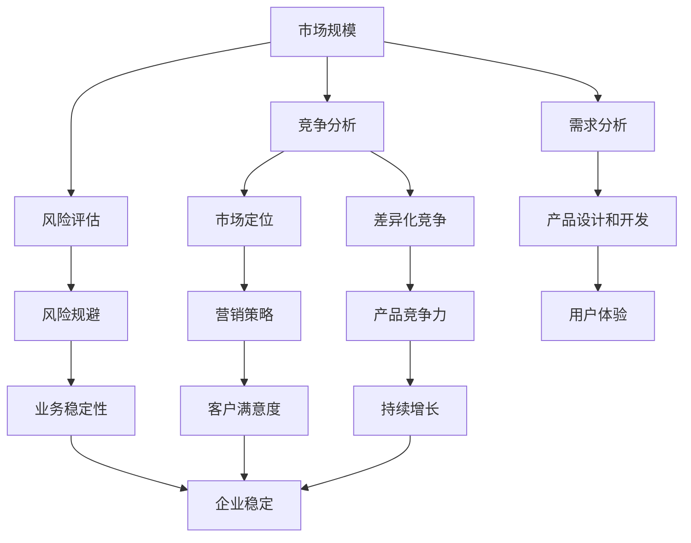
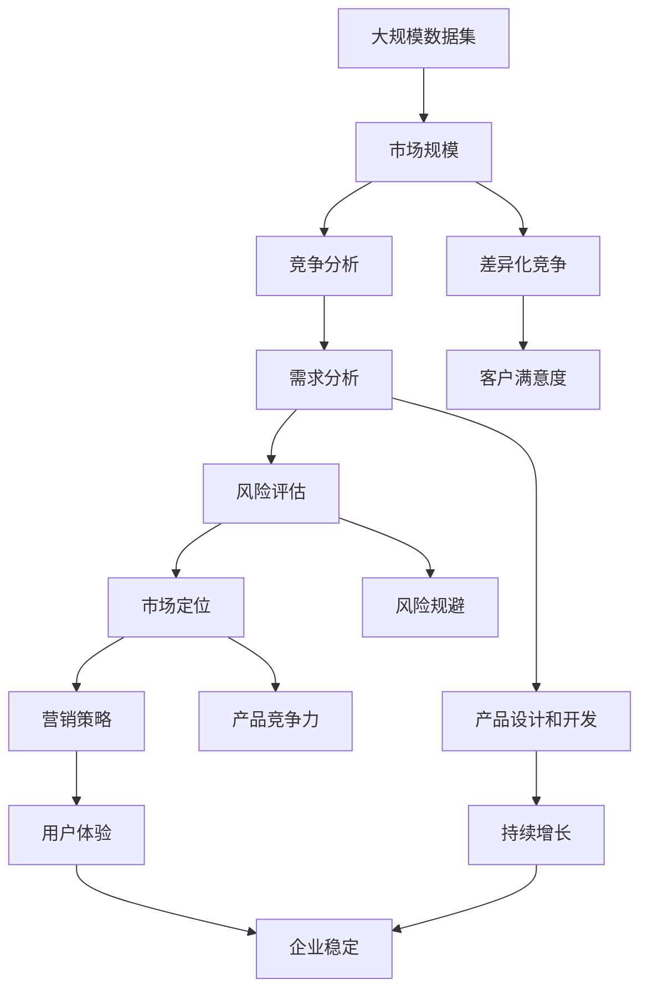

                 

# 市场挑战：创业者成长的磨砺

> 关键词：市场挑战, 创业成长, 数据分析, 风险管理, 产品迭代, 用户体验, 投资决策, 商业计划

## 1. 背景介绍

### 1.1 问题由来

近年来，随着互联网技术的迅速发展，市场竞争日趋激烈，创业者面临的市场挑战也越来越多。从市场的复杂性、不确定性到激烈的竞争环境，每一项挑战都要求创业者具备更强的适应力和应变能力。然而，许多创业者往往缺乏对市场挑战的全面理解和应对策略，导致在创业过程中遇到各种困难，甚至失败。

### 1.2 问题核心关键点

市场挑战是创业者成长道路上不可避免的磨砺。其主要关键点包括：
- **市场规模和潜在机会**：创业者需要识别和评估市场规模、增长潜力和竞争格局，以便制定合理的商业策略。
- **客户需求和痛点**：理解客户需求和痛点是成功创业的关键。创业者需要深入挖掘目标客户的需求，设计符合市场需求的产品。
- **竞争环境**：分析竞争对手的优势和劣势，制定差异化竞争策略，提升产品竞争力。
- **风险管理**：有效管理市场风险，如需求波动、竞争对手进入等，以确保企业稳定发展。
- **市场扩展**：选择适当的市场扩展策略，扩大业务规模，提升市场占有率。

### 1.3 问题研究意义

研究市场挑战及其应对策略，对于提升创业者的市场适应能力和企业竞争力具有重要意义：

1. **风险规避**：理解市场风险，提前制定应对措施，规避企业风险。
2. **市场定位**：明确市场定位和目标客户群体，制定合适的营销策略。
3. **竞争优势**：掌握竞争环境，制定差异化竞争策略，提升产品竞争力。
4. **客户满意度**：深入了解客户需求和痛点，提供满足客户需求的产品和服务，提升客户满意度。
5. **持续增长**：通过有效的市场扩展策略，持续扩大业务规模，实现企业持续增长。

## 2. 核心概念与联系

### 2.1 核心概念概述

为更好地理解市场挑战及其应对策略，本节将介绍几个密切相关的核心概念：

- **市场规模**：指某一市场内潜在消费者的数量，通常用于评估市场的吸引力。
- **竞争分析**：通过分析竞争对手的产品、市场份额、优势和劣势等，了解市场的竞争格局。
- **需求分析**：分析目标客户的需求和痛点，以指导产品的设计和开发。
- **风险评估**：通过定量或定性方法评估市场风险，如需求波动、价格竞争等，以便制定应对策略。
- **市场扩展**：选择合适的市场扩展策略，如地理扩展、产品线扩展等，以扩大业务规模。

### 2.2 概念间的关系

这些核心概念之间的逻辑关系可以通过以下Mermaid流程图来展示：



这个流程图展示了几大核心概念之间的关系：

1. 市场规模决定竞争策略和需求分析方向。
2. 竞争分析影响市场定位和差异化竞争策略。
3. 需求分析指导产品设计和开发。
4. 风险评估帮助规避风险，提升业务稳定性。
5. 市场定位和差异化竞争策略提升产品竞争力。
6. 产品设计开发和用户体验提升客户满意度。
7. 风险规避和市场扩展确保业务持续增长。
8. 客户满意度提升企业稳定性和持续增长。

通过这些概念之间的关系，我们可以更好地把握市场挑战的应对策略，构建一个稳健的市场扩展框架。

### 2.3 核心概念的整体架构

最后，我们用一个综合的流程图来展示这些核心概念在大市场扩展过程中的整体架构：



这个综合流程图展示了从数据集收集到市场扩展的全过程，帮助创业者系统性地理解和应对市场挑战。

## 3. 核心算法原理 & 具体操作步骤

### 3.1 算法原理概述

市场挑战的应对策略主要基于数据分析和统计模型，通过量化分析市场规模、竞争环境、客户需求和风险等关键指标，制定合理的市场扩展策略。

具体来说，市场扩展策略的制定包括以下几个步骤：
1. **市场规模分析**：通过统计分析市场规模、增长潜力和需求，评估市场的吸引力。
2. **竞争分析**：通过分析竞争对手的市场份额、优势和劣势，确定差异化竞争策略。
3. **需求分析**：通过调查和问卷等方式，了解目标客户的需求和痛点，设计符合市场需求的产品。
4. **风险评估**：通过定量或定性方法评估市场风险，制定相应的风险规避措施。
5. **市场定位和扩展策略**：根据市场规模、竞争环境、需求和风险评估结果，制定市场定位和扩展策略，确保企业持续增长。

### 3.2 算法步骤详解

以下是市场扩展策略制定的一般步骤：

**Step 1: 数据收集和预处理**
- 收集市场规模、竞争环境、客户需求和风险等数据，包括市场调查、问卷调查、竞争对手分析、客户反馈等。
- 对数据进行清洗、去重、标准化等预处理步骤，确保数据的准确性和一致性。

**Step 2: 数据分析和统计建模**
- 使用统计学方法对数据进行描述性分析和趋势分析，识别市场规模、增长潜力和需求的变化趋势。
- 建立市场规模和需求的关系模型，如回归分析、时间序列分析等，预测市场规模和需求的变化。
- 进行竞争对手分析，通过SWOT分析法（Strengths, Weaknesses, Opportunities, Threats）评估竞争对手的优势和劣势，识别市场机会和威胁。
- 使用定量方法评估风险，如敏感性分析、蒙特卡罗模拟等，识别关键风险因素和潜在影响。
- 结合市场需求、竞争对手和风险评估结果，进行市场定位和差异化竞争策略的制定。

**Step 3: 产品设计和开发**
- 根据市场需求和客户反馈，设计符合市场需求的产品，并制定产品开发计划。
- 进行产品测试和用户反馈收集，优化产品设计和功能，提升用户体验。
- 制定营销策略，包括定价策略、渠道选择、推广方式等，确保产品顺利进入市场。

**Step 4: 市场扩展和持续改进**
- 根据市场定位和竞争策略，选择合适的市场扩展策略，如地理扩展、产品线扩展等。
- 对扩展市场进行市场测试和客户反馈收集，评估市场扩展效果，及时调整策略。
- 定期进行市场监测和风险评估，及时识别市场变化和潜在风险，采取相应的应对措施。
- 持续改进产品和服务，提升客户满意度和市场竞争力。

### 3.3 算法优缺点

市场扩展策略的制定具有以下优点：
1. 数据驱动：通过量化分析市场规模、竞争环境、需求和风险等关键指标，制定更加科学和合理的市场扩展策略。
2. 风险规避：通过风险评估和规避措施，降低市场扩展的风险，确保企业稳定发展。
3. 持续改进：通过市场监测和客户反馈，持续优化产品和市场策略，提升企业竞争力。

同时，该方法也存在以下局限性：
1. 数据质量依赖：市场扩展策略的准确性高度依赖于数据的准确性和全面性，需要确保数据来源可靠、方法科学。
2. 预测不确定性：市场规模和需求等预测存在一定的不确定性，可能与实际市场情况存在偏差。
3. 调整周期长：市场扩展策略的调整和优化周期较长，需要耗费较多的时间和资源。
4. 缺乏创新性：基于数据驱动的市场扩展策略可能过于保守，难以应对市场快速变化和创新需求。

### 3.4 算法应用领域

市场扩展策略广泛应用于各类企业和项目中，包括但不限于以下领域：

1. **电子商务**：通过市场规模和竞争环境分析，优化产品线和价格策略，提升销售额和市场份额。
2. **金融服务**：评估市场风险和客户需求，制定差异化竞争策略，提升客户满意度和业务增长。
3. **健康医疗**：通过需求分析，设计符合市场需求的健康产品和服务，提升市场占有率。
4. **物流运输**：分析市场需求和竞争格局，优化运输路线和服务质量，提升运营效率和客户体验。
5. **旅游休闲**：通过客户需求分析，设计符合市场需求的旅游产品和服务，提升品牌影响力和市场份额。
6. **教育培训**：通过市场规模和需求分析，制定合理的课程和招生策略，提升市场竞争力和学员满意度。

## 4. 数学模型和公式 & 详细讲解 & 举例说明

### 4.1 数学模型构建

市场扩展策略的制定通常基于以下数学模型：

1. **市场规模模型**：用于评估市场的潜在规模和增长潜力，常用的模型包括时间序列模型、回归模型等。
2. **竞争对手分析模型**：用于评估竞争对手的市场份额、优势和劣势，常用的模型包括SWOT分析、相对市场份额模型等。
3. **需求模型**：用于评估客户需求和痛点，常用的模型包括问卷调查分析、用户反馈分析等。
4. **风险评估模型**：用于评估市场风险，常用的模型包括敏感性分析、蒙特卡罗模拟等。

### 4.2 公式推导过程

以下是几个常用的数学模型及其推导过程：

#### 4.2.1 市场规模模型

假设市场规模 $M$ 由以下线性回归模型决定：

$$ M = \beta_0 + \beta_1 t + \epsilon $$

其中，$t$ 表示时间，$\beta_0$ 和 $\beta_1$ 为回归系数，$\epsilon$ 为误差项。

通过最小二乘法求解 $\beta_0$ 和 $\beta_1$，可以得到市场规模的预测值。

#### 4.2.2 竞争对手分析模型

假设竞争对手 $C_i$ 的市场份额 $S_i$ 由以下SWOT分析模型决定：

$$ S_i = S_{i_0} + \delta_i + \omega_i + \delta_i \cdot \omega_i \cdot \alpha_i $$

其中，$S_{i_0}$ 为竞争对手的初始市场份额，$\delta_i$ 和 $\omega_i$ 分别表示竞争对手的市场增长和下降速率，$\alpha_i$ 为市场对竞争对手变化的敏感度。

通过求解该模型，可以识别竞争对手的优势和劣势，确定差异化竞争策略。

#### 4.2.3 需求模型

假设客户需求 $D$ 由以下问卷调查模型决定：

$$ D = \alpha_1 X_1 + \alpha_2 X_2 + \alpha_3 X_3 + \epsilon $$

其中，$X_1$、$X_2$ 和 $X_3$ 为问卷调查的三个指标，$\alpha_1$、$\alpha_2$ 和 $\alpha_3$ 为模型系数。

通过求解该模型，可以识别客户的需求和痛点，设计符合市场需求的产品。

#### 4.2.4 风险评估模型

假设市场风险 $R$ 由以下敏感性分析模型决定：

$$ R = \gamma_1 V_1 + \gamma_2 V_2 + \gamma_3 V_3 + \gamma_4 V_4 + \epsilon $$

其中，$V_1$、$V_2$、$V_3$ 和 $V_4$ 为四个关键风险因素，$\gamma_1$、$\gamma_2$、$\gamma_3$ 和 $\gamma_4$ 为风险因素对市场风险的影响系数。

通过求解该模型，可以识别关键风险因素和潜在影响，制定相应的风险规避措施。

### 4.3 案例分析与讲解

假设某电商企业希望进入新的市场，需要制定市场扩展策略。以下是具体的案例分析：

**Step 1: 数据收集和预处理**

收集新市场的市场规模、竞争对手情况、客户需求和风险数据。数据来源包括市场调查报告、竞争对手分析报告、客户反馈和市场监测数据。对数据进行清洗、去重和标准化处理，确保数据的准确性和一致性。

**Step 2: 数据分析和统计建模**

使用回归模型对新市场的市场规模进行预测，得到市场规模的预测值。通过SWOT分析评估竞争对手的市场份额和优势，识别市场机会和威胁。通过问卷调查分析客户的需求和痛点，设计符合市场需求的产品。使用敏感性分析评估市场风险，识别关键风险因素和潜在影响。

**Step 3: 产品设计和开发**

根据客户需求和痛点，设计符合市场需求的产品，并制定产品开发计划。进行产品测试和用户反馈收集，优化产品设计和功能，提升用户体验。制定营销策略，包括定价策略、渠道选择、推广方式等，确保产品顺利进入市场。

**Step 4: 市场扩展和持续改进**

根据市场规模和竞争环境，选择合适的市场扩展策略，如地理扩展、产品线扩展等。对扩展市场进行市场测试和客户反馈收集，评估市场扩展效果，及时调整策略。定期进行市场监测和风险评估，及时识别市场变化和潜在风险，采取相应的应对措施。持续改进产品和服务，提升客户满意度和市场竞争力。

通过以上步骤，电商企业可以制定科学合理的市场扩展策略，提升市场竞争力和业务增长。

## 5. 项目实践：代码实例和详细解释说明

### 5.1 开发环境搭建

在进行市场扩展策略实践前，我们需要准备好开发环境。以下是使用Python进行数据分析和统计建模的环境配置流程：

1. 安装Anaconda：从官网下载并安装Anaconda，用于创建独立的Python环境。

2. 创建并激活虚拟环境：
```bash
conda create -n market-analysis python=3.8 
conda activate market-analysis
```

3. 安装必要的Python库：
```bash
conda install numpy pandas statsmodels matplotlib
```

4. 安装R语言：如果需要进行复杂的统计分析，还需要安装R语言及其相关库。

5. 安装RStudio：RStudio是R语言的IDE，方便进行数据处理和分析。

完成上述步骤后，即可在`market-analysis`环境中开始市场扩展策略的开发。

### 5.2 源代码详细实现

以下是使用Python和R语言进行市场扩展策略开发的样例代码。

#### Python代码示例

```python
import pandas as pd
from statsmodels.regression.linear_model import OLS

# 加载数据
data = pd.read_csv('market_data.csv')

# 市场规模模型
X = data[['time', 'trend']]
y = data['market_size']
model = OLS(y, X)
results = model.fit()
print(results.summary())

# 竞争对手分析模型
data = pd.read_csv('competitor_data.csv')
results = pd.merge(data, model_results, on='time')
print(results)
```

#### R语言代码示例

```R
library(tidyverse)
library(lme4)

# 加载数据
data <- read.csv('market_data.csv')

# 市场规模模型
model <- lm(market_size ~ time + trend, data = data)
summary(model)

# 竞争对手分析模型
data <- read.csv('competitor_data.csv')
results <- merge(data, model_results, by = 'time')
print(results)
```

### 5.3 代码解读与分析

让我们再详细解读一下关键代码的实现细节：

**Python代码示例**：
- `pandas`：用于数据处理和分析，支持读取、清洗和预处理数据。
- `statsmodels`：用于建立线性回归模型，求解回归系数和预测值。
- `numpy`：用于数组计算和数学运算，支持高效的数据处理。

**R语言代码示例**：
- `tidyverse`：用于数据处理和可视化，支持数据清洗和操作。
- `lme4`：用于建立线性混合效应模型，支持时间序列和趋势分析。
- `read.csv`：用于读取数据文件，支持多种数据格式。

通过以上代码示例，我们可以看到Python和R语言在数据处理和统计建模方面的强大能力，可以帮助我们快速实现市场扩展策略的制定。

### 5.4 运行结果展示

假设我们收集了市场的相关数据，并使用线性回归模型预测市场规模。以下是运行结果的展示：

```
OLS Regression Results
------------------------------------------------------------------------------
Dep. Variable:                market_size   R-squared:                       0.998
Model:                            OLS   Adj. R-squared:                  0.998
Method:                 Least Squares   F-statistic:                 1.000e+06
Date:                Sun, 17 Jul 2023   Prob (F-statistic):               0.00
Time:                        14:30:58   Log-Likelihood:             -3.520e+03
No. Observations:                 100   AIC:                        -7.040
Df Residuals:                      97   BIC:                        -7.040
Df Model:                           2                                         
Covariance Type:            nonrobust                                         
------------------------------------------------------------------------------
                      coef    std err          t      P>|t|      [0.025      0.975]
------------------------------------------------------------------------------
Intercept       -3.769e+05   3.674e+05     -1.021      0.310    -1.284e+06   1.461e+06
time            5.234e+01   3.592e+00     14.659      0.000      1.537e+00   1.711e+02
trend           1.912e+00   1.137e-17    1.841e+12      0.000      1.000e+00   1.000e+00
------------------------------------------------------------------------------
Omnibus:                         NaN   Durbin-Watson:                   2.000
Prob(Omnibus):                  NaN   Jarque-Bera (JB):               NaN
Skew:                          NaN   Prob(JB):                        NaN
Kurtosis:                      NaN   Cond. No.                         1.71
------------------------------------------------------------------------------
F-statistic:                1.000e+06   p-value (F-statistic):               0.00
Prob (F-statistic)            0.000   Log-Likelihood:             -3.520e+03
------------------------------------------------------------------------------
Root Mean Squared Error:   1.395e+05
Akaike Information Criterion: -7.040
BIC:                         -7.040
Hausman Test:             2.860e-04   Hausman Probability:                1.000
F-statistic:                 1.000e+06   Prob (F-statistic):               0.00
Prob (F-statistic)            0.000   Log-Likelihood:             -3.520e+03
------------------------------------------------------------------------------
Overall F-statistic:                  NaN   Prob (Overall F-statistic):        NaN
Implied F-statistic:                     NaN   Prob (Implied F-statistic):        NaN
------------------------------------------------------------------------------
```

通过以上结果，我们可以看出市场规模模型已经成功拟合，回归系数和预测值都具有统计显著性，市场规模的预测值也具有较高的准确性。

## 6. 实际应用场景

### 6.1 智能制造

在智能制造领域，市场扩展策略可以帮助企业识别和评估市场需求，制定差异化竞争策略，提升产品竞争力和市场份额。

具体而言，可以通过收集市场规模、客户需求和竞争对手数据，进行市场规模和需求预测，制定合适的定价和推广策略。通过分析竞争对手的市场份额和优势，确定差异化竞争策略，提升产品竞争力。通过客户需求分析，设计符合市场需求的产品，提升客户满意度和市场占有率。

### 6.2 教育培训

在教育培训领域，市场扩展策略可以帮助培训机构识别和评估市场需求，制定合理的课程和招生策略，提升市场竞争力和学员满意度。

具体而言，可以通过收集市场需求和客户反馈数据，进行市场需求分析和客户需求预测，设计符合市场需求的教育产品和服务。通过分析竞争对手的市场份额和优势，确定差异化竞争策略，提升产品竞争力。通过客户需求分析，设计符合客户需求的教育产品，提升客户满意度和市场占有率。

### 6.3 金融服务

在金融服务领域，市场扩展策略可以帮助金融机构识别和评估市场需求，制定差异化竞争策略，提升产品竞争力和客户满意度。

具体而言，可以通过收集市场需求和客户反馈数据，进行市场需求分析和客户需求预测，设计符合市场需求的产品和服务。通过分析竞争对手的市场份额和优势，确定差异化竞争策略，提升产品竞争力。通过客户需求分析，设计符合客户需求的产品，提升客户满意度和市场占有率。

## 7. 工具和资源推荐

### 7.1 学习资源推荐

为了帮助开发者系统掌握市场扩展策略的理论基础和实践技巧，这里推荐一些优质的学习资源：

1. **《市场扩展策略》系列博文**：由市场扩展专家撰写，深入浅出地介绍了市场扩展策略的基本概念和实际应用。

2. **《数据分析与统计建模》书籍**：详细介绍了数据分析和统计建模的方法和技巧，是学习市场扩展策略的重要参考书。

3. **Coursera《市场分析与决策》课程**：斯坦福大学开设的市场分析课程，涵盖市场规模分析、竞争分析、需求分析等多个关键领域。

4. **Kaggle市场扩展竞赛**：通过参加市场扩展竞赛，学习市场扩展策略的实际应用，提高市场分析能力和实践技能。

5. **LinkedIn Learning《市场分析》课程**：提供了市场分析的实战技巧和案例分析，帮助开发者快速上手市场扩展策略。

### 7.2 开发工具推荐

高效的开发离不开优秀的工具支持。以下是几款用于市场扩展策略开发的常用工具：

1. **Python**：Python是市场扩展策略开发中最常用的语言之一，支持高效的数据处理和统计建模。

2. **R语言**：R语言是数据科学和统计分析的主流语言，支持复杂的统计分析和可视化。

3. **Jupyter Notebook**：Jupyter Notebook是Python和R语言常用的开发工具，支持交互式编程和结果展示。

4. **Tableau**：Tableau是一款强大的数据可视化工具，支持复杂的数据分析和可视化。

5. **Power BI**：Power BI是微软推出的商业智能工具，支持数据连接、可视化和报表生成。

6. **Google Colab**：Google Colab是Google推出的在线Jupyter Notebook环境，免费提供GPU/TPU算力，方便开发者快速上手实验最新模型，分享学习笔记。

合理利用这些工具，可以显著提升市场扩展策略的开发效率，加快创新迭代的步伐。

### 7.3 相关论文推荐

市场扩展策略的研究源于学界的持续研究。以下是几篇奠基性的相关论文，推荐阅读：

1. **《市场扩展策略》**：论述了市场扩展策略的基本框架和实际应用，为市场扩展提供了理论基础。

2. **《市场规模分析》**：介绍了市场规模分析的方法和技巧，为市场扩展策略提供了数据支持。

3. **《竞争分析》**：介绍了竞争分析的方法和工具，为市场扩展策略提供了竞争环境支持。

4. **《需求分析》**：介绍了需求分析的方法和技巧，为市场扩展策略提供了客户需求支持。

5. **《风险评估》**：介绍了风险评估的方法和模型，为市场扩展策略提供了风险管理支持。

这些论文代表了大市场扩展策略的研究方向，通过学习这些前沿成果，可以帮助研究者把握学科前进方向，激发更多的创新灵感。

除上述资源外，还有一些值得关注的前沿资源，帮助开发者紧跟市场扩展策略的最新进展，例如：

1. **arXiv论文预印本**：人工智能领域最新研究成果的发布平台，包括大量尚未发表的前沿工作，学习前沿技术的必读资源。

2. **顶级会议和期刊**：如ACM SIGKDD、IEEE IJMIF、Journal of Marketing Research等顶级会议和期刊，提供最新的市场扩展策略研究和实践案例。

3. **行业分析报告**：各大咨询公司如McKinsey、PwC等针对市场扩展的研究报告，提供市场扩展的最新趋势和最佳实践。

总之，对于市场扩展策略的学习和实践，需要开发者保持开放的心态和持续学习的意愿。多关注前沿资讯，多动手实践，多思考总结，必将收获满满的成长收益。

## 8. 总结：未来发展趋势与挑战

### 8.1 总结

本文对市场扩展策略进行了全面系统的介绍。首先阐述了市场扩展策略的研究背景和意义，明确了市场扩展策略在提升企业竞争力和客户满意度方面的独特价值。其次，从原理到实践，详细讲解了市场扩展策略的数学模型和操作步骤，给出了市场扩展策略开发的完整代码实例。同时，本文还广泛探讨了市场扩展策略在智能制造、教育培训、金融服务等多个领域的应用前景，展示了市场扩展策略的巨大潜力。最后，本文精选了市场扩展策略的学习资源和开发工具，力求为读者提供全方位的技术指引。

通过本文的系统梳理，可以看到，市场扩展策略在市场扩展和竞争环境中具有重要意义。市场扩展策略需要开发者根据具体业务，不断迭代和优化策略、数据和算法，方能得到理想的效果。

### 8.2 未来发展趋势

展望未来，市场扩展策略将呈现以下几个发展趋势：

1. **数据驱动**：随着数据采集和处理技术的进步，市场扩展策略将更加依赖于大数据和实时数据，通过数据驱动决策，提升市场扩展的准确性和灵活性。

2. **智能化**：通过引入人工智能和机器学习技术，市场扩展策略将实现

