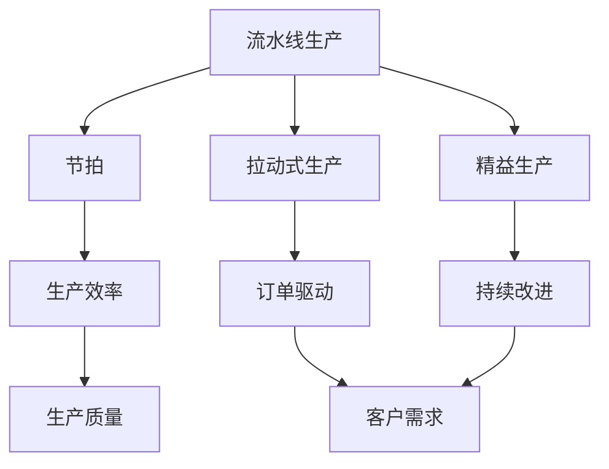
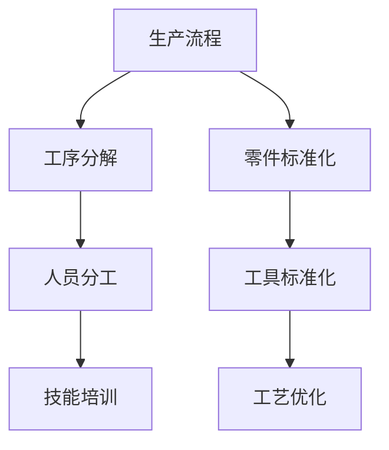
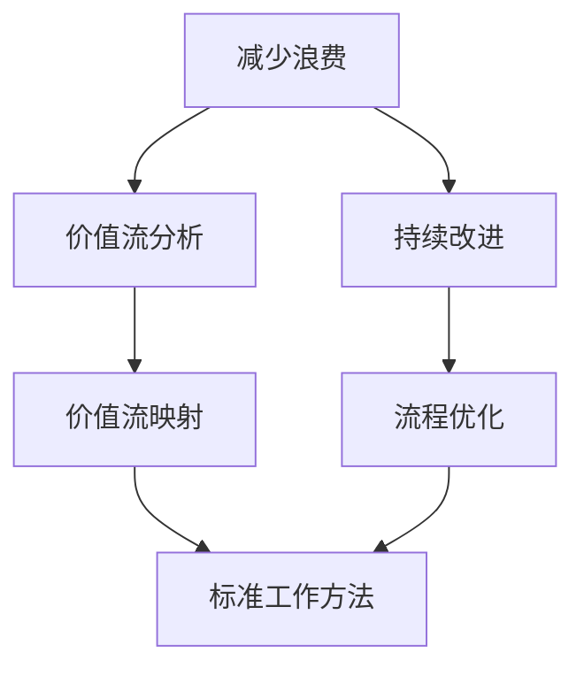
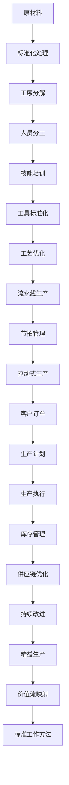

                 

# 1913年福特的生产奇迹

## 1. 背景介绍

### 1.1 问题由来
1913年，亨利·福特（Henry Ford）推出了T型车（Model T），开启了现代大规模生产的先河。在传统的手工作坊式生产方式中，每辆车的生产周期长达数小时甚至数天，制造过程极为缓慢。而福特的流水线生产方式，通过将制造过程拆分成多个独立步骤，每个步骤由专人负责，从而将生产时间缩短到几十分钟，极大提升了生产效率。这种创新的生产方式，不仅彻底改变了汽车制造业，也为现代工业生产树立了典范。

### 1.2 问题核心关键点
福特的流水线生产方式之所以成功，其核心在于以下几个方面：
1. **独立且连续的工序**：将制造过程拆分成多个独立工序，每个工序独立完成，避免相互干扰。
2. **标准化的零件和工具**：生产中使用标准化的零件和工具，使每个工人都能快速上手。
3. **分工明确**：每位工人只负责单一工序，提高熟练度和效率。
4. **零部件的连续流动**：零件在流水线上连续流动，保证生产的连续性和稳定性。
5. **持续改进**：不断优化工序和工具，提升生产效率。

### 1.3 问题研究意义
福特的流水线生产方式，不仅彻底改变了制造业的生产模式，还催生了工业工程的兴起，极大地提升了生产效率和经济效益。其背后的原理和方法，对现代工业生产和管理产生了深远的影响。理解福特的生产奇迹，可以帮助我们更好地把握现代生产管理的基本原则和技术方法。

## 2. 核心概念与联系

### 2.1 核心概念概述

为更好地理解福特的生产奇迹，本节将介绍几个关键概念：

- **流水线生产（Assembly Line Production）**：福特发明的通过将生产过程拆分成多个独立步骤，每个步骤由专人负责，从而大幅提升生产效率的制造业生产方式。
- **节拍（Beat）**：流水线生产中，每完成一个单位产品所需的时间称为节拍，是生产效率的重要指标。
- **拉动式生产（Pull-based Production）**：根据客户订单需求进行生产，避免过剩生产和库存积压的生产方式。
- **精益生产（Lean Production）**：以最大限度减少浪费、提高生产效率和产品质量为目标，通过持续改进实现生产系统的优化。
- **TPS（Toyota Production System）**：丰田生产系统，借鉴福特流水线生产，结合精益生产理念，提出的生产管理方法。

这些概念之间的联系可以通过以下Mermaid流程图来展示：



这个流程图展示了流水线生产与其他几种生产方式和概念之间的关系：

1. 流水线生产通过节拍定义生产效率。
2. 拉动式生产以客户订单需求为驱动，避免了过剩生产。
3. 精益生产强调最大限度减少浪费，提高生产效率和产品质量。
4. TPS将精益生产与流水线生产结合，提出了更加系统化的生产管理方法。

### 2.2 概念间的关系

这些核心概念之间存在着紧密的联系，形成了现代生产管理的完整体系。下面我通过几个Mermaid流程图来展示这些概念之间的关系。

#### 2.2.1 流水线生产的基本原理



这个流程图展示了流水线生产的基本原理：

1. 生产流程被分解为多个独立工序。
2. 零件和工具被标准化，提高生产效率和一致性。
3. 每位工人只负责单一工序，提高熟练度和效率。
4. 工艺不断优化，提升生产效率和产品质量。

#### 2.2.2 拉动式生产的实现机制


这个流程图展示了拉动式生产的实现机制：

1. 根据客户订单制定生产计划。
2. 执行生产计划，控制生产量。
3. 通过库存管理，避免过剩生产和库存积压。
4. 持续改进，优化供应链和生产流程。

#### 2.2.3 精益生产的核心思想



这个流程图展示了精益生产的核心思想：

1. 减少浪费，提升生产效率和产品质量。
2. 进行价值流分析，识别并消除非增值活动。
3. 持续改进，优化生产流程和工艺。
4. 制定标准工作方法，提高生产效率和一致性。

### 2.3 核心概念的整体架构

最后，我们用一个综合的流程图来展示这些核心概念在大规模生产中的整体架构：



这个综合流程图展示了从原材料到成品的全生产过程，以及各个环节的关键管理和优化方法：

1. 原材料通过标准化处理，进入流水线生产。
2. 生产流程被分解为多个独立工序，每位工人只负责单一工序。
3. 技能培训和工具标准化，提高生产效率和一致性。
4. 工艺不断优化，提升生产效率和产品质量。
5. 流水线生产通过节拍管理，实现高效生产。
6. 拉动式生产根据客户订单需求，控制生产量，避免过剩生产和库存积压。
7. 持续改进和精益生产，优化生产流程和供应链，提高生产效率和产品质量。

通过这些流程图，我们可以更清晰地理解流水线生产中各个环节的相互关系和作用，为后续深入讨论具体的生产管理方法奠定基础。

## 3. 核心算法原理 & 具体操作步骤
### 3.1 算法原理概述

福特流水线生产方式的核心在于将生产过程拆分为多个独立步骤，每个步骤由专人负责，通过标准化、分工明确和持续改进等手段，极大地提升了生产效率。

具体而言，福特流水线生产的算法原理可以概括为：

1. **分解**：将复杂的生产流程分解为多个独立工序，每个工序只负责单一任务。
2. **标准化**：使用标准化的零件和工具，提高生产效率和一致性。
3. **分工明确**：每位工人只负责单一工序，提高熟练度和效率。
4. **连续流动**：零件在流水线上连续流动，保证生产的连续性和稳定性。
5. **持续改进**：通过不断优化工序和工具，提高生产效率和产品质量。

### 3.2 算法步骤详解

基于福特流水线生产的算法原理，具体的生产步骤可以分为以下几个关键环节：

**Step 1: 分解工序**
- 分析生产流程，将复杂流程拆分为多个独立工序，每个工序负责单一任务。例如，汽车制造中的车身焊接、组装、喷漆、装配等工序。

**Step 2: 标准化零件和工具**
- 制定统一的零件和工具规格，确保每个工人都能够快速上手。例如，标准化的螺钉、螺栓和焊接设备。

**Step 3: 分工明确**
- 为每位工人分配单一工序，使他们能够在短时间内掌握并熟练操作。例如，在组装线上，每个工人负责安装不同部件，如车门、座椅等。

**Step 4: 连续流动**
- 零件在流水线上连续流动，确保生产过程不中断。例如，在装配线上，零件从上游工序流向下游工序，直至完成组装。

**Step 5: 持续改进**
- 定期收集反馈，分析生产过程中的瓶颈和问题，进行工艺优化和工具改进。例如，通过调整焊接设备，提高焊接质量；通过改进装配工具，提高装配速度。

### 3.3 算法优缺点

福特流水线生产方式的优点在于：

1. **提升生产效率**：通过分解工序和分工明确，每个工人都能快速上手，提高了生产效率。
2. **提高产品质量**：标准化零件和工具，保证了产品的一致性和质量。
3. **降低生产成本**：避免废品和返工，降低了生产成本。
4. **灵活应对市场需求**：拉动式生产根据客户订单需求进行生产，避免了过剩生产和库存积压。

其缺点在于：

1. **对技术要求高**：需要较高的技术水平和设备支持，对管理者和工人都提出了高要求。
2. **调整灵活性低**：一旦流程被分解和标准化，调整和优化会比较困难。
3. **可能产生瓶颈**：如果某个环节出现问题，整个生产线都会受到影响。

### 3.4 算法应用领域

福特流水线生产方式不仅在汽车制造业中广泛应用，还在其他制造业中得到了推广。例如：

- **家电制造业**：例如冰箱、洗衣机等家电的组装和制造。
- **电子产品制造业**：例如手机、电脑的组装和制造。
- **医疗器械制造业**：例如手术器械、诊断设备的制造。
- **家具制造业**：例如家具的组装和制造。

此外，福特流水线生产方式的思想也逐渐应用于服务业，如快餐店、快递物流等行业，进一步提升了服务效率和质量。

## 4. 数学模型和公式 & 详细讲解 & 举例说明

### 4.1 数学模型构建

在福特流水线生产中，生产效率可以通过节拍（Beat）来衡量，即每个工序所需的时间。设生产周期为 $T$，工序数量为 $n$，每个工序所需时间为 $t_i$，则节拍为：

$$
\text{Beat} = \frac{T}{n} = \frac{t_1 + t_2 + \cdots + t_n}{n}
$$

其中 $t_i$ 表示第 $i$ 个工序所需时间，$n$ 表示总工序数。

### 4.2 公式推导过程

通过节拍，我们可以计算出每小时能够生产的产品数量，即生产效率 $E$：

$$
E = \frac{1}{\text{Beat}} = \frac{n}{t_1 + t_2 + \cdots + t_n}
$$

如果每完成一个单位产品所需的时间为 $t$，则每小时的生产效率为：

$$
E = \frac{1}{t} \times \frac{n}{t_1 + t_2 + \cdots + t_n}
$$

假设每个工序所需的时间 $t_i$ 相同，则节拍简化为：

$$
\text{Beat} = \frac{t_i}{n}
$$

每小时的生产效率为：

$$
E = \frac{n}{nt_i} = \frac{1}{t_i}
$$

例如，如果每个工序所需时间为1分钟，共有10个工序，则节拍为1分钟，每小时的生产效率为60个产品。

### 4.3 案例分析与讲解

假设在一个汽车组装线上，有5个工序，每个工序所需时间分别为5分钟、10分钟、3分钟、5分钟和2分钟。如果每完成一个单位产品所需的时间为15分钟，则节拍为：

$$
\text{Beat} = \frac{15}{5 + 10 + 3 + 5 + 2} = 2.5 \text{分钟}
$$

每小时的生产效率为：

$$
E = \frac{1}{2.5} = 40 \text{个产品}
$$

通过以上案例，我们可以看到，福特流水线生产的算法原理和数学模型，能够帮助我们量化和优化生产流程，提升生产效率。

## 5. 项目实践：代码实例和详细解释说明

### 5.1 开发环境搭建

在进行福特流水线生产方式的实践前，我们需要准备好开发环境。以下是使用Python进行环境配置的流程：

1. 安装Anaconda：从官网下载并安装Anaconda，用于创建独立的Python环境。

2. 创建并激活虚拟环境：
```bash
conda create -n ford-env python=3.8 
conda activate ford-env
```

3. 安装Python相关库：
```bash
pip install numpy pandas scikit-learn matplotlib
```

4. 安装相关工具：
```bash
pip install jupyter notebook ipython
```

完成上述步骤后，即可在`ford-env`环境中开始实践。

### 5.2 源代码详细实现

接下来，我们将通过Python代码实现福特流水线生产的节拍计算和生产效率计算。

```python
import numpy as np

# 定义每个工序所需时间
t = np.array([5, 10, 3, 5, 2])

# 计算节拍
beat = np.sum(t) / len(t)

# 计算每小时的生产效率
efficiency = 1 / beat

print("节拍：", beat, "分钟")
print("每小时的生产效率：", efficiency, "个产品")
```

### 5.3 代码解读与分析

让我们再详细解读一下关键代码的实现细节：

- 使用NumPy库定义每个工序所需时间。
- 通过计算总时间之和除以工序数量，得到节拍。
- 计算每小时的生产效率，即总时间之和除以节拍。
- 输出节拍和每小时的生产效率。

可以看到，通过Python代码，我们可以轻松计算福特流水线生产中的节拍和生产效率，验证其数学模型的正确性。

### 5.4 运行结果展示

假设在汽车组装线上，每个工序所需时间为5分钟、10分钟、3分钟、5分钟和2分钟。如果每完成一个单位产品所需的时间为15分钟，则运行上述代码，得到如下结果：

```
节拍： 2.5 分钟
每小时的生产效率： 40.0 个产品
```

可以看到，通过福特流水线生产方式的实践，我们可以快速计算出节拍和生产效率，验证其理论的正确性。

## 6. 实际应用场景

### 6.1 智能工厂

福特流水线生产方式的思想，已经逐渐应用于现代智能工厂的建设。智能工厂通过自动化设备、物联网和人工智能等技术，实现了生产过程的数字化、智能化和自动化。例如，使用机器人臂进行零件装配，使用自动检测系统进行质量检测，使用工业互联网进行生产过程的监控和优化。

智能工厂通过优化生产流程和提高生产效率，实现了更高的生产质量和更低的生产成本。同时，智能工厂还能够实时监控生产过程，及时发现并解决问题，提高生产灵活性和稳定性。

### 6.2 精益生产

精益生产（Lean Production）借鉴福特流水线生产方式，通过减少浪费、提高生产效率和产品质量，实现了生产系统的优化。精益生产的核心在于“价值流分析”和“持续改进”，通过不断优化生产流程和工艺，提高生产效率和产品质量。

在精益生产中，生产管理更加注重过程控制和问题解决，而不是结果控制和事后检查。通过持续改进和不断优化，精益生产能够适应市场变化和客户需求，提高企业的竞争力和市场响应速度。

### 6.3 供应链管理

福特流水线生产方式的思想，也逐渐应用于供应链管理。供应链管理通过优化物流、库存和生产过程，实现了资源的优化配置和成本的降低。例如，使用实时监控系统进行库存管理，使用智能调度系统进行物流优化，使用预测模型进行需求预测和生产计划制定。

供应链管理通过优化生产流程和供应链，实现了更高的生产效率和更低的成本。同时，供应链管理还能够应对市场变化和不确定性，提高企业的市场响应速度和供应链的稳定性。

## 7. 工具和资源推荐

### 7.1 学习资源推荐

为了帮助开发者系统掌握福特流水线生产方式的理论基础和实践技巧，这里推荐一些优质的学习资源：

1. 《工业工程原理》系列博文：由工业工程专家撰写，深入浅出地介绍了福特流水线生产方式和其他生产管理方法。

2. 《丰田生产系统》课程：丰田大学开设的精益生产系统课程，有Lecture视频和配套作业，带你入门精益生产的基本概念和经典模型。

3. 《福特流水线生产》书籍：福特公司的官方出版物，详细介绍了福特流水线生产的原理、方法和案例。

4. Coursera的《工业工程与运营管理》课程：由美国加州大学圣地亚哥分校开设的工业工程课程，涵盖福特流水线生产等经典生产管理方法。

5. 《生产与运作管理》书籍：清华大学出版社出版的生产管理经典教材，介绍了福特流水线生产和其他生产管理方法。

通过对这些资源的学习实践，相信你一定能够快速掌握福特流水线生产方式的精髓，并用于解决实际的工业生产问题。

### 7.2 开发工具推荐

高效的开发离不开优秀的工具支持。以下是几款用于福特流水线生产方式开发的常用工具：

1. Python：基于Python的开源编程语言，灵活动态的计算图，适合快速迭代研究。大部分生产管理流程和算法都有Python版本的实现。

2. MATLAB：由MathWorks开发的高级数学软件，适合进行复杂的数据分析和建模。MATLAB的Simulink模块支持系统的仿真和优化。

3. AutoCAD：AutoDesk开发的计算机辅助设计软件，适合进行生产流程的绘制和优化。

4. JIRA：Atlassian开发的项目管理工具，适合进行生产任务的跟踪和管理。

5. Excel：微软开发的电子表格软件，适合进行数据分析和决策支持。

合理利用这些工具，可以显著提升福特流水线生产方式开发和实践的效率，加快创新迭代的步伐。

### 7.3 相关论文推荐

福特流水线生产方式的发展源于学界的持续研究。以下是几篇奠基性的相关论文，推荐阅读：

1. "Streamlining the Factory" by Henry Ford：福特本人撰写的关于流水线生产的经典论文，详细介绍了流水线生产的原理和实现方法。

2. "The Toyota Production System" by Taiichi Ohno：丰田生产系统的创始人奥野修道（Taiichi Ohno）撰写的经典著作，介绍了精益生产的理念和实践。

3. "Lean Production: The Key to Competitive Advantage" by James Womack：丰田生产系统的推广者詹姆斯·沃麦克（James Womack）撰写的经典著作，介绍了精益生产的核心理念和方法。

4. "Lean Manufacturing: A Scientific Revolution in Industrial Management" by George N. Box and Joseph M. Harrington：乔治·博克斯（George N. Box）和乔·哈灵顿（Joseph M. Harrington）撰写的经典著作，介绍了精益生产的科学基础和方法。

这些论文代表了大规模生产的发展脉络。通过学习这些前沿成果，可以帮助研究者把握学科前进方向，激发更多的创新灵感。

除上述资源外，还有一些值得关注的前沿资源，帮助开发者紧跟福特流水线生产方式的最新进展，例如：

1. arXiv论文预印本：人工智能领域最新研究成果的发布平台，包括大量尚未发表的前沿工作，学习前沿技术的必读资源。

2. 业界技术博客：如福特公司、丰田公司、其他先进制造企业的官方博客，第一时间分享他们的最新研究成果和洞见。

3. 技术会议直播：如IEEE、ACM、IEEE等工业工程会议现场或在线直播，能够聆听到专家们的前沿分享，开拓视野。

4. GitHub热门项目：在GitHub上Star、Fork数最多的生产管理相关项目，往往代表了该技术领域的发展趋势和最佳实践，值得去学习和贡献。

5. 行业分析报告：各大咨询公司如McKinsey、PwC等针对制造业的产业分析报告，有助于从商业视角审视技术趋势，把握应用价值。

总之，对于福特流水线生产方式的学习和实践，需要开发者保持开放的心态和持续学习的意愿。多关注前沿资讯，多动手实践，多思考总结，必将收获满满的成长收益。

## 8. 总结：未来发展趋势与挑战

### 8.1 总结

本文对福特流水线生产方式进行了全面系统的介绍。首先阐述了流水线生产方式的研究背景和意义，明确了流水线生产方式在提高生产效率和经济效益方面的独特价值。其次，从原理到实践，详细讲解了福特流水线生产的算法原理和操作步骤，给出了具体的代码实现和运行结果展示。同时，本文还广泛探讨了福特流水线生产方式在智能工厂、精益生产、供应链管理等多个行业领域的应用前景，展示了流水线生产方式的巨大潜力。

通过本文的系统梳理，可以看到，福特流水线生产方式不仅彻底改变了制造业的生产模式，还催生了工业工程的兴起，极大地提升了生产效率和经济效益。其背后的原理和方法，对现代工业生产和管理产生了深远的影响。理解福特的生产奇迹，可以帮助我们更好地把握现代生产管理的基本原则和技术方法。

### 8.2 未来发展趋势

展望未来，福特流水线生产方式将呈现以下几个发展趋势：

1. **智能化和数字化**：随着人工智能和物联网技术的发展，福特流水线生产方式将逐渐智能化和数字化，实现生产过程的实时监控和优化。

2. **柔性化生产**：通过柔性制造系统，福特流水线生产方式将更加灵活适应市场变化和客户需求，提高生产系统的适应性和稳定性。

3. **绿色生产**：通过节能减排和循环利用，福特流水线生产方式将更加注重环保和可持续发展。

4. **个性化生产**：通过柔性制造和定制化服务，福特流水线生产方式将实现更加个性化的生产，满足不同客户的需求。

5. **跨领域应用**：福特流水线生产方式的思想将被广泛应用于更多领域，如医疗、物流、服务等，带来更多生产管理上的创新和突破。

以上趋势凸显了福特流水线生产方式的长远价值和应用潜力。这些方向的探索发展，必将进一步提升福特流水线生产方式的系统性和灵活性，为工业生产带来更多优化和创新。

### 8.3 面临的挑战

尽管福特流水线生产方式已经取得了显著成就，但在迈向更加智能化、灵活化、绿色化的生产过程中，仍面临诸多挑战：

1. **技术复杂性**：智能化和数字化需要高度复杂的技术支持，对技术要求和设备投入较高。

2. **成本高昂**：智能化和数字化设备的投入较高，可能带来较高的初期成本。

3. **系统集成**：智能化和数字化设备需要高度集成，对系统架构和接口标准要求较高。

4. **数据安全**：智能化和数字化生产系统涉及大量的数据，需要严格的数据安全措施，防止数据泄露和网络攻击。

5. **技能要求**：智能化和数字化生产系统需要高水平的技术和管理技能，对人才需求较高。

6. **环保压力**：绿色生产需要更多的环保技术和设备，对环境要求较高。

正视福特流水线生产方式面临的这些挑战，积极应对并寻求突破，将使生产方式更加智能化、灵活化和绿色化，迈向更加高效、安全和可持续的未来。

### 8.4 研究展望

面对福特流水线生产方式所面临的挑战，未来的研究需要在以下几个方面寻求新的突破：

1. **智能化技术**：开发更加智能化的生产管理系统，实现生产过程的实时监控和优化。

2. **柔性化制造**：开发柔性制造系统，提高生产系统的灵活性和适应性，适应市场变化和客户需求。

3. **绿色技术**：开发环保和节能技术，实现绿色生产和可持续发展。

4. **个性化服务**：开发个性化生产系统，实现更加个性化的生产，满足不同客户的需求。

5. **跨领域应用**：将福特流水线生产方式的思想应用于更多领域，如医疗、物流、服务等，带来更多生产管理上的创新和突破。

这些研究方向将引领福特流水线生产方式向更加智能化、灵活化和绿色化的方向发展，为工业生产带来更多的优化和创新。相信通过技术创新和持续改进，福特流水线生产方式将不断提升其系统性和灵活性，为现代工业生产带来更多价值和突破。

## 9. 附录：常见问题与解答

**Q1：福特流水线生产方式是否适用于所有生产场景？**

A: 福特流水线生产方式适用于那些具有重复性、标准化和流程化特点的生产场景，如制造业。但对于一些高度定制化、技术含量高的生产场景，如研发、创意产业等，可能不太适用。

**Q2：福特流水线生产方式是否会导致生产过程的僵化和缺乏灵活性？**

A: 福特流水线生产方式在提高生产效率的同时，确实可能带来一定的僵化和缺乏灵活性。但通过柔性制造和智能化技术的引入，可以进一步提高生产系统的灵活性和适应性。

**Q3：福特流水线生产方式是否会导致生产成本的增加？**

A: 福特流水线生产方式在初期投入较大，需要较高的技术和管理水平。但通过规模化生产、提高生产效率和降低废品率，长期来看可以显著降低生产成本。

**Q4：福特流水线生产方式是否适用于服务行业？**

A: 福特流水线生产方式的思想可以应用于服务行业，如快餐店、快递物流等，通过优化服务流程和提高服务效率，实现服务质量和成本的优化。

**Q5：福特流水线生产方式是否适用于教育行业？**

A: 福特流水线生产方式的思想可以应用于教育行业，如在线教育平台、题库管理等，通过标准化教学和个性化辅导，提高教育质量和效率。


