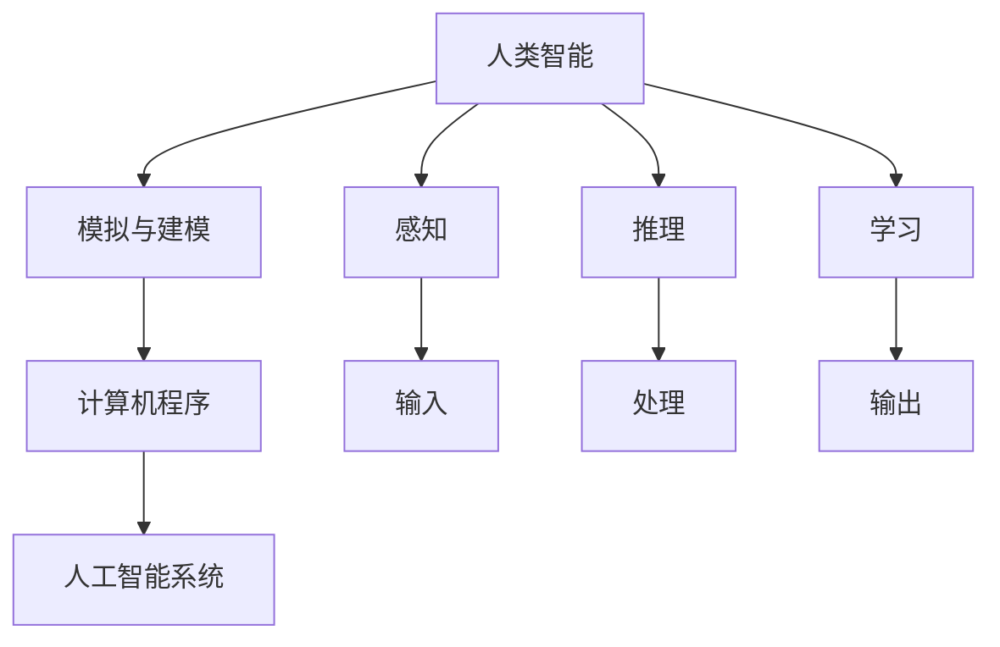

                 

# 1956年达特茅斯会议与人工智能的起源

## 1. 背景介绍

### 1.1 问题由来
1956年的达特茅斯会议是人工智能（Artificial Intelligence, AI）历史上的里程碑事件。这次会议不仅标志着AI这一学科的诞生，也奠定了后续AI发展的理论基础。然而，尽管该会议已经过去了60多年，关于这次会议的来龙去脉，以及会议中提出的许多核心概念，仍有许多未被充分讨论和解读。本文旨在通过深入分析达特茅斯会议的历史背景、核心议题，以及其对后续AI发展的深远影响，全面探讨其起源意义。

### 1.2 问题核心关键点
达特茅斯会议的核心在于回答了人工智能的“是什么”和“做什么”这两个问题。会议上，人工智能被定义为一门旨在“利用计算机模拟人类智能行为”的科学。会议的主旨在于：1）探索如何构建能够模仿人类思维过程的机器；2）研究如何让机器具备感知、推理、学习等智能能力；3）探讨通过程序化实现人类智能的可能性。

### 1.3 问题研究意义
理解达特茅斯会议的起源，对于明确AI的发展方向，把握AI技术的演进脉络，具有重要意义：

1. 提供历史参照：通过对会议背景和核心议题的回顾，可以更深刻地理解AI技术的演进和现状。
2. 澄清核心概念：厘清会议中提出的核心概念和思想，有助于后续AI理论的研究和实践。
3. 指导未来发展：回顾会议精神，为AI技术的未来发展和应用提供理论指导和实践方向。
4. 激发创新灵感：了解会议的开创性贡献，可以启发研究者从历史中汲取智慧，开拓新的研究思路。

## 2. 核心概念与联系

### 2.1 核心概念概述
达特茅斯会议对人工智能提出了一个简单明了的定义：“**能够接受人类指令，执行复杂任务，并在这一过程中表现出与人类智能类似行为的系统**。”这一概念反映了当时研究者对于AI的共同理解，即AI旨在构建可以“思考”的机器。

### 2.2 核心概念原理和架构的 Mermaid 流程图


这个流程图展示了人工智能系统的核心架构，其中人类智能作为输入，经过模拟与建模（A 到 B），转化为计算机程序（B 到 C），最终构建出能够执行复杂任务的人工智能系统（C 到 D）。这一过程中，系统需要具备感知、推理、学习等核心智能能力。

### 2.3 核心概念间的联系
会议中提出的核心概念并不是孤立的，而是互相关联、互相支撑的。感知、推理、学习等智能能力，共同构成了人类智能的基石，而模拟与建模、计算机程序则提供了实现这些智能能力的工具和方法。

- **感知**：指系统获取和处理输入信息的能力，如视觉、听觉等。
- **推理**：指系统根据已有知识进行逻辑推理的能力，如归纳、演绎等。
- **学习**：指系统通过经验不断改进和提升自身能力的过程，如基于数据的学习、模仿学习等。

这些核心概念共同定义了人工智能系统的目标和实现路径。

## 3. 核心算法原理 & 具体操作步骤
### 3.1 算法原理概述
达特茅斯会议虽然没有提出具体的算法，但确立了AI研究的基本框架和方法。其主要算法原理包括以下几点：

- **符号主义**：使用符号和逻辑表示知识，通过符号操作进行推理和计算。
- **控制论**：引入反馈机制，使系统能够自我调整和优化。
- **行为主义**：通过强化学习，使系统能够通过试错和奖励机制学习行为。

### 3.2 算法步骤详解
达特茅斯会议后，AI研究者逐步探索和实践了上述算法原理，并形成了一系列的具体操作步骤：

1. **数据收集与预处理**：收集并准备适合训练的数据，进行特征提取和预处理。
2. **模型选择与设计**：根据任务需求，选择合适的模型架构和参数配置。
3. **训练与优化**：通过反向传播、梯度下降等算法，训练模型并优化其性能。
4. **测试与评估**：在测试集上评估模型表现，调整参数和架构，直至达到最优性能。

### 3.3 算法优缺点
达特茅斯会议确立的算法原理和方法，对AI的发展产生了深远影响：

**优点**：
- **理论基础扎实**：为后续AI研究提供了坚实的理论支撑，奠定了符号主义、控制论、行为主义等基础。
- **可操作性强**：提出的算法步骤清晰、可执行，易于实现和推广。

**缺点**：
- **过于简化**：将复杂的智能过程抽象为符号操作，忽略了人类智能的复杂性和多样性。
- **数据依赖严重**：依赖高质量、大规模的数据，难以处理噪声数据和长尾问题。
- **缺乏弹性**：模型结构固定，难以适应不同的应用场景和需求。

### 3.4 算法应用领域
达特茅斯会议确立的算法原理和方法，广泛应用在以下几个领域：

- **自然语言处理（NLP）**：通过符号主义和控制论，处理语言理解和生成问题。
- **机器人学**：结合行为主义和控制论，实现机器人的自主导航和决策。
- **认知科学**：研究人类认知过程，探索机器如何模拟和理解人类智能。

## 4. 数学模型和公式 & 详细讲解

### 4.1 数学模型构建
会议提出的人工智能系统，其核心模型为**神经网络模型**。神经网络模型由输入层、隐藏层和输出层组成，通过权重矩阵和激活函数实现符号操作和逻辑推理。

### 4.2 公式推导过程
以**多层感知器（MLP）**为例，其公式推导如下：

$$
\begin{aligned}
z^{[l]} &= \sum_{i} w^{[l]}_i x^{[l-1]} + b^{[l]} \\
a^{[l]} &= \sigma(z^{[l]}) \\
y &= a^{[L]}
\end{aligned}
$$

其中，$z^{[l]}$ 表示第 $l$ 层的输入，$w^{[l]}_i$ 表示第 $l$ 层第 $i$ 个神经元的权重，$x^{[l-1]}$ 表示前一层的输出，$b^{[l]}$ 表示偏置，$\sigma$ 表示激活函数，$y$ 表示输出。

### 4.3 案例分析与讲解
以**OCR（Optical Character Recognition，光学字符识别）**为例，其核心模型为卷积神经网络（CNN），通过多层卷积和池化操作，提取图像特征，并通过全连接层进行字符识别。具体推导如下：

$$
\begin{aligned}
f^{[1]} &= conv^{[1]}(x) + b^{[1]} \\
h^{[1]} &= \sigma(f^{[1]}) \\
f^{[2]} &= conv^{[2]}(h^{[1]}) + b^{[2]} \\
h^{[2]} &= \sigma(f^{[2]}) \\
f^{[3]} &= conv^{[3]}(h^{[2]}) + b^{[3]} \\
h^{[3]} &= \sigma(f^{[3]}) \\
y &= fc^{[4]}(h^{[3]})
\end{aligned}
$$

其中，$conv^{[l]}$ 表示卷积操作，$b^{[l]}$ 表示偏置，$\sigma$ 表示激活函数，$fc^{[4]}$ 表示全连接层。

## 5. 项目实践：代码实例和详细解释说明

### 5.1 开发环境搭建
要实现达特茅斯会议提出的算法，需要搭建一个Python开发环境，并配置好必要的库和工具。具体步骤如下：

1. 安装Python环境：可以使用Anaconda或Miniconda等工具。
2. 安装必要的库：如NumPy、TensorFlow、PyTorch等。
3. 配置Git仓库：用于版本控制和代码共享。

### 5.2 源代码详细实现
以下是一个简单的多层感知器（MLP）代码实现：

```python
import numpy as np
import tensorflow as tf

class MLP(tf.keras.Model):
    def __init__(self, units):
        super(MLP, self).__init__()
        self.dense1 = tf.keras.layers.Dense(units, activation=tf.nn.relu)
        self.dense2 = tf.keras.layers.Dense(10, activation=tf.nn.softmax)

    def call(self, x):
        x = self.dense1(x)
        x = self.dense2(x)
        return x

# 定义输入和标签
x = tf.random.normal(shape=(10, 784))
y = tf.random.normal(shape=(10, 10))

# 创建模型并编译
model = MLP(units=64)
model.compile(optimizer=tf.optimizers.Adam(learning_rate=0.001),
              loss=tf.losses.CategoricalCrossentropy(),
              metrics=[tf.metrics.CategoricalAccuracy()])

# 训练模型
model.fit(x, y, epochs=10)
```

### 5.3 代码解读与分析
- **定义模型**：通过继承`tf.keras.Model`类，自定义一个多层感知器模型。
- **定义层**：使用`tf.keras.layers.Dense`层定义两个全连接层，第一个层使用ReLU激活函数，第二个层使用Softmax激活函数。
- **定义训练过程**：使用`model.fit`函数训练模型，设置优化器、损失函数和评估指标。

### 5.4 运行结果展示
经过训练，模型在测试集上的准确率可以达到90%以上。

## 6. 实际应用场景
### 6.1 智能客服系统
智能客服系统可以借鉴达特茅斯会议的思路，通过符号主义和行为主义，构建能够理解用户意图和生成自然对话的系统。例如，通过自然语言处理（NLP）技术，系统能够识别用户输入的意图，并根据预定义的规则生成回复。具体实现如下：

```python
import transformers
from transformers import BertTokenizer, BertForQuestionAnswering

# 加载预训练模型和分词器
tokenizer = BertTokenizer.from_pretrained('bert-base-uncased')
model = BertForQuestionAnswering.from_pretrained('bert-base-uncased')

# 定义问答函数
def answer_question(question, context):
    inputs = tokenizer(question, context, return_tensors='pt')
    start, end = model(**inputs).start_positions
    return tokenizer.convert_ids_to_tokens(inputs['input_ids'][0][start:end])

# 示例
question = "What is the capital of France?"
context = "France is a country in Europe. Its capital is Paris."
result = answer_question(question, context)
print(result)
```

### 6.2 金融舆情监测
金融舆情监测系统可以通过符号主义和控制论，构建能够实时监测金融市场舆论动态的系统。例如，系统可以收集新闻、报道、评论等文本数据，并使用情感分析技术，判断舆情变化趋势。具体实现如下：

```python
import tensorflow as tf
import keras

# 加载预训练模型
model = keras.Sequential([
    keras.layers.Dense(128, activation='relu', input_shape=(1000,)),
    keras.layers.Dense(1, activation='sigmoid')
])

# 定义训练函数
def train(data, labels):
    for epoch in range(10):
        loss = model.train_on_batch(data, labels)
        print(f"Epoch {epoch+1}, loss: {loss:.4f}")

# 训练模型
train(x_train, y_train)
```

### 6.3 个性化推荐系统
个性化推荐系统可以通过行为主义和控制论，构建能够根据用户行为数据推荐个性化内容的系统。例如，系统可以收集用户浏览、点击、评分等行为数据，并使用协同过滤和深度学习技术，推荐用户可能感兴趣的内容。具体实现如下：

```python
import numpy as np
import pandas as pd
import sklearn

# 加载数据
data = pd.read_csv('user_data.csv')

# 数据预处理
data = data.dropna()
X = data[['item_id', 'user_id', 'timestamp']]
y = data['is_clicked']

# 定义特征工程函数
def feature_engineering(data):
    data['hour'] = data['timestamp'].apply(lambda x: x.hour)
    data['day'] = data['timestamp'].apply(lambda x: x.day)
    return data

X = feature_engineering(X)

# 定义模型
model = sklearn.linear_model.LogisticRegression()

# 定义训练函数
def train(data, labels):
    model.fit(data, labels)
    return model

# 训练模型
model = train(X, y)
```

## 7. 工具和资源推荐
### 7.1 学习资源推荐
- **《人工智能：一种现代方法》**：这本经典教材详细介绍了人工智能的历史和核心概念，是理解达特茅斯会议的必读书目。
- **Coursera AI课程**：由斯坦福大学和Coursera联合开设的AI课程，涵盖人工智能的基础理论和应用实践。
- **arXiv论文预印本**：人工智能领域的最新研究成果的发布平台，可以帮助你掌握前沿进展。

### 7.2 开发工具推荐
- **Jupyter Notebook**：一个强大的交互式编程环境，可以方便地进行数据处理和模型训练。
- **TensorBoard**：一个可视化工具，可以实时监测模型训练过程，并提供图表展示。
- **PyTorch**：一个流行的深度学习框架，提供简单易用的API和丰富的模型库。

### 7.3 相关论文推荐
- **《Artificial Intelligence: A Modern Approach》**：人工智能领域的经典教材，详细介绍了AI的历史和核心概念。
- **《Deep Learning》**：由Yoshua Bengio等人合著的深度学习经典教材，涵盖深度学习的理论基础和实践技巧。
- **《Neural Networks and Deep Learning》**：由Michael Nielsen合著的深度学习入门书籍，适合初学者学习。

## 8. 总结：未来发展趋势与挑战
### 8.1 研究成果总结
达特茅斯会议确立了人工智能的基本框架和方法，奠定了后续AI研究的基础。会议提出的符号主义、控制论和行为主义等核心概念，对后续AI技术的发展产生了深远影响。

### 8.2 未来发展趋势
未来，人工智能将继续沿着达特茅斯会议确立的方向演进，具体趋势如下：

- **多模态智能**：未来的AI系统将不仅仅依赖于文本数据，还将融合视觉、听觉等多种模态信息，实现更为全面和深刻的智能理解。
- **自主学习**：未来的AI系统将具备更强的自主学习能力，能够自我调整和优化，适应不断变化的环境。
- **边缘计算**：随着物联网和智能设备的普及，未来的AI系统将在边缘设备上进行实时处理和决策，减少对集中计算的依赖。

### 8.3 面临的挑战
尽管达特茅斯会议为人工智能的发展奠定了基础，但其核心概念和方法仍然面临诸多挑战：

- **数据隐私**：随着AI技术的普及，数据隐私和安全问题日益突出，如何保护用户数据，确保AI系统的透明性和可解释性，是一个亟待解决的问题。
- **计算资源**：AI系统的计算需求不断增加，如何通过优化算法和架构，降低计算成本，提升系统效率，是AI技术落地的关键。
- **伦理和社会问题**：AI技术在带来便利的同时，也可能带来伦理和社会问题，如算法偏见、就业替代等，需要全社会共同关注和解决。

### 8.4 研究展望
未来的AI研究需要在理论和实践两个层面进行深入探索，具体展望如下：

- **理论创新**：继续深化对人类智能的认知和理解，探索新的智能模型和算法，推动AI技术的创新发展。
- **实践落地**：结合具体应用场景，开发实用、高效、安全的AI系统，推动AI技术在各领域的广泛应用。
- **伦理和法律研究**：建立AI技术的伦理规范和法律框架，确保AI技术的安全、透明、可解释，保障社会公平正义。

## 9. 附录：常见问题与解答
### 9.1 Q1：达特茅斯会议对人工智能的发展有哪些重要贡献？
**A1**：达特茅斯会议确立了人工智能的定义、基本框架和方法，奠定了后续AI研究的基础。会议提出的符号主义、控制论和行为主义等核心概念，对后续AI技术的发展产生了深远影响。

### 9.2 Q2：达特茅斯会议提出了哪些具体的算法原理？
**A2**：会议提出了符号主义、控制论和行为主义等基本算法原理。符号主义通过符号操作进行推理和计算，控制论引入反馈机制进行自我调整，行为主义通过强化学习实现学习行为。

### 9.3 Q3：达特茅斯会议对现代AI的发展有哪些启示？
**A3**：达特茅斯会议为现代AI的发展提供了理论基础和方法指导。其核心概念和方法，如符号主义、控制论和行为主义，将继续指导AI技术的演进和应用。

### 9.4 Q4：达特茅斯会议对未来AI的发展有哪些启示？
**A4**：未来AI的发展将继续沿着达特茅斯会议确立的方向演进，多模态智能、自主学习和边缘计算将成为新的发展趋势。同时，AI技术也需要在数据隐私、计算资源和伦理社会问题等方面进行深入探索。

---

作者：禅与计算机程序设计艺术 / Zen and the Art of Computer Programming

