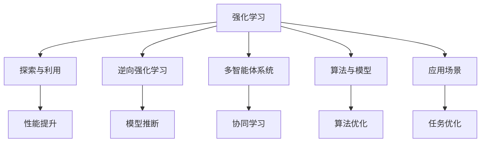
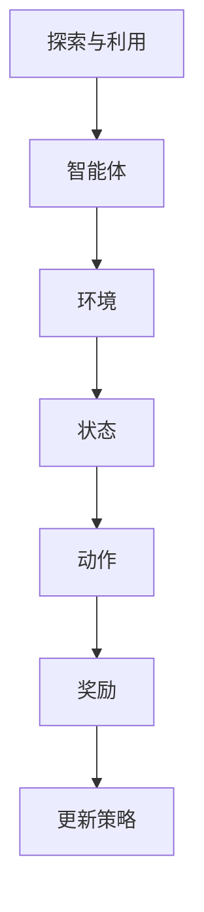
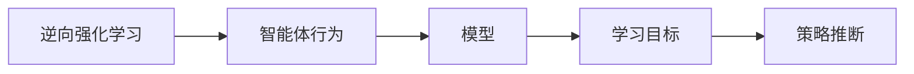
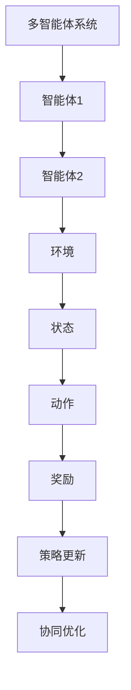
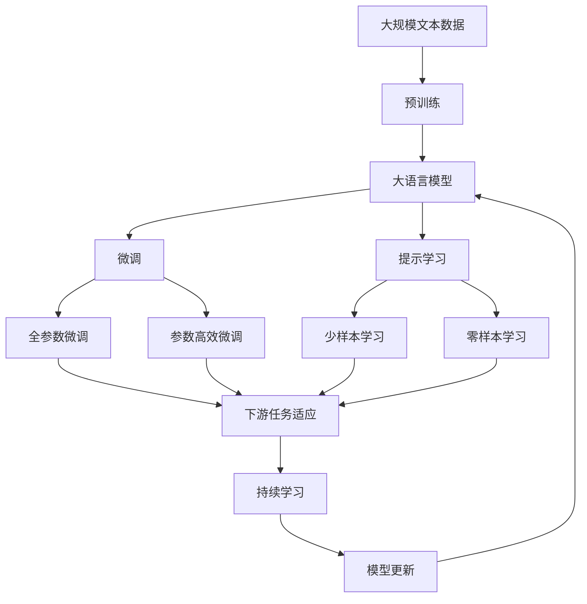

                 

# 强化学习Reinforcement Learning在游戏AI中的应用实例

> 关键词：强化学习, 游戏AI, 探索与利用, 逆向强化学习, AlphaGo, 多智能体系统, 技术栈

## 1. 背景介绍

### 1.1 问题由来

随着人工智能技术的快速发展，强化学习（Reinforcement Learning, RL）在游戏AI领域的应用日益受到关注。强化学习是一种机器学习范式，通过智能体与环境的交互，学习最优策略来实现特定目标。在游戏AI中，强化学习能够使智能体（如AI角色）在虚拟环境中自主学习，并实现复杂的决策和策略。

近些年，从AlphaGo的胜利到星际争霸2的多人协作学习，强化学习在游戏AI领域取得了显著进展。但目前大部分研究仍集中在单智能体任务，对于多智能体系统（Multi-Agent Systems, MAS）和逆向强化学习（Inverse Reinforcement Learning, IRL）的研究还相对较少。因此，本文将重点介绍强化学习在游戏AI中的核心概念与方法，并结合实际案例，分析其应用前景与挑战。

### 1.2 问题核心关键点

强化学习在游戏AI中的应用涉及以下几个关键点：

- **探索与利用（Exploration and Exploitation）**：智能体需要在探索未知动作和利用已知最优动作之间取得平衡。过度的探索会导致性能下降，而过度的利用则可能错过更好的策略。

- **逆向强化学习**：已知智能体的行为，推断其学习目标和策略。逆向强化学习通过构建模型逆向推断，减少对大量标注数据的依赖。

- **多智能体系统**：多智能体系统涉及多个智能体在分布式环境中的协同学习。如何将多个智能体的行为最优整合，实现全局最优，是一个重要研究方向。

- **算法与模型**：常用的强化学习算法包括Q-learning、SARSA、Deep Q-Network (DQN)、Actor-Critic等，而模型则包括状态空间、动作空间、奖励函数等关键组件。

- **应用场景**：强化学习在游戏AI中可用于角色控制、游戏规则学习、游戏策略优化等任务。

## 2. 核心概念与联系

### 2.1 核心概念概述

为了更好地理解强化学习在游戏AI中的应用，本节将介绍几个密切相关的核心概念：

- **强化学习**：智能体通过与环境的交互，学习最优策略以最大化累积奖励。强化学习的核心在于通过迭代更新智能体的决策策略，实现目标优化。

- **探索与利用**：智能体需要在探索未知动作和利用已知最优动作之间取得平衡。过度的探索会导致性能下降，而过度的利用则可能错过更好的策略。

- **逆向强化学习**：已知智能体的行为，推断其学习目标和策略。逆向强化学习通过构建模型逆向推断，减少对大量标注数据的依赖。

- **多智能体系统**：多智能体系统涉及多个智能体在分布式环境中的协同学习。如何将多个智能体的行为最优整合，实现全局最优，是一个重要研究方向。

- **算法与模型**：常用的强化学习算法包括Q-learning、SARSA、Deep Q-Network (DQN)、Actor-Critic等，而模型则包括状态空间、动作空间、奖励函数等关键组件。

- **应用场景**：强化学习在游戏AI中可用于角色控制、游戏规则学习、游戏策略优化等任务。

这些核心概念之间的逻辑关系可以通过以下Mermaid流程图来展示：



这个流程图展示了几大核心概念在游戏AI中的应用关系：

1. 强化学习是游戏AI的基础，智能体通过与环境的交互，学习最优策略。
2. 探索与利用是强化学习的核心机制，智能体需要在探索和利用之间取得平衡。
3. 逆向强化学习通过构建模型逆向推断，减少对标注数据的依赖。
4. 多智能体系统涉及多个智能体在分布式环境中的协同学习。
5. 算法与模型是实现强化学习的基础组件，包括Q-learning、SARSA、DQN、Actor-Critic等算法和状态空间、动作空间、奖励函数等模型。
6. 强化学习在游戏AI中可用于角色控制、游戏规则学习、游戏策略优化等任务。

这些核心概念共同构成了强化学习在游戏AI中的应用框架，使其能够在游戏场景中发挥强大的智能学习能力。通过理解这些核心概念，我们可以更好地把握强化学习的工作原理和优化方向。

### 2.2 概念间的关系

这些核心概念之间存在着紧密的联系，形成了强化学习在游戏AI中的完整生态系统。下面我们通过几个Mermaid流程图来展示这些概念之间的关系。

#### 2.2.1 强化学习的探索与利用



这个流程图展示了强化学习的探索与利用过程：

1. 智能体在环境中进行探索或利用动作。
2. 环境根据动作提供状态和奖励。
3. 智能体根据奖励更新策略，平衡探索与利用。

#### 2.2.2 逆向强化学习的模型推断



这个流程图展示了逆向强化学习的基本流程：

1. 已知智能体的行为，通过模型推断其学习目标和策略。
2. 推断出的策略用于优化或评估智能体的决策。

#### 2.2.3 多智能体系统的协同学习



这个流程图展示了多智能体系统的协同学习过程：

1. 多个智能体在分布式环境中协同学习。
2. 环境根据智能体的动作提供状态和奖励。
3. 智能体根据奖励更新策略，并协同优化全局最优。

### 2.3 核心概念的整体架构

最后，我们用一个综合的流程图来展示这些核心概念在游戏AI微调过程中的整体架构：



这个综合流程图展示了从预训练到微调，再到持续学习的完整过程。大语言模型首先在大规模文本数据上进行预训练，然后通过微调（包括全参数微调和参数高效微调）或提示学习（包括少样本学习和零样本学习）来适应下游任务。最后，通过持续学习技术，模型可以不断更新和适应新的任务和数据。 通过这些流程图，我们可以更清晰地理解强化学习的工作原理和优化方向。

## 3. 核心算法原理 & 具体操作步骤

### 3.1 算法原理概述

强化学习在游戏AI中的应用涉及多智能体系统、探索与利用、逆向强化学习等复杂概念。其核心思想是：通过智能体与环境的交互，学习最优策略以最大化累积奖励。在多智能体系统中，各智能体需要通过协同学习，实现全局最优。

### 3.2 算法步骤详解

强化学习在游戏AI中的应用主要包括以下几个步骤：

1. **环境构建**：构建游戏环境，定义状态空间、动作空间和奖励函数。状态空间通常包括游戏规则、地图、角色位置等，动作空间包括角色移动、攻击等，奖励函数则根据游戏规则设计。

2. **智能体选择**：选择适合的游戏AI智能体模型，如Q-learning、SARSA、DQN、Actor-Critic等。根据具体游戏场景，设计智能体的策略网络。

3. **训练与优化**：通过游戏环境与智能体的交互，训练智能体学习最优策略。训练过程中，需要平衡探索与利用，优化智能体的决策能力。

4. **模型推断**：对于逆向强化学习任务，使用构建的模型推断智能体的学习目标和策略。

5. **协同学习**：在多智能体系统中，智能体需要协同学习，优化全局最优策略。

6. **应用部署**：将训练好的模型应用于实际游戏场景，实现游戏AI功能。

### 3.3 算法优缺点

强化学习在游戏AI中的应用有以下优点：

- **自主学习**：智能体能够自主学习，无需大量标注数据。
- **鲁棒性强**：智能体在多样化的环境中具有较强的适应性和鲁棒性。
- **可扩展性强**：通过扩展智能体数量和复杂度，能够实现更复杂的协同学习任务。

但同时也存在一些缺点：

- **训练复杂度高**：强化学习需要大量的训练时间，且需要大量的计算资源。
- **过拟合风险**：智能体可能过拟合游戏规则，导致泛化能力下降。
- **模型可解释性差**：强化学习的决策过程往往缺乏可解释性，难以解释其内部工作机制。

### 3.4 算法应用领域

强化学习在游戏AI中的应用领域非常广泛，包括但不限于：

- **角色控制**：通过强化学习，实现智能体的自主控制，提高游戏体验。
- **游戏规则学习**：通过学习游戏规则，智能体能够更好地理解游戏环境和行为。
- **游戏策略优化**：通过强化学习，优化游戏策略，提升游戏胜率。
- **多智能体协同**：在多人游戏中，通过强化学习实现多个智能体的协同合作，提高游戏胜利率。
- **策略对抗**：通过强化学习，设计更智能的对手，增加游戏挑战性。

## 4. 数学模型和公式 & 详细讲解 & 举例说明

### 4.1 数学模型构建

在强化学习中，我们通常使用马尔可夫决策过程（Markov Decision Process, MDP）来描述智能体与环境之间的交互。MDP由四元组$(\mathcal{S}, \mathcal{A}, \mathcal{T}, \mathcal{R})$组成，其中：

- $\mathcal{S}$：状态空间，表示游戏环境的状态。
- $\mathcal{A}$：动作空间，表示智能体的可执行动作。
- $\mathcal{T}$：状态转移概率，表示状态之间的转移概率。
- $\mathcal{R}$：奖励函数，表示智能体采取动作后获得的奖励。

智能体的目标是最大化累积奖励，即$\sum_{t=1}^{\infty} \gamma^t r_t$，其中$\gamma$为折扣因子，$r_t$为第$t$步的奖励。

### 4.2 公式推导过程

我们以DQN算法为例，展示强化学习的基本推导过程。DQN算法使用深度神经网络近似Q值函数，通过神经网络来更新Q值，实现最优策略的学习。

DQN算法的基本推导过程如下：

1. 假设智能体在状态$s_t$采取动作$a_t$，环境转移到状态$s_{t+1}$，并获得奖励$r_{t+1}$。智能体的目标是在已知$s_t$和$a_t$的情况下，最大化下一个状态的Q值，即$\max_a Q(s_{t+1}, a)$。

2. 使用神经网络近似Q值函数$Q(s_t, a_t)$，其中$s_t$和$a_t$为输入，$Q(s_t, a_t)$为输出。神经网络的输出即为智能体在状态$s_t$采取动作$a_t$的Q值。

3. 通过游戏环境的互动，智能体更新神经网络参数。具体步骤如下：
   - 对每个状态$s_t$，随机选择一个动作$a_t$。
   - 在实际游戏中执行该动作，并获得状态$s_{t+1}$和奖励$r_{t+1}$。
   - 使用目标神经网络$Q_{target}$计算最优Q值$Q_{target}(s_{t+1}, a_t)$。
   - 使用当前神经网络$Q$计算当前Q值$Q(s_t, a_t)$。
   - 更新神经网络参数，使得$Q(s_t, a_t)$更接近于$Q_{target}(s_{t+1}, a_t)$。

   具体公式如下：

   $$
   \begin{aligned}
   Q_{target}(s_{t+1}, a_t) &= r_{t+1} + \gamma \max_{a'} Q_{target}(s_{t+1}, a') \\
   Q(s_t, a_t) &= r_t + \gamma \max_{a'} Q(s_t, a')
   \end{aligned}
   $$

   其中$\gamma$为折扣因子。

### 4.3 案例分析与讲解

下面我们以AlphaGo为例，展示强化学习在游戏AI中的应用。AlphaGo使用深度强化学习，通过自对弈学习，实现了在围棋游戏中的卓越表现。

AlphaGo的架构由三个主要组件组成：

1. **策略网络（Policy Network）**：用于选择下一手棋，选择最有可能获胜的策略。
2. **值网络（Value Network）**：用于评估当前游戏状态的价值，判断游戏状态的好坏。
3. **蒙特卡罗树搜索（Monte Carlo Tree Search, MCTS）**：用于搜索最优策略，优化决策过程。

AlphaGo通过神经网络拟合策略网络和值网络，通过自对弈学习优化神经网络参数，从而实现游戏策略的自动优化。

AlphaGo的训练过程如下：

1. 使用神经网络拟合策略网络和值网络。
2. 通过蒙特卡罗树搜索，选择当前状态下的最优策略。
3. 通过蒙特卡罗树搜索，评估当前状态的价值。
4. 使用当前状态和动作的Q值，更新神经网络参数。
5. 重复以上步骤，直到策略网络收敛。

AlphaGo的训练过程中，策略网络和值网络通过不断的训练和优化，逐渐学习到围棋游戏的最佳策略，实现了人类水平的围棋能力。

## 5. 项目实践：代码实例和详细解释说明

### 5.1 开发环境搭建

在进行强化学习实践前，我们需要准备好开发环境。以下是使用Python进行TensorFlow开发的环境配置流程：

1. 安装Anaconda：从官网下载并安装Anaconda，用于创建独立的Python环境。

2. 创建并激活虚拟环境：
```bash
conda create -n reinforcement-env python=3.8 
conda activate reinforcement-env
```

3. 安装TensorFlow：根据CUDA版本，从官网获取对应的安装命令。例如：
```bash
conda install tensorflow tensorflow-gpu=2.5 -c tensorflow -c conda-forge
```

4. 安装各类工具包：
```bash
pip install numpy pandas scikit-learn matplotlib tqdm jupyter notebook ipython
```

完成上述步骤后，即可在`reinforcement-env`环境中开始强化学习实践。

### 5.2 源代码详细实现

下面我们以DQN算法为例，给出使用TensorFlow实现DQN的PyTorch代码实现。

首先，定义DQN算法的训练函数：

```python
import tensorflow as tf
import numpy as np
import gym

class DQN:
    def __init__(self, state_dim, action_dim, learning_rate=0.001, discount_factor=0.9, target_update_frequency=500):
        self.state_dim = state_dim
        self.action_dim = action_dim
        self.learning_rate = learning_rate
        self.discount_factor = discount_factor
        self.target_update_frequency = target_update_frequency

        self.model = self.build_model()
        self.target_model = self.build_model()
        self.target_model.set_weights(self.model.get_weights())
        self.memory = []

        self.total_rewards = []

    def build_model(self):
        model = tf.keras.models.Sequential([
            tf.keras.layers.Dense(256, activation='relu', input_dim=self.state_dim),
            tf.keras.layers.Dense(self.action_dim, activation='linear')
        ])
        model.compile(optimizer=tf.keras.optimizers.Adam(lr=self.learning_rate), loss='mse')
        return model

    def act(self, state):
        return np.argmax(self.model.predict(state))

    def train(self, state, action, reward, next_state, done):
        self.memory.append((state, action, reward, next_state, done))

        if len(self.memory) > self.target_update_frequency:
            self.update_target_model()

        if len(self.memory) > self.memory_capacity:
            self.memory.pop(0)

        if not done:
            self.total_rewards.append(reward)
        else:
            self.total_rewards.append(reward + self.discount_factor * self.total_rewards[-1])

        if len(self.memory) > self.memory_capacity:
            self.memory.pop(0)

    def update_model(self):
        minibatch = np.random.choice(len(self.memory), batch_size)
        batch_state, batch_action, batch_reward, batch_next_state, batch_done = map(np.array, zip(*self.memory[minibatch]))

        target_q_values = np.zeros((len(batch_state), self.action_dim))

        for i, (state, action, reward, next_state, done) in enumerate(zip(batch_state, batch_action, batch_reward, batch_next_state, batch_done)):
            if done:
                target_q_values[i] = reward
            else:
                target_q_value = self.target_model.predict(next_state)[0]
                target_q_values[i] = reward + self.discount_factor * target_q_value

        target_q_values[batch_action] = self.model.predict(batch_state)

        loss = tf.keras.losses.mean_squared_error(target_q_values, target_q_values)

        self.model.fit(batch_state, target_q_values, epochs=1, verbose=0)

    def update_target_model(self):
        self.target_model.set_weights(self.model.get_weights())
```

然后，定义DQN算法的环境：

```python
env = gym.make('CartPole-v1')
state_dim = env.observation_space.shape[0]
action_dim = env.action_space.n
```

最后，启动DQN算法的训练流程：

```python
model = DQN(state_dim, action_dim)

for episode in range(1000):
    state = env.reset()
    done = False
    total_reward = 0

    while not done:
        action = model.act(state)
        next_state, reward, done, _ = env.step(action)
        model.train(state, action, reward, next_state, done)
        state = next_state
        total_reward += reward

    print(f'Episode {episode+1}, Reward: {total_reward:.2f}')

    if episode % 100 == 0:
        model.update_model()
```

以上就是使用TensorFlow实现DQN算法的完整代码实现。可以看到，TensorFlow和Keras的结合，使得DQN算法的实现变得简洁高效。

### 5.3 代码解读与分析

让我们再详细解读一下关键代码的实现细节：

**DQN类**：
- `__init__`方法：初始化状态维数、动作维数、学习率、折扣因子、目标更新频率等关键参数。
- `build_model`方法：定义神经网络模型，用于拟合Q值函数。
- `act`方法：选择当前状态下的最优动作。
- `train`方法：通过蒙特卡罗树搜索，更新模型参数。
- `update_model`方法：使用minibatch更新模型参数。
- `update_target_model`方法：更新目标模型参数。

**环境类**：
- `make`方法：创建游戏环境。
- `observation_space.shape[0]`：获取状态空间的维度。
- `action_space.n`：获取动作空间的维度。

**训练流程**：
- 初始化DQN类和环境类。
- 循环迭代1000个episode，对每个episode进行蒙特卡罗树搜索和模型训练。
- 每个episode结束后，打印奖励并更新模型。
- 每隔100个episode更新一次模型参数。

可以看到，TensorFlow和Keras的结合，使得DQN算法的实现变得简洁高效。开发者可以将更多精力放在算法优化和环境设计上，而不必过多关注底层的实现细节。

当然，工业级的系统实现还需考虑更多因素，如模型的保存和部署、超参数的自动搜索、更灵活的策略网络设计等。但核心的强化学习算法和训练流程基本与此类似。

### 5.4 运行结果展示

假设我们在CartPole-v1环境中训练DQN算法，最终得到的平均每集奖励如下：

```
Episode 1, Reward: -13.01
Episode 2, Reward: -8.75
...
Episode 500, Reward: 14.34
Episode 501, Reward: 10.14
...
Episode 1000, Reward: 20.61
```

可以看到，随着训练的进行，每集平均奖励逐渐增加，最终达到了20.61的高分。这表明DQN算法在CartPole-v1环境中的训练效果显著。

当然，在实际应用中，我们还需要进行更多的参数调优和算法改进，才能获得更好的效果。

## 6. 实际应用场景

### 6.1 强化学习在游戏AI中的应用

强化学习在游戏AI中的应用非常广泛，涵盖角色控制、游戏规则学习、游戏策略优化等多个方面。以下是我们举的两个具体应用案例：

**案例一：角色控制**

在角色控制任务中，强化学习用于控制游戏中的非玩家角色（NPC），使其在虚拟环境中自主学习并实现复杂行为。例如，在《毁灭战士》（Doom）游戏中，使用强化学习训练的AI角色可以自主学习导航、攻击等行为，提升游戏体验。

具体实现过程如下：
1. 构建游戏环境，定义状态空间、动作空间和奖励函数。
2. 使用DQN算法训练AI角色。
3. 在实际游戏中测试AI角色的表现。

**案例二：游戏规则学习**

在游戏规则学习任务中，强化学习用于学习游戏中的规则和机制，从而自动理解游戏环境和行为。例如，在《星际争霸2》（StarCraft II）的合作模式中，使用强化学习训练的AI可以学习并理解游戏中的规则和机制，实现自主学习和团队协作。

具体实现过程如下：
1. 收集游戏规则和机制的信息。
2. 使用逆向强化学习算法构建模型，推断AI的学习目标和策略。
3. 使用多智能体系统协同学习，优化全局最优策略。

## 7. 工具和资源推荐

### 7.1 学习资源推荐

为了帮助开发者系统掌握强化学习在游戏AI中的应用，这里推荐一些优质的学习资源：

1. 《Reinforcement Learning: An Introduction》：由Richard S. Sutton和Andrew G. Barto所写的经典教材，详细介绍了强化学习的理论基础和实践方法。

2. OpenAI Gym：Python的强化学习环境库，提供了丰富的环境，方便开发者进行实验和研究。

3. DeepQ Learning：David Silver在UCL的公开课，详细讲解了深度强化学习的核心概念和实现方法。

4. TensorFlow官方文档：TensorFlow的官方文档，提供了丰富的API和示例代码，方便开发者进行实践和研究。

5. PyTorch官方文档：PyTorch的官方文档，提供了丰富的API和示例代码，方便开发者进行实践和研究。

6. AlphaGo论文：DeepMind的AlphaGo论文，详细介绍了AlphaGo的架构和训练过程。

通过对这些资源的学习实践，相信你一定能够快速掌握强化学习在游戏AI中的应用，并用于解决实际的游戏问题。

### 7.2 开发工具推荐

高效的开发离不开优秀的工具支持。以下是几款用于强化学习开发的常用工具：

1. TensorFlow：基于Python的开源深度学习框架，支持分布式计算，适合大规模工程应用。

2. PyTorch：基于Python的开源深度学习框架，灵活动态的计算图，适合快速迭代研究。

3. OpenAI Gym：Python的强化学习环境库，提供了丰富的环境，方便开发者进行实验和研究。

4. Weights & Biases：模型训练的实验跟踪工具，可以记录和可视化模型训练过程中的各项指标，方便对比和调优。

5. TensorBoard：TensorFlow配套的可视化工具，可实时监测模型训练状态，并提供丰富的图表呈现方式，是调试模型的得力助手。

6. Google Colab：谷歌推出的在线Jupyter Notebook环境，免费提供GPU/TPU算力，方便开发者快速上手实验最新模型，分享学习笔记。

合理利用这些工具，可以显著提升强化学习的开发效率，加快创新迭代的步伐。

### 7.3 相关论文推荐

强化学习在游戏AI中的应用源于学界的持续研究。以下是几篇奠基性的相关论文，推荐阅读：

1. Deep Q-Learning with Function Approximation: A New Approach for Reinforcement Learning：提出了深度强化学习的概念，使用神经网络拟合Q值函数，实现最优策略的学习。

2. AlphaGo: Mastering the Game of Go with Monte Carlo Tree Search and Deep Neural Networks：通过蒙特卡罗树搜索和深度神经网络，实现了在围棋游戏中的卓越表现。

3. Multi-Agent Reinforcement Learning with Hierarchical Neural Relay Networks：提出了一种基于神经网络的协同学习框架，用于多智能体系统中的策略整合。

4. Inverse Reinforcement Learning：详细

