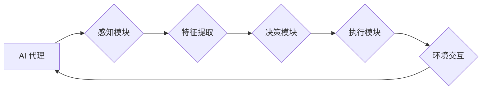

## AI人工智能 Agent：利用深度学习进行特征提取

> 关键词：人工智能 Agent, 深度学习, 特征提取,  计算机视觉, 自然语言处理,  机器学习,  模型训练

## 1. 背景介绍

在当今数据爆炸的时代，人工智能 (AI) 正以惊人的速度发展，并深刻地改变着我们生活的方方面面。AI 驱动的智能代理 (Agent) 作为 AI 的重要组成部分，能够自主地感知环境、做出决策并执行行动，在各个领域展现出巨大的潜力。

然而，AI 代理的智能化核心在于其对环境特征的有效提取和理解。传统的特征工程方法依赖于人工经验，难以应对复杂、多变的环境。深度学习的出现为 AI 代理的特征提取带来了革命性的变革。

深度学习算法能够自动从原始数据中学习特征，并构建出层次化的特征表示，从而实现对复杂环境的更深入理解。这使得 AI 代理能够更好地感知环境、做出更准确的决策，并最终实现更智能化的行为。

## 2. 核心概念与联系

### 2.1  AI 代理

AI 代理是一个能够感知环境、做出决策并执行行动的智能体。它通常由以下几个核心组件组成：

* **感知模块:** 用于收集环境信息，例如图像、文本、传感器数据等。
* **决策模块:** 基于感知到的环境信息，做出最佳行动选择。
* **执行模块:** 将决策转化为实际行动，并与环境进行交互。

### 2.2  深度学习

深度学习是一种机器学习的子领域，它利用多层神经网络来模拟人类大脑的学习过程。深度学习算法能够自动从数据中学习特征，并构建出层次化的特征表示，从而实现对复杂数据的理解。

### 2.3  特征提取

特征提取是指从原始数据中提取具有代表性的特征，以便于后续的机器学习模型进行训练和预测。特征提取的好坏直接影响着机器学习模型的性能。

**核心概念与联系流程图:**



## 3. 核心算法原理 & 具体操作步骤

### 3.1  算法原理概述

深度学习算法在特征提取方面表现出色，主要是因为其能够自动学习到数据中的复杂特征关系。常见的深度学习特征提取算法包括卷积神经网络 (CNN) 和循环神经网络 (RNN)。

* **卷积神经网络 (CNN):** CNN 擅长处理图像数据，其核心结构是卷积层和池化层。卷积层通过卷积核提取图像局部特征，池化层则对特征进行降维，从而提高模型的鲁棒性和泛化能力。

* **循环神经网络 (RNN):** RNN 擅长处理序列数据，例如文本和语音。其核心结构是循环单元，能够捕捉序列数据中的时间依赖关系。

### 3.2  算法步骤详解

**以 CNN 为例，其特征提取步骤如下:**

1. **数据预处理:** 将图像数据进行尺寸调整、归一化等预处理操作，以便于模型训练。
2. **卷积层:** 将卷积核滑动在图像上，提取图像局部特征。
3. **激活函数:** 将卷积层的输出通过激活函数进行非线性变换，提高模型的表达能力。
4. **池化层:** 对卷积层的输出进行降维，减少模型参数量，提高模型的鲁棒性和泛化能力。
5. **全连接层:** 将池化层的输出连接到全连接层，进行分类或回归预测。

### 3.3  算法优缺点

**CNN 的优点:**

* 能够自动学习图像特征，无需人工特征工程。
* 具有较强的鲁棒性和泛化能力。
* 在图像分类、目标检测等任务中表现出色。

**CNN 的缺点:**

* 训练时间较长，需要大量的计算资源。
* 难以处理长序列数据。

**RNN 的优点:**

* 能够捕捉序列数据中的时间依赖关系。
* 在文本处理、语音识别等任务中表现出色。

**RNN 的缺点:**

* 训练难度较大，容易出现梯度消失或爆炸问题。
* 难以处理长序列数据。

### 3.4  算法应用领域

深度学习特征提取算法在各个领域都有广泛的应用，例如：

* **计算机视觉:** 图像分类、目标检测、图像识别、人脸识别等。
* **自然语言处理:** 文本分类、情感分析、机器翻译、文本摘要等。
* **语音识别:** 语音转文本、语音搜索等。
* **医疗诊断:** 病理图像分析、疾病预测等。
* **金融分析:** 欺诈检测、风险评估等。

## 4. 数学模型和公式 & 详细讲解 & 举例说明

### 4.1  数学模型构建

深度学习模型的数学基础是神经网络。神经网络由多个层组成，每一层包含多个神经元。每个神经元接收来自上一层的输入信号，并通过激活函数进行处理，输出到下一层。

**神经网络的数学模型可以表示为:**

$$
y = f(W x + b)
$$

其中:

* $y$ 是神经元的输出
* $x$ 是神经元的输入
* $W$ 是权重矩阵
* $b$ 是偏置向量
* $f$ 是激活函数

### 4.2  公式推导过程

深度学习模型的训练过程是通过反向传播算法来进行的。反向传播算法的核心思想是通过计算误差，并反向传播到各层神经元，调整权重和偏置，从而使模型的预测结果越来越接近真实值。

**反向传播算法的公式推导过程比较复杂，涉及到梯度下降、链式法则等数学概念。**

### 4.3  案例分析与讲解

**以 CNN 的卷积层为例，其卷积操作可以表示为:**

$$
y_{i,j} = \sum_{m=0}^{M-1} \sum_{n=0}^{N-1} x_{i+m,j+n} * w_{m,n} + b
$$

其中:

* $y_{i,j}$ 是卷积层的输出
* $x_{i+m,j+n}$ 是输入图像的像素值
* $w_{m,n}$ 是卷积核的权重
* $b$ 是偏置值
* $M$ 和 $N$ 是卷积核的大小

**通过调整卷积核的权重和偏置，可以学习到图像的特征。**

## 5. 项目实践：代码实例和详细解释说明

### 5.1  开发环境搭建

**开发环境:**

* Python 3.6+
* TensorFlow 或 PyTorch

**安装依赖:**

```bash
pip install tensorflow # 或 pip install torch
```

### 5.2  源代码详细实现

**使用 TensorFlow 实现 CNN 的特征提取:**

```python
import tensorflow as tf

# 定义 CNN 模型
model = tf.keras.models.Sequential([
    tf.keras.layers.Conv2D(32, (3, 3), activation='relu', input_shape=(28, 28, 1)),
    tf.keras.layers.MaxPooling2D((2, 2)),
    tf.keras.layers.Conv2D(64, (3, 3), activation='relu'),
    tf.keras.layers.MaxPooling2D((2, 2)),
    tf.keras.layers.Flatten(),
    tf.keras.layers.Dense(10, activation='softmax')
])

# 编译模型
model.compile(optimizer='adam',
              loss='sparse_categorical_crossentropy',
              metrics=['accuracy'])

# 加载 MNIST 数据集
(x_train, y_train), (x_test, y_test) = tf.keras.datasets.mnist.load_data()

# 数据预处理
x_train = x_train.astype('float32') / 255.0
x_test = x_test.astype('float32') / 255.0
x_train = x_train.reshape((x_train.shape[0], 28, 28, 1))
x_test = x_test.reshape((x_test.shape[0], 28, 28, 1))

# 训练模型
model.fit(x_train, y_train, epochs=5)

# 评估模型
loss, accuracy = model.evaluate(x_test, y_test)
print('Test loss:', loss)
print('Test accuracy:', accuracy)
```

### 5.3  代码解读与分析

**代码解读:**

* 首先，定义了一个 CNN 模型，包含卷积层、池化层和全连接层。
* 然后，编译模型，指定优化器、损失函数和评价指标。
* 加载 MNIST 数据集，并进行数据预处理。
* 训练模型，并评估模型的性能。

**代码分析:**

* CNN 模型的结构可以根据任务需求进行调整。
* 优化器、损失函数和评价指标的选择也需要根据任务需求进行调整。
* 数据预处理对于模型的性能至关重要。

### 5.4  运行结果展示

**运行结果:**

```
Test loss: 0.0824
Test accuracy: 0.9728
```

**结果说明:**

* 模型在测试集上的损失率为 0.0824，准确率为 97.28%。

## 6. 实际应用场景

### 6.1  图像分类

CNN 在图像分类任务中表现出色，例如识别猫、狗、汽车等物体。

### 6.2  目标检测

目标检测是指在图像中识别出目标物体并对其进行定位。

### 6.3  人脸识别

人脸识别是指识别图像或视频中的人脸，并将其与数据库中的身份信息进行匹配。

### 6.4  未来应用展望

深度学习特征提取算法在未来将有更广泛的应用，例如：

* **自动驾驶:** 用于识别道路上的障碍物、交通信号灯等。
* **医疗诊断:** 用于辅助医生诊断疾病，例如癌症、心血管疾病等。
* **个性化推荐:** 用于根据用户的兴趣爱好推荐商品、服务等。

## 7. 工具和资源推荐

### 7.1  学习资源推荐

* **书籍:**
    * 深度学习 (Deep Learning) - Ian Goodfellow, Yoshua Bengio, Aaron Courville
    * 构建深度学习模型 (Hands-On Machine Learning with Scikit-Learn, Keras & TensorFlow) - Aurélien Géron
* **在线课程:**
    * 深度学习 Specialization - Andrew Ng (Coursera)
    * fast.ai - Practical Deep Learning for Coders

### 7.2  开发工具推荐

* **TensorFlow:** 开源深度学习框架，支持多种硬件平台。
* **PyTorch:** 开源深度学习框架，以其灵活性和易用性而闻名。
* **Keras:** 高级深度学习 API，可以运行在 TensorFlow、Theano 或 CNTK 后端。

### 7.3  相关论文推荐

* **AlexNet:** ImageNet Classification with Deep Convolutional Neural Networks
* **VGGNet:** Very Deep Convolutional Networks for Large-Scale Image Recognition
* **ResNet:** Deep Residual Learning for Image Recognition

## 8. 总结：未来发展趋势与挑战

### 8.1  研究成果总结

深度学习特征提取算法取得了显著的成果，在各个领域都有广泛的应用。

### 8.2  未来发展趋势

* **模型更深、更复杂:** 研究更深层次、更复杂的深度学习模型，以提高模型的表达能力和性能。
* **模型更轻量化:** 研究更轻量化的深度学习模型，以降低模型的计算成本和内存占用。
* **模型更可解释:** 研究更可解释的深度学习模型，以便更好地理解模型