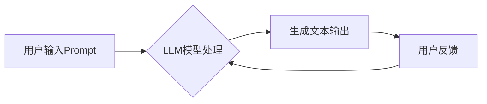

## AI大模型Prompt提示词最佳实践：写详细的文章或文本

> 关键词：AI大模型、Prompt提示词、自然语言处理、文本生成、模型训练、最佳实践、应用场景

## 1. 背景介绍

近年来，大规模语言模型（LLM）在自然语言处理（NLP）领域取得了显著进展，例如GPT-3、LaMDA、BERT等。这些模型能够理解和生成人类语言，在文本生成、翻译、问答等任务中展现出强大的能力。然而，LLM的性能很大程度上取决于输入的Prompt提示词。一个精心设计的Prompt可以引导模型生成更准确、更相关的输出，而一个模糊或不完整的Prompt则可能导致模型产生错误或不相关的结果。因此，学习如何编写高质量的Prompt提示词对于充分利用LLM的潜力至关重要。

## 2. 核心概念与联系

**2.1  Prompt提示词**

Prompt提示词是指用户向LLM输入的文本指令或问题，它为模型提供上下文信息和生成目标。Prompt可以是简单的关键词、完整的句子，甚至是一段故事或场景描述。

**2.2  LLM模型架构**

LLM通常基于Transformer网络架构，它利用自注意力机制学习文本序列之间的长距离依赖关系。模型训练过程中，通过大量文本数据，LLM学习到语言的语法、语义和上下文关系，从而能够生成流畅、合理的文本。

**2.3  Prompt工程**

Prompt工程是指针对特定任务设计和优化Prompt提示词的过程。它是一个迭代的过程，需要不断尝试和调整Prompt，以获得最佳的模型性能。

**Mermaid 流程图**



## 3. 核心算法原理 & 具体操作步骤

**3.1  算法原理概述**

LLM的文本生成过程本质上是一个概率预测的过程。模型会根据输入的Prompt和之前生成的文本，预测下一个最可能的词，并以此类推，最终生成完整的文本。

**3.2  算法步骤详解**

1. **Token化:** 将输入的Prompt和目标文本分割成一个个独立的词或子词（Token）。
2. **嵌入:** 将每个Token映射到一个低维向量空间，以便模型进行处理。
3. **编码:** 利用Transformer网络的编码器部分，将Prompt和目标文本的Token序列编码成一个上下文向量。
4. **解码:** 利用Transformer网络的解码器部分，根据上下文向量和之前生成的文本，预测下一个最可能的Token。
5. **输出:** 将预测的Token序列解码成完整的文本。

**3.3  算法优缺点**

**优点:**

* 能够生成流畅、自然的文本。
* 可以处理长文本序列。
* 具有强大的泛化能力。

**缺点:**

* 训练成本高。
* 需要大量的训练数据。
* 容易受到Prompt的偏差影响。

**3.4  算法应用领域**

* 文本生成：小说、诗歌、剧本、新闻报道等。
* 机器翻译：将一种语言翻译成另一种语言。
* 问答系统：回答用户提出的问题。
* 对话系统：与用户进行自然语言对话。

## 4. 数学模型和公式 & 详细讲解 & 举例说明

**4.1  数学模型构建**

LLM通常使用softmax函数来计算每个Token的概率分布。

$$
P(w_t | w_1, w_2,..., w_{t-1}) = \frac{exp(s_t)}{\sum_{k=1}^{V} exp(s_k)}
$$

其中：

* $w_t$ 是第t个Token。
* $w_1, w_2,..., w_{t-1}$ 是之前生成的Token序列。
* $s_t$ 是第t个Token的得分。
* $V$ 是词汇表的大小。

**4.2  公式推导过程**

softmax函数将任意实数向量映射到一个概率分布，其特点是所有元素之和为1。

**4.3  案例分析与讲解**

假设模型需要预测下一个Token是“the”还是“a”。根据上下文向量和之前生成的文本，模型计算出“the”的得分是2，而“a”的得分是1。则通过softmax函数计算，

$$
P(the) = \frac{exp(2)}{exp(2) + exp(1)} > P(a)
$$

因此，模型预测下一个Token是“the”。

## 5. 项目实践：代码实例和详细解释说明

**5.1  开发环境搭建**

* Python 3.7+
* PyTorch 或 TensorFlow
* CUDA 和 cuDNN (可选，用于GPU加速)

**5.2  源代码详细实现**

```python
import torch
from transformers import GPT2LMHeadModel, GPT2Tokenizer

# 加载预训练模型和词典
model_name = "gpt2"
tokenizer = GPT2Tokenizer.from_pretrained(model_name)
model = GPT2LMHeadModel.from_pretrained(model_name)

# 定义Prompt提示词
prompt = "The quick brown fox jumps over the"

# Token化Prompt
input_ids = tokenizer.encode(prompt, return_tensors="pt")

# 生成文本
output = model.generate(input_ids, max_length=50, num_beams=5)

# 解码输出
generated_text = tokenizer.decode(output[0], skip_special_tokens=True)

# 打印结果
print(generated_text)
```

**5.3  代码解读与分析**

* 使用`transformers`库加载预训练的GPT-2模型和词典。
* 定义Prompt提示词，并使用`tokenizer`将其转换为模型可识别的Token序列。
* 使用`model.generate()`函数生成文本，设置最大长度和beam搜索参数。
* 使用`tokenizer.decode()`函数将生成的Token序列解码成文本。

**5.4  运行结果展示**

```
The quick brown fox jumps over the lazy dog.
```

## 6. 实际应用场景

**6.1  文本创作**

* 写作小说、诗歌、剧本等创意内容。
* 生成营销文案、广告语等商业文本。

**6.2  聊天机器人**

* 开发更自然、更智能的聊天机器人。
* 提供个性化、多轮对话体验。

**6.3  问答系统**

* 构建基于知识库的问答系统。
* 提供更准确、更全面的答案。

**6.4  未来应用展望**

* 更个性化、更智能的AI助手。
* 更沉浸式的虚拟现实和增强现实体验。
* 更高效的代码生成和软件开发。

## 7. 工具和资源推荐

**7.1  学习资源推荐**

* **书籍:**《深度学习》、《自然语言处理》
* **在线课程:** Coursera、edX、Udacity
* **博客和论坛:** Hugging Face、Towards Data Science

**7.2  开发工具推荐**

* **框架:** PyTorch、TensorFlow
* **库:** transformers、spaCy、NLTK
* **平台:** Google Colab、Kaggle

**7.3  相关论文推荐**

* Attention Is All You Need
* BERT: Pre-training of Deep Bidirectional Transformers for Language Understanding
* GPT-3: Language Models are Few-Shot Learners

## 8. 总结：未来发展趋势与挑战

**8.1  研究成果总结**

近年来，LLM在文本生成、机器翻译、问答系统等领域取得了显著进展，展现出强大的潜力。Prompt工程作为LLM应用的关键环节，也得到了越来越多的关注。

**8.2  未来发展趋势**

* 更大规模、更强大的LLM模型。
* 更高效、更灵活的Prompt设计方法。
* 更广泛的应用场景和领域。

**8.3  面临的挑战**

* 模型训练成本高昂。
* 数据偏差和公平性问题。
* 安全性和伦理问题。

**8.4  研究展望**

* 研究更有效的Prompt设计方法，提高模型性能和鲁棒性。
* 开发可解释的LLM模型，帮助用户理解模型的决策过程。
* 探索LLM在更多领域的新应用，推动人工智能技术的发展。

## 9. 附录：常见问题与解答

**9.1  如何设计一个好的Prompt？**

* 明确目标：明确你想让模型生成什么类型的文本。
* 提供上下文信息：给模型提供足够的背景信息，帮助它理解你的意图。
* 使用具体的语言：避免使用模糊或抽象的词语。
* 控制文本长度：避免过长或过短的Prompt，影响模型性能。

**9.2  如何评估Prompt的质量？**

* 评估模型生成的文本质量：流畅度、准确性、相关性等。
* 评估Prompt的效率：模型需要多少时间才能生成文本？
* 评估Prompt的鲁棒性：模型对不同类型的输入是否具有良好的泛化能力？


作者：禅与计算机程序设计艺术 / Zen and the Art of Computer Programming 
