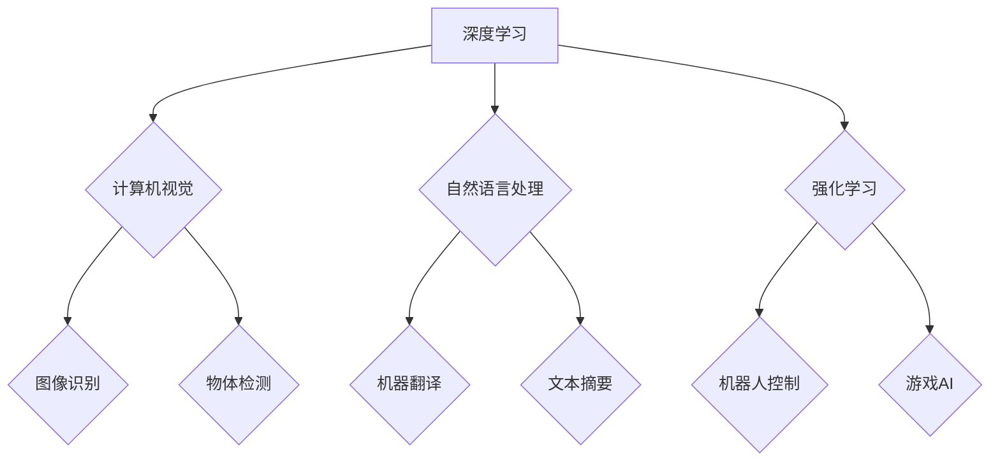

## Andrej Karpathy：人工智能的未来发展前景

> 关键词：人工智能、深度学习、计算机视觉、自然语言处理、强化学习、模型压缩、可解释性

### 1. 背景介绍

人工智能（AI）正以惊人的速度发展，深刻地改变着我们生活和工作的方式。作为AI领域的领军人物之一，Andrej Karpathy 在深度学习、计算机视觉和自然语言处理等领域做出了杰出的贡献。他的研究成果和洞察力为我们理解AI的未来发展方向提供了宝贵的指引。

Andrej Karpathy 是一位计算机科学家，现任特斯拉高级人工智能工程师。他曾在斯坦福大学获得博士学位，并在 OpenAI 和 Google Brain 等顶尖机构工作过。他以其对深度学习的深刻理解和对未来AI发展趋势的敏锐洞察而闻名。

### 2. 核心概念与联系

**2.1 深度学习**

深度学习是机器学习的一个子领域，它利用多层神经网络来模拟人类大脑的学习过程。通过训练大量的样本数据，深度学习模型能够自动学习特征和模式，从而实现对复杂问题的建模和解决。

**2.2 计算机视觉**

计算机视觉是人工智能的一个重要分支，它致力于使计算机能够“看”和理解图像和视频。深度学习在计算机视觉领域取得了突破性的进展，例如图像识别、物体检测、图像分割等。

**2.3 自然语言处理**

自然语言处理（NLP）是人工智能的一个重要领域，它致力于使计算机能够理解和处理人类语言。深度学习在NLP领域也取得了显著的成果，例如机器翻译、文本摘要、情感分析等。

**2.4 强化学习**

强化学习是一种基于奖励机制的机器学习方法，它通过训练智能体在环境中采取最优行动来实现目标。强化学习在机器人控制、游戏 AI 等领域具有广泛的应用前景。

**2.5 模型压缩**

模型压缩是指减少深度学习模型的大小和参数量，从而提高模型的效率和部署能力。模型压缩技术对于将深度学习模型部署到移动设备和嵌入式系统至关重要。

**2.6 可解释性**

可解释性是指能够理解深度学习模型的决策过程和推理机制。提高深度学习模型的可解释性对于增强用户信任和促进模型的应用至关重要。

**Mermaid 流程图**



### 3. 核心算法原理 & 具体操作步骤

**3.1 算法原理概述**

深度学习算法的核心是多层神经网络。神经网络由多个层组成，每一层包含多个神经元。每个神经元接收来自上一层的输入信号，并通过激活函数进行处理，然后将处理后的信号传递到下一层。通过训练大量的样本数据，神经网络能够学习到输入信号和输出信号之间的映射关系。

**3.2 算法步骤详解**

1. **数据预处理:** 将原始数据转换为深度学习模型可以理解的格式。
2. **网络结构设计:** 根据具体任务选择合适的网络结构。
3. **参数初始化:** 为神经网络中的参数赋予初始值。
4. **前向传播:** 将输入数据通过网络层层传递，得到输出结果。
5. **损失函数计算:** 计算模型输出结果与真实值的差异。
6. **反向传播:** 根据损失函数的梯度，调整神经网络的参数。
7. **优化算法:** 使用优化算法（例如梯度下降）更新神经网络的参数。
8. **模型评估:** 使用测试数据评估模型的性能。

**3.3 算法优缺点**

**优点:**

* 能够自动学习特征和模式。
* 能够处理复杂的数据类型。
* 性能优于传统机器学习算法。

**缺点:**

* 需要大量的样本数据进行训练。
* 训练过程耗时和耗能。
* 模型的可解释性较差。

**3.4 算法应用领域**

* 计算机视觉：图像识别、物体检测、图像分割、人脸识别等。
* 自然语言处理：机器翻译、文本摘要、情感分析、对话系统等。
* 强化学习：机器人控制、游戏 AI、自动驾驶等。
* 其他领域：医疗诊断、金融预测、推荐系统等。

### 4. 数学模型和公式 & 详细讲解 & 举例说明

**4.1 数学模型构建**

深度学习模型通常由多个层组成，每一层包含多个神经元。每个神经元接收来自上一层的输入信号，并通过激活函数进行处理，然后将处理后的信号传递到下一层。

**4.2 公式推导过程**

神经网络的输出可以表示为：

$$
y = f(W x + b)
$$

其中：

* $y$ 是网络的输出。
* $x$ 是输入数据。
* $W$ 是权重矩阵。
* $b$ 是偏置向量。
* $f$ 是激活函数。

**4.3 案例分析与讲解**

例如，在图像识别任务中，输入数据是图像像素值，输出是图像类别。神经网络通过学习图像像素值和类别之间的映射关系，从而实现图像识别的功能。

### 5. 项目实践：代码实例和详细解释说明

**5.1 开发环境搭建**

使用 Python 语言和深度学习框架（例如 TensorFlow 或 PyTorch）搭建开发环境。

**5.2 源代码详细实现**

```python
import tensorflow as tf

# 定义神经网络模型
model = tf.keras.models.Sequential([
    tf.keras.layers.Conv2D(32, (3, 3), activation='relu', input_shape=(28, 28, 1)),
    tf.keras.layers.MaxPooling2D((2, 2)),
    tf.keras.layers.Conv2D(64, (3, 3), activation='relu'),
    tf.keras.layers.MaxPooling2D((2, 2)),
    tf.keras.layers.Flatten(),
    tf.keras.layers.Dense(10, activation='softmax')
])

# 编译模型
model.compile(optimizer='adam',
              loss='sparse_categorical_crossentropy',
              metrics=['accuracy'])

# 训练模型
model.fit(x_train, y_train, epochs=5)

# 评估模型
loss, accuracy = model.evaluate(x_test, y_test)
print('Test loss:', loss)
print('Test accuracy:', accuracy)
```

**5.3 代码解读与分析**

这段代码定义了一个简单的卷积神经网络模型，用于手写数字识别任务。模型包含两个卷积层、两个最大池化层、一个扁平化层和一个全连接层。

**5.4 运行结果展示**

训练完成后，模型可以用来识别新的手写数字图像。

### 6. 实际应用场景

**6.1 医疗诊断**

深度学习可以用于分析医学图像，例如 X 光片、CT 扫描和 MRI 图像，帮助医生诊断疾病。

**6.2 金融预测**

深度学习可以用于分析金融数据，例如股票价格、汇率和债券收益率，帮助投资者预测市场趋势。

**6.3 推荐系统**

深度学习可以用于分析用户行为数据，例如浏览历史、购买记录和评分，推荐用户可能感兴趣的产品或服务。

**6.4 未来应用展望**

未来，深度学习将在更多领域得到应用，例如自动驾驶、机器人控制、个性化教育和科学发现等。

### 7. 工具和资源推荐

**7.1 学习资源推荐**

* **书籍:**
    * 深度学习 (Deep Learning) - Ian Goodfellow, Yoshua Bengio, Aaron Courville
    * 构建深度学习模型 (Hands-On Machine Learning with Scikit-Learn, Keras & TensorFlow) - Aurélien Géron
* **在线课程:**
    * 深度学习 Specialization - Andrew Ng (Coursera)
    * fast.ai - Practical Deep Learning for Coders
* **博客和网站:**
    * Andrej Karpathy's Blog: https://karpathy.github.io/
    * OpenAI Blog: https://openai.com/blog/

**7.2 开发工具推荐**

* **深度学习框架:** TensorFlow, PyTorch, Keras
* **编程语言:** Python
* **数据处理工具:** Pandas, NumPy

**7.3 相关论文推荐**

* ImageNet Classification with Deep Convolutional Neural Networks (AlexNet)
* Deep Residual Learning for Image Recognition (ResNet)
* Attention Is All You Need (Transformer)

### 8. 总结：未来发展趋势与挑战

**8.1 研究成果总结**

近年来，深度学习取得了令人瞩目的进展，在计算机视觉、自然语言处理等领域取得了突破性的成果。

**8.2 未来发展趋势**

* **模型效率提升:** 研究更轻量级、更高效的深度学习模型。
* **可解释性增强:** 开发更可解释的深度学习模型，提高用户信任。
* **跨模态学习:** 研究能够处理多种数据类型（例如文本、图像、音频）的深度学习模型。
* **联邦学习:** 研究隐私保护的深度学习方法，例如联邦学习。

**8.3 面临的挑战**

* **数据获取和标注:** 深度学习模型需要大量的样本数据进行训练，数据获取和标注成本高昂。
* **模型解释性:** 深度学习模型的决策过程难以理解，缺乏可解释性。
* **公平性和偏见:** 深度学习模型可能存在公平性和偏见问题，需要进行更深入的研究和解决。

**8.4 研究展望**

未来，深度学习研究将继续朝着更安全、更可靠、更可解释的方向发展。


### 9. 附录：常见问题与解答

**9.1 什么是深度学习？**

深度学习是一种机器学习的子领域，它利用多层神经网络来模拟人类大脑的学习过程。

**9.2 深度学习有哪些应用场景？**

深度学习在计算机视觉、自然语言处理、强化学习等领域都有广泛的应用。

**9.3 如何学习深度学习？**

可以通过阅读书籍、参加在线课程、学习代码示例等方式学习深度学习。

作者：禅与计算机程序设计艺术 / Zen and the Art of Computer Programming 


