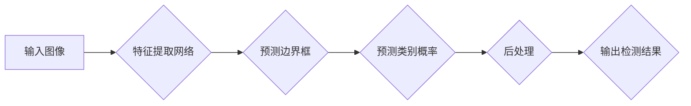

## YOLOv3原理与代码实例讲解

> 关键词：YOLO,目标检测,深度学习,CNN,物体识别,计算机视觉,实时检测

## 1. 背景介绍

目标检测是计算机视觉领域的重要任务之一，旨在识别图像或视频中存在的物体及其位置。传统的目标检测方法通常依赖于手工设计的特征和阶段性检测，效率较低且难以处理复杂场景。近年来，深度学习的兴起为目标检测带来了革命性的改变。

YOLO (You Only Look Once) 是一种基于深度学习的目标检测算法，以其速度快、精度高、易于训练的特点而备受关注。自 YOLOv1 问世以来，YOLO 系列算法不断迭代更新，YOLOv3 是其中最具代表性的版本之一。

YOLOv3 在 YOLOv2 的基础上进行了改进，包括：

* **改进的网络架构:** YOLOv3 使用了 Darknet-53 作为主干网络，该网络具有更深的层数和更强的特征提取能力。
* **多尺度特征融合:** YOLOv3 引入了多尺度特征融合机制，能够更好地捕捉不同尺度的物体特征。
* **改进的损失函数:** YOLOv3 使用了改进的损失函数，能够更好地平衡定位精度和分类精度。
* **新的锚框机制:** YOLOv3 引入了新的锚框机制，能够更好地适应不同形状和大小的物体。

这些改进使得 YOLOv3 在目标检测任务上取得了显著的性能提升。

## 2. 核心概念与联系

YOLOv3 的核心思想是将目标检测任务视为一个回归问题，即预测每个像素属于哪个类别以及该像素中心点到目标物体的中心点的偏移量。

**Mermaid 流程图:**

**核心概念:**

* **特征提取网络:** 用于提取图像的特征表示。YOLOv3 使用 Darknet-53 作为特征提取网络。
* **边界框预测:** 预测目标物体的边界框坐标。
* **类别概率预测:** 预测目标物体所属的类别概率。
* **后处理:** 对检测结果进行筛选和非极大值抑制，去除冗余检测框。

## 3. 核心算法原理 & 具体操作步骤

### 3.1  算法原理概述

YOLOv3 的目标检测算法基于以下核心原理:

* **整体检测:** YOLOv3 将整个图像作为输入，一次性预测所有目标物体的位置和类别。
* **网格划分:** 将输入图像划分为多个网格单元，每个网格单元负责预测该区域内的目标物体。
* **锚框:** 为每个网格单元预设多个锚框，用于预测目标物体的边界框。
* **回归预测:** 预测每个锚框的偏移量，以及每个锚框对应的类别概率。

### 3.2  算法步骤详解

YOLOv3 的目标检测算法具体步骤如下:

1. **输入图像预处理:** 将输入图像调整到指定的大小，并进行归一化处理。
2. **特征提取:** 将预处理后的图像输入到 Darknet-53 网络中进行特征提取。
3. **边界框预测:** 在特征图上每个网格单元处，预测多个锚框的偏移量和类别概率。
4. **非极大值抑制:** 对每个网格单元预测的边界框进行非极大值抑制，去除冗余检测框。
5. **输出检测结果:** 将经过非极大值抑制的检测框及其类别概率作为最终检测结果输出。

### 3.3  算法优缺点

**优点:**

* **速度快:** YOLOv3 的整体检测速度非常快，能够实现实时目标检测。
* **精度高:** YOLOv3 在目标检测任务上取得了较高的精度。
* **易于训练:** YOLOv3 的训练过程相对简单，易于实现。

**缺点:**

* **对小目标检测能力有限:** YOLOv3 在检测小目标方面仍然存在一定的挑战。
* **边界框预测精度有限:** YOLOv3 的边界框预测精度可能不如一些其他目标检测算法。

### 3.4  算法应用领域

YOLOv3 在目标检测领域具有广泛的应用场景，例如:

* **图像识别:** 自动识别图像中的物体，例如人、车、动物等。
* **视频监控:** 实时监控视频流，检测异常事件。
* **自动驾驶:** 检测道路上的车辆、行人、交通信号灯等。
* **机器人视觉:** 帮助机器人识别周围环境中的物体。

## 4. 数学模型和公式 & 详细讲解 & 举例说明

### 4.1  数学模型构建

YOLOv3 的目标检测模型可以看作是一个回归问题，其目标是预测每个网格单元内的目标物体的位置和类别。

**位置预测:**

对于每个网格单元，YOLOv3 会预测多个锚框的偏移量，这些偏移量表示锚框中心点到目标物体中心点的偏移量。

**类别概率预测:**

对于每个网格单元，YOLOv3 会预测每个类别的概率，表示该网格单元内目标物体属于该类别的概率。

### 4.2  公式推导过程

YOLOv3 的损失函数由边界框预测损失和类别概率预测损失两部分组成。

**边界框预测损失:**

$$L_{bbox} = \lambda_{coord} \cdot L_{coord} + \lambda_{noobj} \cdot L_{noobj}$$

其中:

* $L_{coord}$ 是边界框坐标预测损失。
* $L_{noobj}$ 是背景类损失。
* $\lambda_{coord}$ 和 $\lambda_{noobj}$ 是权重参数。

**类别概率预测损失:**

$$L_{class} = - \sum_{i=1}^{N} \sum_{c=1}^{C} y_{i}^{c} \cdot \log(p_{i}^{c})$$

其中:

* $y_{i}^{c}$ 是目标物体属于类别 $c$ 的标签。
* $p_{i}^{c}$ 是模型预测目标物体属于类别 $c$ 的概率。

### 4.3  案例分析与讲解

假设我们有一个图像，其中包含一个猫的物体。YOLOv3 会将图像划分为多个网格单元，其中一个网格单元包含了猫的物体。

对于该网格单元，YOLOv3 会预测多个锚框的偏移量和类别概率。其中一个锚框的偏移量与猫的物体中心点相匹配，并且该锚框对应的类别概率为猫的类别概率最高。

YOLOv3 的损失函数会根据预测结果与真实标签之间的差异进行计算，并通过反向传播算法更新模型参数。

## 5. 项目实践：代码实例和详细解释说明

### 5.1  开发环境搭建

YOLOv3 的开发环境搭建需要以下软件:

* Python 3.x
* TensorFlow 或 PyTorch 深度学习框架
* CUDA 和 cuDNN (可选，用于 GPU 加速)

### 5.2  源代码详细实现

YOLOv3 的源代码可以从官方 GitHub 仓库下载: https://github.com/ultralytics/yolov3

### 5.3  代码解读与分析

YOLOv3 的源代码主要包含以下部分:

* **网络架构定义:** 定义 Darknet-53 网络的结构。
* **数据加载:** 加载训练数据和验证数据。
* **训练流程:** 定义训练模型的流程，包括数据预处理、模型训练、模型评估等。
* **推理流程:** 定义使用训练好的模型进行目标检测的流程。

### 5.4  运行结果展示

使用 YOLOv3 进行目标检测后，会输出检测结果，包括目标物体的边界框坐标和类别概率。

## 6. 实际应用场景

YOLOv3 在实际应用场景中具有广泛的应用价值，例如:

* **无人驾驶:** 检测道路上的车辆、行人、交通信号灯等，帮助无人驾驶汽车安全行驶。
* **安防监控:** 实时监控视频流，检测异常事件，例如入侵、火灾等。
* **医疗诊断:** 检测医学图像中的病灶，辅助医生进行诊断。
* **工业自动化:** 检测工业生产线上的缺陷，提高生产效率。

### 6.4  未来应用展望

随着深度学习技术的不断发展，YOLOv3 的应用场景将会更加广泛。未来，YOLOv3 可能应用于以下领域:

* **增强现实:** 在增强现实场景中，YOLOv3 可以用于识别周围环境中的物体，并将其与虚拟物体融合。
* **机器人交互:** YOLOv3 可以帮助机器人识别周围环境中的物体，并进行相应的交互。
* **智能家居:** YOLOv3 可以用于识别家庭成员和物品，并提供个性化的服务。

## 7. 工具和资源推荐

### 7.1  学习资源推荐

* **YOLOv3 官方文档:** https://pjreddie.com/darknet/yolo/
* **YOLOv3 GitHub 仓库:** https://github.com/ultralytics/yolov3
* **深度学习教程:** https://www.tensorflow.org/tutorials

### 7.2  开发工具推荐

* **TensorFlow:** https://www.tensorflow.org/
* **PyTorch:** https://pytorch.org/
* **Darknet:** https://pjreddie.com/darknet/

### 7.3  相关论文推荐

* **You Only Look Once: Unified, Real-Time Object Detection:** https://arxiv.org/abs/1506.02640
* **YOLO9000: Better, Faster, Stronger:** https://arxiv.org/abs/1612.08242
* **YOLOv3: An Incremental Improvement:** https://arxiv.org/abs/1804.02767

## 8. 总结：未来发展趋势与挑战

### 8.1  研究成果总结

YOLOv3 作为一种高效的实时目标检测算法，取得了显著的成果，在速度、精度和易用性方面都表现出色。

### 8.2  未来发展趋势

未来目标检测算法的发展趋势包括:

* **更高效的算法:** 追求更快的检测速度，以满足实时应用的需求。
* **更强的泛化能力:** 能够在不同场景和数据集上表现出色。
* **更小的模型尺寸:** 降低模型部署的成本和复杂度。
* **更强的解释性:** 能够解释模型的检测结果，提高用户信任度。

### 8.3  面临的挑战

目标检测算法仍然面临一些挑战，例如:

* **小目标检测:** 对于尺寸较小的物体，检测精度仍然存在提升空间。
* **多尺度目标检测:** 对于不同尺度的物体，检测精度需要保持一致。
* **场景理解:** 目标检测算法需要具备更强的场景理解能力，才能更好地处理复杂场景。

### 8.4  研究展望

未来目标检测算法的研究方向包括:

* **探索新的网络架构:** 设计更深、更宽、更有效的网络架构。
* **改进数据增强方法:** 开发更有效的图像数据增强方法，提高模型泛化能力。
* **结合其他技术:** 将目标检测算法与其他技术，例如语义分割、三维重建等结合，实现更高级的应用。

## 9. 附录：常见问题与解答

**Q1: YOLOv3 的速度和精度相比其他目标检测算法如何？**

**A1:** YOLOv3 在速度和精度方面都表现出色，尤其是在实时目标检测任务中。

**Q2: YOLOv3 的训练过程复杂吗？**

**A2:** YOLOv3 的训练过程相对简单，可以使用现有的深度学习框架进行训练。

**Q3: YOLOv3 可以用于哪些应用场景？**

**A3:** YOLOv3 可以用于各种目标检测应用场景，例如无人驾驶、安防监控、医疗诊断等。

**Q4: 如何部署 YOLOv3 模型？**