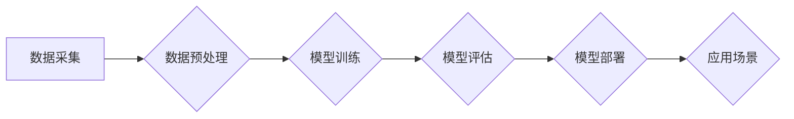

## 【大模型应用开发 动手做AI Agent】说说OpenAI这家公司

> 关键词：OpenAI, 大模型, AI Agent, GPT-3, DALL-E, 

## 1. 背景介绍

OpenAI是一家总部位于美国旧金山的非营利人工智能研究公司，成立于2015年，由Elon Musk、Sam Altman、Greg Brockman、Ilya Sutskever、Wojciech Zaremba等科技界大佬共同创立。OpenAI的使命是确保通用人工智能（AGI）造福全人类，并致力于开发安全、可靠、透明的人工智能技术。

自成立以来，OpenAI在人工智能领域取得了突破性的进展，开发出许多备受瞩目的模型，例如GPT-3、DALL-E、Codex等。这些模型在自然语言处理、图像生成、代码生成等领域展现出强大的能力，引发了全球范围内的关注和讨论。

## 2. 核心概念与联系

OpenAI的核心概念是**通用人工智能（AGI）**，即能够执行人类任何智能任务的机器智能。为了实现AGI，OpenAI专注于研究和开发**深度学习**算法，并构建了庞大的**训练数据集**。

OpenAI的模型架构通常基于**Transformer**网络，这种网络结构能够有效地处理序列数据，例如文本和代码。

**Mermaid 流程图**



## 3. 核心算法原理 & 具体操作步骤

### 3.1  算法原理概述

OpenAI的核心算法是**深度学习**，特别是**Transformer**网络。Transformer网络通过**自注意力机制**学习文本中的语义关系，能够捕捉长距离依赖关系，从而实现更准确的文本理解和生成。

### 3.2  算法步骤详解

1. **数据采集:** 收集大量文本数据，例如书籍、文章、代码等。
2. **数据预处理:** 对数据进行清洗、格式化、分词等处理，使其适合模型训练。
3. **模型训练:** 使用深度学习算法训练Transformer网络模型，通过调整模型参数，使其能够准确地预测文本序列。
4. **模型评估:** 使用测试数据评估模型的性能，例如准确率、困惑度等指标。
5. **模型部署:** 将训练好的模型部署到服务器或云平台，使其能够接受用户请求并进行文本生成或理解任务。

### 3.3  算法优缺点

**优点:**

* 能够处理大量文本数据，学习复杂的语义关系。
* 准确率高，能够生成高质量的文本。
* 可迁移性强，可以应用于多种文本任务。

**缺点:**

* 训练成本高，需要大量的计算资源和时间。
* 数据依赖性强，模型性能受训练数据质量影响。
* 可解释性差，难以理解模型的决策过程。

### 3.4  算法应用领域

* **自然语言处理:** 文本生成、机器翻译、问答系统、文本摘要等。
* **代码生成:** 自动生成代码、代码补全、代码翻译等。
* **图像生成:** 根据文本描述生成图像、图像编辑等。
* **语音识别:** 将语音转换为文本。
* **人机交互:** 聊天机器人、虚拟助手等。

## 4. 数学模型和公式 & 详细讲解 & 举例说明

### 4.1  数学模型构建

OpenAI的模型通常基于Transformer网络，其核心是**自注意力机制**。自注意力机制通过计算每个词与所有其他词之间的相关性，学习文本中的语义关系。

### 4.2  公式推导过程

**注意力权重计算公式:**

$$
\text{Attention}(Q, K, V) = \text{softmax}\left(\frac{Q K^T}{\sqrt{d_k}}\right) V
$$

其中:

* $Q$：查询矩阵
* $K$：键矩阵
* $V$：值矩阵
* $d_k$：键向量的维度
* $\text{softmax}$：softmax函数

**自注意力机制**通过计算每个词与所有其他词之间的注意力权重，将每个词的上下文信息聚合起来，从而学习文本中的语义关系。

### 4.3  案例分析与讲解

例如，在句子“我爱吃苹果”中，自注意力机制会计算每个词与所有其他词之间的注意力权重。

* “我”与“爱”的注意力权重较高，因为它们是主语和谓语，关系密切。
* “我”与“苹果”的注意力权重较低，因为它们之间没有直接关系。

通过学习这些注意力权重，模型能够理解句子中的语义关系，并生成更准确的文本。

## 5. 项目实践：代码实例和详细解释说明

### 5.1  开发环境搭建

OpenAI提供了一系列API和工具，方便开发者使用其模型。

* **OpenAI API:** 提供访问GPT-3、DALL-E等模型的接口。
* **HuggingFace:** 一个开源机器学习平台，提供许多预训练的OpenAI模型。

### 5.2  源代码详细实现

以下是一个使用OpenAI API生成文本的简单代码示例：

```python
import openai

openai.api_key = "YOUR_API_KEY"

response = openai.Completion.create(
  engine="text-davinci-003",
  prompt="写一首关于春天的诗",
  max_tokens=100
)

print(response.choices[0].text)
```

### 5.3  代码解读与分析

* `openai.api_key = "YOUR_API_KEY"`: 设置OpenAI API密钥。
* `openai.Completion.create()`: 调用OpenAI API的文本生成接口。
* `engine="text-davinci-003"`: 指定使用的模型。
* `prompt="写一首关于春天的诗"`: 设置文本生成提示。
* `max_tokens=100`: 设置生成的文本长度。

### 5.4  运行结果展示

运行代码后，将输出一首关于春天的诗。

## 6. 实际应用场景

OpenAI的模型在许多实际应用场景中发挥着重要作用，例如:

* **聊天机器人:** GPT-3可以用于构建更自然、更智能的聊天机器人，能够理解用户的意图并提供更准确的回复。
* **内容创作:** DALL-E可以用于生成高质量的图像，例如广告、插画、艺术作品等。
* **代码生成:** Codex可以用于自动生成代码，提高开发效率。
* **教育:** OpenAI的模型可以用于个性化学习、自动批改作业等。

### 6.4  未来应用展望

随着人工智能技术的不断发展，OpenAI的模型将在更多领域得到应用，例如:

* **医疗保健:** 用于诊断疾病、预测患者风险、辅助手术等。
* **金融:** 用于风险管理、欺诈检测、投资决策等。
* **科学研究:** 用于数据分析、模型预测、药物研发等。

## 7. 工具和资源推荐

### 7.1  学习资源推荐

* **OpenAI官方网站:** https://openai.com/
* **HuggingFace:** https://huggingface.co/
* **DeepLearning.AI:** https://www.deeplearning.ai/

### 7.2  开发工具推荐

* **Python:** https://www.python.org/
* **TensorFlow:** https://www.tensorflow.org/
* **PyTorch:** https://pytorch.org/

### 7.3  相关论文推荐

* **Attention Is All You Need:** https://arxiv.org/abs/1706.03762
* **Language Models are Few-Shot Learners:** https://arxiv.org/abs/2005.14165

## 8. 总结：未来发展趋势与挑战

### 8.1  研究成果总结

OpenAI在人工智能领域取得了突破性的进展，开发出许多强大的模型，推动了人工智能技术的应用发展。

### 8.2  未来发展趋势

* **模型规模化:** 模型规模将继续扩大，性能将进一步提升。
* **多模态学习:** 模型将能够处理多种数据类型，例如文本、图像、音频等。
* **可解释性增强:** 研究将更加注重模型的可解释性，使其决策过程更加透明。

### 8.3  面临的挑战

* **数据安全和隐私:** 大模型训练需要大量数据，如何保证数据安全和隐私是一个重要挑战。
* **模型偏见:** 模型可能存在偏见，需要进行更深入的公平性研究。
* **伦理问题:** 人工智能技术的快速发展引发了许多伦理问题，需要进行深入的讨论和规范。

### 8.4  研究展望

未来，OpenAI将继续致力于开发更安全、更可靠、更透明的人工智能技术，并将其应用于更多领域，造福人类社会。

## 9. 附录：常见问题与解答

**Q1: OpenAI的模型是开源的吗？**

A1: 部分OpenAI的模型是开源的，例如GPT-Neo、DALL-E Mini等。但一些核心模型，例如GPT-3、DALL-E，是闭源的，需要通过API访问。

**Q2: 如何使用OpenAI的API？**

A2: 需要注册OpenAI账号，获取API密钥，然后使用Python等编程语言调用API接口。

**Q3: OpenAI的模型训练成本高吗？**

A3: 是的，OpenAI的模型训练成本很高，需要大量的计算资源和时间。

**Q4: OpenAI的模型存在哪些风险？**

A4: OpenAI的模型可能存在数据安全、隐私、偏见、伦理等风险，需要谨慎使用。


作者：禅与计算机程序设计艺术 / Zen and the Art of Computer Programming 
