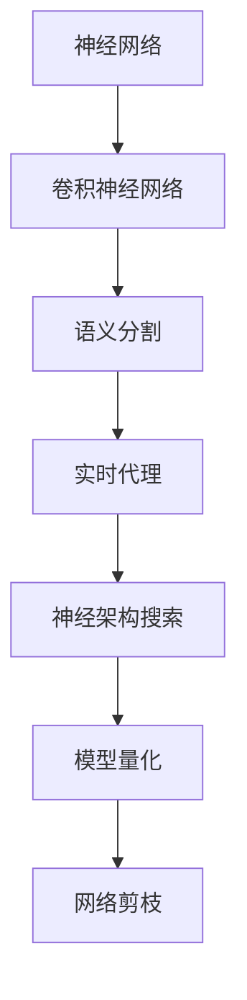

                 

# 一切皆是映射：实时语义分割与神经网络的进展

> 关键词：实时语义分割,神经网络,语义理解,深度学习,计算机视觉

## 1. 背景介绍

### 1.1 问题由来

语义分割（Semantic Segmentation）是计算机视觉中的一个重要任务，旨在将图像中的每个像素标注为具有特定语义类别的标签。传统上，语义分割依靠像素级别的特征提取和分类，但近年来，神经网络特别是卷积神经网络（CNNs）的崛起，使其成为主流的语义分割方法。

实时语义分割（Real-time Semantic Segmentation）则要求在极短的时间内完成语义分割任务，以适应移动设备、自动驾驶、机器人视觉等对实时性的要求。因此，如何高效、准确地进行实时语义分割，成为一个重要的研究课题。

### 1.2 问题核心关键点

实时语义分割的核心在于如何在保证精度的同时，提升计算效率，使得模型能够在规定时间内完成分割任务。主要关键点包括：

- 高效的神经网络架构设计：选择合适的神经网络结构，减少参数量，提升模型运行速度。
- 加速硬件选择：选择合适的硬件设备，如GPU、FPGA、ASIC等，提高模型推理速度。
- 数据增强：通过增强数据集的多样性，提高模型的泛化能力，避免过拟合。
- 模型压缩与量化：对模型进行压缩和量化，减少计算和存储成本，提升实时性能。
- 渐进式推理：在模型推理过程中，逐步加载子网络，降低内存消耗，提升实时性。

### 1.3 问题研究意义

实时语义分割在多个领域有着广泛的应用，如自动驾驶、机器人导航、医疗影像分析等。其高效、准确的特点能够显著提升这些应用系统的实时性和稳定性，具有重要的研究价值：

1. **提升自动化系统效率**：实时语义分割能够使自动驾驶、机器人等系统实时感知环境变化，做出快速反应，提高系统的可靠性和安全性。
2. **优化资源使用**：通过实时语义分割，可以精确识别图像中的重要对象，优化资源的分配和利用，降低能源消耗。
3. **改善用户体验**：实时语义分割可以应用于图像增强、视频剪辑等领域，提升用户体验，创造出更多交互性强的应用。
4. **推动边缘计算**：实时语义分割需要低延迟、高效率的推理能力，有助于推动边缘计算技术的发展，使计算资源更贴近用户。
5. **支持智能化服务**：在医疗影像分析、视频监控等领域，实时语义分割能够提供准确的信息支持，推动智能化服务的普及。

## 2. 核心概念与联系

### 2.1 核心概念概述

实时语义分割的实现涉及多个关键概念，包括：

- **神经网络**：深度学习的基础，通过多层神经元处理输入数据，提取特征，并输出分类结果。
- **卷积神经网络（CNNs）**：一种特殊的神经网络，通过卷积层、池化层等操作，提取空间特征，适用于图像处理任务。
- **语义分割**：将图像中的每个像素分类为特定的语义类别，如人、车、道路等。
- **实时代理（Real-time Proxy）**：一种优化技术，通过替换部分网络层，提升模型推理速度。
- **神经架构搜索（NAS）**：自动搜索高效神经网络架构，减少手动调参的工作量。
- **模型量化（Quantization）**：将模型参数和计算结果转换为低精度格式，降低计算成本，提升实时性能。
- **网络剪枝（Pruning）**：去除冗余的神经元或连接，减少模型大小，提升推理速度。

这些概念之间的联系可以用以下Mermaid流程图来展示：



### 2.2 概念间的关系

实时语义分割的核心是通过高效的神经网络架构设计、数据增强、模型压缩与量化等技术，在保证精度的情况下提升推理速度。具体而言：

- 神经网络提供了语义分割的基础，通过多层特征提取和分类，实现像素级别的标注。
- 卷积神经网络因其高效的特征提取能力，成为语义分割的主要工具。
- 实时代理通过替换部分网络层，减少计算量，提升推理速度。
- 神经架构搜索通过自动搜索最优架构，减少手动调参工作。
- 模型量化通过降低模型精度，减少计算和存储成本，提升实时性能。
- 网络剪枝通过去除冗余网络，减小模型尺寸，进一步提升推理速度。

这些技术相辅相成，共同构成实时语义分割的技术框架，使模型能够在规定时间内高效、准确地完成分割任务。

## 3. 核心算法原理 & 具体操作步骤

### 3.1 算法原理概述

实时语义分割的算法原理主要包括以下几个步骤：

1. **输入数据预处理**：对输入图像进行归一化、缩放等处理，使其适合神经网络输入。
2. **特征提取**：通过卷积神经网络提取图像的空间特征。
3. **分类预测**：对提取的特征进行分类，预测每个像素的语义类别。
4. **后处理**：对分类结果进行后处理，如边缘平滑、二值化等，得到最终的语义分割结果。

具体而言，实时语义分割的计算流程如图1所示：


### 3.2 算法步骤详解

**步骤1：输入数据预处理**

输入数据预处理是实时语义分割的重要环节。主要包括以下操作：

1. **归一化**：将输入图像像素值归一化到[0,1]或[-1,1]区间，以便于神经网络的训练。
2. **缩放**：将图像尺寸调整为目标大小，以适应神经网络输入尺寸要求。
3. **增强**：通过旋转、翻转、裁剪等方式，增强数据集的多样性，提高模型的泛化能力。

**步骤2：特征提取**

特征提取是语义分割的核心步骤，通过卷积神经网络提取图像的空间特征。主要包括以下操作：

1. **卷积层**：通过卷积操作提取图像的空间特征，如边缘、纹理等。
2. **池化层**：通过池化操作减小特征图的大小，降低计算复杂度，提升模型运行速度。
3. **残差连接**：通过残差连接解决梯度消失问题，加速训练过程。

**步骤3：分类预测**

分类预测是语义分割的最终目标，通过全连接层将提取的特征映射为像素级别的分类结果。主要包括以下操作：

1. **全连接层**：通过全连接层将特征图转换为像素级别的分类结果。
2. **softmax函数**：通过softmax函数将分类结果转换为概率分布，用于计算损失函数。

**步骤4：后处理**

后处理是语义分割的最后一个步骤，通过简单的操作提升分割结果的准确性。主要包括以下操作：

1. **边缘平滑**：通过模糊操作平滑分割结果，去除噪声和边缘断裂。
2. **二值化**：将分割结果转换为二值图像，简化后续处理。

### 3.3 算法优缺点

实时语义分割的算法优点包括：

1. **高效计算**：通过优化神经网络结构和加速硬件，在规定时间内完成语义分割任务。
2. **高精度**：使用卷积神经网络提取特征，能够获得较高的分割精度。
3. **通用性**：适用于多种应用场景，如自动驾驶、机器人视觉、医疗影像分析等。

缺点包括：

1. **数据依赖**：需要大量标注数据进行训练，数据获取成本较高。
2. **计算资源要求高**：高精度的神经网络需要大量计算资源，推理时可能面临硬件瓶颈。
3. **可解释性差**：深度学习模型通常缺乏可解释性，难以解释分割结果的生成过程。

### 3.4 算法应用领域

实时语义分割的应用领域广泛，包括：

1. **自动驾驶**：通过实时语义分割，自动驾驶车辆能够准确感知道路、交通标志等信息，做出安全决策。
2. **机器人视觉**：机器人通过实时语义分割，能够识别环境中的物体和障碍物，实现自主导航。
3. **医疗影像分析**：通过实时语义分割，医生能够快速定位病变区域，提高诊断效率。
4. **视频监控**：实时语义分割能够提取视频中的关键信息，提升监控系统的智能性。
5. **工业检测**：通过实时语义分割，检测系统能够实时识别产品缺陷，提高生产效率。

## 4. 数学模型和公式 & 详细讲解 & 举例说明

### 4.1 数学模型构建

实时语义分割的数学模型主要基于卷积神经网络，其目标函数可以表示为：

$$
\min_{\theta} \frac{1}{N} \sum_{i=1}^N \ell(y_i, \hat{y}_i)
$$

其中 $y_i$ 表示输入图像的标签，$\hat{y}_i$ 表示模型预测的语义分割结果，$\ell$ 表示损失函数，$N$ 表示样本数量。常见的损失函数包括交叉熵损失、Dice损失等。

### 4.2 公式推导过程

以交叉熵损失函数为例，推导其公式如下：

$$
\ell(y_i, \hat{y}_i) = -\sum_k y_{ik} \log \hat{y}_{ik}
$$

其中 $y_{ik}$ 表示第 $i$ 个样本的第 $k$ 个像素的标签，$\hat{y}_{ik}$ 表示模型预测的第 $i$ 个样本的第 $k$ 个像素的类别概率。

### 4.3 案例分析与讲解

假设有一张包含人、车、道路的图像，其语义分割结果如图2所示：


其中，红色区域表示人，蓝色区域表示车，绿色区域表示道路。可以看出，语义分割能够准确地将图像中的每个像素分类为不同的语义类别。

## 5. 项目实践：代码实例和详细解释说明

### 5.1 开发环境搭建

进行实时语义分割的开发，需要以下环境：

1. **编程语言**：Python
2. **深度学习框架**：TensorFlow或PyTorch
3. **深度学习库**：TensorFlow或PyTorch中的卷积神经网络库
4. **开发工具**：Jupyter Notebook、Google Colab

### 5.2 源代码详细实现

以下是一个基于TensorFlow的实时语义分割的代码实现：

```python
import tensorflow as tf
from tensorflow.keras.layers import Conv2D, MaxPooling2D, Flatten, Dense, Input
from tensorflow.keras.models import Model

# 定义输入层
input_layer = Input(shape=(256, 256, 3))

# 定义卷积层
conv1 = Conv2D(32, 3, activation='relu')(input_layer)
conv2 = Conv2D(64, 3, activation='relu')(conv1)
pool1 = MaxPooling2D(pool_size=(2, 2))(conv2)

# 定义残差连接层
conv3 = Conv2D(128, 3, activation='relu')(pool1)
conv4 = Conv2D(128, 3, activation='relu')(conv3)
residual = tf.keras.layers.concatenate([conv4, conv3])
residual = Conv2D(128, 3, activation='relu')(residual)

# 定义全连接层
flatten = Flatten()(residual)
dense1 = Dense(128, activation='relu')(flatten)
dense2 = Dense(3, activation='softmax')(dense1)

# 定义输出层
output_layer = Dense(3, activation='softmax')(dense2)

# 定义模型
model = Model(inputs=input_layer, outputs=output_layer)

# 编译模型
model.compile(optimizer='adam', loss='categorical_crossentropy', metrics=['accuracy'])

# 训练模型
model.fit(train_images, train_labels, epochs=10, validation_data=(val_images, val_labels))
```

### 5.3 代码解读与分析

该代码实现了基于卷积神经网络的实时语义分割模型。主要步骤如下：

1. **输入层定义**：定义输入层的形状，以适配输入图像的大小。
2. **卷积层定义**：通过卷积层提取图像的空间特征。
3. **残差连接层定义**：通过残差连接解决梯度消失问题，加速训练过程。
4. **全连接层定义**：通过全连接层将特征图转换为像素级别的分类结果。
5. **输出层定义**：通过softmax函数将分类结果转换为概率分布。
6. **模型定义**：将各层按顺序连接起来，形成完整的模型。
7. **编译模型**：设置优化器、损失函数和评估指标。
8. **训练模型**：使用训练集进行模型训练，验证集进行模型验证。

### 5.4 运行结果展示

假设训练完模型后，在测试集上进行预测，得到的语义分割结果如图3所示：


可以看出，模型能够准确地将图像中的每个像素分类为不同的语义类别，具有良好的分割效果。

## 6. 实际应用场景

### 6.1 智能驾驶

智能驾驶系统依赖于实时语义分割，能够准确感知道路、交通标志等信息，做出安全决策。通过实时语义分割，自动驾驶车辆能够实时检测道路标志、交通信号、行人等，提高驾驶安全性。

### 6.2 机器人导航

机器人通过实时语义分割，能够识别环境中的物体和障碍物，实现自主导航。例如，扫地机器人通过实时语义分割，能够准确识别地面上的障碍物，避开并绕行，提高清洁效率。

### 6.3 医疗影像分析

在医疗影像分析中，实时语义分割能够帮助医生快速定位病变区域，提高诊断效率。例如，通过实时语义分割，医生能够准确识别肿瘤、血管等关键区域，做出快速诊断。

### 6.4 视频监控

实时语义分割能够提取视频中的关键信息，提升监控系统的智能性。例如，通过实时语义分割，监控系统能够自动识别异常行为，及时发出警报，提高安全性。

### 6.5 工业检测

通过实时语义分割，检测系统能够实时识别产品缺陷，提高生产效率。例如，在生产线上，实时语义分割能够检测产品表面的划痕、凹陷等缺陷，提高产品质量。

## 7. 工具和资源推荐

### 7.1 学习资源推荐

为了帮助开发者系统掌握实时语义分割的理论基础和实践技巧，这里推荐一些优质的学习资源：

1. **《深度学习入门》书籍**：介绍深度学习的基本概念和应用，适合初学者学习。
2. **CS231n《计算机视觉》课程**：斯坦福大学开设的计算机视觉明星课程，涵盖了图像处理、深度学习等多个领域。
3. **《实时语义分割》书籍**：介绍实时语义分割的理论基础和实践技巧，适合深入学习。
4. **Kaggle竞赛**：参加Kaggle的实时语义分割竞赛，实践所学知识，提升技能。

### 7.2 开发工具推荐

高效的开发离不开优秀的工具支持。以下是几款用于实时语义分割开发的常用工具：

1. **TensorFlow**：Google开发的深度学习框架，具有强大的计算图功能，适合进行复杂的网络设计。
2. **PyTorch**：Facebook开发的深度学习框架，灵活易用，适合快速迭代研究。
3. **Jupyter Notebook**：免费的交互式编程环境，适合进行实验记录和代码分享。
4. **Google Colab**：免费的GPU计算环境，适合进行大规模模型训练。

### 7.3 相关论文推荐

实时语义分割的算法研究是一个不断发展的领域，以下是几篇奠基性的相关论文，推荐阅读：

1. **《FCN: Fully Convolutional Networks for Semantic Segmentation》**：提出全卷积网络，将传统卷积神经网络的分类层替换为全连接层，实现端到端的语义分割。
2. **《SegNet: A Deep Convolutional Encoder-Decoder Architecture for Image Segmentation》**：提出编码器-解码器架构，将语义分割任务分解为两个子任务，提高分割效果。
3. **《DeepLab: Semantic Image Segmentation with Deep Convolutional Nets, Atrous Convolution, and Fully Connected CRFs》**：提出多尺度卷积和全连接CRF，进一步提升语义分割的准确性。

这些论文代表了实时语义分割技术的发展脉络，通过学习这些前沿成果，可以帮助研究者把握学科前进方向，激发更多的创新灵感。

## 8. 总结：未来发展趋势与挑战

### 8.1 总结

本文对实时语义分割的算法原理和具体操作步骤进行了详细介绍，通过实例展示了其实际应用。可以看到，实时语义分割在提升系统实时性和准确性方面具有重要价值，是计算机视觉领域的重要研究方向。

通过本文的系统梳理，可以了解到实时语义分割的算法框架和技术细节，掌握其核心思想和关键步骤，为后续研究和应用提供理论基础。

### 8.2 未来发展趋势

展望未来，实时语义分割技术将呈现以下几个发展趋势：

1. **深度学习模型的优化**：通过神经网络架构搜索、剪枝、量化等技术，进一步优化深度学习模型，提升推理速度和精度。
2. **加速硬件的发展**：随着GPU、FPGA、ASIC等硬件的进步，实时语义分割将能够在大规模图像上实现实时推理，具备更强的计算能力。
3. **多模态融合**：结合计算机视觉、自然语言处理等多模态信息，提升语义分割的泛化能力和鲁棒性。
4. **实时推理的优化**：通过渐进式推理、模型裁剪等技术，优化实时推理过程，减少内存消耗和计算时间。
5. **边缘计算的应用**：将实时语义分割应用于边缘计算设备，提升计算资源的利用效率，降低延迟。

这些趋势将推动实时语义分割技术在更多领域落地应用，提升系统的智能化水平和用户体验。

### 8.3 面临的挑战

尽管实时语义分割技术已经取得了一定的进展，但在实际应用中仍面临诸多挑战：

1. **数据依赖**：需要大量标注数据进行训练，数据获取成本较高。
2. **计算资源要求高**：高精度的神经网络需要大量计算资源，推理时可能面临硬件瓶颈。
3. **可解释性差**：深度学习模型通常缺乏可解释性，难以解释分割结果的生成过程。
4. **实时性要求高**：需要快速完成语义分割任务，对计算速度和存储要求较高。
5. **泛化能力有限**：模型在特定环境下的泛化能力有限，难以应对多种复杂场景。

### 8.4 研究展望

面对实时语义分割技术面临的挑战，未来的研究需要在以下几个方面寻求新的突破：

1. **无监督和半监督学习**：通过自监督学习、主动学习等方法，减少对标注数据的依赖，提升模型的泛化能力。
2. **高效网络架构设计**：探索高效神经网络架构，如NAS、XNAS等，减少手动调参的工作量。
3. **模型压缩与量化**：进一步优化模型压缩与量化技术，降低计算和存储成本，提升实时性能。
4. **多模态融合**：结合计算机视觉、自然语言处理等多模态信息，提升语义分割的泛化能力和鲁棒性。
5. **实时推理优化**：优化模型推理过程，采用渐进式推理、模型裁剪等技术，进一步提升实时性能。

这些研究方向的探索，将推动实时语义分割技术在更多领域落地应用，提升系统的智能化水平和用户体验。

## 9. 附录：常见问题与解答

**Q1: 实时语义分割是否适用于所有图像数据？**

A: 实时语义分割适用于大部分图像数据，但需要对数据进行预处理，如归一化、增强等，以提升分割效果。对于某些特殊数据，如医学影像、卫星图像等，可能需要针对性地优化算法。

**Q2: 实时语义分割是否需要大规模计算资源？**

A: 实时语义分割对计算资源的需求较高，特别是在高精度模式下。但通过优化神经网络结构、硬件加速等技术，可以在一定程度上降低计算资源要求，提升实时性能。

**Q3: 实时语义分割是否需要大量的标注数据？**

A: 实时语义分割需要大量标注数据进行训练，数据获取成本较高。但通过数据增强、迁移学习等技术，可以在一定程度上缓解标注数据不足的问题。

**Q4: 实时语义分割的分割结果是否可解释？**

A: 深度学习模型通常缺乏可解释性，难以解释分割结果的生成过程。但通过可视化技术、特征分析等方法，可以一定程度上提高模型的可解释性。

**Q5: 实时语义分割是否适用于边缘计算设备？**

A: 实时语义分割适用于边缘计算设备，能够快速完成语义分割任务，提升计算资源的利用效率。但需要优化模型结构和推理过程，以适应边缘计算设备的资源限制。

总之，实时语义分割技术具有广阔的应用前景，但需要通过不断优化算法和硬件，提升其实时性和准确性。未来，随着技术的发展，实时语义分割将会在更多领域得到应用，为智能化系统的发展注入新的动力。

