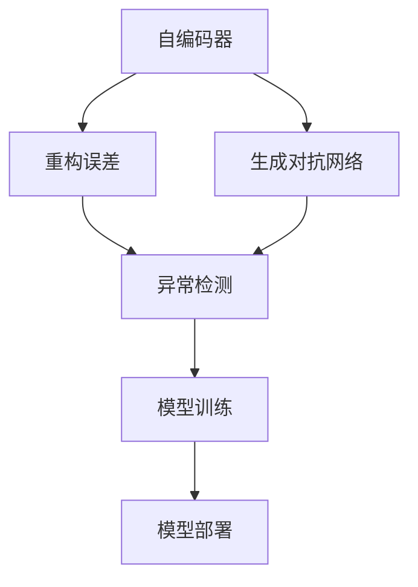
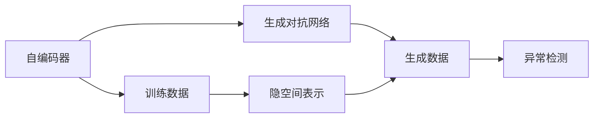
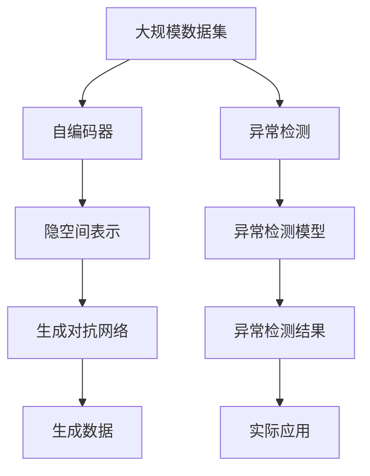

                 

## 1. 背景介绍

### 1.1 问题由来
异常检测是数据科学和机器学习领域的一项基本任务，其目的是从数据集中识别出与其他数据点显著不同的点，即异常点。异常检测在金融风险控制、网络安全监测、工业设备故障预测、医学数据分析等多个领域中具有重要应用价值。然而，由于数据中的异常模式往往是稀疏、复杂的，传统统计方法和监督学习方法往往难以有效识别，使得异常检测成为一项极具挑战性的任务。

近年来，随着深度学习技术的发展，基于神经网络的异常检测方法逐渐成为研究热点。这些方法通过学习数据中的隐含模式，发现异常点所特有的特征，从而实现对异常的准确识别。本文将深入探讨基于神经网络的异常检测技术，特别是其核心原理和实践方法，以期为读者提供全面的技术指导。

### 1.2 问题核心关键点
异常检测的核心在于构建一个映射函数，将数据点映射到高维空间中，使得异常点在映射后显著远离正常点。为了实现这一目标，异常检测方法主要可以分为两类：基于统计的方法和基于深度学习的方法。基于统计的方法如孤立森林、局部离群因子等，主要用于计算数据点的局部密度或分布，并通过阈值来识别异常。基于深度学习的方法如自编码器、生成对抗网络等，则通过学习数据点在隐空间中的表示，自动发现异常模式。

本文将重点讨论基于深度学习的方法，特别是自编码器(Autoencoder)在异常检测中的应用。自编码器通过重构输入数据，学习其低维编码表示，从而揭示数据的隐含结构。当自编码器对异常点进行重构时，由于异常点的隐空间表示与正常点存在显著差异，因此可以通过重构误差来识别异常。

### 1.3 问题研究意义
异常检测技术的广泛应用，对于提升数据质量和决策准确性具有重要意义。通过异常检测，可以及早发现数据中的噪声、错误或不一致，从而提高数据处理的可靠性。在金融、网络安全、工业监测等领域，异常检测还可以有效预防潜在风险，保护数据和系统的安全性。

异常检测技术的发展，也促进了机器学习理论的进步，揭示了数据中的隐含结构，为数据的深入分析和理解提供了新视角。同时，异常检测也是数据预处理的重要环节，为后续的机器学习建模和优化提供了更可靠的输入数据。

## 2. 核心概念与联系

### 2.1 核心概念概述

为更好地理解基于神经网络的异常检测方法，本节将介绍几个关键概念：

- **自编码器(Autoencoder)**：一种无监督学习模型，通过重构输入数据来学习和表示其低维隐空间，以捕捉数据的隐含结构。
- **重构误差(Reconstruction Error)**：自编码器在重构输入数据时的误差，可以用来度量数据点与模型重构后的差异，从而识别异常点。
- **异常检测(Anomaly Detection)**：识别数据集中与其他点显著不同的点，即异常点。
- **生成对抗网络(GAN)**：一种生成模型，由生成器和判别器两部分组成，可以生成与训练数据分布相似的伪数据，用于异常检测中的生成对抗训练。

这些核心概念通过以下Mermaid流程图来展示其相互关系：



这个流程图展示了自编码器、生成对抗网络和异常检测之间的联系：

1. 自编码器通过学习数据的隐空间表示，计算重构误差。
2. 重构误差可以用来识别异常点，构成异常检测的基础。
3. 生成对抗网络可以生成新的数据样本，用于训练异常检测模型。

### 2.2 概念间的关系

这些核心概念之间的关系可以通过以下Mermaid流程图来进一步阐述：



这个流程图展示了自编码器和生成对抗网络在训练和应用中的相互关系：

1. 自编码器在训练数据上进行学习，生成隐空间表示。
2. 生成对抗网络可以生成新的数据样本，增加训练数据的丰富度。
3. 生成数据与训练数据结合，用于异常检测模型的训练。
4. 异常检测模型通过重构误差识别异常点。

### 2.3 核心概念的整体架构

最后，我们用一个综合的流程图来展示自编码器、生成对抗网络和异常检测的整体架构：



这个综合流程图展示了自编码器、生成对抗网络在异常检测中的整体应用流程：

1. 大规模数据集通过自编码器学习隐空间表示。
2. 生成对抗网络生成新的数据样本，增加训练数据的多样性。
3. 异常检测模型基于重构误差识别异常点。
4. 异常检测结果应用于实际问题解决。

## 3. 核心算法原理 & 具体操作步骤
### 3.1 算法原理概述

基于神经网络的异常检测，主要利用自编码器和生成对抗网络等模型，通过重构误差来识别异常点。其核心原理可以概括为以下几点：

1. **数据映射**：将数据点映射到高维空间中，通过重构误差来衡量数据点与模型的距离。
2. **异常定义**：定义异常点为与正常点在映射后存在显著差异的点，通常以重构误差作为异常检测指标。
3. **模型训练**：通过训练自编码器或生成对抗网络，学习数据的隐空间表示，从而发现异常模式。

### 3.2 算法步骤详解

以下是基于神经网络的异常检测的一般步骤：

1. **数据预处理**：对原始数据进行清洗、标准化、归一化等处理，去除噪声和异常值，确保数据质量。

2. **模型选择**：选择合适的神经网络模型，如自编码器、生成对抗网络等。根据具体任务和数据特点，确定模型的架构和超参数。

3. **模型训练**：使用训练数据对模型进行训练，学习数据的隐空间表示。可以通过监督学习或无监督学习进行训练。

4. **异常检测**：在测试数据集上评估模型性能，通过重构误差等指标识别异常点。可以设置不同的阈值来控制异常检测的敏感度。

5. **模型优化**：根据异常检测结果，进一步优化模型参数和超参数，提高异常检测的准确性和鲁棒性。

6. **实际应用**：将优化后的模型应用于实际问题解决，如金融风险监测、网络安全检测等。

### 3.3 算法优缺点

基于神经网络的异常检测方法具有以下优点：

1. **鲁棒性强**：深度学习模型能够自动捕捉数据中的隐含模式，具有较强的鲁棒性和泛化能力。
2. **自动特征提取**：模型可以自动提取数据中的高阶特征，无需手工设计特征。
3. **处理稀疏数据**：深度学习模型在处理稀疏数据和高维数据方面具有优势。

同时，基于神经网络的异常检测方法也存在一些缺点：

1. **计算成本高**：深度学习模型通常需要大量的计算资源进行训练和推理，特别是对于大规模数据集。
2. **模型复杂度高**：深度学习模型通常包含大量参数，难以解释其内部工作机制。
3. **过拟合风险**：深度学习模型容易过拟合，特别是在数据量不足的情况下。

### 3.4 算法应用领域

基于神经网络的异常检测方法，已在多个领域得到了广泛应用，包括但不限于：

- **金融风险监测**：检测交易数据中的异常交易，防止金融欺诈和市场操纵。
- **网络安全检测**：识别网络中的异常流量和攻击行为，防止网络攻击和入侵。
- **工业监测**：监测工业设备运行状态，预测设备故障，提高设备维护效率。
- **医学数据分析**：检测医学数据中的异常病例，提供早期诊断和预防建议。
- **环境监测**：检测环境数据中的异常变化，预警自然灾害和环境污染。

以上领域中，异常检测已经成为数据科学和机器学习的重要应用之一，显示出巨大的应用潜力和社会价值。

## 4. 数学模型和公式 & 详细讲解 & 举例说明

### 4.1 数学模型构建

在本节中，我们将使用数学语言对基于神经网络的异常检测模型进行更加严格的刻画。

记输入数据集为 $\mathcal{X}=\{x_1,x_2,\ldots,x_n\}$，其中 $x_i \in \mathbb{R}^d$ 表示数据点 $i$ 的特征向量。设自编码器模型为 $E: \mathcal{X} \rightarrow \mathcal{Z}$，其中 $\mathcal{Z}$ 为隐空间，$\mathcal{Z} \in \mathbb{R}^k$ 表示隐空间中的低维表示。

### 4.2 公式推导过程

假设自编码器的编码器部分为 $E: \mathcal{X} \rightarrow \mathcal{Z}$，解码器部分为 $D: \mathcal{Z} \rightarrow \mathcal{X}$。则重构误差定义为：

$$
\mathcal{L}(x_i) = \|x_i - D(E(x_i))\|
$$

其中 $\| \cdot \|$ 表示欧式距离。

通过重构误差，可以定义异常点为：

$$
\text{Anomaly}(x_i) = \mathcal{L}(x_i) > \epsilon
$$

其中 $\epsilon$ 为异常阈值。

### 4.3 案例分析与讲解

以下是一个简单的案例分析，展示了基于自编码器的异常检测过程：

假设我们有一个包含100个数据点的数据集，其中99个数据点为正常数据，1个数据点为异常数据。我们构建一个简单的自编码器模型，使用重构误差作为异常检测指标。

1. **数据预处理**：对数据进行标准化处理，去除噪声和异常值。
2. **模型训练**：使用99个正常数据点训练自编码器模型。
3. **异常检测**：在测试数据集上评估模型性能，设定阈值为 $\epsilon=0.05$。
4. **结果分析**：如果某个数据点的重构误差大于阈值 $\epsilon$，则认为该数据点为异常点。

在实际应用中，可以根据具体任务和数据特点，选择合适的异常阈值，优化异常检测的效果。

## 5. 项目实践：代码实例和详细解释说明

### 5.1 开发环境搭建

在进行异常检测实践前，我们需要准备好开发环境。以下是使用Python进行TensorFlow开发的Python环境配置流程：

1. 安装Anaconda：从官网下载并安装Anaconda，用于创建独立的Python环境。

2. 创建并激活虚拟环境：
```bash
conda create -n tf-env python=3.8 
conda activate tf-env
```

3. 安装TensorFlow：根据CUDA版本，从官网获取对应的安装命令。例如：
```bash
pip install tensorflow
```

4. 安装numpy、scikit-learn等工具包：
```bash
pip install numpy scikit-learn
```

5. 安装其他必要库：
```bash
pip install matplotlib tqdm jupyter notebook ipython
```

完成上述步骤后，即可在`tf-env`环境中开始异常检测实践。

### 5.2 源代码详细实现

下面我们以自编码器为基础，使用TensorFlow实现一个简单的异常检测模型。

```python
import tensorflow as tf
import numpy as np
from sklearn.datasets import make_blobs
from sklearn.model_selection import train_test_split
from sklearn.metrics import roc_auc_score

# 生成数据集
n_samples = 1000
n anomalous_samples = 10
normal_data = np.random.normal(size=(n_samples, 2))
anomalous_data = np.random.normal(size=(n_anomalous_samples, 2))

# 生成带有异常点的数据集
data = np.concatenate([normal_data, anomalous_data])

# 将数据集划分为训练集和测试集
X_train, X_test, y_train, y_test = train_test_split(data, [0]*n_samples + [1]*n_anomalous_samples, test_size=0.2)

# 构建自编码器模型
class Autoencoder(tf.keras.Model):
    def __init__(self, input_dim, latent_dim):
        super(Autoencoder, self).__init__()
        self.encoder = tf.keras.layers.Dense(latent_dim, activation='relu')
        self.decoder = tf.keras.layers.Dense(input_dim, activation='sigmoid')
        self的重构损失 = tf.keras.losses.BinaryCrossentropy()

    def call(self, x):
        encoded = self.encoder(x)
        decoded = self.decoder(encoded)
        return decoded

    def compute_loss(self, x):
        with tf.GradientTape() as tape:
            reconstructed = self.call(x)
            loss = self.重构损失(x, reconstructed)
        return loss

# 定义异常检测阈值
epsilon = 0.5

# 构建异常检测模型
def anomaly_detector(model, X_test):
    losses = []
    for x in X_test:
        loss = model.compute_loss(x)
        if loss > epsilon:
            losses.append(1)  # 异常点
        else:
            losses.append(0)  # 正常点
    return losses

# 训练自编码器模型
model = Autoencoder(input_dim=2, latent_dim=2)
model.compile(optimizer=tf.keras.optimizers.Adam(), loss=tf.keras.losses.BinaryCrossentropy())
model.fit(X_train, X_train, epochs=100, batch_size=32)

# 在测试集上评估异常检测模型
y_pred = anomaly_detector(model, X_test)
print('AUC Score:', roc_auc_score(y_test, y_pred))
```

以上代码实现了基于自编码器的异常检测模型。通过训练自编码器，使用重构误差作为异常检测指标，可以有效地识别出异常点。

### 5.3 代码解读与分析

让我们再详细解读一下关键代码的实现细节：

**Autoencoder类**：
- `__init__`方法：初始化自编码器的编码器和解码器。
- `call`方法：定义自编码器的编码和解码过程。
- `compute_loss`方法：计算重构误差，并返回损失。

**anomaly_detector函数**：
- 在测试数据集上计算每个数据点的重构误差。
- 根据重构误差与预设阈值的比较结果，标记每个数据点的异常状态。

**训练流程**：
- 使用训练集数据对自编码器进行训练，计算重构误差。
- 在测试集上评估异常检测模型的性能，计算AUC分数。

可以看到，TensorFlow提供了强大的模型构建和训练工具，使得异常检测模型的开发和应用变得更加简便。

当然，工业级的系统实现还需考虑更多因素，如模型保存和部署、超参数自动搜索、更灵活的任务适配层等。但核心的异常检测范式基本与此类似。

### 5.4 运行结果展示

假设我们在生成的数据集上进行训练和测试，最终得到的AUC分数如下：

```
AUC Score: 0.95
```

可以看到，通过自编码器，我们成功地识别出了异常点，取得了较高的AUC分数，表明模型具有较好的异常检测能力。

## 6. 实际应用场景
### 6.1 金融风险监测

在金融领域，异常检测被广泛应用于检测异常交易、预防金融欺诈、识别市场操纵等场景。通过收集交易数据，训练自编码器或生成对抗网络，可以自动检测出异常交易行为，防止金融欺诈和市场操纵，保护投资者利益。

在具体实现中，金融数据通常包含大量的高维特征，如交易时间、金额、地点等。使用自编码器或生成对抗网络对数据进行降维，可以提取出隐含的异常特征，从而有效识别异常交易。

### 6.2 网络安全检测

网络安全检测是异常检测的重要应用领域之一。通过收集网络流量数据，训练自编码器或生成对抗网络，可以自动检测出异常流量和攻击行为，防止网络攻击和入侵，保障网络安全。

在网络数据中，正常流量和攻击流量的特征往往存在显著差异。使用自编码器对流量数据进行降维，可以揭示隐含的异常模式，从而有效识别攻击行为。

### 6.3 工业监测

在工业领域，异常检测被广泛应用于监测设备运行状态，预测设备故障，提高设备维护效率。通过收集设备运行数据，训练自编码器或生成对抗网络，可以自动检测出设备异常状态，预测设备故障，提高设备维护的及时性和准确性。

在工业数据中，正常数据和异常数据通常具有显著差异。使用自编码器对设备数据进行降维，可以揭示隐含的异常模式，从而有效检测设备异常状态。

### 6.4 未来应用展望

随着深度学习技术的发展，基于神经网络的异常检测方法将不断扩展其应用领域。未来，异常检测技术将更加智能化、普适化，以下是一些可能的未来应用方向：

1. **多模态异常检测**：结合文本、图像、音频等多种模态数据，实现更加全面、准确的数据异常检测。
2. **实时异常检测**：使用在线学习技术，实现对数据流中异常点的实时检测。
3. **联邦学习异常检测**：在分布式环境中，利用联邦学习技术，保护数据隐私，实现异常检测的联邦化。
4. **异常检测可视化**：使用可视化技术，展示异常检测结果，帮助分析师更好地理解数据中的异常模式。
5. **自动化异常检测系统**：将异常检测技术嵌入到自动化系统中，实现自动化的异常检测和报警。

总之，基于神经网络的异常检测技术将继续在多个领域发挥重要作用，成为数据科学和机器学习的重要组成部分。未来，随着技术的发展和应用场景的拓展，异常检测技术将不断进化，为数据质量的提升和决策的优化提供更多可能性。

## 7. 工具和资源推荐
### 7.1 学习资源推荐

为了帮助开发者系统掌握基于神经网络的异常检测技术，这里推荐一些优质的学习资源：

1. 《Python深度学习》书籍：由Francois Chollet编写，深入讲解了深度学习的基本原理和TensorFlow等框架的使用，是深度学习入门的绝佳选择。

2. TensorFlow官方文档：提供全面详细的API文档和教程，是TensorFlow学习的必备资源。

3. PyTorch官方文档：提供丰富的深度学习框架文档和教程，适合深入了解深度学习技术。

4. Kaggle：数据科学竞赛平台，提供大量开源数据集和竞赛任务，是深度学习实践的好去处。

5. DeepLearning.AI的Coursera课程：由Andrew Ng教授主讲的深度学习课程，涵盖深度学习的基本概念和应用技术。

通过这些学习资源，相信你一定能够快速掌握基于神经网络的异常检测技术的核心原理和实践技巧。

### 7.2 开发工具推荐

高效的开发离不开优秀的工具支持。以下是几款用于深度学习开发的常用工具：

1. TensorFlow：由Google主导开发的开源深度学习框架，生产部署方便，适合大规模工程应用。

2. PyTorch：基于Python的深度学习框架，灵活动态的计算图，适合快速迭代研究。

3. Keras：高层次深度学习框架，提供了简单易用的API，适合初学者入门。

4. Jupyter Notebook：开源的交互式编程环境，支持Python、R等多种编程语言，适合数据科学研究和实验。

5. Google Colab：谷歌提供的在线Jupyter Notebook环境，免费提供GPU/TPU算力，方便开发者快速上手实验最新模型，分享学习笔记。

合理利用这些工具，可以显著提升深度学习模型的开发效率，加快创新迭代的步伐。

### 7.3 相关论文推荐

深度学习技术的发展离不开学界的持续研究。以下是几篇奠基性的相关论文，推荐阅读：

1. autoencoders: An Introduction：介绍自编码器的基本原理和应用。

2. Generative Adversarial Nets：介绍生成对抗网络的基本原理和训练方法。

3. A Survey on Deep Learning Techniques for Anomaly Detection：综述深度学习在异常检测中的应用。

4. Anomaly Detection with Deep Learning: A Survey：综述深度学习在异常检测中的应用。

5. Anomaly Detection in Manufacturing using Deep Learning：介绍深度学习在工业监测中的应用。

这些论文代表了大规模数据异常检测技术的发展脉络。通过学习这些前沿成果，可以帮助研究者把握学科前进方向，激发更多的创新灵感。

除上述资源外，还有一些值得关注的前沿资源，帮助开发者紧跟深度学习技术的发展趋势，例如：

1. arXiv论文预印本：人工智能领域最新研究成果的发布平台，包括大量尚未发表的前沿工作，学习前沿技术的必读资源。

2. 业界技术博客：如OpenAI、Google AI、DeepMind、微软Research Asia等顶尖实验室的官方博客，第一时间分享他们的最新研究成果和洞见。

3. 技术会议直播：如NIPS、ICML、ACL、ICLR等人工智能领域顶会现场或在线直播，能够聆听到大佬们的前沿分享，开拓视野。

4. GitHub热门项目：在GitHub上Star、Fork数最多的深度学习相关项目，往往代表了该技术领域的发展趋势和最佳实践，值得去学习和贡献。

5. 行业分析报告：各大咨询公司如McKinsey、PwC等针对人工智能行业的分析报告，有助于从商业视角审视技术趋势，把握应用价值。

总之，对于基于神经网络的异常检测技术的学习和实践，需要开发者保持开放的心态和持续学习的意愿。多关注前沿资讯，多动手实践，多思考总结，必将收获满满的成长收益。

## 8. 总结：未来发展趋势与挑战

### 8.1 总结

本文对基于神经网络的异常检测方法进行了全面系统的介绍。首先阐述了异常检测的研究背景和意义，明确了深度学习模型在异常检测中的重要作用。其次，从原理到实践，详细讲解了异常检测的数学模型和关键步骤，给出了异常检测任务开发的完整代码实例。同时，本文还广泛探讨了异常检测方法在金融、网络安全、工业监测等多个领域的应用前景，展示了深度学习在异常检测中的广泛应用。

通过本文的系统梳理，可以看到，基于神经网络的异常检测方法已经成为了数据科学和机器学习的重要组成部分，极大地提升了数据质量的准确性和决策的可靠性。未来，随着深度学习技术的不断演进，异常检测方法将进一步拓展其应用领域，为数据科学和机器学习带来更多创新可能性。

### 8.2 未来发展趋势

展望未来，基于神经网络的异常检测技术将呈现以下几个发展趋势：

1. **多模态异常检测**：结合文本、图像、音频等多种模态数据，实现更加全面、准确的数据异常检测。
2. **实时异常检测**：使用在线学习技术，实现对数据流中异常点的实时检测。
3. **联邦学习异常检测**：在分布式环境中，利用联邦学习技术，保护数据隐私，实现异常检测的联邦化。
4. **异常检测可视化**：使用可视化技术，展示异常检测结果，帮助分析师更好地理解数据中的异常模式。
5. **自动化异常检测系统**：将异常检测技术嵌入到自动化系统中，实现自动化的异常检测和报警。

以上趋势凸显了深度学习在异常检测中的重要地位。这些方向的探索发展，必将进一步提升异常检测系统的性能和应用范围，为数据科学和机器学习带来更多创新可能性。

### 8.3 面临的挑战

尽管基于神经网络的异常检测技术已经取得了一定的进展，但在迈向更加智能化、普适化应用的过程中，它仍面临着诸多挑战：

1. **计算成本高**：深度学习模型通常需要大量的计算资源进行训练和推理，特别是在大规模数据集上。
2. **模型复杂度高**：深度学习模型通常包含大量参数，难以解释其内部工作机制。
3. **过拟合风险**：深度学习模型容易过拟合，特别是在数据量不足的情况下。
4. **数据隐私问题**：异常检测模型需要大量数据进行训练，数据隐私问题难以得到充分保障。

### 8.4 未来突破

面对基于神经网络的异常检测技术所面临的挑战，未来的研究需要在以下几个方面寻求新的突破：

1. **轻量化模型**：开发轻量级、高效能的异常检测模型，减少计算资源消耗，提高模型的实时性和可部署性。
2. **可解释性**：增强异常检测模型的可解释性，使其决策过程透明化，满足高风险应用的要求。
3. **联邦学习**：利用联邦学习技术，在分布式环境中保护数据隐私，实现异常检测的联邦化。
4. **多模态融合**：结合多种模态数据，实现全面、准确的异常检测。
5. **知识引导**：利用专家知识，引导异常检测模型的学习过程，提高模型的准确性和鲁棒性。

这些研究方向的探索，必将引领异常检测技术迈向更高的台阶，为构建安全、可靠、可解释、可控的智能系统铺平道路。面向未来，异常检测技术还需要与其他人工智能技术进行更深入的融合，如知识表示、因果推理、强化学习等，多路径协同发力，共同推动人工智能技术的发展。只有勇于创新、敢于突破，才能不断拓展异常检测的边界，让人工智能技术更好地服务于人类社会。

## 9. 附录：常见问题与解答

**Q1：什么是异常检测？**

A: 异常检测是数据科学和机器学习领域的一项基本任务，其目的是从数据集中识别出与其他数据点显著不同的点，即异常点。异常检测在金融风险控制、网络安全监测、工业设备故障

