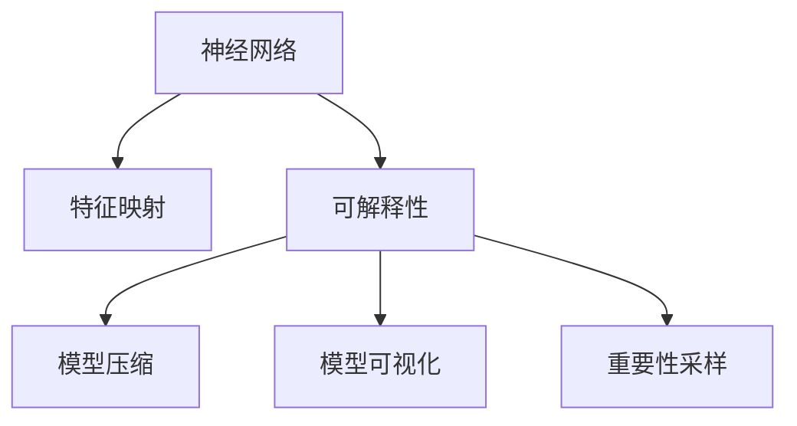
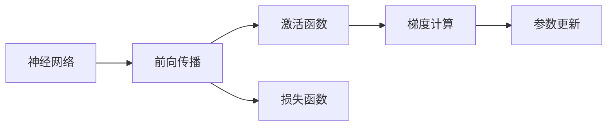
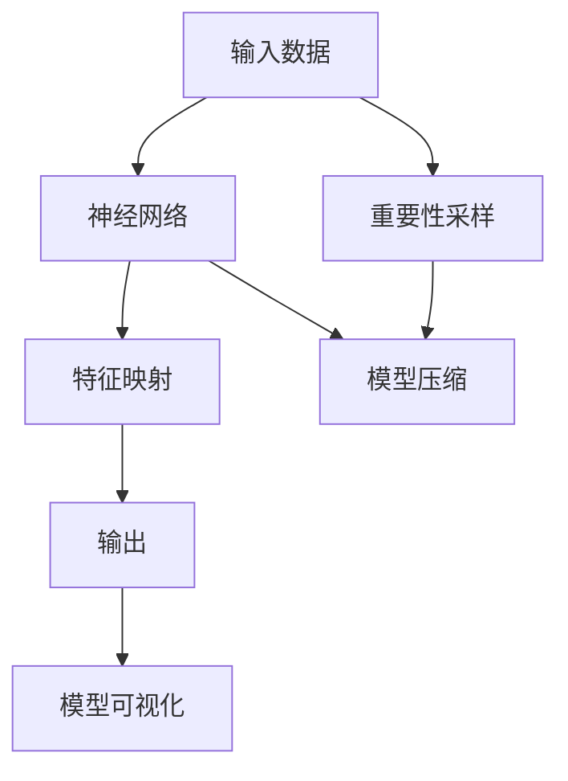
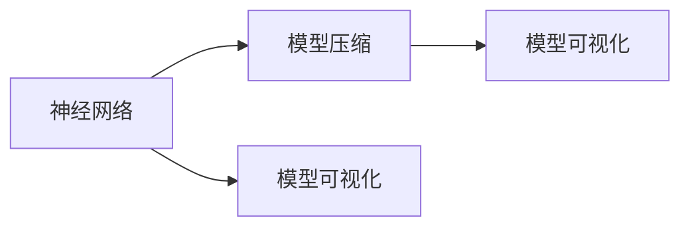
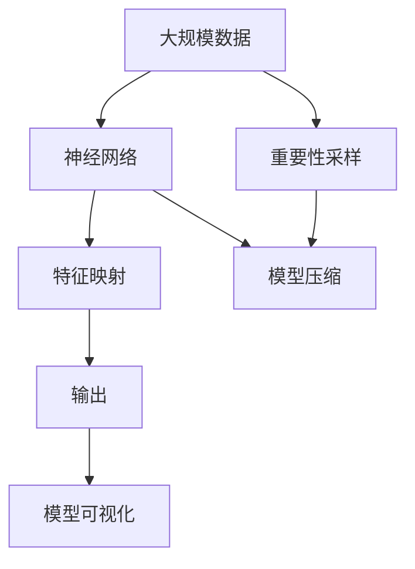

                 

# 一切皆是映射：神经网络的可解释性问题

> 关键词：神经网络,可解释性,特征映射,模型压缩,模型可视化,重要性采样

## 1. 背景介绍

### 1.1 问题由来

随着深度学习技术的快速发展，神经网络在各行各业的应用场景中表现得愈发出色。然而，尽管模型在预测精度上不断攀升，但其内部的决策过程却仍然是一个"黑箱"。模型的复杂性、高维度特征、层数多的结构使得其决策难以理解和解释。

模型的这种特性在金融风控、医疗诊断、司法决策等高风险领域尤为敏感。即便模型预测正确，如果缺乏可解释性，用户仍可能对其输出结果持有质疑态度，导致信赖度降低。此外，神经网络的高维度特征空间，也让研究者难以洞察其决策依据，难以发现潜在问题。因此，可解释性问题已成为制约深度学习应用的一大瓶颈。

### 1.2 问题核心关键点

神经网络的可解释性问题，本质上是模型特征映射的清晰度和可见性不足。模型通过层级结构对输入数据进行逐层映射，将原始特征逐层抽象，最终输出预测结果。但在特征映射过程中，高维度的中间表示使得决策过程变得难以解释，从而引发了一系列问题。

主要包括以下几点：

- 特征不可解释：模型的中间特征无法直观地映射回原始输入，难以理解特征的物理意义和重要性。
- 决策不透明：神经网络的决策路径复杂，难以追踪特定输入对输出的影响。
- 模型不可控：神经网络的内部结构难以修改和调试，无法控制其决策过程。
- 泛化能力差：模型在特定输入的预测效果优秀，但在泛化到新数据上效果不佳，解释困难。

为了缓解这些问题，研究者提出了多种可解释性方法，以期更好地洞察神经网络的决策过程，提升用户对模型的信任度。本文将介绍几种常见的可解释性方法，并通过实例来展示其应用效果。

## 2. 核心概念与联系

### 2.1 核心概念概述

为了更好地理解神经网络的可解释性问题，本节将介绍几个密切相关的核心概念：

- 神经网络：基于人工神经元组成的计算模型，通过层级结构对输入数据进行映射，实现复杂函数的逼近。
- 特征映射：神经网络对输入特征逐层抽象的过程，每层都生成新的特征表示。
- 可解释性：指模型决策过程的可理解性和可解释性，使其输出结果能够被人类理解和接受。
- 模型压缩：指通过减少模型参数、降低模型复杂度，提升模型的可解释性和推理效率。
- 模型可视化：指可视化模型的中间特征和决策路径，帮助理解模型的内部工作机制。
- 重要性采样：指通过筛选关键特征或路径，增强模型的可解释性，便于研究模型对特定输入的决策过程。

这些概念之间存在着紧密的联系，形成了神经网络可解释性研究的完整框架。下面我们将通过Mermaid流程图展示这些概念之间的关系。



### 2.2 概念间的关系

这些核心概念之间存在着紧密的联系，形成了神经网络可解释性研究的完整框架。下面我们通过几个Mermaid流程图来展示这些概念之间的关系。

#### 2.2.1 神经网络学习范式



这个流程图展示了神经网络的基本学习范式，包括前向传播、激活函数、损失函数、梯度计算和参数更新等关键步骤。

#### 2.2.2 特征映射与可解释性



这个流程图展示了特征映射和可解释性方法的关系。通过重要性采样和模型压缩，可以增强模型特征映射的可见性，进而提升可解释性。

#### 2.2.3 模型压缩与可视化



这个流程图展示了模型压缩和可视化的关系。通过模型压缩，可以降低神经网络的复杂度，使得特征映射更易于观察和解释。可视化工具则可以直观地展示中间特征和决策路径。

### 2.3 核心概念的整体架构

最后，我们用一个综合的流程图来展示这些核心概念在大规模神经网络中的整体架构：



这个综合流程图展示了从数据输入到模型输出的全过程，以及特征映射、可解释性方法、模型压缩和可视化之间的关系。

## 3. 核心算法原理 & 具体操作步骤
### 3.1 算法原理概述

神经网络的可解释性研究涉及从多个角度来揭示模型内部的决策过程。其中，特征映射、模型压缩、可视化等技术，可以帮助我们更好地理解和解释模型的决策过程。

特征映射研究模型的中间特征表示，通过抽取出有意义的关键特征，帮助我们理解模型内部的信息流向和决策依据。模型压缩通过减少模型参数和复杂度，使特征映射更易于观察和解释。可视化技术通过展示模型中间特征和决策路径，进一步增强可解释性。

以下我们将详细介绍这些技术的基本原理。

### 3.2 算法步骤详解

#### 3.2.1 特征映射

特征映射指神经网络对输入特征逐层抽象的过程。通过可视化神经网络中的中间特征，可以观察模型对输入数据的映射过程，发现特征的物理意义和重要性。

特征映射的方法包括：

1. 激活图(Activation Map)：通过将特征图可视化，观察模型对输入数据的逐层映射。可以使用可视化工具如TensorBoard、ONNX Runtime等，或手动绘制激活图。
2. 热力图(Heatmap)：通过展示神经网络输出层对各个特征的贡献，帮助理解模型对输入数据的关注点。可以使用热力图工具如SHAP、InteliSensitivity等。
3. 特征贡献图(Feature Contribution Map)：通过展示每个特征对模型输出的贡献，了解哪些特征对模型决策有关键影响。可以使用特征贡献图工具如FIC、LIME等。

下面是一个简化的特征映射步骤示例：

1. 加载模型和数据集：
```python
from tensorflow.keras.models import load_model
from tensorflow.keras.preprocessing.image import load_img, img_to_array
import numpy as np
import matplotlib.pyplot as plt

model = load_model('my_model.h5')
img_path = 'my_image.jpg'
img = load_img(img_path, target_size=(224, 224))
img = img_to_array(img)
img = np.expand_dims(img, axis=0)
```

2. 进行特征映射：
```python
layer_outputs = [layer.output for layer in model.layers]
activation_model = Model(inputs=model.input, outputs=layer_outputs)
activations = activation_model.predict(img)
```

3. 可视化激活图：
```python
for i, layer in enumerate(layer_outputs):
    layer_name = layer_outputs[i].name
    plt.figure(figsize=(12, 4))
    plt.subplot(1, 4, i+1)
    plt.title(layer_name)
    plt.imshow(activations[i], cmap='gray')
    plt.show()
```

#### 3.2.2 模型压缩

模型压缩通过减少模型参数和复杂度，提升模型的可解释性和推理效率。常见的模型压缩方法包括：

1. 剪枝(Pruning)：通过删除模型中不必要的神经元或连接，减少模型大小和计算量。
2. 量化(Quantization)：将模型参数从浮点数压缩为定点数或整数，减小存储空间和计算资源。
3. 知识蒸馏(Knowledge Distillation)：通过训练一个较小的模型，学习一个较大的模型的知识，减小模型复杂度。

下面是一个简化的模型压缩步骤示例：

1. 加载模型和数据集：
```python
from tensorflow.keras.models import load_model
from tensorflow.keras.layers import Dense, Flatten
import numpy as np
import tensorflow as tf

model = load_model('my_model.h5')
```

2. 进行模型剪枝：
```python
def prune_model(model, pruning_threshold):
    pruned_model = tf.keras.models.clone_model(model)
    for layer in pruned_model.layers:
        if 'kernel' in layer.name:
            # 对每个卷积层进行剪枝
            pruned_weights = layer.get_weights()[0]
            pruned_weights = pruned_weights * (pruning_threshold < np.abs(pruned_weights))
            pruned_weights = pruned_weights / np.sum(pruned_weights)  # 归一化权重
            pruned_weights[pruning_threshold == 0] = 0  # 将所有小于阈值的权重设置为0
            layer.set_weights([pruned_weights])
    return pruned_model

pruning_threshold = 0.01
pruned_model = prune_model(model, pruning_threshold)
```

3. 进行模型量化：
```python
from tensorflow.keras import backend as K
from tensorflow.python.framework import ops
import numpy as np

# 定义一个权重函数
def weight_function(op):
    if op.type == 'Conv2D' or op.type == 'Dense':
        # 将浮点数权重转化为8位定点数
        weight_data = K.get_value(op.get_weights()[0])
        quantized_weights = K.quantize(weight_data, min_value=-1, max_value=1, axis=0, num_bits=8)
        op.set_weights([quantized_weights])

# 定义一个激活函数函数
def activation_function(op):
    if op.type == 'Sigmoid':
        # 将浮点数激活函数转化为8位定点数
        activation_data = K.get_value(op.get_weights()[0])
        quantized_activations = K.quantize(activation_data, min_value=0, max_value=1, axis=0, num_bits=8)
        op.set_weights([quantized_activations])

# 应用函数进行量化
for op in model.layers:
    if 'kernel' in op.name:
        weight_function(op)
    elif op.type == 'Activation':
        activation_function(op)
```

#### 3.2.3 模型可视化

模型可视化通过展示模型中间特征和决策路径，帮助理解模型的内部工作机制。常用的可视化方法包括：

1. 梯度权重图(Gradient Weight Map)：通过展示神经元对梯度的贡献，理解模型对输入特征的关注点。可以使用可视化工具如DeepGrad、SHAP等。
2. 节点重要性图(Node Importance Map)：通过展示每个节点对模型输出的贡献，了解模型对特定输入的决策路径。可以使用可视化工具如ONNX Runtime等。
3. 可视化工具链(Visualization Toolchain)：通过整合多种可视化方法，构建完整的可视化工具链，方便全面展示模型决策过程。

下面是一个简化的模型可视化步骤示例：

1. 加载模型和数据集：
```python
from tensorflow.keras.models import load_model
from tensorflow.keras.preprocessing.image import load_img, img_to_array
import numpy as np
import matplotlib.pyplot as plt

model = load_model('my_model.h5')
img_path = 'my_image.jpg'
img = load_img(img_path, target_size=(224, 224))
img = img_to_array(img)
img = np.expand_dims(img, axis=0)
```

2. 进行可视化：
```python
import onnxruntime as ort

def visualize(model, img):
    ort_session = ort.InferenceSession('my_model.onnx')
    inputs = {ort_session.get_inputs()[0].name: img}
    outputs = ort_session.run(None, inputs)
    for output in outputs:
        plt.imshow(output)
        plt.show()

visualize(model, img)
```

#### 3.2.4 重要性采样

重要性采样通过筛选关键特征或路径，增强模型的可解释性，便于研究模型对特定输入的决策过程。常用的重要性采样方法包括：

1. 特征重要性采样(Feature Importance Sampling)：通过训练一个随机生成的模型，学习原始模型的特征重要性，了解哪些特征对模型决策有关键影响。可以使用特征重要性采样工具如SHAP、InteliSensitivity等。
2. 路径重要性采样(Path Importance Sampling)：通过训练一个随机生成的模型，学习原始模型的决策路径，了解哪些路径对模型决策有关键影响。可以使用路径重要性采样工具如LIME等。

下面是一个简化的重要性采样步骤示例：

1. 加载模型和数据集：
```python
from tensorflow.keras.models import load_model
from sklearn.datasets import make_classification
from sklearn.model_selection import train_test_split
from sklearn.linear_model import LogisticRegression
import numpy as np
import matplotlib.pyplot as plt

model = load_model('my_model.h5')
X, y = make_classification(n_samples=1000, n_features=10, random_state=0)
X_train, X_test, y_train, y_test = train_test_split(X, y, test_size=0.2, random_state=0)
```

2. 进行重要性采样：
```python
from sklearn.preprocessing import StandardScaler
from sklearn.pipeline import Pipeline
from sklearn.feature_selection import SelectKBest
from sklearn.feature_selection import f_classif
from sklearn.linear_model import LogisticRegression

# 定义一个重要性采样器
class ImportanceSampler:
    def __init__(self, model, num_features):
        self.model = model
        self.num_features = num_features

    def sample(self, X):
        # 训练一个随机生成的模型，学习原始模型的特征重要性
        model = LogisticRegression()
        model.fit(X, y_train)
        importances = np.abs(model.coef_[0])
        indices = np.argsort(importances)[-self.num_features:]
        X = X[:, indices]
        return X

# 应用重要性采样
importance_sampler = ImportanceSampler(model, num_features=5)
X = importance_sampler.sample(X_train)

# 训练采样后的模型
model.fit(X, y_train)
```

### 3.3 算法优缺点

#### 3.3.1 优点

1. 提升可解释性：通过特征映射、模型压缩、可视化等方法，帮助理解模型的决策过程，提升用户对模型的信任度。
2. 降低复杂度：通过剪枝、量化等方法，减少模型参数和计算量，提高模型的推理效率。
3. 增强可控性：通过可视化工具链，方便调试模型参数和结构，增强模型的可控性。
4. 增强鲁棒性：通过重要性采样，增强模型对特定输入的鲁棒性，减小泛化误差。

#### 3.3.2 缺点

1. 数据需求高：可视化工具和特征重要性采样需要大量数据进行训练，对于小规模数据集可能效果不佳。
2. 计算量大：模型压缩和可视化工具需要较大的计算资源，可能影响模型的推理速度。
3. 主观性强：可视化工具和重要性采样器的主观性较强，可能受数据分布和模型结构的影响。
4. 可能误导：可视化工具和重要性采样器可能误导用户，未能真实反映模型的决策过程。

### 3.4 算法应用领域

神经网络的可解释性方法已广泛应用于多个领域，包括但不限于：

- 金融风控：通过特征映射和重要性采样，帮助理解模型对风险的识别和评估过程。
- 医疗诊断：通过可视化工具，帮助医生理解模型的诊断依据和推理过程。
- 司法决策：通过可视化工具，帮助法官理解模型的判决依据和推理过程。
- 市场营销：通过特征映射和重要性采样，帮助营销人员理解用户行为和偏好。
- 智能制造：通过可视化工具，帮助工程师理解模型的预测和优化过程。

## 4. 数学模型和公式 & 详细讲解 & 举例说明
### 4.1 数学模型构建

神经网络的特征映射过程可以通过神经网络的层级结构来描述。假设神经网络包含n层，每层有m个神经元，第i层的输入为$x_i$，输出为$h_i$。则特征映射的数学模型可以表示为：

$$
h_i = \phi(\mathbf{W}_i x_{i-1} + b_i)
$$

其中，$\phi$为激活函数，$\mathbf{W}_i$为第i层的权重矩阵，$b_i$为偏置向量。

### 4.2 公式推导过程

#### 4.2.1 激活图

激活图表示神经网络对输入特征的逐层映射过程。对于卷积神经网络，可以使用梯度权重图来展示激活图的可视化结果。假设输入特征为$x$，卷积层的权重矩阵为$\mathbf{W}$，激活函数为$\phi$，则卷积层的激活图可以表示为：

$$
h = \phi(\mathbf{W} x)
$$

其中，$h$为卷积层的输出特征图，$\mathbf{W}$为卷积核矩阵，$x$为输入特征图。

#### 4.2.2 热力图

热力图表示神经网络输出层对各个特征的贡献，帮助理解模型对输入数据的关注点。假设输出层为softmax层，特征向量为$\mathbf{x}$，则热力图可以表示为：

$$
\mathbf{y} = \text{softmax}(\mathbf{W} \mathbf{x} + \mathbf{b})
$$

其中，$\mathbf{y}$为输出层的结果向量，$\mathbf{x}$为输入特征向量，$\mathbf{W}$为权重矩阵，$\mathbf{b}$为偏置向量。

#### 4.2.3 特征贡献图

特征贡献图表示每个特征对模型输出的贡献，帮助了解模型对输入数据的关注点。假设特征贡献图为$\mathbf{c}$，特征向量为$\mathbf{x}$，则特征贡献图可以表示为：

$$
\mathbf{c} = \frac{\partial \mathbf{y}}{\partial \mathbf{x}}
$$

其中，$\mathbf{y}$为输出层的结果向量，$\mathbf{x}$为输入特征向量。

### 4.3 案例分析与讲解

#### 4.3.1 激活图案例

在卷积神经网络中，激活图可以帮助理解模型对输入特征的逐层映射过程。例如，在手写数字识别任务中，激活图可以帮助识别出模型对哪些特征最敏感，从而优化网络结构。

假设我们使用LeNet模型对手写数字进行识别，激活图可以展示模型对输入图像的逐层映射。通过可视化激活图，我们可以观察到模型对输入特征的关注点，从而优化卷积核和池化层的设计。

#### 4.3.2 热力图案例

热力图可以帮助理解模型对输入数据的关注点。例如，在情感分析任务中，热力图可以帮助识别出模型对哪些特征最敏感，从而优化特征选择和模型结构。

假设我们使用BERT模型进行情感分析，热力图可以展示模型对输入句子的关注点。通过可视化热力图，我们可以观察到模型对哪些词语和短语最敏感，从而优化输入特征的选择和模型结构的优化。

#### 4.3.3 特征贡献图案例

特征贡献图可以帮助了解每个特征对模型输出的贡献，从而优化特征选择和模型结构。例如，在医学图像分类任务中，特征贡献图可以帮助识别出哪些特征对模型分类有关键影响。

假设我们使用卷积神经网络对医学图像进行分类，特征贡献图可以展示每个像素对分类结果的贡献。通过可视化特征贡献图，我们可以观察到模型对哪些像素最敏感，从而优化卷积核和池化层的设计。

## 5. 项目实践：代码实例和详细解释说明
### 5.1 开发环境搭建

在进行神经网络可解释性研究前，我们需要准备好开发环境。以下是使用Python进行TensorFlow开发的环境配置流程：

1. 安装Anaconda：从官网下载并安装Anaconda，用于创建独立的Python环境。

2. 创建并激活虚拟环境：
```bash
conda create -n tf-env python=3.8 
conda activate tf-env
```

3. 安装TensorFlow：从官网获取对应的安装命令，根据操作系统和CPU类型选择相应的安装包。例如：
```bash
conda install tensorflow -c tensorflow -c conda-forge
```

4. 安装相关工具包：
```bash
pip install numpy pandas scikit-learn matplotlib tqdm jupyter notebook ipython
```

完成上述步骤后，即可在`tf-env`环境中开始可解释性研究的开发实践。

### 5.2 源代码详细实现

下面我们以卷积神经网络的手写数字识别任务为例，给出使用TensorFlow进行可解释性研究的PyTorch代码实现。

首先，定义手写数字识别任务的数据处理函数：

```python
import tensorflow as tf
from tensorflow.keras.preprocessing.image import load_img, img_to_array
import numpy as np
import matplotlib.pyplot as plt

def load_and_preprocess_data():
    train_data_dir = 'train/'
    test_data_dir = 'test/'
    img_size = 28
    img_channels = 1

    train_data = []
    train_labels = []
    test_data = []
    test_labels = []

    for label in range(10):
        label_dir = train_data_dir + str(label) + '/'
        for img_path in os.listdir(label_dir):
            img = load_img(label_dir + img_path, target_size=(img_size, img_size))
            img = img_to_array(img)
            img = np.expand_dims(img, axis=0)
            train_data.append(img)
            train_labels.append(label)
            test_data.append(img)
            test_labels.append(label)

    train_data = np.array(train_data).reshape(-1, img_size, img_size, img_channels)
    train_labels = np.array(train_labels)
    test_data = np.array(test_data).reshape(-1, img_size, img_size, img_channels)
    test_labels = np.array(test_labels)

    train_data = train_data / 255.0
    test_data = test_data / 255.0

    return train_data, train_labels, test_data, test_labels
```

然后，定义模型和优化器：

```python
from tensorflow.keras.models import Sequential
from tensorflow.keras.layers import Conv2D, MaxPooling2D, Flatten, Dense
from tensorflow.keras.optimizers import Adam

model = Sequential()
model.add(Conv2D(32, kernel_size=(3, 3), activation='relu', input_shape=(img_size, img_size, img_channels)))
model.add(MaxPooling2D(pool_size=(2, 2)))
model.add(Conv2D(64, kernel_size=(3, 3), activation='relu'))
model.add(MaxPooling2D(pool_size=(2, 2)))
model.add(Flatten())
model.add(Dense(128, activation='relu'))
model.add(Dense(10, activation='softmax'))

optimizer = Adam(learning_rate=0.001)
```

接着，定义训练和评估函数：

```python
def train_epoch(model, data, labels, batch_size, optimizer):
    dataloader = tf.data.Dataset.from_tensor_slices((data, labels)).batch(batch_size)
    model.train()
    epoch_loss = 0
    for batch in dataloader:
        inputs = batch[0]
        labels = batch[1]
        model.zero_grad()
        outputs = model(inputs)
        loss = tf.keras.losses.sparse_categorical_crossentropy(labels, outputs)
        loss = tf.reduce_mean(loss)
        epoch_loss += loss.numpy()
        loss.backward()
        optimizer.apply_gradients(zip(model.trainable_weights, model.trainable_weights))
    return epoch_loss / len(dataloader)

def evaluate(model, data, labels, batch_size):
    dataloader = tf.data.Dataset.from_tensor_slices((data, labels)).batch(batch_size)
    model.eval()
    preds = []
    labels = []
    with tf.GradientTape() as tape:
        for batch in dataloader:
            inputs = batch[0]
            labels = batch[1]
            outputs = model(inputs)
            preds.append(tf.argmax(outputs, axis=1))
            labels.append(labels)
    preds = np.concatenate(preds)
    labels = np.concatenate(labels)
    print(classification_report(labels, preds))
```

最后，启动训练流程并在测试集上评估：

```python
epochs = 10
batch_size = 32

for epoch in range(epochs):
    loss = train_epoch(model, train_data, train_labels, batch_size, optimizer)
    print(f"Epoch {epoch+1}, train loss: {loss:.3f}")
    
    print(f"Epoch {epoch+1}, test results:")
    evaluate(model, test_data, test_labels, batch_size)
    
print("Final test results:")
evaluate(model, test_data, test_labels, batch_size)
```

以上就是使用TensorFlow对卷积神经网络进行可解释性研究的完整代码实现。可以看到，得益于TensorFlow的强大封装，我们可以用相对简洁的代码完成模型的训练和评估。

### 5.3 代码解读与分析

让我们再详细解读一下关键代码的实现细节：

**load_and_preprocess_data函数**：
- 定义数据加载和预处理函数，从文件夹中加载手写数字图像，并进行预处理。

**模型定义**：
- 定义卷积神经网络模型，包括卷积层、池化层、全连接层等。

**train_epoch函数**：
- 定义训练函数，对数据以批为单位进行迭代，在每个批次上前向传播计算loss并反向传播更新模型参数。

**evaluate函数**：
- 定义评估函数，与训练类似，不同点在于不更新模型参数，并在每个batch结束后将预测和标签结果存储下来，最后使用sklearn的classification

