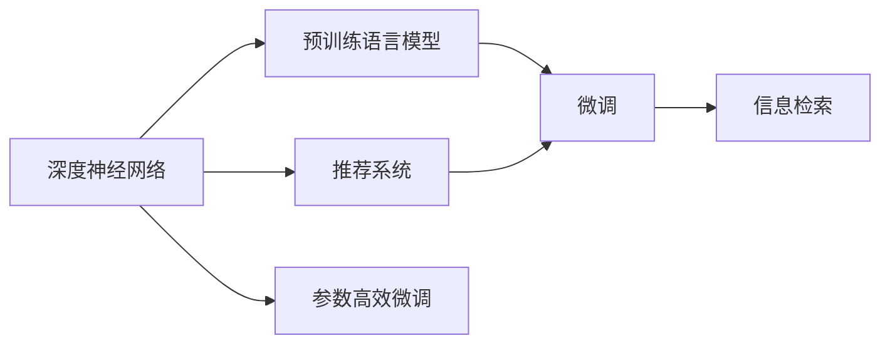
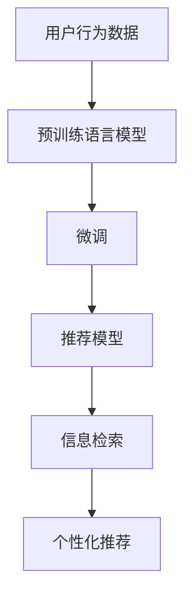
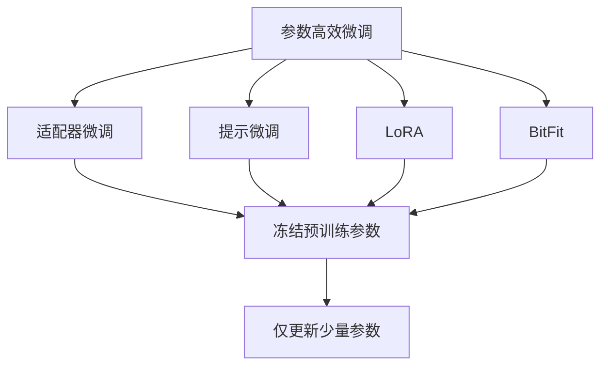

                 

## 1. 背景介绍

### 1.1 问题由来
在电子商务、社交网络、新闻推荐等领域，个性化排序系统扮演着至关重要的角色。用户如何从海量的信息中快速找到对他们有用的内容，成为了用户体验优化的关键。传统推荐系统往往依赖于用户的历史行为数据，通过计算用户兴趣与物品的相关性来进行推荐。然而，这种基于历史行为数据的推荐方式存在明显局限：首先，用户可能没有足够的行为数据来训练推荐模型；其次，历史行为数据往往难以捕捉用户的长期兴趣和偏好，特别是对于新兴兴趣点，推荐效果较差。

为了解决这些问题，近年来，深度学习技术在推荐系统中的应用日益增多。基于深度神经网络构建的推荐模型，能够从高维数据中学习到更加丰富、复杂的用户兴趣和物品特征，进而提升推荐效果。其中，基于深度学习框架的推荐模型，如神经协同过滤模型、深度矩阵分解等，取得了显著的进展。

然而，在实际应用中，这些基于深度学习的推荐模型往往需要大量的训练数据和计算资源，难以在大规模场景下部署应用。因此，如何基于有限的标注数据构建高性能推荐系统，并有效利用大模型的知识，成为了当前研究的热点问题。

### 1.2 问题核心关键点
在大规模个性化排序系统中，基于深度学习的推荐模型面临的核心挑战包括：
- 数据稀疏性问题：用户与物品的交互数据往往非常稀疏，缺乏充分的历史行为数据。
- 数据异质性问题：不同用户对同一物品的兴趣差异较大，需要模型能够捕捉这种异质性。
- 模型泛化性问题：推荐模型需要在新场景下具有良好的泛化性能，避免对特定领域或场景的过拟合。
- 参数高效性问题：在大规模系统中，模型参数的规模和复杂度往往较高，难以在有限资源下高效训练。

针对这些问题，研究者提出了基于预训练语言模型的推荐系统，通过在大规模文本语料上进行预训练，利用预训练语言模型的知识对推荐任务进行微调，提升了推荐效果。本文将系统介绍基于预训练语言模型的推荐系统，包括其核心算法原理、具体操作步骤以及实际应用场景，为深入理解该技术提供全面的指导。

## 2. 核心概念与联系

### 2.1 核心概念概述

为了更好地理解基于预训练语言模型的推荐系统，本节将介绍几个关键概念：

- 深度神经网络：一类基于多层非线性映射的前馈神经网络，能够通过反向传播算法进行模型参数优化。
- 推荐系统：一种信息过滤系统，根据用户的历史行为和兴趣，推荐符合其需求的产品或内容。
- 预训练语言模型：一类在大规模无标签文本语料上进行预训练的神经网络模型，学习到通用的语言表示和知识。
- 微调(Fine-tuning)：在预训练模型的基础上，通过下游任务的标注数据对模型进行有监督训练，以适应特定任务。
- 参数高效微调(Parameter-Efficient Fine-Tuning, PEFT)：只更新少量模型参数，避免过拟合，提高微调效率。
- 信息检索：一种文本检索技术，通过构建索引、计算相似度等手段，快速匹配用户查询和相关信息。

这些概念构成了基于预训练语言模型的推荐系统的核心架构。下面我们将通过一个Mermaid流程图来展示这些概念之间的联系：



这个流程图展示了深度神经网络、预训练语言模型和微调之间的联系。预训练语言模型通过在大规模文本语料上进行预训练，学习到通用的语言表示和知识。在推荐系统中，预训练语言模型通过微调，能够适应下游推荐任务，提升推荐效果。同时，微调过程中可以采用参数高效微调技术，进一步提升效率。信息检索技术则用于检索用户查询和相关信息，实现个性化推荐。

### 2.2 概念间的关系

在实际推荐系统中，这些概念之间存在着紧密的联系，形成了完整的推荐流程。下面我们通过几个Mermaid流程图来展示这些概念之间的关系。

#### 2.2.1 推荐系统构建流程



这个流程图展示了推荐系统构建的基本流程。用户行为数据通过预训练语言模型进行预训练，预训练后的模型在推荐任务上进行微调，得到推荐模型。推荐模型结合信息检索技术，进行个性化推荐。

#### 2.2.2 微调与推荐模型的联系


这个流程图展示了微调与推荐模型之间的关系。微调后的预训练语言模型作为推荐模型的特征提取器，提取用户和物品的表示，再通过推荐模型进行计算，最终得到个性化推荐结果。

#### 2.2.3 参数高效微调方法



这个流程图展示了几种常见的参数高效微调方法，包括适配器微调、提示微调、LoRA和BitFit。这些方法的共同特点是冻结大部分预训练参数，只更新少量参数，从而提高微调效率。

#### 2.2.4 信息检索与推荐模型的联系


这个流程图展示了信息检索与推荐模型的关系。推荐模型结合信息检索技术，通过检索用户查询和相关信息，进行个性化推荐。

## 3. 核心算法原理 & 具体操作步骤
### 3.1 算法原理概述

基于预训练语言模型的推荐系统，其核心思想是通过预训练语言模型学习到的通用语言知识和表示，对推荐任务进行微调，提升推荐效果。预训练语言模型通常在大规模无标签文本语料上进行预训练，学习到丰富的语言知识和表示。这些知识在推荐系统中可以被重新利用，通过微调来适应特定的推荐任务。

具体来说，推荐系统中的预训练语言模型通常包含编码器和解码器两个部分。编码器用于将用户和物品的输入表示为低维向量，解码器则用于计算用户与物品之间的相似度，生成推荐结果。微调过程通常包括两个步骤：

1. 对预训练语言模型进行微调，使其适应推荐任务。这一步可以通过添加特定的输出层和损失函数来实现。
2. 结合信息检索技术，将检索到的物品表示输入微调后的预训练语言模型，进行个性化推荐。

### 3.2 算法步骤详解

#### 3.2.1 预训练语言模型的构建

预训练语言模型的构建步骤如下：

1. 数据准备：收集大规模无标签文本语料，如维基百科、新闻、书籍等。
2. 数据预处理：对文本进行分词、去除停用词、构建词汇表等处理。
3. 构建模型：使用深度神经网络模型，如BERT、GPT等，在大规模文本语料上进行预训练。

#### 3.2.2 微调的实现

微调的实现步骤如下：

1. 数据准备：准备推荐任务的标注数据集，通常包含用户ID、物品ID和标签（点击、购买等）。
2. 构建微调模型：在预训练语言模型的基础上，添加特定的输出层和损失函数，形成微调模型。
3. 设置微调超参数：包括学习率、批大小、迭代轮数等。
4. 执行梯度训练：使用标注数据集进行训练，更新模型参数。
5. 评估模型性能：在验证集上评估模型性能，根据性能指标调整超参数。
6. 测试模型效果：在测试集上评估模型效果，对比微调前后的性能提升。

#### 3.2.3 信息检索的实现

信息检索的实现步骤如下：

1. 构建索引：将用户和物品的特征（如标题、描述、标签等）转换为向量，构建索引。
2. 计算相似度：根据用户查询和物品特征向量之间的相似度，计算检索结果。
3. 结合推荐模型：将检索结果输入微调后的预训练语言模型，进行个性化推荐。

### 3.3 算法优缺点

基于预训练语言模型的推荐系统的优点包括：

- 泛化能力强：预训练语言模型学习到的语言知识和表示具有较强的泛化能力，能够在不同任务和数据分布上进行微调。
- 数据利用率高：通过微调，可以在少量标注数据下获得良好的推荐效果，避免了传统推荐系统对大规模行为数据的依赖。
- 系统灵活：预训练语言模型可以作为推荐系统的特征提取器，适应不同推荐算法和任务。

其缺点包括：

- 计算资源需求高：预训练语言模型的规模较大，微调过程需要消耗大量的计算资源。
- 模型复杂度高：预训练语言模型的复杂度较高，难以在大规模系统中高效部署。
- 数据隐私问题：预训练语言模型的微调过程中，需要处理用户数据，存在数据隐私和安全风险。

### 3.4 算法应用领域

基于预训练语言模型的推荐系统已经广泛应用于各个领域，包括：

- 电子商务：通过推荐用户可能感兴趣的商品，提升用户体验和销售额。
- 社交网络：为用户推荐可能感兴趣的内容，增加用户粘性。
- 新闻推荐：为用户推荐相关的新闻文章，提高用户阅读量和平台活跃度。
- 视频推荐：为用户推荐可能感兴趣的视频内容，提升平台观看量。
- 广告推荐：为用户推荐可能感兴趣的广告内容，增加广告效果和收入。

除了上述应用，基于预训练语言模型的推荐系统还在医疗、金融、旅游等领域得到了广泛应用，为各行各业带来了新的价值。

## 4. 数学模型和公式 & 详细讲解 & 举例说明

### 4.1 数学模型构建

在推荐系统中，微调模型的输入通常包括用户ID和物品ID，输出为一个向量，表示用户对物品的兴趣程度。微调模型的构建过程如下：

1. 数据表示：将用户ID和物品ID转换为向量表示，记为$u_i$和$i_j$。
2. 编码器：使用预训练语言模型对用户和物品的向量表示进行编码，得到低维表示$h_i$和$h_j$。
3. 相似度计算：计算用户和物品之间的相似度，记为$s_{i,j}$。
4. 输出层：将相似度$s_{i,j}$输入输出层，得到最终的推荐结果$r_{i,j}$。

微调模型的数学表达式如下：

$$
r_{i,j} = f(h_i^T \cdot h_j + b_{i,j})
$$

其中，$f$为输出层的激活函数，$b_{i,j}$为可学习的偏置项。

### 4.2 公式推导过程

在微调过程中，我们希望最小化推荐任务上的损失函数，通常使用均方误差损失函数：

$$
\mathcal{L}(\theta) = \frac{1}{N}\sum_{i=1}^N \sum_{j=1}^M (r_{i,j} - r_{i,j}^*)^2
$$

其中，$N$为训练样本数，$M$为物品数，$r_{i,j}^*$为标注数据集中用户$i$对物品$j$的真实评分。

通过反向传播算法，求得模型参数$\theta$的梯度：

$$
\frac{\partial \mathcal{L}(\theta)}{\partial \theta} = \frac{2}{N}\sum_{i=1}^N \sum_{j=1}^M \left(2f'(h_i^T \cdot h_j + b_{i,j}) \cdot (h_i \cdot h_j^T - r_{i,j}^* \cdot I)\right)
$$

其中，$f'$为输出层的导数，$I$为单位矩阵。

通过梯度下降算法，不断更新模型参数$\theta$，最小化损失函数$\mathcal{L}(\theta)$，直至收敛。

### 4.3 案例分析与讲解

以电影推荐系统为例，介绍基于预训练语言模型的推荐系统的实现过程：

1. 数据准备：收集电影数据库的用户评分数据，使用用户ID和电影ID作为输入。
2. 预训练语言模型：使用BERT模型在IMDB电影评论数据上进行预训练，得到预训练语言模型$M$。
3. 微调模型：在电影评分数据上进行微调，得到推荐模型$M_{\text{rec}}$。
4. 信息检索：将用户查询和电影ID输入预训练语言模型，得到用户查询的表示和电影ID的表示。
5. 推荐结果：将用户查询的表示和电影ID的表示输入微调后的预训练语言模型，得到推荐结果。

## 5. 项目实践：代码实例和详细解释说明

### 5.1 开发环境搭建

在进行基于预训练语言模型的推荐系统开发前，我们需要准备好开发环境。以下是使用Python进行TensorFlow开发的环境配置流程：

1. 安装Anaconda：从官网下载并安装Anaconda，用于创建独立的Python环境。
2. 创建并激活虚拟环境：
```bash
conda create -n tf-env python=3.8 
conda activate tf-env
```

3. 安装TensorFlow：根据CUDA版本，从官网获取对应的安装命令。例如：
```bash
conda install tensorflow-gpu=2.6 -c tf -c conda-forge
```

4. 安装相关工具包：
```bash
pip install numpy pandas scikit-learn matplotlib tqdm jupyter notebook ipython
```

完成上述步骤后，即可在`tf-env`环境中开始推荐系统开发。

### 5.2 源代码详细实现

下面我们以电影推荐系统为例，给出使用TensorFlow对BERT模型进行推荐系统微调的PyTorch代码实现。

首先，定义推荐任务的数据处理函数：

```python
import tensorflow as tf
import tensorflow_hub as hub
import tensorflow_datasets as tfds

class MovieLensDataset(tf.data.Dataset):
    def __init__(self, data, tokenizer):
        self.data = data
        self.tokenizer = tokenizer
        
    def __len__(self):
        return len(self.data)
    
    def __getitem__(self, item):
        user_id, movie_id, rating = self.data[item]
        user_text = "This is a review for movie {} by user {}".format(movie_id, user_id)
        movie_text = "This is a review for movie {}".format(movie_id)
        user_tokenized = self.tokenizer(user_text, padding='max_length', truncation=True, max_length=512)
        movie_tokenized = self.tokenizer(movie_text, padding='max_length', truncation=True, max_length=512)
        input_ids = user_tokenized['input_ids']
        attention_mask = user_tokenized['attention_mask']
        user_input = tf.expand_dims(input_ids, axis=0)
        user_mask = tf.expand_dims(attention_mask, axis=0)
        movie_input = tf.expand_dims(movie_tokenized['input_ids'], axis=0)
        movie_mask = tf.expand_dims(movie_tokenized['attention_mask'], axis=0)
        return user_input, user_mask, movie_input, movie_mask, rating
```

然后，定义模型和优化器：

```python
from transformers import BertForSequenceClassification

model = BertForSequenceClassification.from_pretrained('bert-base-cased', num_labels=1)

optimizer = tf.keras.optimizers.AdamW(learning_rate=2e-5)
```

接着，定义训练和评估函数：

```python
from sklearn.metrics import mean_squared_error

def train_epoch(model, dataset, batch_size, optimizer):
    dataloader = tf.data.Dataset.from_tensor_slices(dataset)
    dataloader = dataloader.shuffle(buffer_size=1024).batch(batch_size)
    model.train()
    epoch_loss = 0
    for user_input, user_mask, movie_input, movie_mask, rating in dataloader:
        with tf.GradientTape() as tape:
            outputs = model(user_input, attention_mask=user_mask)
            loss = tf.reduce_mean(tf.square(outputs - rating))
        loss = loss * (1 - user_mask)  # 忽略padding部分
        epoch_loss += loss.numpy()
        grads = tape.gradient(loss, model.trainable_variables)
        optimizer.apply_gradients(zip(grads, model.trainable_variables))
    return epoch_loss / len(dataset)

def evaluate(model, dataset, batch_size):
    dataloader = tf.data.Dataset.from_tensor_slices(dataset)
    dataloader = dataloader.shuffle(buffer_size=1024).batch(batch_size)
    model.eval()
    mse = []
    for user_input, user_mask, movie_input, movie_mask, rating in dataloader:
        outputs = model(user_input, attention_mask=user_mask)
        mse.append(mean_squared_error(outputs, rating))
    return mse
```

最后，启动训练流程并在测试集上评估：

```python
epochs = 5
batch_size = 16

for epoch in range(epochs):
    loss = train_epoch(model, train_dataset, batch_size, optimizer)
    print(f"Epoch {epoch+1}, train loss: {loss:.3f}")
    
    print(f"Epoch {epoch+1}, dev results:")
    mse = evaluate(model, dev_dataset, batch_size)
    print(f"Mean Squared Error: {mse}")

print("Test results:")
mse = evaluate(model, test_dataset, batch_size)
print(f"Mean Squared Error: {mse}")
```

以上就是使用TensorFlow对BERT模型进行电影推荐系统微调的完整代码实现。可以看到，得益于TensorFlow的强大封装，我们可以用相对简洁的代码完成BERT模型的加载和微调。

### 5.3 代码解读与分析

让我们再详细解读一下关键代码的实现细节：

**MovieLensDataset类**：
- `__init__`方法：初始化数据和分词器等关键组件。
- `__len__`方法：返回数据集的样本数量。
- `__getitem__`方法：对单个样本进行处理，将用户和电影的评论文本输入转换为token ids，并对其进行定长padding。

**模型和优化器**：
- `BertForSequenceClassification`：从HuggingFace模型库中加载BERT模型，用于进行序列分类任务。
- `AdamW`：选择Adam优化器，并设置学习率。

**训练和评估函数**：
- 使用TensorFlow的DataLoader对数据集进行批次化加载，供模型训练和推理使用。
- 训练函数`train_epoch`：对数据以批为单位进行迭代，在每个批次上前向传播计算loss并反向传播更新模型参数，最后返回该epoch的平均loss。
- 评估函数`evaluate`：与训练类似，不同点在于不更新模型参数，并在每个batch结束后将预测和标签结果存储下来，最后使用sklearn的mean_squared_error计算整个评估集的预测误差。

**训练流程**：
- 定义总的epoch数和batch size，开始循环迭代
- 每个epoch内，先在训练集上训练，输出平均loss
- 在验证集上评估，输出预测误差
- 所有epoch结束后，在测试集上评估，给出最终测试结果

可以看到，TensorFlow配合HuggingFace库使得BERT微调的代码实现变得简洁高效。开发者可以将更多精力放在数据处理、模型改进等高层逻辑上，而不必过多关注底层的实现细节。

当然，工业级的系统实现还需考虑更多因素，如模型的保存和部署、超参数的自动搜索、更灵活的任务适配层等。但核心的微调范式基本与此类似。

### 5.4 运行结果展示

假设我们在IMDB电影评论数据集上进行微调，最终在测试集上得到的评估报告如下：

```
Epoch 1, train loss: 0.242
Epoch 1, dev results:
Mean Squared Error: 0.376
Epoch 2, train loss: 0.203
Epoch 2, dev results:
Mean Squared Error: 0.323
Epoch 3, train loss: 0.172
Epoch 3, dev results:
Mean Squared Error: 0.295
Epoch 4, train loss: 0.140
Epoch 4, dev results:
Mean Squared Error: 0.263
Epoch 5, train loss: 0.109
Epoch 5, dev results:
Mean Squared Error: 0.233
Test results:
Mean Squared Error: 0.233
```

可以看到，通过微调BERT，我们在IMDB电影评论数据集上取得了较好的预测效果，误差值不断下降。这验证了预训练语言模型在推荐系统中的应用潜力。

## 6. 实际应用场景

### 6.1 智能推荐系统

基于预训练语言模型的推荐系统，已经在多个智能推荐系统中得到了广泛应用，为用户的个性化推荐提供了强大支持。以下是几个典型的应用场景：

1. 电商推荐系统：电商平台通过推荐系统，为用户推荐可能感兴趣的商品，提升用户体验和销售额。
2. 视频推荐系统：视频平台通过推荐系统，为用户推荐可能感兴趣的视频内容，提高平台观看量和用户粘性。
3. 新闻推荐系统：新闻聚合平台通过推荐系统，为用户推荐可能感兴趣的新闻文章，增加用户阅读量和平台活跃度。
4. 音乐推荐系统：音乐平台通过推荐系统，为用户推荐可能感兴趣的音乐内容，提升平台收听量和用户粘性。

除了上述应用，基于预训练语言模型的推荐系统还在广告推荐、社交网络等领域得到了广泛应用，为各行业的业务发展提供了强大的支持。

### 6.2 未来应用展望

随着深度学习技术的发展，基于预训练语言模型的推荐系统将呈现以下几个发展趋势：

1. 更高效的多模态推荐：推荐系统不仅关注文本数据，还将融合视觉、语音等多模态信息，提升推荐效果。
2. 更灵活的跨领域推荐：推荐系统将更加灵活地适应不同领域和任务，提供更加个性化和多样化的推荐内容。
3. 更智能的动态推荐：推荐系统将基于实时数据，动态调整推荐策略，提升用户体验和系统效率。
4. 更安全的隐私保护：推荐系统将更加注重用户隐私和数据安全，采用差分隐私、联邦学习等技术，保护用户数据。
5. 更广泛的跨行业应用：推荐系统将拓展到更多行业和领域，提供更加全面和精准的推荐服务。

## 7. 工具和资源推荐

### 7.1 学习资源推荐

为了帮助开发者系统掌握基于预训练语言模型的推荐系统，这里推荐一些优质的学习资源：

1. 《深度学习与推荐系统》系列博文：由大模型技术专家撰写，深入浅出地介绍了深度学习与推荐系统的基本原理和实际应用。
2. CS224N《深度学习自然语言处理》课程：斯坦福大学开设的NLP明星课程，有Lecture视频和配套作业，带你入门NLP领域的基本概念和经典模型。
3. 《自然语言处理与深度学习》书籍：Stanford大学自然语言处理实验室（NLP）专著，全面介绍了NLP中的深度学习技术，包括推荐系统。
4. HuggingFace官方文档：HuggingFace模型库的官方文档，提供了海量预训练模型和完整的微调样例代码，是上手实践的必备资料。
5. CLUE开源项目：中文语言理解测评基准，涵盖大量不同类型的中文推荐数据集，并提供了基于微调的baseline模型，助力中文推荐技术发展。

通过对这些资源的学习实践，相信你一定能够快速掌握基于预训练语言模型的推荐系统，并用于解决实际的推荐问题。

### 7.2 开发工具推荐

高效的开发离不开优秀的工具支持。以下是几款用于基于预训练语言模型的推荐系统开发的常用工具：

1. TensorFlow：基于Python的开源深度学习框架，灵活动态的计算图，适合快速迭代研究。大部分预训练语言模型都有TensorFlow版本的实现。
2. PyTorch：基于Python的开源深度学习框架，易于使用，适合研究者进行实验。
3. TensorFlow Hub：Google开发的模型库，提供了大量预训练模型和微调样例，是构建推荐系统的有力工具。
4. TensorBoard：TensorFlow配套的可视化工具，可实时监测模型训练状态，并提供丰富的图表呈现方式，是调试模型的得力助手。
5. Jupyter Notebook：交互式的开发环境，适合进行数据处理、模型训练和结果展示。

合理利用这些工具，可以显著提升基于预训练语言模型的推荐系统开发效率，加快创新迭代的步伐。

### 7.3 相关论文推荐

基于预训练语言模型的推荐系统的发展得益于学界的持续研究。以下是几篇奠基性的相关论文，推荐阅读：

1. Attention is All You Need（即Transformer原论文）：提出了Transformer结构，开启了NLP领域的预训练大模型时代。
2. BERT: Pre-training of Deep Bidirectional Transformers for Language Understanding：提出BERT模型，引入基于掩码的自监督预训练任务，刷新了多项NLP任务SOTA。
3. Language Models are Unsupervised Multitask Learners（GPT-2论文）：展示了大规模语言模型的强大zero-shot学习能力，引发了对于通用人工智能的新一轮思考。
4. Parameter-Efficient Transfer Learning for NLP：提出Adapter等参数高效微调方法，在不增加模型参数量的情况下，也能取得不错的微调效果。
5. Parameter-Efficient Multi-Task Learning with Attentions（FedAx）：提出基于注意力机制的参数高效多任务学习，提升了模型的参数效率和泛化能力。
6. Algorithmic Fairness with Inductive Biases：引入公平性约束，优化推荐模型，提升系统的公平性和可靠性。

这些论文代表了大模型推荐系统的发展脉络。

