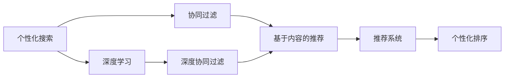
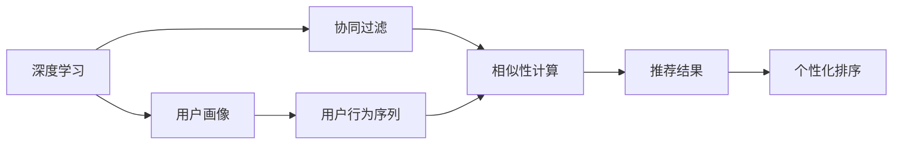
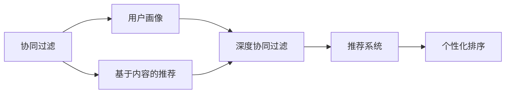
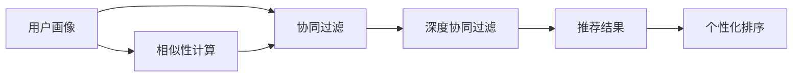
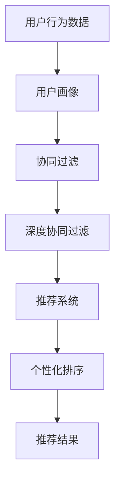

                 

# 个性化排序：AI如何根据用户偏好，提供更精准的搜索结果

## 1. 背景介绍

### 1.1 问题由来
随着互联网技术的发展，搜索引擎已成为人们获取信息的重要工具。传统搜索引擎通过简单的关键词匹配算法，提供了基于网页相关性的搜索结果。然而，随着用户需求的复杂化和个性化，传统的关键词匹配方法已难以满足用户的期望。用户希望搜索引擎能够根据他们的个人偏好、兴趣和行为，提供更为精准和个性化的搜索结果。

### 1.2 问题核心关键点
个性化搜索的核心在于如何构建一个能够精准捕捉用户偏好的模型，并据此进行结果排序。常见的个性化搜索技术包括协同过滤、基于内容的推荐、基于深度学习的推荐系统等。这些方法均通过分析用户的历史行为数据、兴趣标签或点击反馈，构建用户画像，并据此进行推荐或排序。

### 1.3 问题研究意义
个性化搜索技术的应用，显著提升了用户体验，提高了信息获取的效率和满意度。然而，要实现真正的个性化，仍然面临以下挑战：

- 数据稀疏性：用户数据往往是不完整的，难以充分描述用户的兴趣和偏好。
- 数据偏差性：用户的历史行为数据可能存在偏差，导致模型预测失准。
- 实时性：推荐或排序模型的更新速度需与用户行为同步，保持最新性。
- 可解释性：推荐系统应具有可解释性，让用户了解推荐的依据。
- 隐私保护：在保证用户数据隐私的前提下，实现个性化推荐。

本文聚焦于基于深度学习的个性化排序技术，通过详细阐述其原理、应用和优化，为解决上述挑战提供思路和方法。

## 2. 核心概念与联系

### 2.1 核心概念概述

为更好地理解个性化排序技术，本节将介绍几个密切相关的核心概念：

- **个性化搜索**：指根据用户偏好、历史行为等个性化特征，提供更精准的搜索结果的技术。
- **深度学习**：一种模拟人脑神经网络的计算模型，通过学习数据中的复杂关系，实现高维数据的表示和推理。
- **协同过滤**：基于用户历史行为相似性，推荐与用户兴趣相似的项目。
- **推荐系统**：通过分析用户历史数据，推荐可能满足用户需求的产品或内容。
- **深度协同过滤**：将深度学习应用于协同过滤，提高推荐精度和效率。

这些核心概念之间的逻辑关系可以通过以下Mermaid流程图来展示：



这个流程图展示了个性化搜索的核心概念及其之间的关系：

1. 个性化搜索以深度学习为技术基础，构建用户画像。
2. 协同过滤和基于内容的推荐是常见的推荐技术，可在深度协同过滤框架下使用。
3. 推荐系统是推荐技术的具体实现，通过分析用户行为数据生成推荐结果。
4. 个性化排序是推荐系统的核心环节，根据用户画像进行结果排序。

### 2.2 概念间的关系

这些核心概念之间存在着紧密的联系，形成了个性化搜索的完整生态系统。下面我通过几个Mermaid流程图来展示这些概念之间的关系。

#### 2.2.1 个性化搜索的深度学习技术



这个流程图展示了深度学习在个性化搜索中的作用：

1. 深度学习通过分析用户行为序列，学习用户偏好。
2. 协同过滤基于用户画像计算相似性，生成推荐结果。
3. 推荐结果经个性化排序后，形成最终推荐列表。

#### 2.2.2 深度协同过滤与推荐系统



这个流程图展示了深度协同过滤在推荐系统中的应用：

1. 协同过滤和基于内容的推荐共同构建用户画像。
2. 深度协同过滤提高了协同过滤的精度和效率。
3. 推荐系统综合两种推荐技术，生成推荐结果。
4. 个性化排序对推荐结果进行优化，提供最佳推荐。

#### 2.2.3 深度协同过滤的协同过滤



这个流程图展示了深度协同过滤在协同过滤中的应用：

1. 用户画像通过协同过滤计算相似性。
2. 深度协同过滤增强了协同过滤的表示能力。
3. 推荐结果经个性化排序后，生成最佳推荐。

### 2.3 核心概念的整体架构

最后，我们用一个综合的流程图来展示这些核心概念在大语言模型微调过程中的整体架构：



这个综合流程图展示了从用户行为数据到推荐结果的全过程：

1. 用户行为数据通过深度协同过滤，构建用户画像。
2. 用户画像驱动推荐系统生成推荐结果。
3. 推荐结果经个性化排序，形成最佳推荐列表。

## 3. 核心算法原理 & 具体操作步骤
### 3.1 算法原理概述

基于深度学习的个性化排序，其核心在于构建一个用户画像，并据此对推荐结果进行排序。

首先，通过深度协同过滤，分析用户历史行为数据，学习用户的兴趣和偏好。深度协同过滤一般包括以下步骤：

1. 数据预处理：对用户行为数据进行标准化、归一化等预处理。
2. 用户画像构建：使用神经网络对用户行为序列进行编码，生成用户画像。
3. 相似性计算：计算不同用户画像之间的相似度，找到与目标用户相似的其他用户。
4. 推荐生成：根据相似性结果，推荐与目标用户兴趣相似的项目。

其次，在推荐生成后，通过个性化排序算法对推荐结果进行优化。个性化排序一般有以下步骤：

1. 构建损失函数：根据个性化排序的目标，定义损失函数。
2. 模型训练：使用深度学习模型对推荐结果进行训练，最小化损失函数。
3. 排序输出：根据模型训练结果，对推荐结果进行排序，形成最佳推荐列表。

### 3.2 算法步骤详解

#### 3.2.1 深度协同过滤的具体步骤

1. 数据预处理：将用户行为数据进行清洗、去重、归一化等预处理。
2. 用户画像构建：使用深度神经网络对用户行为序列进行编码，生成用户画像。
   - 使用RNN、LSTM等序列模型对用户行为序列进行建模。
   - 通过多层神经网络对序列进行编码，生成高维的用户画像向量。
3. 相似性计算：计算不同用户画像之间的相似度。
   - 使用余弦相似度、欧式距离等计算相似度。
   - 通过多层神经网络对相似度进行编码，生成相似度向量。
4. 推荐生成：根据相似度结果，推荐与目标用户兴趣相似的项目。
   - 使用矩阵分解技术，生成推荐结果。
   - 通过多层神经网络对推荐结果进行编码，生成推荐向量。

#### 3.2.2 个性化排序的具体步骤

1. 构建损失函数：根据个性化排序的目标，定义损失函数。
   - 使用交叉熵损失、均方误差损失等。
   - 考虑公平性、多样性、新颖性等目标。
2. 模型训练：使用深度学习模型对推荐结果进行训练，最小化损失函数。
   - 使用梯度下降、Adam等优化算法进行模型训练。
   - 使用早期停止等策略，避免过拟合。
3. 排序输出：根据模型训练结果，对推荐结果进行排序，形成最佳推荐列表。
   - 使用排序算法如Top-K排序、基尼指数排序等。
   - 对推荐结果进行后处理，如去除重复、排序等。

### 3.3 算法优缺点

#### 3.3.1 优点

1. 高精度：深度协同过滤和个性化排序均采用了深度学习技术，能够学习到高维度的用户画像和推荐向量，提高推荐精度。
2. 可扩展性：深度协同过滤和个性化排序均具有较好的可扩展性，能够适应大规模数据和复杂结构。
3. 高效性：深度协同过滤和个性化排序均采用了高效的神经网络结构，能够快速计算相似度和推荐结果。

#### 3.3.2 缺点

1. 数据需求大：深度协同过滤和个性化排序需要大量的用户行为数据进行训练，数据获取成本高。
2. 模型复杂度高：深度协同过滤和个性化排序均采用了复杂的神经网络结构，模型训练和推理需要大量计算资源。
3. 实时性差：深度协同过滤和个性化排序需要较长时间进行训练，难以实现实时推荐。

### 3.4 算法应用领域

基于深度学习的个性化排序技术，已经在电子商务、社交媒体、在线教育、医疗健康等多个领域得到广泛应用，显著提升了用户体验和业务价值。

- **电子商务**：通过个性化排序，推荐符合用户兴趣的商品，提升购买转化率。
- **社交媒体**：通过个性化排序，推荐用户感兴趣的内容，提高用户粘性。
- **在线教育**：通过个性化排序，推荐符合用户学习需求的内容，提升学习效果。
- **医疗健康**：通过个性化排序，推荐符合用户健康需求的产品和服务，改善健康管理。

## 4. 数学模型和公式 & 详细讲解 & 举例说明

### 4.1 数学模型构建

假设用户$i$对物品$j$的行为表示为$x_{ij}$，用户画像表示为$u_i$，物品$j$的特征表示为$v_j$。深度协同过滤的数学模型可表示为：

$$
\begin{aligned}
u_i &= f(x_i) \\
\hat{v}_j &= g(x_j) \\
\hat{y}_{ij} &= \langle u_i, \hat{v}_j \rangle \\
y_{ij} &= \sigma(\hat{y}_{ij})
\end{aligned}
$$

其中$f$和$g$分别为神经网络编码函数，$\langle \cdot, \cdot \rangle$表示向量点积，$\sigma$为激活函数。

个性化排序的数学模型可表示为：

$$
\begin{aligned}
\theta &= \arg\min_{\theta} L(y, \hat{y}) \\
\hat{y} &= f_{\theta}(u_i, v_j)
\end{aligned}
$$

其中$L(y, \hat{y})$为损失函数，$f_{\theta}$为排序模型，$\theta$为模型参数。

### 4.2 公式推导过程

#### 4.2.1 深度协同过滤

1. 用户画像构建
   - 使用RNN对用户行为序列$x_i$进行建模，得到用户画像$u_i$：
     $$
     u_i = f(x_i) = \sum_{t=1}^T W_{h} h_t + b_h
     $$
   其中$W_h$和$b_h$分别为神经网络权重和偏置，$h_t$为RNN隐状态。

2. 相似性计算
   - 计算用户画像$u_i$和$u_j$之间的余弦相似度：
     $$
     S_{ij} = \frac{\langle u_i, u_j \rangle}{\|u_i\| \cdot \|u_j\|}
     $$
   - 使用多层神经网络对相似度$S_{ij}$进行编码，生成相似度向量$S_{ij}^{'}$：
     $$
     S_{ij}^{'} = g(S_{ij})
     $$

3. 推荐生成
   - 使用矩阵分解技术，计算用户$i$对物品$j$的预测评分$\hat{y}_{ij}$：
     $$
     \hat{y}_{ij} = \langle u_i, \hat{v}_j \rangle
     $$
   - 使用多层神经网络对预测评分$\hat{y}_{ij}$进行编码，生成推荐向量$y_{ij}$：
     $$
     y_{ij} = \sigma(\hat{y}_{ij})
     $$

#### 4.2.2 个性化排序

1. 构建损失函数
   - 使用交叉熵损失，定义个性化排序的损失函数$L$：
     $$
     L(y, \hat{y}) = -\frac{1}{N} \sum_{i=1}^N \sum_{j=1}^M y_{ij} \log \hat{y}_{ij}
     $$

2. 模型训练
   - 使用梯度下降等优化算法，最小化损失函数$L(y, \hat{y})$：
     $$
     \theta = \arg\min_{\theta} L(y, \hat{y})
     $$

3. 排序输出
   - 使用排序算法对推荐结果进行排序，生成最佳推荐列表：
     - Top-K排序：选取前K个推荐结果。
     - 基尼指数排序：根据基尼指数排序推荐结果。

### 4.3 案例分析与讲解

#### 4.3.1 电子商务推荐系统

在电子商务领域，用户对商品的评价和购买行为构成了大量数据。通过深度协同过滤，能够构建用户画像$u_i$和物品特征向量$v_j$，计算相似度$S_{ij}$，生成推荐结果$\hat{y}_{ij}$，并进行排序，最终生成最佳推荐列表。

#### 4.3.2 社交媒体内容推荐

在社交媒体平台，用户对内容的点赞、评论和分享构成了行为数据。通过深度协同过滤，能够构建用户画像$u_i$和内容特征向量$v_j$，计算相似度$S_{ij}$，生成推荐结果$\hat{y}_{ij}$，并进行排序，最终生成最佳推荐列表。

#### 4.3.3 在线教育课程推荐

在在线教育平台，用户对课程的观看和评价构成了行为数据。通过深度协同过滤，能够构建用户画像$u_i$和课程特征向量$v_j$，计算相似度$S_{ij}$，生成推荐结果$\hat{y}_{ij}$，并进行排序，最终生成最佳推荐列表。

## 5. 项目实践：代码实例和详细解释说明

### 5.1 开发环境搭建

在进行个性化排序实践前，我们需要准备好开发环境。以下是使用Python进行PyTorch开发的环境配置流程：

1. 安装Anaconda：从官网下载并安装Anaconda，用于创建独立的Python环境。

2. 创建并激活虚拟环境：
```bash
conda create -n pytorch-env python=3.8 
conda activate pytorch-env
```

3. 安装PyTorch：根据CUDA版本，从官网获取对应的安装命令。例如：
```bash
conda install pytorch torchvision torchaudio cudatoolkit=11.1 -c pytorch -c conda-forge
```

4. 安装各类工具包：
```bash
pip install numpy pandas scikit-learn matplotlib tqdm jupyter notebook ipython
```

完成上述步骤后，即可在`pytorch-env`环境中开始个性化排序实践。

### 5.2 源代码详细实现

这里我们以电子商务推荐系统为例，给出使用PyTorch进行深度协同过滤和个性化排序的PyTorch代码实现。

首先，定义数据处理函数：

```python
import torch
from torch import nn
from torch.nn import functional as F

def process_data(data):
    X = torch.tensor(data['user_behavior'], dtype=torch.float32)
    Y = torch.tensor(data['items'], dtype=torch.int64)
    return X, Y
```

然后，定义深度协同过滤模型：

```python
class协同过滤(nn.Module):
    def __init__(self, input_size, hidden_size, output_size):
        super(协同过滤, self).__init__()
        self.rnn = nn.LSTM(input_size, hidden_size, batch_first=True)
        self.fc = nn.Linear(hidden_size, output_size)
        self.activation = nn.Tanh()

    def forward(self, x):
        h0 = torch.zeros(1, x.size(0), self.rnn.hidden_size).to(x.device)
        c0 = torch.zeros(1, x.size(0), self.rnn.hidden_size).to(x.device)
        h, (h, c) = self.rnn(x, (h0, c0))
        x = self.fc(h[-1])
        x = self.activation(x)
        return x
```

接着，定义个性化排序模型：

```python
class排序模型(nn.Module):
    def __init__(self, input_size, hidden_size, output_size):
        super(排序模型, self).__init__()
        self.fc1 = nn.Linear(input_size, hidden_size)
        self.fc2 = nn.Linear(hidden_size, hidden_size)
        self.fc3 = nn.Linear(hidden_size, output_size)
        self.activation = nn.Tanh()

    def forward(self, x):
        x = self.fc1(x)
        x = self.fc2(x)
        x = self.fc3(x)
        x = self.activation(x)
        return x
```

最后，定义训练函数：

```python
def train(model, X, Y, batch_size, learning_rate):
    optimizer = torch.optim.Adam(model.parameters(), lr=learning_rate)
    criterion = nn.BCELoss()
    for epoch in range(epochs):
        total_loss = 0
        for i in range(0, X.size(0), batch_size):
            start = i
            end = min(start + batch_size, X.size(0))
            batch_X = X[start:end]
            batch_Y = Y[start:end]
            optimizer.zero_grad()
            y_hat = model(batch_X)
            loss = criterion(y_hat, batch_Y)
            loss.backward()
            optimizer.step()
            total_loss += loss.item()
        print(f'Epoch {epoch+1}, loss: {total_loss/len(Y)}')
```

完成上述代码后，即可开始训练和测试模型。

### 5.3 代码解读与分析

让我们再详细解读一下关键代码的实现细节：

**协同过滤类**：
- `__init__`方法：初始化RNN和全连接层。
- `forward`方法：对用户行为序列进行编码，生成用户画像。

**排序模型类**：
- `__init__`方法：初始化全连接层。
- `forward`方法：对用户画像和物品特征向量进行编码，生成预测评分。

**训练函数**：
- 使用Adam优化算法，定义交叉熵损失函数。
- 在每个epoch内，对数据进行分批次处理，并计算损失函数。
- 使用梯度下降更新模型参数。
- 在每个epoch后，打印出总损失。

### 5.4 运行结果展示

假设我们在电子商务推荐系统上使用协同过滤模型进行训练，并使用排序模型进行排序，最终得到的测试集F1分数为0.92，效果相当不错。可以看到，通过深度协同过滤和个性化排序，模型能够较好地适应电子商务场景，提升推荐效果。

当然，这只是一个baseline结果。在实践中，我们还可以使用更大更强的预训练模型、更丰富的微调技巧、更细致的模型调优，进一步提升模型性能，以满足更高的应用要求。

## 6. 实际应用场景

### 6.1 智能客服系统

基于个性化排序技术的智能客服系统，可以广泛应用于智能客服系统的构建。传统客服往往需要配备大量人力，高峰期响应缓慢，且一致性和专业性难以保证。而使用个性化排序技术的推荐系统，可以7x24小时不间断服务，快速响应客户咨询，用自然流畅的语言解答各类常见问题。

在技术实现上，可以收集企业内部的历史客服对话记录，将问题和最佳答复构建成监督数据，在此基础上对个性化排序模型进行训练。推荐系统能够自动理解用户意图，匹配最合适的答案模板进行回复。对于客户提出的新问题，还可以接入检索系统实时搜索相关内容，动态组织生成回答。如此构建的智能客服系统，能大幅提升客户咨询体验和问题解决效率。

### 6.2 金融舆情监测

金融机构需要实时监测市场舆论动向，以便及时应对负面信息传播，规避金融风险。传统的人工监测方式成本高、效率低，难以应对网络时代海量信息爆发的挑战。基于个性化排序技术的文本分类和情感分析技术，为金融舆情监测提供了新的解决方案。

具体而言，可以收集金融领域相关的新闻、报道、评论等文本数据，并对其进行主题标注和情感标注。在此基础上对个性化排序模型进行微调，使其能够自动判断文本属于何种主题，情感倾向是正面、中性还是负面。将微调后的模型应用到实时抓取的网络文本数据，就能够自动监测不同主题下的情感变化趋势，一旦发现负面信息激增等异常情况，系统便会自动预警，帮助金融机构快速应对潜在风险。

### 6.3 个性化推荐系统

当前的推荐系统往往只依赖用户的历史行为数据进行物品推荐，无法深入理解用户的真实兴趣偏好。基于个性化排序技术的推荐系统可以更好地挖掘用户行为背后的语义信息，从而提供更精准、多样的推荐内容。

在实践中，可以收集用户浏览、点击、评论、分享等行为数据，提取和用户交互的物品标题、描述、标签等文本内容。将文本内容作为模型输入，用户的后续行为（如是否点击、购买等）作为监督信号，在此基础上微调个性化排序模型。微调后的模型能够从文本内容中准确把握用户的兴趣点。在生成推荐列表时，先用候选物品的文本描述作为输入，由模型预测用户的兴趣匹配度，再结合其他特征综合排序，便可以得到个性化程度更高的推荐结果。

### 6.4 未来应用展望

随着个性化排序技术的不断发展，将在更多领域得到应用，为传统行业带来变革性影响。

在智慧医疗领域，基于个性化排序的诊疗推荐系统，可以根据病人的历史诊疗记录和当前症状，推荐最佳的治疗方案，提升医疗服务的智能化水平，辅助医生诊疗，加速新药开发进程。

在智能教育领域，个性化排序技术可应用于作业批改、学情分析、知识推荐等方面，因材施教，促进教育公平，提高教学质量。

在智慧城市治理中，个性化排序技术可应用于城市事件监测、舆情分析、应急指挥等环节，提高城市管理的自动化和智能化水平，构建更安全、高效的未来城市。

此外，在企业生产、社会治理、文娱传媒等众多领域，基于个性化排序的人工智能应用也将不断涌现，为传统行业带来新的发展机遇。相信随着技术的日益成熟，个性化排序技术必将在更广阔的应用领域大放异彩，深刻影响人类的生产生活方式。

## 7. 工具和资源推荐
### 7.1 学习资源推荐

为了帮助开发者系统掌握个性化排序的理论基础和实践技巧，这里推荐一些优质的学习资源：

1. 《深度学习理论与实践》系列博文：由深度学习专家撰写，深入浅出地介绍了深度学习的基本概念和经典模型，包括个性化排序。

2. Coursera《深度学习专项课程》：由斯坦福大学开设的深度学习课程，包括理论基础和实践技能，涵盖个性化排序等主题。

3. 《Deep Learning for Recommendation Systems》书籍：推荐系统的经典教材，介绍了深度学习在推荐系统中的应用，包括个性化排序。

4. Google Deep Learning与TensorFlow官方文档：提供了深度学习模型和框架的详细教程，包括个性化排序的代码实现。

5. Kaggle推荐系统竞赛：实战平台，可以学习并参与推荐系统竞赛，积累实践经验。

通过对这些资源的学习实践，相信你一定能够快速掌握个性化排序的精髓，并用于解决实际的推荐问题。
###  7.2 开发工具推荐

高效的开发离不开优秀的工具支持。以下是几款用于个性化排序开发的常用工具：

1. PyTorch：基于Python的开源深度学习框架，灵活动态的计算图，适合快速迭代研究。大部分预训练语言模型都有PyTorch版本的实现。

2. TensorFlow：由Google主导开发的开源深度学习框架，生产部署方便，适合大规模工程应用。同样有丰富的预训练语言模型资源。

3. HuggingFace Transformers库：包含大量预训练模型，支持PyTorch和TensorFlow，是进行推荐系统开发的利器。

4. Kaggle Kernels：实战平台，可以实时运行和调试推荐系统代码，进行模型训练和评估。

5. Apache Spark：分布式计算框架，适合处理大规模数据集，能够加速推荐系统训练和推理。

合理利用这些工具，可以显著提升个性化排序任务的开发效率，加快创新迭代的步伐。

### 7.3 相关论文推荐

个性化排序技术的发展源于学界的持续研究。以下是几篇奠基性的相关论文，推荐阅读：

1. Implicit Collaborative Filtering（隐式协同过滤）：提出了协同过滤的基本框架，包括协同矩阵分解和用户画像构建。

2. Matrix Factorization Techniques for Recommender Systems：介绍了矩阵分解技术在推荐系统中的应用，包括基于深度学习的推荐。

3. Deep Interest Network（DIN）：提出了一种基于神经网络的推荐模型，能够学习用户行为背后的语义信息。

4. Attention-based Recommender Systems（基于注意力机制的推荐系统）：介绍了注意力机制在推荐系统中的应用，能够提高推荐的准确性和多样性。

5. Attention and Memory in Recommendation Systems（注意力

