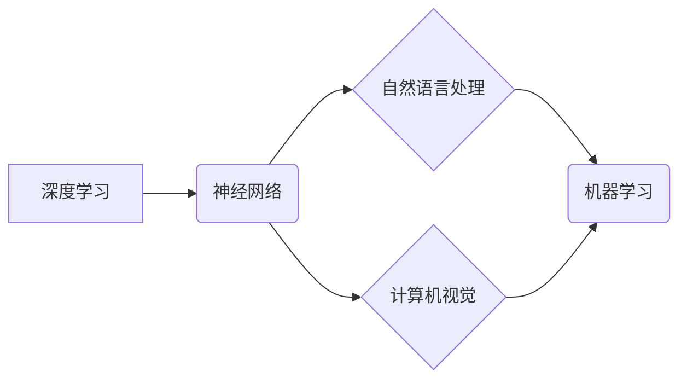

# Andrej Karpathy：人工智能的未来发展规划

> 关键词：Andrej Karpathy, 人工智能，未来展望，神经网络，深度学习，机器学习，计算机视觉，自然语言处理

## 1. 背景介绍

Andrej Karpathy 是一位杰出的计算机科学家和人工智能研究者，以其在神经网络和自然语言处理（NLP）领域的开创性工作而闻名。他的研究和博客文章常常为人工智能的未来发展规划提供了深刻的见解和洞察。本文将基于 Andrej Karpathy 的思想和当前人工智能技术的发展趋势，探讨人工智能的未来发展规划。

## 2. 核心概念与联系

### 2.1 核心概念

- **深度学习**：一种机器学习技术，通过模拟人脑的神经网络结构，学习数据的复杂模式。
- **神经网络**：由大量神经元组成的计算模型，通过调整神经元之间的连接权重来学习数据。
- **自然语言处理**：使计算机能够理解和生成人类语言的技术。
- **计算机视觉**：使计算机能够理解和解释图像和视频的技术。
- **机器学习**：使计算机通过数据学习并做出决策或预测的技术。

### 2.2 Mermaid 流程图



### 2.3 关系与联系

深度学习是机器学习的一个子集，而神经网络是实现深度学习的主要工具。自然语言处理和计算机视觉是深度学习的两个重要应用领域。这三个领域共同构成了机器学习的基础，并相互促进，推动人工智能技术的发展。

## 3. 核心算法原理 & 具体操作步骤

### 3.1 算法原理概述

人工智能的核心是算法，以下是几个关键算法的概述：

- **反向传播算法**：用于训练神经网络，通过计算损失函数的梯度来更新网络权重。
- **卷积神经网络（CNN）**：用于图像识别和计算机视觉任务。
- **循环神经网络（RNN）**：用于处理序列数据，如时间序列数据或自然语言文本。
- **长短期记忆网络（LSTM）**：RNN的一种变体，能够更好地处理长期依赖问题。

### 3.2 算法步骤详解

1. 数据收集与预处理：收集相关数据，并进行清洗、标注和格式化。
2. 模型选择：根据任务需求选择合适的模型结构。
3. 模型训练：使用训练数据对模型进行训练，调整模型参数。
4. 模型评估：使用验证数据评估模型性能，调整模型参数或结构。
5. 模型部署：将训练好的模型部署到生产环境中。

### 3.3 算法优缺点

- **优点**：深度学习模型能够自动学习数据中的复杂模式，无需人工特征工程。
- **缺点**：需要大量数据和计算资源，模型解释性较差。

### 3.4 算法应用领域

深度学习和人工智能算法在各个领域都有广泛应用，包括：

- **自然语言处理**：机器翻译、情感分析、文本摘要等。
- **计算机视觉**：图像识别、物体检测、人脸识别等。
- **医疗诊断**：疾病检测、药物研发等。
- **金融分析**：风险评估、欺诈检测等。

## 4. 数学模型和公式 & 详细讲解 & 举例说明

### 4.1 数学模型构建

深度学习模型通常基于以下数学模型：

- **激活函数**：如Sigmoid、ReLU、Tanh等。
- **损失函数**：如均方误差（MSE）、交叉熵损失等。
- **优化算法**：如梯度下降、Adam等。

### 4.2 公式推导过程

以下以神经网络中的权重更新为例进行推导：

$$
\theta_{new} = \theta_{old} - \eta \frac{\partial J}{\partial \theta}
$$

其中，$\theta_{old}$ 为旧权重，$\theta_{new}$ 为新权重，$\eta$ 为学习率，$J$ 为损失函数。

### 4.3 案例分析与讲解

以机器翻译任务为例，使用深度学习模型进行翻译的过程如下：

1. 收集大量双语文本作为训练数据。
2. 将文本数据转换为数字表示。
3. 使用神经网络进行训练，学习源语言和目标语言之间的映射关系。
4. 使用验证集评估模型性能，调整模型参数。
5. 使用测试集评估模型在未知数据上的表现。

## 5. 项目实践：代码实例和详细解释说明

### 5.1 开发环境搭建

1. 安装Python环境。
2. 安装TensorFlow或PyTorch等深度学习框架。
3. 安装相关依赖库。

### 5.2 源代码详细实现

```python
import tensorflow as tf

# 构建模型
model = tf.keras.Sequential([
    tf.keras.layers.Embedding(input_dim=vocab_size, output_dim=embedding_dim),
    tf.keras.layers.Bidirectional(tf.keras.layers.LSTM units=128)),
    tf.keras.layers.Dense(num_classes, activation='softmax')
])

# 编译模型
model.compile(optimizer='adam', loss='sparse_categorical_crossentropy', metrics=['accuracy'])

# 训练模型
model.fit(train_data, train_labels, epochs=5, validation_data=(val_data, val_labels))
```

### 5.3 代码解读与分析

以上代码使用TensorFlow框架构建了一个简单的神经网络模型，用于文本分类任务。模型包含一个嵌入层、一个双向LSTM层和一个输出层。模型使用Adam优化器和交叉熵损失函数进行训练。

### 5.4 运行结果展示

```python
# 评估模型
test_loss, test_acc = model.evaluate(test_data, test_labels, verbose=2)
print(f"Test accuracy: {test_acc}")
```

## 6. 实际应用场景

人工智能在各个领域都有广泛应用，以下是一些常见的应用场景：

- **医疗诊断**：辅助医生进行疾病诊断，提高诊断准确率和效率。
- **自动驾驶**：使汽车能够自主驾驶，提高交通安全性。
- **金融分析**：进行风险评估、欺诈检测等，提高金融行业的安全性和效率。
- **教育**：个性化推荐课程和资源，提高教育质量和效率。

## 7. 工具和资源推荐

### 7.1 学习资源推荐

- Coursera上的深度学习课程
- TensorFlow官方文档
- PyTorch官方文档

### 7.2 开发工具推荐

- TensorFlow
- PyTorch
- Keras

### 7.3 相关论文推荐

- "Deep Learning" by Ian Goodfellow, Yoshua Bengio, and Aaron Courville
- "Unsupervised Representation Learning with Deep Convolutional Generative Adversarial Networks" by Arjovsky, Chintala, Bottou

## 8. 总结：未来发展趋势与挑战

### 8.1 研究成果总结

近年来，人工智能取得了巨大的进展，深度学习模型在各个领域都取得了显著的成果。然而，人工智能仍处于发展的早期阶段，存在许多挑战需要克服。

### 8.2 未来发展趋势

- 模型小型化：提高模型的效率和可部署性。
- 多模态学习：将不同类型的数据（如图像、文本、语音）进行整合。
- 可解释性：提高模型的可解释性，使其更加可靠和可信。
- 伦理和安全性：解决人工智能带来的伦理和安全性问题。

### 8.3 面临的挑战

- 数据隐私：如何保护用户数据隐私。
- 模型偏差：如何避免模型学习到数据中的偏见。
- 解释性：如何提高模型的可解释性。

### 8.4 研究展望

人工智能的未来充满无限可能，但同时也面临着许多挑战。通过不断的研究和创新，我们相信人工智能将能够为人类社会带来更多福祉。

## 9. 附录：常见问题与解答

**Q1：什么是深度学习？**

A：深度学习是一种机器学习技术，通过模拟人脑的神经网络结构，学习数据的复杂模式。

**Q2：深度学习有哪些应用？**

A：深度学习在各个领域都有广泛应用，包括自然语言处理、计算机视觉、医疗诊断、金融分析等。

**Q3：如何学习深度学习？**

A：可以通过在线课程、书籍、官方文档等方式学习深度学习。

**Q4：深度学习有哪些挑战？**

A：深度学习面临的主要挑战包括数据隐私、模型偏差、解释性等。

**Q5：人工智能的未来发展趋势是什么？**

A：人工智能的未来发展趋势包括模型小型化、多模态学习、可解释性、伦理和安全性等。

作者：禅与计算机程序设计艺术 / Zen and the Art of Computer Programming