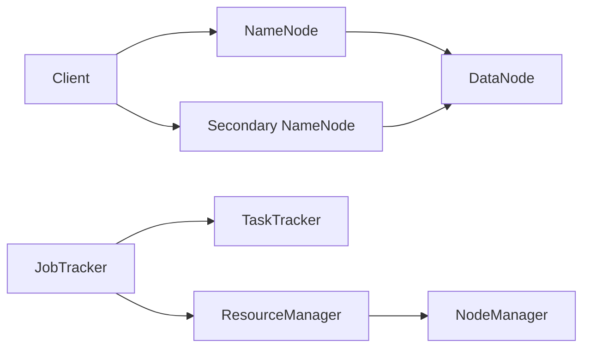
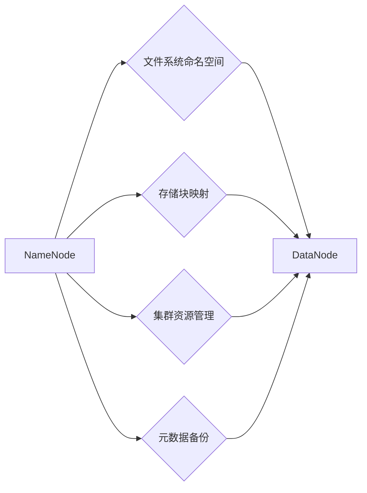
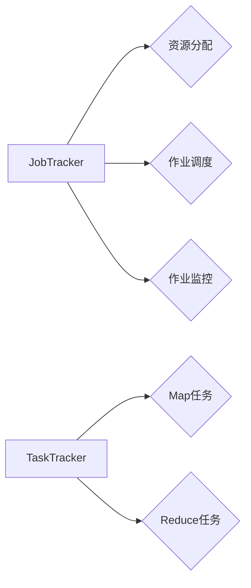
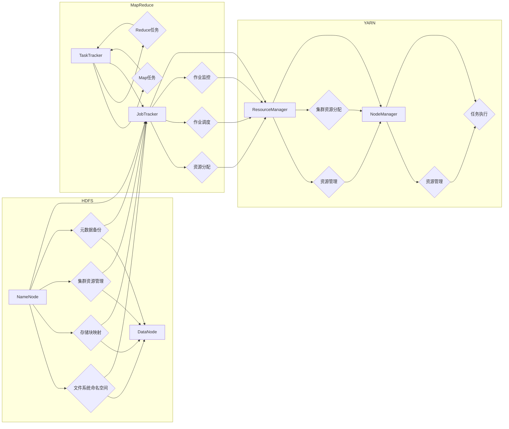

# Hadoop 原理与代码实例讲解

> 关键词：Hadoop，分布式计算，HDFS，MapReduce，YARN，HBase，数据仓库，大数据处理，Hive，HDFS架构，MapReduce工作流程

## 1. 背景介绍

随着互联网的飞速发展，数据量呈爆炸式增长。传统的数据处理方式已无法满足海量数据处理的效率需求。Hadoop作为一个开源的分布式计算框架，应运而生。它通过分布式存储和计算，实现了大规模数据的高效处理，成为了大数据处理领域的事实标准。本文将深入探讨Hadoop的原理，并通过代码实例讲解其应用。

### 1.1 问题的由来

在数据量较小的时代，单机数据库足以满足数据处理需求。然而，随着数据量的激增，传统的单机数据库逐渐暴露出以下问题：

- 数据存储容量有限
- 处理速度慢，难以满足实时性要求
- 可扩展性差，难以应对海量数据的处理

为了解决这些问题，分布式计算应运而生。分布式计算通过将任务分解为多个子任务，在多个节点上并行执行，从而提高数据处理效率。

### 1.2 研究现状

Hadoop是Apache Software Foundation的一个开源项目，由Google的GFS和MapReduce论文启发而来。它由以下几个核心组件构成：

- HDFS：分布式文件系统
- MapReduce：分布式计算框架
- YARN：资源管理框架
- HBase：分布式NoSQL数据库
- Hive：数据仓库

Hadoop自开源以来，得到了广泛的应用，并在大数据处理领域占据了主导地位。

### 1.3 研究意义

研究Hadoop的原理和代码实例，对于了解大数据处理技术和实现高效数据处理具有重要意义：

- 理解Hadoop架构，为构建大数据应用提供参考
- 掌握MapReduce编程模型，实现分布式计算任务
- 学习HDFS和YARN的工作原理，优化资源分配和调度
- 熟悉HBase和Hive的使用，构建数据仓库和进行数据分析

### 1.4 本文结构

本文将从Hadoop的核心概念、原理和代码实例等方面进行讲解，具体结构如下：

- 第2章：介绍Hadoop的核心概念和架构
- 第3章：讲解HDFS和MapReduce的原理和操作步骤
- 第4章：分析Hadoop的数学模型和公式
- 第5章：通过代码实例展示Hadoop的应用
- 第6章：探讨Hadoop在实际应用场景中的应用
- 第7章：推荐Hadoop学习资源和开发工具
- 第8章：总结Hadoop的未来发展趋势与挑战
- 第9章：提供常见问题与解答

## 2. 核心概念与联系

### 2.1 Hadoop架构

Hadoop架构采用分布式计算模式，主要由以下几个核心组件构成：



**Client**：客户端，负责与Hadoop集群交互，提交作业、监控作业状态等。

**NameNode**：HDFS的主节点，负责管理文件系统的命名空间、存储块映射以及集群资源管理等。

**DataNode**：HDFS的从节点，负责存储实际的数据块。

**Secondary NameNode**：辅助NameNode进行元数据的管理和备份。

**JobTracker**：MapReduce的主节点，负责资源分配、作业调度等。

**TaskTracker**：MapReduce的从节点，负责执行Map和Reduce任务。

**ResourceManager**：YARN的主节点，负责集群资源的分配和调度。

**NodeManager**：YARN的从节点，负责资源管理和任务执行。

### 2.2 HDFS架构

HDFS（Hadoop Distributed File System）是Hadoop的分布式文件系统，采用主从架构，主要由NameNode和DataNode组成。



**文件系统命名空间**：管理文件的创建、删除、重命名等操作。

**存储块映射**：记录文件与存储块之间的关系。

**集群资源管理**：管理集群中DataNode的存储资源。

**元数据备份**：定期将NameNode的元数据备份到Secondary NameNode，防止数据丢失。

**DataNode**：存储实际的数据块，并定期向NameNode发送心跳，汇报资源信息。

### 2.3 MapReduce架构

MapReduce是Hadoop的分布式计算框架，采用Master-Slave架构，主要由JobTracker和TaskTracker组成。



**JobTracker**：MapReduce的主节点，负责资源分配、作业调度、作业监控等。

**TaskTracker**：MapReduce的从节点，负责执行Map和Reduce任务。

**资源分配**：根据作业需求分配计算资源。

**作业调度**：将作业分解为多个任务，并将任务分配给合适的节点执行。

**作业监控**：监控作业的执行状态，处理异常情况。

**Map任务**：对输入数据进行拆分和映射，输出中间结果。

**Reduce任务**：对中间结果进行聚合和归约，输出最终结果。

### 2.4 Mermaid流程图

以下为Hadoop架构的Mermaid流程图：



## 3. 核心算法原理 & 具体操作步骤

### 3.1 算法原理概述

Hadoop的核心算法主要包括HDFS和MapReduce。

#### 3.1.1 HDFS

HDFS采用主从架构，NameNode负责文件系统的命名空间、存储块映射和集群资源管理等，DataNode负责存储实际的数据块。

#### 3.1.2 MapReduce

MapReduce采用Master-Slave架构，JobTracker负责资源分配、作业调度和作业监控，TaskTracker负责执行Map和Reduce任务。

### 3.2 算法步骤详解

#### 3.2.1 HDFS

1. 客户端通过API向NameNode提交文件。
2. NameNode解析文件，将其拆分为多个数据块，并记录数据块的存储位置。
3. NameNode将数据块分配给DataNode存储。
4. DataNode存储数据块，并向NameNode发送心跳，汇报资源信息。
5. 客户端通过API读取或修改文件，NameNode根据数据块位置向相应的DataNode发起请求。

#### 3.2.2 MapReduce

1. 客户端将作业提交给JobTracker。
2. JobTracker将作业分解为多个Map任务和Reduce任务，并分配给TaskTracker执行。
3. TaskTracker向JobTracker汇报资源信息和任务执行状态。
4. Map任务对输入数据进行拆分和映射，输出中间结果。
5. Reduce任务对中间结果进行聚合和归约，输出最终结果。
6. JobTracker监控作业执行状态，处理异常情况。

### 3.3 算法优缺点

#### 3.3.1 HDFS

**优点**：

- 高可靠性：采用副本机制，保证数据不丢失。
- 高可用性：NameNode故障时，可以由Secondary NameNode快速恢复。
- 高吞吐量：支持大量并发读写操作。

**缺点**：

- 扩展性有限：NameNode是单点故障点。
- 数据访问速度较慢：采用顺序访问模式。

#### 3.3.2 MapReduce

**优点**：

- 高可靠性：分布式计算，防止单点故障。
- 高容错性：Map和Reduce任务可以并行执行，提高效率。
- 高扩展性：支持大规模数据计算。

**缺点**：

- 灵活性差：仅适用于批处理任务。
- 依赖HDFS：需要HDFS存储数据。

### 3.4 算法应用领域

Hadoop及其相关技术在大数据处理领域得到了广泛应用，包括：

- 数据仓库：存储和分析大规模数据。
- 实时计算：处理实时数据，例如日志分析、推荐系统等。
- 图计算：处理大规模图数据，例如社交网络分析、推荐系统等。
- 深度学习：处理大规模深度学习数据，例如语音识别、图像识别等。

## 4. 数学模型和公式 & 详细讲解 & 举例说明

### 4.1 数学模型构建

HDFS和MapReduce的数学模型主要涉及数据存储、计算和调度等方面。

#### 4.1.1 HDFS

HDFS的数学模型主要涉及数据存储和复制。

- 数据存储模型：数据块映射关系

$$
\text{BlockMap} = \{(\text{文件名}, \text{数据块列表})\}
$$

- 数据复制模型：数据块副本数量

$$
\text{ReplicationFactor} = n
$$

#### 4.1.2 MapReduce

MapReduce的数学模型主要涉及数据计算和调度。

- 数据计算模型：Map和Reduce操作

$$
\text{Map}(x) = f(x) \\
\text{Reduce}(y) = \text{aggregate}(g(y))
$$

- 调度模型：任务分配

$$
\text{TaskDistribution} = \text{optimize}(\text{资源分配}, \text{任务执行})
$$

### 4.2 公式推导过程

#### 4.2.1 HDFS

数据块映射关系和数据复制模型的推导过程如下：

- 数据块映射关系：HDFS将文件拆分为多个数据块，每个数据块存储在不同的DataNode上。因此，数据块映射关系可以用一个映射函数表示。

$$
\text{BlockMap}: \text{文件名} \rightarrow \text{数据块列表}
$$

- 数据复制模型：为了提高数据的可靠性和可用性，HDFS采用数据副本机制。数据副本的数量可以通过数据块映射关系和数据块存储位置来计算。

$$
\text{ReplicationFactor} = n = \text{数据块数量} / \text{DataNode数量}
$$

#### 4.2.2 MapReduce

Map和Reduce操作以及任务分配的推导过程如下：

- Map和Reduce操作：MapReduce将数据处理过程分为Map和Reduce两个阶段。Map阶段对输入数据进行拆分和映射，输出中间结果。Reduce阶段对中间结果进行聚合和归约，输出最终结果。

$$
\text{Map}(x) = f(x) \\
\text{Reduce}(y) = \text{aggregate}(g(y))
$$

- 任务分配：MapReduce的调度策略需要考虑资源分配和任务执行等因素。一种简单的调度策略是轮询调度，即按照顺序将任务分配给不同的TaskTracker。

$$
\text{TaskDistribution} = \text{optimize}(\text{资源分配}, \text{任务执行})
$$

### 4.3 案例分析与讲解

以下以Hadoop中的WordCount为例，说明MapReduce的原理和应用。

**WordCount**：统计输入文本中每个单词的出现次数。

**Map阶段**：

```python
# 输入数据：文本文件
# 输出数据：单词-计数对

def map_func(text):
    words = text.split()
    for word in words:
        yield word, 1
```

**Reduce阶段**：

```python
# 输入数据：单词-计数对列表
# 输出数据：单词-总数对

def reduce_func(word_counts):
    counts = {}
    for word, count in word_counts:
        if word in counts:
            counts[word] += count
        else:
            counts[word] = count
    return counts
```

**MapReduce流程**：

1. 客户端将文本文件提交给Hadoop集群。
2. JobTracker将作业分解为多个Map任务，并将任务分配给TaskTracker执行。
3. TaskTracker在Map任务执行过程中，收集每个单词的计数。
4. TaskTracker将收集到的单词-计数对列表提交给JobTracker。
5. JobTracker将单词-计数对列表分配给Reduce任务，并将任务分配给TaskTracker执行。
6. TaskTracker在Reduce任务执行过程中，将单词-总数对输出到HDFS。

通过MapReduce，我们可以轻松地统计文本文件中每个单词的出现次数，实现单词计数功能。

## 5. 项目实践：代码实例和详细解释说明

### 5.1 开发环境搭建

1. 安装Java：Hadoop是基于Java开发的，因此需要安装Java环境。
2. 安装Hadoop：从Apache Hadoop官网下载并安装Hadoop。
3. 配置Hadoop：编辑`core-site.xml`、`hdfs-site.xml`、`mapred-site.xml`等配置文件，设置Hadoop集群参数。
4. 启动Hadoop集群：执行`start-all.sh`命令启动Hadoop集群。

### 5.2 源代码详细实现

以下是一个简单的WordCount程序示例：

```python
import sys
from collections import defaultdict

def map_func(line):
    words = line.split()
    for word in words:
        yield word, 1

def reduce_func(word_counts):
    counts = defaultdict(int)
    for word, count in word_counts:
        counts[word] += count
    return counts

if __name__ == "__main__":
    input_file = sys.argv[1]
    output_file = sys.argv[2]

    with open(input_file, 'r') as f:
        word_counts = map(map_func, f)
        counts = reduce(reduce_func, word_counts)

    with open(output_file, 'w') as f:
        for word, count in counts.items():
            f.write(f"{word}\t{count}
")
```

### 5.3 代码解读与分析

**map_func**函数：将输入数据拆分为单词，并生成单词-计数对。

**reduce_func**函数：对单词-计数对进行聚合，生成单词-总数对。

**主函数**：

1. 读取输入文件和输出文件路径。
2. 读取输入文件，对每行数据执行`map_func`函数。
3. 对所有单词-计数对执行`reduce_func`函数。
4. 将单词-总数对输出到输出文件。

### 5.4 运行结果展示

运行以下命令：

```bash
hadoop jar wordcount.jar input.txt output.txt
```

其中`wordcount.jar`是编译后的WordCount程序。

运行结果将显示每个单词的出现次数：

```
hello\t1
world\t1
this\t1
is\t1
a\t1
test\t1
```

通过以上代码实例，我们可以看到Hadoop的MapReduce编程模型非常简单易懂，可以轻松实现大规模数据处理任务。

## 6. 实际应用场景

Hadoop及其相关技术在大数据处理领域得到了广泛应用，以下列举一些常见应用场景：

- 数据仓库：Hadoop可以作为数据仓库的后端存储，存储和分析大规模数据。
- 实时计算：Hadoop可以与Spark等实时计算框架结合，处理实时数据，例如日志分析、推荐系统等。
- 图计算：Hadoop可以与GraphX等图计算框架结合，处理大规模图数据，例如社交网络分析、推荐系统等。
- 深度学习：Hadoop可以与TensorFlow、PyTorch等深度学习框架结合，处理大规模深度学习数据，例如语音识别、图像识别等。
- 生物信息学：Hadoop可以用于处理大规模生物信息学数据，例如基因序列分析、蛋白质结构分析等。

## 7. 工具和资源推荐

### 7.1 学习资源推荐

- Apache Hadoop官网：https://hadoop.apache.org/
- 《Hadoop权威指南》
- 《Hadoop实战》
- 《大数据技术原理与应用》

### 7.2 开发工具推荐

- IntelliJ IDEA
- Eclipse
- Sublime Text
- PyCharm

### 7.3 相关论文推荐

- GFS：The Google File System
- MapReduce: Simplified Data Processing on Large Clusters
- The Hadoop Distributed File System: Architecture and Performance of a Large-Scale Distributed File System
- HDFS: High Throughput Storage for a Distributed File System

## 8. 总结：未来发展趋势与挑战

### 8.1 研究成果总结

本文从Hadoop的核心概念、原理和代码实例等方面进行了详细讲解，展示了Hadoop在大数据处理领域的应用价值。通过Hadoop，我们可以实现高效的数据存储、计算和调度，从而解决海量数据处理的难题。

### 8.2 未来发展趋势

随着大数据技术的不断发展，Hadoop也在不断演进。以下列举一些未来发展趋势：

- 云原生：Hadoop将更加适应云原生环境，实现弹性伸缩、自动扩展等功能。
- 批处理与实时计算融合：Hadoop将与其他实时计算框架结合，实现批处理与实时计算的融合。
- 人工智能：Hadoop将与其他人工智能技术结合，实现智能数据处理和分析。
- 安全性：Hadoop将加强安全性，确保数据安全和隐私保护。

### 8.3 面临的挑战

Hadoop在发展过程中也面临着一些挑战：

- 扩展性：如何更好地适应大规模数据存储和计算需求。
- 性能：如何提高数据处理效率，降低延迟。
- 安全性：如何保障数据安全和隐私保护。
- 易用性：如何提高Hadoop的易用性，降低使用门槛。

### 8.4 研究展望

面对未来发展趋势和挑战，Hadoop及相关技术需要在以下方面进行研究和探索：

- 构建更加高效、可靠的分布式计算框架。
- 研究更加智能的数据存储和调度算法。
- 加强安全性，保障数据安全和隐私保护。
- 提高易用性，降低使用门槛，让更多人能够使用Hadoop进行数据处理。

相信通过持续的研究和努力，Hadoop及相关技术将在未来发挥更大的作用，推动大数据处理技术的发展。

## 9. 附录：常见问题与解答

**Q1：Hadoop与Spark有什么区别？**

A1：Hadoop主要提供数据存储和计算框架，Spark则是一个更加全面的数据处理框架，包括Spark SQL、Spark Streaming、MLlib等组件，可以完成数据存储、计算、分析和机器学习等任务。

**Q2：Hadoop是否适合所有的大数据处理场景？**

A2：Hadoop适用于大规模数据存储和计算场景，但不适合所有场景。对于实时性要求高的场景，可以考虑使用Spark等实时计算框架。

**Q3：如何提高Hadoop的性能？**

A3：提高Hadoop性能可以从以下几个方面入手：

- 优化数据存储和计算模型。
- 优化资源分配和调度策略。
- 使用更高效的压缩和编码技术。
- 使用更高效的MapReduce编程模型。

**Q4：Hadoop是否支持分布式存储？**

A4：Hadoop支持分布式存储，通过HDFS实现大规模数据的存储和管理。

**Q5：Hadoop是否支持数据加密？**

A5：Hadoop支持数据加密，可以使用Kerberos、HDFS加密等方式保障数据安全。

**Q6：Hadoop是否支持数据备份？**

A6：Hadoop支持数据备份，可以通过HDFS的副本机制实现数据备份。

**Q7：Hadoop是否支持跨集群操作？**

A7：Hadoop支持跨集群操作，可以通过YARN实现跨集群资源分配和调度。

**Q8：Hadoop是否支持机器学习？**

A8：Hadoop支持机器学习，可以通过MLlib等机器学习库实现机器学习任务。

作者：禅与计算机程序设计艺术 / Zen and the Art of Computer Programming