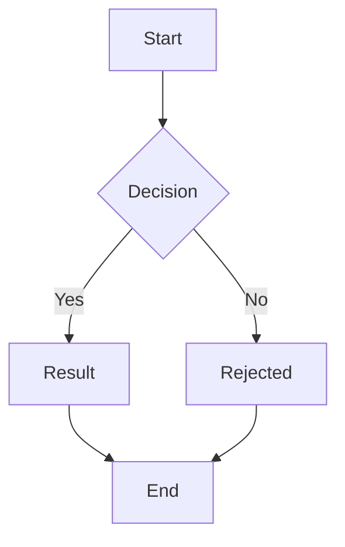
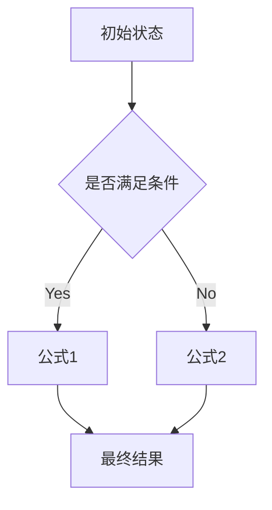

# Mermaid 语法与自然语言描述

> 关键词：Mermaid, Markdown, 流程图, 文档，图表，技术文档

## 1. 背景介绍

Mermaid 是一种基于 Markdown 的文本格式，用于绘制各种图表，如流程图、时序图、甘特图等。它因其简单易用、语法简洁、渲染效果良好而受到广大开发者和文档编写者的喜爱。本文将深入探讨 Mermaid 语法，并结合自然语言描述，帮助读者更好地理解和使用 Mermaid。

## 2. 核心概念与联系

### 2.1 Mermaid 简介

Mermaid 是一种基于文本的图表绘制工具，允许开发者使用简单的文本语法描述图表结构，并将其渲染成精美的图表。它支持多种图表类型，包括：

- 流程图
- 时序图
- 甘特图
- 语法图
- 类图
- 数据流图
- 依赖图

### 2.2 Mermaid 与 Markdown 的关系

Mermaid 是 Markdown 的一种扩展，可以在 Markdown 文档中嵌入 Mermaid 语法，直接生成图表。这使得 Mermaid 成为编写技术文档、博客文章、演示文稿等文档的理想工具。

### 2.3 Mermaid 流程图原理和架构

Mermaid 的流程图使用以下语法：



以下是其对应的 Mermaid 流程图：


Mermaid 流程图的基本架构如下：

- **graph**：定义图表的类型和方向。
- **节点**：使用不同的符号表示不同的节点类型，如 A[Start] 表示开始节点。
- **连接线**：使用箭头表示节点之间的关系。
- **条件判断**：使用 {Decision} 等符号表示条件判断节点。
- **子图**：使用 subgraph 定义子图，用于组织复杂的流程图结构。

## 3. 核心算法原理 & 具体操作步骤

### 3.1 算法原理概述

Mermaid 使用解析器解析 Mermaid 语法，并将其转换为图形化表示。解析过程包括以下步骤：

1. **词法分析**：将 Mermaid 代码分割成单词和符号。
2. **语法分析**：根据 Mermaid 语法规则，将单词和符号组合成语法树。
3. **渲染**：将语法树转换为 HTML/CSS，生成图表。

### 3.2 算法步骤详解

1. **初始化解析器**：创建一个 Mermaid 解析器实例。
2. **解析 Mermaid 代码**：将 Mermaid 代码传递给解析器，进行词法分析和语法分析。
3. **生成语法树**：根据分析结果生成语法树。
4. **渲染语法树**：将语法树转换为 HTML/CSS，生成图表。
5. **输出图表**：将生成的图表输出到目标位置，如 Markdown 文档、网页等。

### 3.3 算法优缺点

**优点**：

- 简单易用：Mermaid 语法简洁，易于学习和使用。
- 高度自定义：支持多种图表类型，满足不同需求。
- 良好的渲染效果：生成的图表美观大方，易于阅读。

**缺点**：

- 语法有限：Mermaid 语法相对简单，某些复杂图表可能难以表达。
- 依赖第三方库：Mermaid 需要依赖第三方库进行渲染，可能存在兼容性问题。

### 3.4 算法应用领域

Mermaid 在以下领域有广泛的应用：

- 技术文档：绘制系统架构、流程图、数据流图等。
- 博客文章：插入图表说明技术概念、算法原理等。
- 演示文稿：展示项目进度、流程步骤等。
- 代码注释：注释代码逻辑、流程等。

## 4. 数学模型和公式 & 详细讲解 & 举例说明

### 4.1 数学模型构建

Mermaid 不直接支持数学公式的绘制，但可以通过嵌入数学公式来实现。以下是一个使用 LaTeX 语法嵌入数学公式的例子：

```markdown
Mermaid 的数学公式通常使用 LaTeX 语法。
例如：$E = mc^2$
```

### 4.2 公式推导过程

公式推导过程可以使用 Mermaid 的时序图来表示：



### 4.3 案例分析与讲解

以下是一个使用 Mermaid 绘制数学公式案例：

```markdown
Mermaid 的数学公式可以嵌入到文本中。
例如：$E = mc^2$，这个公式描述了能量和质量的关系。
```

## 5. 项目实践：代码实例和详细解释说明

### 5.1 开发环境搭建

要使用 Mermaid，您需要以下开发环境：

- Markdown 编辑器
- Mermaid 渲染器（如 Chrome 浏览器插件、在线工具等）

### 5.2 源代码详细实现

以下是一个使用 Mermaid 绘制流程图的例子：

```markdown

```

### 5.3 代码解读与分析

- `graph TD`：定义图表方向为自上而下。
- `A[Start]`：定义开始节点，`Start` 为节点名称。
- `B{Decision}`：定义条件判断节点，`Decision` 为节点名称。
- `B -->|Yes| C[Result]`：定义从节点 B 到节点 C 的有向边，`Yes` 为判断条件。
- `B -->|No| D[Rejected]`：定义从节点 B 到节点 D 的有向边，`No` 为判断条件。
- `C --> E[End]`：定义从节点 C 到节点 E 的有向边。
- `D --> E`：定义从节点 D 到节点 E 的有向边。

### 5.4 运行结果展示

运行上述代码，将得到以下流程图：


## 6. 实际应用场景

### 6.1 技术文档

在技术文档中使用 Mermaid 可以清晰地展示系统架构、流程图、数据流图等，提高文档的可读性和易理解性。

### 6.2 博客文章

在博客文章中使用 Mermaid 可以帮助读者更好地理解技术概念、算法原理等，提升文章的趣味性和吸引力。

### 6.3 演示文稿

在演示文稿中使用 Mermaid 可以清晰地展示项目进度、流程步骤等，提高演示效果。

### 6.4 未来应用展望

随着 Mermaid 的不断发展，其应用场景将更加丰富。未来，Mermaid 可能会支持更多图表类型、更丰富的语法功能，以及与其他工具的集成，为开发者提供更加便捷的图表绘制体验。

## 7. 工具和资源推荐

### 7.1 学习资源推荐

- Mermaid 官方网站：https://mermaid.ink/
- Mermaid GitHub 仓库：https://github.com/mermaid-js/mermaid
- Mermaid 图谱示例：https://mermaid.ink/example/

### 7.2 开发工具推荐

- Markdown 编辑器：Typora、Visual Studio Code、Sublime Text 等
- Mermaid 渲染器：Chrome 浏览器插件、在线工具、代码库等

### 7.3 相关论文推荐

- 无直接相关论文，但可以参考 Markdown、HTML、CSS 相关的资料。

## 8. 总结：未来发展趋势与挑战

### 8.1 研究成果总结

本文深入探讨了 Mermaid 语法和自然语言描述，从背景介绍、核心概念、算法原理、项目实践等方面进行了全面阐述。通过学习本文，读者可以更好地理解和使用 Mermaid，并将其应用于实际项目中。

### 8.2 未来发展趋势

- Mermaid 将支持更多图表类型和语法功能。
- Mermaid 将与其他工具和框架进行集成。
- Mermaid 将在更多领域得到应用。

### 8.3 面临的挑战

- Mermaid 语法相对简单，难以表达复杂的图表结构。
- Mermaid 的渲染效果受限于 HTML/CSS。

### 8.4 研究展望

- 进一步完善 Mermaid 语法，支持更复杂的图表结构。
- 提高 Mermaid 的渲染效果，兼容更多浏览器和设备。
- 探索 Mermaid 在更多领域的应用。

## 9. 附录：常见问题与解答

**Q1：Mermaid 与其他图表绘制工具相比有哪些优势？**

A: 相比其他图表绘制工具，Mermaid 具有以下优势：

- 简单易用：Mermaid 语法简洁，易于学习和使用。
- 高度自定义：支持多种图表类型，满足不同需求。
- 良好的渲染效果：生成的图表美观大方，易于阅读。

**Q2：如何将 Mermaid 图表嵌入到 Markdown 文档中？**

A: 将 Mermaid 代码放在 ```mermaid ``` 标签之间即可。

**Q3：Mermaid 支持哪些图表类型？**

A: Mermaid 支持以下图表类型：

- 流程图
- 时序图
- 甘特图
- 语法图
- 类图
- 数据流图
- 依赖图

**Q4：如何改进 Mermaid 的渲染效果？**

A: 可以通过自定义 CSS 样式来改进 Mermaid 的渲染效果。

---

作者：禅与计算机程序设计艺术 / Zen and the Art of Computer Programming